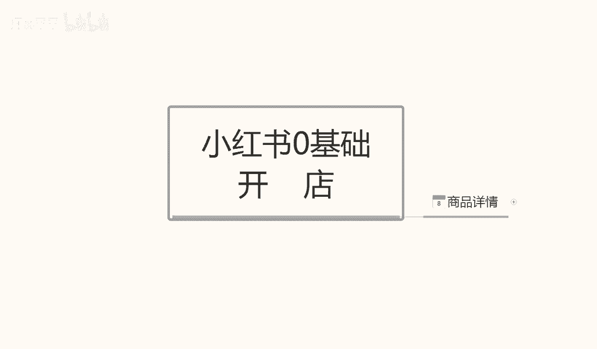
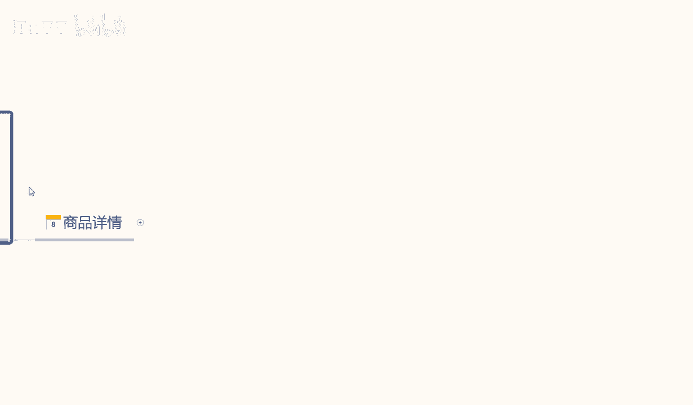
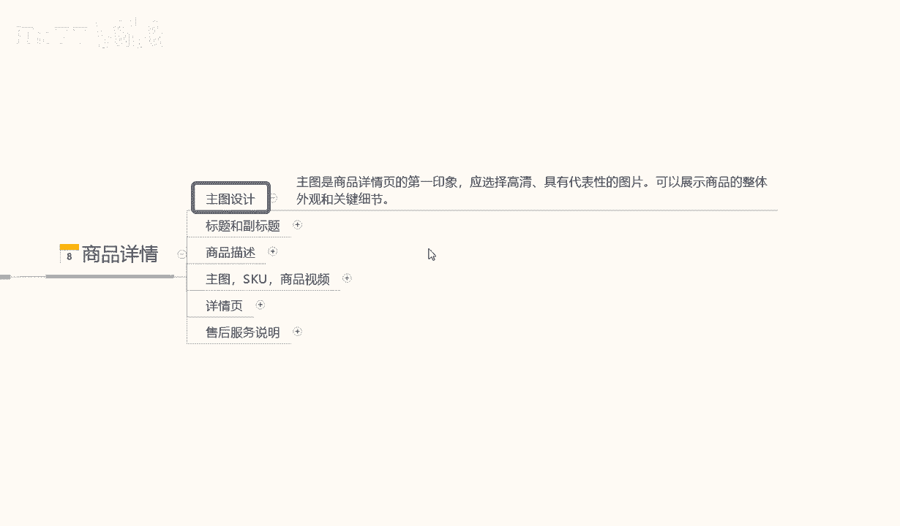
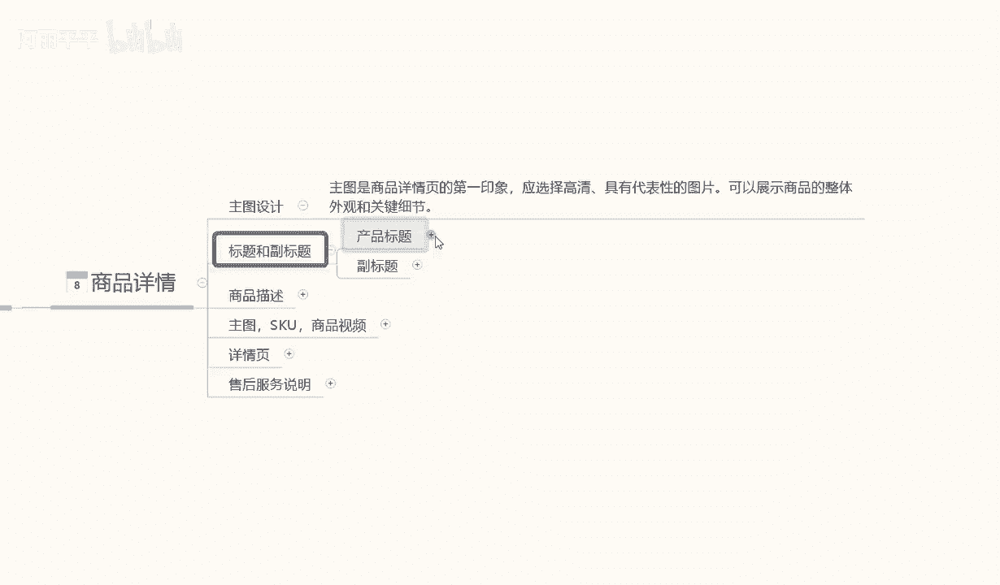
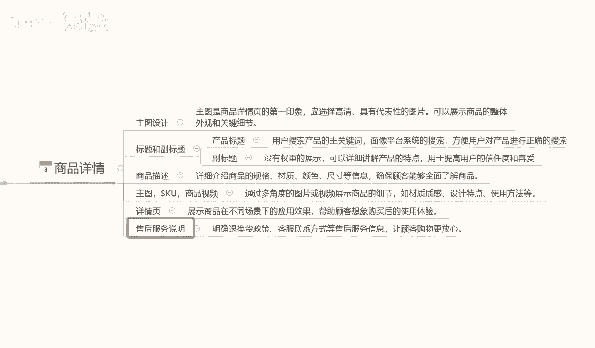
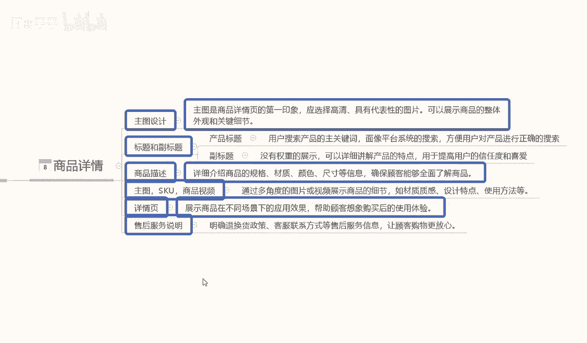
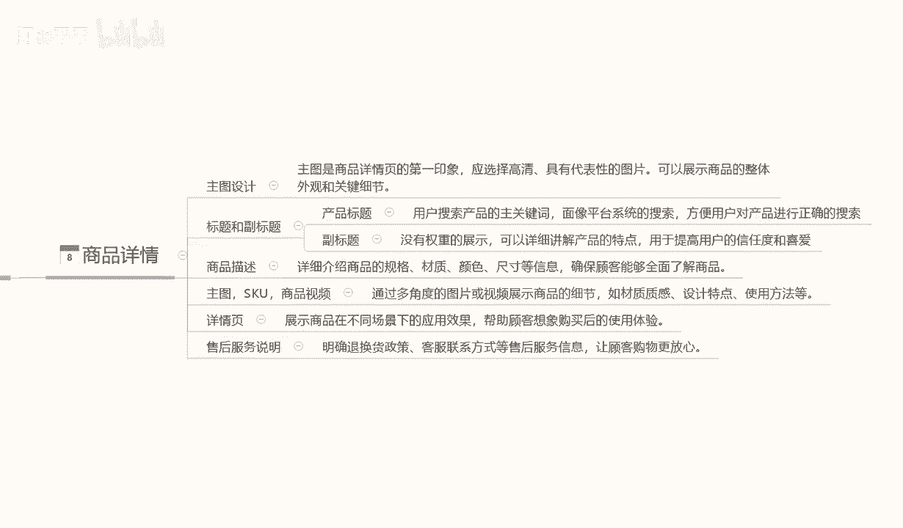

# 【2024B站最强小红书体运营教程】全B站最良心的小红书开店运营教程！小红书体开店，起号真的快，赶快点赞收藏起来 - P25：7.小红书商品详情 - 阿丽平平 - BV1CH4qeqE2e

大家好，今天给大家分享一个小红书，零基础开店第八课时啊，商品的一个详情怎么制作。

呃课程我们呢就直接进入正题，商品详情制作啊，这里面的话包含的内容稍微会多一点，而且这个呢是比较适合我们去做单店操作的啊，因为店群的话，它的整体的一个模式的话是嗯非常容易的。

所以说我在这里呢就不给大家多讲了，这里呢主要是给大家讲解一下，我们单店怎么去操作，包括后续的一些内容的话，我都会涉及到单店的一个详细讲解，那这节课呢我们就来了解一下，商品的一个详情的一个设计啊。

它这个里里面的话主要包括了一个主图，设计，一个标题和副标题，然后是商品描述主图SSKU啊，商品视频，后续的一个详情页和售后服务的一个说明，这里面呢我给大家先从主图的一个设计开始啊，主图设计的话。

这个他这个主图设计啊，小红书的一个主图设计的话，其实和其他的平台也好，或者是其他的，只要说是做过电商的人，他了解这个内容的话，都比较了解主图的一个设计，这里呢主图设计的话呃。

商品详情第一章组图图片是最重要的，后面四张啊他反而不那么重要了，所以说我们在做商品主图的时候啊，第一张他是最吸引眼球的，你的产品怎么样啊，就通过这张图片展示给用户了，如果说你的图片不行。

那么你这个店的话肯定是不好做起来的，所以说组图设计里面最重要的一点，就是第一章产品的一个主图，这个主图我们怎么去设计啊，这里呢给大家明确几个点，第一个啊，根据产品的不同的话。

我们组图设计的印象也是不一样的，如果说我们是做批发的，做那种小商品搞批发，或者说是我们一下子卖很多商品那种的话，他的文案就要多一点，小红书本来就是文案和视频双向都可以发的，但是它多半都是以文案为主。

那么如果说我们做批发做之类的，他的文案就要多一点，如果说我们是单单卖产品，比方说服装啊，家具啊等等，鞋帽啊，衣服啊或者是精致的小饰品的话啊，我们就一定不要在文案上，文案上面加非常多的文字啊。

你加几个吸引的主文字就可以，或者是不加啊，如果说你对你的图片内容非常相信的话，最好是不加，就是一张地图啊，把我们的产品的一个最好的一个角度拍摄出来，放上去就可以了，因为第一张主图吸引了以后。

别人拆就会观看你的第二张，第三张第四张，不然的话你后面的图片是没用的，所以说主图商品详解第一章的话是最重要的，这里面有几个点啊，第一个选择高清具有代表性的图片啊，可以展示商品整体的外观和外观细节。

你可以用一些文字来描述这些产品的优点，在什么地方，但是文字不要多，整体文字的话，你占屏幕的话不要超过1/5，除非说是我们做批发或者说是做这种小生呃，非常小的零零部件啊。

你的文字文字描述啊之类的可以多一点，但是正常来说的话，大类目的产品或者中小型类目的产品的话，它都不涉不涉及到满文，就是满屏文字的这种文案的啊，所以说我们产品主图啊一定要整洁干净啊，尽量少上在上面打字。

这个呢就是主图设计的一个初衷啊，大家一定要注意了啊，主图是商品详情的第一印象啊，三秒钟就能判断这个客户对你这个产品，你能不能从第一时间在这些商品里面，选中你的产品，这才是重点啊。

也是我们整个店铺最重要的一环，就是我们的一个组图设计，一定要有吸引力。

第二个是标题和副标题。

产品标题和副标题的话，他是虽然说都是两个标题啊，但是它的作用是不一样的，在这里我给大家讲解一下产品标题的话，它是用户搜索产品关键词，小红书里面虽然说它是以文案为主，但是它也有一个商品的搜索关键词。

但是他搜索关键词的话只是说权重没有那么高，但正常对于在小红书里面，买商品的用户来说的话，呃，可能文案的一个用户占比的话，可能占70%，商品搜索主关键词的话，或者说搜索同类目的一个产品的话。

它可能只占30%，他虽然说没有整体文案，小红书文案的一个视觉效果和冲击效果大的话，但是产品的一个标题也是比较重要的一环，它起码还有30%的流量啊，所以大家一定要注意了。

标题的话我们去做的时候还是精细化一点好啊，用户搜索产品关键词，主关键词啊，像平台的一个搜索系统的话，方便用户对产品进行搜索，正确的话，我们里面包含一到两个主关键词，其他的全部用那个呃长尾词替代就可以了。

但是这个里面有一点大家记住啊，不要对切，就是尽量不要有重复的字眼，出现在这60个字符里面啊，这个就是产品的标题，这个是让用户搜索的啊，这是产品标题的一个特性，第二个是副标题的一个特性。

副标题的话它是没有权重的，它跟我们那个产品标题不一样，产品标题它还可以给我们引流，但是副标题的话它没有这个作用啊，副标题他是没有权重转世的，他呢只是说详细的介绍了，我们产品的一个特点啊。

用于提高用户的信任度和成交率的，这个就看我们自己怎么去编辑了啊，根据产品不同，你们编辑的方式也是不一样，所以说在这里我就不做多过多讲解啊，也就是不跟大家分享案例之类的。

怎么去做我们的这个服务产品的一个标题了啊，第三个呢就是商品的一个描述，商品描述的话，这个这个的话大家一定要注意了，详细的一个商品介绍是至关重要的，因为我们商品介绍不详细的话。

他的系统判定我们可能会是虚假宣传，第一个需要协商，第二个是呃我们的描述和我们的产品不符啊，遭到投诉以后的话，我们产品会下降，也就是我们所有的操作的话，基本上全部报废了。

所以说我们在介绍商品的一个详细的规格，材质颜色尺寸，或者说是我们的一个大小啊，范围之类的，一定要详细啊，确保顾客能够全面了了解商品，如果说顾客了解商品全面了，但是他收到的货，或者说是被我们淘宝系统不嗯。

被小红书的一个系统检测出来以后，对整个的一个商品就直接没用了啊，所以大家一定要注意这一点，小红书也好，淘淘宝也好，拼多多也好，包括京东也好，他都是一样的，所有的一个商品的一个描述不符的话。

系统它都是可以强制给你把产品下架的，后面的就是主图SSKU和商品视频，这个的话其实就比较好理解了，他只是说嗯主图主图的一个设计，主图里面的话，我刚刚已经给大家讲解了，我这里就不多说。

SKU就是我们商品里面的单品，多品种的一个选项而已，比方说颜色选项啊，款式选项啊，大小选项啊，价格选项啊等等这些一些分类而已，呃怎么去操作，看我们产品你自己有什么产品，自己有什么格款式格式。

自己把它编辑上去就行，这个呢也不过多说，然后这里面有一个商品视频，小红书的商品视频的话，大家做的时候呃，不要做太大了啊，大概在15秒左右就可以了，太大的话怎么说啊，影响别人观看的一个网页速度。

因为小红书别人打开你产品的话，他整个一个系统不是很健全，他的反应有点慢，那当然这个跟我们网络是手机，网络上面流速也有关系啊，你4G网络和5G网络它的流速都不一样的，但是说你的视频太大了。

一会儿别人更新慢了以后，你可等个两秒钟进不去啊，他可能就不会看你的产品了，就直接划走了，所以说视频的话，大小尽量保存在15秒左右就可以了，包括后面的一个详情页，制作也是一样的，图片内容可以放。

但是不用放太多，然后小红书的一个详情，详情的话就是展示我们整个商品的一个效果，也就是把主图把它分类，把它分开，然后呢，再到里面插入额外的几张详情页就可以了，就是我们产展示产品的一些细节特征。

优点就可以了，整个图片的话大概保存在12张左右就行，12张以内啊，九张以上，你要产品图片多的话，可能15张，17张，18张也行，但是整体的话你的详情页多一点的话，那么你的商品视频时间要少一点啊。

大家一定要把握这个度，整体的话看我们店铺单品的话，嗯整个浏览下来，包括视频加图片，全部所有的综合数据，浏览下来的话，停留时间大概在40秒钟左右就可以了，太长的话不好啊，所以说这个就是详情页的一个制作。

同时最后一点啊，售后服务说明，为什么说在这个地方要给大家讲解一下呢，束缚说明啊，这个是在详情页里面的，而且是放在最后一张详情页啊，我们自己单独做一个那个售后的一个详情，就是我们的产品发货，包括7。

56啊之类的，然后再做一个额外的证明，因为这个额外测评的话是对用户的一个保障，提高我们整个店铺的一个成交率的，这个额外说明的话，就是说我们在额外声明里面的话，要清楚的详细写上我们的一个售后证明。

包括退款信息也好，更换货信息也好啊，发货时间，或者说是嗯嗯快递通过什么方式送达啊，这个都要详细备注，让别人有一种安全感，这个呢就是后售后服务的说明，如果说我们详情页里面没有，这个售后服务说明的话。

他可能会自动的认为，我们的产品是24小时发货啊等等，一些我们其他自己设置的东西，或者是七天无理由退款，到时候涉及到了售后，跟别人用户产生一个纠纷的话，投诉一多，或者说是别人给你两个差评啊，会很难受的啊。

所以没必要我们提前把售后服务说明打上去，我们再去跟别人就说涉及到了小红书售后的话，别人投诉我们，我们也可以去找管理把这些投诉啊，呃差评啊之类的，在我们的申请范围以内，我们是可以把它算出的啊。

所以说大家一定要了解这个点，有这个东西，就说就相当于给我们自己做了一个保证，做了一个证据，也是对客户的一种保证。

好吧，这个呢就是整个商品详情，我们需要注重的一个点啊。

那么这节课的内容呢也就到这里啊，这节课主要是给大家讲解了一下，我们整个商品详情怎么去制作啊，需要注意的点和我们自己编辑的一些内容啊，怎么去编辑，那么下节课呢给大家详细讲解一下。

我们整个小红书的一个流量运行模式啊。

