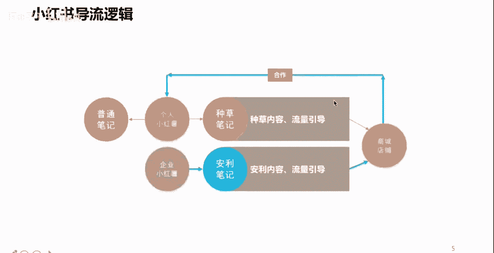
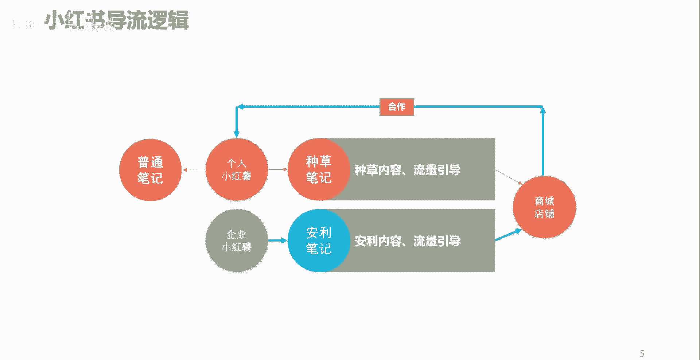
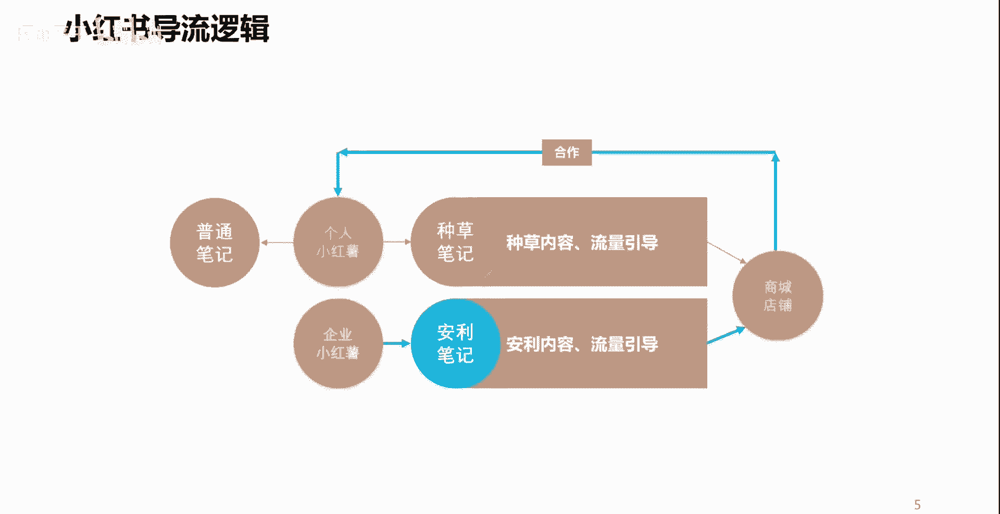
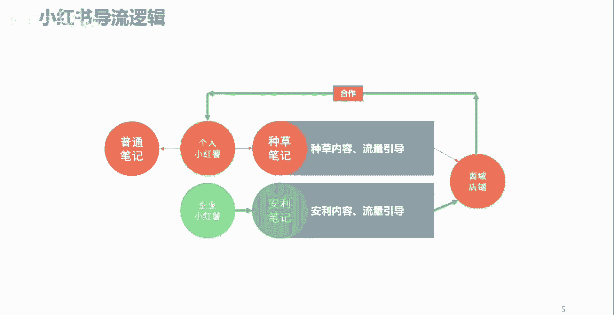
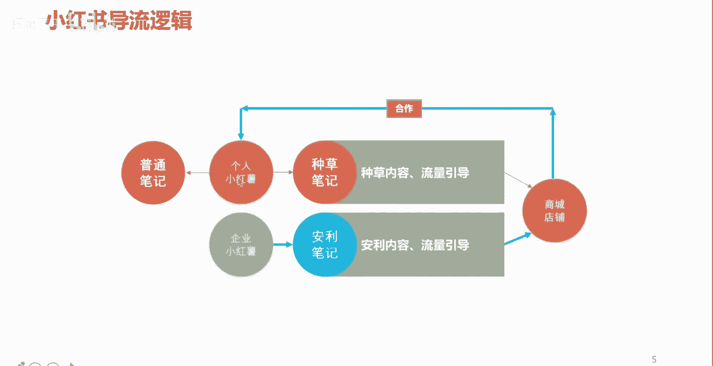
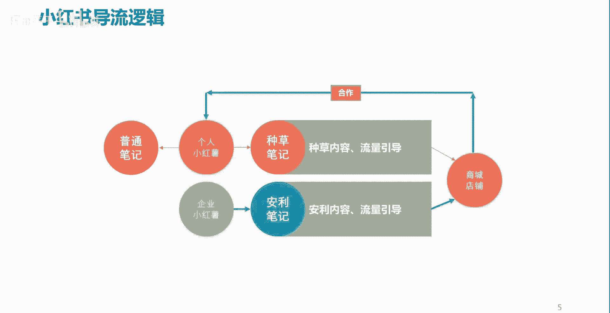

# 【2024B站最强小红书体运营教程】全B站最良心的小红书开店运营教程！小红书体开店，起号真的快，赶快点赞收藏起来 - P5：P4小红书的导流营销逻辑 - 阿丽平平 - BV1CH4qeqE2e

好，那么我们先简单的了解一下，小红书的一个什么呢。

导流的一个逻辑，我们看一下我们在小红书上面呢。

把一个个人呢我们把它叫做小红薯是吧。

当然呢企业也可以叫小红书啊，我们做一个个人的一个小红书用户。

我们可以去分享一些内容，那么在小红书上面呢这个内容呢它叫做笔记啊。

叫做笔记。

为什么叫笔记呢，你想想第一个小红书呢。

希望自己的这样一些用户呢，能够持续性的啊去创作一些什么呢。

商品或者是一些购物的一些体验。

一些分享，所以呢你每一次购买一些东西。

或者看到一些好物啊，或者是体验到了一些好的商品，你是不是要记录啊。

是不是要分享呀，所以呢这个呢他就把这个叫成了一个笔记。

那么个人小红书啊，个人小红薯呢它可以做。

比如说我可以针对于某一个商家的产品。

针对于某一个单品，或者是针对于某一系列的产品商品。

我可以去进行一个什么呢分享啊。

比如说我买了一件上衣，这件上衣穿上去之后呢。

哎显白显瘦，材质也好，面料也舒服，款式呢颜色百搭对吧。

那么像这种衣服买回来之后呢。

我觉得挺不错的，哎我就可以通过小红书去进行一个分享啊。

让更多的人看到这个笔记之后呢，可以呢去关注我买的这个商品。

哎这个商品真不错哈，哎在哪儿买的呢。

我也去看一下是吧，哎就可以起到这样一个作用。

那么这样的流量就很容易来了对吧，他通过这个笔记呢相当于就是在辐射哎。

对这方面感兴趣的一个人。

然后呢去到什么呢，看到商家的这样一个商品。

甚至说什么呢，去到商家的这个店铺或者商城里头，然后呢进而产生销售。

同样如果是一个个人小红书做这种内容。

做得非常的优秀啊，做的很好啊。

也会呢被一些商家呢主动性的关注到啊，进而呢去做一些合作啊。

比如说我是一个做美妆的一个小红薯。

我做的内容呢被一些商家呢看到了，这些商家呢还认为我的小红书这个美妆的笔记。

内容呢写的还算是有质量。

再加上呢这些商家呢。

他本身呢他也是做这种什么呢美妆各户类的，所以呢他可能就会跟我进行一个合作类的沟通。

那么这样呢也会产生一种什么呢。

个人创作的一种变现。

当然啦在小红书上面呢还有另外一种身份，另外一种性质的一个账号啊。

这也是常见的第二种。

第一种是个人，第二种就是企业类的小红书啊，企业类。

那么企业链类呢，一般情况下呢是针对于自己的一些商品呢。

可以去进行一些推荐介绍啊，或者是我们用个网络词啊。

就是安利给你啊。

那么这样一些内容呢就是什么呢，企业呢可以通过这样一个平台呢。

向我们的用户啊，向企业的目标消费者去进行。

一个商品的一些什么呢利好或者是什么呢。

一些优点价值点的一些释放，从而呢让自己的目标用户哎。

目标消费者呢哎能够看到这个内容。

看到这个内容之后呢，会对自己的产品呢产生一定的什么呢。

兴趣或者欲望，从而呢我们能够把这些目标用户。

目标消费者呢导流到企业自己的店铺。

或者是商城当中，进而产生销售啊。

当然我这儿呢还写了一种有的个人小红书呢。

他做这个内容，他不为带货。

也不指望着什么合作，可能他就是纯粹的把小红薯呢啊。

把把小红书呢当成了一个什么呢，当成了一个自己记录或者是分享的一个平台啊。

每次呢去写一些普通的一些笔记啊。

去写一写，分享一下，或者说有的人呢把小红书呢。

当成一个自媒体在做啊，这种情况呢也是有的。

我们也是经常能看到，但是从专业的角度呢，我们应该发挥小红书本质的一个最根本的价值。

就是通过不管是个人还是企业的账号。

去通过内容创造流量。

将流量呢进行一个什么呢合理的转化啊。

也就是不管是个人还是企业，通过这个平台呢可以实现变现营收。

那么这个呢就是小红书最根本的一个。

导流的一个逻辑啊，好那么讲到现在呢。

其实呢整体上呢先给大家讲了一下小红书啊，是一个什么样的一个情况。

是一个什么样的一个平台，希望很多人呢要正视这个平台啊。

也是一个非常不错的一个平台啊。

