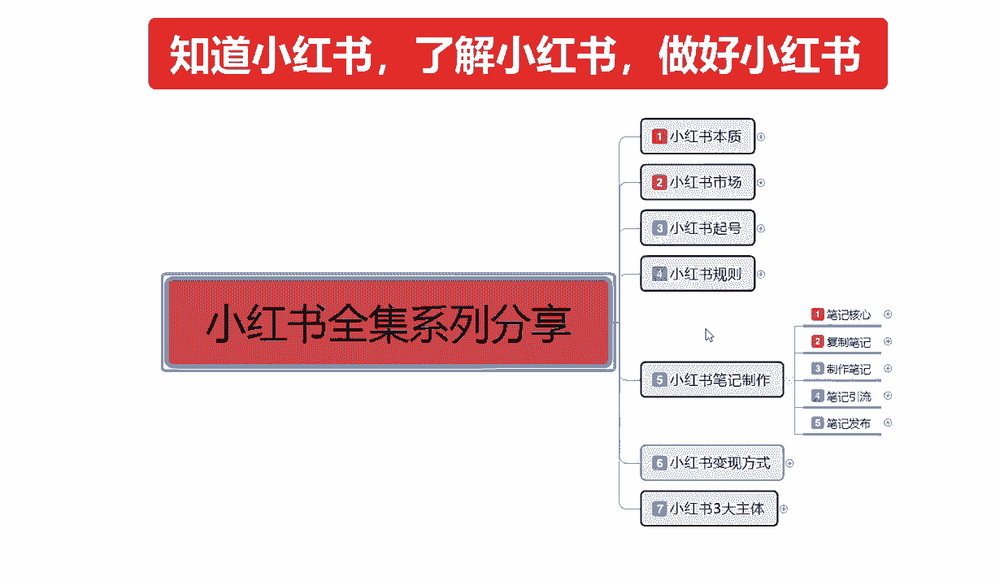
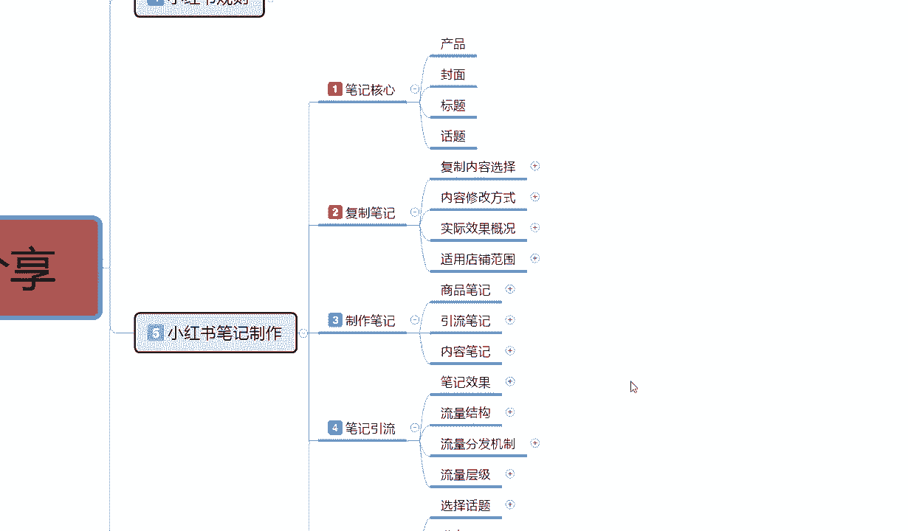
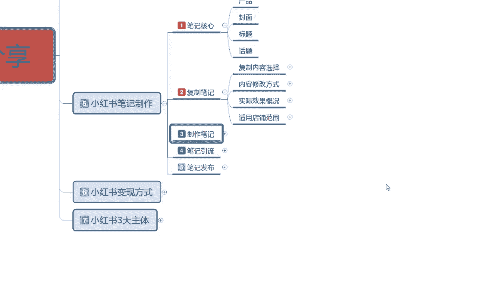
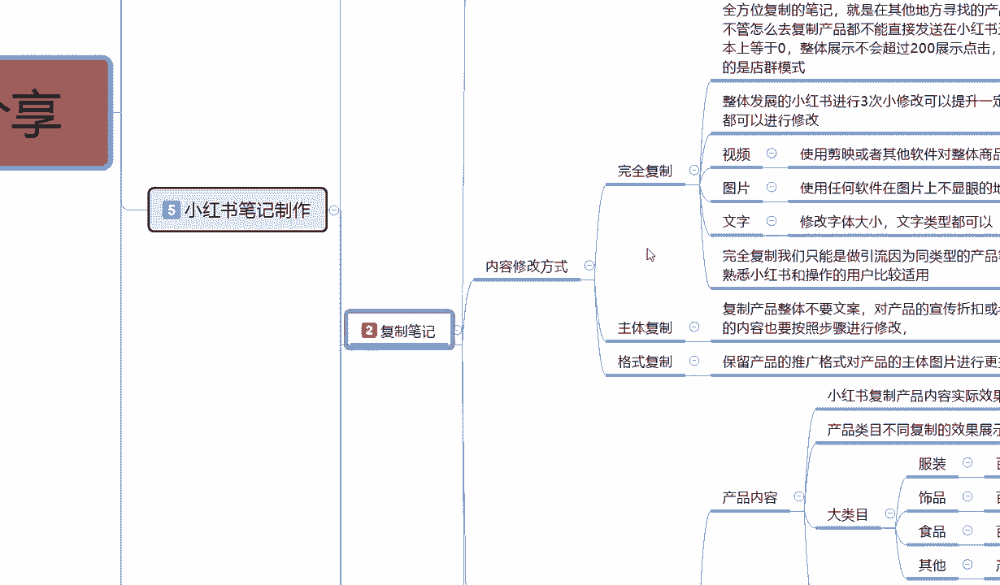
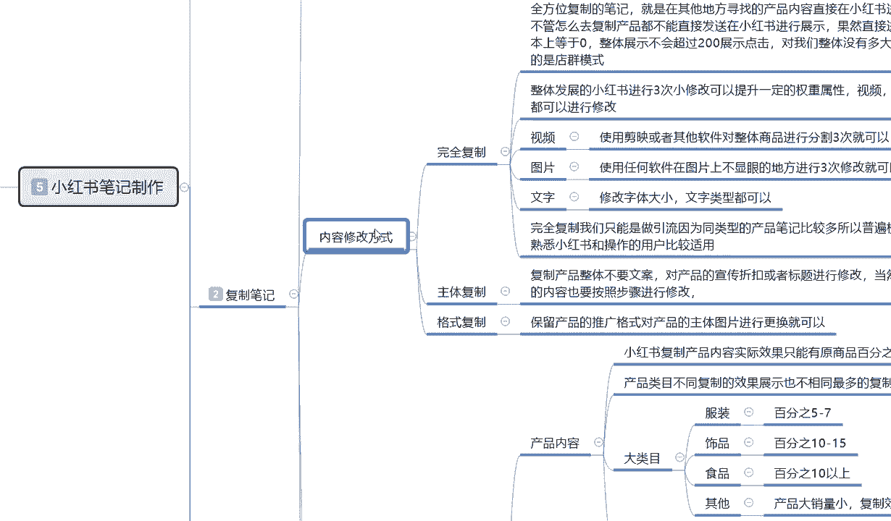
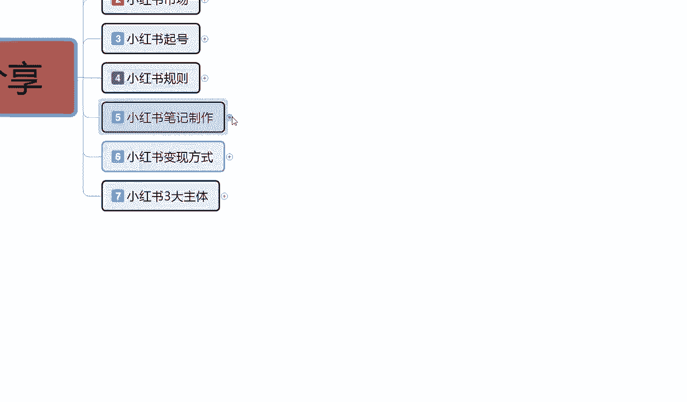
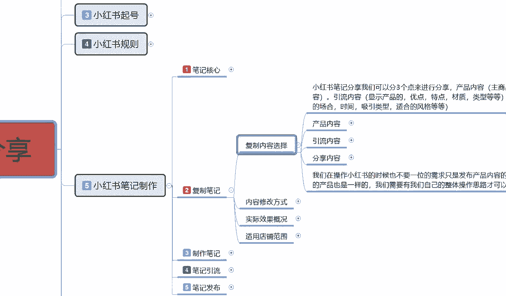
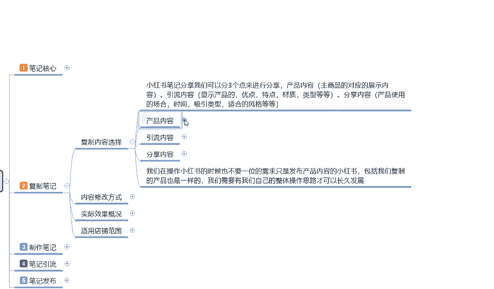
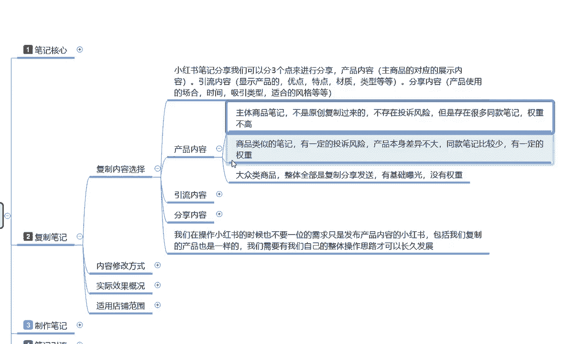

# 【2024B站最强小红书运营教程】专为为0基础小白研制的小红书开店运营零基础保姆级教程，全程通俗易懂，纯干货无废话 - P15：14、新手小红书运营-小红书复制笔记：优质内容选择 - 天边云-彩 - BV1hb421H72m

大家好，今天给大家分享的是小红书全集系列，第五大课时的第二课啊，父子笔记的一个内容，整体来说的话呃在上课之前呢，先给大家说点其他的啊，就说我们在了解笔记的时候。

因为上一节呢已经给大家讲过了，笔记的一个整体核心，说实在的就是一个封面和一个标题，把这两个做好的话，后续的一些操作其实都是比较简单的，但是对我们新的一个小红书用户，或者说我们新刚入行的一些朋友来说的话。

虽然说我们了解这个封面和标题，但是我们自己的话就是说缺少资源的情况下，我们是没有办法去真正的自己去制作，这种小红书笔记的，为什么，因为小红书笔记整体制作的话看似很简单，但是他其实选择性很多的。

你封面也好，标题也好，产品也好，话题也好，你要围绕你自己的主题去操作，你虽然说对自己的产品，或者说对类似的东西很熟悉，但是我们前期真要去操作的话，你首先你还得玩转小红书整体的一个规则。

这是我们在操作小红书笔记的时候啊，这整体里面的话其实我们有多个选项，而不是单独的，只有制作笔记这一个选项啊，包括之前给大家讲的，我们的一个整体笔记核心，这里我要额外给大家讲的是什么呢。

就说我们小红书笔记制作，对我们前期来说的话，我们不熟悉的情况下，你可以拉一到两个账号整体熟悉一下，把自己的模式方式全部弄清楚以后，再自己重新再开一个账号，把这个账号拿去做组店。

如果说你觉得你的时间比较急啊，资金比较紧张之类的，那你可以怎么说呢，就说先拿别人的作品复制过来，进行修改以后再进行上传，这就是整体复笔记里面，我们需要注意到的一些事项，小红书笔记制作这个里面的话。

我给大家分为五个，第一个是核心笔记，主要就是说让我们了解这个笔记的重点，在什么地方啊，我们的内容说实话你前期的封面做不好，内容的话效果不大，就说我们在这个方面的话，你封面做的不差的情况下。

那你的笔记想火起来的话其实很容易的，但是对于新手来说的话，我们没有这方面的资源，那么我在这里呢给大家分享的就是说四个部分，两三个部分呢是和笔记有关，最后一个笔记发布呢是给大家讲的一个技巧。

这里面复制笔记部分啊，说实话这个比较适合，我们这个刚接触小红书没多久，或者说是对我们网络运营这块不是太熟悉的人，不知道自己怎么去操作，怎么去了解的人去操作，这个父子笔记可以，如果说我们有一定基础的话。

说实话有自己的商品，有自己的渠道，有自己的信息的话，自己去做，用制作笔记这个方式，后续呢我会给大家一个一个的进行讲解，第四个点就是第四大节的时候笔记引流，它整体的话是讲我们这个笔记做出来以后。

他得到的一个引流效果，包括最后一个笔记的一个发布方式啊，因为笔记的话，它发布方式，他会给你那个流量的一个权重是不一样的，知道吧，你在什么时间段发，在什么选择什么样的话题，选择什么样的发布时间选。

选择什么样的发布方式，他的权重都是不一样的，所以说有些东西我们要慎重的去选择好吧，那这节课呢直接步入我们的一个正题，主要呢是给大家讲解一下，我们整体的一个复制笔记内容，说实话复制笔记内容的话。

我们在这里面进行讲解的话。

可能内容会偏多啊，我们能讲到什么地方就讲到什么地方。

这么展开太大了。

那我们一条一条来吧。

今天给大家主要讲的，就是说我们父子笔记的一个内容，复制内容的一个选择啊，小红书笔记分享，我们可以把它分为三个点来进行分享啊，第一个是产品内容，主要的话就是说针对我们主商品，就是我在小红书上面。

我想去卖商品对应的一个展示内容，但是这部分展示的话，他只会在搜索页面进行展示，在我们的那个推荐页面里面，它不会进行展示的，这个大家也要弄清楚啊，就是主商品就是商品笔记，他只会在搜索页面进行展示。

不会在主页面进行展示，主页面进行展示的那种商品的话，那都是和小红书有合作的，就是他花钱买的流量啊，这个我们暂时不考虑，第二个就是引流的，如果说我们要做小红书的整体，账号权重和商品权重的话。

我们不光要做商品笔记，就说我们店铺你看真去卖货的话啊，你不光要做商品笔记，你还要做引流笔记，引流笔记，你还要做内容笔记这三个组点啊，那什么是引流内容呢，引流内容的话，他就是说显示的是额产品的特点，优点。

材质类型等等，但是这个的话我们不发商品笔记，我们直接把这个产品相当于做了一个包装，做了一个介绍，对家进行宣传，发普通笔记就可以啊，就是发搜索推荐的那个笔记就行，分享内容也是发这个笔记。

只是说他分他的一个内容的话，也是对产品或者对我们店铺，对我们整个账号，或对我自身的信誉进行的一个优化和升级，这个叫内容分享啊，产品的使用方式，场合时间性类型风格等等，通过这种方式我们就确认了啊。

我们小红书你不管是坐垫也好，不坐垫也好，他都有三个风格，你不坐垫的话，那么只有两个，但是你坐垫的话基本上都是有三个风格，这三个风格的话，就相当于是我们的一个产品内容，一个引流内容和一个分享内容这三个点。

那这三个点我们操作的时候，他的复杂程度的话就又体现出来了，在这里呢我给大家是把它单独列了三条啊，我们首先来看第一条产品的一个内容。

产品内容主体商品的笔记的话，就说不是原创，我们这个给大家讲的是父子内容啊，我不管大家是怎么想的，我说的这个是整体复制内容，但是我们可以把它使用到制作笔记里面去，其实内容是差不多的。

也就是说我们在复制笔记的时候，你也要围绕这三个点去找，知道吗，就是你不管卖什么产品，你一定要围绕这三个点去找，你不能说是别人做的好的，你把它复制过来，然后直接去发，那样没有用的，知道吧。

也要围绕这三个点找，因为它的内容不同的话，你发布的一个方式是千万不能一样的，你发布方式错了，别人有效果到你这来，那就没有效果了，所以说发布方式是很重要的，才在这里呢给大家分成了三个步骤啊。

进行了一个详细的一个讲解，产品内容主体商品笔记不是原创复制过来的啊，不存在投诉的一个风险，就说嗯，这整个笔记的话给大家介绍的呢，就是说我们产品的内容主体，商品笔记啊，不是原创复制过来的，什么意思呢。

我们我和他卖的产品差不多，但是我把他的所有东西全部呃负责，然后拿到我这边来了，然后我进行去卖，或者说说我这边没有货源，我去淘宝去1688别人给的一些货源啊，拿着他们给我们的一些资料。

然后把这些资料稍微修改一下，进行的一个更改，然后去进行发布，这种的话他就不存在投诉风险，嗯但是呢它存在很多同款的一个笔记啊，整体权重的话就不高了，这是复制产品，我们选择产品内容进行复制的时候。

就是本身我们商品的一个排名，本来的话就是说新品笔记你放上去，虽然说都是在同一层级，但是如果说我们选择复制笔记的话，在同一集里面我们有很多类似的一个产品介绍，那你觉得你在1000个1万个10万个里面。

你的产品能排上名吗，对吧，所以说我们在选择产品内容的时候啊，虽然说主体商品他不会遭到投诉，有权重就是基础权重大概给你50到200，但是正常的话只有50~70个小眼睛，因为产品过多。

只有50~70个小眼睛，但这些小眼睛过来的话，它的转化率也不高，这就要看我们前期账号做的怎么样啊，你的选产品宣传做得怎么样，就是说我们主体商品我们实在是新人吗啊，你刚接触不久的，实在是找不到资料了。

你可以用这种方式直接找主体商品那个笔记，你去找商家直接拿资料，然后进行修改，然后提交就行，这个就是产品的内容，然后商品的类似笔记的话有一定的投诉风险，就是和我同商品呃类似。

但是说我和他卖的有稍微有一点点区别，我把他的东西拿过来，改成我的那一点区别，我把它修正以后，重新做我的产品推广图，做我的产品介绍文案，做我的一些方式啊，这个的话它是有一定的投诉风险的。

产品本身差异不大啊，但是同款笔记比较少有一定的权重量，这个权重量的话就看你复制的选择怎么说呢，就是他的笔记可能有2万到3万的展示，你把它的内容复制过来修改一下，那么到你手上的话可能就有2000左右。

10%左右，你做的好的情况下，10%啊，你做的不好的情况下，那就不一定了，但是做得好的话，最最大效率也就是10%到20%之间，2000到4000的一个小眼睛数量，这个就不是展示数量了。

这个是小眼睛数量的啊，就是商品类似的比劫，因为你的话不是从直接从厂家也好，或者从其他地方也好，网络上面没有这么多重复的一个产品，那么它的有一定的权重，权重量还是比较不错的，对我们新店来说的话。

呃新的账号也好，新的店铺也好，你去操作这种方式的话还是非常不错的，第二第二个打点就说还有一点没给大家讲啊，就是大众的一个商品啊，人体全部都是复制分享发送，有技术曝光，但是没有选中，这个是什么意思呢。

就是说呃我们在选商品的时候，你选择的文案文，文件描述内容的话，你前期用可能有点效果，但是中后期用的话对你没有什么提升，你比方说，别人用AI制作的，你把AI的数据都给复制过来了，因为你自己不会用。

后期的话我可能会嗯，有时间的话单独给大家讲讲AI吧，AI这个整体的话对于现在小红书来说的话，还是比较方便的，我们不管是做笔记也好，做图片，做文案也好，都还算可以好吧，就说大众类的一个商品。

整体的话他全部都是负责发生分享的，就是小红书刚开始的这两年可不就行了，就是从去年6月份以后吧，做店群的不行了，但是在之前因为小红书他累积数据的时候，他做了很多垫钱，他的店群模式是什么，无限的发布产品。

无限的粘贴复制，那个时候发了很多重复类的一个笔记，重复的一个内容，虽然说你很多都进行淘汰了，但是他的商品的一个权重属性的话，就基本上他把他的起步阶段提高了，以前的起步阶段可能是零，慢慢的十二十。

五十一百到我们这可能已经是五百一千了啊，所以说他起步阶段的话，我们的起步阶段本来比别人慢一步，你现在要去做的话，那么你可能比别人慢十步，那你再不做，可能慢50步100步，因为他的后续权重会越来越高。

所以说大大众类的一个商品，一个，包含性内容太多以后的话，它整体是没有权重的，就你发上去以后的话，它是根据你，你每天有两到五个笔记的一个发放量，但是我们基本上只发两个左右，因为这个效果是最好的。

你发多了也没用，那你两个权重的基础量的话，你发这种类似的一个复制笔记出去的系统，它只会根据你账号的权重给你基础展示和曝光，不会有额外的一个提升空间，就是这波流量展示完了，这个笔记两天到三天就下架了。

没用了啊，虽然说还在你的那个后台能看见，但是他没有权重，这个就是产品内容，我们选择的时候一定要把它选择清楚啊，你复制的时候，我说实话在这里的话建议大家的话，我们做第二条啊，做商品类似的一个笔记就可以。

不要做完全遮盖的一个复制，因为那种的话你想起号的话实在是不容易，除非说是你，你真的是对，什么都不懂，你可以完全去你对美工不懂，对剪辑不懂，对AI不懂对吧，对小红书的一个系统不懂，那你可以完全复制。

先把所有的数步骤了解清楚，一步一步做啊，先学习后强化，也可以只是说我们的一个节奏，把它放慢一点，跟着别人走就行，也能做起来，就看大家的一个选择思路是什么样的，相信自己能做的，我们就选第二条。

不对自己没什么太大信心的，选第一条和第三条都行好吧，这个呢就是整体的一个产品内容，嗯因为时间的关系啊，呃后续的内容呢，我会在下节课给大家进行一个详细讲解好吧。

