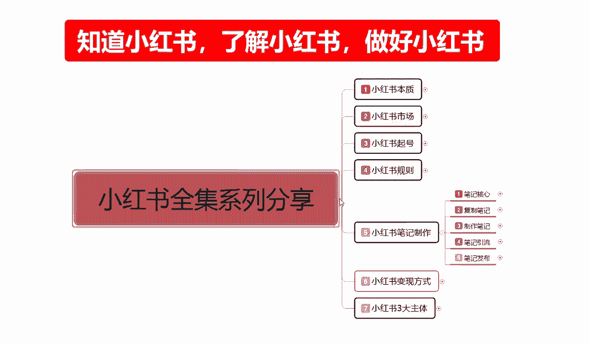
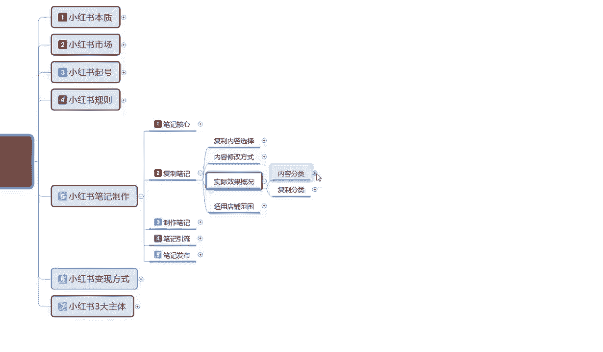
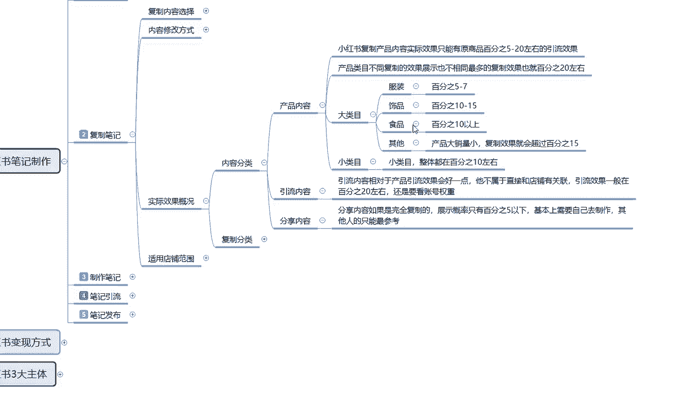
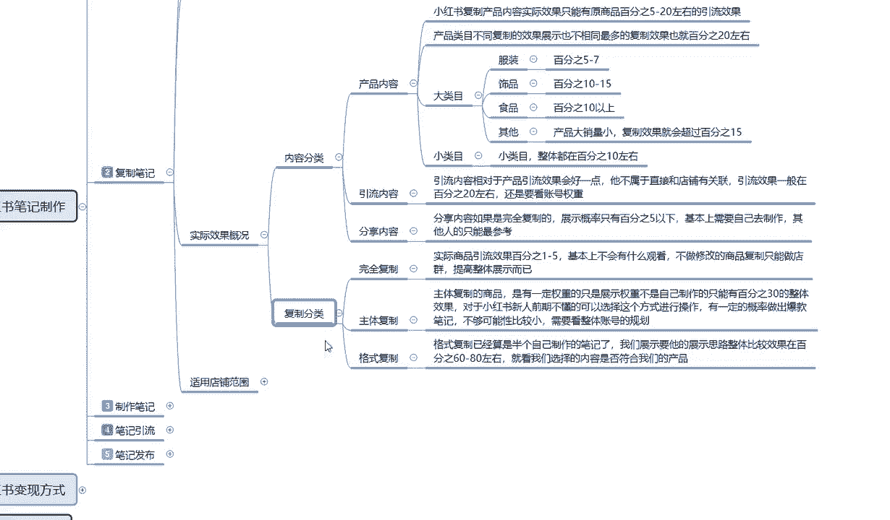
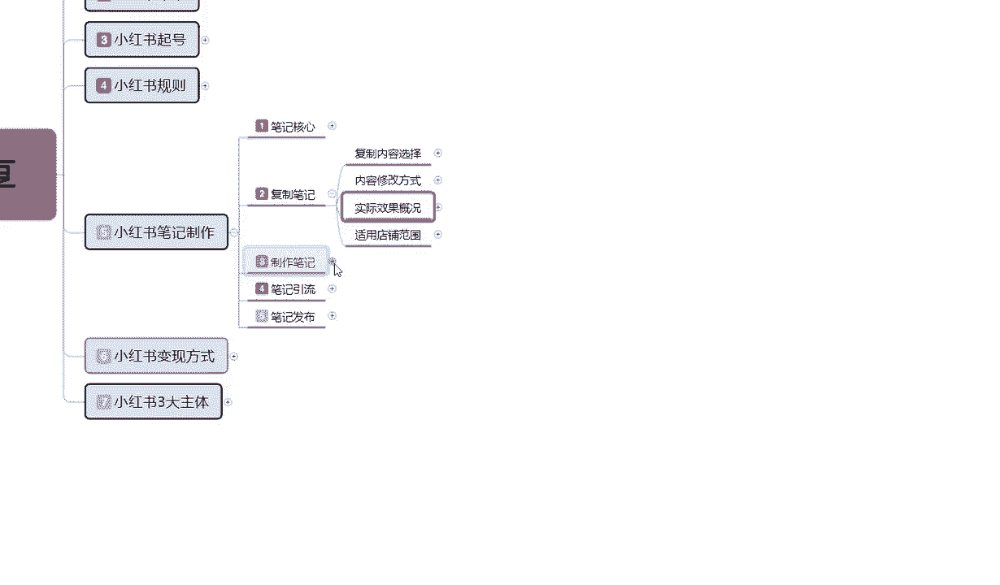
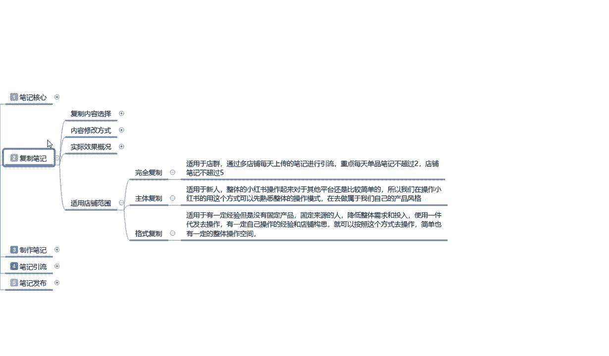
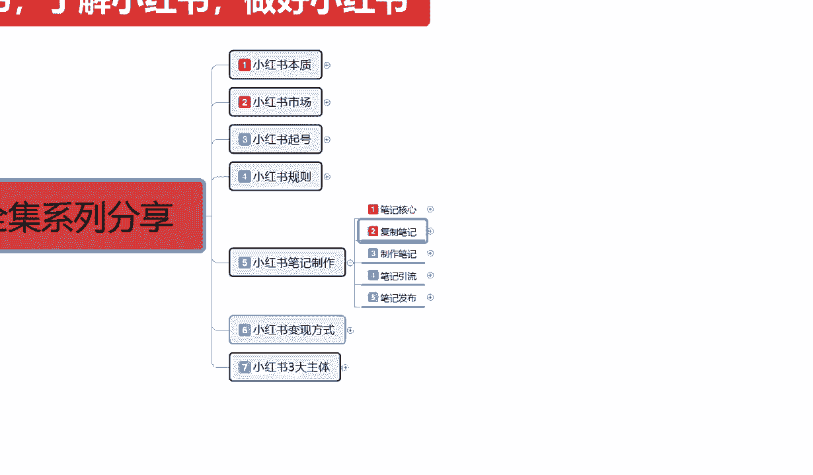
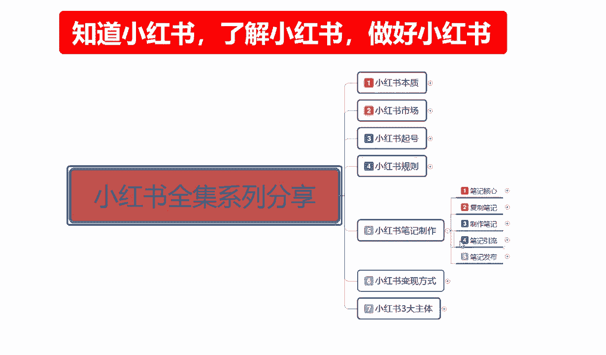

# 【2024B站最强小红书运营教程】专为为0基础小白研制的小红书开店运营零基础保姆级教程，全程通俗易懂，纯干货无废话 - P19：18、新手小红书运营-小红书复制笔记：适用店铺范围 - 集控楼开口 - BV15m421V7Py

大家好，这一节给大家分享的是小红书全集系列的，第五大课时父子笔记内容的第五小课时，也是最后一节课时啊，父子笔记内容里面的最后一节课时呃，主要呢是给大家讲解一下。

我们后续的一些内容额，包括实际效果概况，里面的一个复制分类和整体复制笔记，它通用的一个店铺范围呃，废话不多说，直接进入我们的一个正题，上节课呢已经给大家讲解了啊。

就是说我们按照内容分类，我们去复制别人的一个小红书作品过来以后啊，他整体笔记达到的一个效果。

这节课的话就是说父子分类里面，他还有完全体复制主体父子和格式复制，因为之前也跟大家说过啊，三个主体复制它实际去实际用的一个效果，亮度是不一样的啊，完全体复制聚落实际商品引流效果的话。

它整体引流效果只有1%到5%，基本上不会有什么观看，不做修改的商品，复制的话只能做店群提高整体展示而已，就说我按照我教给大家的方式，这种的话我们可以避免95%的重复，商品，以后的话。

他还是有一定的访客流量，但是这一部分的流量的话是不大的，嗯正常的话也能复制5%左右，到10%左右，就是你进行修改了以后，完全体复制，你进行修改了以后的话，大概可以有5%到10%的一个，实际效果。

就是通过商品啊进入我们店铺的，意思就是对方小红书每天有500个访客，那么你可能就有20个左右，懂我意思吧，但是成交这个概率就不好说了啊，因为成交概率的话要通过你的产品价格。

包括你的啊产品内幕里面的一个销量价格，活动质量，还有你自己的一个描述去讲解，它只能达到一个引流的效果，它不能达到成交的一个效果，你不管怎么去复制别人的产品，它都不能达到成交效果的。

所以这个点大家一定要注意啊，它实际商品是达到引流效果的，1%到5%，就是完全体复制，不做修改，你修改过后的话，基本上就是5%到10%啊，这是得到的一个4G效果，说实在的嗯，我们按照正常的来计算。

就是你复制了一篇1万小眼睛的一个笔记，商品笔记，他的一个整体展示量的话，在他店铺里面可能达到200到300的一个访客，但是通过我们分析的话，就是稀释以后，因为我是负。

我们是复制他他他的一个产品的一个笔记，包括他的一个文案和内容，过来以后本来就是200，他能达到200的一个访客，但是到我们这边的话，我们可能只有20个方客，20个访客，因为他在往下面计算。

它整体是实际商品的一个引流，我们只能达到1%到5%，那给我们引流的一个访客也就占五个左右，懂我意思吧，就是别人一天可能赢500个访客，但是到我们这边来的话，可能就是3~5个。

5~7个通过这一个笔记进来的啊，为什么说父子比小红书上面做原创稍微好一点，但是做完全内复制的话，他的访客量你复制一个爆款的一个访客量过来，那每天给你的一个商品访客数也就在3~5，主体负责主体复制的话。

跟跟刚刚那我给大家介绍的一个模式差不多，主体负责的商品的话，它是有一定的权重的，只是说展示权重不是自己制作的，只能有30%的整体效果，对小红书信息前期的话就说，对我们前期不懂的人来说的话。

选择这个方式进行操作，有一定的概率做出爆款笔记啊，不过可能性的话比较小，这个概率的话，你按概率学算的话，这种30%的一个概率，别人做出来可能100个笔记里面报一个，那么到你这儿的话。

可能就是3000个比一报一个三1‰的概率，概率不够小，还要看一要看你的展示文案一，二要看你的运气，运气好的话能保运气不好的话，同类的一个3000个笔记，你觉得要多久对吧，就是说小红书的一个笔记内容。

每天更新的是非常多的，但是3000个报一个轮到你的时候，估计也是十天半个月，112个月以后了啊，而且还看你的店铺权重，店铺权重没做起来，你想抱都抱不起来，还是要看整体店铺的一个规划。

不过我们拿他的一个主体复制做去去做，店铺前期的一个规划，做起来以后再去修改，我们小红书笔记的一个内容的话，整体店铺还是非常好做的，最后一个呢就是格斯父子格式复制，已经算是半个自己制作的一个笔记了。

我们展示要的是他展示的一个思路和整体，比较效果，就是说它整体的话就是按照格式复制，我们去把他的一个内容全部复制下来以后，自己再去发笔记，整体效果的话可以在60%到80之间，这也是效果最好的一个。

就是我们选择内容，是否符合我们的产品就可以了，把他的一个格式模式全部套过来，然后把我们的产品放上去，再把内容稍微修改一下，按照这种方式的话，格式复制，我们其实只占了30%到40%，这个复制量啊。

就父子比按百分之百计算，我们只占了30%到40%的一个量，剩下50%或者也好，60%也好，70%氧都是我们自己制作的对吧，他已经可以算是我们半个自己的笔记了，它的整体效果可以达到60%，到80%。

笔记爆款的效果可能有70%，就是同类型的一个产品，它的爆款率可能是百分之百，到你这就有70%，它的整体效果也就是我们在做复制笔记的时候，效果是最好的，但是他有一定的上手难度，对于新人玩家来说的话啊。

难度可能会大一点，对于老玩家来说的话，可能就有自己的思路，我知道自己只要他的一个模板对吧，比如说今天怎么怎么着啊，然后把下面的文案给他列个列个几条，列个566页，然后把你它的内容复制过来。

然后把主题改一下，把内容的它所展示的内容改成我们的一个内容，然后把他的图片换成我们的图片，这种方式去操作的话，整体效果可以达到60%到80，也就是最适合我们父子做精细店铺的一个方式。

这个就是父子笔记的整体的一个实际效果，最后呢就是他的一个通用店铺的一个范围啊。

这个还是比较简单的，为什么只是说告诉大家啊，这三个模式完全体父子主体父子和格式附子，它适用于什么店铺，完全体复制的话，他这个的话就说嗯，你做店群可以通过多垫，每天上传的一个笔记进行，每天的话就是重点。

每天每个笔记不超过两，每一个商品不超过每两篇笔记，店铺笔记不超过五，他必须要去做店群，你才能把店铺做起来，你不做店群的话，你又完全复制的话，你店铺基本上是做不起来的，而且会打乱你整个店铺的一个属性状态。

主体不足的话就是说它适用于新人，整体的话想出操作起来的话，比其他平台还是相对要简单很多，所以我们在操作小红书的时候，用这个方式可以快速的熟悉我们前期小红书，他给我们流量来源方式方法。

还有我读取我们店铺的一些数据做过渡，可以，也就是前一个星期用这个方式是非常不错的，后与后面接近两周左右，14天到15天左右的话，用格式复制，因为我前面七天，我已经了解到整个小红书的一个规则变化。

而且我对我自己宣传产品有一定的了解了以后，就可以用第三个模式，他的话适用于一定有经验，但是没有固定产品固定来源的人啊，降低整体的一个需求成本和投入，使用一键代发去操作。

有一定自己操作经验和店铺的一个构思就可以，这个的话方式是很简单，但是你要有思路才行，你没思路的话，说实话前期先做主体，做主体做熟悉了以后的话，你后期做格式复制，你就有思路了，你知道别人怎么排版的。

怎么编文案的，准备写数据的，怎么做图片的，你有了这个数据以后，你再去做格式复制是非常好的，就是前七天做这个七天以后的话，大概两周左右做这个拆完两周以后的话，就要做制作笔记了啊，就是纯笔记由我们自己制作。

前面只是以他整体复制笔记来说的话，他的整个使用效果时间段就是小红书刚开店，我对这边不熟悉，我想了解一下，用这个方式去做是最好的好吧，我们前面你直接上来，我就说我自己家制作笔记，我要有我有商品，我要推广。

我要做什么，拿这个比喻去做，我说实话你还不如先做复制一下，你先看看别人怎么做的，因为你盲目的去投入啊，第一浪费时间，第二浪费金钱，第三会消磨你对小红书的所有兴趣，你觉得这个平台我自己带的产品。

我带着资金，我带着人员过来，设备过来了以后，我去小红书上面，我自己做笔记，然后去推广，但是没人看，这就是区别，知道吧，所以说我们在了解不了解小红书的情况下的话。

不要去盲目的进行一个整体投入啊，包括我这里。

为什么说主题给大家选的是制造小红书，了解小红书，然后才是做好小红书，对我们不怎么说呢，就是对我们思想上面不熟悉的东西，我们一定要对他进行充分的了解和分析，以后，你才能去接触这个行业。

你不能说像我们刚村嗯，以前吧大学刚毕业也好，初中刚毕业也好，小学刚毕业也好，他小学关闭了，就高中刚毕业也好，你刚步入社会以后的话，对什么都很新奇，觉得我能行，我无敌对吧，结果出去找个工作。

3000块钱一个月的困难，所以有些时候你要我们要先自我认知啊，你才能去做好其他的一个内容，父子笔记的一个方式的话，就是让我们先了解小红书，它整体一个运营规划的一个思路，和流量的一个来源，结果啊。

我们弄好了以后再去自己制作，自结合自身的一个能力，再去进行自我推广的一个宣传，才是最好的一个方式，好吧，那这节课呢也就给大家讲解到这，下一节课的话给大家讲解小红书笔记制作，第三大点啊。

我们自己怎么去制作笔记。

