# 【2024B站最强小红书运营教程】专为为0基础小白研制的小红书开店运营零基础保姆级教程，全程通俗易懂，纯干货无废话 - P9：08、新手小红书运营-小红书规则（1） - 随风飘-淡 - BV1CyGfecEv4

大家好，今天给大家分享的是小红书全集系列的一个，第四大课时啊，小红书的一个规则，小红书的规则，为什么说是这一个要给大家讲解这个呢，因为上面给大家讲解的包括本质也好，市场也好，喜好也好。

我们了解的只是说我们小红书入门的一些，了解市场范围啊，和我们自己做什么，怎么起号啊，起号之后，我们还要避免小红书的规则，和了解小红书的规则这两个点啊，在这里呢今天就给大家详细介绍一下。

而且这个的话就是正式进入我们大课时的一，个范围内了啊，前面三个只是说我简单的给大家介绍了一下，我们小红书我们所需要了解的一些东西，从这节课开始，正式内容正式上线啊。

因为它涉及到的小红书整体来说就是方方面面，包括我们所了解的所不了解的一些规则和范围，建议大家的话，如果说没有听懂，或者说是不是太了解的话，多听几遍啊。

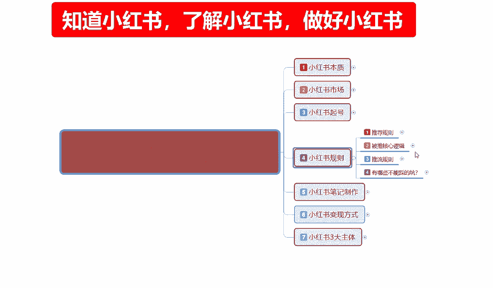

对大家来说只有好处没有坏处好吧，那我们来了解一下什么是小红书的规则。

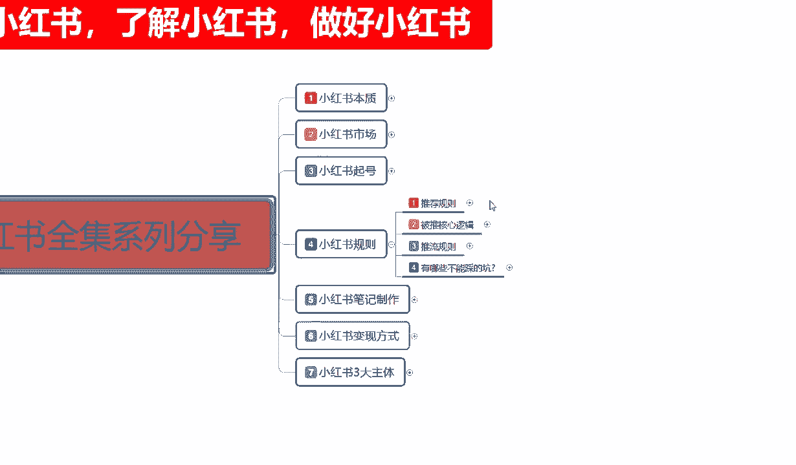

小红书的规则的话，我在这里呢给大家分为了四个点。

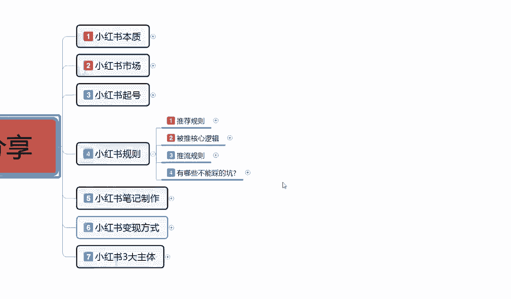

大家不要看只有四个点啊，这四个都是大点，为什么说是四个大点，因为它的内容其实展示的是很多的啊。

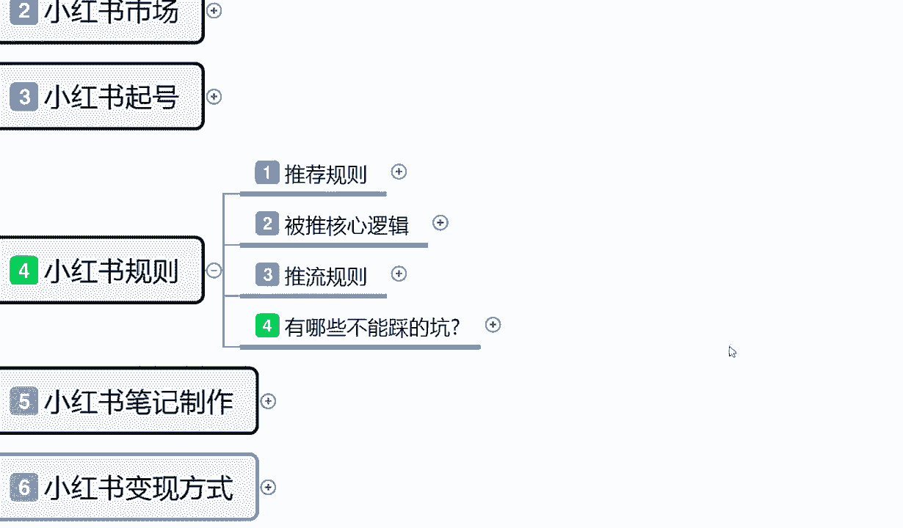

我在这里的话给大家打开看一下啊。

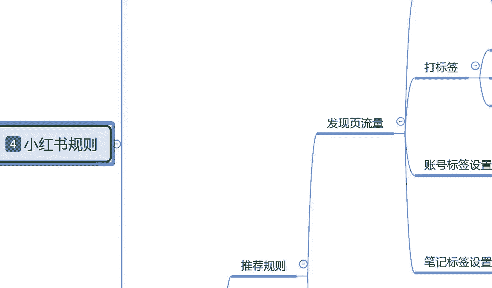

光这四个点啊，我们所占据的页面的话，其实是对比前面三个的话，他不会太小，而且它的内容的话是非常多的，所以说我们一定要了解清楚好吧。

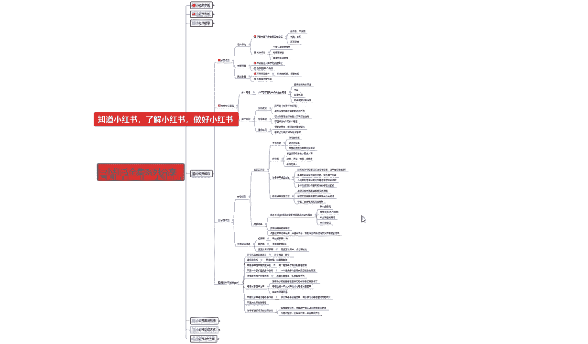

那首先我们了解一下这四个点是哪四个点啊。

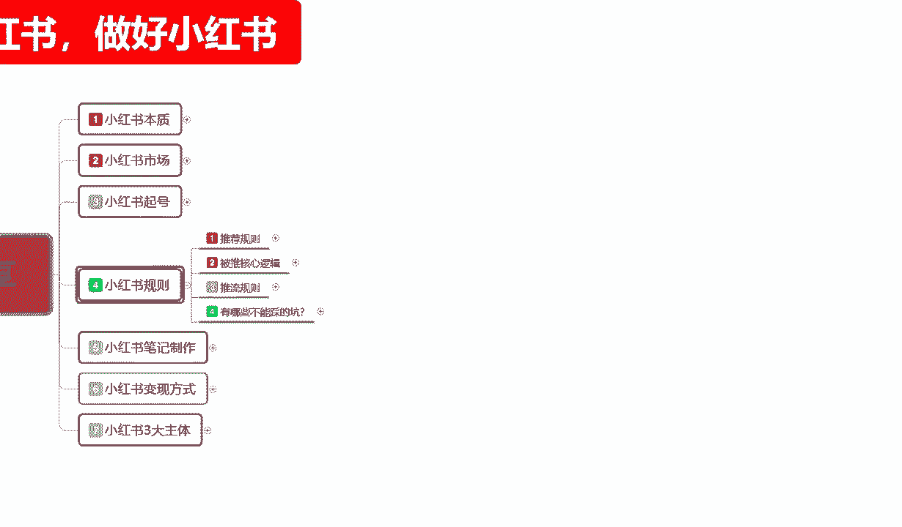

第一个是推荐规则，什么叫推荐规则。

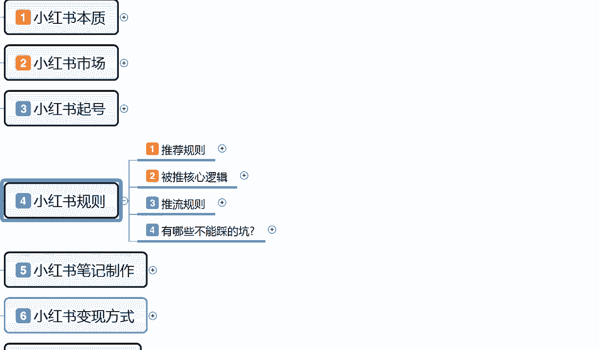

推荐规则里面的话，它是通过小红书他的一个系我小红书系统啊。

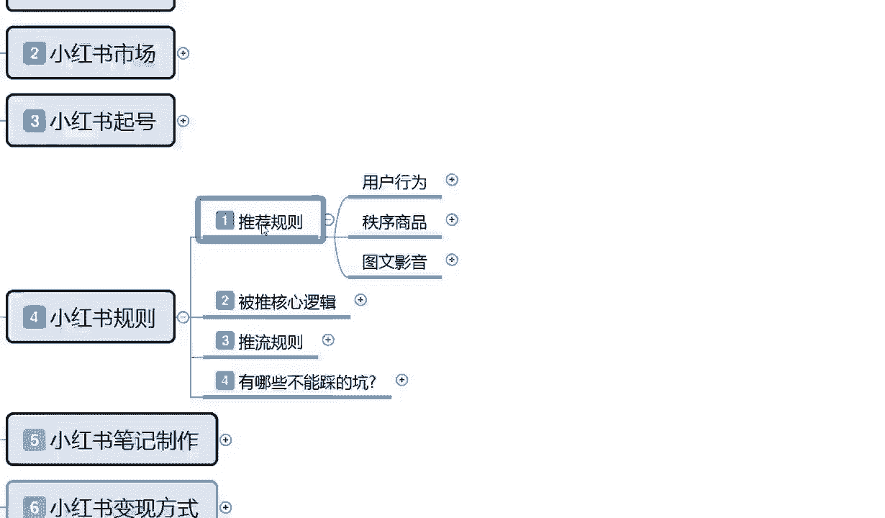

对我们进行了一个推荐，就说我在里面发笔记也好，做商品也好，做网红也好，做代理也好啊，做引流也好，做任何东西都好，小红书不给你流量和访客，你怎么办，对不对，所以说小红书它整个系统的话，它是通过系统来判定。

你是否属于小红书的忠实用户，忠实粉丝，包括我们前期给大家讲的一些内容的话，说实话它都是在这个规则范围以内，什么叫规则推荐规则，小红书录入你的账号，了解你账号设置的信息，了解你账号发布的笔记。

他就会对你的账号进行一个定位，你的账号是做什么的啊，什么成绩，对这个网络有多少了解等等，他会给你分析出来一个模式，这个推荐规则就是小红书，他通过你的所有的信息给你推荐用户。

给你多少的一个技术展示流量曝光，通过这种方式，来给你增加权重，你要了解这一部分的权重以后，你的数据才做得好，你不了解这部分权重的话，你的数据就做不好啊，推荐规则里面的话，它分为为用户行为。

自序商品和图文阴阴影三个大点，这个里面的话用户行为啊，就是说我这里面的打勾的是我们不能做的，不打勾的是我们能做的，打叉的是我们不能做的啊，所以说我们要避免这一方面的内容，去经进行了解啊，首先了解一下啊。

所有内容不得含有营销词汇，就是说你不管是做笔记也好，做商品也好，做其他东西也好，什么样营销词汇，这个里面的话给大家分解出来的是微信号，二维码，代购水印，某某店铺，大家明明白什么意思吗。

我的店铺我开了四个账号，我这个账号的话，我只是说做拿它做引流，我想把这个账号里面的用户，导到我主店里面去购买产品，然后我在我的笔记内容里面的话，宣传我这个账号的一些属性内容不行。

这就是所有内容不得含营销词汇的意思，就是不行，你可以通过艾特这个店铺，就比方说我们在那个评论区里面对吧，我这个笔记有2万的一个房客了，但是我这个笔记里面没有商品，我这个账号里面没有商品。

我这产品卖不出去怎么办，我想把我那个主店的账号商品放过来，那你就用你这个账号，再去找一个另外的一个小号去这个商品里面啊，打上官方的字顶，用你自己这个主号打上官方的置顶，艾特你这个小号，然后去做啊。

然后再引导到另外一个账号，或者说引导到微信，引导到其他地方都可以，就看我们自己怎么做了，这个这个说实话，他是整个嗯做引流模式套用的一些东西，但是如果说因为我们账号起号的话，本来前期建的三四个账号。

他不是四个账号都能起来，偶尔起来一个或者两个就已经不错了，那起来的一两个访客又不高，访客高，但是又没商品怎么办，所以说你要学会导号啊，他就会存在这个某某店铺啊，所以说但是小红书它里面又不得含有营销词汇。

那你就得想办法啊，我这只是说给大家教了一个小技巧啊，用用户行为这种方式，我们去避免这种啊出现某某店铺，那你怎么避免代代沟和水印呢。

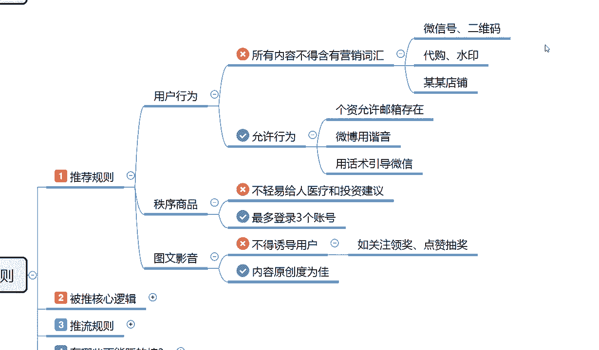

怎么避免避免微信号和二维码呢，这就要我们自己拿，又又要去想办法了啊，我这里呢只说给大家介绍了一个小技巧啊，避免出现某某店，就是宣传我们自己的产品，或者宣传别人的产品，接广告也好，打打数据也好对吧。

都是通过这种方式来去操作的，所以说这里面的话我们用户行为的话，他是不能包含这几个，这是最重要的几点啊，其他的我还没给大家列出来呢，啊，这是最敏感的内容，微信号二维码代购水印某某店，这是最敏感的五个内容。

但是他已经把我们那个做引流的，已经封杀了一大半了，封杀了95%以上，那剩下的你要去做引流的话，你还得想别的办法对吧，你要做店的话，说实话影响不大，但是你做引流啊，做网红做博主啊，你想引到自己的微信群。

QQ群啊，博主群，微博群等等都不行，所以说我们要想其他的办法去避免这种方式啊，后续的话我会给大家进行一个额讲解好吧，让大家了解一下我们怎么避免这种方式啊，这节课的话内容的话，我只是给大家介绍一下规则啊。

不在这个里面做过多的一个讲解，然后用户行为就说这是正常账号，我们还没开始卖商品呢，就是我们前面建号那八天范围，到15天范围以内的啊，你包括你后续发产品之类的，这只是前期的一个基础规则介绍啊。

大家不要弄混了啊，这是用户行为啊，允许的行为是什么，个人允许存在邮箱啊，微博用谐音用话术引导微信，对于我刚给大家说的啊，用话术引导微信，你只能说是在你的图片文案里面，把它变成其他的一种显示方式。

显示你的微信号，但是你在聊天里面也不能显示过多，你每天的话最多最多也就六私聊，两个人给人家发一下，你多了以后的话还是会被封号啊。

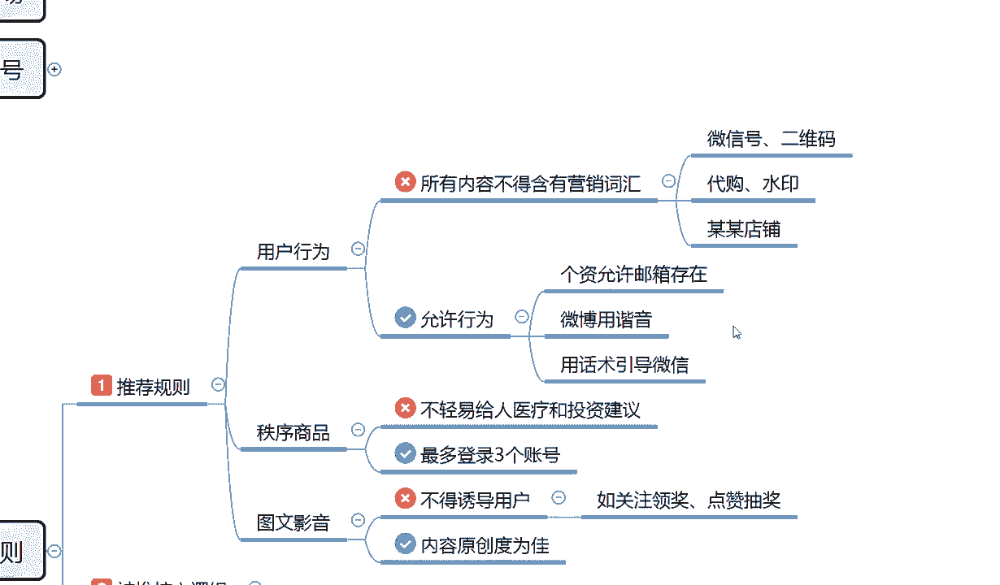

没必要，就是说风险性还是比较高的，后续的话我会在这个嘶。

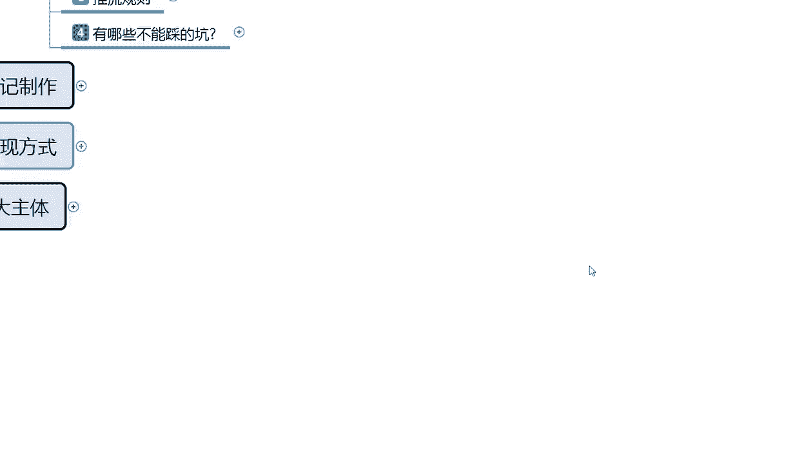

小红书变现里面好像是小红书变现里面。

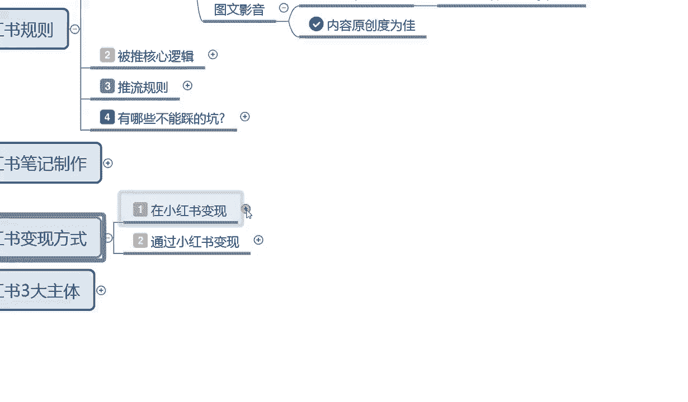

啊对小红书变现里面会给大家详细讲解一下。

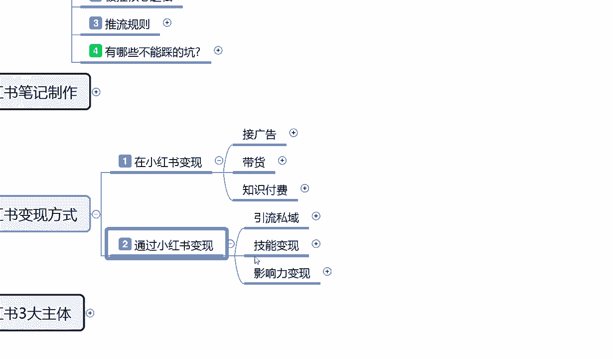

这个里面我们怎么操作的一个方式，这里的话我就不呃不过多给大家讲解了好吧，所以说这个里面的话啊，允许用用户允许的范围啊，就是我们要对它自进行整个的一个了解，第二个点就是自取商品，第三个是图文印啊。

自娱商品，就是说嗯因为小红书他在这个里面的话，卡控的还是比较放松的，你对其他平台来说的话，你出现这种问题，直接就给你封号了，哎你别说流量了，展示都没有的好吧，小红书还是比较宽容的了啊。

相对来说自娱商品里面不能做的，就是说不能轻易给人医疗和投资建议，他涉及诈骗啊，这个大家一定要避免一下啊，就说你个人医疗我在什么地方看病比较好，你可以去那边不行啊，然后投资建议的话，我觉得这只股票可以涨。

那只股票肯定跌，赶紧卖了，换这只也不行啊，不管他对你有多信任，你在你在小红书上面的话，你绝对不能出现这样的敏感词汇啊，包括其他的一些投资建议也是一样的，哎这边房地产不错，来这边买房，明年卖了啊。

这车不错的，保值都不行，知道吧，所以说不要轻易的给人医疗和投资的一方面，建议，其他内容就无所谓了啊。

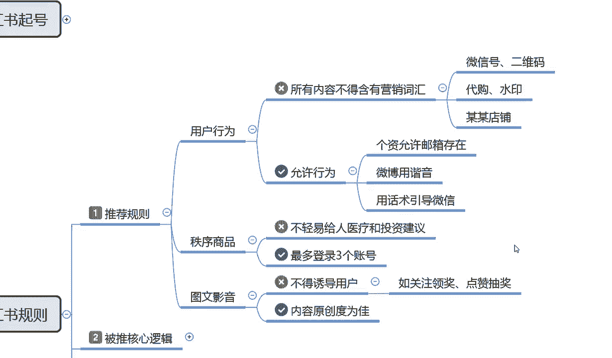

这是两个重点，同时最多登录三个账号，这个登录三个账号啊，大家记住了，是电脑啊，不要弄混了好吧，因为他你就说你在我们在电脑上面操作的话，你一次性最多登录三个账号，再登录，第四个的话。

你就说而且这三个账号的话，你还要用那个雷电分流啊，雷雷电去分流，不知道雷电是什么的，建议大家去百度一下啊，就是说超再超过这个账号的话不行，因为一一机一卡一账号，你去用手机操作，说实话你做你要做网红。

做博主，电商做电商，你不会给自己弄台好的电脑，做这个东西很不方便的，用手机也能做小红书，但是相当麻烦啊，建议大家还是配台电脑好吧，但是一个电脑上面用雷电，用那种分流做的话，你把那个你的IP改了。

数据改了以后的话，最好你要注意一下啊，不要超过三个账号，超过三三个账号的话容易被检测啊，经验之谈，大家额可能的话对这个方面不是太了解啊，但是我对这个方面了解比较多。

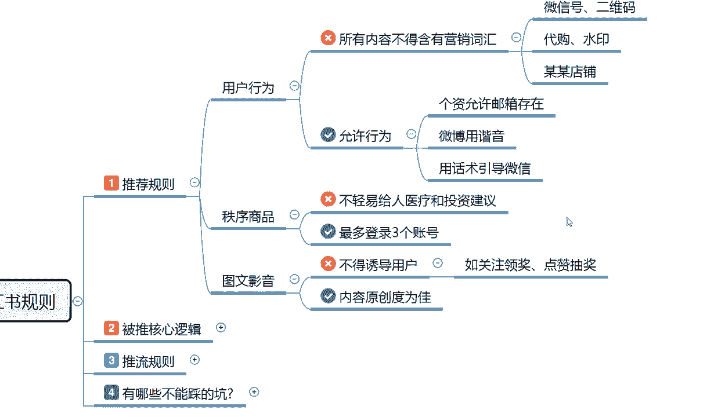

所以说建议大家啊不要超过三个账号好吧，你要登第四个账号，就把前面退掉一个就行好吧，然后是秃鹰寅，什么叫同影音，就是我们发放笔记的时候啊，能做的和不能做的，首先能不能做的啊，不得诱导用户，如关注领奖抽奖。

做活动送呃，你关注我了，我送你什么东西，我这些资料给你什么东西等等，这些都不行，就是不能有引导形式，你让别人去什么地方领奖啊，这种的话其实它的限制显示的这么，怎么说呢，就是显示的非常严格。

但是他其实没有那么严，有有各种方式去规避的啊，这个的话说实话是有各种方式去规避的，比方说你那个开个店店铺里面打折，打折里面的一个标题对吧，标题里面，但是他的一个搜索权重不重啊。

而且搜到你店铺产品的概率不大，只是说他权重的话，没有我们直接发布的一个权重高啊，回去再给大家讲吧，然后这里面的话建议大家就说，你我们发布笔记也好，做产品也好，内容原创度越高。

你前期获得的一个基础流量扶持解决吧，你如果说是去其他平台导的一个图片，然后自己做的文案那种的话，原创度50%的，它也有一定的流量数据，但是你把别人的图片文案方式拿过来。

直接放电自己的一个账号里面去发的话，那你这号基本上就废了啊，不是尽量的话呢就不要那么去做，除非说你做店群或者做做些基础小数据的话，可以这么做，那么做的话整体权重的话不高，但是也有一定的展示。

比比做其他的那种起步就十级难度的那种，好的多了，这个起步最多只有三级的一个难度，所以说小红书的话还还是非常适合新人啊，错过以前的一个这种流量高峰期的，朋友去做一下好吧。

这个呢就是推荐规则整体的一个内容啊，因为课程内容时间那个原因，这节课呢就给大家讲解到这，下节课给大家讲解一下啊。

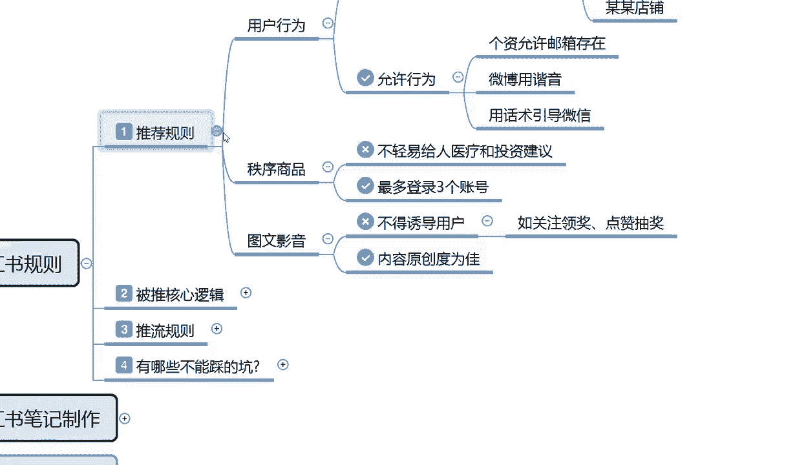

被推的一个核核心逻辑啊，推荐规则啊，这只是说让我们去了解规则啊，被推的一个核心逻辑的话啊。

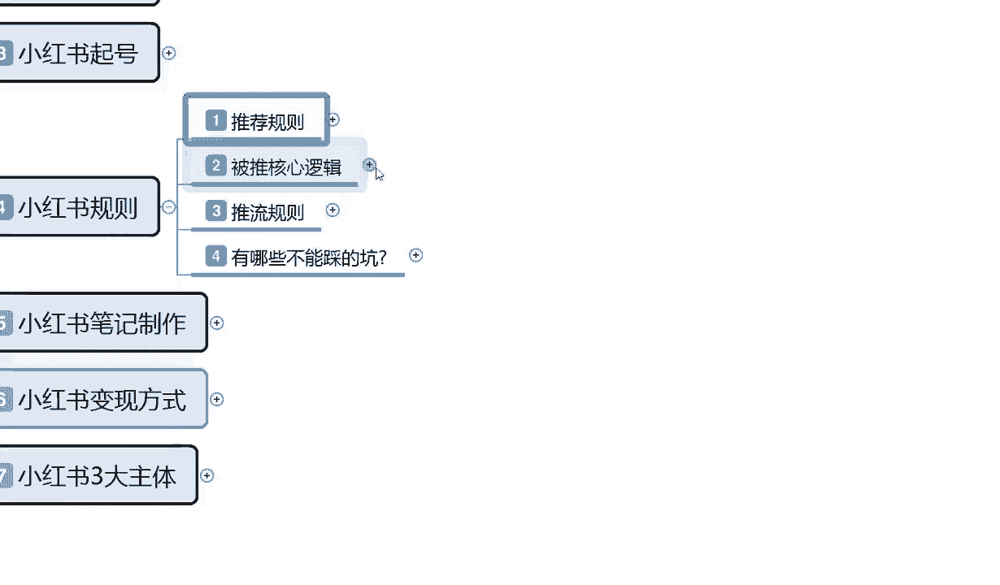

是我们的数据发出去以后，系统认定我们是好是坏啊，他通过什么方式给我们的一个流量数据访客。

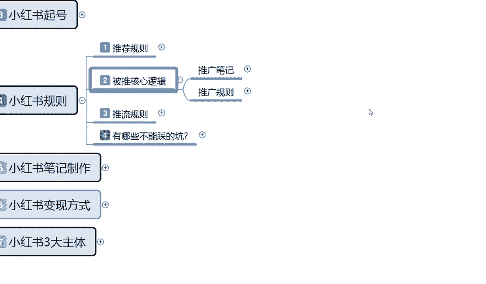

好吧。