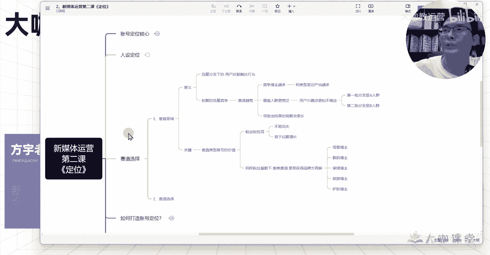

# 【2024B站最强小红书运营系统教程】吊打一切付费课!小红书蓝海市场 2024最值得做的新媒体平台 - P19：17、新媒体运营 垂直赛道的选择问题 - 大咖教运营 - BV1sn4y1X75u

哈喽同学们大家好。

欢迎大家来到我们这一堂课，那么我是方宇老师，那么这一堂课呢，我们跟大家一起来研究研究。

关于赛道这一块的一个选择问题。

那么在我们首先去决定我们要做什么，赛道之前呢，我们要先了解我们这个赛道。

后期的一个发展方向问题，就是说我们要先知道赛道这个东西啊。

它的一个核心定义就是，我们到底现在去做新媒体，我们选择赛道这一块到底要遵循哪些原则。

我们才能够尽量大程度的一个保证。

我们这一块赛道能够做起来，那首先第一个呢要大家去研究清楚的，就是关于垂直领域这一块，很多人都知道我做这个新媒体赛道，我要去做垂直对吧。

我要去做细分，但是你们根本就不知道为什么说要这样去做，他的一个影响的根本意义到底在哪里对吧。

那么我们就一起来看一下。

首先第一个呢就关于意义这一块，就是它的一个呃，为什么说是我们要去做垂直领域这么一件事。

第一个呢就是关于流量分发下的一个用户的。

他的一个触达行为啊，应该说是用户的一个反复触达行为，什么意思呢。

比如我们现在去做新媒体的账号，你的笔记他会第一批分发给一批人群对吧。

你的第一篇笔记，前五篇笔记，每一篇笔记。

我们前期讲了这些笔记的一个初始流量，都是在做人群测试，对不对，那么我们之前呢跟大家打造过一个模型呃。

我们第一篇笔记呢分发给500个流量。

那么这500个流量当中，可能有十个是我们这个赛道的一个精准用户，比如说我们是做穿搭的。

那么有十个用户呢，对这个呃大学生的一个穿搭吧，我们做大学生的一个穿搭分享，那么有十个用户，他对这个大学女生的一个穿搭比较感兴趣，然后呢，他对我们内容呢，呃产生了一个比较长的这个停留时长，然后呢。

其中呢有那么3~5个人给你提供的数据，OK那么这个时候呢用户啊，我们的平台可能判断你这个笔记呢。

有没有可能是跟这个和大学生穿搭相关的呢。

他还无法确定，对不对，那么下一波你的第二批笔记。

他有可能根据你上一批笔记的这些用户行为啊，他继续给这十个用户。

甚至说更多的，比如说二十三十个用户，50个用户继续去推你这个关于什么呢。

关于这个穿搭相关的这种呃内容，也就是说在我们第二批500个流量里边。

可能有五五十个用户呢，他对这个穿搭有呃一定的兴趣，但是这50个当中又有十个用户。

可能有十个用户哈，是之前对你的笔记还比较感兴趣的。

然后呢，其中呢有五个用户可能会必然刷到你的笔记，这五个用户就是对你的笔记有一定的。

这个点击数据，然后呢甚至还对同类型的笔记呢，哪怕说他没有点这个互动数据，它对同类型的笔记呢也有一定的停留，时长和浏览行为。

那么这五个人他是必然会刷到你的笔记的，那么假设说你之前是做一个穿搭的对吧。

大学生穿搭相关的结果呢，你后面去讲了一个关于诶。

你今天上班遇到的一个遭遇啊，我们一个情况来分来来来做预算与这个推测。

你呢分享了一个，我今天作为一个30来岁女性的一个上班的。

这样的一个情况，我遭遇了一个什么样的一个不公平的待遇，或者说啊我上班遇到哪些烦心事。

那么你之前对你这些内容。

对你的这个大学生穿搭感兴趣的这部分用户，他在刷到你这个内容的同时。

他大概率不会对你现在发的这个跟他呃，目前需求不匹配的这类内容额感兴趣。

也就是说他同样刷到了你的账号，但是在不意不经意之间他就刷走了啊。

刷走了他刷到你的这个笔记内容，在他的这个四篇笔记的陈列当中。

但是他刷走了，那么这五个用户的流失，会给系统提供一个什么样的一个呃。

这种感觉呢就是之前对你内容感兴趣的用户啊，你现在同样分发的这个内容，他们竟然不感兴趣了，那么系统会不会觉得呃之前的判断失误哎。

系统它它没有这样的一个思考过程，他只会觉得之前的分发是错误的。

有误，OK那么你现在的这个，如果说你这一篇笔记分发的另外50个，那什么来着，50个，整个全部50个，对大学生穿搭感兴趣的这一部分用户群体，他们都没有给你提供一个很好的数据，OK那么这个时候呢。

系统它可能首先第一个在大学生穿搭这一块呢，你的这个内容分发呢。

它有可能就会给你降低这一块的权重，那么假设说你这500个流量当中有这么一些人。

刚好这么五六十个，七八十个，或者说十几个这种用户，他们对你今天分享的这个什么来着。

女性成长类的话题，就比如说我今天上班遭遇的这些问题。

或者说呃我的这个呃共同的这种遭遇啊，呃或者说我一些不公平的待遇啊等等。

这种像他们他们还挺喜欢的这种情况下面，那么你们的下一篇笔记就可能导致系统诶。

他再一次错误的判断了，你下一篇关于穿搭的内容要分发给哪些人了。

这就是我们在笔记分发里边，用户的一个触达行为。

他能够给系统反馈出，你对你的这个笔记类型的一个判断，所以说我们要去做垂直领域对吧。

你的垂直领域呢能够在这个人群触达这一块。

就至少说他浏览过你的内容，那么他大概率还会额刷到你的内容，那么这个时候。

只要你保证你的内容质量没有问题的前提下，他们很有可能就还有除了他们之外，还有更多的人。

他可能会给你提供一个数据支撑，就至少说点击率这一块可能你就能拿到对吧。

有了点击率，后面我们就要拿的是什么，我们的停留时长，我们的这个跳出率，还有我们的这个互动数据。

是不是啊，这就是我们要拿的东西对吧，这就是我们为什么说要做垂直赛道呢。

你的垂直赛道你在人群这一块，你能锁的更加的精准，也能够更加利于你的这个账号。

他有一个快速的一个成长，OK那么第二个呢就是关于初期的一个流量竞争。

我们的账号呢初期发布的这个笔记啊，你的这个流量分发是有一定上限的。

我们之前讲流量层级的时候，讲讲你这个呃账号的一个分发情况的时候，也大致提到过，这个后面我会细讲对吧，你的流量分发它是有瓶颈的。

系统，不会因为你的这篇笔记，它有一个还行的这种数据，它就持续去给你分发流量。

你的流量有上限，到了这个上限的情况下，你怎么能够在这个上限的这个基数下。

跟你这个同类目的其他的账号去竞争流量呢。

对不对，这个就是我们要考虑的一点，如果说你在初期的时候，你所涉及到的这个流量范围越宽。

那么相应的在你这个赛道里面。

竞争的这个博主啊也会越多，那么竞争的博主越多，他就有什么样的一个意思呢。

你今天做的一个大学生穿搭的类目啊，假设说你不是做的大学生穿搭。

你是做的各种类型的穿搭啊，你今天讲这个穿搭，你明天呢又讲的是微胖的穿搭。

然后后天呢讲的是通勤穿搭，那么在这几篇笔记的一个反复覆盖当中，虽然说你是跟穿搭相关对吧。

但是在这同样做这些内容的当中，做通勤的有这么1万个博主对吧，做这个大学生穿搭的又有1万个博主，你本来只跟大学生穿搭的1万个博主做竞争。

结果现在你变成了你在跟3万个博主再去竞争。

那么每天3万篇笔记当中，你去抢这么点流量，然后呢和你相对于你在11万篇笔记当中。

你去抢这么多流量，哪一个更容易让你分到一些更精准的。

或者说让你的笔记，在这个领域当中能得到一些呃，比别人能得到你能更有优势呢。

是不是这个就是我们要考虑的一个点对吧，你的赛道呢如果说没有去做细分。

你做的宽，你在当前这个赛道做的宽，他的影响在这里。

那么如果说你的账号是，今天发一个这个赛道的内容，明天发一个那个赛道的内容。

那么相应的你的这就不是竞争高的问题了，你这就是你的一个账号，后期分发精准度的问题了。

OK然后呢就是额覆盖人群范围更宽泛嘛对吧。

那么这也是我们要讲的一个点，我们刚才讲的这个通勤对吧，我们讲了大学生的传达。

我们还讲了什么，还有一些其他的这个呃职场传达等等等，那么这种情况下面。

你的笔记，他所分发的这个用户是他的一个兴趣点。

是不确定的，那么其实我们刚才讲这个用户的一个，触达行为啊，也是讲到了这一点对吧，你的通勤穿搭，或者说你微胖人群的一个穿搭，他们分发的人群是不一样的。

也就是说我们现在我为什么之前跟他说，我们有些同学会问对吧，我同样一篇笔记，我发在我这个账号上，面，额横流量比较高对吧。

我把这篇笔记我再发到另外一篇账号上面，另外一个账号上面，为什么他的流量就这么差呢。

是我因为我没有驱虫的原因吗，我这么跟你们说吧，或者说你在同样一个账号里边。

你把同样的一篇笔记你发两次，你的这篇笔记，两篇笔记它分发的人群都不可能完全一样。

就是一定是会有差别的。

所以说你在做不同类目的一个呃，不同细分赛道的笔记的时候。

你的分发人群不一样，那么这些人群，他们的一个这个兴趣点就更加不一样了。

那你要考虑一下喜欢微胖穿搭的这一类人群，他们可能啊我假设哈。

我假设这一类人群，他们喜欢看微胖的传达，他们同时可能更关心什么。

他们更关心诶有没有什么好吃的，有没有哪里好玩的，或者说什么演唱会呀，或者什么其他的呀，举个例子啊，那么这种情况下他们关心的是这个点，对不对，那么关注通勤穿搭的人群。

他们的兴趣点除了关注通勤穿搭，他们还关注什么，他们必然就是不太关注什么呢。

微胖的穿搭啊，不是说必然哈，我是现在是把这两个人群呢做了一个呃。

呃整体的一个区分开啊，整体的区分开，你不用在意我字面的意思。

现在这两个人群他们之间的一个需求点不重叠，那么关注职场穿搭的这类人群。

他们可能同时关注什么，关注这个呃消费呀对吧，关注这个生活啊，家居啊，宝宝啊等等，他们可能关注这些兴趣，但是他们相应的对一些年轻人的东西呢。

呃可能关注的会相对来讲少一些，那么这种情况下。

你用户的一个兴趣点，他就没有办法确定到，他们是跟你的这个类目去进行强相关的。

那如果说你在做这一块的笔记对吧，你是做什么呢。

你做这个通勤穿搭的，然后结果呢，你今天做这个大学生穿搭的，这个优惠的这个合集啊。

这个呃便宜又好用，然后呢又显身材等等这种合集，那么这些点他可能并不是关注通勤穿搭，他们喜欢喜欢关注的点。

那这个时候用户兴趣点不确定不统一，和你之前的分发不不相同。

那这种情况下，你的这个流量它也会相对来讲更加的不稳定啊。

不稳定，然后呢整体的这种情况下来，就会导致我们的账号呢能产出结果的周期。

本来说可能说两个月对吧，三个月就说嗯按照你们目前的水平去玩对吧。

但是呢结果在你这种操作下面，它的一个产出结果周期有可能会更长对吧。

半年或者说甚至更长时间都有可能，甚至一直做不起来都有可能对吧。

这就是我们前期要避免的问题，然后第二个呢就是我们现在做垂直类型账号。

它的一个关键点，垂直类垂直类型的账号呢。

它能给我们带来的价值呢有两个方面，第一个呢就是我们的粉丝粘性高，粉丝年薪高呢就是你是做这个大学生穿搭的。

你关注的这些关注你的这些用户群体，他们已经群体这个目标已经固定了。

这些人呢他是大学生，对吧，然后呢他们关注这些便宜好用的东西。

所以说你给他们推荐的东西，他们只要关注你，他们相信你，那么你后期推荐的东西他就更容易信任他，就更容易产生什么交易行为。

对不对，然后呢这些粉丝呢他们更愿意相信你说的话，所以说你的粉丝粘性高。

对你整个后期账号的一个流量增长，就不至于说你的流量起伏波动特别特别大。

比如说我今天发一个笔记，我有那么500赞对吧，我明天发一篇笔记，我后天发一篇笔记都只有几个赞，这种情况下它的一个波动就是不正常的，所以说我们在你粉丝粘性或者粉丝质量，比较高的情况下。

对于你账号后期的一个增长，他是会有很大的一个增益的，OK然后第二个呢就是在我们垂类赛道的情况下。

同样的粉丝基数下。

你的账号做的越垂直，那么你的这个品牌方，找你合作的这个价值点也就越高。

你比如说呃，像某图文笔记平台上面，推一些护肤的这个新品啊。

或者推一些美食的这种新品啊，在上面呃，你的账号越垂直对吧。

那么品牌方找你的可能性也就越高，你得到的收益的情况下也会越高。

那同样的有些账号他发了这个装修的，然后呢也发了这个生活分享的。

也发了这个呃，散步啊，跑步啊，运动啊等题材相关的。

这个时候如果说是一个母婴的账号，他来品牌，他要去做推广，他肯定会优先考虑一个始终做母婴品类的。

知识分享啊，或者说话题的这么一个博主。

他不会去考虑做我们刚才说的这种比较杂，赛道的这种账号，OK这就是我们在变现这种情况下。

我们需要考虑的一个是我们的变现，另外一个就是我们的流量的一个逻辑。

