# 【2024B站最强小红书运营系统教程】吊打一切付费课!小红书蓝海市场 2024最值得做的新媒体平台 - P33：1、新手学习做抖音的正确的学习路径 - 大咖教运营 - BV1sn4y1X75u

哈喽大家好，欢迎收看我们的抖音全站运营课堂，我是咱们大咖学堂的陶老师，那因为是随着我们课程的一直更新呐，然后呢也受到了很多来自于呃，同学们的一致好评，也有越来越多一些同学跟我们去咨询。

如何去学习来做新媒体，如何学习做抖音，那但是在这个过程当中呢也有一些问题啊，就是有很多的同学啊跟我们去反馈啊，表示说呢，在网上有一些很多老师，也在讲相关的一些课程或者知识。

那也有很多同学在去学习的过程当中呢，呃就会觉得说很多东西可能是半真半假的，或者呢呃不太清楚说自己到底该如何去分辨，如何去系统的学习怎么做抖音，那呃基于此，我考虑了很久啊。

最终在今年啊2024年开年呢之后呢，我做了一整套呃非常完整的系统的学习，做抖音的一套课程，那这套课程的话呢是结合了我自己在抖音这块，我做了4年多，以及呢，我自己本身作为抖音数字学堂的官方讲师。

我所有了解到的学习过的以及实操过的，有关于抖音的一切的相关的知识，然后呢，我是希望通过这套课程能够带我们的一些呃，同学们能够真正的从0~1去，系统完善的有逻辑性，有条理性的一步一步地实现啊。

去学习做抖音的这样的一个事情，能够让大家去少走一些弯路。

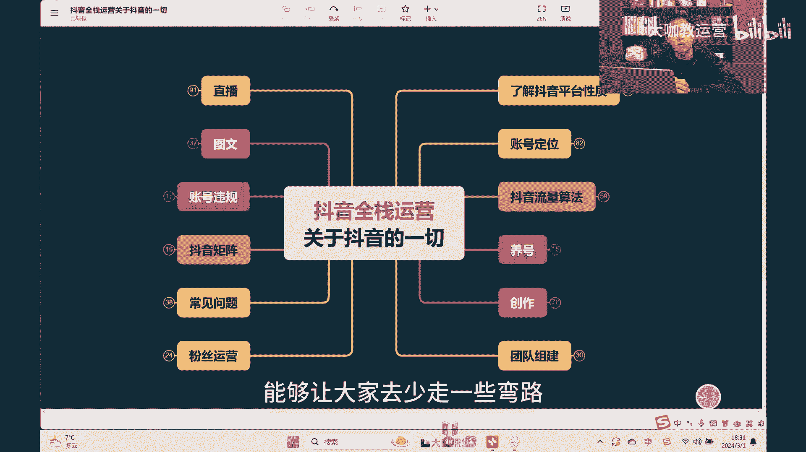

好吧，那么接下来的话呢，我们一起来看一下整个课程哦，我们是怎样去学习的。

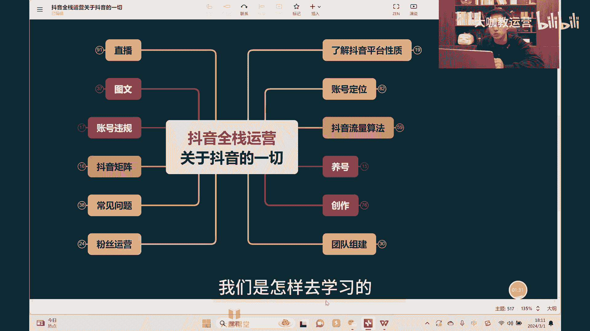

呃是这样，首先呢我们大家作为新手，其实刚开始去学习做抖音的时候，说实话啊不用那么着急去做，不用那么着急去啊想我要做怎样的一个账号，要做怎样的一个内容，其实这是不是我们刚开始要去考虑的事情。

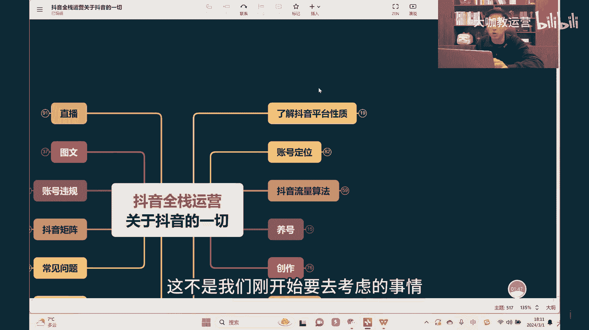

我们刚开始，首先其实要去了解这个平台，它是怎样的一个性质，嗯对吧。

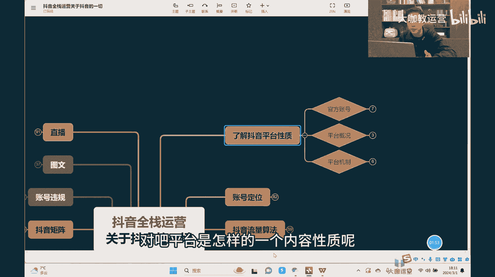

平台是怎样的一个内容性质呢，就会决定啊，你这个平台它的一个流量算法是怎样的，因为流量算法不同，那么人群也不同，所以适合的赛道也好，适合的变现模式，需要的一些底层逻辑它都会完全不一样。

就像我呃这个视频对吧，我现在做的这个视频为什么我会发在B站啊，为什么我没有去发在小红书。

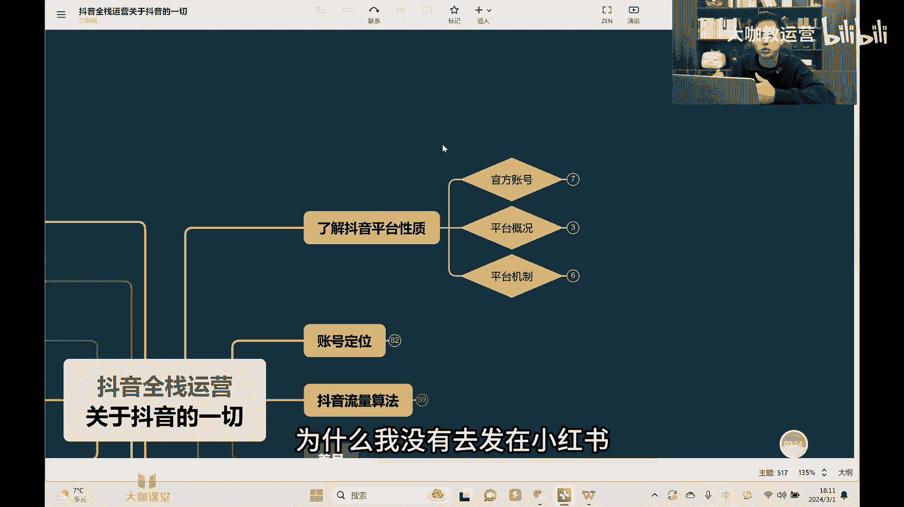

没有去发在抖音，它都是有原因所在的，对不对啊，所以的话呢，首先其实我们要先了解这个平台的性质，那么基于此了解完之后，我们要去了解。

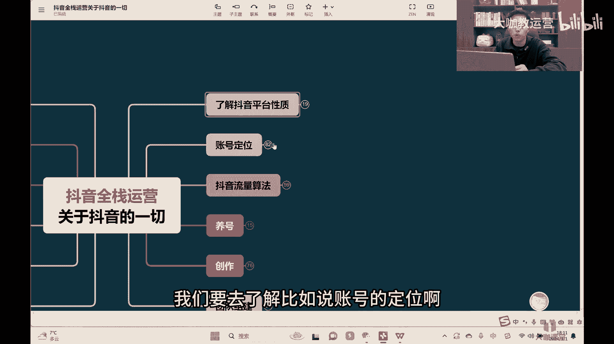

比如说账号的定位啊，然后呢在账号定位这个过程当中，我们会发现它确实内容还是相对很多的对吧。

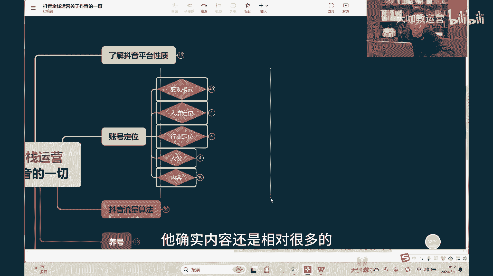

比如说它的便携模式啊，抖音现在呢便携模式非常成熟，而且便携模式呢也有种类也会非常多，不同的变现模式适用于不同的一个情况，不同的啊，咱们的一些人群对吧，他的一个做的一些内容的输出的方式啊。

表现形式和适应的一些领域都会完全不一样，我们首先要去啊，弄清楚自己适合或者能够去做的一些变现模式，是怎样对吧，确定好这个方向之后，OK那么还要基于此去确定我们对应的一些粉丝，他们的人群。

他们的一个定位对吧，适用于哪些行业的对吧，以此再去做我们自身的一些，比如说人设对吧，这些东西确定好了之后，最后我们才能去做内容啊，方向去做一些运作，OK好那这些东西我们确定了之后。

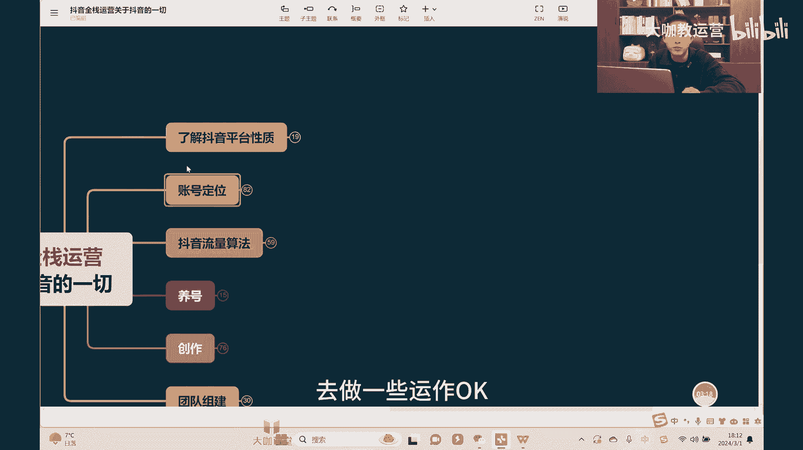

我们才知道啊，我们未来的一些路的方向到底在哪里，甚至于说我们未来到底要不要去做抖音，这个事情，我们才能够确定下来，对吧，确定下来之后，Ok，那我们其实首先第一个也不是说，立马就上来去做。

而是你要先去了解抖音它整个的流量的算法，它的一个逻辑在哪对吧，每个平台它的流量算法是不一样的，同样作为短视频的这个平台，那么抖音和快手就就是不一样对吧，然后和什么小红书和视频号，又是更加完全不一样的。

所以呢我们既然做的是抖音，我们就一定要了解清楚抖音他的流量，它的规则是什么，其实我们有的时候呢，网上会有一些说法会跟你去讲啊，抖音呢其实本质上它是一个什么流量平台，对吧啊当然这种说法呢也不算错。

但是有这样的一个说法，其实背后就什么，背后就是呃为什么说他是不算错的，其实背后就是因为呃抖音他的流量，他是有一套这样的规定下来的一个规则，一套算法的一个规则已经归放在那里了对吧。

那么我们想要去获得这些流量，其实我们就需要去遵守这样的一个规则对吧，去把这个规则玩明白，那所以我们玩游戏，先要把规则摸明白了才能去玩，对不对啊，以及说各项指标想要去提升你的指标。

那么呃提升到什么样的程度也好，或者如何去提升这些东西，我们要先了解清楚，然后我们再来去做手做账号。

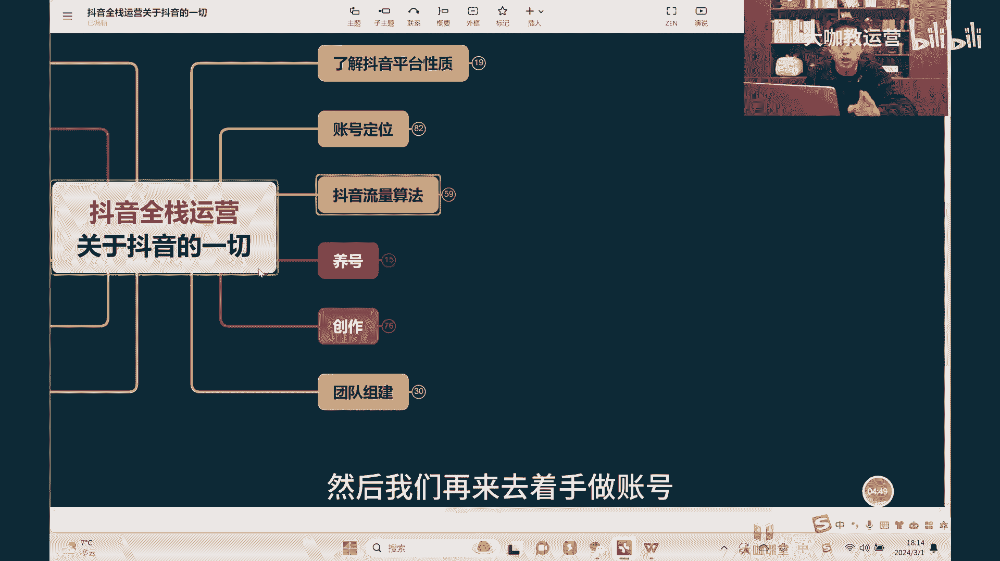

那做账号的第一步，其实也是我们经常会提到的，一个非常有争议的点，叫做养号对吧啊，网上的关于养号这个东西呢说法也非常多，尤其我会发现一点，就是大家作为新手，越是新手，其实越会关注于呃咱们养号这个事情。

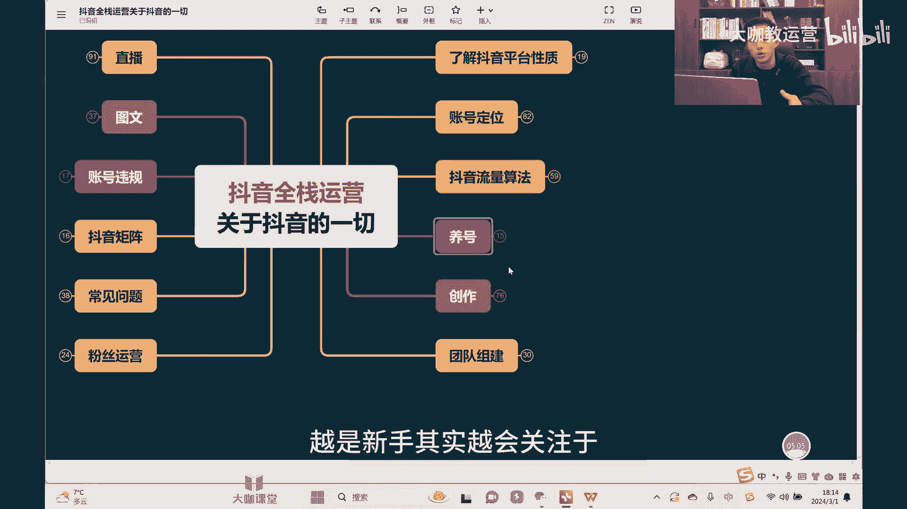

但是呃很多网上的一些说法都会跟你去讲啊，养号怎么养对吧，你要做什么样的一个事情，但是会很少有人告诉养号的目的，养号的带来的结果是什么，那因为我们做任何的事情，我们是带着目的，带着原因去做脱离的目的。

那么一切的操作，一切的说法其实都是空谈，甚至是都是在耍流氓是吧，那这些东西我们是需要从头到尾啊。

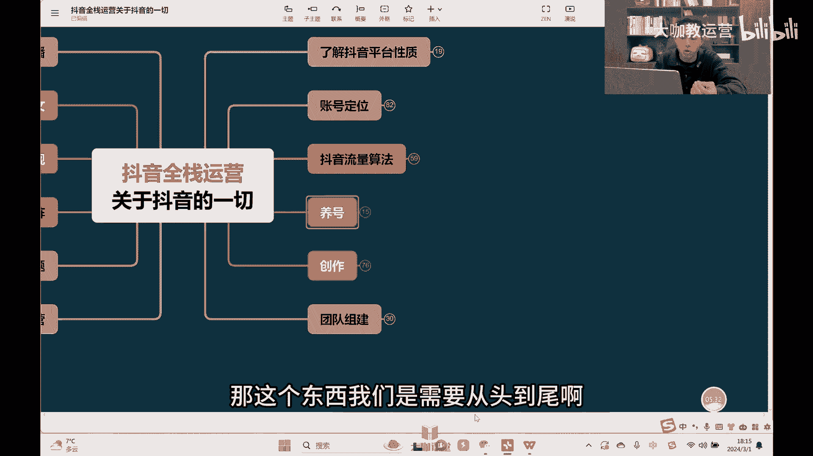

1。1点内部去掰开来，我们再去讲那任何事情。

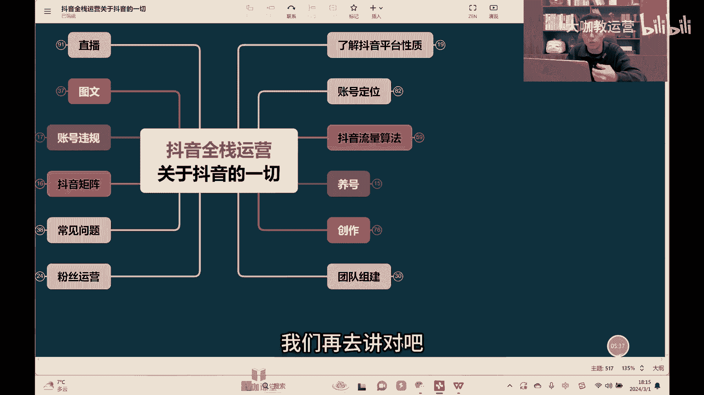

说实话我们学习的过程是需要了解原因，对对了解了原因，了解了底层逻辑再去做事情，我们才能够去做的明白，因为毕竟我们不是说啊去学校考试啊，我只需要去应试，这是完全不一样的，对不对，好，那么完成了养号。

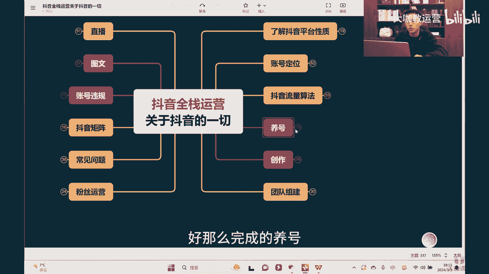

我们接下来带来的是什么，是创作，对吧O。

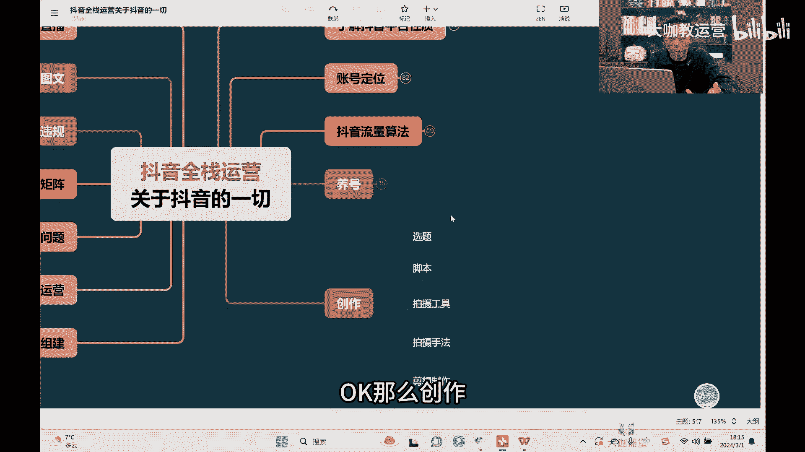

那么创作也是我们很多的一些新手，小伙伴会比较在意的，因为有很多的一些同学以前本身不是做这行的，甚至于说和这行业完全完全不搭边，那么没有相应的这些基础的技术作为底，对吧啊，比如说像什么选题嗯。

怎么去写脚本，然后呢啊相应的拍摄工具有哪些，这些机器怎么用，灯光怎么用对吧，拍摄的技巧，拍摄的手法如何构图，是于你如何去剪辑，做后期啊，做什么配乐等等很多这些东西，有的同学可能确确实实完全没有觉。

没有接触过那这些相关的技学基础知识，但是呢又是必须得懂的一些东西啊，在网上确实很少有人会去加，有的话呢也都是一些相对比较零散的，不够呃，系统不够成套的这样一些东西，那么我也会把这些东西全部呃。

结合抖音这个平台来告诉大家如何去做。

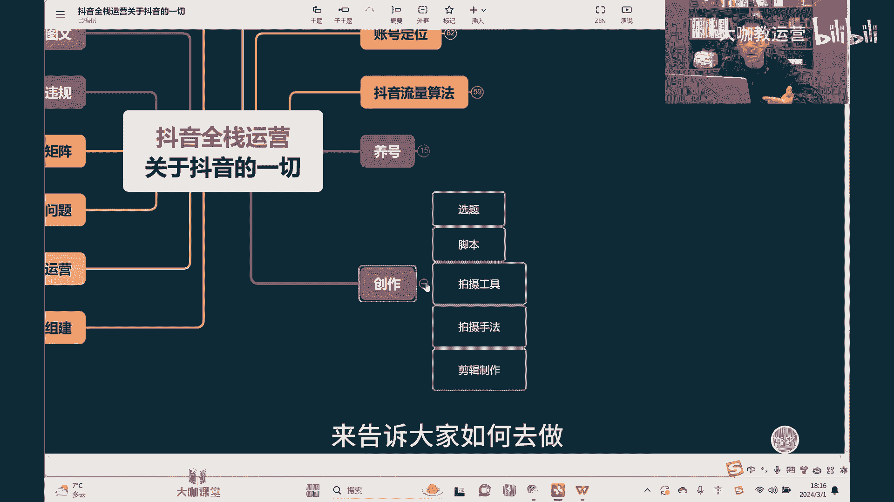

好吧好，那么再其次就是我们既然说啊，把这些东西学会了，我们能够去做一个账号，能够去做一个短视频的一个整体运营之后，Ok，那么呃有一些同学，未来可能会在这个行业长期的发展下去对吧，比如说做运营的管理。

做这个团队的leader，还有的一些这个同学，因为可能自己本身就是开公司，或者呃作为商家对吧，那么想要去组建这样的一个团队，OK那么团队如何去进行配置，对吧啊，团队如何去配置，除此以外呢。

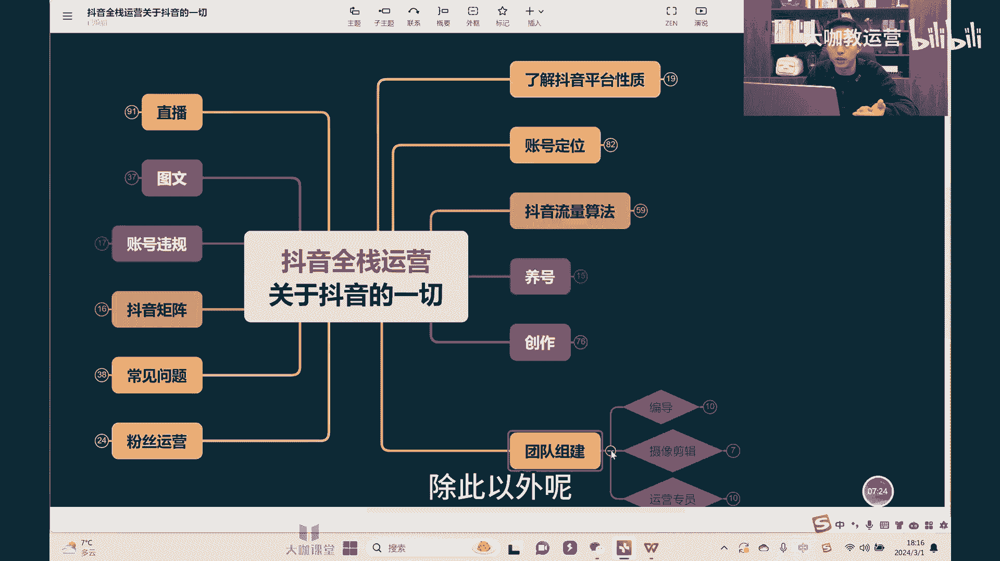

嗯还会去干嘛，每个不同的这个岗位，他需要做哪些事情，需要具备哪些技能。

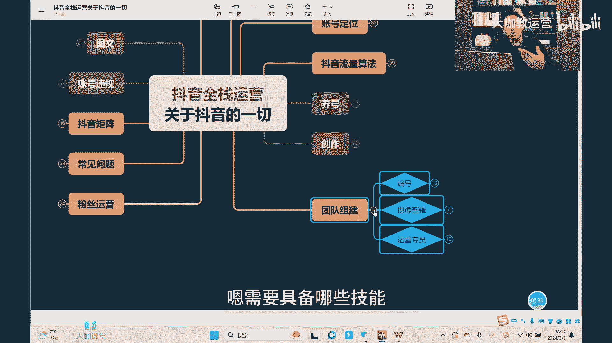

甚至于说你如何去招这样的一些员工，应该如何去给他开工资。

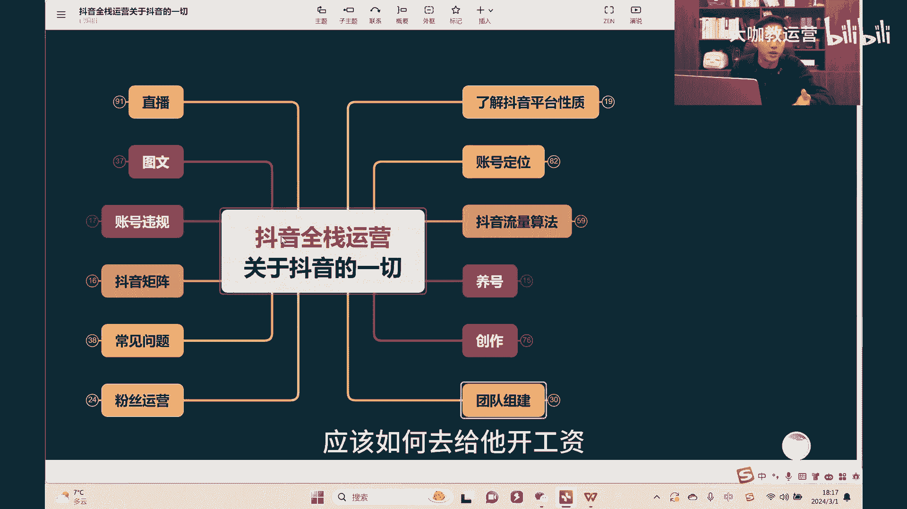

那这些东西其实我们都会给他去讲了，嗯对吧好，那这是关于我们说短视频的板块。

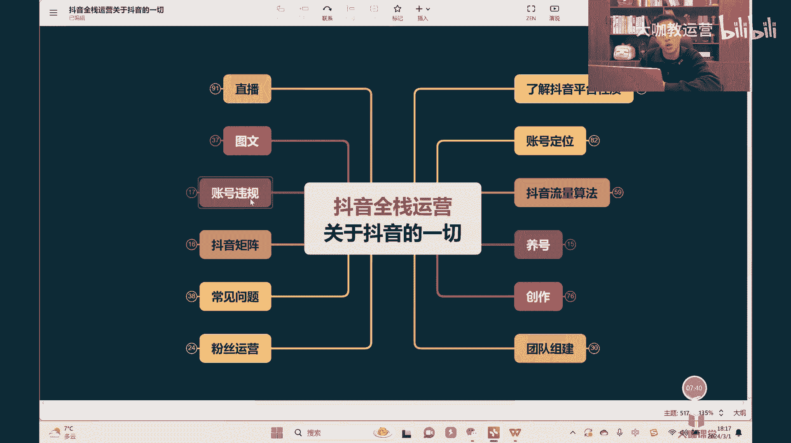

短视频完了之后是什么呢，就是我们说相对进阶一些的，其实就是直播啊，因为为什么说直播是进阶一些的，因为抖音他的直播和他的短视频，其实是完全分开的，两个不同的这样的一个逻辑，那么呃直播这一块。

说实话它的玩法会更加的复杂一些，会更加的呃门槛其实说实话也会更高一些，因为直播现在在整个的呃行业当中，其实已经是很卷了对吧，那么我们会带着大家去完全的拆分，比如说直播前中后啊，你应该做哪些事情对吧。

直播前的脚本构造对吧，场景的布置，选品测评过品啊等等，然后呢直播当中话术应该怎么去写，话术应该如何去演绎，你作为主播，作为运营，作为助理等等，你应该做哪些事情，下播之后，我们的数据又应该如何去分析。

如何去复盘，如何去优化对吧，那么不同的这种品类，不同的赛道，不同的人群嗯，你又应该做哪样的一些事情，以及如何去投流，嗯对吧，不同类型的这种账号，不同类型的这种情况下，你如何去起号。

因为他的起号方式也会完全不一样。

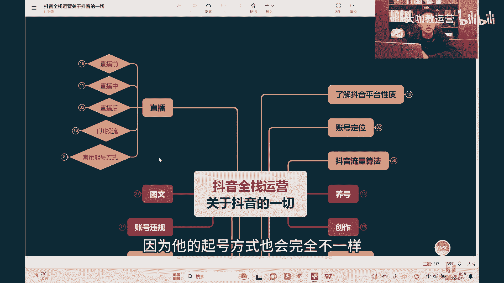

对不对，那这些所谓的东西会给大家呃，从头到尾一点一点的去学，但是呃我们会需要有一个过程对吧，然后除此以外呢，还有就是我现在比较推荐的呃，就是大家可以去做的抖音，从去年下半年开始去推的一个呃赛道。

就是抖音的图文，它和呃小红书还是会有一些不太一样啊，会有一些不太一样的地方啊，然后的话呢因为图文本身它的门槛，它的难度会相对低一点啊，所以是我比较推荐的，在除此以外。

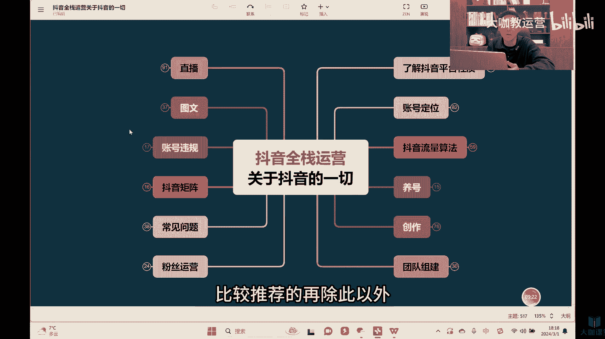

还有比如说像什么账号违规对吧，账号矩阵啊，然后呢一些常见的问题，以及做到后期我们会需要去考虑的。

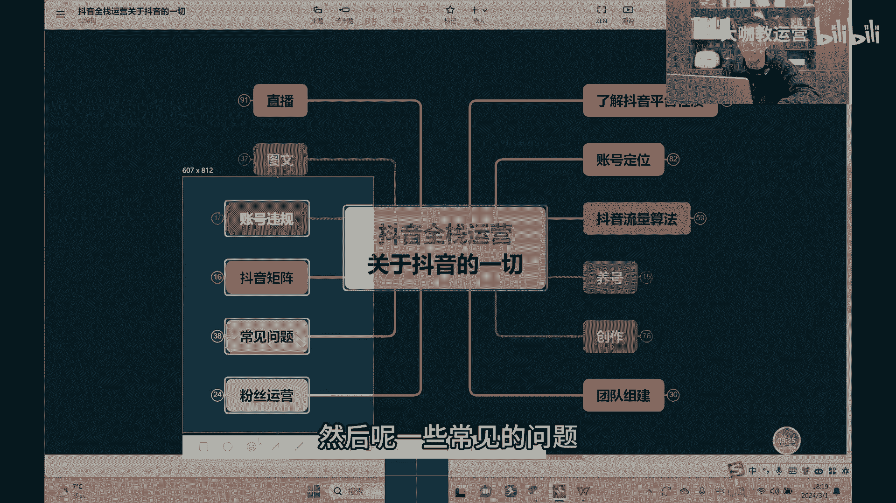

比如说粉丝运营相关的问题对吧，那呃还有一些可能现在我们又直接体现在这个。

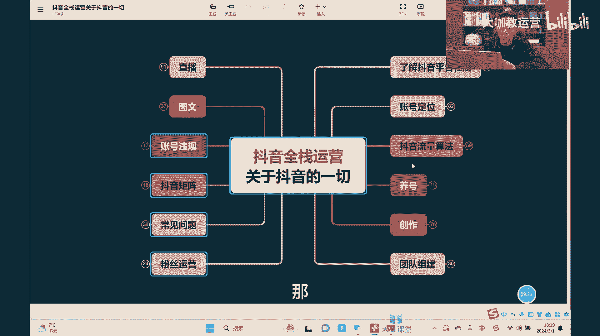

呃嗯导图的这个表面是吧。

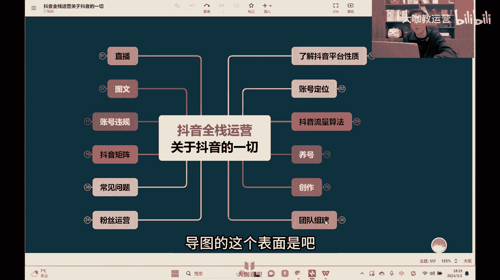

比如说像投抖加对吧啊，像投这个呃我们的这个随推对吧，这样的一些东西，还有说像我们的一个抖电嗯啊。

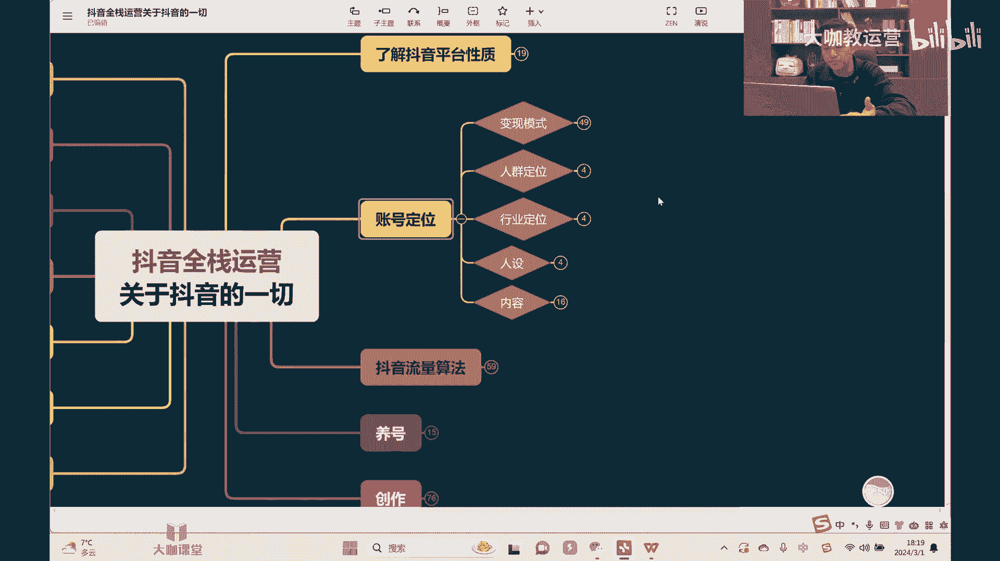

然后这些东西该怎么去做，以及说哎可能还有一些这个什么服务商对吧，然后呢接待运营啊，怎么去找达人，怎么去接广告。

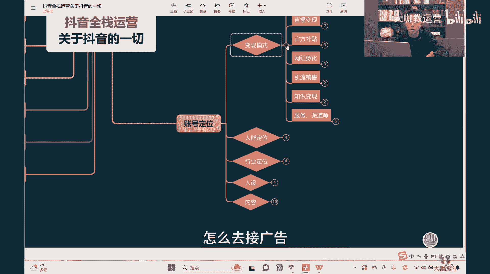

怎么去对接相应的品牌方对吧，如果我有特殊的行业，我如何去找地方。

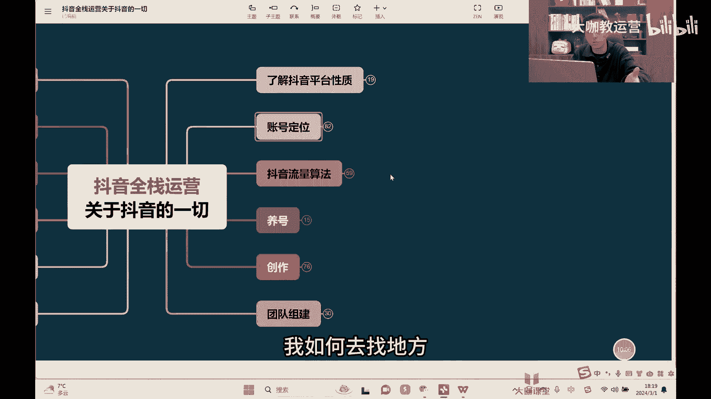

帮我去申报相应的资质，如何去报白，那这些所有的一切，但凡只要是和抖音相关的所有知识，我会在接下来的课程当中一一给大家有条理，有逻辑的一条一条的去讲对吧。

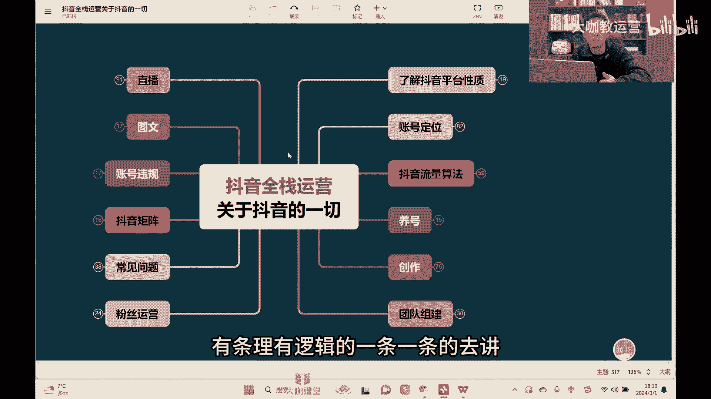

所以你们会看到我的课程，它的一个设计也是围绕着我们作为新手小白。

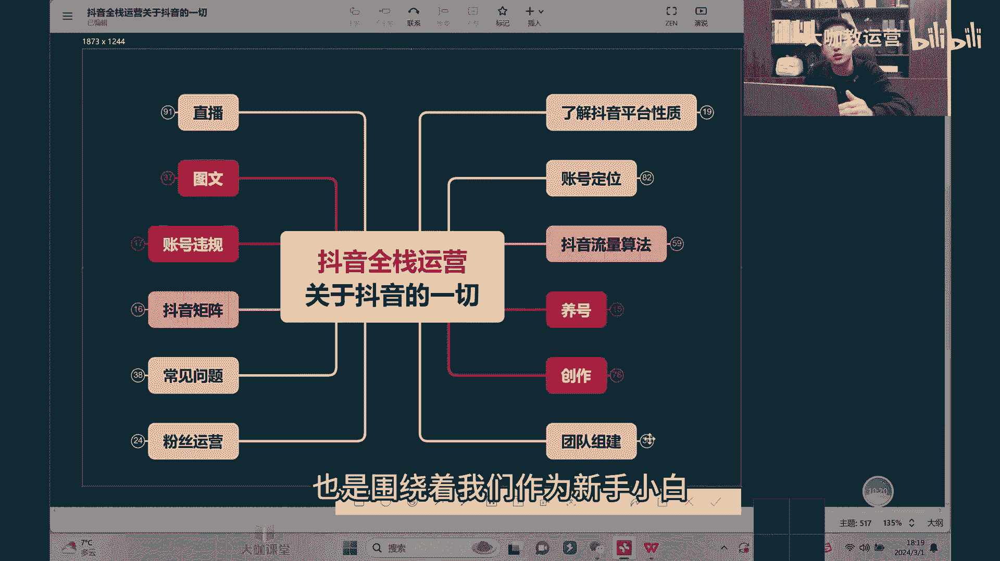

整个的一个学习的逻辑路线，来去给你们去串通过的啊，但是呢这一整套的一个知识量和内容。

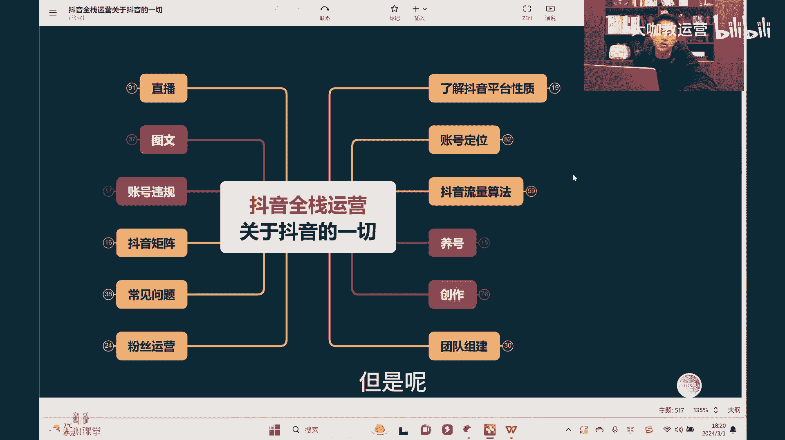

确实呢非常的庞大，所以的话呢不可能说一两节课，我就能够给他去短时间内讲完，所以的话呢我会把这一整套的课程啊，做成一个系列，然后呢长期且稳定的来去给大家更新对吧，那么如果说呢大家呃觉得我的这一套课程。

这套视频还不错的，同学呢，可以对我们的账号进行持续的关注，并且不要吝啬咱们手中的币啊，能够给我们的视频来一个一键三连，让咱们的这套视频课程呢被更多想要学习，或者呢正在做抖音的一些小伙伴们能够去看到。

然后呢也可以呢分享给你们身边正在做抖音，或者想要做抖音的同学们一起来去学习，同时我们也建立了抖音运营的交流社群，社群的进入的方法和资料的一些领取方法，都在咱们视频下方的简介和评论区，置顶区里面都有好吧。

OK那么这节课呢我们就到这里。

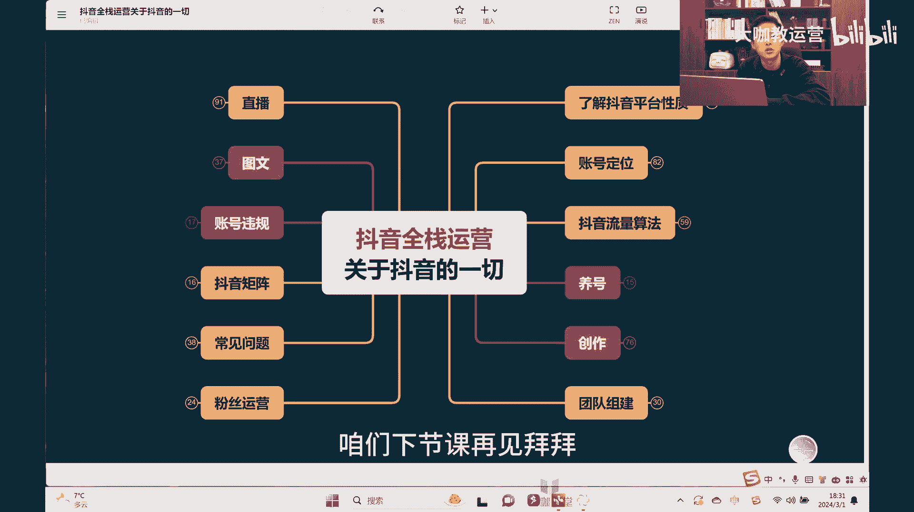