# 【2024B站最强小红书运营系统教程】吊打一切付费课!小红书蓝海市场 2024最值得做的新媒体平台 - P34：2、短视频运营：认识抖音平台，了解抖音平台属性及偏好 - 大咖教运营 - BV1sn4y1X75u

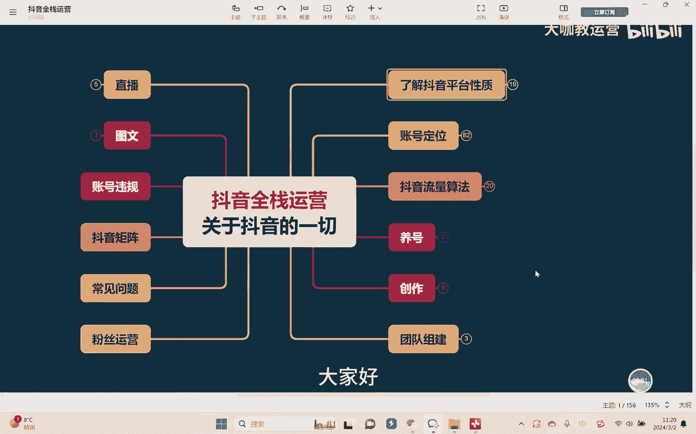

欢迎来到咱们抖音全站运营课堂，的第一节正式课程，那首先第一节课呢我们先不用急着了解学习。

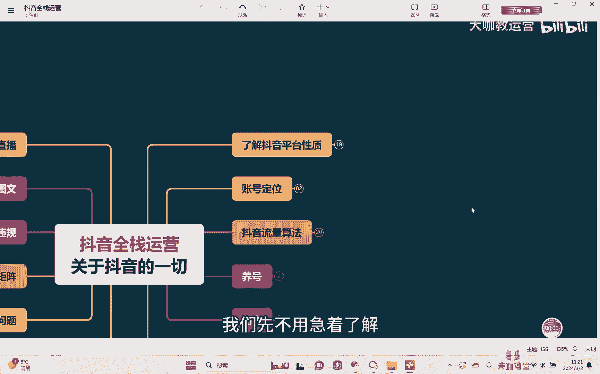

如何去做抖音，而是呢首先来去了解抖音这个平台。

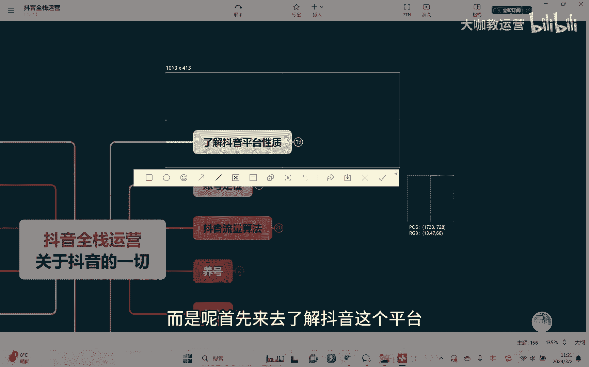

它的一个性质，它的一个属性，然后的话呢呃了解清楚这些，我们在后面去学习其他的内容的时候呢，我们才能够真正的去理解啊，以及呢能够去了解到这个平台，它适合怎样的一个风格，适合怎样的一些人群等等。

我们才能够更好的去学习，首先呢大家作为新手，刚开始去学习的时候呢，先不用太急着在网上找一些呃。

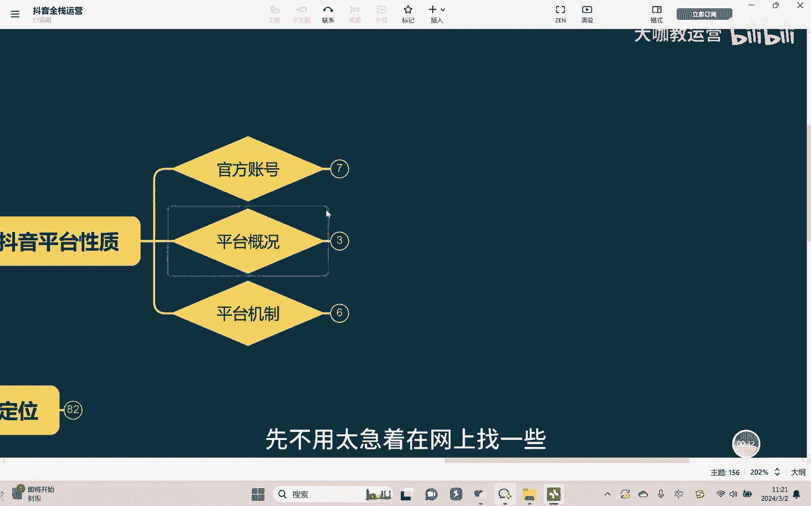

各种各样的一些课程啊，其实呢有一些官方的账号，我们大家呢是适合可以去添加一下的。

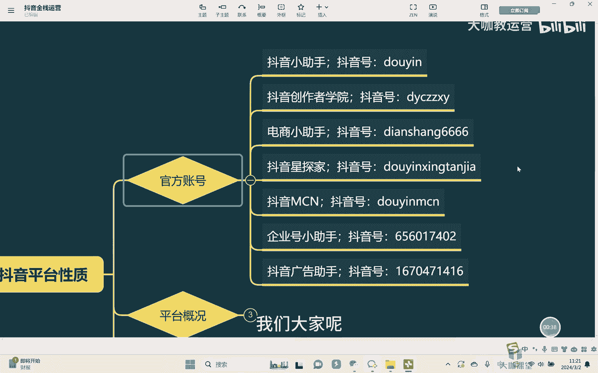

比如说呢像什么呃抖音的一些小助理啊对吧，还有呢抖音的这个创作者学院电商小助手啊，相关的一些这种类似的内容，比如说一些呃抖音目前这个平台上的，比较适合的一些这种呃热点的一些视频。

或者说呢一一些这个电商相关的一些信息，以及一些各方面的平台政策，那么他们也会在这边去进行一个更新，当然了啊，还有一些其他的。

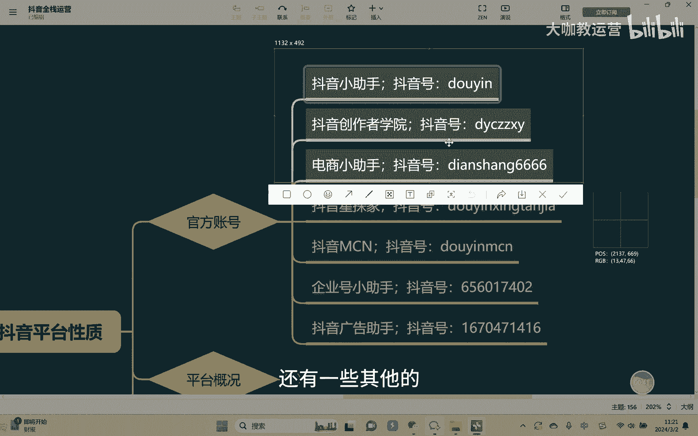

比如说呢有的同学可能需要说，通过他去找一些这种达人对接啊，找到一些这种MCN机构啊，或者说呢呃企业号的一些营这个营销啊，企业号的一些注册啊。

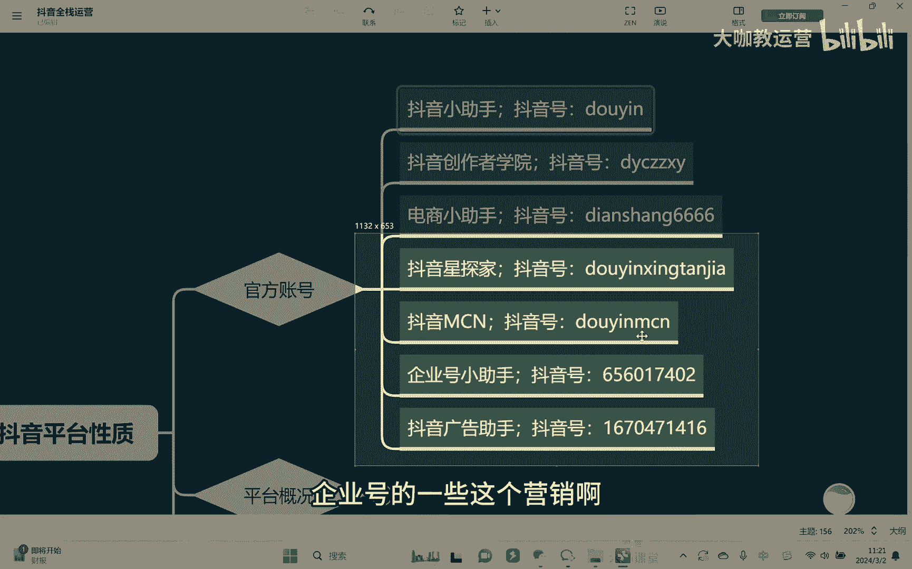

啊包括一些相关的这种呃内容，那么在这个一些官方的账号上。

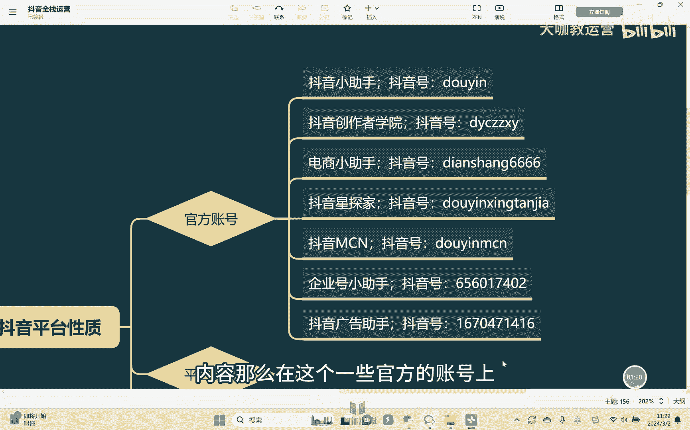

我们都可以找到一些帮助，好吧，那其实这个是我们首先第一步，要去做的一些事情啊，也是了解，第二呢呃我们来去了解一下平台，整理个一个概括啊。

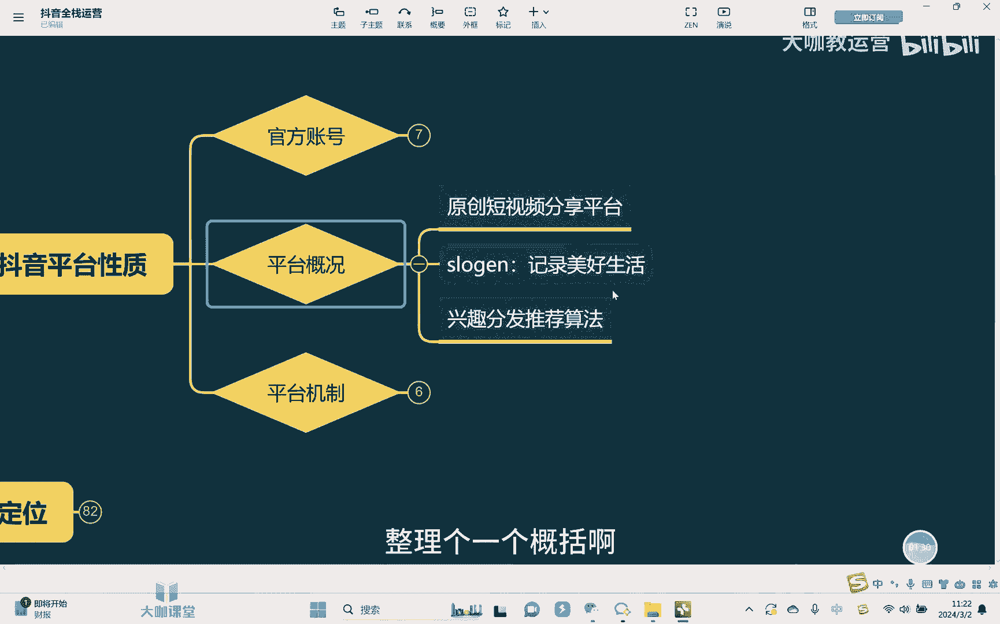

在这里的话我们可以看一下，首先呢呃抖音呢它的一个slogan叫做，记录美好生活，那其实在最早期的时候呢，他的一个slogan不是这个啊，到后来的话呢，差不多从19年的时候他改了啊。

然后呢跟快手是差不多的，然后同时的话呢，呃他呢也是一个原创的短视频分享平台，所以其实抖音呢即便到现在，我们说它呃电商属性已经很强了对吧，还有像本内生活，而且呢直播呢现在在这个抖音的平台上。

已经是做的非常非常的这个成熟，而且可以说是做的很牛了，但即便如此啊，我们要知道抖音它最大的一个核心属性，其实还是在于它的一个原创短视频啊，原创的短视频起家的，所以这是他永远不会去丢的一点。

所以其实可以在这里告诉大家，即便未来呃我们说抖音再怎么样去发展，他的直播也好，或者他其他领域再如何发展的越来越好，甚至于可能大家有听说过，包括说他的什么外卖也好，类似的这种服务啊，同城的这种。

那么它的核心其实很大一块，还是会在于短视频啊，这是非常重点的一点好吧，然后呢我们通过slogan也可以看出对吧，记录美好生活，所以其实平台它是鼓励什么，鼓励的，就是大家作为每一个人。

都可以作为这种原创的作者，去分享自己生活当中一些美好的事情对吧，真实的一些事情，然后呢宣扬一些这种正能量，所以这是平台他的一些属性，那么你相关的这种类似的内容啊，那么OK就是能够看得出来。

那么平台它是干嘛，他是鼓励你的，对不对，同样的他希望大家做的什么，做的是原创，然后记录美好生活，也可以看得出来，他是鼓励大家，每个人都可以成为。

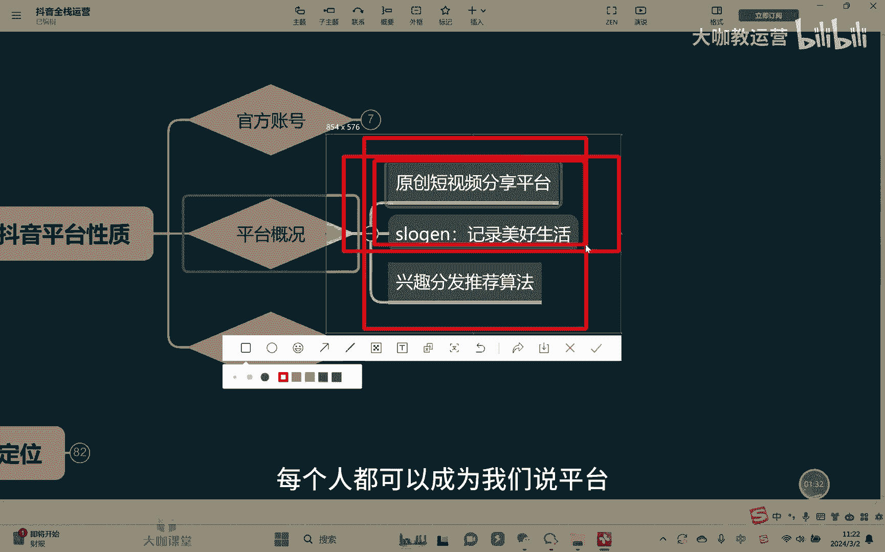

我们说平台当中的一个创作者，那基于此平台，它是一个以兴趣分发为推荐，去作为的这样一个流量算法，简单来讲大家应该都有感受啊，我们平时在刷抖音的时候会发现呃，有一些我们喜欢的内容。

我们刷了自己喜欢的内容时候，我们会多看几页对吧，有相关喜欢的话题，我们可能会去点赞，可能会去评论，甚至于觉得这个博主很有很有意思，这个账号很有趣，我们会去关注他，对不对，那我们表现的这些种种的行为。

其实他就可以啊，平台他后通后台的这些呃，这个算法他就能够哎觉得哦，看得出来我们对哪方面感兴趣啊，看得出来我们对哪些东西我们有一些偏好，而且呢我们每个人肯定喜欢的东西，也是不一样的对吧。

我们可能比如说啊像老师我自己啊，我会喜欢这个足球，我喜欢钓鱼对吧啊，然后的话呢呃我每个东西呢，我喜欢的比重也会不一样对吧，比如说呢我可能呃呃更喜欢钓鱼一些，然后呢其次是足球，再其次呢喜欢吃，对不对。

那么平台呢他也会去记录这些东西，通过你表现出来的所有的一些行为啊，那么去给你去在推荐视频的时候呢，也会去调整不同类型视频呀，不同类型的这些内容它的一个比重，那这就是它的一个基础的一个算法。

所以其实平台它的一个整个的一个算法，现在是非常完善的，然后呢也非常智能嗯，二那同时啊我们也讲到了嗯，我们呢呃这个平台，它本身是一个社区化的一个运营模式，然后呢呃我们其实每个人身上都有两重身份嘛，对吧。

首先第一我们呢自己如果说去做抖音，那么我们可以去发视频，发完视频之后，我们的视频可以被别人去点赞关注评论转发，当然了，我们自己呢也可以去看视频啊，看别人视频的时候，我们也会留下种种的行为。

那我们留下的所有的行为就会干嘛，就会引导平台的一个兴趣分发的算法，然后呢去给我们推不同的内容，那同样的，在我们发布所有相关的这些内容的时候，我们的视频，我们的内容在别人观看我们的视频的时候呢。

也会留下很多的行为，比如说观看的时间长度啊对吧，完播的时间长度以及啊什么点赞评论转发等等，那么别人他也会通过与此去考核，我们的所有的内容，诶，在用户看来有没有兴趣，有没有价值对吧。

这个质量的高低是由用户来决定，而非平台自己平台，它只是把这样的一个流量算法推出来之后，诶，相当于做制定了一套规则，对不对啊，相当于呢他制定了这样一套考核的一个机制，然后呢核心其实还在哪里。

还是在于我们的发布的内容，以及诶观看者他留下来的种种行为痕迹啊，当然了呃基于此，我们也要知道我们每个人既然有两重身份，那这两重身份之间有没有关系的，我可以告诉大家。

这两重身份之间基本上可以完全说是绝缘的啊，因为呃这个涉及到网上有一些说法，我估计可能有同学也是听过，然后这也是之前有一些学员跟我们，去反映的问题，就是关于养号的，因为网上很多会有一些老师会跟你去讲啊。

如果你要起号前你要先养号，那养号的话呢，呃比如说你要做美食的，那你首先要去多看一些啊，做美食的这些账号，这些视频对吧，给他们点赞评论关注啊，甚至于可能购买他们的产品去下单，都是有可能的对吧。

但是你说这种东西对于我们自己的账号本身，起号它有很大的作用吗，各位没有什么作用，因为我说了这两个身份之间他是绝缘的，没有关系，不可能说举个例子，我在线下我开了一个服装店对吧，然后呢。

我想要让我这个服装店呢快速能够呃有人来看，能够生意变好，然后呢我每天我就跑出去看别人，那些卖服装的服装店，然后呢到他们店里去逛，问他们这个东西哎，怎么价格，什么样的品质。

有时候可能还下单去买他们的家里一个衣服，然后我自己家的这个服装店生意就会变好，这个是可能吗，绝对是不可能的，对不对，所以呢在这一点上，大家是不需要去呃，呃这个质疑太多好吧。

呃如果说完美确实有一些这样的说法，那么其实大家就完全不需要去相信这个事情，就可以了，好吧好OK那这个是一方面，另外还有一个很大的属性，我们叫做去中心化的内容分发模式，呃这个词呢我们说因为互联网用语嘛。

很多东西确实是一般人可能不一定听得懂，但是在这里的话呢，我给大家去拿另外的一个短视频的平台，也就是快手去做一个对比就可以了啊，因为抖音它是一个高度集中，和清华的一个内容分发模式。

而快手是中性化的内容分发模式，两者区别在于哪呢，很核心的一点就是我抖音的去中心分发模式呢，它是对谁友好呢，对创作者要好，对新手友好，而快手的中心化的内容分发模式，是对于平台内的那些头部大网红。

大流量的那些主播对他们友好啊，我们会发现一点，在抖音上，我们说了，抖音呢它是有一套很透明，很完善的这样的一套规则，这一套规则已经在这里是确定了的啊。

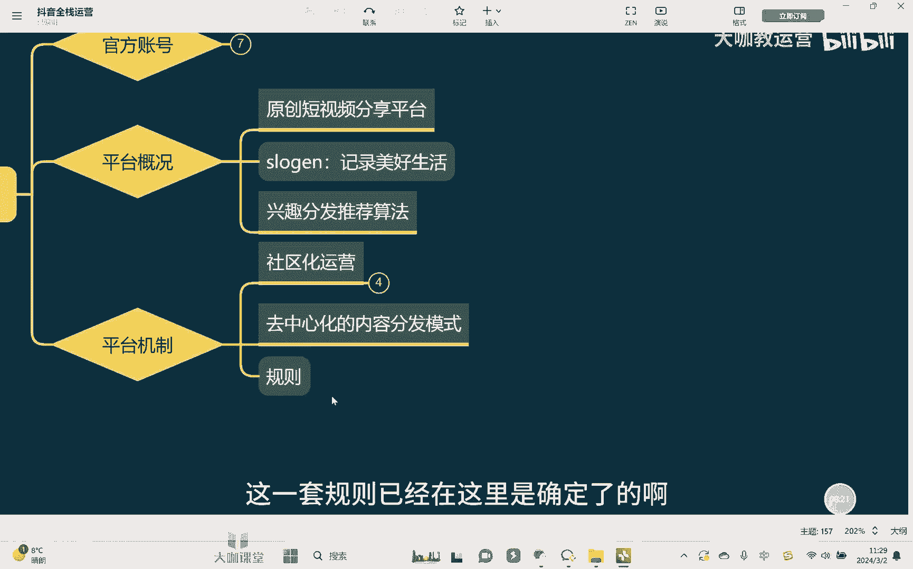

我摆在明面上的啊，抖音要告诉所有人，只要你能够按照我的规则来，你发出去的内容别人喜欢看对吧，会去关注。

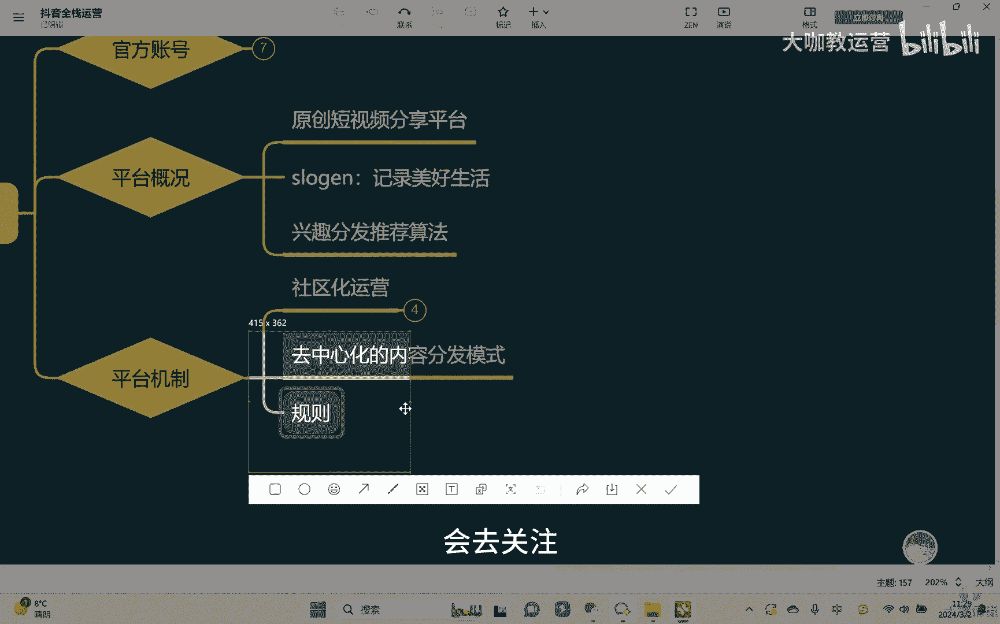

会去保存，OK那么平台我就会给你流量，但是在快手上，各位不是快手上呢，他有一个很明确的点，就是他的达人和粉丝之间的联系，链接性特别强啊，所以呢在P在快手上，你去看视频的时候。

很多的时候不是因为说你喜欢内容，我就给你看，而是什么，而是平台觉得我推这个内容，比如说我这个达人他是有流量，有粉丝的对吧，或者说他本身的这个体量比较高，他去给你推懂吗，所以他一个是主动，一个是被动的。

在抖音上，我们想我们的这个观看视频也好，看内容也好，取决于什么，取决于平台，他对我们兴趣的一个记录平台，只是把这个规则放在这里对吧，至于具体刷到什么内容，说实话还是在于你表现出来的行为和兴趣，嗯对吧。

还是在于你表现出来的一个行为和兴趣啊，但是快手上可能不是，比如说快手，我最近说我要搞一个什么活动，那么我会在平台里大量的给这个活动给流量，而不是呃这个像抖音这样，所以这是他非常大的一个区别所点。

所以这就是为什么我们说呃如果说是新手啊，然后你想去做账号，你在快抖音上一定是比快手好啊，再其次另外一点就是我们说什么呢，抖音目前的整个流量在所有的平台内，它是最大的，这个是没有之一啊。

所谓的流量就是我们说用户数量啊，曝光量其实就这个东西啊，这个是没有质疑的啊，这个是不需要去质疑的，但是我们说每个平台之间，它的内容属它的那个属性是完全不一样，我们的流量大也会带来一些不同的一些效果。

它会有好处，也会有坏处对吧，流量大就是我的机会越多，那坏处是什么，就是什么，就是什么样的人他都有啊，因为平台的属性不一样，就导致很大的一个核心点在哪呢，在于人群不一样，很简单。

为什么我的这个视频会发在咱们B站，我没有去发，在小红书，没有发在快手，没有发到视频号，更没有发在抖音，我讲的是抖音，但是反而我的视频没有发在抖音，为什么，因为各位人群属性不一样。

嗯啊当平台的这个流量人数太多的时候。

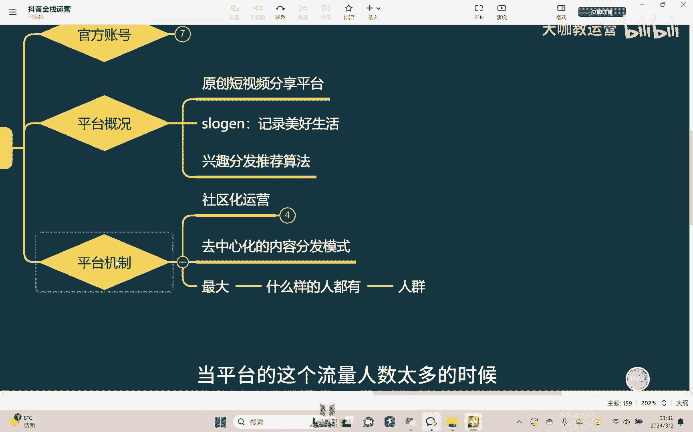

他就会什么样的人都有，所以喜欢什么的事情的人都有。

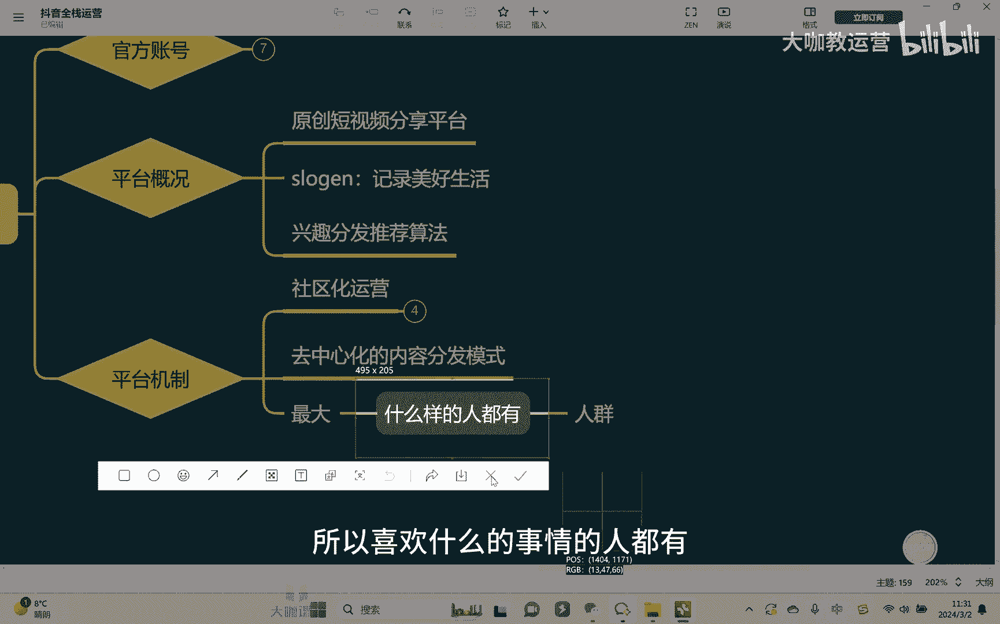

所以你在上面可以做各种各样的内容对吧，但是它体现出来的一个东西在哪，叫做泛粉多，什么意思啊，饭粉多，所以我们如果说想要做特别特别精准，或者说特别垂直的东西，那我其实可以告诉各位。

在抖音上其实不容易明白吗，各位如果说想要做出特别垂直的东西，你需要找什么，你找这种人群更加准确，更加相对窄一些的这种平台，你去做财反而容易一些啊，所以在抖音上，如果说各位你想真的去破圈，想去做爆款。

各位你要抓住的是什么人群，你要抓住的永远不是你的这个专业，特别专业的人，而是什么，而是那些不够专业，也就是范粉才是我们真正要去抓的人，才能够因为这个泛粉什么，他的基数大。

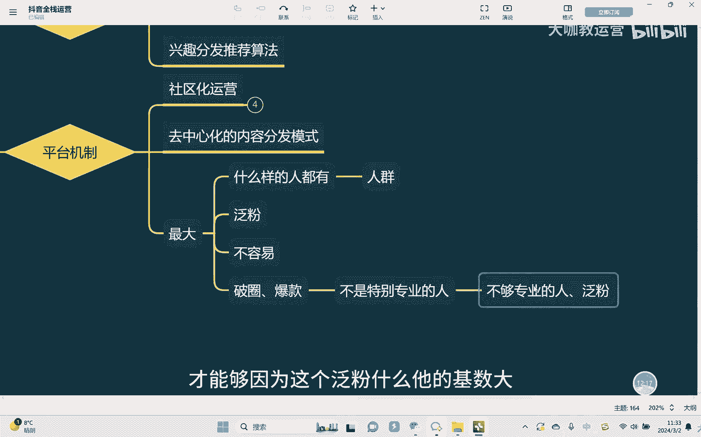

你想要去做爆款，想要去朋友圈，各位你要抓的是什么，是这些人群懂吗。

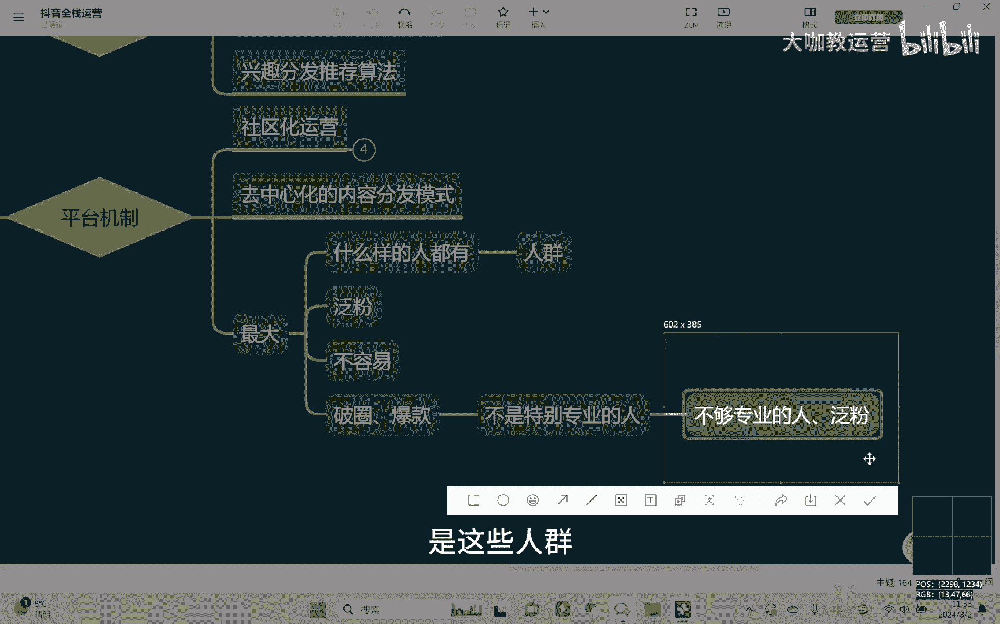

所以这是我们整个平台的树形，大家首先要去了解清楚这个样的一个属性之后，你再去考虑我们后面怎么样去做内容，怎么样去做选题，怎么去做方向，甚至怎么去定变现模式好吧，那么这是我们说整个第一节课。

跟大家去讲的一个大的一个前提，但是因为讲的本身是这种呃，概念性的一些东西啊，很多的这个同学可能刚开始你是作为新手小白，有些这种方面的东西你不一定能懂，但是我希望大家对于这个东西的话呢要重视。

而且呢呃下去之后慢慢的去思考去啊，反复的考虑一下，然后呢我们在学习后面的一些相对专业的，这种呃这种具体的一些知识的时候，其实各位你才能够真正的去理解，里面的原因和底层逻辑所在，好吧。

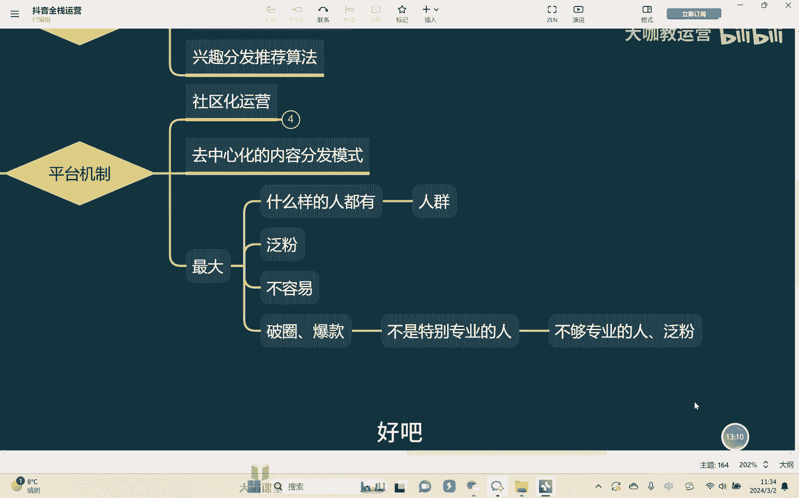

那么第一节课我们就先到这里结束啊。