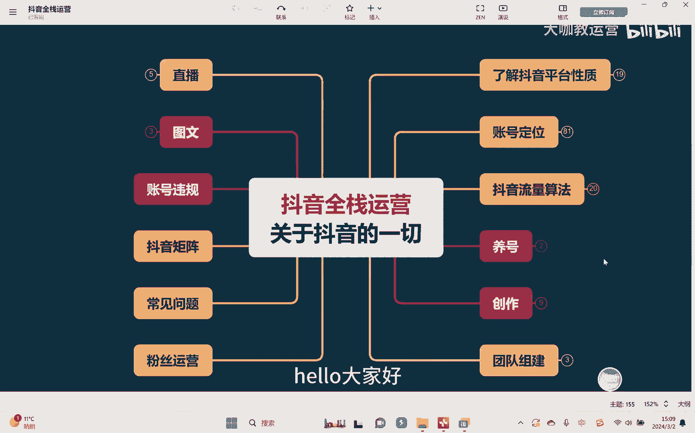
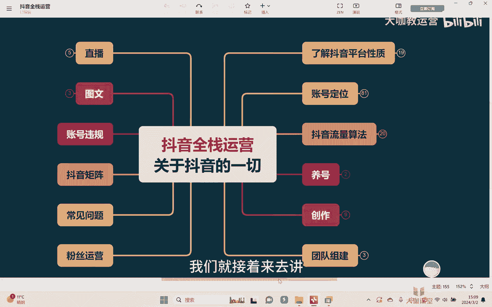
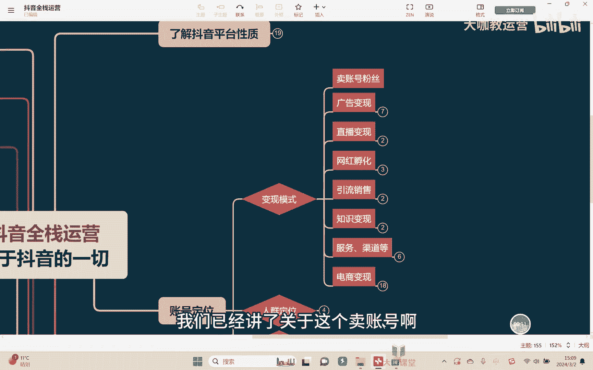
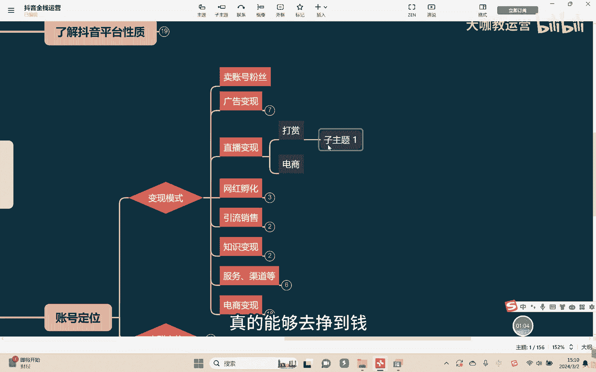
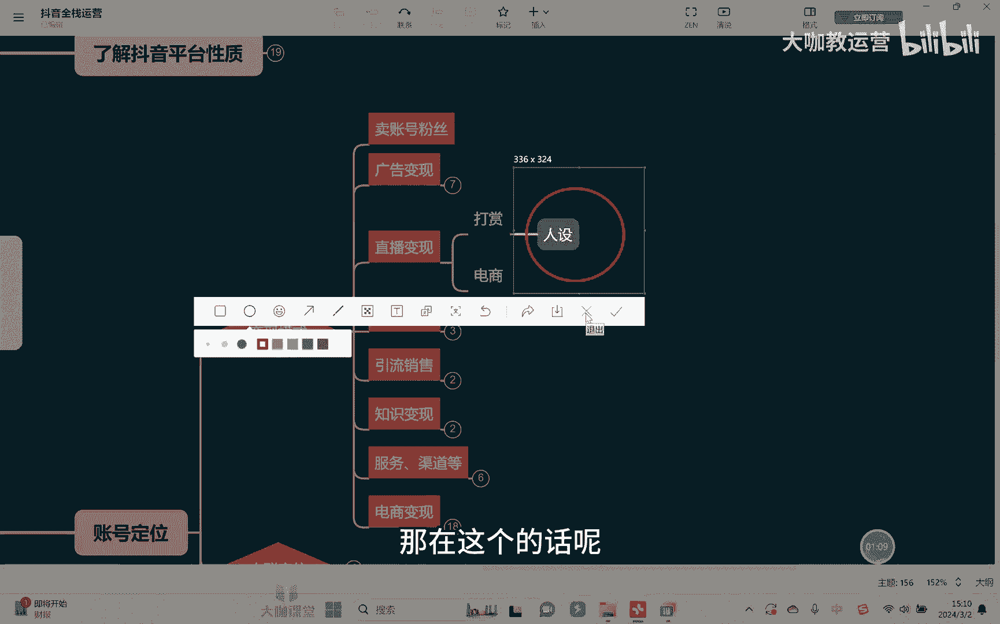
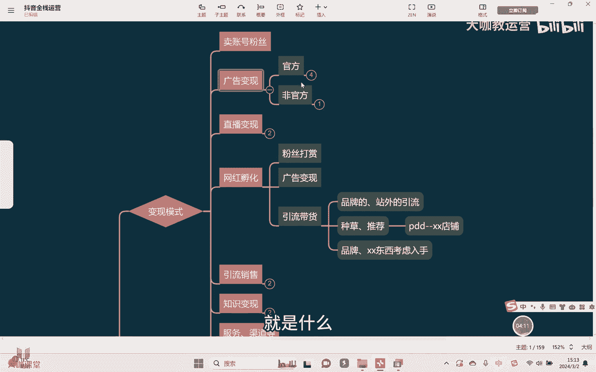
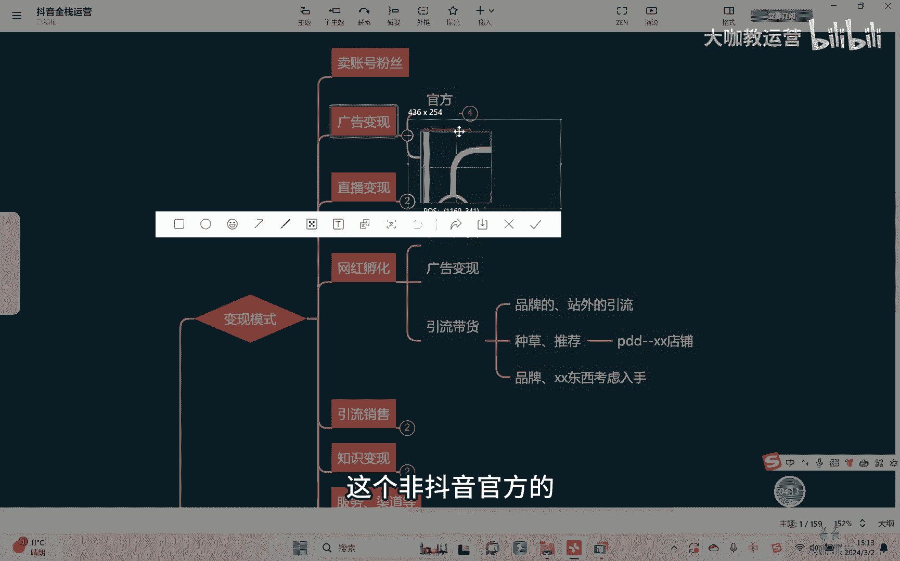
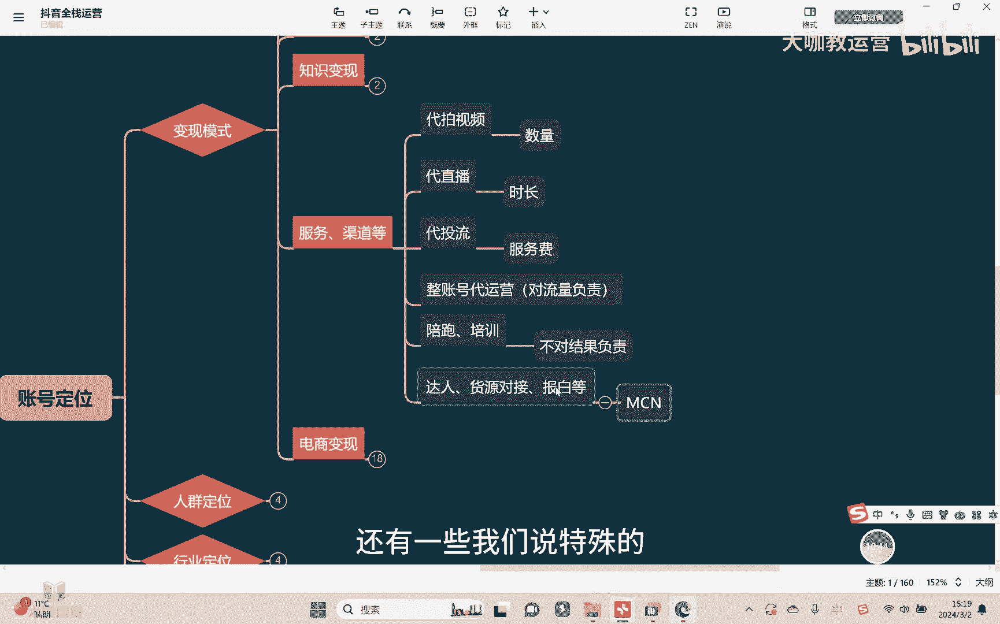
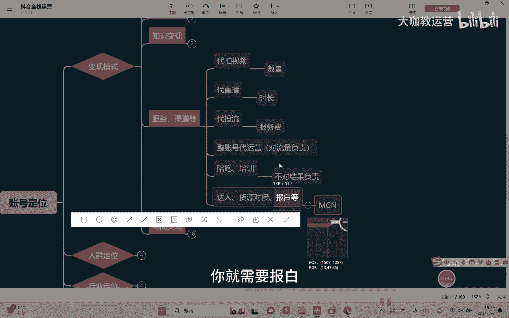
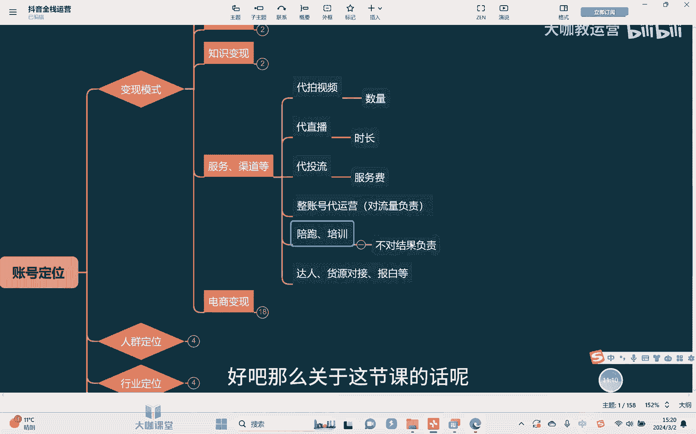

# 【2024B站最强小红书运营系统教程】吊打一切付费课!小红书蓝海市场 2024最值得做的新媒体平台 - P36：4、短视频运营：抖音全体系相关的可变现路径 - 大咖教运营 - BV1sn4y1X75u

大家好。

欢迎来到咱们抖音的全站运营课堂系列啊，这节课的话呢，我们就接着来去讲关于账号定位的。

一些其他的变现模式啊，呃上节课的话呢，我们已经讲了关于这个卖涨号啊。

还有什么广告变现对吧，那除此以外呢，还有比如说像直播变现，直播变现呢，目前呢基本上只分为两种，第一就是我们知道的这个打赏礼物啊，然后呢，还有一个就是关于这个电商型的一个直播，那关于电商直播的话呢。

这是一个非常重要的板块，我们会在后面讲直播的时候单独去给他讲啊，单独去跟他讲，所以这里的话呢我们就不多呃，不过多的去讲了，因为这个方面的一个知识内容非常多，那除此以外的话呢，还有像打赏礼物。

打赏礼物呢其实就是我们说余波嘛对吧，但这个东西其实男生也好，女性也好，他都是可以去做的啊，那么它主要是体现你的一个个人的呃，我们说找大哥去给你打赏礼物，那你肯定个人要有一些这个性格对吧。

要有一些这种所谓的这种才艺技能，然后才会有人去喜欢你，所以在这块的话呢，如果说想要在打赏这一块真的能够去挣到钱。

那么非常重要的一个东西是什么，是人设啊，因为你要知道呃，他之所以会给你打赏，说白了什么，说白给你打赏的这个人，就是他喜欢你的表演节目也好，或者说喜欢你的这个人对吧，所以在人设这一块啊，个人的一些性格。

个人的一些特点突出，对不对啊，你要把它凸显出来，那在这个的话呢是比较重要的好吧。

那关于打赏这个事情呢，我们在这里呢也不过多的去讲啊，因为的话呢，呃他其实主要的核心就是在于做人设，那其他的一些技术的东西，我们一样的会在后期单独去讲，直播的时候再跟他去讲好吧，那再除此以外。

还有我们说像网红孵化了啊，网红孵化呢这个大家也见得比较多了啊，然后的话呢它主要的变现方式其实一啊，就是这个粉丝打赏嘛对吧，直播可以打赏，但其实现在的话呢呃短视频也是可以打赏的啊。

短视频平台也是可以打赏的，但是的话呢说实话这个东西很多人不知道啊，再其次的话呢呃操作起来也会相对的麻烦，所以的话呢大家呃平时的话呢关注也不会很多，所以目前来讲用通过短视频，然后引导粉丝去打赏。

这个东西呢还是不是很好做啊，不是很好做，当然了除此以外，还有我们有时候可能会看到的，就是呃在直播过程当中去给他开一个什么，就给账号，可能会开一个单独的一个什么付费会员啊，这个也会有啊。

当然这个的话呢也会相对少一些对吧，另外除此以外，就是我们说的关于呃不同的那种类目的，你可以去做一个广告的一些变现，这个我们在前面讲广告变现的时候，本身也讲到了对吧，还有就是引流带货。

那这个引流带货呢我们不是直接说的是电商，而是什么呢，而是可能比如说品牌的，或者是站外的这样的一个引流去带货啊，这个有时候大家可能看到过，就是看一些这种视频内容的时候，他的下方没有去挂这个产品。

本身他的一个小黄车没有去挂对吧，但是他可能会通过某些方式，通过软管也好，通过硬管也好，跟你去介绍这个产品给你干嘛，给你去种草，给你去推荐对吧，然后去告诉你这个东西它在哪呢，举个例子，他可能在某多多。

对吧，他可能会在某多多啊，告诉你是哪个店铺的，什么什么店铺啊，然后告诉你这个东西特别好对吧，哪哪哪里好，然后呢你可以去那个地方去买，而且价格很便宜，对不对，他也可能会干嘛呢，哎会跟你去讲目前什么品牌的。

什么什么什么东西，哎，现在的话呢，我用的比如说某某某品牌的一个化妆品，我最近用的感觉效果特别好对吧对，什么样什么样的一些人群，我觉得非常不错，那这个东西大家可以去考虑入手，啊这样的方式可以去做引流带货。

那其实包括出这样的方式，你们也可以去结合我上节课跟大家去讲的内容，就是什么。

就是非官方的，非通过呃，这个非抖音官方的这个新图的渠道。

然后去做这样的一些广告啊，去做这样的一个引流带货，其实就是一样的，明白吗，各位好吧，这是我们讲可以去做的一些方式啊，当然了还有什么引流销售啊，比如说呢你可以去做站外的，像引流到微信是比较多的啊。

当然我们刚刚讲的是什么呢，刚刚我们讲的是这个关于一些其他品牌啊，其他的一些酒店，那除此以外你还可以干嘛呢，还可以销售一些，比如说招募代理商啊，这个是大家比较熟悉的什么微商的一些模式啊。

通过了这样的一些软管，然后让人家去加了你的微信，加了微信之后再在微信上面啊，也就是其他的一些平台去进行一个呃，这样的一个转化，那然后的话呢，包括我们讲的你自己线下去开店铺啊，他也是完全可以一样的好。

那这个是我们讲有实际的一个产品的东西，去卖的一些东西去做对吧，那还有什么呢，还有说没有实际产品的，比如说像知识变现啊，那知识变现的话呢也分为线上线下，线上的时候，那一般短视频嗯对吧，还有什么呢。

信息流广告，啊也就是我们讲的落地页H5啊，落地页H5啊，就这么个东西，对不对，那这个落地页H5的话呢，基本上是花钱去投流啊，当然了他也不是在抖音投啊，这个的话呢是在这个头条啊啊这样的一些地方。

通过哦外部的这个呃广告公司，然后去帮你去投，那除此以外还有什么呢，还有比如说直播对吧，也是一种方式，直播的话呢你可以在上面去干嘛，去讲你的一些相关课程，人家可以去给你打赏，同时你也可以让他去关注你。

然后呢一样的去干嘛加微信对吧，然后干嘛再去做引，再去做转化，对接是不是好，那除此以外在线上能不能做呢，也可以，比如说像我们刚提到的落地页H5这个东西啊，你点进去之后的是一个落地页的一个详情页面。

然后对吧，流资留下你的联系方式之后，OK那么那个公司会去给你打电话，比较常见的，我们举个例子，像什么这种留学的对吧，还有什么学历提升的等等，这种会比较多啊，还有当然啦，比如说再举个例子。

还有什么像我们学习做抖音的对吧，做抖音的也可以学习嘛，是不是啊，然后呢呃这样的所有的但凡是知识相关的，你都可以去学习，留下的方式他会去跟你联系，那再除此呃之外的话呢，会可以干嘛呢。

还有就是呃我们可以添加一个什么小风车啊，这个小风车的话呢有前提条件，就举个例子，如果说你是办相应的这个教学的对吧，但是呢你想去在这上面去做一个明确的招生，那不好意思呢，因为你是要做生意，那你就需要干嘛。

你就需要去报白啊，报白这个事情我们在后面再去讲，还需要什么呢，蓝V认证嗯，啊当然报白这个东西涉及到不同的类目，不一定啊，但是首先你需要有一个什么企业号认证啊，企业号认证这个是需要的。

那么企业号认证之后再去给你开通什么呢，开通巨量百应，开通完了巨量百应之后，在巨量百应里面，一般情况下，我们做电商巨蛋百一名是干嘛，去在里面去挂你的相应的产品，把产品挂到购物车上。

但是如果说你是知识付费的，可以去挂什么挂小风车啊，然后点击小风车去留相应的资料，用户在上面去留相应的资料之后，你再通过什么电话的方式也好，微信的方式也好，去跟人家去聊信息，然后呢呃跟他去沟通。

然后再去进行一个转化，那这是知识变现的一个线上的，所有的这些方式好吧，那除此以外啧，再就是我们讲的线下对吧，那线下的其实主要也是需要通过什么呢，呃线下的一些这种办学啊，有时候我们可能会在网上看到。

有些老师跟你去讲怎么做抖音对吧，然后有兴趣的话呢就去加微信，啊加完微信之后告诉你我有线下课多少，多少钱一节对吧，就是这样简单的一个方式啊，所以的话呢万变不离其宗好吧，其实也很好理解啊。

那是说我们讲知识变现的一些这个方式啊，其实就是这些好吧，其实就是这些啊，在除此以外呢还有一些什么服务啊，渠道商，比如说呢可以去做代拍视频，就大家因为以后我在这个行业里面，扮演不同的一些角色啊。

做不同的一些事情对吧，那么你可以干嘛呢，去帮别人代拍视频，然后也可以帮人家去带直播，还有带头流啊，呃但是这些东西通常比如说像拍视频和带直播，一般是干什么呢，给你按这个数量来算或者干嘛呢。

给你按时长来算对吧，那头牛给你按的是什么呢，头流基本上只是什么收你的服务费，就我东西我不会给你去做保证的，知道吗，我所有的这种代运营也好，带头牛也好，我是不会给你做保证的。

但是如果说做账账号的整体的代运营，那可能是要干嘛对你的整体流量去负责了啊，这个是需要对整体的流量去负责的，明白吗好吧，那除此以外还有比如说服务商对吧，去做陪跑做培训，那这些东西都是我之前自己也做过的。

对不对啊，通常情况下，这个东西我们也不会说去对你的结果不负责，啊这些东西是这样的一个特质对吧，那还有一些我们说其他的一些类型的这种事情，做什么呢，还有像我们讲的什么MCN机构对吧。

然后干嘛呢去帮你去对接一些达人啊，因为其实我跟大家说实话啊，目前这个行业我们说了已经很卷了，很成熟了对吧，很多很多人都在往里面做，但是目前这个行业里面还是有很多的商家，我找不到达人。

还有很多一些达人我找不到广告去接，我找不到这个啊对接的品牌方对吧，这个现象仍然还是存在非常大的明白吗，在还有什么呢，还有一些我们说特殊的敏感的。

这样的一些呃行业，举个例子，像我们说你如果涉及到医用呃，医用的这种呃药用的这样的一些产品的时候，你就需要报白对吧。

涉及到什么金融相关的一些产品的时候，你就需要报白啊，那这些东西的话呢，第一费用也很高，那么就需要通过一些特殊的渠道，然后呢去帮你对接好吧，那这个是额我们讲你们可以去做的一些事情啊。

可以去做的一些事情好吧。

那么关于这节课的话呢。