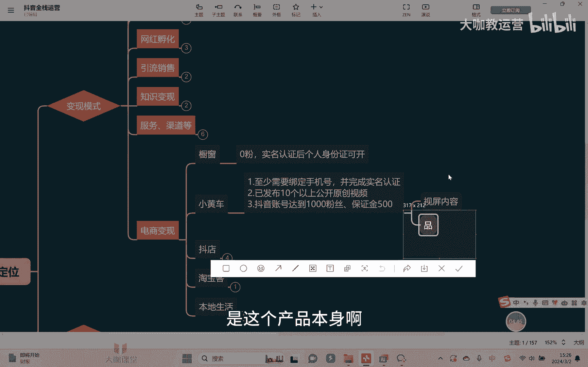

# 【2024B站最强小红书运营系统教程】吊打一切付费课!小红书蓝海市场 2024最值得做的新媒体平台 - P37：5、短视频运营：抖音小白电商变现全解析 - 大咖教运营 - BV1sn4y1X75u

欢迎来到咱们抖音全站运营的课堂，然后这节课我们接着去讲关于变现模式当中啊，其他的一些变现模式，那这个时候其实讲了一个比较重点的，就是我们讲最后一个比较重的板块，电商变现啊，电商变现这块的话呢会有很多啊。

然后的话呢大家应该呃也是接触的相对多一些。

最常见的比如说像挂橱窗啊，挂橱窗的话呢。

呃在我们的手机上体现的也是很明确的啊，我可以在这里还是一样啊，我可以把我的手机投个屏。

稍等一下啊，然后呢挂橱窗这个事情呢，首先第一他不需要花钱啊，领粉丝，然后呢你账号实名认证之后，他就可以去开通啊。

非常简单啊，然后的话呢我在这里可以给大家去演示一下，比如说还是一样打开我的手机投屏之后。

在这里啊，点开右上角的这三道杠，然后点击创作者中心，并且在这里我们会有什么呢，点击全部对吧，往下滑，在这里大家可以看到有一个什么呢，有一个电商带货，看到了吗，点击带电商带货当中呢。

我们在里面就可以直接点击橱窗，因为我这边是开通的橱窗啊，你正常点击橱窗，在这里直接可以去点击开通就可以了啊，非常简单好吧，只要你的账号呢这个呃已经是实名了，然后用个人身份证就可以去开通橱窗。

操作起来是非常简单的啊，但是我也跟大家实话实说，橱窗的话呢它只会体现在你哪里，因为它本身来讲，它只能够去体现在你的这个账号主页对吧，也就是我们讲嗯这个地方，所以的话呢一般情况下，你说他能卖的出去东西吗。

很难啊，说实话很难好吧，呃所以的话呢因为他没有任何的一个费用对吧，他也没有任何的一个太多了一个什么资质要求，所以的话呢这个东西大家不用去说，指望他挣很多钱，那再其次是我们讲小黄车啊。

在这个视频或者图文的下方，去挂一个这个小黄车，那小黄车同样的一个这个方式啊也是一样，在这里选择创作者中心，然后全部是吧点击咱们的这个电商带货啊，点击带电商带货之后的话呢，然后在这里会有比如说图文对吧。

会有视频啊，会有这样的一个东西也是一样，我们在里面去报名参加就可以了，好吧，呃然后的话呢呃呃这个我们的小黄车需要干嘛，需要你至少第一你绑定手机号完成实名认证，然后呢公开发布了十个以上的一个原创视频。

那其次还有个要求就是达到1000的一个粉丝啊，达到这个1000的粉丝，当然了，他呢一般情况下还需要有一个保证金，一般是500块钱啊，这一般是5万块钱，那当然的话呢呃这个保证金一，是不是说非交不可呢。

不一定，我跟大家可以这么去讲，平台的话呢，有的时候但这个东西是不定时的，有的时候他会去开放相应权限，就你不花钱，可以先免费让你去试用，然后后面再去交保证金，但这个是不定时的啊。

然后呢开放的时间段也相对来讲比较少啊，所以的话呢呃谁也不能明确告诉你，什么时候你可以去不花钱先做这个事情好吧，那这是一好，当然了，我们也会去想，哎有同学会讲我没有产品怎么办对吧。

我的橱窗我小黄车挂什么来，各位我还是一样把手机投屏啊，在这里的话，我们可以在这里去选择什么选品广场，如果是用电脑啊登的话呢，你直接可以进入这个精选联盟啊，精选联盟去进行选产品好吧，在这里面的话。

我们可以看到有和你的节日相关的话题，相关的对吧，所有的一些产品，然后呢在这里也会有各个不同类型，不同类目的一些产品啊，不同内部的一些产品，你可以自己根据自己账号的一个类型属性，去选择选一些产品去带。

然后呢卖出去之后，这里就会有相应的一个佣金对吧，那除此以外呃，我们的话呢呃在这里选上了之后，可以在这里直接点击加选品车啊，然后呢，这个产品就会进入到你的这个选品车里面，然后可以去挂啊。

在这里的话我们可以点击选品车，然后呢就可以看到里面有相应产品，相应商品之后呢，你就可以点击去带货，然后把它挂在你的这个视频，或者挂在你的图文下面啊，就非常简单好吧，操作起来没有什么太大难度啊。

大家可以自己去尝试，但是呢我们挂了这个小黄车，挂了橱窗之后啊，呃他不是说单纯你挂了就能卖的出去对吧，它核心还是个么，呃很大一部分原因取决于什么呢，就小黄车橱窗这个东西啊。

一方面我们讲是你的视频内容能不能吸引人，对不对，能不能让人家觉得你这个东西有兴趣，那其实还有很大一个方面取决于什么，取决于品本身，那么目前来讲，抖音整个的政策它的一个轻视，就是对于整个电商属性这一块。

它的一个倾向的一个方案方向是什么呢，是这个产品本身啊。

他希望他在抖音看来我的一个爆品，一个爆款的一个产品，它是能够极大的去拉动我的一个销量，以及拉动我的一个流量的，所以产品本身，现在在抖音整个看来是非常非常重要，非常核心的一点。

所以如果说你想通过什么小黄车，通过橱窗这个东西去挣钱，那很大的一个板块需要各位同学，你在选品这一块要把它把控好，那选品我们主要看哪几块，第一比如说像现在开春了，马上要春装，你是不是可以去做对吧。

适合春天，马上三八妇女节的一些节日相关的产品，可不可以去做，可以以及当下的一些热门话题可以去选择啊，点击里面去看一些适合的对吧，你们都可以去找相对产品，再其次还有什么，而一些比如说评价好，销量好的对吧。

体验分好的对吧，这样的一些产品，然后去选择去卖，当然他也要和你的这个账号的属性要对得上，对吧，你不要说我今天卖的是衣服，明天我就卖零食，后天我要卖3C数码，这个肯定是不合适的，对不对。

所以的话呢最好是相对来讲，哎你要把他这个呃稍微的稍微的要呃，我们讲要垂直一点好吧，当然除此以外，你点开产品之后啊，我们也可以干嘛呢，还可以去跟品牌方去沟通啊，联系商家去跟品牌方去沟通。

让他去给你做一些比如说定向的这种链接，或者是让让联系他，跟他沟通，让他去给你寄样都是可以的，好吧啊，这个都是可以的啊，呃当然了，这个也需要你有一些相应的数据，你说我一个东西都没卖出去。

然后呢让人家去给我寄样，然后给我去做一个单独的一个佣金比啊，这个也是不太合适的好吧，那再除此以外就是我们说要开通抖店了啊，抖店目前是这样啊，分为自有货源和无会员两种，那开通抖店，各位要不要花钱呢。

我可以告诉各位，目前来讲个人身份证，个人身份证就可以开好吧，然后的话呢这个东西要不要钱呢，也不用钱，但是啊不准确说来讲它是要钱的，但是不定时也是会开放名额啊，比如我自己之前开了一个抖店。

我当时的时候就是没有花一分钱，个人身份证就可以开对吧，但是开二了之后，如果说后期你说我的抖店运营挣钱了之后对吧，我想把钱提出来等等，OK那么你是需要去缴纳保证金的，那至于这个保证金。

各位你说我要交多少钱，通常情况下我们说4000块钱啊，然后但是具体的需要看品类，比如说我卖酒的对吧，卖什么保健品的，那不好意思，你的这个保证金就要高很多啊，可以可以甚至可以高达几万块钱，甚至十几万块钱。

或者卖什么药品的，这种都是有可能的啊，甚至于特殊的品类啊，那么对于资质的要求也会比较高对吧，那这时候我们讲啊，如果说你有自己这个自己本身有会员对吧，当然如果说你的话呢，呃你说我自己本身是开工厂的。

我要自己做品牌，做一个店对吧，那么这种情况下，你是需要通过我们说你的这个企公司的这个，营业执照啊，然后法人身份证等等这些东西，你去进行一个注册好吧，那通常情况下，如果我们个人只是单纯作为一个达人。

我们自己没有货源，我们是可以去做无货源的，那么抖店里面一方面就是我们刚讲的橱窗里面，东西不是可以挂进来对吧，加了选品粥里面，我们精选柠檬的所有产品，你是可以挂的，啊精选柠檬，所谓产品好。

那么电话还有一种就是我们说叫做无货源的，这因为关关于无货源这个词大家也听说过，我们有时候叫做什么呢，比如说抖上拼，抖上淘等等，就是简单来讲是什么，比如说像我们说有哪些网站它东西比较便宜呢，1688对吧。

哪里的会员多呢，哪里的东西多呢，淘宝对吧，还有什么呢，还有比如说像这个额拼多多啊，某多多对吧，他的东西相对便宜，然后呢我打一个信息差，我把他的话呢卖到我的这个抖店啊，挂到我的这个抖店上面来去卖。

可不可以，也是完全可以的好吧。

但是呢这个呃我们关于说这个无货源，他的这个操作来讲啊，来我在这里可以给大家去简单的做一个演示，比如说我打开我的这个抖电，对吧，OK那么你首先进入抖店之后在哪里去找呢，各位同学在这里会有服务市场对吧。

你们可以去选择一些相应的这种工具啊，比如说智能店长啊，那么用智能电长的方式啊，然后的话呢当然这个智能电长呢，它是可以去免费试用的，后面你要长期去用的话呢，还是要花钱啊。

那么这个东西呢就可以去帮助你们额选择，比如说像1688哈，选择可以进入这个1688里面啊，把他那个产品，然后呢挂到你的抖店上面来，当然了，这是把产品挂进来，挂进来之后还需要干嘛呢，还需要打单发货嘛。

对不对，那这个的话呢也可以用什么呢，比如说快递助手啊，或者类似的一些这样的一些服务啊，这样的一些这个工具都是可以的，那么他们都会有一些免费试用的一些效果好吧。

关于这些东西呢，大家可以根据自己的一个时间，然后自己去尝试去操作一下，感受一下他们的一个操作，因为操作起来并本身并不复杂是吧，但是的话呢我也可以告诉大家，这如果说纯做无货源啊。

然后呢想比如说1688淘宝啊，拼多多啊，这些网站上面把产品挂在抖店上面去卖，能不能卖得出去，各位一定能卖的出去啊，一定能卖的出去，但是呢他会有一个问题，就是他会衰退啊，而且呢会花时间花精力啊。

因为我们讲了，因为我们讲了这个东西呢，首先第一你的这个店面要装修吧对吧，你的选品本身是不是也很重要，因为我们讲了，我们说了这个抖音，现在的整个电商体系，他非常看重的是什么，非常看重的是你的品。

你的品要不停的去上新，要去更新，你不能永远挂那个十个20个的一个产品，挂在那永远不变，永远去卖，这个是不现实的，对不对，所以这些东西是我们要不停的去做的，还有什么装修的过程当中。

我们对于每一个产品要干嘛，要把它的评分做好对吧，关键词做好，这是我我们要去做的一些事情好吧，那么关于这个呃抖店整个的一个无货源，差不多给他去做到这里啊，更多的一些实际操作。

需要大家自己下去做一个实践好不好，好，那么这节课的话呢，我们就先讲到这里，下节课我们跟大家去讲讲，如果自己是作为有产品的对吧，想把自己产品挂在抖店上卖，我们要怎么做。

做好哪些事情好不好，OK那么这节课就讲到这里。