# 【2024B站最强小红书运营系统教程】吊打一切付费课!小红书蓝海市场 2024最值得做的新媒体平台 - P38：6、短视频运营：抖音小店的运营 - 大咖教运营 - BV1sn4y1X75u

Hello，大家好，欢迎回到我们的抖音全站运营课堂，呃，这节课的话我们继续来跟大家去讲，关于抖音的抖店的相关运营，上节课的话我们跟大家去讲了，关于你如果说没有会员，那么你该怎么样去找会员，然后如何呢。

用一些工具能够帮你的啊，货源去进行产品上下架，以及呢呃这个呃打单发货对吧，就是呢呃用户下单之后，你这边呢不需要有货源，直接呢从相当于你的一个货源的那个地址，直接他那边去发货，直接发到这个用户的手上好。

那这节课我们跟大家去讲讲，关于抖店里面的一些相关操作以及抖电，你该如何去运营对吧，包括说有的同学可能自己本身有会员，或者我本身没有会员，但是我找到会员之后，我该怎么去做抖店啊，那我在这里的话呢。

先打开抖店的一个页面啊。

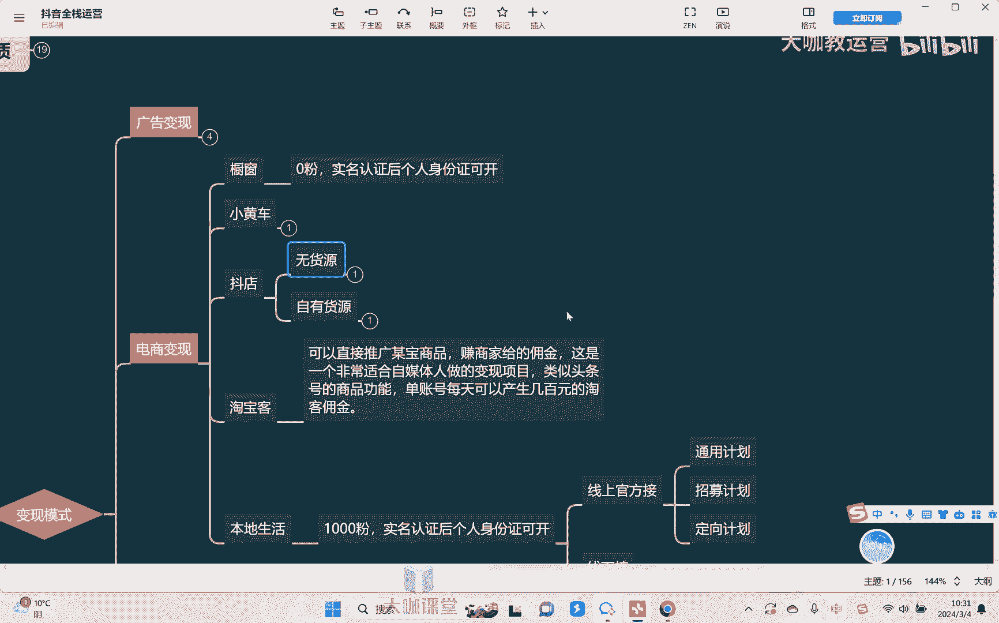

大家可以简单看一下好，那抖店打开之后呢，首先他这个基础操作啊，比如说产品的上下架管理在哪里呢，在这个地方啊，我们可以看到，那我这边是上架了一些产品啊，然后的话呢如果你要自己上架产品。

在这里去点击新建你的商品啊，然后的话呢呃把你的产品上上去就可以了，那上上去之后，在这里可以去编辑你产品相应的一些信息啊，比如说他的这个标题关键字对吧，可以在这里去打，然后的话呢以及品牌适用对象唉。

还有说像我们产品的一些相关的图片，在这里上上完之后呢，还有在这里，比如说像这个呃发货的一个时间对吧，然后呢发货了一些这个地址，以及说像相应的规格，然后价格对吧，那价格的话呢在这里大家可以看一下啊。

具体的这里这里标了一个价格，就相当于是你卖的一个价格对吧，SKU啊，是什么呢，SKU就是说你相应的这个呃，相当于你上上去的之后，他的一个大概的一个规格是怎样的啊，这是我们说呃整个产品啊上下架OK好。

那么产品上下架之后呢，除此以外啊，如果说呢你简单的平日去做一些这个，价格的变更或者库存N，直接在这个页面啊去操作就可以了啊。

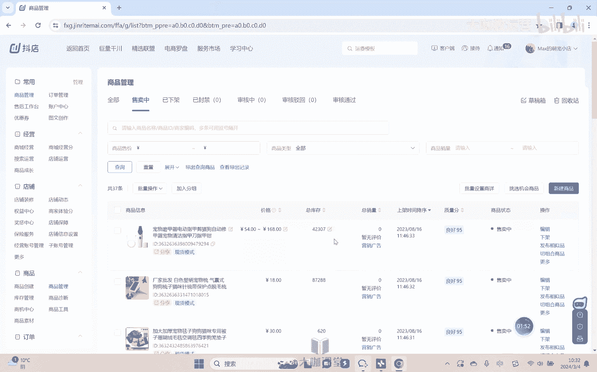

也不需要去进入到产品总页面去编辑，这样会相对方便一些。

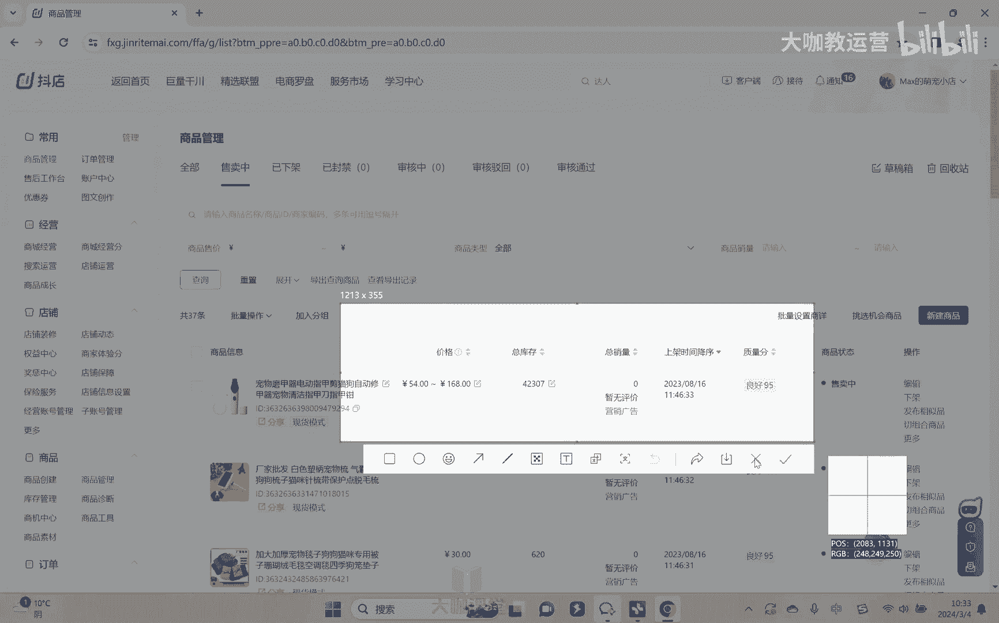

因为有时候我们在直播的过程当中啊，需要去快速的去改你的一个价格和库存，那么你就可以在这里去直接变好吧，然后哎，再其次就是我们讲到店面装修在哪里装呢。

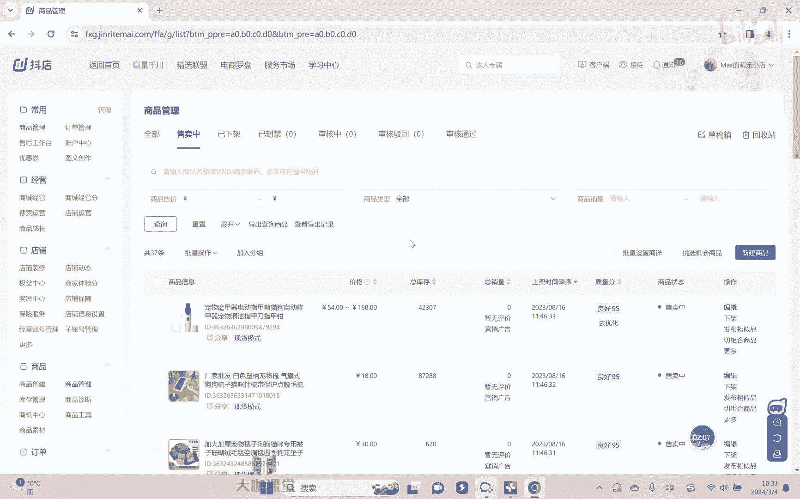

来大家可以看一下啊，比如说呢呃店面的整体的这个装修。

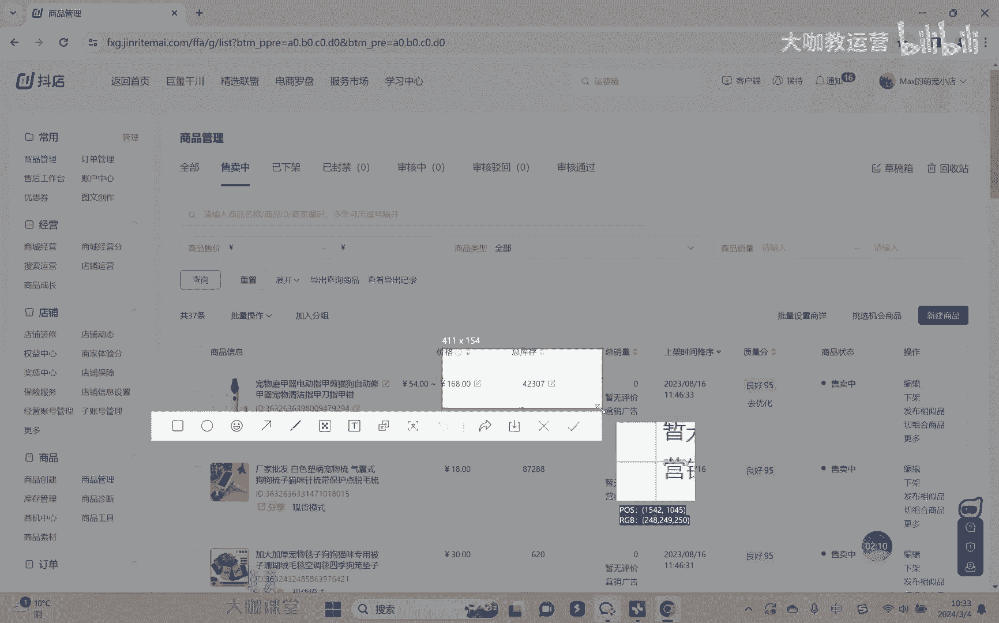

我们直接在这里啊，左边这里有个店铺对吧，然后呢在这里会有个店铺装修。

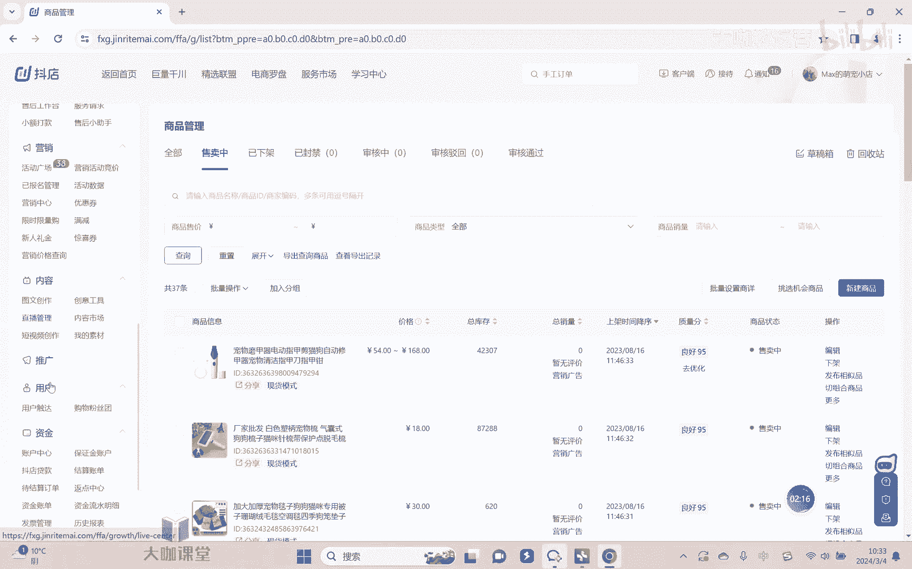

那关于店铺装修的话呢，右边这边会有一个预览页面啊，你直接按照它相应的这个提示去进行编辑。

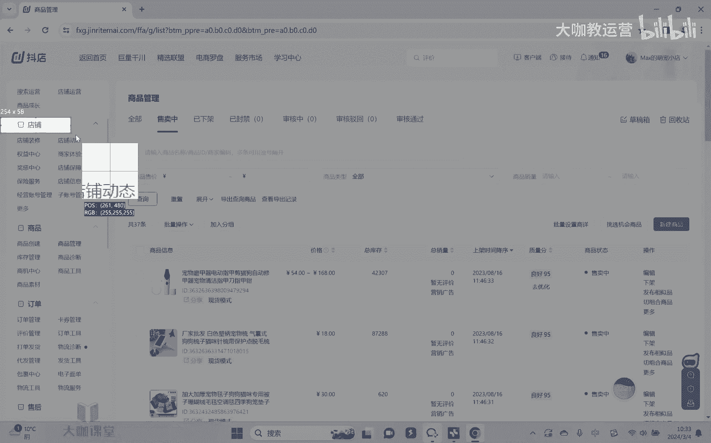

就可以了啊，比如说你头层的海报海报页面对吧，还有下面的一些营销的一些组件啊，一些基础的组件对吧，商品的这些挂件哎，直接照跟着他的这个呃只是指导啊，一步一步的去配置就可以了。

但关于咱们店铺的一个装修这块呢，其实比较简单，就大家正常的用，比如说像什么醒图啊，美图秀秀这种东西基本上是可以去搞定的，对吧好，那再其次就是大家可能会在乎的，比如说我的钱哎，就是人家买了之后。

我该怎么样去这个提款呢，那么在这里资金这里我们会有一个账户中心啊，账户中心这里呢就可以去提款，我们相应的呃这个金额，那正常的话呢，呃我们如果说你是已经交了保证金的，那么正常就提就可以了对吧。

但是呢有的时候我们说像比如说老师，我自己的这个店铺就是在之前的呃，不需要去交保证金，可以直接个人身份证去开的这个店对吧，那你在提款的时候，如果说金额大了，那可能还是会需要你先去把保证金交了。

然后他才能够再去呃提款你的一个金额是吧，当然了，如果说你要注销这个你的店铺，然后呢想把保证金再提起来，一般这个周期时间是在30天左右，好可以让你全部提出来，好吧啊，再其次呢。

我们可以去做一些相应的这种营销活动啊，比如说在这里有这个活动广场对吧，那这里面会有很多的一些这种活动，当然了，你需要提前去缴纳相应的一个保证金，才能够使用啊，这里面的话会有平台啊。

不定时的去推出各样一的一些活动，比如说双11到了会有双11的活动，马上像现在马马上过两天三八妇女节，那会有三八妇女节的活动对吧，那我们常用的一些营销工具一般什么呢，比如说在这里有限时限量购啊。

限时限量购呢就操作很简单，直接在这里啊去进行一个编辑啊，然后的话呢呃把你的一个价格相当于是直接改，比如说在这里去点击新建，然后呢去选择你随便的一个呃商品啊，然后呢在这里可以添加一个商品对吧。

找到一个想要添加的，添加完了之后，在这里直接去选择活动的一个时间啊，这里是开始时间和结束时间，选择完成之后啊，直接可以给他去干什么，一口价，为什么说呢，简单呢就是因为呃你不需要有过多的操作，不需要去算。

只需要去考虑我原价是多少，然后现在的话呢我要改成一个什么价格对吧，比如我这个产品原价99，我现在直接给他改成什么19。9呃，然后的话呢库存，也就是这次活动我大概拿多少货，这个库存拿100单。

200单对吧，我在这里直接标明，然后的话呢每人限量啊，够多少单，然后在这里确定，然后直接提交就可以了啊，操作起来非常简单，再其次的话呢还有一些其他的，比如说像什么优惠券对吧啊，优惠券的话呢。

我们也会去分一些不同的类型啊，比如说像这种什么店铺新人啊，然后呢还有这个粉丝达人的这种店铺券啊，还有都有达人专属的，然后以及是个什么惊喜券等等啊，都可以去操作，但是呢这个呃我们直接可以看相应的这个指示。

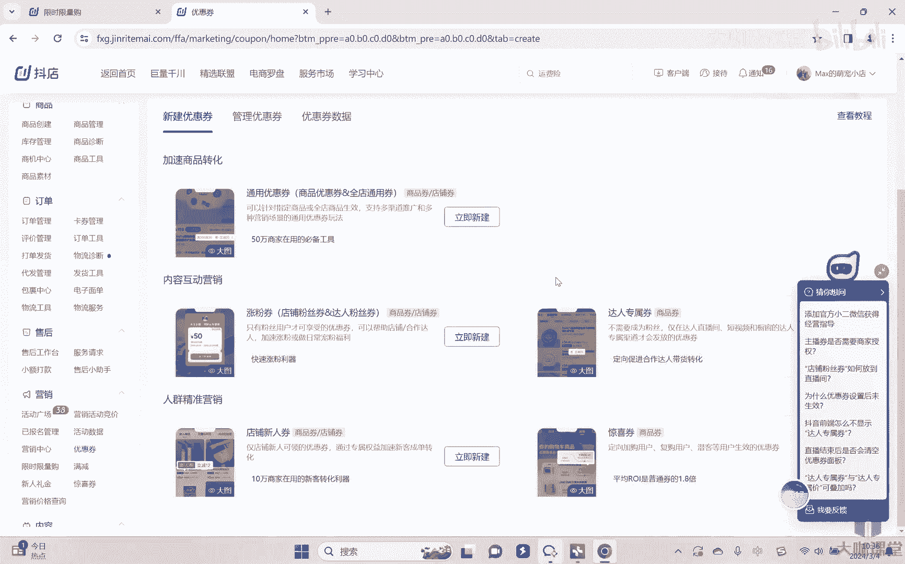

了解到不同的优惠券呢，适用于怎样的不同的一个场景就可以了，还有啊像一些这个满减券。

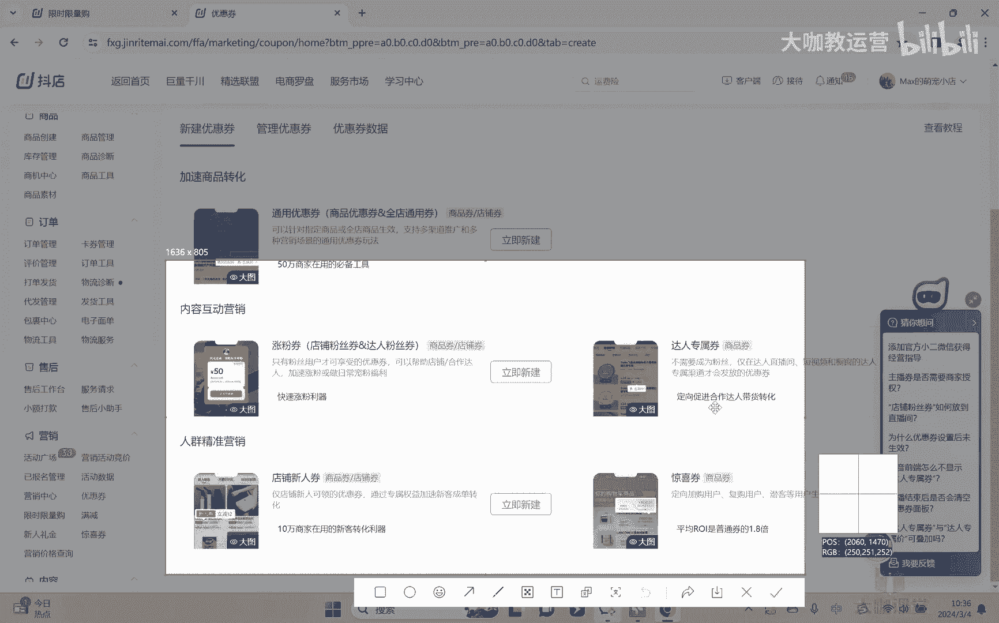

满减券呢，就是需要你去考虑到整个店铺的一些产品。

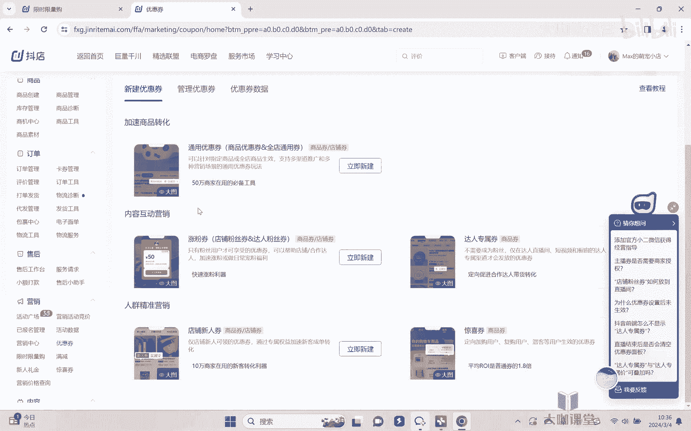

然后呢去计算一下诶你的自己的这个利润的啊，不然的话呢有时候会算不好的话呢。

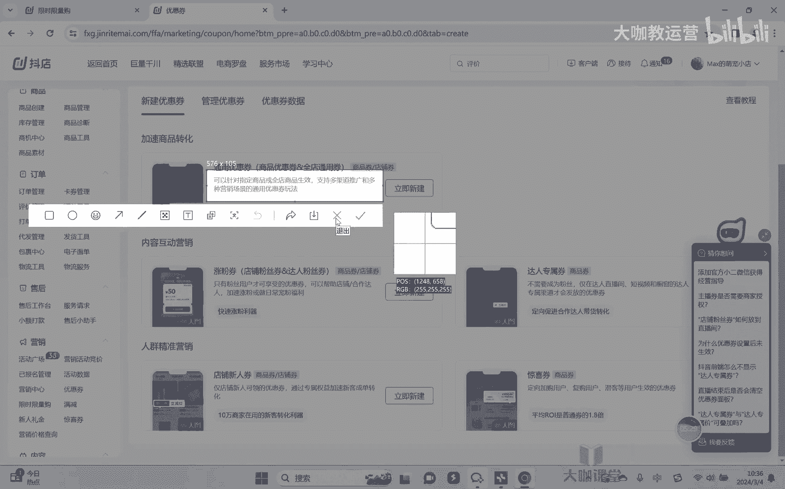

容易就是导致自己亏本啊，这个时候呢大家要去注意一下好不好啊，OK再其次啊，关于订单的管理，直接在这里去点击订单管理就可以了啊，然后的话呢会去看到第一相应的这个订单，包括说呢有的客户他下了单。

但是没有付钱对吧，然后呢等待你去发货的啊，然后呢已经已经发货的这些，所有的都可以在这里去进行一个沟通对吧，那如果说我们的客服沟通在哪里呢，在这里啊会有一个飞哥知道吗，会有个飞哥直接去进行一个接待。

跟你相应的客户去进行一个绘画就可以了好吧，但是呢在这里的话呢，各位要去注意一点啊，飞哥的话呢，你这块跟人家去呃，沟通的所有事情一定要及时回复，否则会去扣分，扣什么分呢。

来这里就跟大家去讲到我们的店铺刚开始运营，各位新手同学，你首先要做一个什么事情啊，在这里嗯，来各位同学首先去在这里搜索什么呢，搜索新手十字星嗯，搜索这个新手十字星啊，然后进去，当然了。

我这个店铺是因为我已经过了啊，我已经学习完了，所以的话我现在出不来，但是大家的话呢呃直接在这里搜索十字星啊，就可以了，然后进去啊你就会看到什么呢，你就会看到诶，你的相应的这个上这个你的一个体验分。

也就是我们说商家体验分这个东西啊，所以这个也要跟大家去讲到。

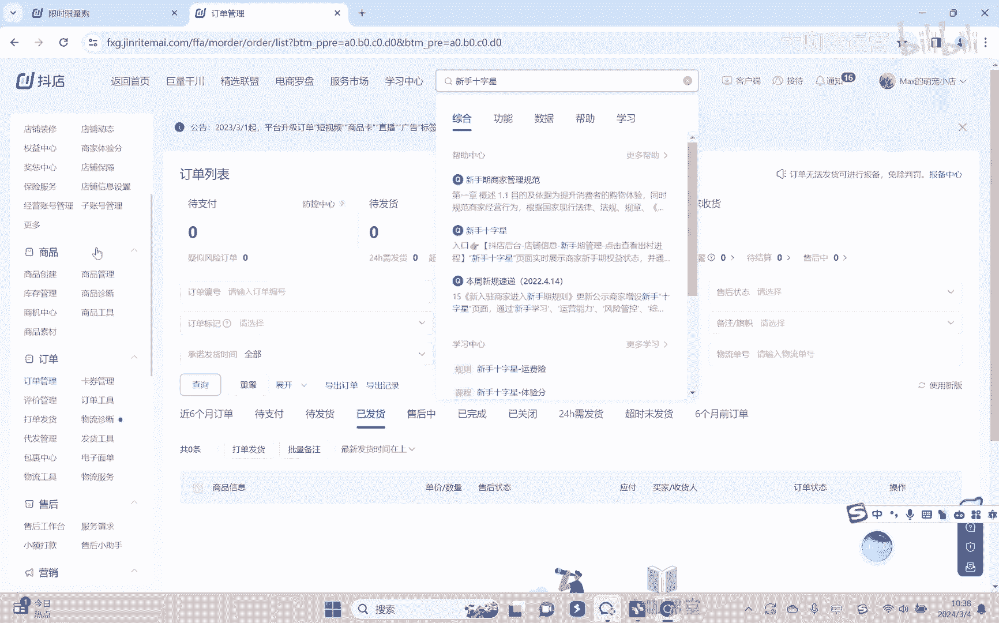

其实各位同学，我们做抖店，主要你说我的抖店要做得好，或者说呢这个呃这个什么口碑好也好啊，我的这个呃曝光量能更高啊对吧，我的那个推荐的页面能够更靠前，靠什么，各位同学靠的是体验分。

这是我们去做店铺最为关键的一个东西嗯，啊你的体验分直接决定了平台。

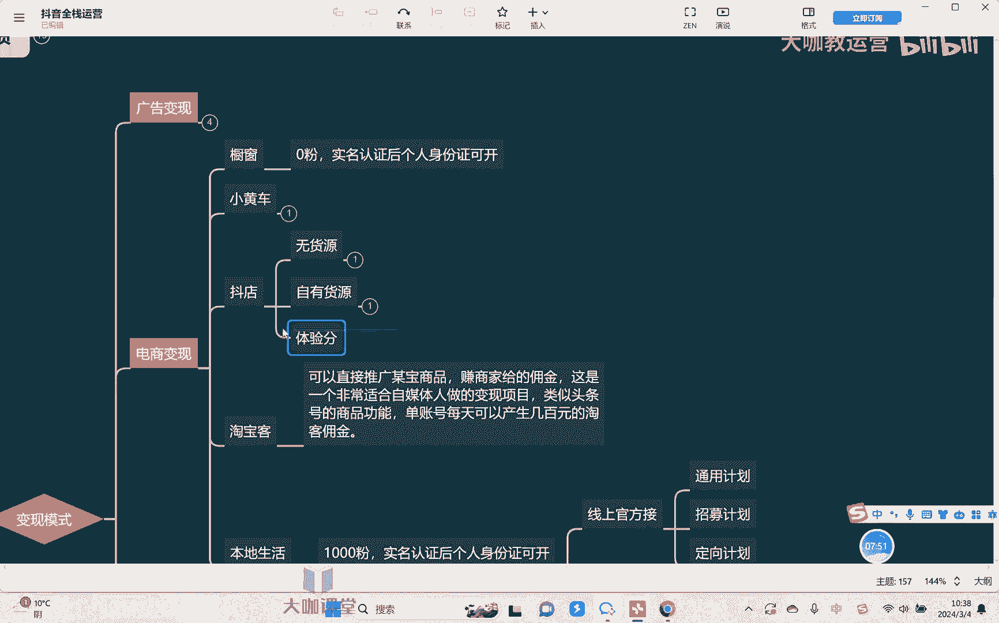

也就是系统啊，它商城对于你的整个店铺。

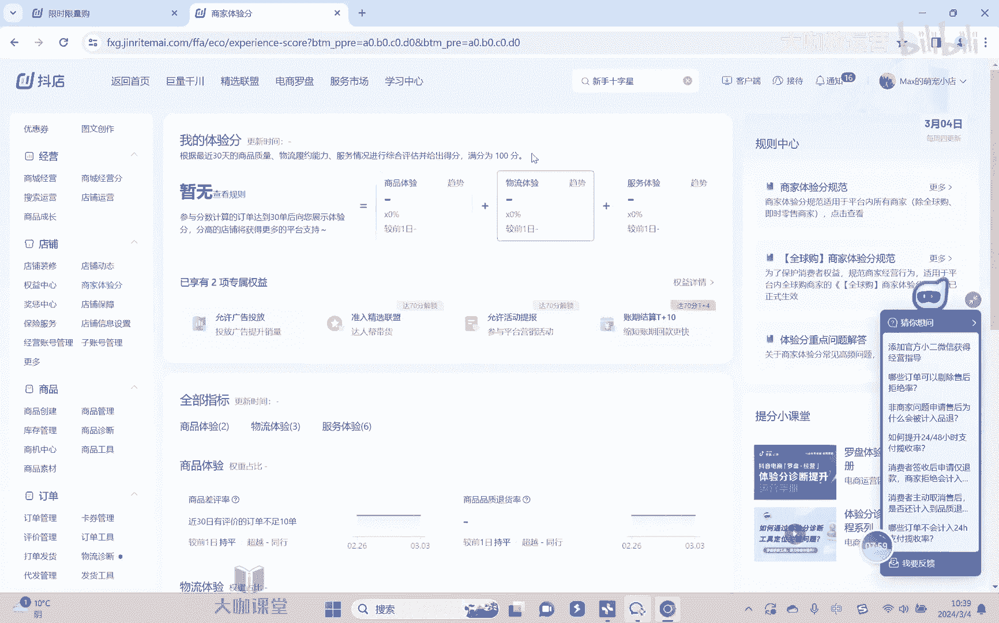

它的一个推荐页面也好对吧，包括你商品的一些推荐页面，都是非常息息相关的，这个东西非常非常重要啊，好吧，那我们前期的话呢是需要先去过这个体验分，要去过新手期，知道吗，那么体验分怎么样出呢。

目前来讲是这样的，体验分目前来讲，首先就是你要去出出单，出多少单呢，出30单啊，你才会去出田分，但是你刚开始出的话呢，满分我们说是五分对吧，五分，但是刚开始出，你一般情况下你不出意外，你是多少分呢。

是04：06分啊，那么04：06分相当于是一个及格分，高于第4。6分之后。

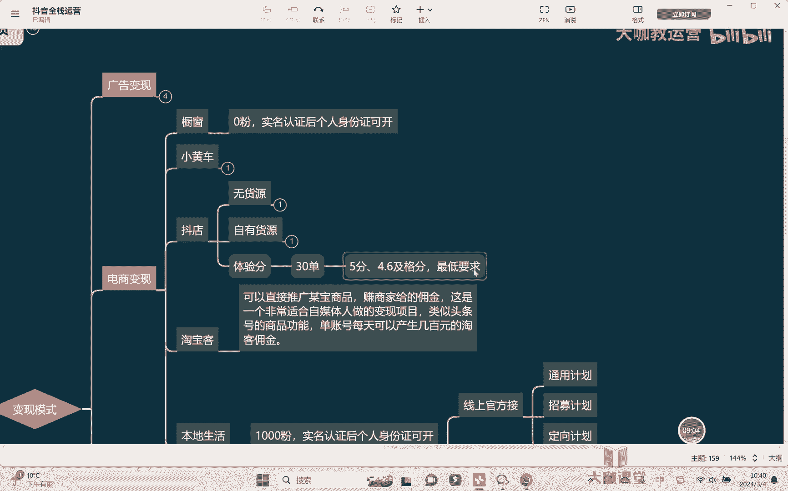

你才算是说你这个店铺是过得去的啊，如果一旦你的分数低于了4。6分，不好意思，那么你的分你的这个店铺相当于是不及格了，不及格就有可能会干嘛限流啊，举个例子，我们的店铺，如果说我们开了直播。

我们要去给投千川对吧，那么不好意思，千穿的最低要求就是，你要有这个04：06分的一个店铺分，如果没有这个店铺分04：06分的这个店铺分。

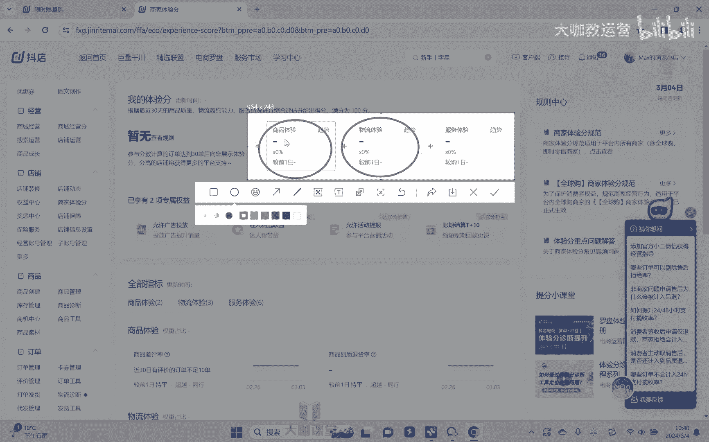

那么呃或者说你没有分，没有分的话。

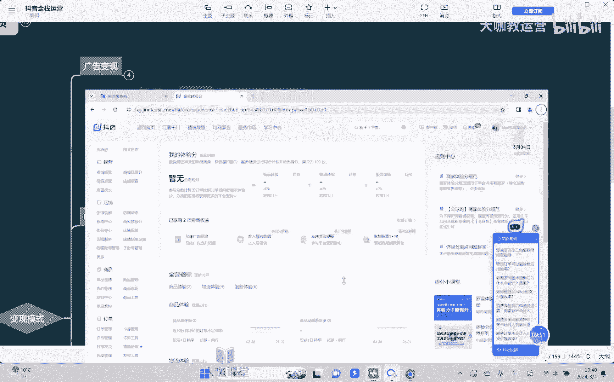

不好意思，你就投不了对吧啊，你的这个商品就会限流对吧，低于4。6分，同样的你也会引起一个限流好吧，所以这个大家去注意一点，那体验分是怎么样去做，来各位呃，其实包含什么呢，包含就是我们说商品的体验啊。

物流体验以及服务体验啊，那么所谓商品体验，物流体验，那物流体验主要考验的是什么呢，首先第一我们讲物流体验考验的什么，考验的是你发货啊，那这个发货呢不是说呃到的时间多长，而是指在于用户下单之后。

你的发货的速度知道吗啊，比如说我设定了48小时以内发货，那么你就必须要保证在48小时以内发货，如果超过48小时以内啊，之后呢再去发货，那不好意思，你的这个物流分就会扣分啊，就会扣分。

那么比如说还有商品体验分啊，以及服务体验分，那这个就涉及到什么呢，用户对于你的产品他的一个评价了啊，呃比如说有差评，那这个不用想，那一定是扣大分的啊，这个是必然的，还有什么呢，还有就是举个例子。

有的时候用户去退货的时候，因为我们知道平台的，基本上我们大部分产品会有什么七天无理由，对吧，那这个东西是很正常，他不会去引起扣分，但如果说不是，因为就比如说用户收到货之后，或者甚至于没收货的时候。

我就已经退货了，原因是因为什么呢，我觉得不喜欢了，我觉得不好了，我觉得呃这个图片，或者说我这个呃收到的货货不对版，那不好意思，那就会扣分啊，那就会扣分，但是呢具体扣分扣多少，和这个用户他的一个退游。

退货的一个理由会有关系啊，所以呢在这一块我们要把控好我们的一个分数，就需要干嘛，就输入，需要去注意到，我们日常跟用户之间的一个沟通啊，飞哥上去沟通好吧好，那么关于这个是跟大家去讲一点。

那另外在飞哥沟通的时候，大家要去注意一个点，就是我们在跟用户沟通的时候，听清楚飞哥，因为他是什么，他是用户官方的对吧，用户是这个平台官方的这样的一个系统，所以你只能通过飞哥，如果没有用飞鸽。

比如说举个例子，你看到的用户的相关信息跟他直接打电话了，不好意思，这个是不可以的对吧，因为如果说出现类似的这种，脱离了飞鸽系统平台，然后去跟用户单独对接对吧，用户一旦跟你去举报，那么不好意思。

你这个就会受到严重处罚，嗯所以这个大东西大家一定要去避免，因为有的时候有同学说哎，我这个这个这个呃用户给我搞了一个差评对吧，我很担心，我希望说他把这个差评他自己去退掉，那不好意思。

然后呢我就选择说飞哥给他发消息，飞哥不发消息不回怎么办呢，我赶紧给他打个电话，给他发个短信对吧，打电话发短信，不好意思。

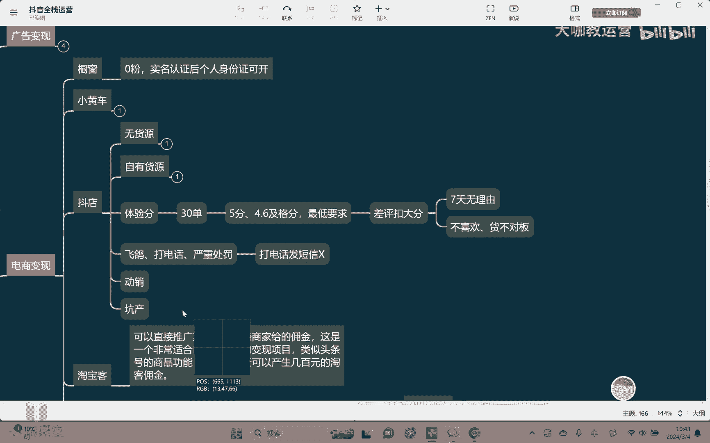

这个是明确禁止，绝对不行的，绝对不行的啊，如果出现了。

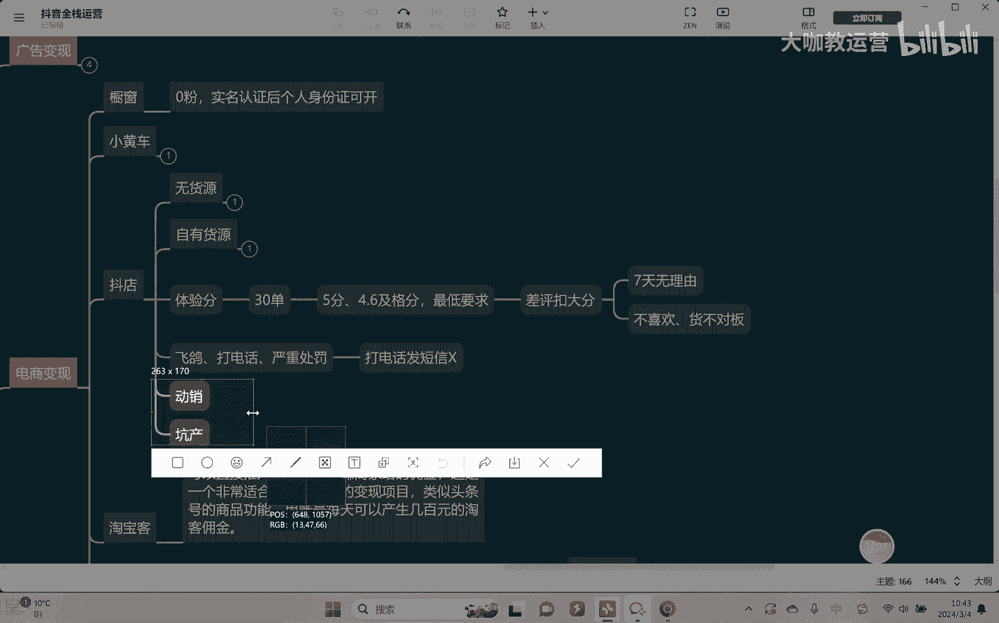

那么你的这个会受到严重的一个呃这个处罚，所以大家一定要去记住一点好吧，再其次额就是我们说关于抖店，想要真正去运营好，那各位同学听清楚考核的两个东西是什么呢，第一动销，第二叫坑场。

嗯啊其实呢不光我们是抖店，是这样的，包括我们说做淘宝也好，你做什么京东也好等等，锂蛋白是做电商体系，其实很大的一个核心都是这里嗯啊，很大的一个核心都在这里啊，包括我可以告诉我，未来所有的平台都会往什么。

都会往淘系的整体的运营方向去走，这是必然的啊，那所谓动销是什么，动销是这样，平台给的规定是说在30天以内你要完成，只要产品上架30天以内，你要完成什么，完成两单嗯，两单的一个这个销售嗯。

啊那么OK你就算是动销合格啊，所以简单来讲，这个意思也就是我产品上架之后能卖的出去，这个就是东销对吧，那我们的店铺肯定不会只有一个产品，对不对，所以呢我们要在乎的是什么，是整店的东销嗯。

也就是来讲我们的店铺，比如说上架了100个，上架了50个产品，那么我们想把东西做好，我们要做到什么，我们要把这50个产品，都能卖得出去嗯这个是非常关键的一个东西，嗯对吧啊，那么如果说我只完成了十个。

那么不好意思，那你的OK你的动效率就是多少，动销率就是百分之就10/50是吧，1/5 20%，你的动效率就不够，那么你店铺在整个的推荐上就会下滑啊，OK好动销大概能理解，对不对，第二就是什么嗯。

就是我们讲坑柴，也就是一个坑位，或者说一个商品位，它的一个什么它的一个销量产出啊，不或者说准确说是什么销售，销售金额销量产出嗯，嗯那核心在于哪呢，在于我们讲嗯UV价值嗯。

也就是比如我们有时候说呃有一个产品是爆品，什么叫爆品对吧，体现出来的结果就是，他的这个推荐的流量比较大啊，或者在我们刷这个呃，相应的比如说抖音商城的时候，会大量给我们去推这个产品，那推他的原因就在哪。

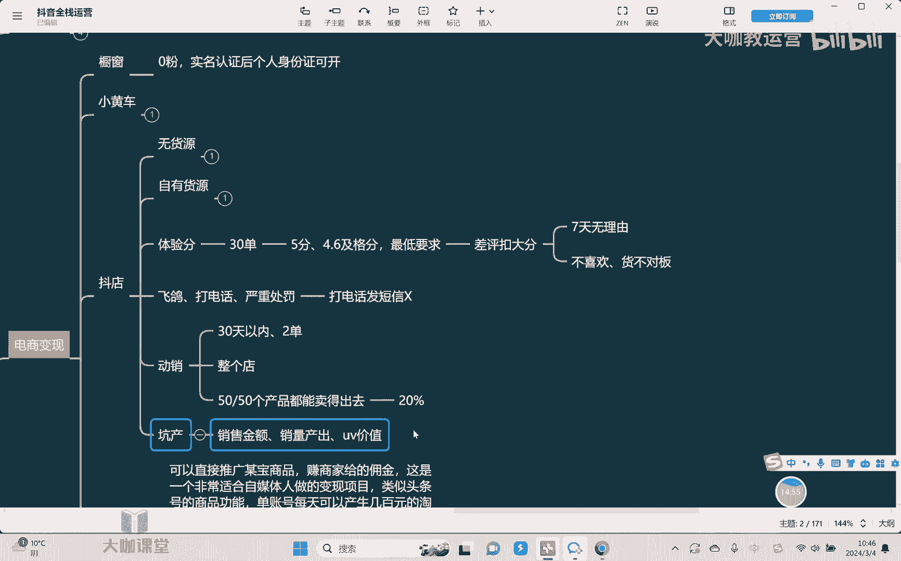

就在哪里，就在于它整体的这个单个产品，单个SQU它的一个销售金额。

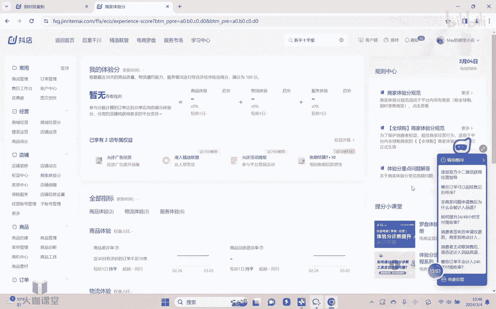

销量产出和UV价值排名比较高啊，所以呢他就会给你往前去推，知道吗，那么我们想把坑产做好，说白了就是把这一块去提升，那具体怎么去提升方法来各位，首先第一，我们每个产品我们在这里大家可以看啊。

产品我们全部上架之后，最基础的来在这里是不是会有一个质量分对吧，那么我们首先第一，当然各位同学，你一定要记住一点，你的产品想要卖好。

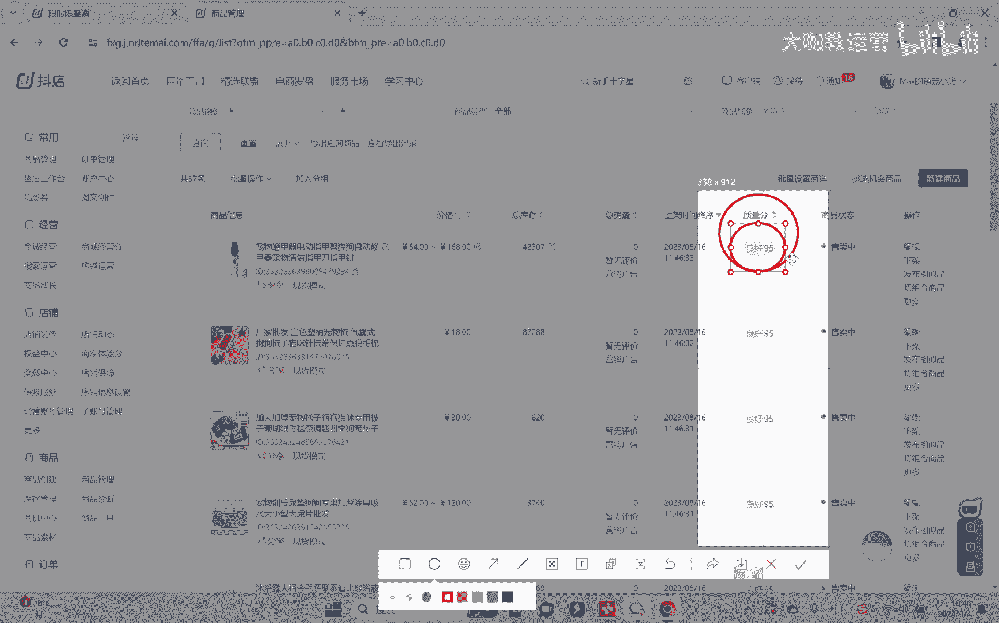

最基础的要求，你把这个质量分他这里要打满啊，通常我们讲呃这个60分及及格对吧，但是那是完全不行的，你最起码要保证什么呢，我们说啊对于一个想要做好的店铺，你要保证每一个这个产品。

你要把它分都能够做到100分啊。

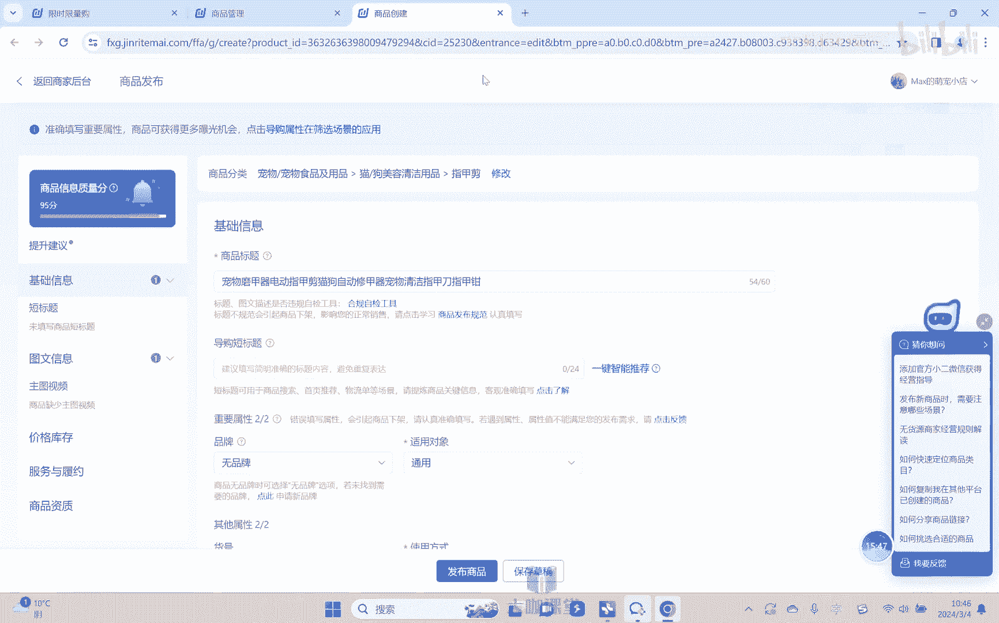

都能够做到100分，然后呢他才能有一个基础的比较好的流量，然后再去通过其他的一些方式啊，比如说在这里去编辑啊，我们说所谓的这种关键词对吧，往大家的这个类型上面去靠啊，往大家一些兴趣爱好上面去靠对吧。

关键词例是这个，然后呢提高它这个销量，销量起来了，慢慢的这个整体的经销售的这个金额起来了，UV价值起来了，Ok，那么它的这个产品就会越发给你往前去推对吧，所以我们整个做躲电的核心逻辑和核心逻辑。

就是这个啊，有时候我们有时候听到这个一些做电商的人说，哎要补单补单补的是什么，单补的其实就是他的一个坑产啊，这是我今天这个产品嗯，第一天我卖了一单对吧，第二天我要卖多少单，各位我要我告诉大家。

我要卖五单，为什么就是把我的动销和坑产给做起来，第三天我卖多少，我要买20单对吧，好，第四天我要卖多少，我要卖至少50单，甚至是100单嗯，那如果没有达到怎么办呢，各位就是什么。

需要通过一些其他的方式去补单啊，把这个单量补够，才能够说让你的这个整体的一个坑产起来啊，能够有这个量，OK那么平台就会持续的给你去增加，你整体的一个曝光量，这样子才能够说把整个的一个呃抖店去做好啊。

所以呢这也是导致说做抖店本身难度来讲，高不高呢不高，操作呢也不麻烦对吧，无非就是可能稍微麻烦点的，做做做做图拍摄拍摄长商品对吧，但是呢想要把它持续长期的做起来，很难嗯，为什么，就是因为在于这个坑踩上嗯。

啊因为呢这个东西很难去保持对吧，爆品我们都知道什么叫爆品，就爆一段时间，这些爆品它没有任何一个产品可以一直爆，一直爆的，这个是做不到的对吧，很难，除非说你是品牌嗯啊有品牌了，这个不一样啊。

所以呢大部分情况下，我们其实说实话一个导电也就多长时间，3~6个月的一个周期，你的这个整体的一个流量就会开始。

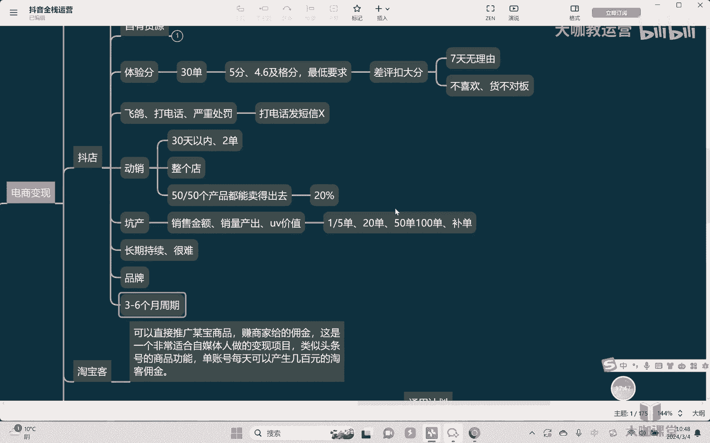

慢慢的一个衰减啊，当然如果说你能长期像我刚讲的核心。

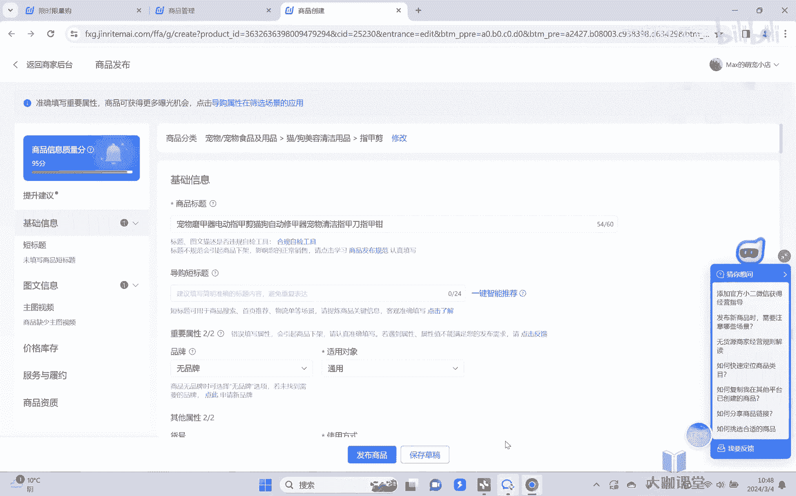

去把这个体验分做好对吧，核心去把我们的一个体验分做好嗯，把它一直长期做好啊，然后的话呢，那么你的店铺就能够保持一个长期经营好吧，那么其实关于抖电呢，整体的一些东西也就在这里了，好吧，各位啊。

那么这节课我们就先到此结束。

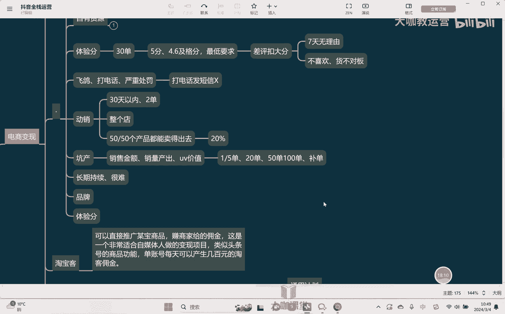