# 【2024B站最强小红书运营系统教程】吊打一切付费课!小红书蓝海市场 2024最值得做的新媒体平台 - P39：7、短视频运营：抖音本地生活 - 大咖教运营 - BV1sn4y1X75u

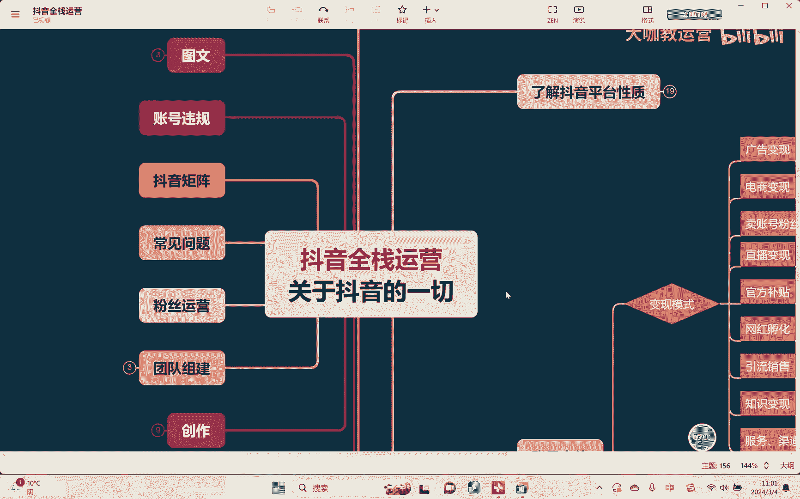

Hello，大家好啊，欢迎回到我们的抖音全站运营课堂，然后这节课呢我们最后讲一下，关于这个变现模式的，所有的一些内容给大家去讲完啊，那在之前的话呢。

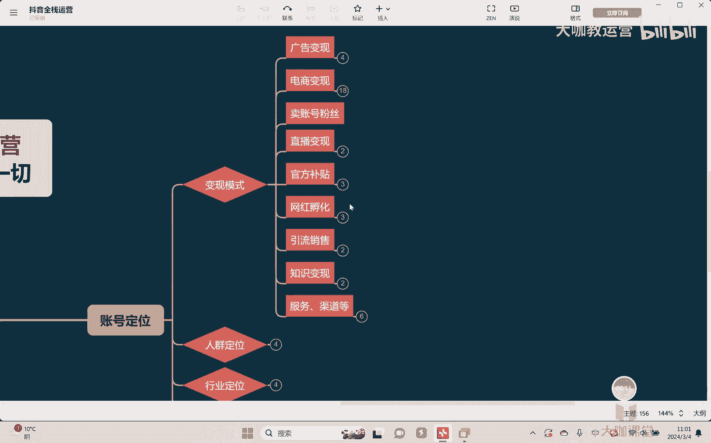

大部分的东西都给大家去讲过了啊，那除此以外的话呢，像这个电商变现的话呢，还有比如说像这个淘宝客啊，淘宝客的话呢其实很简单，总而言之呢，就是帮人家在抖音上去卖淘宝的一个，相关产品啊。

也就说白了我们呢通过抖音去帮人家推广这个，淘宝上面的一些商品，然后呢淘宝的这些商家给你去佣金啊，那这个方式呢，呃就是我们有时候会见到了一些这种啊，达人的一些号，然后的话呢会去推广一些商品。

然后但是呢他不是在下面去挂车对吧，而是在这个视频的内容里面会跟你去讲啊，大概是个什么什么样的一个淘宝店铺，然后呢价格怎么样怎么样啊，当然他也可能会呢在评论区啊，置顶一个评论。

然后告诉大家哎这是在哪个店铺，哪个店铺啊，大家可以去买啊，然后这样子呢去获得一个相应的佣金好，那关于淘宝客的话呢，我在这里不多讲啊，因为来讲的话呢相对呃冷门一些，还是需要你有一个旗号的一个能力啊。

那除此以外啊，再就是我们讲本地生活这块，严格来讲本地生活呢不能算是这个电商对吧，但是呢呃我是为了方便大家呢，这个听课的一个理解逻辑，我一次性跟大家去全部讲完啊，好那么我们说关于这个本地生活呀。

其实讲到讲白了就是本地的一些这个啊，什么餐饮的酒旅的等等一些这种团购嘛对吧，那么像也就是我们讲的，如果是个人去做，那相当于是做一个个人的达人探店对吧，那商家的话，你也可以利用这个抖音这个平台去推广。

你相应的这个啊粉丝啊，或者说怎么样怎么样，对不对啊，然后的话呢首先第一啊本地生活你要是开通呢，呃最低有个基础要求是1000粉丝，但是啊但是这个1000粉丝要告诉大家，也是不定时去开放的啊。

也是不定时的会去给你干嘛，零粉开放啊，只要说你呢认证了十个人身份证之后，就可以开了，那这个不定时，所以说白了，没有任何人能够给你一个明确的时间啊，因为呢他可能就是系统平台后台。

他会去根据啊自己当地的这个呃做这块的，就是说白了达人的一个数量，开通人的收入的一个数量，他自己去评估对吧，有时候可能开放一下，让大家去提前开啊，如果没有开的话呢，那么你就没有办法去开通。

你也就没有办法在下面去挂，我们的这个团购链接嘛，对吧好，那本地生活的开通的话呢也很简单的，我在这里可以把我的手机还是一样。

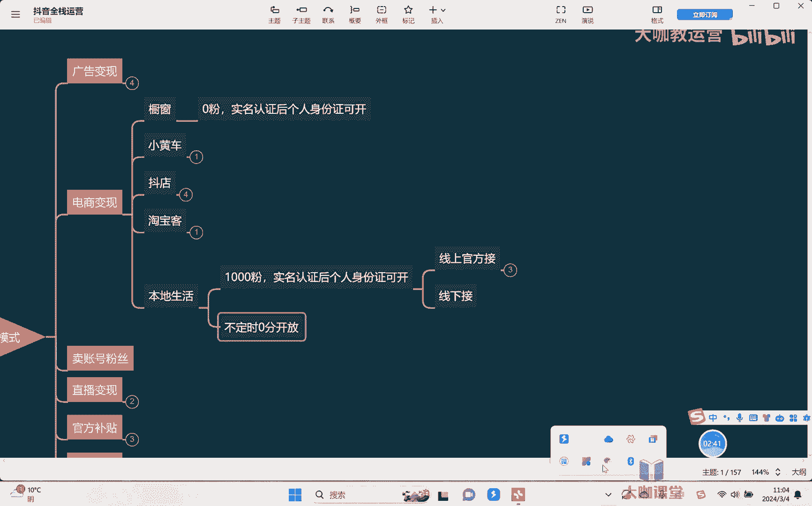

投屏给大家去看一下啊，稍等啊，我把我的这个手机投屏来给大家去看一下啊，呃。

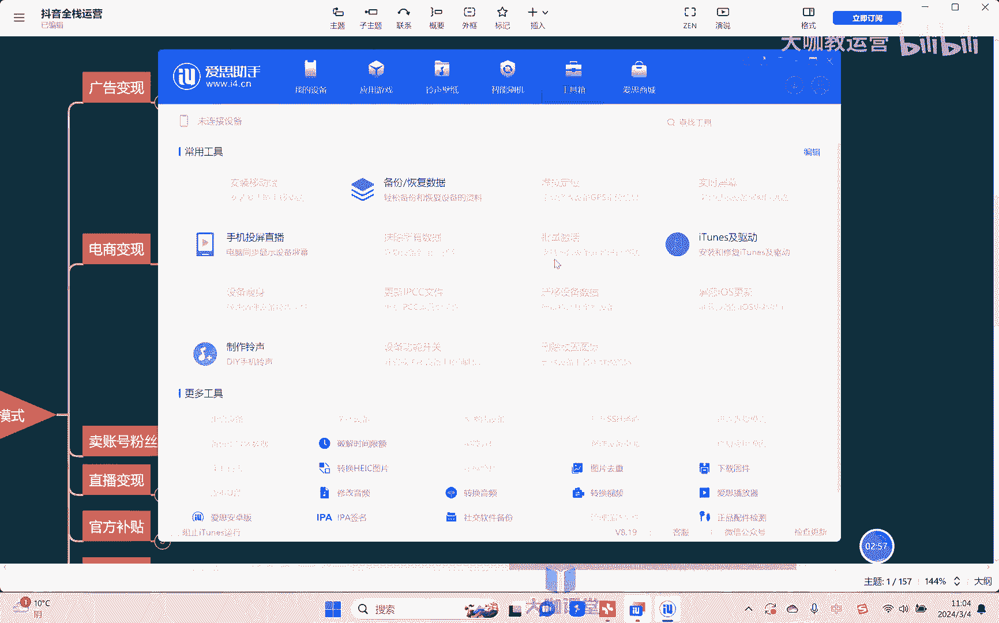

呃但是然后另外再一个来讲的话呢，就是如果我们大家是商家啊。

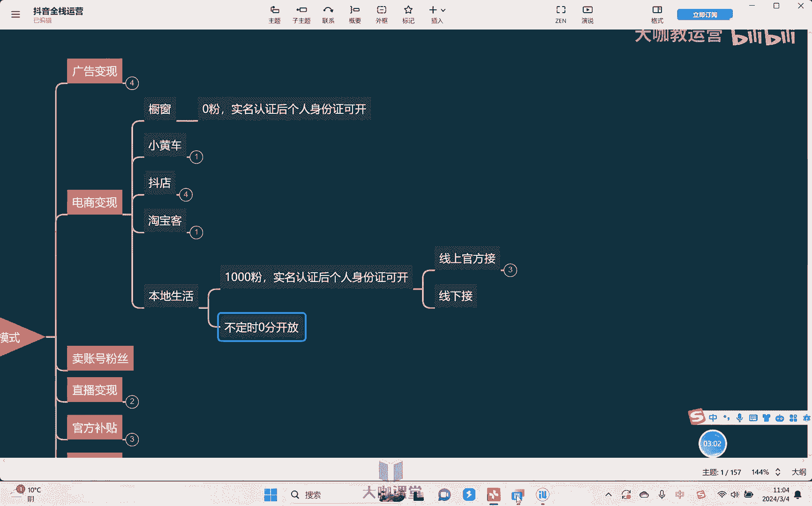

是商家的话，那么你就需要这个额外去开通，你的这个IPO啊，首先我们打开抖音个人来讲的话呢。

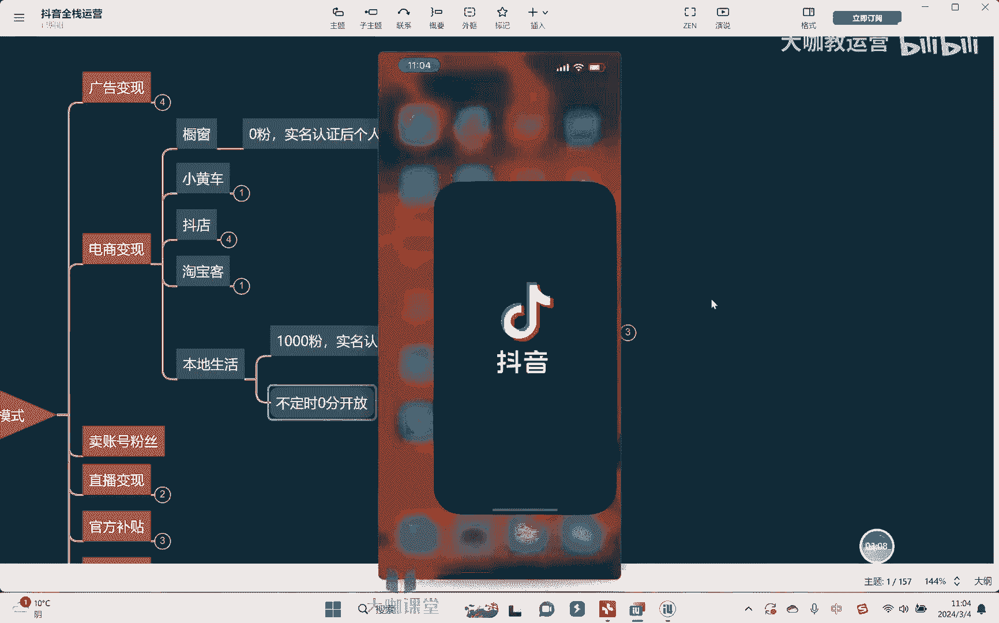

呃还是一样，在这个抖音的这个右下角去点开，点开之后呢，右上角我们点这三道杠，抖音的这个创作者中心对吧，点击这个全部，然后往下滑，在这里有一个团购带货，看到了吧，啊直接呢在这里去进行一个申请就可以了对吧。

明确的这个申请条件很简单，就是大于1000本，然后呢实名认证啊，没有别的要求，开通之后呢，在这里就可以去申请一个团购带货，对吧啊，然后呢申请完了团购到货之后呢，你进入这个团购的相关页面，你就能够去啊。

找到相应的一些这个链接可以去带好吧，那如果说是商家的话呢，你怎么去啊，认证你的这个IPO，然后去开通你的呃这个本地生活，让别人的达人或者说自己也能去带呢来呃，这个首先大家去做第一个事情。

比如说我的店开了对吧，你首先去打开，比如说高德地图干嘛呢。

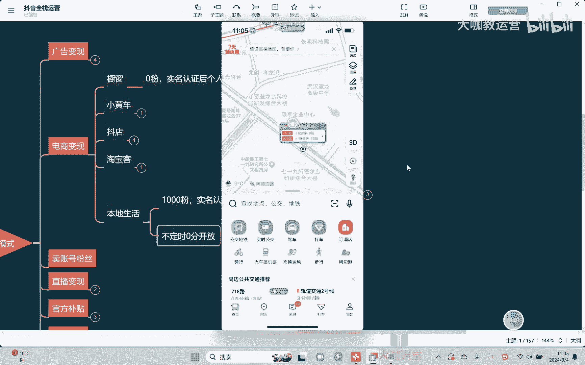

右上角在这里啊，会有一个反馈，看到没有对吧。

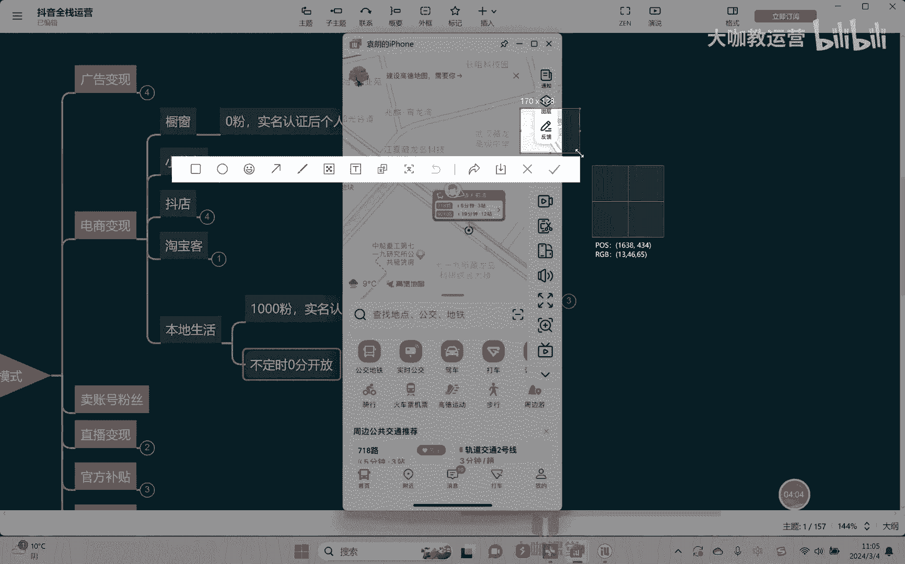

点击这个反馈嗯啊点击这个反馈之后，在这里有一个新增商户，首先你要去点击新增商户，把你店面的这些相关信息，先在高德地图上给它添加进去，添加进去之后呢，你们可以理解为，相当于地图上有你这个店了对吧，然后呢。

抖音的平台他才能够去查，查的到你的这个店铺的相关信息，OK你这个店确实是正儿八经，实实在在在这个地方的，对不对，然后呢我再去给你呃，你才能够去开通啊，相应的一些这个什么权限。

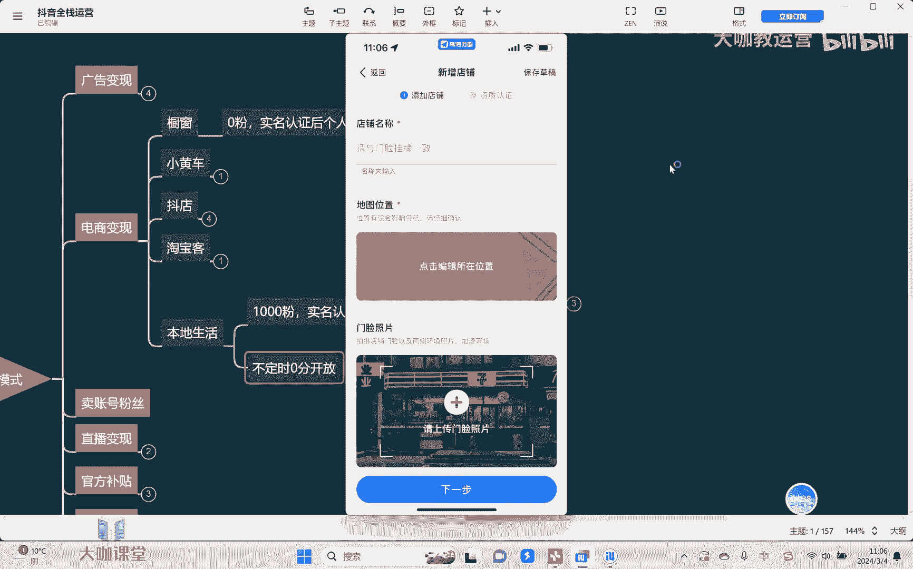

然后再去上架相的一个商品，你才能去做好吧，那这些东西全部去做，弄完了之后呢。

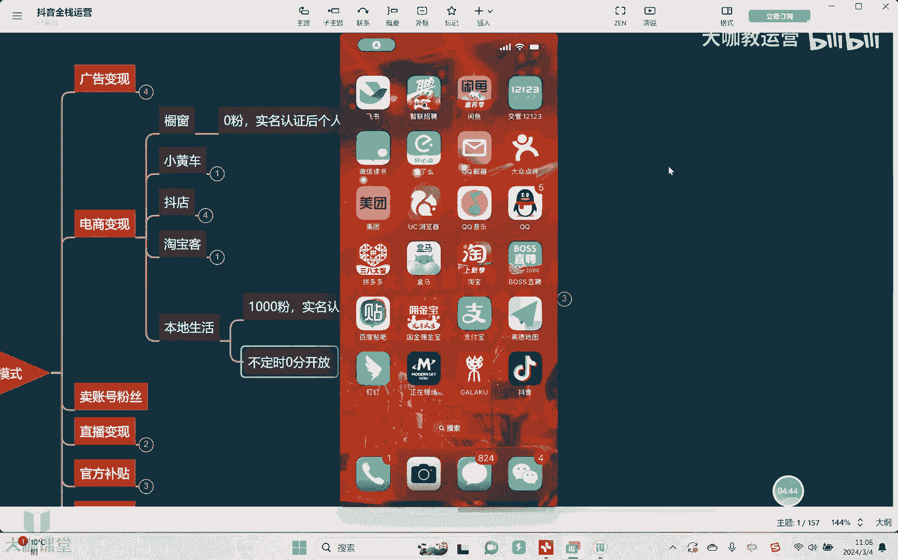

你们需要去下载一个这个抖音来客啊，看到没有，就这个啊下载一个抖音来客。

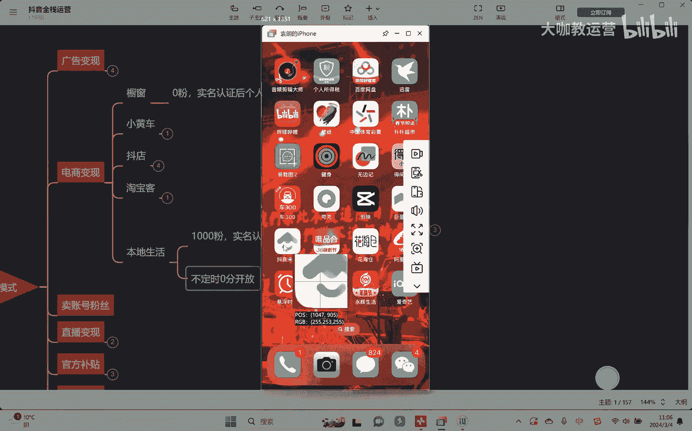

然后根据抖音来客的所有的相关的这个，系统的一个指导哎，去在这里认领你的一个门店啊，然后呢，在这里你们首先可以看一下需要的相关证件，第一营业执照，第二营业执照上面的法人证件，然后行业资质对吧啊。

这些所有东西根据他这个要求去上传啊。

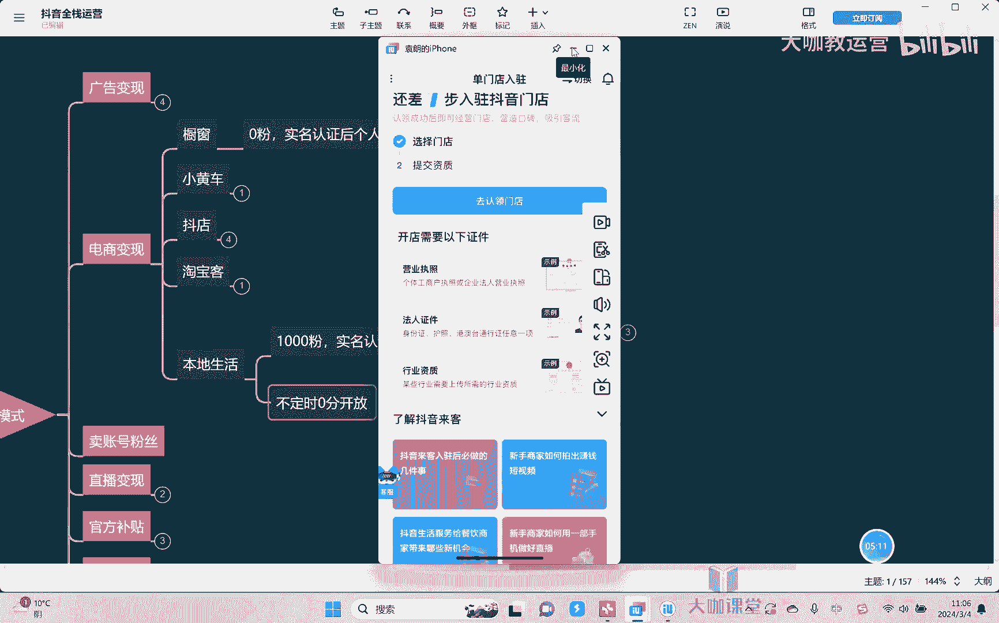

然后呢去做就可以了好吧，然后呢这些东西呢都并不复杂啊，都并不复杂，但无非区别就在于哪呢，嗯呃区别就是在于说，如果我们是做达人和做商家，肯定是不一样，个人达人去接，一般情况下我说实话我们在手机上面对吧。

就我刚刚跟大家去讲的，通过这个呃本地生活的后台，然后直接在上面去找到的，相应的一些这个团购链接啊，这个的话呢说实话就是什么呢，佣金不高啊，佣金不高啊，通常情况下大部分情况下我们叫做通用计划。

通用计划的一般佣金在多少呢，在5%到10%嗯啊但比如说举个例子，我们餐饮的一般上面的这个卖的好的，这种团购券，一般价格它都不会太贵，一般都在多少呢，都在100以内是吧啊，我们算他一个比如说80块钱。

那你可能成一单，你也才才几块钱，对不对，所以很多人会觉得哎我做本地生活，去达人探店赚不到钱对吧，那这个是因为什么，这个是有一个很大的一个点在于说你的嗯，你的达人等级，啊我们每个人去开通了这个探店的。

这个达人的相关权限之后，你就能够去了解得到自己的一个达人等级，大部分情况下我们出去探店，说实话四级以下，嗯实话实说很难啊，有什么这个店面会去找我们，所以呢我们基本上大概率只能干嘛。

只能在线上官方去接一些这种通用计划，也就我们说佣金相对比较偏低的对吧啊，然后呢个别情况下可能还会需要什么呢，可能还会需要我们说呃，这个自己出去吃的时候去探啊，然后呢因为店店家可能不会说。

因为我们和店家之间没有去达成这种合作对吧，所以的话呢你这个吃饭的这个钱，可能还得自己去掏啊，所以的话这个呃有的人很可能不一，有的这个同学不一定能接受对吧，四级以下，说实话比较难啊。

一般情况下需要你到了四级之后呃，你这个跟人家商家去谈就会好谈一些啊，因为你的等级越高，就意味着第一你的这个粉丝也好，你的流量也好，包括你卖出去的这个转化也好，对吧，都会更高啊，通用计划是这样。

那除此以外还有什么呢，还有说像招募计划，招募计划，就是我们说商家在上面去开发订单的时候，发这些商单的时候嗯，他主动去设定一些条件，嗯比如说我设定达人的等级对吧，我设定达人的类型嗯。

我设定达人的他的这个呃，这个这个相关的一个粉丝数量啊，他是可以去设计的，那么达到这样的一个条件之后，你就可以去报名，没有达到你就报名不了报，达到了之后你就可以去报名，那么这一部分。

他的这个佣金比例就会相对高一点，那再除此以外，还有我们讲什么呢，定向计划啊，一般情况下，像我们讲的招募计划和定向计划，都需要你的达人等级达到四级以上，大部分情况下四级以下确实是不太好接啊，当然了。

个别情况下三级个别情况下三级也能接啊，有的时候三级，知道吧，啊如果说你的答案等级能够达到什么六级七级，那我说实话你就做的特别特别牛的，那你其实做这个答案，这个答案特点就还真的能有很高的一个。

不错的一个收益好吧，那这个好我们放后话再说，OK定向计划是什么，定向计划就是我们和商家之间达成的协议，商家比如说我平时来讲，我这样的一个商单，我给你佣金只有多少，给你10%，嗯对吧啊。

给所有人都是10%，我是正常开通的一个通用计划，但是这一条我觉得说你能给我把这个产品带爆，对吧，你这个达人确实我了解哎，做的还很牛对吧，或者我们达成沟通之后协同一致，我可以给到你什么20%，30%等等。

这样子的一些相应的一个计划啊，给你单独去开点，设相应的佣金，甚至于我们有时候，个别的达人会给你单独的去做一个SKU，也就这个团购别人带不了，只有你能带对吧，而且所有的佣金也好，这些价格也好。

全部专门为你设置的，那这个都需要我们本身来讲是有一个资质啊，我们通常可以去接，OK好，那么一般情况下啊，我们刚说的通用计划确实也比较低，那当然了这个需要我们前期慢慢去积累啊，然后呢等价格这个高了以后啊。

我们就可以去接一些，比如说呃其他的一些计划啊，那么比如说像高一点的，比如说像什么招募计划，或者说像定向计划，一般情况下，我们的佣金都可以达到20%左右，一般情况下可以达到20%左右啊，当然了。

这是一方面，还有我们讲什么呢，还有我们讲呃这个呃上，因为线上来讲，毕竟来讲他会会什么，他会有一个抽成，知道吗，所以实话实说，到目前为止，整个去做本地生活打日探店，如果说你真的想赚到钱。

其实我们很多时候还是通过线下去剪啊，有的时候比如说线上去对接沟通嗯对吧，但是呢线上我们再去详细的去干嘛，去做这个额交付嗯，然后我们一般会谈什么呢，比如说一次性费用，值多少钱，这是有可能的。

一次性我给你去探个店多少钱，这些所有的这种佣金，什么东西我全都不要了是吧，我反正给你拍一段视频啊，那这种一般情况下是拍什么呢，拍的就不是这种纯粹的一个探店打卡的，这种视频，而是可能比如说呢偏宣传的嗯。

啊偏宣传的这种方式，然后的话呢我不卖团购对吧，一般情况下大部分的二线城市啊，或者说这个新一线城市，一般价格的嘛在500块钱嗯，到啊800块钱，根据答案的实际情况来，这是一条。

那如果说嗯呃其他的呢就是什么呢，就是我给一笔钱，然后呢带什么，再再加上相应的这个团购券，卖团购券的话呢，一般来讲目前的行情是200块钱，加这个什么卖券的，佣金这样子去算，这一般情况下啊，当然了。

如果说你的等级高或者跟人去谈这个东西，钱的话，你肯定是可以去再去谈的吧，啊是吧，它整体的一个模式目前来讲居然基本上是这样，但是如果说距离比较远，可能还会再加上一个什么东西呢，当然像这样的所有的探店啊。

你所有吃也好，或者说这种酒旅的住也好，玩也好，那肯定来讲都是商家去给你去承担对吧，你就相当于是帮他去做宣传嘛，对不对啊，所以有的时候呢这种活还是挺好玩，挺有意思啊，啊我之前的话呢呃对接的相应活动啊。

当时呢也是跟着几个他人一块对吧，吃吃喝喝住住玩玩啊，然后呢一分钱不用花对吧，这种还是蛮有意思啊，我觉得有一些这个个体的一些达人对吧，尤其是咱们有一些这个呃，偏本地特色的一些东西啊。

或者说呢像这个呃这个个人呢，还是有一些这种镜头的一些啊，这个表现能力啊，也愿意去做一些相关的这种活的，我觉得这个方面还是一个蛮好的一个选择啊，虽然说实话挣这个挣大钱比较难对吧。

但是呢呃呃你说一个还不错的收益，你举个很简单的例子嘛，一个月一两万，两三万，这个东西确实是不难好吧，确实不难，OK那么关于这个本地生活，相应的一些这个了解的东西，以及一些基本玩法。

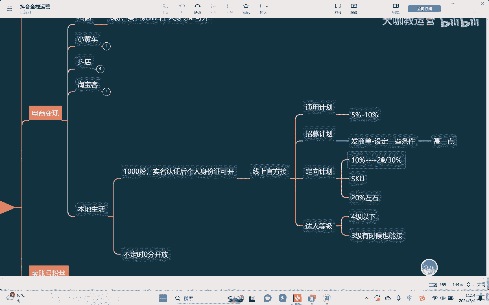

我就给大家去讲到这里好吧，OK那么这节课讲到这里。