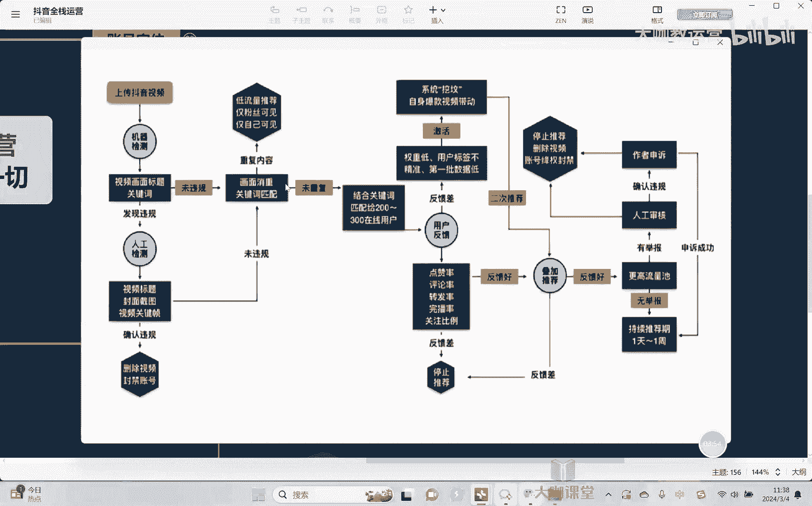

# 【2024B站最强小红书运营系统教程】吊打一切付费课!小红书蓝海市场 2024最值得做的新媒体平台 - P40：8、短视频运营：抖音的推流机制 - 大咖教运营 - BV1sn4y1X75u

欢迎大家来到我们的抖音全站运营课堂啊，那这节课我们开始跟大家去拆分，详细的去讲一讲关于抖音相关的流量算法呃，在具体讲他的一个流量算法之前呢，其实我们首先了解一个东西，就是抖音的一个流量池啊。

关于抖音流量池这个东西呢。

大家应该都听说过对吧，那这里是大概的抖音的一个流量池的一个呃，基本的一个流量池，大家可以看一下啊，现它不能算是特别准确，但是大概差不多是这个样子啊，那么我们说为什么有的人有流量，有的人没有流量。

就是因为首先那么抖音它的平台系统背后，他就已经给你划分了你的流量的上限和下限啊。

我们可以理解为，这每一个流量池就相当于一个水池，当我们在刚开始放视频的时候对吧，比如说一个举个例子，我星号啊玩了没几天，然后我现在发一个视频，那平台这个时候呢，对于你之前没有任何的历史数据。

也不存在什么账号权重对吧，那我所有的话我不可能说上来，我就把那个那个大量的流量给你，这个不现实对不对，因为平台不知道你到底是不是，这个能够带来价值，带来产出，所以呢他只会给你多少呢。

两三百左右的一个播放量啊，相当于他拿着两三百的一个播放量先去测，你如果给这个基础播放量，你觉得哎你的这个整体的数据还不错，OK那么他会干嘛呢，他会给你进入到下一步，然后呢。

唉达到一个什么下一步的一个曝光的流量池，那这一个流量池呢大概会给你在3000左右上下，它的一个播放量对吧，给到你这个播放量之后，然后再去看给你这么多播放量之后呢，你的数据又能不能再一个能够去做好。

如果还能做好，他就会再给到你下一个流量池对吧，再进一步的给你去放大你这个曝光量，如果做的不好，OK那么你的流量也就到这儿了，就结束了对吧，那么每一个流量池之间，它的话呢我们会相当于有一个什么呢。

会有一个阀门，有一个阈值啊，也就是说当这个阈值是个什么东西呢，它这个阀门相当于就是一个指标，也就比如说我们的什么玩播也好，评论也好啊，什么点赞率也好等等，这些东西达到一个既定的一个指标之后。

OK那么他就会给到你相应的下一个流量时去啊，然后所以这就是我们讲，如果说好的这些视频内容好的啊，确实受欢迎的，为什么它能够迅速有大量的流量，但是我们说很多视频你这个流量就是出不去啊。

其实原因就在于这里好吧，那这是一个流量池。

流量池是我们前面要聊出的一个基了解的，一个基础的东西。

好那流量池了解完了之后，我们再来去讲流量的具体分发机制啊。

那这个也都是我们说平台官方给到的，相应的一个呃分发机制的一些图片啊，你们可以看对吧，那么整个流量是怎么来的，首先第一我们在发了视频之后对吧好。

那么机器它会需要首先有一遍机器的一个检测，审核啊，因为整个抖音它的所有的审核机制分为两重，第一是机审，第二是人审，一开始的时候，因为效率嘛对吧，人不可能说那么多，而且呢人的这个效率相对偏低。

所以他首先会干嘛去先去积审啊，机械省你相应的一些这个呃，这个有没有这个呃一些重复的画面呢对吧，有没有一些重合的这种内容，然后呢哎有没有些违规的东西，如果都没有，OK正常的这些我们都没有问题啊。

然后他会干嘛。

他就会跟你去哎第一个流量值进去，当然这个过程当中，如果说发现了违规，他不会说立马给你砍死，他会干嘛呢，再去进入到下一步，也就是人工检测。

而人工检测的话呢相对来讲就比较严了，如果说确认你违规了，那么不用想。

你就删视频对吧，过于严重就封账号了啊，如果没有违规，OK进正常的。

我们这个视频就发出去了，他就会给到你两三百左右的一个啊播放量，但这个过程当中。

有的时候我们说哎，我们的视频为什么播放量很低，什么十二十啊。

这种情况下为什么，原因很简单，因为画面干嘛，画面发现你的什么一些这个文案也好，发现你的画面也好，你的内容也好，有过多的重复，那这种情况下他会先给你干嘛呢，会给你哎，就是相当于限流了。

就只有你自己的粉丝能够看到你这个内容对吧。

所以你的播放量就少啊，他不会给你去扩大你的播放量，对不对，不会扩大你的曝光，那没有这些情况下，我们就正常的，他会给你两三百的一个播放量。

一个用户，但是这是我们讲一般情况下，账号如果说账号权重比较高的情况下。

那么出的流量可能就会给到你，1000左右的播放量，所以你相当于意味着如果账号的权重高了，那么机会就会更大，对吧好，那么我们这个是再其次啊，这是后话，我们再单独讲，正常看我们这个流量如果发出去好。

都没有问题了，对吧啊，都没有问题了，然后呢用户就开始产生反馈了啊，他会给你去点赞评论。

然后完播等等关注对吧，反馈不好，那么就干嘛呢，就开始哎停止给你进一步的这个流量啊，如果好，它就会进入到二次推荐。

也就我们刚刚讲到的，给你到下一个流量池去，给你到下一个流量池去扩大你的一个曝光。

对吧好，然后的话呢再好再去继续曝光，再好再继续曝光，但在这个过程当中有可能会干嘛呢，有可能会存在你的内容被别人投诉对吧，如果投诉会怎么样，来各位如果投诉，那么这情况它就会直接进入到人工审核。

就不存在说什么机审了，因为一旦是涉及到投诉，就直接开始人审。

那我告诉大家，在这里的时候，人审他的一个严格程度就很高了啊。

所以的话呢一旦说被人投诉，那除非你的内容确实啊真的是没有问题。

但如果说出现一定的问题，那还是挺容易会给你进行什么啊，这个降权或者说呢限流哈，甚至于说是删持平的一个情况，当然这个过程当中，你可以去进行一个相应的申诉啊，申诉的过程呢也是人工审核啊吧，申诉没有问题。

那么你就正常的流量还是该怎么样怎么样对吧，视频该怎么样怎么样对吧好，那么这是我们说整个呃抖音，它的一个流量分发机制的一个整个的一个过程，那那在这里还有一个点什么，就是我们讲初期的时候。

有可能会比如说给到你的300啊，200的一个播放量对吧，但是呢你的这个数据表现反馈不是很好，对不对，那这个时候其实正常会给你干嘛，他不是说你这个视频就完了，他会相当于给你们可以理解为。

我会给你放到一个坑里面去，会给你放到一个哦，我们说叫做坟坑里面去，嗯啊放进去之后干嘛呢。

哎放在那里放到了，但是过了一段时间。

万一比如说你这个相关的话题的一些内，容的视频火了，怎么办，那这个时候平台系统就有可能会，把你从那里面挖出来，再给你一定的一个流量，再去看看你这个东西有没有可能在火，懂吗。

哎他还会有这样的一个机制啊，懂吗，所以的话呢呃当然这个说实话对我们来讲，其实影响不是很大啊，和是不是很大，但这里的话呢，要让大家有一个基本的一个了解过程。

那那在这个里面的话呢，其实我们要注意的是什么，要注意的很大的一个核心，就是在于视频能不能过审，这是第一步知道吗，因为过机审我说实话不难知道吗，如果说你连机审都过不了，那一定是你的这个账号内容。

是有比较大的问题的啊，首先就是我们讲关于这个啊重复的一个问题，这是很多同学会遇到的一些问题。

尤其是很多新手同学啊，总是喜欢刚开始不知道自己做什么内容，就开始去混剪对吧，这里找一点，那里找一点，那如果说这个啊混剪你过不了，那这个东西确实是没办法啊，我也没办法跟你去讲什么。

只能说你内容重新做对吧啊，这是机审啊，那么真正拿核心这个比较困难点在哪里，在于人审的过程当中啊，因为人审我告诉你。

就会很严格，因为你们要知道整个的抖音公司，他总共只有这么些人对吧，目前据我所了解，一在上海，然后在深圳杭州，然后在武汉啊，都有相应的这个审核的部门对吧，但是一个部门基本上也就是一两千人。

但你们想想我们每天的这个视频，发视频的量有多大对吧，所以对他们来讲呃，这个我就不可能说每个视频看的特别仔细，一旦你的视频被投诉进来，那么对于我们讲这些审核人员来说，他要很重视，但是他又没时间怎么办。

为什么要重视，因为你要知道在这里我也是单独跟大家去讲，每一个审核人员，嗯身上是有什么啊，身上是有指标的，各位同学也就你可以理解为你这个视频嗯，我让你过了，那么对于审核人员来讲，我没有好处。

但是如果说让你没过对吧，但是如果说假如说你可以理解为这个视频，我让你过了之后，你这个视频万一有问题了，那不好意思，那他就会干嘛，严重受罚，嗯所以大家可以，所以这就是我们讲为什么啊。

这个人工审那么严的一个原因所在啊，因为很简单，你想你要是去当这个审核人员，你也一定会卡的很严，嗯啊对吧，所以他既严格，但是他时间又不是很多，所以这就会导致他的这个人工审核，很大的一个可能性就给你干嘛。

给你去进行一个处理啊，尤其我们涉及到有的时候有人跟你去举报，举报的，那么不好意思哎，对于审核人员来讲，就你擦边那种东西对吧，搞点搞点颜色的东西，我说实话有的时候真一级别必剪就过了，但你一定。

一旦你涉及到这种类似的相关东西的时候，那么各位同学，那在在审核人员那里就是直接先砍死嗯，砍死了再说嗯，嗯剩下的你再自己去申诉去，懂吗，所以他是这样的一个流程啊，所以我们在发布视频的时候，机制也好。

流量池也好，这是我们讲哎，我们说能不能让视频的这个数据更好，但是你真正要过的好，首先第一关是什么，各位同学，首先是这一关嗯，明白吗，各位好吧，所以在这些方面大家一定要去注意。

OK那么这节课我们先讲到这里好吧。

