# 【2024B站最强小红书运营系统教程】吊打一切付费课!小红书蓝海市场 2024最值得做的新媒体平台 - P41：9、短视频运营：抖音短视频数据详解 - 大咖教运营 - BV1sn4y1X75u

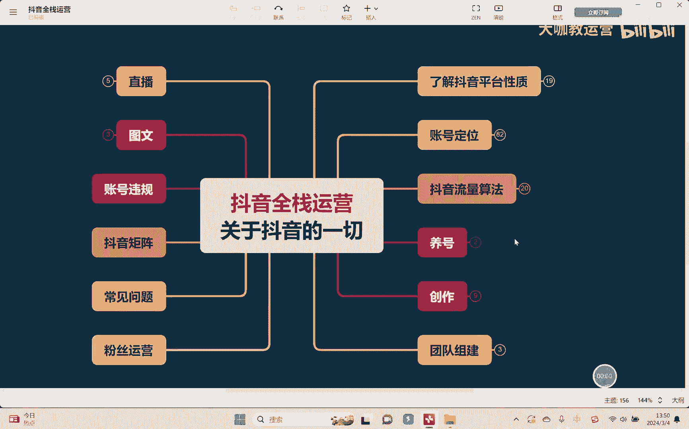

Hello，大家好，欢迎回到我们的抖音全站运营课堂，然后这节课的话呢，我们之前已经学习了关于流量池，以及抖音的流量分发机制对吧，那么这节课我们来了解关于短视频的，各项的一些数据指标啊。

它的背后有什么意义，以及它代表什么东西，包括这些相应的数据指标，我们该如何去提升好吧，嗯首先呢关于我们短视频相应的一些数据，数据的这个指标主要的是哪几个呢，完播点赞评论转发关注对吧，当然还有收藏收藏。

这里的话呢不是很重要，我们就呃这个不去讲好吧，那首先在完播这一块，这个呢是大家提的比较多的对吧，那么其实完播背后我们会有两个数据，有一个东西呢大家听说过对吧，叫什么两秒跳出，还有一个叫什么五秒完播。

嗯对吧，当然我们还有总完播率，嗯嗯啊还有这个东西对不对，比如说呃我们一个这个视频有十秒钟，然后呢呃别人看我们的视频看能够看几秒对吧，这样的一个比率，OK呃我们首先来讲完播到底代表什么意思。

其实大家可以想一下，完播也就是人家把我们的视频能不能看完嘛，对吧，呃如果说完播视频整个能看完下来的话，那其实很简单，就是对我们视频的里面的内容啊，他是有兴趣的对吧，他觉得有好奇心，他也把它去看完。

对不对，那另外我们说两秒跳出和完播，五秒完播率，这个其实是什么呢，这个其实代表是哎这个用户，他对于我们视频的什么，它对于我们视频的开头有没有吸引到他，对吧，还有什么。

还有我们视频的话题能不能引起人的兴趣，嗯他对于我们这个呃这个主题，我们这个内容的一个主题，他是否有兴趣去了解，对不对，所以他主要其实完播主要是在于这几个方面，那么我们想要去提升完播率。

其实想要去提升它那很大的一个方面是吧，一方面是我们的视频内容讲了是吗，另外一方面是什么，另外一方面就是我们的选题很重要，啊选题本身能不能够让人家觉得说哎，这个东西我好像是对他比较感兴趣了，对不对。

OK好，那么其次是什么，其次就是我们在讲像比如说什么点赞点赞，其实你们想想我们平时自己刷视频，我们愿意去给他点一个赞什么，我们觉得哎这个视频内容讲的好对吧，所以是对它的一个内容。

本身的一个整体的一个认可度啊，当然也不排除我们说有很多的时候呃，大家有这个点赞的一个习惯，我看到这个视频啊，差不多我就随手给他点个赞，对不对，因为点赞其实很简单，我把这个屏幕点连点两下。

就这个赞就点出去了，对不对，所以点赞这一块其实数据来讲他还是怎么说呢，呃相对来讲比较容易去提升，但是又不是那么容易去提升的一个东西，它有点点什么呢，有点点玄学的东西在里面，好吧嗯，他不是那么好不好把控。

那么另外就是我们说关于评论啊，有时候我们会讲，这这个评论的一个数量能够多少呢，其实就在于说我们内容的一个这个，或者是话题啊，或者是一些我们在这个视频当中，提到的一些观点等等啊，有讨论的一些兴趣对吧啊。

再比如说有一些这个画面当中，视频内容当中的一些这种呃，比如说画面中的一些设计，一些小的细节，让人觉得这个东西很有趣，他愿意在下面去评论一下，对不对，还有其次我们讲到的转发啊。

什么样的情况下我们会去转发视频，就我们想跟比如说呃，我觉得这个内容我看了很有价值啊，或者让他他觉得我，我让他觉得这个视频我感觉很搞笑啊，我想分享给我的好朋友，让他们也去看一下，或者去了解一下这个东西。

是或者说呢这个话题本身哎很有讨论性，我想和我的朋友一起讨论一下，哎，相互之间讨论讨论我们的一个看法，我们的一个观点，对吧啊，那至于关注是什么呢，关注就是我们看完这条视频之后。

我觉得啊呃这个博主或者说这个人，他应该还是挺有兴趣的，我想看看他以后还会发一些什么相关的一些，这种内容对吧，我想长期去关注它，OK那我们了解完这些背后代表的一个含义之后，我们其实就知道。

我们大概要去提升哪些地方了啊，那么在这些指标里面哪个比重会比较重呢对吧，就是我们想把整体的这个呃曝光，把这个流量拉大比重，怎么去拉，各位来，我告诉大家在这里面嗯什么比重，首先第一嗯关注要大于嗯。

嗯点赞评论，再大于什么呢，嗯大于我们的完博嗯，嗯好嗯，那有同学可能会问了，那关注既然是最重要的，那我们是不是也应该先提升关注，然后再其次就是我们要注意这个点赞评论，然后再去提升完播来。

在这里就会有一个误区，就大家平通常来讲，我们说既然按这个提升数据，是不是应该按照这个这样的一个比重来呢，道理来讲，说实话确实没错对吧，我们做任何事情先抓主要的，但是在这个背后有个问题。

各位同学关注这个事情啊，我们怎么去提升呢，对啊，我们讲的比如一个一个人对你的这个账号，对你这个整个IP啊长期有兴趣，想要长期关注你，你告诉我往哪里去提升，我们唯一能做的就是把我们的内容做得更好，对不对。

更吸引人，然后呢让他觉得有关注的一个兴趣，或者说把我们的人设做好，那这些东西说实话是比较难的啊，所以我们经常会听到，就是说我们想把视频的流量做好，先提升什么，先提升完播率，原因在哪里。

因为它相对来讲容易一些，嗯对吧。

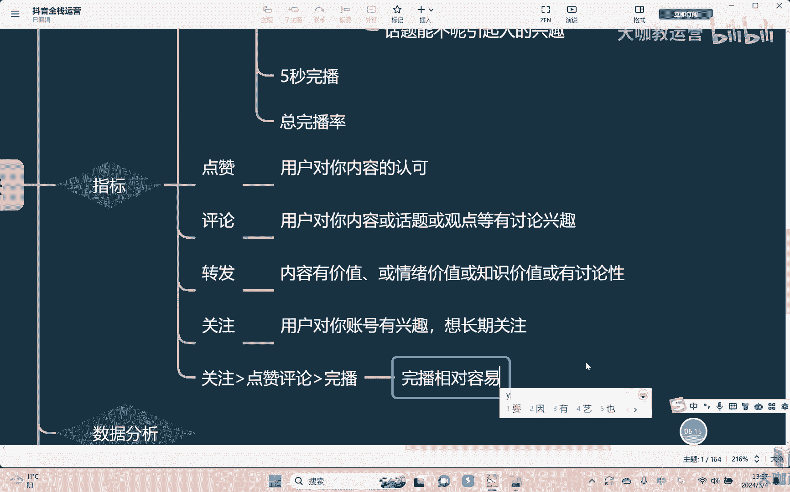

因为我在前面讲了，我们说玩播主要考核是哪两个优先，就是两秒跳出和五秒完播率。

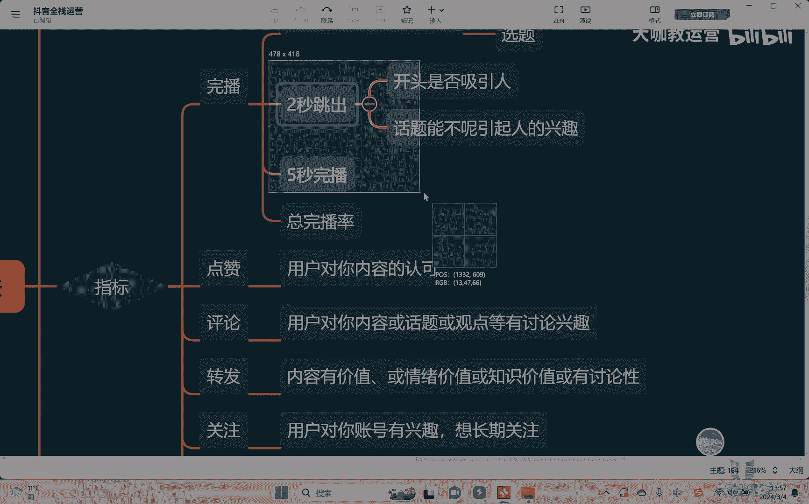

说白了就是什么，说白了就是我们讲的就是把你的开头嘛做好，对吧嗯我们集中时间去做这五秒钟的时间，是不是一定比你整个视频把它全部做好，相对来讲容易一些对吧，所以这个我们才是，为什么说。

我们总是要先把完播这个事情做起来啊，把它先给做起来对吧，保证一个基础之后，OK我们再去讲点赞和评论，对不对啊，所以那如何去提升完播率呢，啊我们的一个五秒完播和所谓的这个两秒跳出。

其实就是在于我们的开头能不能去把它做好，呃，这个话题首先本身能不能吸引人对吧，所以我们会看到啊，相对来讲你只要看到流量比较好的视频，它的开头不管是他在开头的封面的设计上，画面的设计上。

还是说他开头的时候打出了相应的标题，它一定是干嘛，它一定是能够去吸引你的，对吧，还有时候我们会看到简单的做法，会把开头的那么几秒钟时间选取视频当中，嗯的所谓的高潮部分，嗯对吧。

嗯啊比如说我在去探一家店的时候，我会把这个探店当中的一个比如说什么，比如我们说所谓的这种重要节点，举个例子，有个菜确实很难吃，然后呢把这种高能的这种啊这种言语，这种画面，我把它放在开头，为的目的是什么。

就是先吸引人先停留，先观看对吧，所以我们做任何事情也是一样，要有一个顺序，先让它停留下来，嗯对吧，然后再去，嗯输出价值内容。

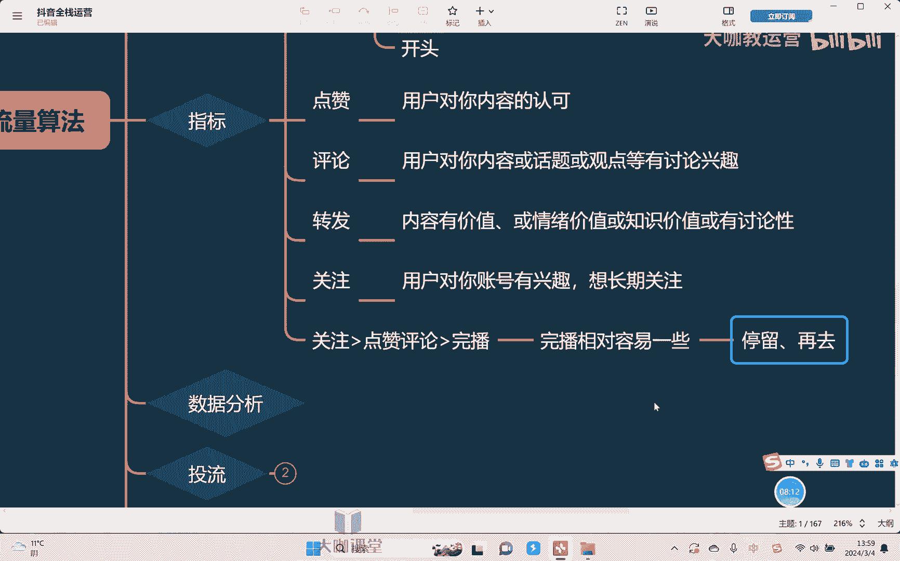

嗯最后再干嘛，再去引导他进行互动，然后再去引导互动嗯。

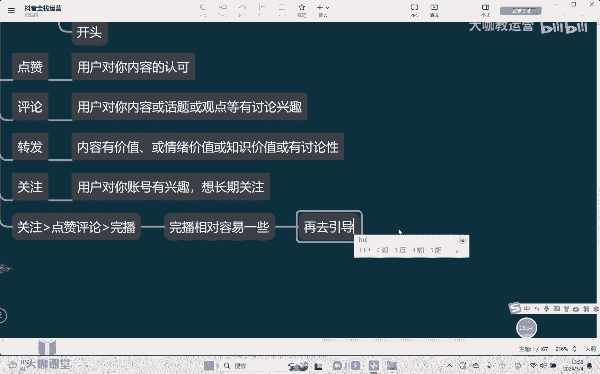

所以这是我们能去做的一个事情，对不对。

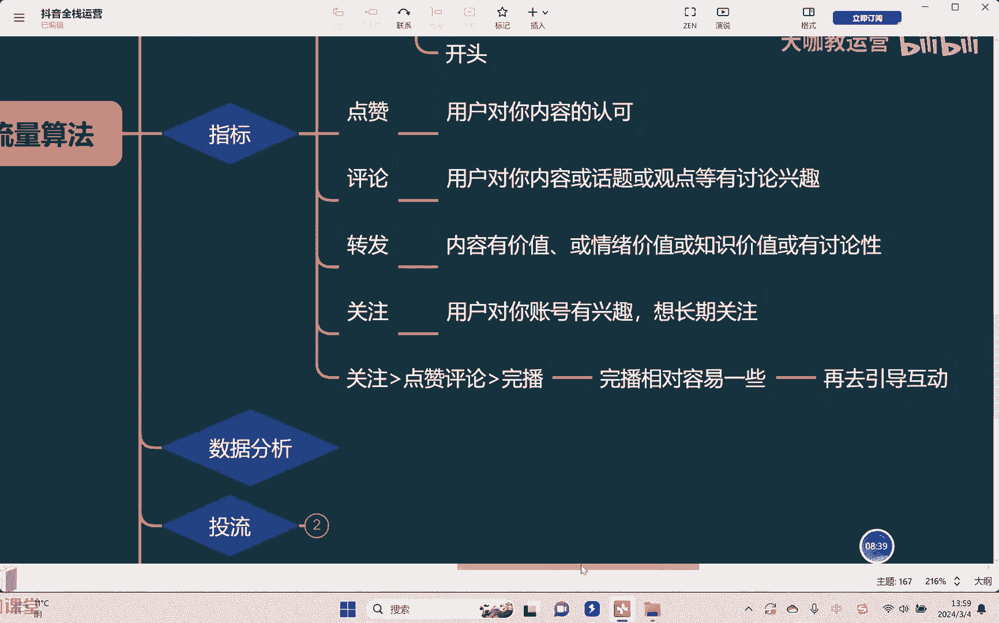

OK那当然了，我们讲了哦，开头哦应该把它做好，做好完了之后呢停留下来，然后我们要干嘛，我们要去把我们的内容输出，对内容如果说还不错，那起码来讲，其实大部分的用户对于点赞这个事情。

因为他比较容易双击吸两下就可以了。

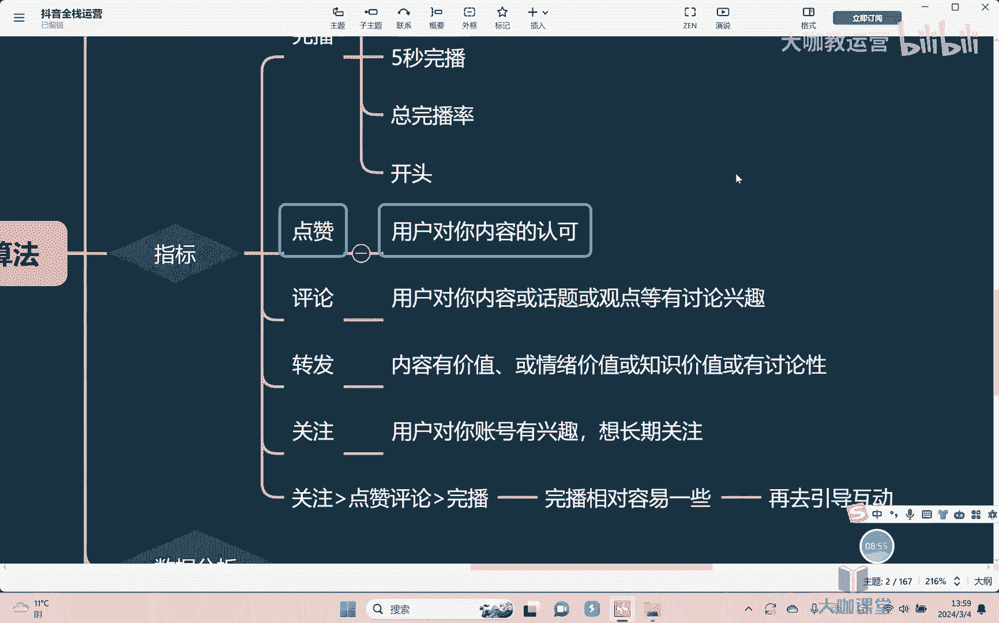

所以他会比较愿意去做这个事情，嗯对吧，所以想提升整体的完播。

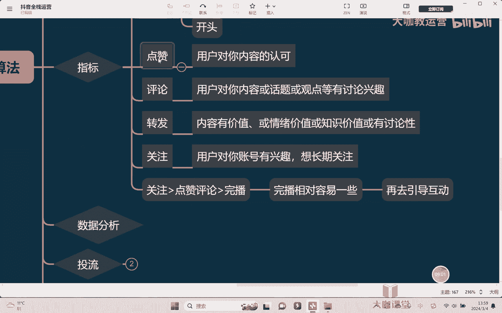

想要哎接着能够让用户有开始基本的互动，能做的事情是什么，就是要让我们的整个的这个视频内容啊，嗯要它有一个结构，嗯嗯这是一个前提对吧，那什么叫结构化设计呢，嗯开头干嘛，比如说最简单的。

我们看到大部分的视频是两个结果，开头提出问题，中间干嘛嗯解决问题对不对，或者回答问题啊，然后到了结尾的时候会跟你讲，再去提出一个相关的，比如说呃这样的一个观点，引导你去评论对吧，这是干嘛。

最后在结尾去引导，所以这是我们讲正通常情况下。

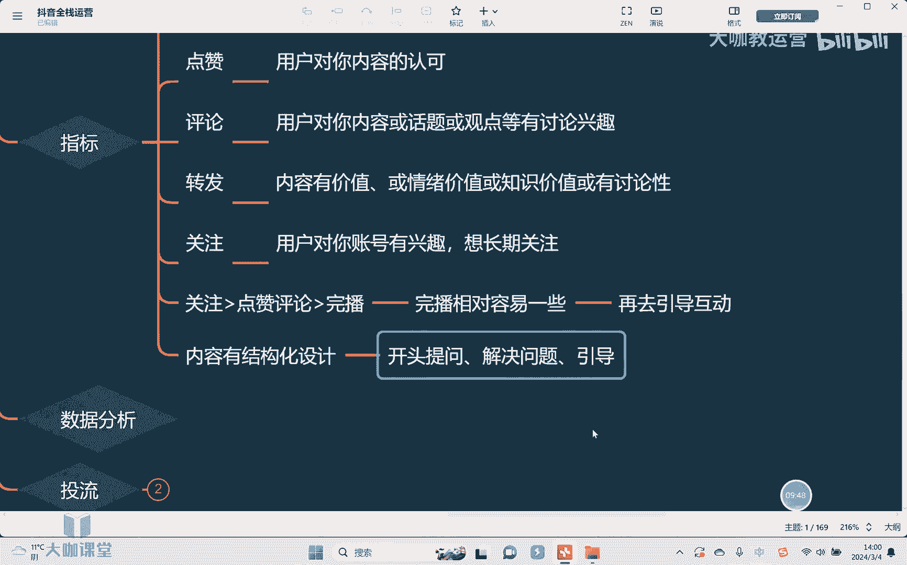

我们的一个短视频，想要提升数据要做的什么，真正你要做的就是第一开头要有一个，那么要有一个能够吸引人的一个画面啊，吸引人的一个提问，吸引人的一个标题，然后我们中间的内容是实际输出的，去解决这个问题。

回答这个问题，最后在结尾的时候再去干嘛去引导啊，引导用户的一个互动，引导你的关注，引导你的评论。

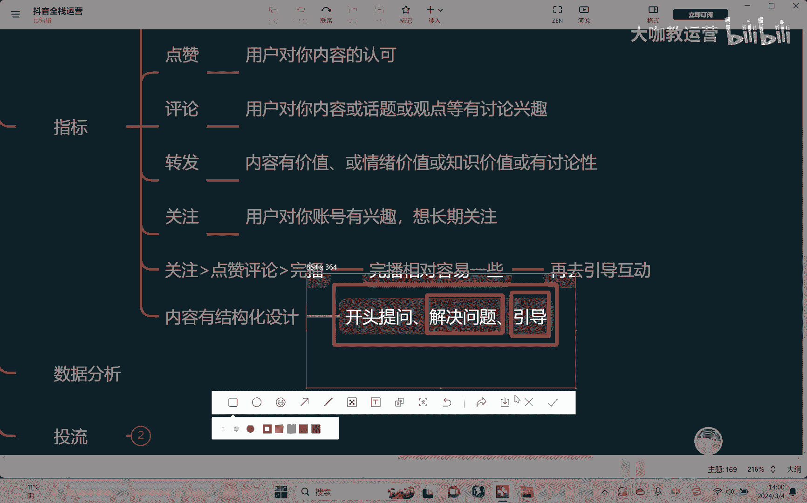

所以这是我们讲如何去提升，我们相应的一个数据指标的整个的一个思路。

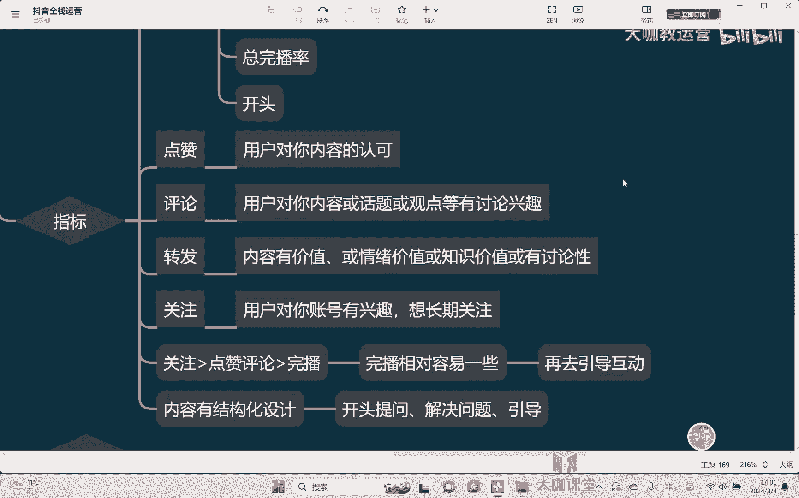

好吧，OK那么这节课就讲到这里。