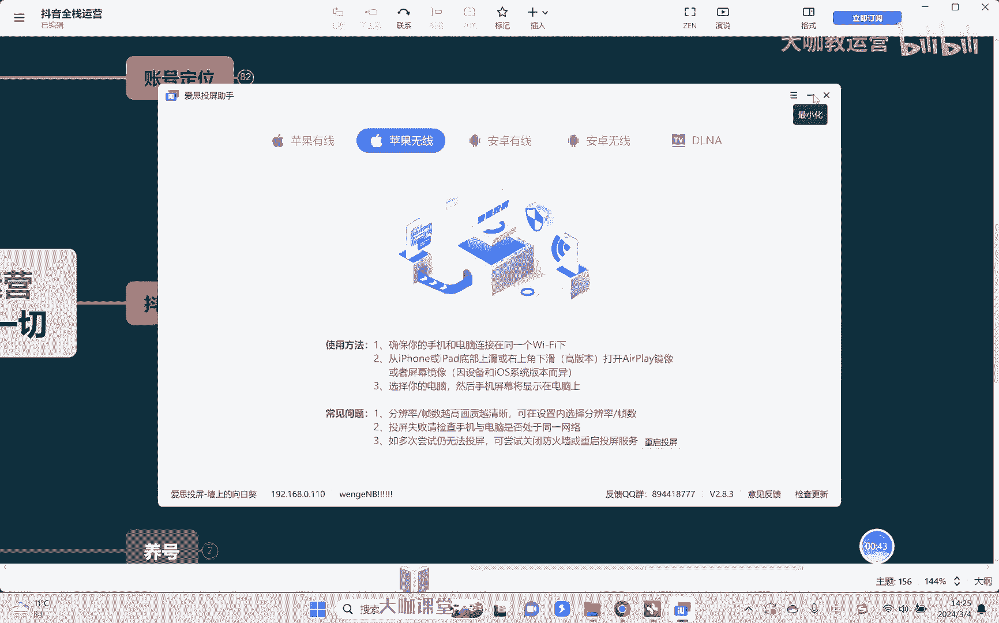

# 【2024B站最强小红书运营系统教程】吊打一切付费课!小红书蓝海市场 2024最值得做的新媒体平台 - P42：10、短视频运营：抖音短视频的数据分析 - 大咖教运营 - BV1sn4y1X75u

Hello，大家好，欢迎大家回到我们的抖音全站运营课堂，这节课我们继续来去讲，关于抖音的这个短视频相关数据，我们如何去分析，上节课我们已经学完了啊，短视频的各项数据指标，然后呢。

背后代表含义如何去提升的一个方向对吧，OK那我们如何去看自己的短视频，了解清楚自己短视频哪里有问题，哪里这个要提升呢，OK首先第一个来去讲我们的短视频，我们在哪里去看我们的数据。

好吧好，那么首先第一呢我也是把这个手机来投屏啊，给大家看一下，呃我们的短视频数据呢，一可一方面可以在手机上面看啊，一方面呢也是可以在这个电脑上面去看。

首先呢我们一样打开抖音啊，右上角的这个三道杠对吧，点击抖音创作者中心，然后在这里就能够看到我们的一个账号数据啊，直接点击详情对吧，好，这里的话呢就可以看到我们总的一个数据，然后可以点击作品分析啊。

去看每一条视频啊，它相关的一个数据，比如说我在这边随便点开一个啊，我们的一个数据对吧，然后就能够看到我们整个账号，比如说它的播放量完播率对吧，两秒跳出率对不对，完播率肯定是越高越好啊。

两秒透出率是越低越好对吧，然后呢平均的播放时长越长越好，对不对，OK还有啊，这里会有个五秒完播对吧，然后再往下啊，就是我们说来渠道的一些相关来源啊，时段的一个分析对吧，根据这些东西去分析我们的一个数据。

然后呢包括还有互动的分析，那互动这里我们要看的什么，主要看的不是量，而是比率啊，评论率，点赞率，分享率这些比率越高肯定是越好的，然后其次观众分析要去了解清楚，我们的观众的一个画像。

他大大概哎都是哪里的人性比较多对吧啊，我们要去了解清楚我们的一个受众群体。

然后再其次我们可以通过电脑啊，直接登录抖音的创作者中心啊，在这里也可以看到我们相应的一个数据啊，点开首页对吧，比如说在这里就可以直接点啊查看更多，然后看我们相应的数据啊，然后呢以及说点开单个视频。

也可以看到单个视频，比如说它的完播率对吧，平均的一些数据我们都能够去了解得到好，那关键问题是我们看了自己的数据之后。

怎么样才能知道自己的数据是好还是不好呢，对吧，比如说我们之前也提到了完播完播，通常情况下，我们要达到50%以上的一个完播率，啊额，或者说嗯50%以上的一个五秒完播啊，如果能达到70%的话。

那就是很优秀了啊，就是已经是很优秀了，说明大部分的人对你的这个视频，都还是挺感兴趣，愿意起码来讲他愿意进来看对吧，好好那我们再来讲点赞评论转发这些东西，我们要达到怎样的一个比例才好呢对吧。

其实我可以告诉大家，首先什么点赞评论转发关注这个东西啊，他没有一个很明确的指标，因为我们每个人发的视频，时长嗯不一样对吧，所以我们要知道时类型嗯嗯也不一样嗯，嗯所以你没有办法说定义一个所有视频。

他的一个标准，你能做的什么，对于系统平台来讲，它首先必须要把类型去统一，嗯对吧，你是美食的就跟美食比啊，你是这个穿黑丝的，就跟穿黑丝的去比，首先第一它的类型要统一对吧，第二还有我们讲的时长对吧。

也不一样啊，还有额这个什么这个性质，比如说呃，你是带了这个带货的视频和不带货的视频，也是完全不一样对吧，所以他有很多方面的维度，OK那这样的话我们该怎么去分析我们的数据，很简单，各位就是干嘛呢。

就是看我们说同行他的一个视频啊，看同行的数据。

那怎么去看同行，首先我们要知道我们自己的视频。

我们的内容处于大概是哪一个流量池当中懂吗。

好比如说举个例子，OK我现在刚开始做，我连500的播放量，基础播放量我都破不了，你说我这个时候去对标人家什么100万，200万的播放量有意义吗，没有意义对吧，那么我第一件要做的事情嗯，我要去对标。

是比如说3000的1万的，我对标近一点的这种目标去找他对标对吧。

然后找同一类型的，比如说我是做美食的，OK那么呃我们可以通过相应的数据网站啊，数据网站上什么查多这个什么呃，打多多，然后我的馋妈妈，对类似的这些数据网站都可以去查，比如说呢像这个达多多啊。

他每天可以有一些免费查的机会好吧，那这个可以推荐给大家啊，像什么蔡妈妈这种，其他大部分我们是花钱的啊，这个是不懂花钱的啊，我们可以直接看他相应的这个短视频对吧，然后去找到这个人的一个视频。

比如说我找热门的视频库，然后呢我找那个类型的啊，比如说我是美食的，OK我就找美食的对吧，我的粉丝是1万不到对吧，我就找什么，我就找1万到10万之间的一些达人粉丝对吧，就找我对标的等级是差。

一定要比我高一点，但是又不能差太多。

然后去看它的详细的一个数据啊，在这里去看嗯。

嗯对吧，比如说了解到他这个视频的一个播放量，嗯然后我再去看他的评论。

点赞转发互动去计算它的一个比率，然后去对照着自己的一个相应的数据，看看我们自己的这个互动率有没有达到对吧。

完播率有没有达到啊，然后呢以及我们讲观众的类型对吧，因为人家的数据好说明什么，说明大概率人家的这个观众，人家的一个粉丝画像可能比我们要更加精准，或者更加准确一些，那那在这里你也可以去对照着去看。

然后再去根据相应的数据去调整自己的评论啊，调整自己的一个视频的一个相应内容对吧，如果互动少了。

那我需要在视频当中增加我的互动的一个，引导性对吧，如果完播不行，我要提高我的视频开头，或者调整我的一个选题，对不对啊，各方面的数据指标其实背后含义，我在上节课已经跟大家讲了，所以我们剩下要做的什么。

要学会找数据分析的方法，那方法这也可以跟他讲了，剩下的事情就需要大家实际去做啊，然后呢嗯我们一定不要说这个好高骛远啊，实际上在这里我想跟大家去讲的就是，不要好高骛远啊，就找什么呢。

找一些相应的对标一些类型的账号，因为我说了数据的分析，其实他没有一个统一类型的标准，不可能说我们所有的人的这个数据，都要达到一个很标准的一个值，因为我们讲了视频，它本身的维度不一样，对不对。

所以呢你要能够去做的一个事情，就是找对标的账号，人家达到什么数据，你往他的那个数据指标上去靠，OK那么你就能够达到跟他差不多的一个流量啊。

其实理解起来应该很容易，对不对，好那么这节课的话呢，我们就给大家去讲到这里。