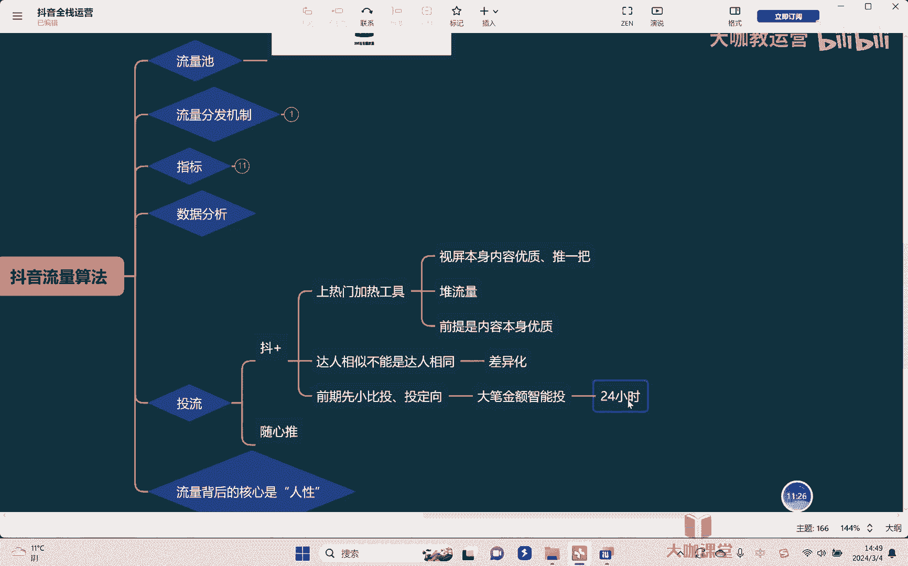

# 【2024B站最强小红书运营系统教程】吊打一切付费课!小红书蓝海市场 2024最值得做的新媒体平台 - P43：11、短视频运营：抖加的投放技巧 - 大咖教运营 - BV1sn4y1X75u

哈喽大家好，欢迎回来到我们的抖音全站运营课堂，然后的话呢这节课我们继续来去讲数据啊，那么这节课我们要跟他去讲的，比如说投流相关的啊，短视频相关的呢，主要就是分为这个斗家和随心推啊。

那斗家是我们叫做上热门的工具嗯，叫加热工具，各位嗯什么叫加热工具，就说白了各位要理解一点，抖加是给你的视频进行加热，也就是我视频本身嗯内容优质，那么他可以干嘛，他可以帮我推一把，嗯对吧。

比如说我的这个视频，本来我现在呢已经达到了什么。

40万的一个播放量，50万的一个播放量对吧，那我现在觉得呃这条视频我好像还不错，我想让他再抱一下，怎么办呢，我就给他去投一笔多价，然后让他冲把这个阈值冲开，冲到这个六次曝光是吧，冲到下一个流量池里。

甚至于冲到更大的流量池去，这是我们讲叫做加热工具，然后让他去上一把对吧，所以首先要知道抖加的核心作用，只是给我们的视频去加热，去推一把的，他是锦上添花的一个东西，他做不到什么，他做不到给你堆流量。

嗯知道吗，所以核心是什么，前提条件是内容本身优质，然后我们再说去投豆家，那否则就没有必要，首先大家要有个这个基本观念，第二随心推，那随心推他的一个作用是什么呢，推商品卡，和直播间。

嗯啊所以呢随心推他呢在这个推商品卡，所以我们因为有一些视频，我们是带货视频对吧，那么这个时候我们会用到随心推，那那关于这个随心推这块呢，我今天在这里先不讲，我放在后面，我们在讲图文的时候。

在讲商品卡的时候，我到时候再给大家去讲，好吧啊，主要呢我们在这里讲一下抖音，首先抖音怎么投啊。

我还是一样，在这里呢把我的这个手机啊投屏，然后给他去演示，好那么我们随便先去看一下自己的视频对吧。

这是我们发过的视频，好点开视频，然后呢右下角这里有三个点对吧，OK点开之后在这里我们可以看到有个抖，加上热门，把上热门点开之后，我们就可以看到有很多的一些视频对，比如说我们可以推广啊。

在这里可以选择各种各样的一些视频，好我随便选一个视频，然后呢我们可以去进行一个推广啊，那么，稍等啊，我选择一个好选择，完了之后，在这里可以看我们的斗家要怎么去操作啊，比如说我们可以去推干嘛。

推账号本身的一个建议，就是短视频账号的一个建议，第二我们可以去推直播间啊，那因为短视频它本身的话呢，人家看了觉得有兴趣，他是可以去导流到直播间的对吧，但通常情况下我们斗家不会这么去用啊。

我们一般是用拿它来去做这个短视频对吧，那短视频这里我们可以看一下，我们想要一个什么结果，比如说点赞评论就是互动对吧，想要粉丝量，这什么就是关注啊，还有像主页浏览量啊，头像点击等等。

可以选择我们的一个要求啊，好那我们首先要明白我们自己的需求是什么，来各位来，请告诉我我们投抖加的核心目的是干嘛，嗯核心目的是为了去不一样的，知道吧，因为我们每个人短视频不一定是这个短视频的。

一个核心的一个点，输出的时候不一定是什么样的，所以这个结果要因人而异，那通常情况下，我们希望我们的一个花的钱，能够得到一个最大的一个性价比对吧，所以其实我们在去投抖家的时候，很多外卖老师不会跟你去讲。

他就会跟你讲，我要涨粉，我要曝光对吧，但事实上各位同学，你一定要知道你在投抖加的时候，你一定要把它的利价值最大化，那就要结合你的视频内容本身来啊，比如说我的短视频，我提出了一个观点，这个观点很有争议性。

然后我也在短视频当中做了相应的互动引导，那这个时候各位同学，你请跟我，请告诉我我应该怎么样嗯。

我应该投哪个，我是不是投点赞评论对吧，我一定是要去拉互动，因为我核心的目标就是要让人家去跟我互动，所以我的斗家就要去放大互动的一个量啊，互动的一个比率对不对，那另外的啊。

如果说我现在起号阶段，我想让我快速涨粉，我的视频内容本身也是说哎。

去做这种长期经营的对吧，我做了一个系列对吧，比如说我做电影解说，我做了一个系列的，那我这个时候需要干嘛，我投的是什么，我投的就是粉丝量对吧，我要让他去关注，我，去拉我的一个粉丝量，对不对。

所以我们在去投的时候。

我们要结合自己视频内容来啊，但大部分情况下我们只会去投前两种啊，我们只会投投前两种，因为它是能够直接带来结果的，而后面的主页浏览量和头像点击这个呢，除非说我要给我的这个短视频加热。

然后呢呃让他去进我的直播间，那可能会用到头像点击，好吧好，那这个是我们往下再去看好，那我们在这里去选择套餐的时候，我们会看到，首先第一有正常的这个我们叫什么叫智能投放，也就是系统平台，它自动去帮你投。

那还有一种是什么是自定义投放，点击自定义之后呢，我们在这里可以看到有相应的一些选项，比如说男生女性啊，年龄段对吧，然后呢如果说我是做本地生活的，我还可以去选择这个区域，对不对。

我只投放我这个当地的一个这个这个城市的，可以对吧，那除此以外还有兴趣标签啊，兴趣标签呢可以根据自己的实际情况去选，但是嗯我们来看一个东西，比如说我在兴趣标签这里举个例子，我是做生活家电的。

我选了之后来各位同学看一下。

刚刚我们看到预计播放量提升是1500对吧，但是你看当我选择了兴趣标签之后。

播放量的提升预计只有多少，只有750了，这什么意思，这是因为我们把它的一个量给搜索的哦，或者说系统可以去找到的量，预计达到的量就给他压缩了，因为我们圈选了一部分的这个兴趣标签的，一个人群对吧。

所以总人群的基数就变少了。

所以系统能够我们探索到的人也就变少了啊，所以在这里选还是不选。

我们要考虑清楚对吧，另外一个我们自定义的方向就是什么呢，就是答案相似，兴趣标签和答案相似，我们如果要选只选其中之一啊，那所谓达人相似是什么呢，就是我们可以找一些跟我们同行的一些达人。

把他名字在这添加进来对吧，找到之后确定啊，然后的话呢他们就会按照这个达人，他的粉丝画像去给我们去找人群，但是我们要知道一点达人相似嗯。

嗯这一点是我们通常在去做自定义的时候，会去投的啊，通常来讲我们投自定义投达人相似，要注意一点，就是不能把他投成什么呢，不能把他投成，达人相同什么意思，因为我们讲了，举个例子。

我们现在的一个账号播放量是1万对吧，我对标的那个人他的粉丝数量太高了，他是10万对吧，所以的话呢我去圈选他的人群的时候，我找到这个达成相似他的一个粉丝量的时候，OK那么人家本身来讲。

他的IP他的人设做的比我好，然后我还想从他那个粉丝量里面，那个人群里面去把我的粉丝拉着来，那么这个就会相对比较难，为什么，因为我们的内容可能没有别人的好，所以我们在去找答案相似的时候。

一定首先要去考虑清楚，自己的内容本身有没有竞争力，或者和别人和我们相似的同类型的达人，他有没有差异化，嗯这个是我们要去考虑清楚了。

好吧好，那么再其次我们接着讲达人相似。

我们肯定是可以投的对吧，那什么情况下，我们会选择自定义去选择兴趣标签，和选选择这个达人相似了，这个就是因为来各位听清楚，我们再去投抖家的时候，投所有的流量的时候，那么系统如何判定去找人给我们投进来呢。

他的判定是首先第一看我们过往的历史数据，比如我以前投过，他会去优先看我以前投的那些计划对吧，或者去看我的账号本身，我的一个人群，然后怎么去找，所以我们什么情况情况下会用到，达人相似和兴趣标签。

就是给我们自己的账号内容，给我们自己的视频去打标签的时候才会用到，所以我们通常情况下，只会在比如说第一笔投抖家的时候，用到兴趣标签或者答案相似啊，给我们的这个系统给他去定个方向，知道吗。

然后在后面我们就要干嘛，我们就要去拉量，所以在后面我们再去追投的时候，我们就不会再用自定义，而是让系统自己本身干嘛智能去投放，最大化邋遢的一个曝光量啊，最大化去拉它的一个曝光量，明白了，当然了。

这个金额啊根据大家自己来对吧，比如说呢我们投个30块钱对吧，最少，所以其实但是我刚刚讲了我们的视频，我们的这个加热工具是干嘛，是跟我们的视频去冲流量池去推的，对不对，所以其实我说实话。

我们投抖家一般情况下是大笔的去投，大笔金额头嗯嗯懂吗，前期，嗯先小笔嗯，头嗯投什么呢，投嗯定一下嗯，去我们说了，去打标签，但是如果说你这个本身账号的一个标签，一个数据跑的已经很稳了，你投不投进去。

那都无所谓了，没必要对吧，我质量内容质量也够硬，就可以不用拖地下，但如果说我前期需要去给我的账号，去定一个标签方向，那可以投一下，小笔投对吧，投完之后，然后干嘛大笔去投嗯，大笔金额嗯，智人投。

明白吗啊让他这样去弄，然后我们在选择时间的时候呢，就是投放的一个时间，完成的一个时间的时候越长越好，通常情况下就是24小时让他去投啊，因为这个时候呢，系统能够最大程度的按照你的要求去跑掉。

而不是全去给你堆什么任务流量，明白吗，各位同学好吧，那么关于这个抖加投放啊，我们这节课的话呢就给大家去讲到这里啊。

