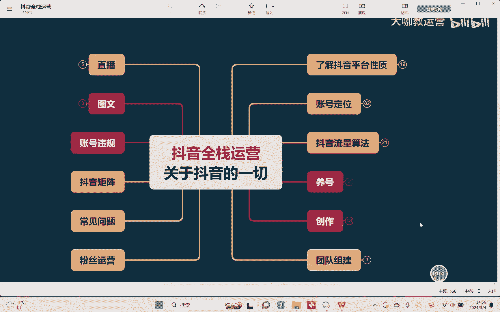
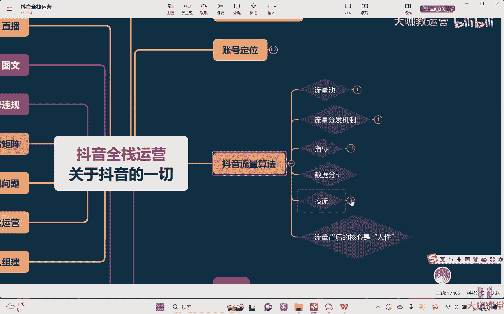
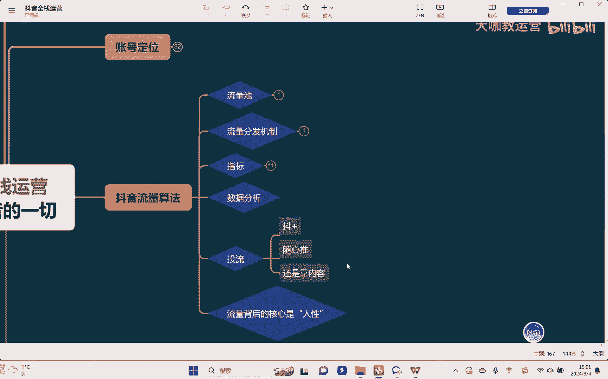
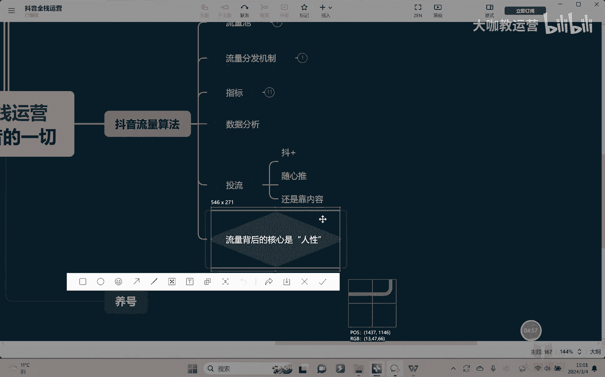
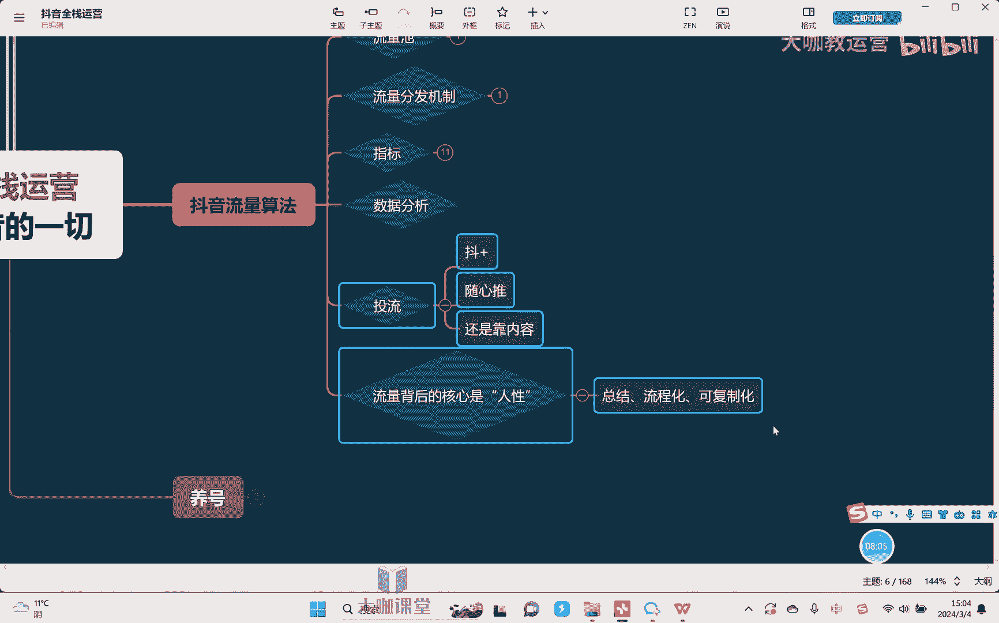

# 【2024B站最强小红书运营系统教程】吊打一切付费课!小红书蓝海市场 2024最值得做的新媒体平台 - P44：12、短视频运营：抖加投放的底层逻辑 - 大咖教运营 - BV1sn4y1X75u

哈喽大家好，欢迎回到我们的抖音全站运营课堂，那这节课的话，我们继续关于斗家做一定的相应的补充啊。

那上节课跟大家去讲了，关于斗家的一些这个使用方法对吧，以及呢如何去操作啊，包括说呢什么情况下去使用啊，然后呢如何去试用，然后如何去进行一个跟投或者追投等等啊，那么呃关于抖家这个事情呢，因为本身来讲呃。

对于新手啊，说实话用的不会很多对吧，因为呃毕竟是要花钱的一个事情，然后很多的同学会会去考虑，说这个钱投了之后呃，我们说所谓的比如说能不能回本嘛对吧，投下去怕这个钱花下去，水漂都没漂起来对吧。

所以呢其实新手，我是不建议说你们上来就去投抖家的啊，但如果说你的账号相对来讲做的流量还可以，你想要去嗯有一些突破，其实我跟大家可以说个实话，斗家这个东西大概率嗯你是要投的。

因为现在来讲抖音本身这个平台它是很卷的啊，我们怎么样怎么样去抖呢，很简单，我新视频下去举个例子，我们有一个什么功能，就是我们知道每一个斗家投出去干嘛，他需要审核对吧，有的时候我们一个视频跑出去十二十。

三十四十五十这样的播放量，然后呢呃后来看了检测了之后呢，发现好像是没有违规，我们也不知道他到底违规没有，反正系统平台没有给这样提示对吧，怎么办呢，OK投个30块钱，下去嗯，这30块钱投下去能过审。

OK那么视频就没问题，你反正就花30块钱对吧，如果30块钱投都投不出去，那不好意思，那就说白了你这个视频就不需要搞了，就可以直接重新发布，删了重八了对吧，因为你视频都过不了审，OK这是一帮。

第二就是因为我们之前一直在讲数据数据，但是大家知道一点数据是根据什么来的，数据你也要分析数据，有个前提是什么是奇数，嗯假如说同学你的视频只有什么几百的播放量，嗯嗯你告诉我去看数据有用吗，嗯嗯没有用。

数据好，可能是因为什么，因为你的运气好，数据不好，也有可能是因为运气不好，因为什么，因为你只有那么几百的播放量，没有权重，也没有一个具体的标签系统，他也不知道该把你的东西推给谁对吧。

他随便找了一群我们说，或者我跟大家可以实话实说，就是通常情况下，如果你是新号去，或者说账号本身没有什么权重，他跟你去分发在初期给你推的一些什么，两三百的播放量是什么，你可以理解为就是边缘流量嗯。

嗯嗯甚至可以叫垃圾流量，所以在这种流量里面，你想要获得好的数据，极难嗯，这个是实话实说，所以这就是为什么我们需要通过土豆加，来去看数据，因为斗家投出去之后，首先至少来讲他把你的什么，把你的基数拉大。

基数拉大之后，你才能看到，嗯真正的数据嗯，嗯一两百个人说你的视频好是没有用的，说你视频不好也不代表你的视频差，懂吗，但是10万人100万人去看你的视频啊，从这里面再去看你的数据，他才是真的数据。

所以我们在分析数据的时候，说实话各位很多同学自己本身视频的播放量，基础流量就很差，然后过来问老师，哎我的数据该怎么分析，我该怎么去调整数据，那我告诉你，你没有调整必要对吧，你只有那么一点点的数据。

你还调整什么呢对吧，这视频直接全部重新来给我重新去做就可以了，那所以这时候我们讲斗家可以用的一些，其他的方法，其实说说实话，抖家能够用的地方是很多的啊，所以如果说作为成型的这种团队公司。

我们是非常建议说每个这个视频发出去之后，投一个独家去看看对吧，然后呢，你才能去看得到，这个视频到底有没有一个概率啊，当然了，我们说了，投抖加毕竟来讲他还是一个什么，他还是一个加热的一个工具。

核心还在哪里，还在于你的内容，靠内容本身嗯嗯对吧，那内容怎么，什么样的内容叫做我们说能够有流量。

能够拿得到流量的人，各位其实就是我们讲流量的背后是什么，是核心，其实真正的是人性，就我可以告诉大家，真的抖音玩到现在，他把人性这个事情掌握的是淋漓尽致对吧。

举个很简单的例子，什么样的视频容易爆，我告诉各位反差型的嗯，什么叫反差很简单，比如说你穿着西装去种地，你就是反差，懂吗，你正常种地看的人不多，但如果你今天穿着西装，穿着礼服去种地，各位你会不会有流量。

我告诉你，至少来讲你的画面嗯就能给你带来流量嗯，嗯对吧，我再举个例子，我今天是养猪的，你告诉我养猪会有很多人看吗，不一定对吧，一养猪，你拍那个什么猪圈有人看吗，但是如果你今天告诉我一个黑丝美女。

养猪呢在当那个很脏的那种，养那个猪圈里面去养猪，去喂猪呢，各位同学，你告诉我，你会不会看，你是不是大概率会看嗯对吧，你还会去评论和互动，为什么，所以这就叫我们说反差是什么，是人性。

我们每个人在抖音上想看内容，想看到的什么，想看的倒是嗯第一想看的就是我们说，想成为的样子，所以我们的视频小报你需要什么，你需要的是高级，但是又要接地气，不信大家可以去看看，我们说所有那些就是你按照老师。

我刚刚讲的那几种方式，你去拉这样的反差，你去发两个视频去看看你能不能报，我告诉你大概率你一定是能报的，为什么，因为这个就是人性对吧，你想想你养猪会有人看吗，不会，但如果是你一个黑丝美女去养猪。

你会不会看，一定会对吧，这个就我们讲你把反差拉出来，他就很容易爆，嗯啊，然后呢嗯呃真正的话呢想把这个视频去做好，还是需要什么呢，还是需要有一个长期的经营方式，其实我们在跟大家去讲所有的内容也好。

讲所有的这种方式方法也好，他能做的什么，我们其实做的是一个东西，叫做总结嗯，流程化嗯，嗯可复制化，这个才是难的懂吗，报一两个视频不难，很简单，就像我用我刚刚讲的那种方式，你去做反差，你很容易爆对吧。

但是你想要干嘛，你想要长期去做，就需要用什么，用总结化的方式，要流程化的方式，可以复制化的方式，把它做成公式的东西，然后才能让你的账号去稳定好吧，那这是这节课，我跟大家去讲的一些这个补充性的内容。

有关于数据方面的一些补充性内容好吧，然后的话呢，下节课我们来去讲讲养号相关的一些东西。

