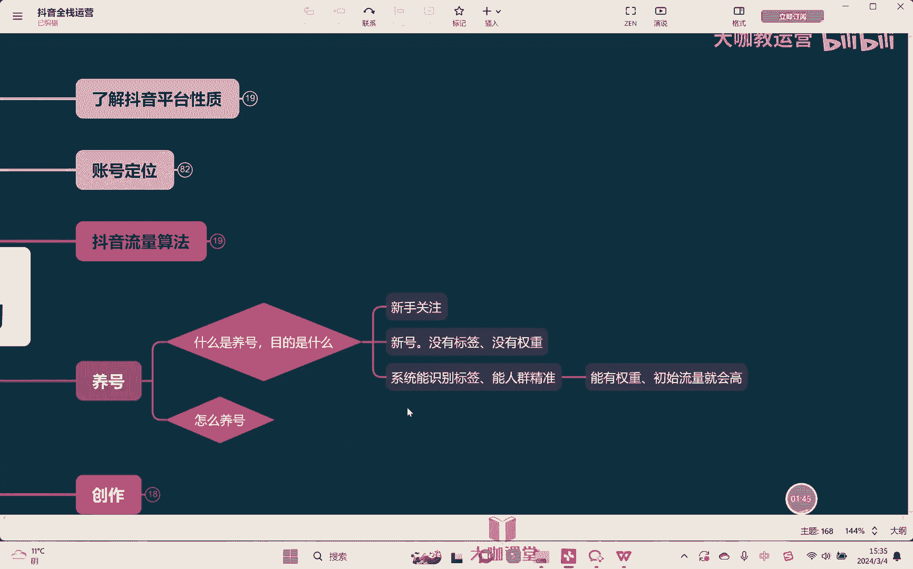

# 【2024B站最强小红书运营系统教程】吊打一切付费课!小红书蓝海市场 2024最值得做的新媒体平台 - P45：13、短视频运营：抖音的新号养号逻辑及操作 - 大咖教运营 - BV1sn4y1X75u

Hello，大家好，欢迎来到我们的抖音全站运营课堂，那这节课的话呢，我们来去学习关于养号相关的一些知识。

其实呢首先我们做养号这个事情的前提。

我们先要理解清楚到底什么是养号啊，养号的目的是什么，因为关于养号这个事情，其实在网上有很多很多的一些所谓的教程啊，包括呢各种说法是众说纷纭对吧，这也是我们大家作为什么新手小白对吧，去关注这个问题。

新手才会最关注这个问题对吧，所以这也是导致说很多人会因为这个问题呢，就是我们说所谓的被人去唬住啊，这样的一个设计好吧，那OK首先第一什么是养号，目的是什么，其实养号我们就很简单。

一个新号刚开始是什么星号嗯，是没有标签的对吧，然后呢没有权重的嗯，对不对，我们养号是希望说。

在后面我们发这个视频的时候，他能够有个嘛，呃就是系统知道系统能识别标签对吧，能人群精准，对不对，能干嘛，然后还有什么，还有就是能够有权重，初始流量就会高一些对吧。

哎就我们这是我们说养号的一个目的，对不对，OK那所以我们怎么样去养号呢，其实真正我们要去达成这个目标，我们之前在哪里讲了，个人的发视频的这个标签对吧。

我们的用户标签和我们的创作标签是两种，对不对，用户标签嗯和嗯创作标签完全是干嘛绝缘的。

嗯对吧，所以我们经常有时候会说你信号开了。

先不要发视频，先干嘛，先去看，先去刷，这个刷是干嘛，去所谓打标签对吧，但是因为我们讲了完全是绝缘的，对不对，所以这个东西没有用，那那要不要刷呢，要刷，为什么要刷，因为我们要知道平台之所以我们说要仰靠。

是因为我们不希望平台，嗯认为我们是来搞营销的，嗯懂吗，因为很简单，如果我们每个人上来都开始搞一些所谓的，这种营销的这些视频，营销的这些内容，OK那时间长了，是不是新平台就会有很多大量这样的内容。

那这样的内容其实它会非常的伤害用户者，伤害用户很简单嘛，你天天的看广告，看人家营销，你肯定会觉得哎这个平台不好算了，我不看了对吧，因为平台它需要干嘛，他需要保护用户，他要留住用户。

但是他当然又是希望干嘛，他当然又希望能够产生价值，对不对，所以平台在这个东西上他也要去做一个平衡啊。

所以我们先去刷视频，刷视频也好，去点赞，去评论，去看直播对吧，甚至去下单，我们的核心目的是干嘛，嗯为了嗯告诉平台，我们是一个正常账号，嗯平台之前我们在讲了，他鼓励什么，鼓励的是大家宣传正能量。

鼓励大家是分享自己身边真实的美好的事情，对吧，把他这样的内容输出出来，所以我们要做的事情是什么，其实就是为了告诉平台，我们是符合你的这种方向导。

明白吗，所以这个时候他给到我们第一步是干嘛，第一步就是先让平台，嗯放心嗯对吧，我不会在平台乱搞，我会干嘛，我会像一个正常的用户一样，哎我去看视频，我去刷视频，我去看直播，我去买单，对不对等等。

OK那这个时候平台慢慢就会干嘛，它就会放低审核，嗯懂吗，你一个新号上来，什么都不干，第一个事情就上来，我就开始发视频，开始打广告，那我告诉你，那平台一定说审核给你卡的死死的对吧。

更不用说什么所谓的权重了对吧，所以我们就要先去刷刷这个东西。

目的是干嘛，就是为了做这样的一些事情，那刷多长时间呢，通常情况下我们要刷个5~7天对吧。

5~7天刷完开始发视频，那发什么样的视频呢，也不能说这个时候我就可以，不是说我这个时候就可以开始哎做营销啊，做一些那种各种各样的内容，发什么呢，先想在前面，我们已经做了账号定位。

我们已经知道这个账号未来要做什么了对吧，所以这个时候我们不是说上来就就开始去营销，而是干嘛先发，你。

嗯简单的分享视频，但是发的是什么，和我们的账号定位未来同类型的实例，这个时候也是一样，核心目的还是要让干嘛，还是要让平台去放心，我们是一个正常的账号对吧，哎大家正常的去分享内容，对不对。

然后呢慢慢慢慢的这样子再去干嘛，再来去提所谓的权重，这个提权重不会说让你这个权重一下有多高，有个什么很高的基础播放量不会，而是让你干嘛有一个什么正常的播放量，同时让你的账号编标签，打什么标签。

打一个范标签，懂吗，就是我们刚开始去发的这些视频，大概率它不会有太高的流量对吧，但是这个过程当中让平台识别，我们是一个正常账号，同时的话呢哎平台也会在这个过程当中跟我们，根据我们的历史数据。

慢慢的去给我们去账号打标签，但这个标签打的是一个什么，是一个泛标签，它不会那么精准懂吗，他不会那么精准，但是这个东西是为了给我们的账号，给他这样的一个指标，嗯方向给他这样的一个方向。

然后未来我们再去发正式视频的时候，嗯平台它的系统它就会相对来讲聪明一点，他就不会毫无方向，他就会干嘛，他就会少走弯路，对不对，嗯这是我们说做养号的一些核心目的好吧。

所以呢了解清楚我们说养号的一个核心目的，然后呢我们再来去讲啊养号的方式方法，所以养号其实首先本质来讲它很简单啊，就是干嘛，就是做一些正常，我们说呃普通用户他该做的一些事情。

普通用户是我们平时自己玩自己的私人号，我们会干嘛，会正常的去刷视频，各种类型的视频我们都会去看对吧，不会说只看哪某一个两个类型的，我们什么样的类型的视频都可以看对吧，会看视频还会看直播对吧。

甚至还可以去呃买花什么做同城，对不对，各种类型的我们都会去看，然后呢去留下相应的行为痕迹，然后呢让平台放松啊，对我们的这个账号放心，对不对，然后成为一个正常的账号，不会给我们去卡。

我们的这个流量不会去卡我们的一个审核对吧，这个时候，然后慢慢的再去往这个大方向去，给我们的账号打一个泛标签，最后再开始正式创作，这是我们讲嗯啊整个养号的一个过程好吧，也是养号的一个思路。

OK那么这节课的话呢就给大家去讲到这里啊，以后呢关于养号的问题呃，大家只要把这节课听明白了以后呢。

关于所有所谓的这种养号东西。