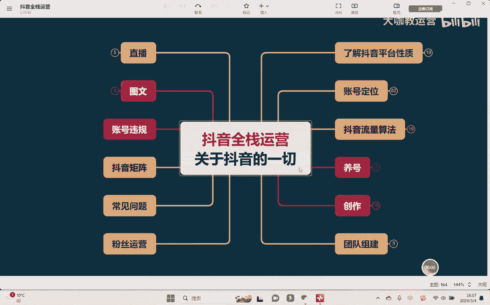
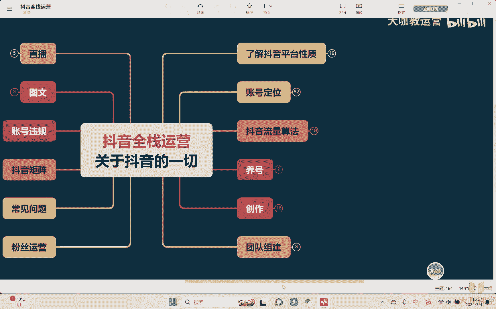
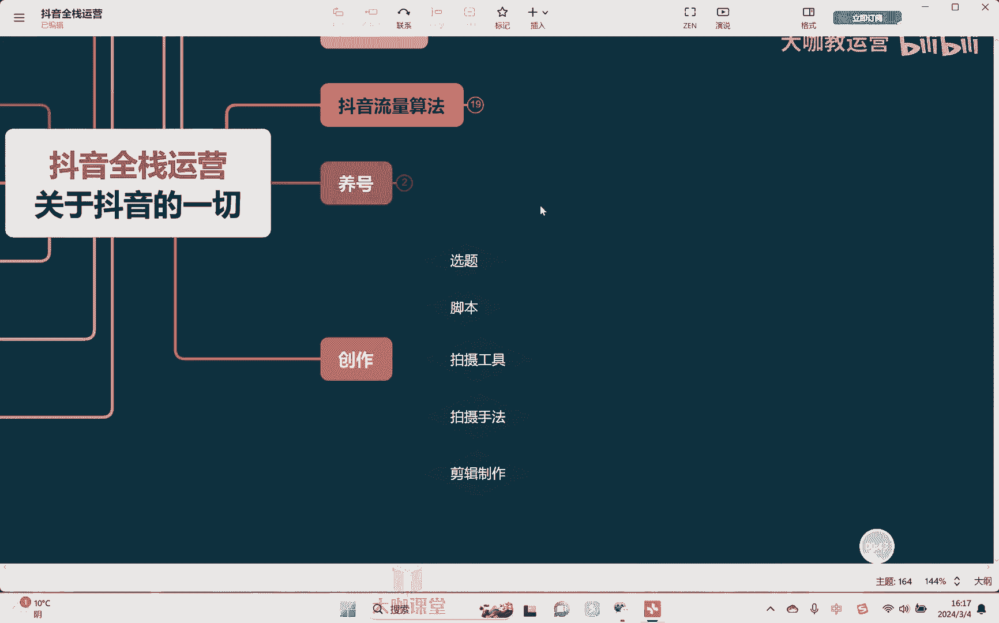
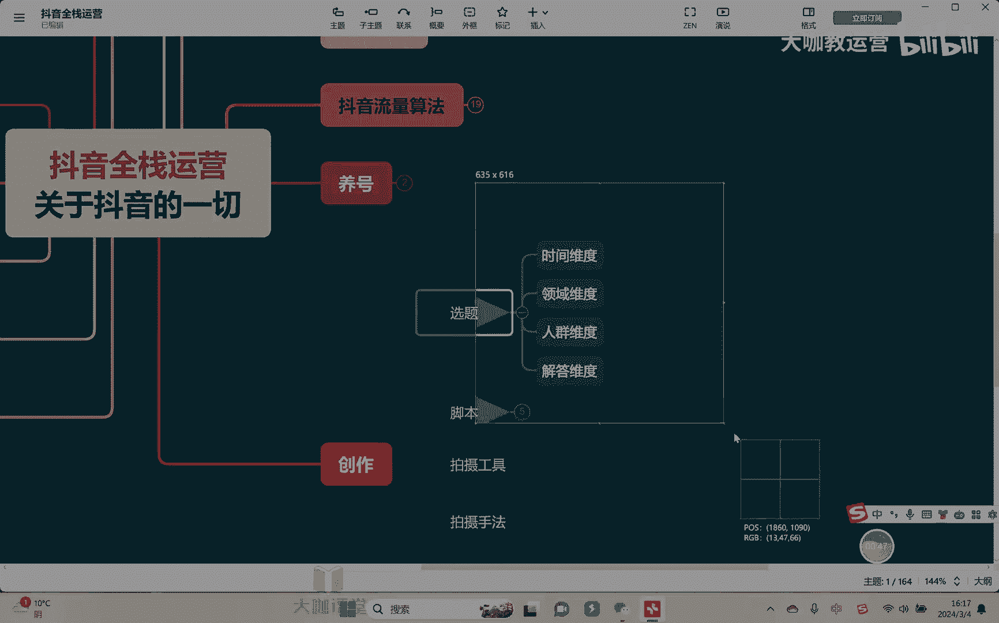
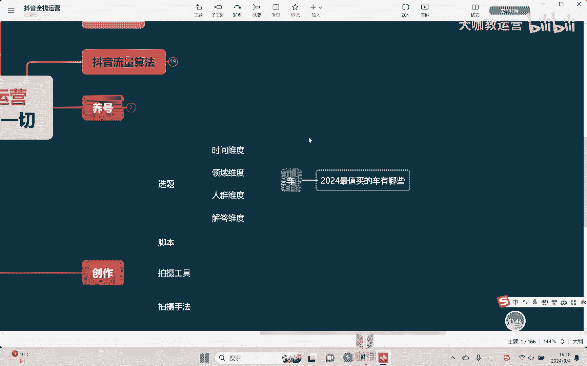
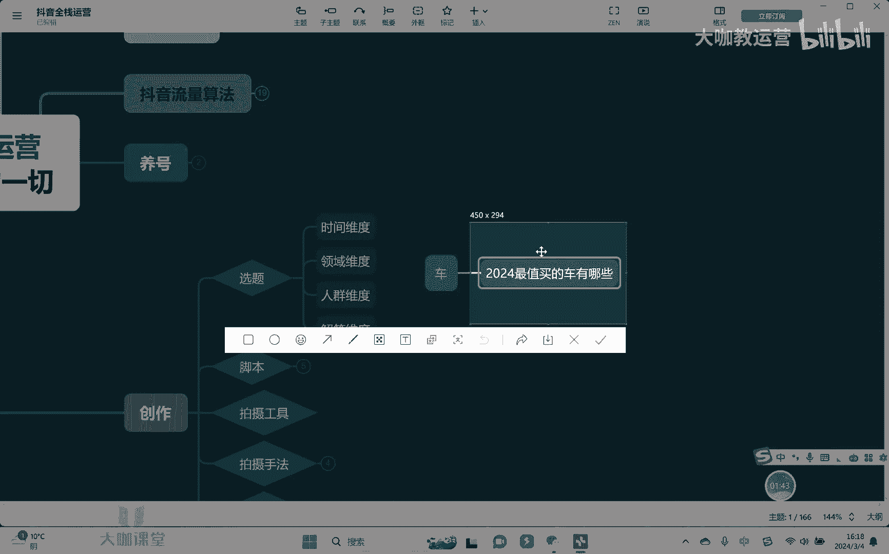
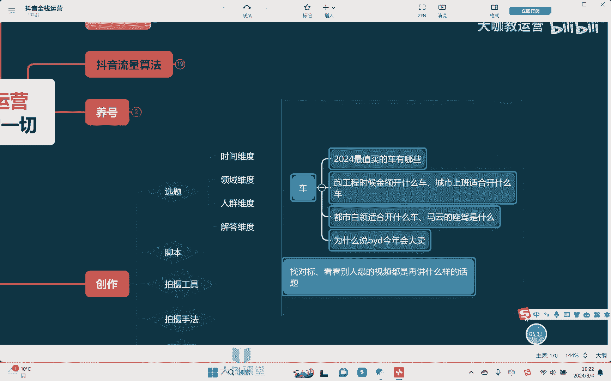
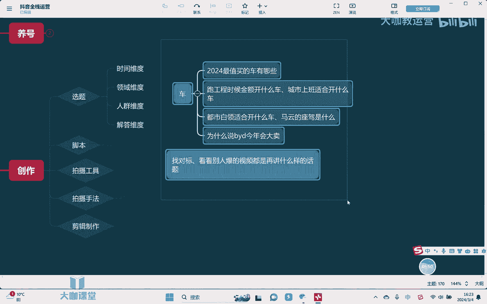

# 【2024B站最强小红书运营系统教程】吊打一切付费课!小红书蓝海市场 2024最值得做的新媒体平台 - P46：14、短视频运营：短视频选题的制作技巧 - 大咖教运营 - BV1sn4y1X75u

哈喽大家好，欢迎来到我们的抖音全站运营课堂，那么这节课开始呢，我们要去讲正式的。

就是个内容创作的相关的内容了，OK首先呢我们来到内容创作啊，按照顺序来呢，首先其实第一我们要知道我们的做的内容，如何去制定一个相关的选题，因为我们之前有讲到过这个账号定位的时候呢。

包括很多的这个呃数据分析的时候，我们有提到过呃，一个视频的内容能否获得更多的一些呃，这个认可其或者说相关的数据流量，其实从一开始的选题本身就非常的重要，当然了，我们因为做了账号定位对吧。

会有一个相对来讲啊，偏垂直的一个大的方向对吧。

那具体的选题我们该怎么做呢，来在这里的话我们可以看一下。

首先其实我们会分为四个维度，时间维度，领域维度，人群维度以及啊解答的这四个维度来去做，举个很简单的例子，嗯啊比如说呃我是做这个什么呃车方面的对吧，可能我这个账号是做，想做这个汽车方面的一些这种东西。

比如说我们是这个轿车也好，SUV也好啊，不管对吧，反正呢男性比较喜欢车嘛对吧，OK首先第一个我们可以围绕着时间维度，时间维度很简单一点，举个例子，2024年对吧，最值得买的车有哪些，嗯啧对吧。

那么这个一个选题就出来了，OK那么选题出来了，我们是接下来视频的一个重点的内容啊。

实际我们去讲解内容讲什么，其实就围绕着这个东西去讲对吧，有什么车对吧，比如说有什么比亚迪对吧，为什么比亚迪它今年的这个哪个哪个，哪个哪个车型它非常值得买，原因在哪里对吧，最后呢我们再去做一个引导啊。

打评论区留下一个互动，那么诶你你认为2024年最值得买的车，有哪些对吧，你觉得今年买比亚迪入手合不合适对吧，评论区留下，你看是不是整个视频诶，这个内容的一个框架就全部都出来了对吧。

剩下你只需要往这个里面去填充内容就可以了。

是不是非常简单对吧，OK好，第二领域维度对不对，领域维度什么，或者说或者我们可以讲地理区域啊啊，或者说哪个职业区域维度都可以，比如说嗯跑工程嗯适合开什么车，嗯或者呢嗯呃我们说什么城市嗯。

上班嗯适合开什么，这当然我现在给你们去提的，这些选题是相对粗糙的，因为我是在跟你们去讲课，我随便哎头脑一想哎我就给你提提出来了对吧，你们还可以在这个之上，你们可以再去精细化一些对吧。

那么这个概念大家要明白，其次我们讲人群为主对吧，围绕着某一部分群体举个例子，都市白领适合开什么车对吧，还有什么呢，还有我们可以围绕着老人小孩对吧，刚毕业的大学生，对不对啊，现在的话呢。

呃比如说或者再或者说什么经常出差的对吧，长总是跑长途的，跑滴滴的，他适合开什么车对吧，或者大家都在开什么车对吧，再或者我们会换个角度讲，马云的座驾是什么，对吧，这样的话唉话题的这个争议性又会更高对吧。

热度又会更高，对不对，所以这个是我们要去考核的一个点啊，当然了还有解答的维度很简单嘛，啊就是我们说问题出问题，解答问题的这样一个维度，比如说呃像这个关于车子啊，为什么嗯说比亚迪啊今年会大卖，对不对。

那么大家都会去啊思考呃，呃这个比亚迪为什么今天会大卖，大家可能就会好奇对吧，他是引发大家的一个好奇心啊，然后呢你在后面内容再去跟大家去讲解哎，比亚迪为什么为什么它的优势在哪里，他今年为什么为什么会大卖。

讲些原因，对不对啊，所以你看其实我们把选题找出来之后，OK那么往里面再去干嘛去填充相应的内容，内容填充完了，再根据我们的内容去做出相应的一个引导互动，你看，所以整个的一个视频的，整体的一个框架就出来了。

剩下我们再着手去拍就行了啊，非常的简单，对不对，所以会发现其实有的时候呃，我们找选题并没有那么难啊，更多的什么，当然了，这是我跟他去提出的一些维度啊，还可以干嘛，还可以，就是我们说的叫嗯对标嘛对吧。

看看别人报的视频嗯，都是在讲什么样嗯，嗯话题对吧，比如说嗯很简单啊，有的这个话题诶他会干嘛，他会专门有一些人群还他比较关注，那么你就可以核心你在选题的时候，你就可以多围绕着这个人群。

你去展开一些选题的选择啊，这样子的话呢会更加容易爆些，对不对，所以呢呃给大家相应的一个这样的一个公式，你照着去套就可以了。

但是如果说想再做的更好，那我们就要去多看一看别人报的那些视频，他们是怎么去做选题的，对不对，然后我们就跟着去做，OK那这样的话我们的流量大概率会更好一些，好吧好，那这节课的内容呢呃非常简单对吧。

但是呢大家一定要去多思考。

多去理解，多去看好吧。