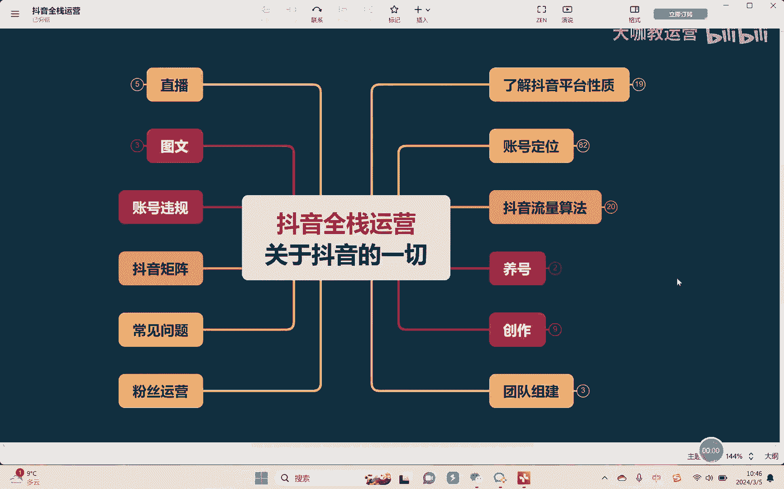
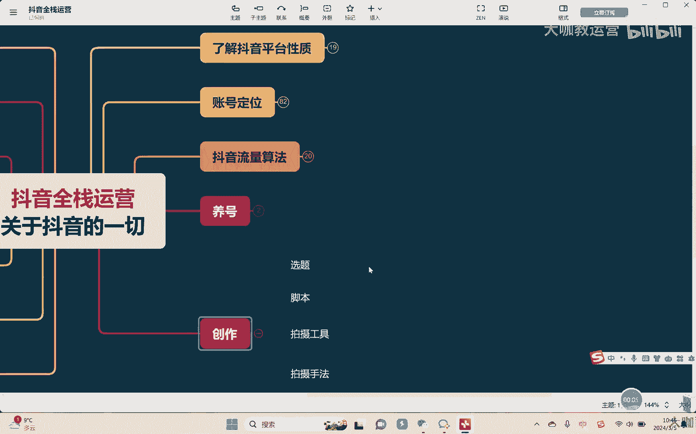
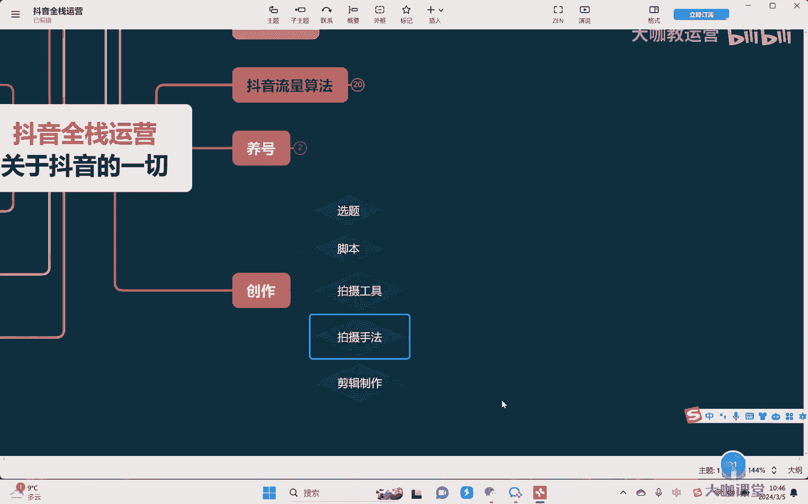
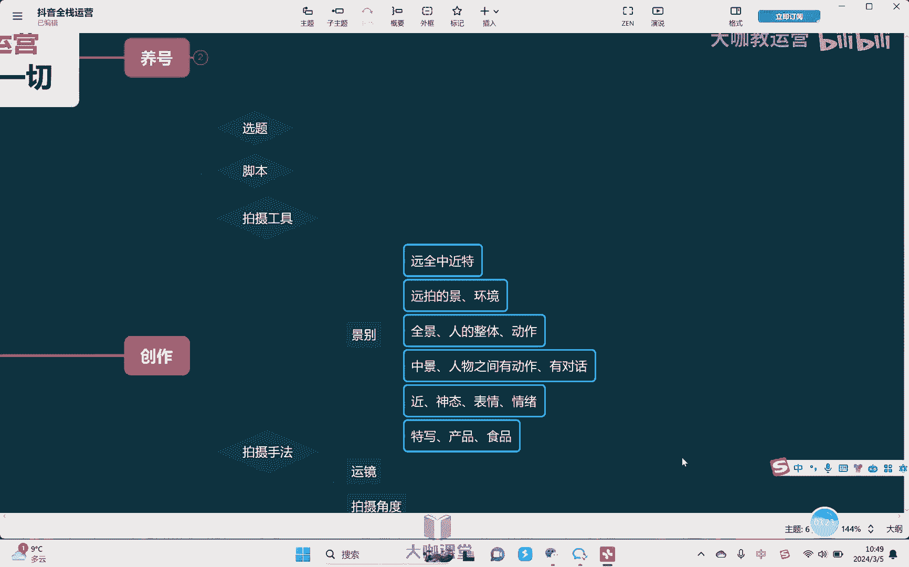
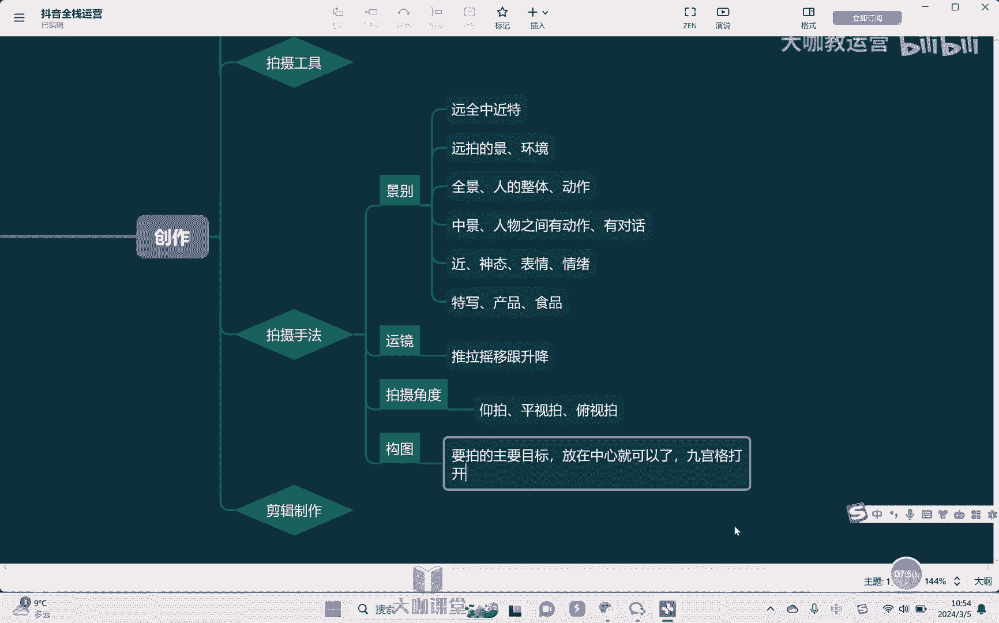
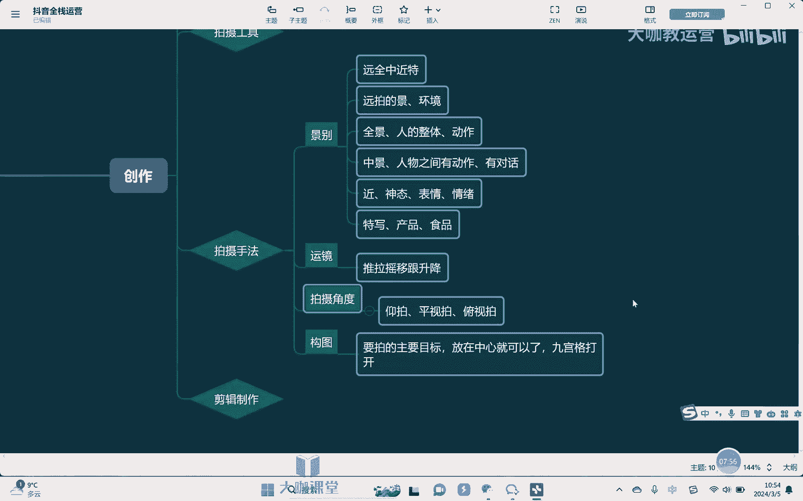
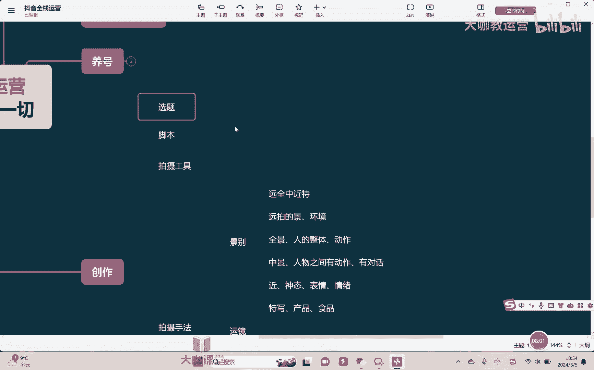
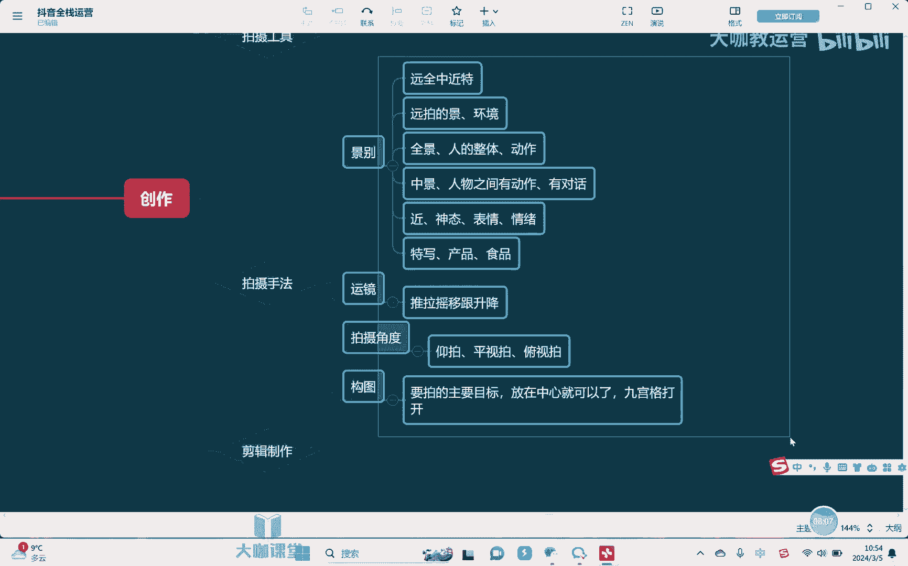
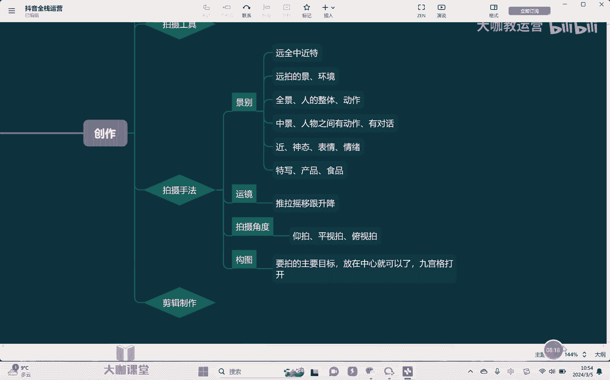

# 【2024B站最强小红书运营系统教程】吊打一切付费课!小红书蓝海市场 2024最值得做的新媒体平台 - P47：16、短视频的拍摄技巧 - 大咖教运营 - BV1sn4y1X75u

Hello，大家好，欢迎来到我们的抖音全站运营课堂，然后这节课我们继续来讲，如何去实际的创作。

我们的短视频当中的一些这个技术手法啊，比如说呢，呃上节课我们有给大家去讲到一些工具，包括一些相应的一个运用对吧，那这节课的话呢跟大家去讲一下。

简单的一些拍摄手法啊，因为我们自己本身的话呢，呃不是说以后啊非常的专业的要去拍什么电影，电视剧这些东西对吧，只是拍一些短视频，那其实的话呢呃在这个具体的拍摄手法上，还是不会的特别复杂啊，通常我们会讲。

比如说像景别啊会有印记，那景别的话呢，我们会分为远全，全中近特啊，这几个相应的镜头的景别啊，远景简单来讲就是呃，我们说人物是一个比较小的对吧，然后呢能够把人物的全身全部拍进去，那它的核心是在拍哪里。

远景的核心就大家要理解一点啊，远拍什么拍的是嗯景或者说是环境，这个时候是比较重要的啊，那全景拍的是什么呢，拍的是整个人他的一个嗯整体以及他的动作嗯，这是一个关键啊，然后呢再比如说我们拍仲景，中景的时候。

中景是指的什么呢，中景是指的人的上半部分，但是比如说膝或者说是膝盖往上的一个部分啊，这个是我们称之为中紧，但是呢不要卡着膝盖，不要卡着人的那个关节去拍，这样会拍的人比较丑啊。

那中景的话呢拍的是人的这个呃，膝盖往上的这个人的一个上半部分，那其实主要也在于呃，人的这个整体的一些肢体动作啊，比如说人物之间，有动作是吧，两个人相互之间有动作或者有对话，那这个时候我们就适合用中指啊。

再其次就是我们说近景，那近景指的就是人的整个从胸部往上的一些，这个整个的一部分，那这个时候其实突出的就是啊整个人的一些，比如说神态嗯啊，然后呢表情对吧，要要表情这些方面，情绪这些东西的时候。

我们会用到近景啊，那其次这就是我们讲到特写啊，特写其实大部分时候我们用的不多，为什么呢，因为他是呃比如说手的特写对吧，然后呢呃尤其我们在拍产品的时候，我们用特写会用的多啊啊聚焦于某一个点对吧。

把它放大啊，我们产品某些非常亮的点，尤其比如说我们拍手势，拍一些这种什么项链啊，戒指耳环对吧，或用特写把那个镜头怼到那个产品面前啊，放一个很大，让你看仔细看清晰，对不对，然后再还有比如说拍食品是吧。

他吃的这些菜的时候啊，你把那个镜头怼到那个实物的面前，而放大了去拍，他就会好看一些，知道吗，那这是我们说特写啊去用的一些方式，所以的话呢呃因为我们也没必要去学习，特别复杂的一些这种高级的一些拍摄手法。

那远程中低特这个的话呢大家做一个了解，包括说以后我们去做运营对吧，那么你至少来讲你要告诉呃，就是你知道我这个镜头拍的一个重点，然后的话呢这样子摄像好去配合你去拍啊。

那你了解清楚这些基本上我们就足够用了好吧，再其次我们讲远呃，这个运镜运镜我们的手法叫做什么推拉摇移嗯，根升降嗯啊所谓推拉摇移跟升降，比如说简单理解推镜头对吧，就是拍的那个东西不动，比如说我拍个杯子。

杯子不动，OK我的镜头我拍摄的镜头往后往前推，这就推是吧，往后拉就是拉摇是什么，左右摇晃啊，左右摇晃镜头是左右摇晃的，这样子去做，比如说转场对不对，一个人在跟另外一个人对话，那么比如说举个例子。

我先拍A是吧，这个人在讲话，我拍A拍完A之后，B开始接话，哎我把镜头摇到B那里去，不拍A了，镜头里面没有A了对吧，只有B然后B在讲话，这样子呢去做，相当于是呢把整个的一个感觉哎，拉的像偏偏上一些。

这个我们说呃令人好奇的这样的一个感觉啊，然后再讲我们讲移镜头啊，比如说人物他在走的时候，但是他是你拍的是啥，拍的是它的侧面，他在走，然后你跟着他的这个脚步一启动，这就叫隐形镜头。

跟镜头呢就是我们在这个人物的后身后啊，跟着它去进行一个移动，它动我不动，它不动，我们不动，这种就跟进动，升的和降其实也很好理解对吧，往上升清头向上啊，慢慢的去这个匀速的上升和匀速的下降。

就是我们说推拉摇移跟升降啊，那这个具体的话呢，其实我们也不需要说了解的很细，了解这些基本的运气手法啊，然后呢结合我们自己去拍的内容，你去一一匹配就可以了，其实这个东西真的是不，并没有什么复杂的东西啊。

所以我觉得没有必要，不要在这里去跟大家去深讲啊，讲的太深了，反而大家可能去心迷惑了，也不是很懂啊，没有必要，那其次还有我们讲拍摄的角度，那拍摄的角度一般就是什么仰拍，平拍，平视拍和俯视去拍啊。

仰拍简而言之，拍的东西在上面，我们的镜头在下面，从下往上这样去拍啊，这样会显得什么呢，显得我们拍的那个东西啊，他的比较高大啊，比如说我们要去拍领导啊，显示出他很有威严，很有这个权威性。

那我们就会从下往上哎，这样倾斜一点，这种角度去拍，再其次我们拍一些这种很宏大的建筑物啊，想提示这个，比如说这个我们的呃，想拍出他这种宏伟建筑的这种宏大的感觉，从下往上去仰拍，你就会有这样的一种感觉。

那平视拍的话呢，这个没有什么复杂的，就正常的啊，我们就是平视的啊，然后的话呢呃两个镜头和拍的这个东西，是相互之间我们是平着的，那俯拍从上往下拍，从上往下拍，这个一般是被拍的那个人，比如说我们拍小孩啊。

或者拍宠物会从上往下拍，为什么这样会显得他比较的娇弱可爱啊，再比如说我们拍有时候女生比较娇滴滴的啊，这种害羞的这种一些镜头时候，你就是从上往下斜一点的角度去看，哎就会体现出这样的感觉，好吧。

那这是我们说简单一些拍摄手法，大家简单的了解啊，然后呢后面以后再去拍视频的时候，往上面去对去靠就可以了，那至于说在构图啊这一块，其实我们日常拍短视频，说实话我们拍的东西要么就拍人，要么就拍产品，对吧啊。

要么就再或者说就拍一些风景啊，那么构图这块就会比较简单，简而言之，其实大部分情况下我们只需要干嘛，要拍的主要目标，你就把它放在中心嗯就可以了，把它聚焦在中心，其实大部分情况下我们就足够了。

然后你注意一下这个拍摄角度就行了啊，然后呢再其次如果说你要涉及到，比如说拍风景对吧，那么我建议大家是把那个手机的九宫格嗯，打开九宫格打开之后，它就不会有这个线嘛对吧，井字条的这个线。

OK然后呢根据这个线条一个一个去对比啊，或者说呢在四个这个角上，这样子去对一些我们要拍的一个主要事物，就可以了好吧，那么关于这个拍摄的一些呃这个手法啊。

以及运镜以及啊景别用的一些方法。

我在这节课就给大家讲呃，这个大家就已经去讲了，讲完了之后呢，大家可以去对照对吧，尝试着去分析一下其他视频。

就因为我们在上节课已经讲过这个脚本，那可以呢去发一些其他的一些视频。

把人家的这个镜头对吧，对照就是请别运镜拍摄角度去给他拔下来啊，这样子的话呢稍微的一个运用，你就会更加的熟练好吧，那么这节课我们就讲到这里。

