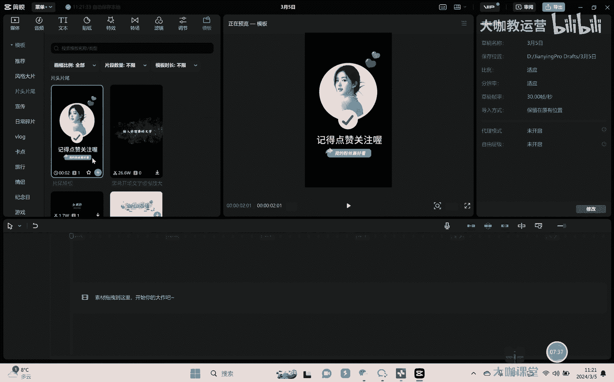

# 【2024B站最强小红书运营系统教程】吊打一切付费课!小红书蓝海市场 2024最值得做的新媒体平台 - P48：17、短视频剪辑的基本操作 - 大咖教运营 - BV1sn4y1X75u

Hello，大家好啊，欢迎来到我们的抖音全站运营课堂，那这节课的话呢，我们来去讲一下关于这个P呃，视频我们制作啊这个拍摄完成之后，相应的一些剪辑的基本操作，那呃其实日常情况下呢。

我们的剪辑基本上用剪映就可以搞定了啊，当然更专业的我们也知道有什么pr对吧，但是pr首先呢第一他操作起来更加的复杂啊，而且的话呢，呃对于这个电脑的配置要求也相对比较高啊，新手我们当时去做的时候呢。

确实没有什么必要，而且说实话本身是做抖音这个东西对吧，呃呃基本上简易呢其实它现在功能也很全面，完全足以搞定我们大部分的一些这个操作了啊，OK那么这节课也是简单的给大家去讲一下，剪映的一些基础操作啊。

因为也是为了帮助我们一些这个新手小白啊，起码能够让你去完成一个，相对比较完整的一些作品对吧，呃简易的话呢就大家自己在这个网站上，官网去下载就可以了好吧，然后的话呢我这边跟大家去演示是电脑版的啊。

首先的话呢我们打开解这个剪映之后。

直接在这里可以点入导入啊，导入我们的视频素材啊，比如说呢举个例子，我随便在这里去导入一个视频素材啊，然后呢素材进来之后，OK我们在这里会有一个预览区，就可以看到这个视频是怎样的一个素材对吧。

然后呢在这里点击加号，或者把它拖拖到下面这个轨道上啊。

可以把这个视频素材就拖上来，拖下来之后我们可以做哪些操作呢，首先V1，比如说像我这个视频，我们可以简单的看一下，那它是分为了几段风景对吧，然后呢组合在一起的，对不对，那么这个视频的话呢。

我就可以把它给剪辑成好几段，比如说我拉动时间线嗯对吧，拉然后我看上面的这个预览区域，我看一下它从哪里开始切换了啊，在这里切换了对吧，然后呢我就在这里可以去分割，点，完分割之后。

OK那么这就成为了两条视频，看到没有啊，它就成为了两条视频，然后呢我还可以把它再去进行一个呃多次分割，比如说呢我可以在这个地方再去分割，因为它本身是四段嘛对吧，我重新把它捡回成四段嗯对吧。

好重新把它切成四瓣啊，自己的话呢慢慢的去找一下这个点对吧，然后呢这个时候检测四段之后，我就可以把它重新去进行一个排列组合对吧，哎我把它重新进行一个排列组合，对不对嗯，好那么这样子啊。

我们视频你看它整个的一个排序就不一样了，对吧，然后呢日常剪辑的话呢，包括说我如果说想要拉动这个，比如说呢像这个视频啊，前面的一部分我可能不想要对吧，OK那么我先找到一个啊，到这里结束。

那么我就拉住前面这条均线对吧，把他拉过来，OK那么前面这一节就没有了对吧，我们把这个这时间线拉到前面去，哎会发现哦前面那一节就给减掉对吧好，那么除此以外，通常情况下我们光有画面不够。

我们要干嘛改了配音乐，那在这里的话会有一个音频啊，然后呢，呃这个里面会有很多一些全网比较热门的音乐，我们平时在自己去配音乐的时候呢，也可以配一些，相对来讲呃平台它现在比较热门的音乐，开热门嘛。

就说明这里的音乐本身人喜欢的人比较多，对不对啊，我们就可以把它加上去啊，比如说我在这边可以随便加一个，而你却你看小狗在叫好，那这个音乐我自己把它加上去，你看小狗在家树叶会笑，风声在呢喃，OK好。

那么音乐加上去之后，我们光有音乐，我还希望干嘛有字幕，因为我可以跟大家去讲一下，就是我们在正常平台上面去发视频啊，所有的视频只要你是有文字，我建议大家一定要把字幕配上，为什么。

因为我们也不知道看视频的人，他是在怎样的环境上对吧，他可能在地铁上，可能在公交上，可能坐在路上，对不对啊，然后的话呢有时候有的东西听不清或者怎么样，甚至于我们说很多大学生一边上课的时候。

一边去看这个手机，对不对，一边开会的时候一边看你的手机怎么办，我不能放音乐，我只能去看字幕对吧，所以字幕很重要啊，一定是要有的，一定是要有，OK我们正常是在这里去添加文字啊。

比如说呢我在这里随便去打123嗯，456对吧，OK那么就可以看到文字在这里，对不对好，那么文字的话呢，你要让它出现在哪一节，你就拉动它啊，那么全程他都会有对吧，可以看好，那我们如果说比如说我加了音乐。

或者加了一段的这个声音进去，我也可以干嘛呢，可以让他在这里有智能字幕，比如说识别字幕，让它自动去识别啊，整个这个视频当中，或者音乐当中出现的相应字母，它自己会去配，当然了这个识别的过程当中呢。

肯定不会说百分之百那么准确，它会有一定的偏差。

你可以自己去在上面去做一些调整和修改，然后除此以外，额我这个是智能字幕去识别啊，然后这里的话呢还有识别歌词啊，然后的话呢如果说我们是放的音乐，一般情况下自己配的音乐，它会识别歌词。

会比识别智能字幕会相对来讲更加准确一点。

但如果说啊我们是一些这个。

比如说我在视频里面去讲话，然后的话呢呃我们自己去讲的话，去配的音，那么你又识别了这个智能字幕会更好点。

OK你看小狗在谁家，树叶会笑，风声在呢喃，对吧，然后这样的话字幕就可以加上去了，然后呢在这边点击字幕，然后在右上角这边是这个参数调节区。

你可以给他去换一些啊，这个比如说它的一些样式，你都可以去做一些调整啊，然后呢再其次就是我们讲关于转场，因为的话你可以看到我们这个视频分为好几段，几段视频，你看镜头和镜头之间切换的时候，它比较生硬。

那这个时候呢我们在中间就可以干嘛，给他去增加一个转场，在这里点击转场，然后这边会出现很多的一些转场的一些效果啊，我们自己可以去调整呃，比如说举个例子，我随便去呃，加一个，OK我在这里去加一个嗯对吧。

加了之后，你可以看到他就直接在这里出现了对吧，然后我们拉动这个可以去调整它的这个时长啊，比如说在这里我调了一个，然后我们再为难不对吧，这样的话呢它中间会有个过渡，然后的话这个转场的效果会更好一点对吧。

再除此以外，我们对于视频的话呢，还可以去加上一些滤镜对吧，那加滤镜的话呢，就根据你拍的东西啊啊拍风景你就调整一些，比如说在这里会有风景相关的一些滤镜对吧，美食相关的你就可以挑一些这种偏暖色调的，对不对。

然后呢拍人的哎，你可以找人像相关的一些这种滤镜，去给他加上去啊，比如说呃我这边是风景的嗯，哎我给它加上去哎，它的这个颜色就会有些不一样，小狗在叫树也会笑啊，小狗在可以看到颜色就会有些调整，对不对啊。

那这些东西的话，我们自己可以去呃去进行一些运用啊，更多的一些操作的话呢，就大家下去慢慢的去摸索，那这还有比较好用的是什么，比如说像这个模板啊，那么模板的话呢。

是我们平时用的会比较多的一个东西啊，比如说举个例子，我们视频呃，像有的时候我们拍一些这种片头片尾，尤其是啊举个例子，我们经常会记得点赞关注哦对吧，点赞关注点赞关注记得点赞关注哦，嗯OK把他拉下来。

拉下来之后可以看到，在这里会有什么素材替换替换，比如说举个例子，我在这边随便画一张额这个图片，OK就可以看到中心的这个圈可以看到没有。

就换掉了，对吧啊，那这个样子的话呢就会做起来会更加简单，那这是片头啊，这是片尾，我们还可以去调整一些这种片头啊，啊那这些的话呢都可以大家去试用，像包括说我们日常拍一些这种，比如说宣传对吧，VLOG啊。

或者说一些这种美食类型的这种视频的时候，他都会有一些这种模板啊，我们可以去用yeah straight啊，然后的话呢更多的模板呢其他模板是很多的，但是更多的需要用哪个，就需要看我们自己呃。

自己去挑选好吧，那么这是我们说简易的一些，基本的一些操作功能啊，然后再话呢还有我们讲，比如说在这里可以去调整音频啊，音量的一些大小对吧，然后呢呃最后视频我们拍完之后，在这里要记得做一个导出啊。

比如说呢在这里点P1导出，然后这里是保存到哪个文件夹对吧，保存完之后呢，分辨率这里啊它是4K，但是我给大家去介入，就我之前也跟他去说过对吧，我们因为目前抖音平台，它能够给你去达到你的画质就是1080P。

所以呢其实我们是没有必要去，非要搞一个4K的那1080P就足够了啊，然后呢这样你正常去导出。

导出完了之后啊，格式的话呢，一般我们就是这个mp3M4啊就可以了好吧，然后记得导出导出完了之后呢，视频你相当于可以把它保存下来，再进行一个啊这个发布，那么关于这个剪辑相关的一些基础操作。

我这节课就给大家去讲到这里，好吧啊，基本上来讲啊，能够让大家去完成一个呃相对完整的短视频啊，就可以了，然后的话呢更多的一些相对高级一点，复杂的操作，我就不在这里去过多讲了啊。

因为的话呢我们本身用到的也不多好吧，再其次呢很多同学这个本身你就是新手，对不对，刚开始呢也没必要去学习那么复杂一两节课，而且我也想不明白好吧，但如果说有大家需要一些几个剪辑相关的，这种呃资料的。

那么的话呢可以在这个咱们视频下方留言，然后我这边的话呢可以给你去发好吧。

