# 【2024B站最强小红书运营系统教程】吊打一切付费课!小红书蓝海市场 2024最值得做的新媒体平台 - P49：18、短视频制作团队配置 - 大咖教运营 - BV1sn4y1X75u

Hello，大家好啊，欢迎来到咱们的抖音全站运营课堂，那在之前的话呢我们已经学完了，关于转个短视频如何去做定位，然后如何去做具体的拍摄制作内容。

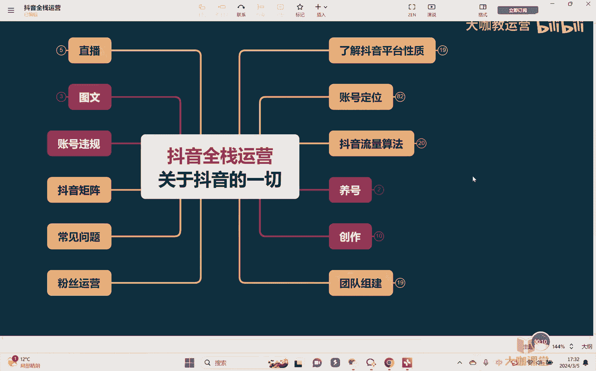

那接下来的话呢我们去聊一聊，就是呃如果说你要去搭建团队啊，或者说呢，呃后期我们可能对于自己的一些这个，职业规划啊，有一些这个呃呃想要去往新媒体这个行业，或者说往抖音这个行业去做的。

那么我们可以做哪样的一些这个岗位，然后呢又需要做哪些的一些职责。

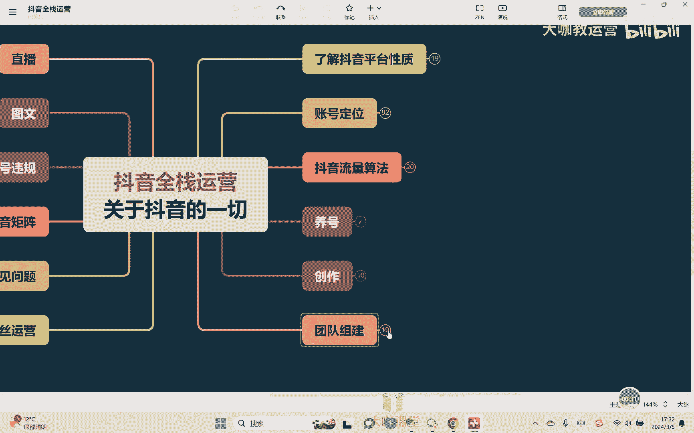

以及需要具备哪些能力，是我们可以看一下嗯。

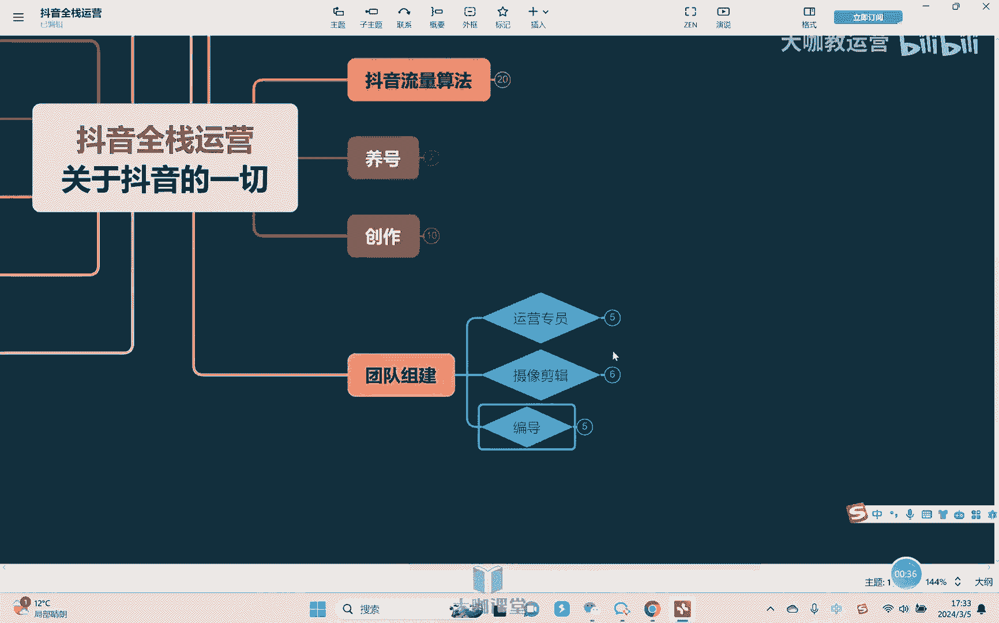

首先在这里，其实这个行业呢关于短视频团队，我们一般主要是会分为三个方面的一些岗位啊，运营专员呃，摄像剪辑以及编导。

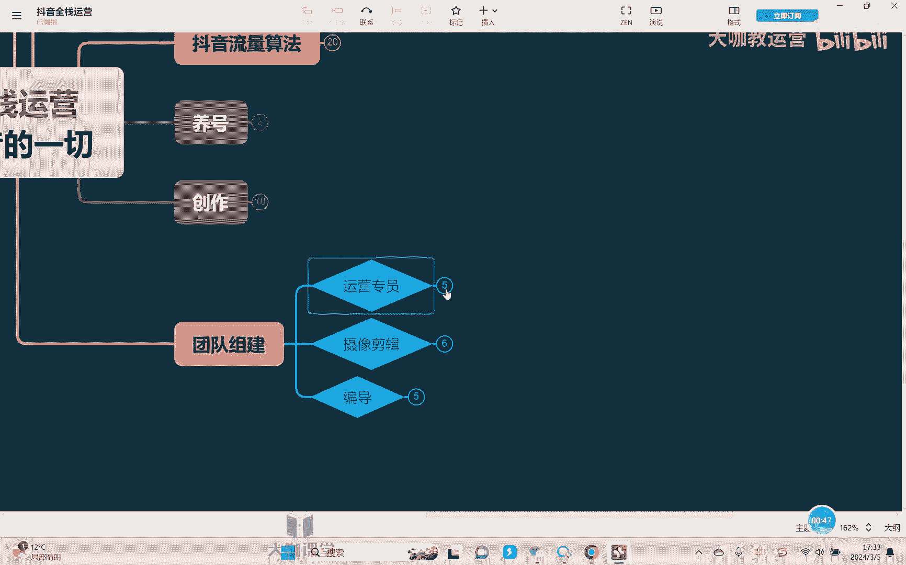

那运营专员呢其实就是我们说呃，平时主要对于账号本身去负责的一个。

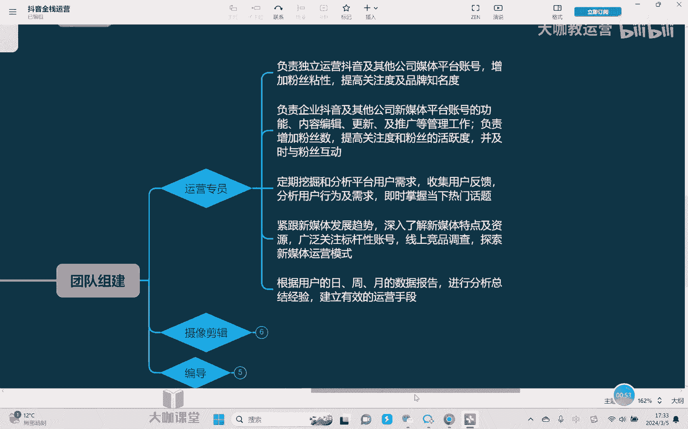

工作人员对吧，那么他要去负责，该怎么样去呃，做相应的内容，该怎么去更新对吧，如何去推广相应的视频，然后呢去了解我的粉丝啊，了解他们的一个相关数据，然后呃去做相应的这个找内容的一些方向啊，再急啊。

我需要去呃了解当下比如说有哪些热点啊，整个新媒体这个行业，或者说平台他未来的一些发展方向，要去做一些了解啊。

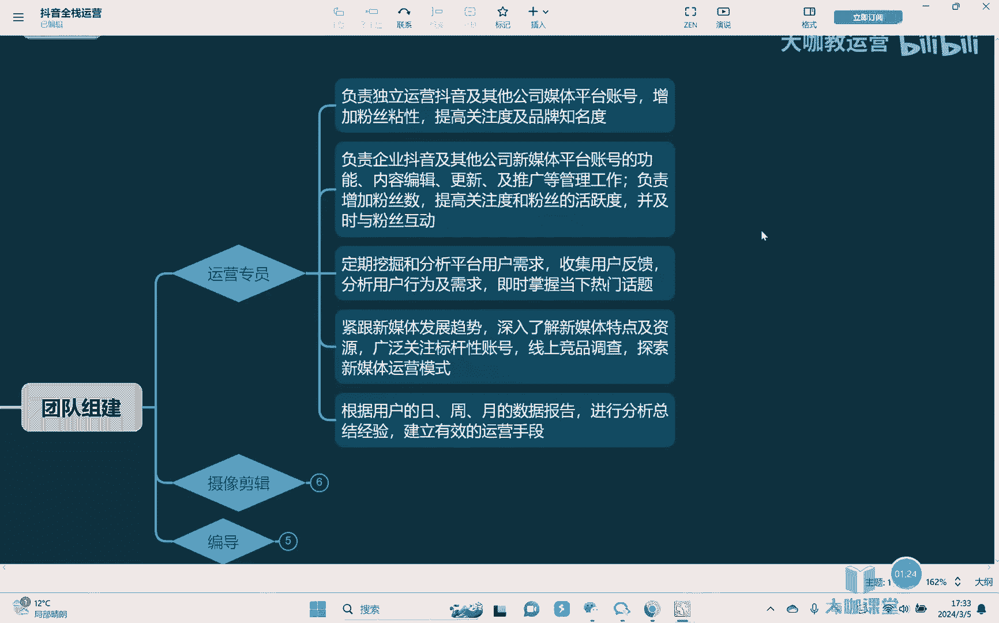

当然了，在这个里面你可能还会涉及到，比如说嗯抖电嗯对吧。

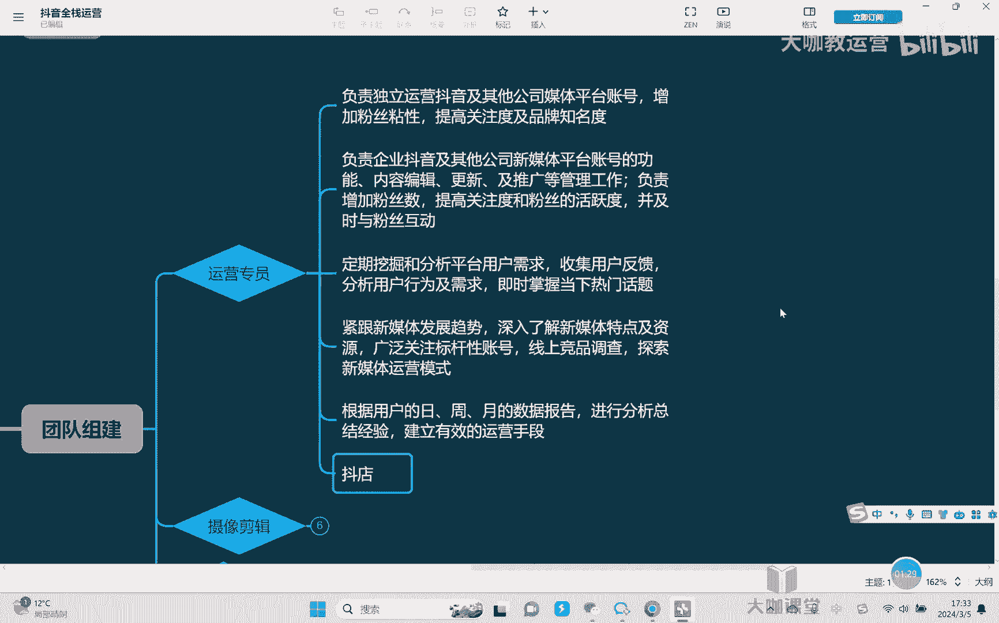

那你就要了解抖店相应的一些政策，整体的一个额操作基础的一些玩法。

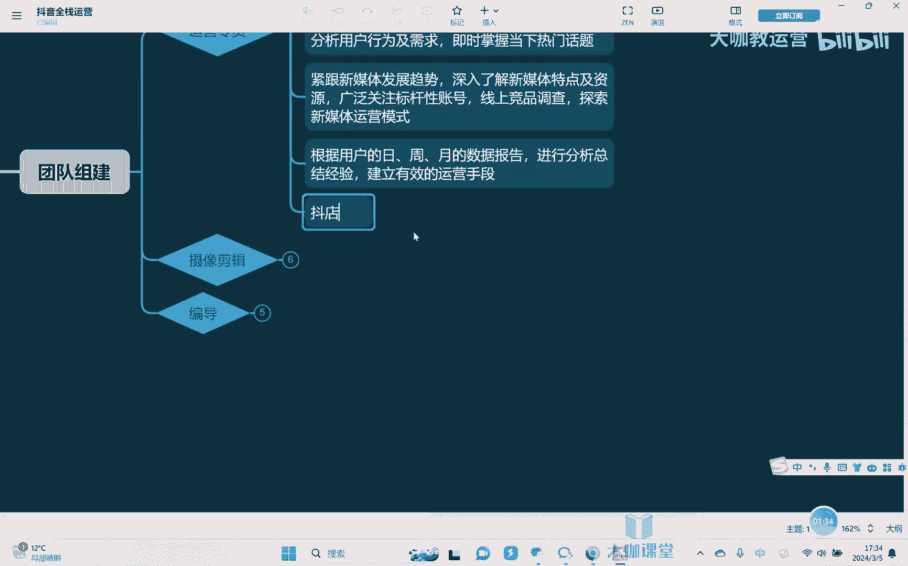

这些东西你是要去具备的，对不对，再其次呢我们可能还会涉及到抖夹啊，斗加了一些这个投放。

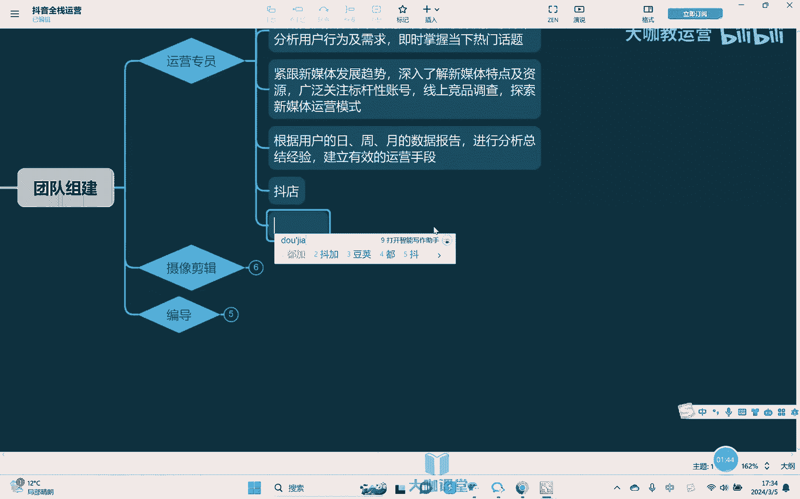

嗯对吧啊，包括说有的同学可能未来会去找工作，那么面试的时候，这些东西你都需要去做一些这个了解啊，把这些东西跟人家面试人去要去聊一下，OK那么这样子的话呢，呃人家才会说呃这个对于我们的这个工作。

或者说我们未来去掌握的一些技能，我们可以往这个方向去是吧。

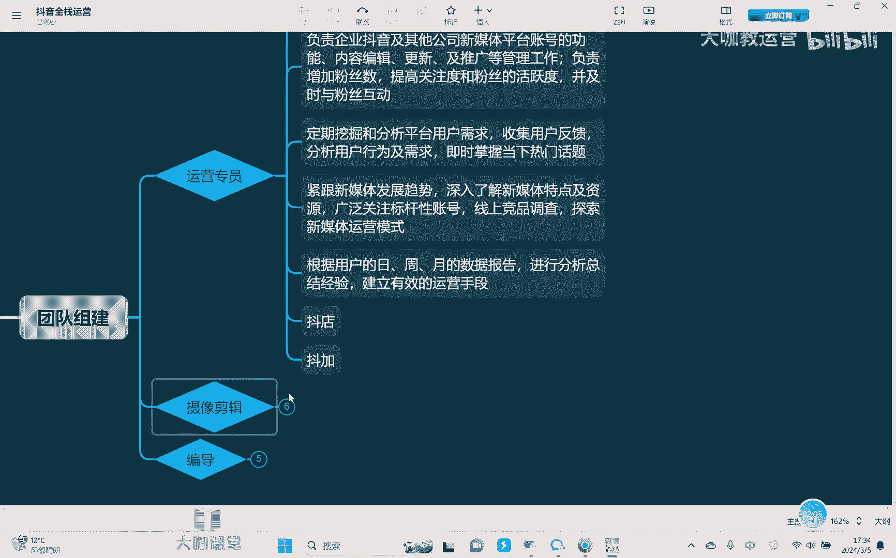

那再其次就是我们说会分为这个摄像剪辑，那当然有的公司他的这个团队本身来讲人数啊，呃他相对比较充裕，他可能会把这个摄像是摄像啊，剪辑师剪辑去分开对吧，摄像呢也不用这个呃去做什么剪辑的活。

但是呢大部分情况下，我们如果说作为小团队，其实很多时候我们摄像和剪辑啊是混着干的啊，混着干的嗯，那么其实这两个岗位也相对来讲是比较单纯的，对吧，你摄像就是配合你的团队。

然后该完成相应的这个摄像达到的一个效果。

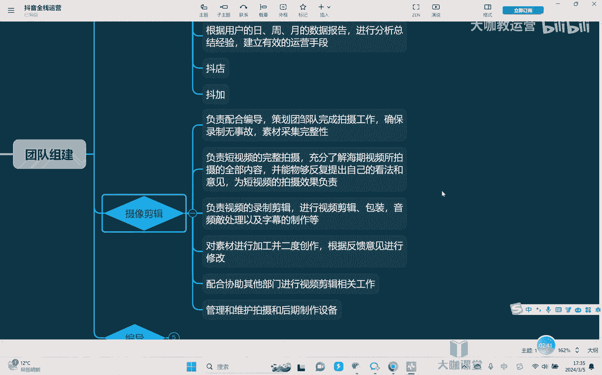

然后会剪辑的话呢，就后期对于这个视频进行一些相应的这个加，工的一个剪辑处理对吧。

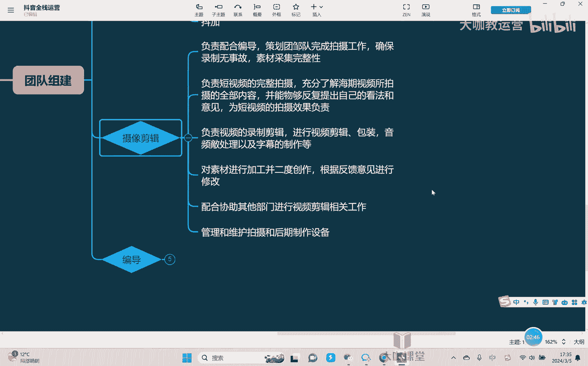

然后再一个就是相应的一些设备啊，你要去做一些这个保管，那这两块的话呢其实没有什么嗯这个太多的啊，当然了，如果说是摄像和剪辑。

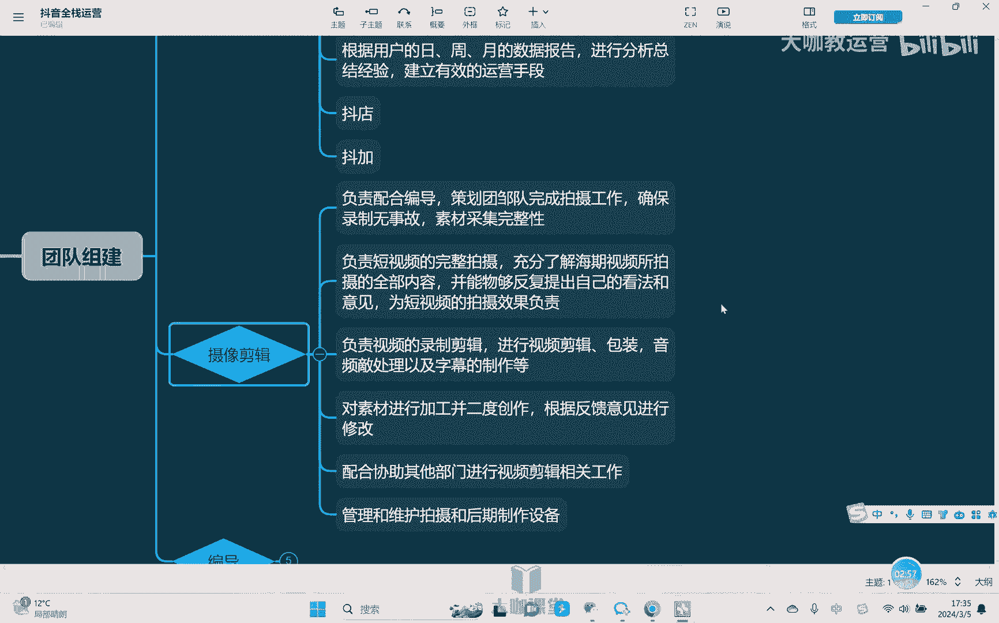

你要去进行面试的话，你肯定要是带上一些相应的作品，然后的话呢才能去呃给人去看对吧。

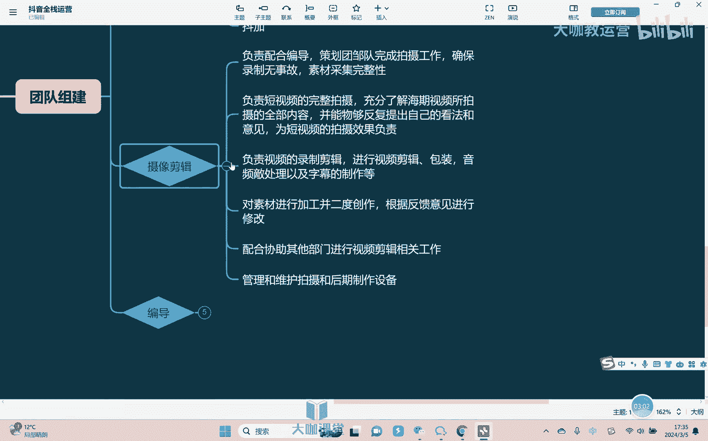

再其次啊，这是我们讲比较重要的这个岗位，也就是编导了。

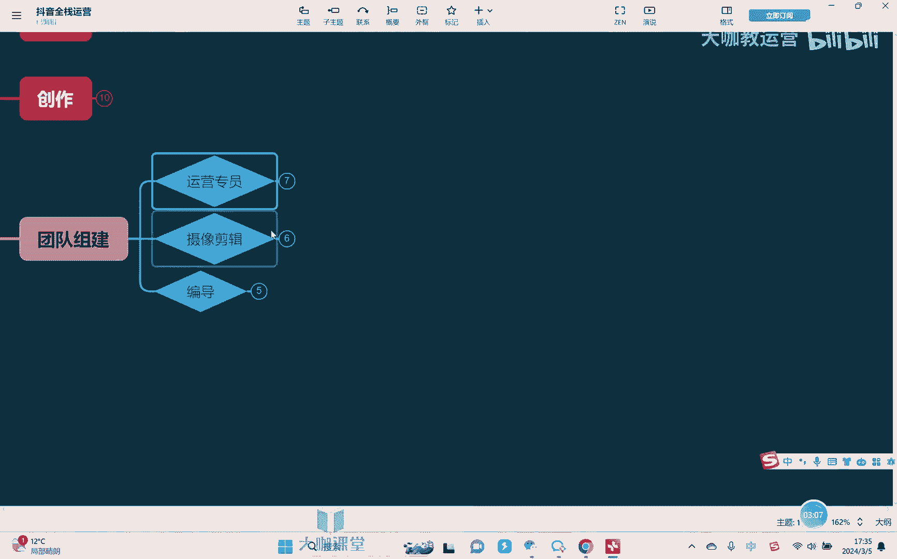

呃编导的话呢，其实他更像是一个呃leader管理者啊，总运营嗯，总意义，那同时的话呢他跟他又像是一个什么呢，又像是一个导演啊，所以话如果我们要去出视频或者账号底，人体的一个定位的方向。

全部是由编导来去负责对吧，那所以包括说脚本的撰写啊，然后去写剧本，然后再去写脚本这个东西，那就需要编导你去做这个事情，对不对，那当然了呃你说编导要不要懂拍摄，要不要懂剪辑，要不要懂这些呃所谓的一些东西。

我可以告诉大家，一定是要懂的，那你不需要说很专业，像摄像剪辑那样子，你能够去专业的做这活，因为这个活它本身不需要你干，但是你一定要懂对吧，包括是现场有些这种灯光的一些指导指挥，对不对啊。

然后呢要达成怎样的效果，你能够把它有效地传输给下面干活的人，这样子的话呢，最终哎你们这个效果才能够达到，你想要的一个东西，对不对啊，所以我们讲要扛责任，要背锅的人是谁，就是编导啊，如果说呃比如说很简单。

管这个下面的人拍视频，拍出来的效果不好对吧，那你就必须要去及时的去做出调整，对不对，否则的话最终出来这个结果不好，我告诉你，那一定不是摄像的问题，那一定是你编导的问题，对不对。

再其次因为你要对于整个账号负责对吧，所以你要出什么，你要出灵感，要出灵感，你就要不停的去干嘛，嗯不能光靠自己想，肯定是要去刷大量的视频，刷大量的热点，然后再去抓连感，所以呢呃虽然我们讲有时候。

比如说举个很简单的例子，在这个抖音上面不停的刷视频啊，这可听就是感觉好像还是挺好玩的一个事情，对吧，但其实如果说大家去做过，就会发现这个事情还挺啊，挺磨人的，真的很磨人啊，和这个。

所以需要你有这个方面的一些兴趣，然后能够耐得住寂寞去做这样的一些事情啊，然后呢这个事情才能做好，再其次就是你要有数据，因为越往后去做编导的一个能力，就不再仅限于我们说内容上了，不仅仅是在内容本身上。

还要往什么，还要去做数据嗯，对吧啊，你要根据数据去判断我自己的内容，哪方面是好的，哪方面是不好的对吧，然后你要不停的去找对标，找别人的这些东西，然后呢去分析人家的作品哪里好，哪里不好。

然后能不能够去学习，去模仿以及做更迭，对吧啊，而且呢根据这些东西你还要干嘛，就是我们讲抖加投放嗯对吧，还有这样的一些东西，嗯啊当然根据就是比如说呃如果你要卖货。

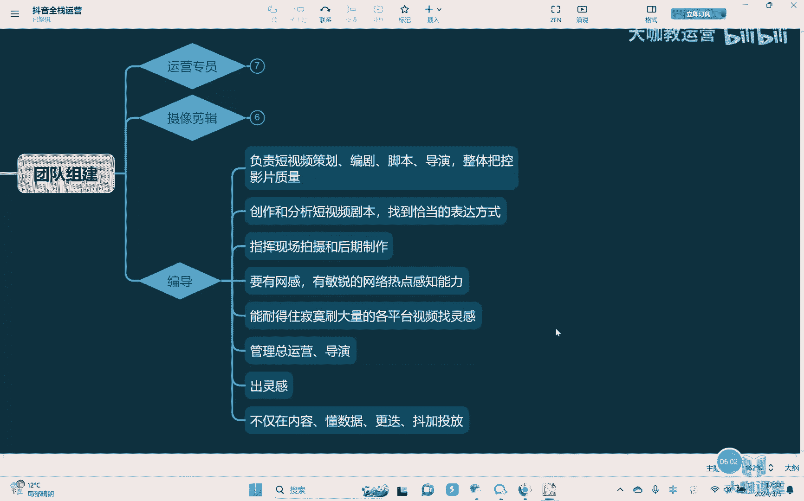

举个例子或者接了相应的广告，那这种东西不需要你去对接对吧。

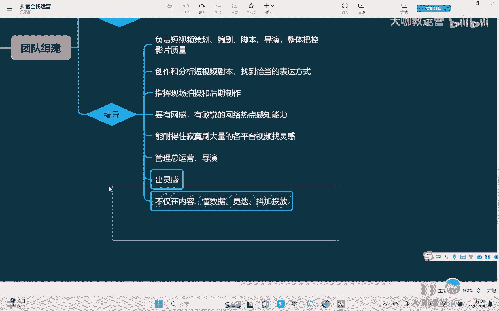

是由谁去对接，有时候我们会有什么选品经理啊，会有这种运营专研。

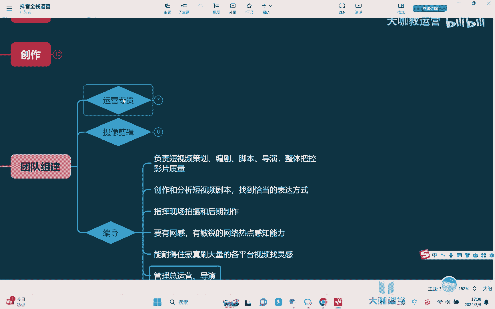

他去对接，他去做，对不对，但是你需要干嘛，你需要根据产品嗯，来出新的内容对吧，所以这是我们讲你作为一个编导，你一定是后越往后期去做，你需要去具备的一些相应的能力啊。

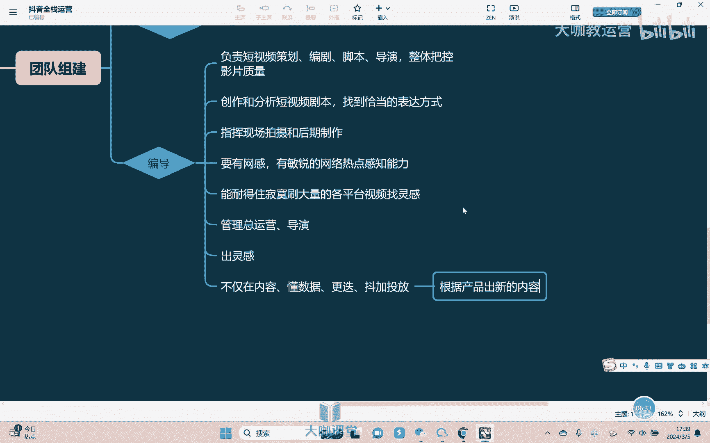

所以呢他呃编导做到后面的，他就是一个整个管理的一个呃，整个团队的一个管理者啊，也是整个的一个指挥者，一个负责人，所以呢你要相当于所有的东西啊，你可以不用每个东西都会对吧，就比如说我们说所有的技术性的活。

你可以都不需要去和精通，不需要去擅长，但是要懂啊。

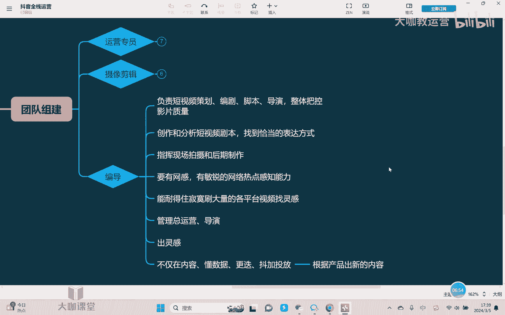

一定要懂好吧，所以这时候我们讲在找团队的时候，嗯啊我们后期自己去发展啊。

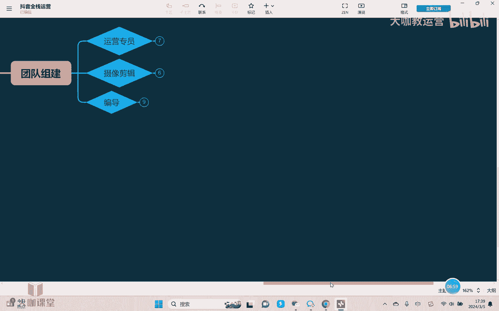

你们可以根据自己的一些能力，对不对，然后呢去往一些这个像像像这些东西上面去靠，当然如果说你自己要去组建团队啊，然后的话呢也可以根据这些东西去评判啊，我如何去招什么样的一个人，然后大概他需要懂哪些东西。

又怎样一个标准好吧，那么这节课的话呢呃也是相对比较简单。

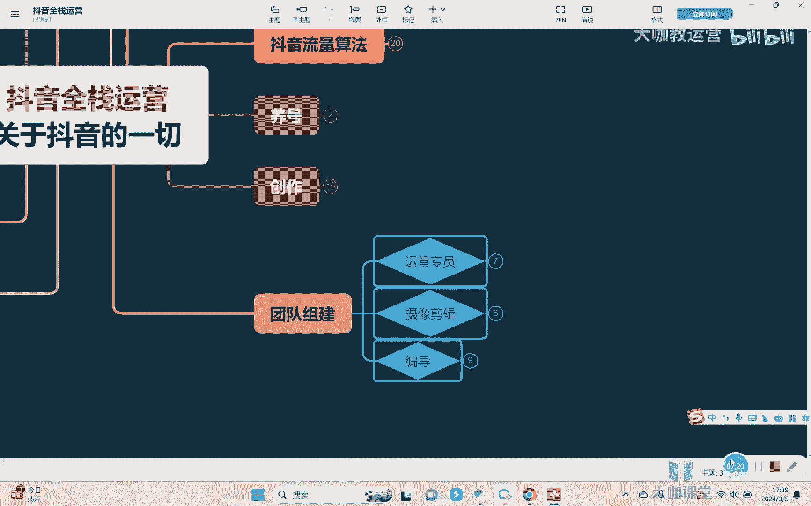

我们就到这里结束啊。