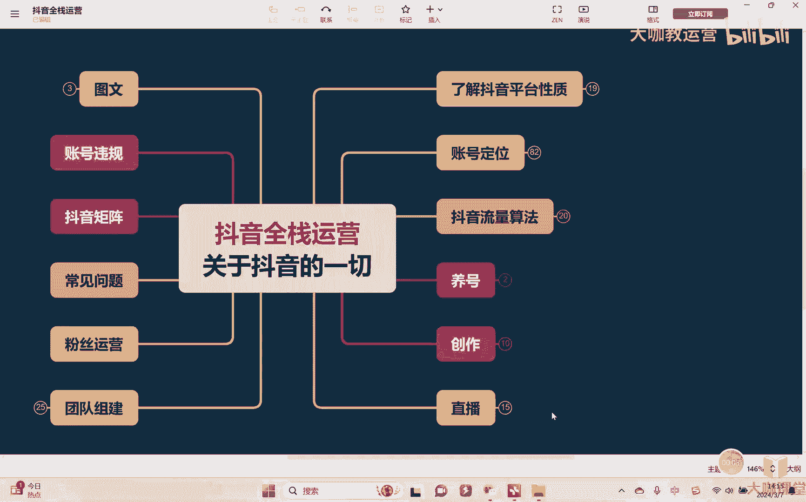
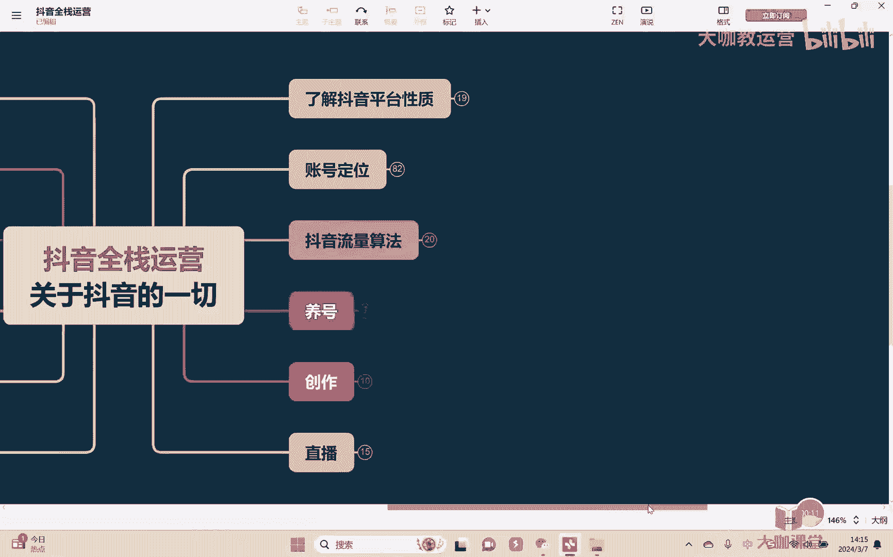
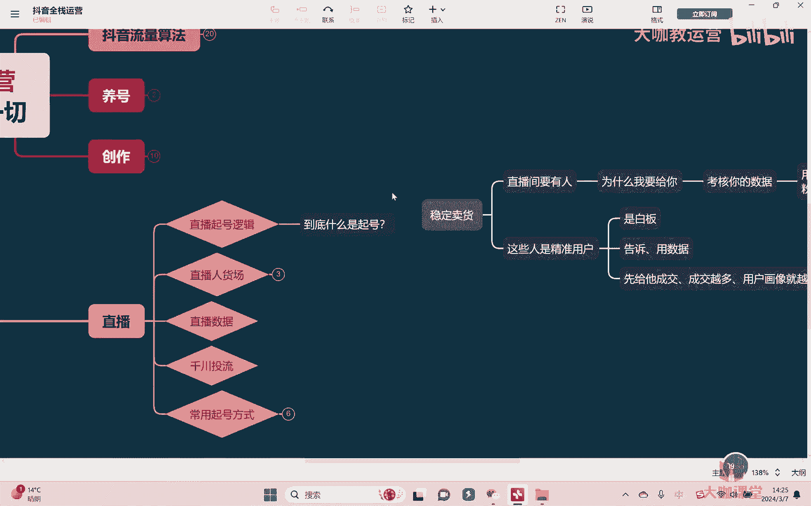
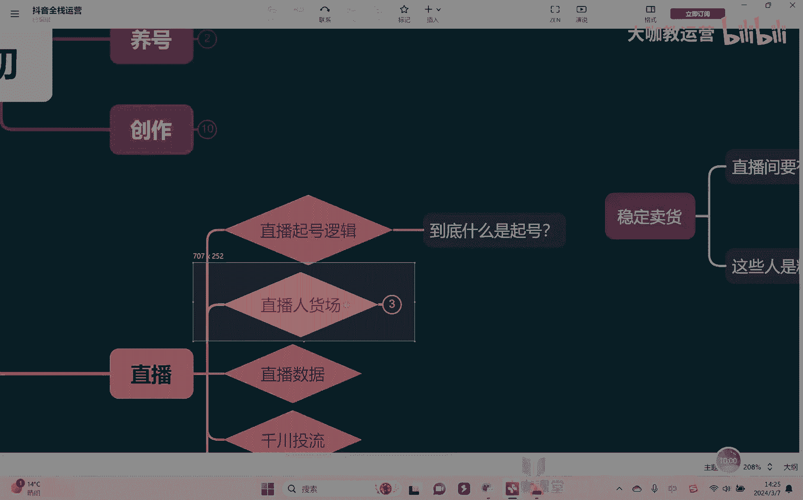
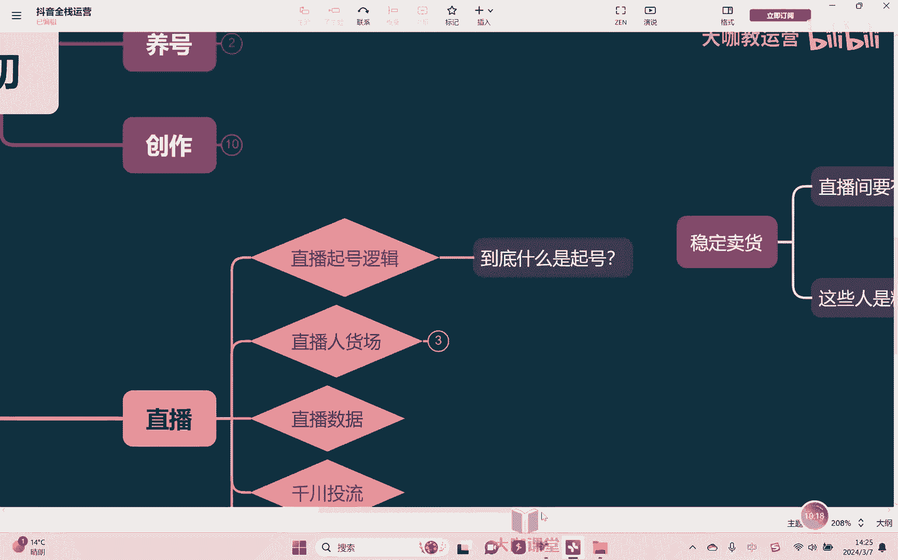
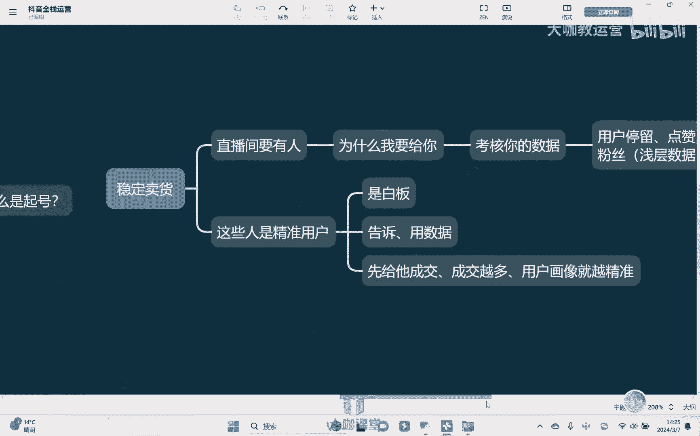

# 【2024B站最强小红书运营系统教程】吊打一切付费课!小红书蓝海市场 2024最值得做的新媒体平台 - P50：19、直播运营：直播起号的底层逻辑 - 大咖教运营 - BV1sn4y1X75u

Hello，大家好，欢迎来到我们的抖音全站运营课堂，那这节课开始我们学习一个非常重要的板块。

就是关于抖音的直播如何去做，那关于抖音的直播呢，它是分为两个大的类别。

也就是我们讲余播和这个电商直播，那在这里的话，我主要是跟大家去讲电商直播相关的内容啊，因为呃电商直播呢它对比余波难度要大很多，也复杂很多啊，玩法呢也要多很多，呃，其次的话呢。

就是如果说我们能够把电商直播这个东西呢，玩明白，那么其他的对于这个余波来讲呢，它的一些底层逻辑，包括他的各种操作，它的这种呃整体怎么去搭建啊，其实的话呢就会非常容易啊。

也不需要说花太多的一个时间和精力去学习，基本上就能够明白好吧，OK那我们呢来一提到这个抖音的直播，其实大家会经常去关注的一个问题，也是我目前感觉大家就是问的最多的一个问题，就是叫做直播旗号对吧。

但是呢呃在这个过程当中，我发现了，就是绝大部分的可以说是80%，甚至90%以上的同学，都没有真正理解出什么才是正儿八经的操作，直播起号是吧，起号起号到底什么是旗号，起了个什么号，对不对。

OK那么我在这里给大家去举两个例子啊，首先第一比如说像第一个直播间，第一个直播间呢起了一个新号对吧，七天之内，他就把他的一个在线人数，就拉到了1000个人对吧，这是我们讲，然后的话呢呃他的这个呃。

但是的话呢在这个过程当中，他的这个人数啊，就在线人数他不是很稳定，因为有时候人少的时候可能也就是几十个人，但多的时候能够达到上千人，一两千人都有可能啊，然后呢转化的话呢呃相对来讲没有那么稳定。

转化的话呢可能看这个情况对吧，有时候的话呢这个卖的多一点，然后回收后的话呢卖的少一点对吧，当然可能和人数有关系啊，当然是这个不是很稳定，那第二种情况下，第二种直播间，就我们讲他也是开了个新号对吧。

也是同样的七天，但是呢人数没有冲到很多，就二三十个人啊，就长期保持二三十个人对吧，但是呢这个人数在线人数他很稳定，而且的话呢卖货的不说转化率很高，但是转化率同样的是非常稳定的。

然后能达到一个还还可以的一个水平啊，这是我们讲他的整体的一个情况，OK那么对于两个直播间，我们说哪一个算是叫做呃旗号更好一点对吧，对于我们说电商主播来讲，那可能这个时候大部分同学应该会啊说啊。

那应该是第二种，对不对，因为我是要为了去卖货嘛对吧，所以其实会发现我们大部分同学是明白的，就是我们的这个起号起的是什么起的，就是这个账号啊要干嘛呢，要能够去稳定嗯卖货嗯，对这是我们的一个核心啊。

因为我们本身是个电商卖货的一个直播间啊，这样的一个账号，所以我的核心目的就是为去卖货，除了卖货以外，我还需要让我能够去稳定卖货，我不能说今天卖个十件，明天卖个100件，后天只卖个两件，对不对。

那这样肯定是不行的啊，做生意求的什么，求的是长远的一个稳定，对不对，OK好，那这个是我们讲的要起号，那我们想要起号能够让我们去稳定卖货，我们需要达成两怎样的一个条件，怎样的一个因素。

首先第一就是我们讲我的直播间嗯，要有人，对不对啊，那这个人不需要太多啊，我不需要太多，但是我的直播间一定要有，你不能说让我直播间长期只有个一两个人，两三个人，那这个卖货就太难卖了，对不对。

毕竟这个人数太少，基数太少，那这个概率相对也偏低嘛，对不对啊，我虽然说要稳定，但你不能说这个这样子稳定，肯定不是真肯定不行对吧，OK第二就是我希望这些这些这些人嗯是吧，是精准用户。

每个人进来不是过来跟我去瞎聊天，或者说在那挂着睡觉对吧，就是而是什么呢，而是确实他对我的产品感兴趣，对我的这个直播间感兴趣啊，能够在我这里去下单，去付费，对所以这是我们希望去打这两个点。

OK那么我如果说直播间有人了，而且每个人的又都是精准用户，那么基本上来讲，我们这个直播间肯定就做成了嘛，就很稳定了，不用去有什么担心的，OK啊那怎么样能够去让我的直播间有人。

怎么样让我的直播间的用户是稳定的来，首先第一想要有人好，我们想要有人，也就是所谓的想要有流量对吧，那么抖音怎么样才会给我们流量呢，啊抖音呢我们说了它的规则，它的这个呃整体的这个机制其实都很透明是吧。

也很也是比较完善的啊，但是而且呢抖音目前的一个流量是，我们讲抖音是目前所有的平台来讲，它的流量是最大的，但是有个问题，抖音他也会去关心，说我虽然流量多，但是凭什么我要给你，嗯对吧，我为什么要给你。

对不对，因为很简单一个道理，假如我给你了，结果呢他不喜欢你的直播间，他觉得你直播间内容很糟糕，影响了他的这个额，影响了他的这个这个感受，然后呢他说我不玩抖音了，我要去玩别的对吧，我去玩快手。

我去玩的这个微信视频号怎么办呢，所以抖音他也会去占步诶，你能不能够给用户带来一个好的体验对吧，我可以给你流量，但是你得帮我把用户留住吧对吧，你不能让我的用户流失，虽然我的人多，但是也不能说白白浪费对吧。

所以那么他就会干嘛，他就会考核你的数据，那这个时候考核什么数据呢，比如说嗯我们讲我们先不就是对于抖音来讲，就是首先是这样，我先不谈说，你能够给我的这个平台带来多大的一个价值，利润对吧。

我至少来讲第一点你你要给我啊留住用户对吧，你要干嘛呢，就是要让用户觉得你的这个直播间唉还不错，所以他考核的时候，这个时候我先不看你的这个什么啊，成交我先看什么呢，我先看用户停留对吧，清流时长点赞啊。

评论嗯，互动对吧，然后呢什么关注嗯，啊粉丝灯牌，当然还有粉丝群，对不对，这个也是我们常说的叫做什么呢，叫做浅层数据啊，就我就说我你想要人可以，我就先考核你这一点对吧啊，你呢先给我们能够把人留住。

能够呢唉这些用户能够跟你去互动，甚至愿意关注的给你啊点个灯牌，对不对，虽然这些东西代价很小，但是能够说明用户，他是对你的这个直播间内容是感兴趣的，对不对，你没有说你把他的这个心情弄得很糟糕。

OK那么我就可以给你的，对吧啊，当然了，在这个里面点赞，对于直播电商的，基本上没有什么，这个这个它没有什么多大的影响，它主要是对于余波这块啊，点赞就会相对重要一点好吧。

OK所以那你看其实我们直播间想要有人，那我们要干嘛，我们就是需要去做这个事情对吧，OK好，那么有人之后，第二个事情就是要让我们的人群能够是精准，对不好，那我如何能够让我们的人是精准的呢，我们想一个问题。

我们以前去做销售啊，做销售我们如何去判断所谓的这个用户，是我们的这个精准用户嗯，嗯怎么判断，通过他的这个嗯，比如说他的这个生活习惯，他的工作，他的家庭情况对吧，他的婚姻状况啊，他的这个呃。

我们说这个这个资金能力等等各个方面，然后去判断，那为什么我们能够通过这些方向去判断，他是我们的精准用户，为什么，因为我们这是因为，我们从以前很多的无数的成交用户哎，这里面我们去总结了。

发现所有的成交用户，这个这个这个身上哎，大部分基本上都会有一些共通的这个点，所以呢我们总结出来的这些点，如果一个人身上具有这些点，OK那么他大概率就是一个精准用户，对不对啊。

所以你想让这个抖音去给你推精准用户，那么干嘛，你得就告诉他，当然这个告诉我们不能用嘴说，用什么用数据嗯，对不对，因为我们的新号在刚开的时候是什么是白板，没有任何一个数据，对不对。

所以抖音他不是不愿意给你去投竞争用户，他愿意给你投对吧，因为给了你精准用户，我觉得对于平台来讲它也有好处嘛对吧，你能够干得更起劲，平台也能够有有价值对吧，OK但是前提条件是你得先告诉他。

对我们的这个新的账号是白板，所以这个时候抖音，他根本就不知道给我推什么样的人，那我们想怎么样才能够让他知道，就是我们说的你得用数据，你得告诉他，你得给他总你截的这些东西，对不对。

他想去把你的这些东西啊给总结出来，把你这些这些精准用户身上的这些标签，能够总结出来，你就得先给他干嘛，先给他成交，对不对，先给他成交，你成交的用户越多，他就能越能从这些人身上找出。

集合的那些成交的精准标签对吧，所以你成交越多，那么我们讲标用户画像，叫月经的，啊啊所以越成交越精准，越成交越精准，你看他就形成了一个良性循环，对不对，当然这个时候有的同学可能就会问了。

那老师我现在就是因为没有竞争用户，我才做不成成交的对吧，但是你现在跟我讲，要推精准用户得先成交，那这个东西我是个悖论，我怎么办呢，那么同学这个就是我们讲没办法啊，因为任何的事情他都是什么。

它都是有一个规则，有一套流程在里面的，所以我们就需要通过设计。

我们直播间的一些打法人货场，然后的话呢来去帮助我们能够去干嘛，去做数据，能够去做成交对吧，然后再来一步一步去做，所以这才是说呃，我们能够去把整个东西去做出来的一些核心啊。

也就是我们经常去提到的叫做人货场，OK那么关于人货场具体怎么去做。

我们下节课再讲，这节课的话，大家学完先去思考，我刚刚跟大家去讲的底层逻辑。

