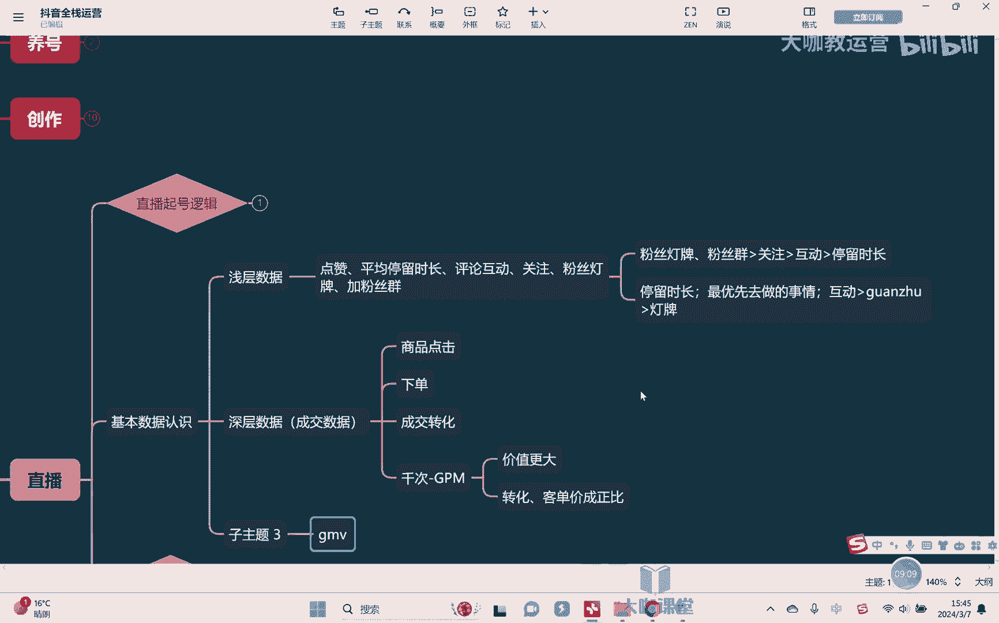
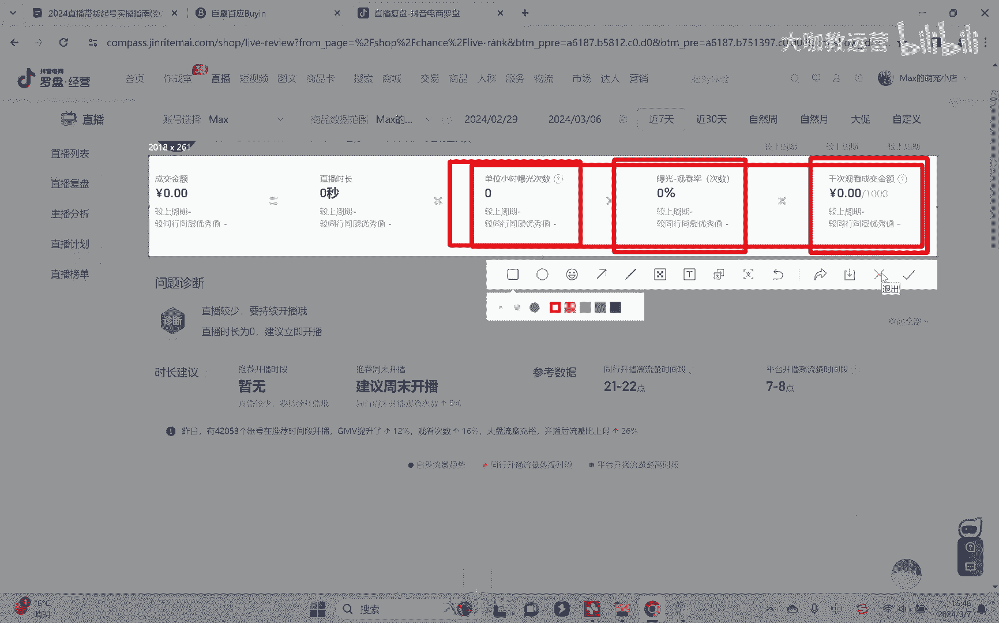
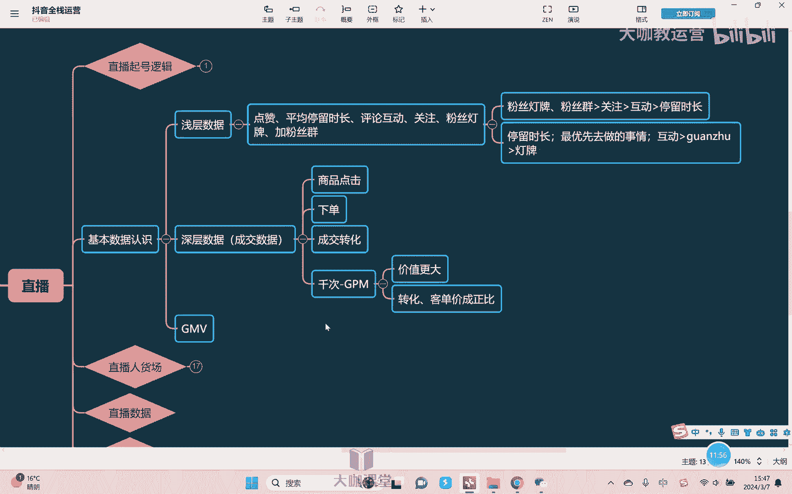

# 【2024B站最强小红书运营系统教程】吊打一切付费课!小红书蓝海市场 2024最值得做的新媒体平台 - P51：20、直播运营：直播间数据详解 - 大咖教运营 - BV1sn4y1X75u

Hello，大家好，欢迎来到我们的抖音全占兵课堂，那么这节课我们继续来去讲，我们一个直播电商额，那上节课的话，我们已经了解了底层的一个运营逻辑是吧，他的一个这个直播电商的一个底层逻辑。

那这节课我们来去讲这个东西啊，就是关于呃相应的一些基本数据和认识啊，就是对于这个基本的一些数据，大家有一些这个起码要一些了解吧是吧，那么包括说我们在之前已经聊过了，那我们分为什么浅层数据和什么呢。

和深层数据，或者也叫做成交数据是吧，好我们一个一个来聊浅层数据会包含的东西，比如说什么点三对吧，当然点赞这个东西我也跟大家去提了，我说这个东西它对于电商直播来讲，他不怎么去访问，知道吧。

OK那除了点赞以外还有什么呢，呃不我们说别动不动是吧，还有什么呢，停留时长，当然这个停留时长，他不是考核你单个某一个人对吧，你不然的话我自己找两个人挂在里面，一直挂着，全程挂着对吧。

或者说呢有人这个比如说呃进来直播间，看着看着睡着了对吧，所以他这个不会去考核你单个的，他考核的什么呢，考核的是平均的啊，平均的一个停留时长，对不对，然后呢呃评论互动完了还有什么关注嘛，对不对。

还有什么粉丝灯牌啊，还有加粉丝群对啊，就因为很简单，就是如果说呃，大家都愿意去跟你去做这些行为的话，那么至少说明他对于你直播间认这个内容，他是认认可的，对不对啊，他对于你这个直播间他是相对有兴趣的。

你没有让他觉得这里不好，对不对，OK那么他就会继续给你去推人啊，所以我们想要去提升我们的平均停留时长也好，互动关注也好啊，粉丝灯牌也好等等，OK这些东西就需要通过我们的各种的一些，什么方式。

人家才能够去做，对不对，所以我们经常会在直播间啊听到，比如说来额这个买衣服的时候举个例子是吧，我今天这件衣服不要99对吧，不要这个69，我只要什么九块九，对不对，大家想不想要想要的扣下，对不对。

他也让你跟他去互动对吧，想要对不对，好想要，OK那么今天的话呢，如果你想要我的这个东西对不对，然后你会发现他一直不上架，一直不上架对吧，先让你不停的给你去扣下价好，那大家要什么尺码对吧。

把你的尺码打在公屏上，对不对，好想要的来，你给我点个关注是吧，点了关注，待会我给你上车，对再给我加个粉丝灯牌，为什么就所谓的真行为，他就是为了干嘛，为了去要你的这个给他去做数据嘛，对不对好。

那在这个里面我们讲这些数据，哪个东西的比重会比较长的啊，正常情况下，其实我们对于什么粉丝灯牌粉丝群，这个的比重是相对高的，为什么，因为最直观的一点，你粉丝粉丝他们还是要花钱的对吧，虽然我们说只花个呃。

这个什么一个抖币，对不对，没什么，没多少钱，但是那也是在进行什么进行付费行为，对不对啊，所以OK他的优先级更高，其次就是我想关注，然后互动，然后就是什么，最后是我们说停留时长。

但是在这个里面过程当中我们会有一个问题啊，为虽然我们说权重排序是这个样子对吧，但是我们这里面会有个问题，哪件事情最容易做，各位哪件事情最容易做，那请告诉我是加粉丝灯牌加关注，让他跟你去评论互动还是什么。

还是让他先在你的直播间留一，各位一定是哪个，一定是我们说停留时长，嗯对吧，你想我平均我平均每个人多留一秒，100个人下来就是100秒，对不对，那么整体的一个比重，他再去核算的时候，这个权重就不会低对吧。

而且我做停留时长，这个时间更容易，对不对，我可能对随便多做一个行为，或者大家稍微等一下，先不要慌着走，可能你就会多停个什么3~5秒对吧，所以停留时长才是，其实反而我们是在浅层数据当中最，优先嗯。

去做的一个事情，其次是什么呢，互动嗯对吧，因为互动来讲，总归来讲他比你什么点关注，或者说比什么加粉丝灯牌要容易对吧，没点关注他以后就会经常刷到你对吧，但是如果说跟你户户互动一下。

我们可以通过各种各样的方式，比如说一些福利啊对吧，比如说一些一对一的这种问问题对吧，点对点的去问问题，对不对啊，一个衣服我可以跟你去互动，你想不想要想要扣一是吧，第二好，想要的话，你什么尺码对吧。

把尺码勾起来，想要这个尺码是吧，OK好第三嗯，你这个呃什么你的这个这个词，你的这个位置在哪里，我看一下能不能发货，把位置就可以扩展，所以你看互动，他可以多层去做，对不对，所以它相对于关注。

相对于粉丝的牌又更加容易，然后再其次就是我们讲关注了，啊然后又是什么，然后再就是我们说的盾牌啊，灯牌毕竟是花花抖币的，当然我们也确实知道一抖币真的没有什么钱，大家钱都花得起，任何人来都花，喜对吧。

但是他也是一个它也是一个付费行为啊，所以这是我们反而我们在整个的浅层数据里面，我们优先去做的一个层级啊，OK啊其次就是我们讲深层数据，那深层数据也叫成交数据，所以他首先会看什么商品点击，嗯对吧。

商品点击，如果说这个你都没有，那就说明人家对你的产品都没有兴趣，那怎么会在你这里买单呢，对不对，所以这个商品点击就是我们在深层数据里面，去优先去做的一个事情，OK商城商商点完了之后是干嘛下班嗯，对不对。

说明一个人愿意替你下单，OK说明他对你这个产品确实很感兴趣对吧，他确实被你打动了，对不对，他准备想买了对吧，所以这是我们讲下单，OK再其次就是成交转化，对我都已经买了嘛对吧，我买了你的这个商品。

肯定是被你所有东西都认可的都打动了，OK对不对，所以成交转化啊，这是我们讲的，这是非常重要的一点，OK那再其次就是我们讲的一个东西叫做切刺，嗯或者叫呃，当然我们平时叫什么叫GPM啊，那所谓的这个GPM。

它有它能真正能够体现的什么，就是我给你，我的这个智商品展现了1000次，对不对，同样的两个不同的商品都展现了1400，哪个能够带来的一个产出金额更高，那么就说明哪个是哪个产品或者哪个直播间。

他能够给平台带来的价值，最大嗯，对不对，同时我还知道你的这个直播间对我的平台，对我抖音这个平台来讲价值更大，所以我会干嘛，我给到你的流量，它就不光只是单纯的影响一个生存数据。

他其实也会去帮你补充浅层数据啊，所以这个时候我们会知道哦，好像GPM是最重要的一个数据，对吧啊，同时他也去可以衡量我们整个直播间，比如说人货场他的一个能力，对不对，因为签字它是由什么组成的。

它是由转化它和转化，嗯和我们的客单价之间是成正比的，对不对，OK所以这个就意味着什么，如果GPM高意味着我们的客单价高，同时转化还高对吧，就意味着这两个当中我们整体来讲是比较高的。

所以他能够体现更大的价值，OK好，那在这个来同时的话，我在这里我们的一个总数据叫什么呢，叫做最终我们产生的一个金额叫什么呢，GMV这个大家都听说过对吧，那GMV是怎么组成的，来给大家看一看。

来我们可以在这个数据列表里，可以看到成交金额是等于什么，等于直播时长乘以单位小时，曝光次数，也就是平均一小时曝光了多少次，然后乘以什么呢，曝光干关率，也就是曝光之后有多少人点进了直播间来看。

再乘以什么千次观看的一个成交金额，也就平均1000次观看成交了多少钱对吧，看到这样的东西，大家就能理解了，如果我们想去提升我们GMV最简单的方法干嘛，在所有后面的其他的机体数据都不变的情况下。

最简的时间干嘛拉时长吗对吧，所以我们会看到有很多人直播间，他比如说我们我们俗称叫什么，日不落直播间对吧，就是时长发时长，从天从早到晚去播，时间播的长，它整体的金额吧，销售额就会越高，对不对啊。

OK但这是我们讲拉时长，这是在后面这些数量都不变的情况下，对不对，但是我们不可能说从早到晚所有的数据都不变，这很难实现，对不对，那如果说我们还想提升怎么办呢，提升曝光量，提升我们的什么曝光进入率，对不。

或者就是提现我们的什么，我们的一个签字光盘成交金额，所以OK你会发现他和我们什么曝光率也好，和我们的转化也好，和我们的客单价也好对吧，包括和我们的曝光的记录率都有很大的关系。

最终才能够去形成我们一个成交金额对吧。

所以你会看到所有的这些数据，我们每一个都去提升，任何一个去提升，都能够最终去成就，成就我们一个什么gm v的一个提升啊，成就我们一个GMV的一些资本对啊，所以这是我们要了解的各项数据。

中间的一个相应的一个关系，OK好吧，那么关于深层数据的一个优先提升的一个比例，这个东西我说实话优先看什么呢，优先看商品点击，因为如果你想想商品点击率都低了，那么人家对你的产品本身都没有兴趣，说白了。

那你这个东西就很难去承诺，再有后续的什么下单，再有后续的什么转换对吧，然后呢你转换都不好的话，你的GPM怎么会很高呢，不会的对，所以这个是我们优先去做的事情啊，所以呢成交数据和我们的浅层数据。

它不是说一样的，要这个反方向的去提升，而是什么呢，而是优先去提升点击，然后去做什么转化对吧，然后呢包括说拉成这个客单价等等啊，那这是我们这节课关于整个的数据，我们做一些初步的了解啊，因为了解完这些之后。

我们才能够去了解后期我们说人货场如何去做。

以及为什么要这么去做，OK好，那么这节课我们就先讲到这里好吧。