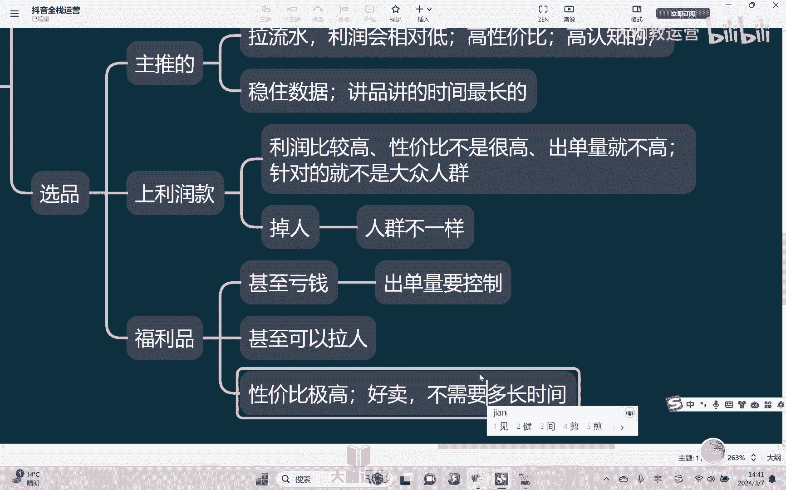

# 【2024B站最强小红书运营系统教程】吊打一切付费课!小红书蓝海市场 2024最值得做的新媒体平台 - P52：21、直播运营：产品的分类及作用 - 大咖教运营 - BV1sn4y1X75u

Hello，大家好，欢迎来到我们的抖音全站运营课堂，那么这节课呢我们继续来继续讲。

关于直播电商呃，在上节课我们已经讲了这个直播，他的一个底层逻辑对吧。

然后呢也说了，想把直播呢整体的一个去做好，那么其中核心呢还是在于我们的人货场，但是呢在抖音的这个直播过程当中，我们会分为叫做货场人啊，那至于为什么叫货场人，我们先不急着去讲啊。

我们呢先来去呃这个思考一下，到底什么是货场人呃，因为呃很多的一些这个跨行业来去做，老板也好啊，包括一些这个呃其他行业的，那么他们再去理解直播带货这个事情的时候呢，总是会把它去想的很复杂。

但事实上呢我们其实没有必要去把它想的复杂，对吧，在哪里卖货，不是卖嘛，对不对，我们在线下是以前我们是最早在线下买，后来呢在这个货架电商淘宝上面去买，那现在的话就是在这个抖音直播间上面去买，对不对。

只不过换了个地方卖，但是我们都是在卖货对吧，但是卖货那需要哪些东西，举个例子，我们在线下开一个门店嗯，然后去卖货怎么卖，线下看门店，首先第一我们要做的准备的第一个事情是什么，比如说我要卖服装店。

我需要干嘛，我需要先有货源，我可以，比如说呢有自己的工厂或者服装加工厂对吧，或者呢我有这种相应的这个供应链对吧，我有渠道，我能拿拿得到货，对不对，O这时候我们讲首先第一你得有货，你才能卖货对吧。

货都没有，谈何卖货的对吧，第2OK好了，有了货之后，我就要准备干嘛开店了，对不对，所以开店我们先要干嘛，先要选址，对不对，找到一个我们觉得说还不错的地方啊，呃然后的话呢呃我们以前做线下核心是干嘛。

核心为了选址，对不对，核心是为了就是在于选址这块，为什么核心要选址，因为选址选的好，意味着人流量大对吧，是不是，就其实我们说的抖音上的这个什么人数，就是流量，就是曝光对吧，就是流量就是曝光，对不对。

流量越大曝光越大，然后呢我们能够把产品卖出去的机会就会更大，对不对啊，那这是我们讲选址，OK那选址完了之后还要干嘛，还要去装修吧，对不对，我不能一个毛坯房，我挂了个衣服就去卖了，对不对。

而且呢我要把这个这个整个一个店，我要装修成诶符合我这个服装他的风格的，对不对，你看女装和男装，还有老人的衣服，还有童装对吧，他装修风格他都是不一样的，对不对，然后呢哎再细分，你看女装有不同的风格对吧。

有上班族的对不对，有这种旗袍式的啊，有这种我们说这种这种可爱风的，对不对，他会都会有各种各样的风格，为的是什么，为的说哎能够让是吧，能够找到，喜欢的嗯能够让喜欢我们这个风格的人看出来，然后他就进店来嘛。

对不对，也是在做一项筛选啊，这是呢要契合我们的一个整个风格，其次呢你像哎我们还有一些这种摆置对吧，衣服要怎么挂，怎么样去打灯光，怎么样去放镜子，怎么样能够好看，对不对，能够让我们的产品看上去更好。

OK好，那这是我们说选址，第二个呢就是开店装修，第三店有了货也有了货也摆上了，我们需要干嘛，有人对吧，要招人嗯，招人干嘛，招人来卖货嘛，对不对啊，然后呢可能还需要一些其他不能光怪货。

有的时候呢我们可能说这个生意比较好啊，有的要干嘛，有的要导购一下，或者干嘛这个打打杂，或者说管一下，对不对，管你嗯，对不对，有的时候还干嘛还出营销方案啊，对不对啊。

这样子呢能够让我们的这个货卖出去，然后呢或者说卖的更好，所以你看对比于我们线上来讲的人或人场。

你会发现是不是也是一样的一个逻辑对吧，也是一样的一个逻辑啊，所以你呢都是在卖货啊，只不过换了个地方卖，然后呢呃他的一个呃只不过区别在于说什么，区别在于我们的流量不一样啊，抖音的流量是他有一套既定规则。

对不对，你按照它的规则来就可以了，线下门店是通过我们的很大一部分是通过选取，然后通过品牌的知名度对吧，这样子来去来的，OK好。

那这是我们讲线下去做，并首先我们把这个东西去带进去对吧，所以这也是我们讲的，首先你在做这个直播带货的时候也是一样，你首先得有货，因为我们是为了去卖货啊，所以的话呢首先第一货是放在第一位的。

你的货直接就决定了什么样的人，他会买产品，就决定了什么，决定了人群，嗯对吧，嗯你你比如说你的这个你是做童装的，嗯做童装的，那我们说没有结婚的人对吧，或者说呃这个刚毕业出来上学的。

这个刚毕业出来就开始工作的，他大概率就不会去在你的这个店里面买衣服，对不对啊，所以的话呢这个就是我讲你的产品，很大一部分时候就决定了你一个人群是吧，所以我们的产品首先第一个事情就要干嘛，就要选品。

当然了，选品这东西取决于首先第一取决于你什么，你有什么品，对不对，我们从你已经有的频里面，我们要选出123。

为什么选出123呢，第一要选出主推的嗯对吧，就我们讲每个店都有他的什么他的一个呃，这个招牌是不是有他的一个这个当家的，只要你是个招牌菜，我的衣服就永远能卖得出去，永远会有人买我的衣服对吧。

我这个品牌不会打，对不对，我能够去拉流水嗯对吧，所以这样的产品我的利润会相对偏低。

他一定不会高啊，为什么，因为我们说想要让他埋的好，埋的爆，他就必须干嘛，他就一定是高性价比对吧，举个例子，就像我们说呃蜜雪冰城它的这个什么柠檬水，对不对，蜜雪冰城它的所有东西价格都不都不高对吧。

但是呢他的柠檬水是他的一个什么招牌之一，为什么，因为性价比高啊对吧，同样都是柠檬水，我没有说我的柠檬水比别人好喝，但是我价格比别人低，对不对啊，所以呢他的性价比高，而且呢什么是高认知的嗯，对不对啊。

你举个例子，你今天跟我说有一个这个钥匙扣，嗯对吧，是这个一块钱便不便宜，很便宜是吧，而且你跟我说，你这个钥匙扣是做工很精良，设计很精美，OK你给我说一块钱对吧，但是我还是不一定会觉得他他很划算，为什么。

因为他不是一个高认知的东西，什么叫高认知的东西对吧，我苹果苹果手机平时卖个6000块钱，7000块钱，但你今天跟我说4000块钱对，4000块钱这个金额低吗不低，但是他是高认知的，我们就是会觉得它便宜。

所以这时我们讲你首先一定要去做的事情，就是选出你的主推品啊，我的主推品他就是为了去干嘛，在我们的抖音直播间就是去嗯，能够稳住数据对吧，只要有他在，所以呢我就一直能够卖得掉对吧。

大部分进来的人都会觉得说这个东西很划算，都会去买，对不对，所以他一定是我直播间奖品，讲的时间最长的懂吗，他一定是讲不停，讲的时间最长，但是OK这个时候我光这么样去拉流水不行的，我不挣钱呢，对不对。

我挣的太少了吧，光在那拉拉苦力，对不对，光去拉流水不行，那我还需要干嘛，OK我需要去做利润，所以这个时候我就需要干嘛上利润化嗯，那利润款我可能是干嘛，我就一定是利润比较高对吧，因为利润高。

所以它性价比嗯，不会很高，性价比不是很高，所以他的什么他的出单量就不高，但是我不管出单量高不高，我是有利润的呀，对就是我能赚钱吗。

对不对啊，所以这个时候就是我的利润款要去做的事啊，那么利润款针对的什么，就是针对我们说他比如说举个例子，它的设计对吧，我这个衣服同样都是旗袍，别人卖1000，我卖2000，我的布料没有比他好。

但是我的设计我的风格不一样对吧，我体现出来的质感，体现出来的这种感觉不一样，我就可以卖到2000，为什么，因为它针对的就是就不会就不是大众人群，大众人群要的是什么，要的就是性价比，对不对。

所以我的利润品就针对的什么小部分人群，OK好，那所以你买利润品的人是不是相对就少对吧。

那么OK我的这个主推品，要转到去卖利润款的时候，他会干嘛会掉人，对不对，会掉人，为什么会掉人，因为我们说了人群不一样，嗯之所以会掉人，核心在哪里，人群不一样，因为买主推品的人和买利润屏的人。

他的人不是同一批人，所以喜欢主推品的人，他不喜欢利润平对吧，他不喜欢你的利润款，所以他的人就会走就会掉对吧，那我怎么样能够让他不掉，我就需要在这个时候是干嘛上什么呢，上另外一款品在中间去衔接。

就是我们常说的叫做浮力品，福利品，我告诉大家，不光利润低，甚至是亏钱对吧，但是因为亏钱，所以我不能让我自己亏太多，所以我干嘛，我的量出单量要控制，不然出多了，我就一直亏，肯定不行，对不对，我要干嘛。

我要控制它对吧，少量的出啊，然后的话呢能够保证我的人不掉，甚至还能够去。

甚至我还能够去干嘛去拉人起来，甚至还可以嗯抓更多的人进来对吧，然后的话呢让他给我把数据稳住，OK这个时候我再去找我的助推力，所以利润品啊，所以我们说这个福利款福利款我们干嘛，我们一定是要控制单量的。

所以我们这个东西因为绝对低价对吧，因为价格太低，性价比极高，嗯对不对，所以我不愁卖，我只要这个东西上了，我大概率好卖，太好卖了，所以我不需要讲多长时间，就你你看到的这个品嗯。

大概率你自己就可以去下单懂吧。

所以这是我们说，首先第一我们要把这三款品。

根据自己的产品把它选出来啊，选出来之后，不同的品我们要做不同的排列。

做不同的奖品，OK好，那么这是我们第一节课讲的选品。

