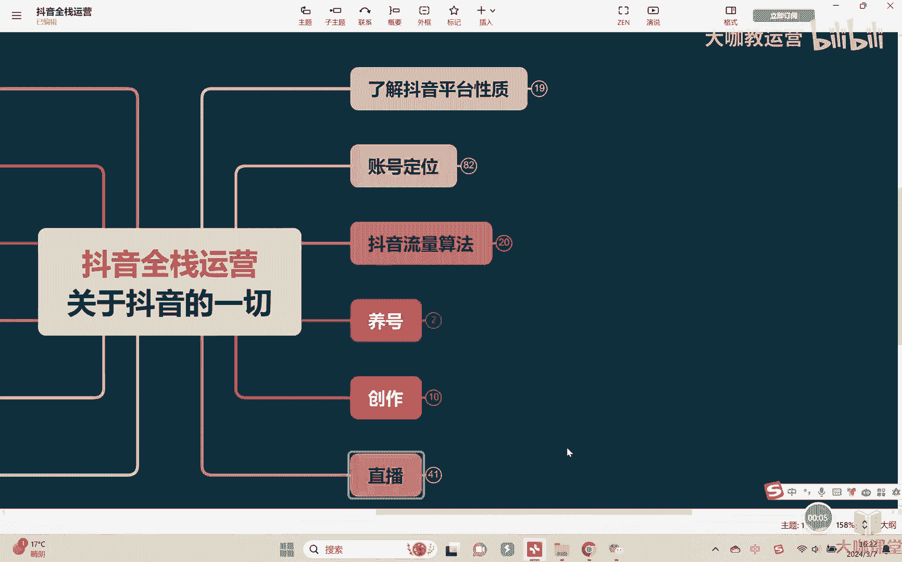
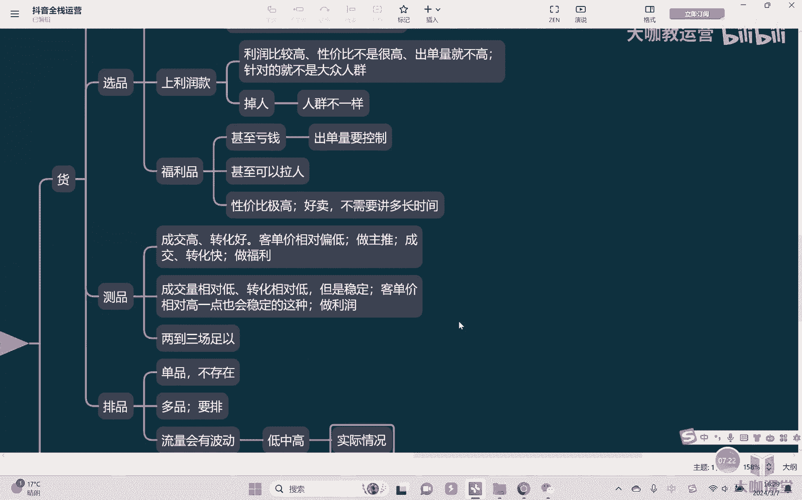

# 【2024B站最强小红书运营系统教程】吊打一切付费课!小红书蓝海市场 2024最值得做的新媒体平台 - P53：22、直播运营：【品】测品和拍品 - 大咖教运营 - BV1sn4y1X75u

哈喽大家好啊，欢迎来到我们的抖音全占英语课堂，那么我们继续上节课讲了啊，根据之前呢我们已经跟大家去讲了啊。

有关于这个产品如何呢去进行一个分类是吧，然后呢分为这三种不同类型之后，我们要根据自己现有的产品去干嘛去挑选啊，去挑选出适合的一些产品，但是OK这个时候可能会有一个问题。

干完了就是我们在挑选产品的时候，我们如何去判断哪个产品适合做主推，适合做利润和适合做福利，因为如果说我们没有历史参考数据的话，比如说我上新对吧，或者我刚开始做我的这一类的产品，我的这个这一块的产品唉。

在市场上目前来讲很少见对吧，我没有这种参考的一个价值这个方向，那怎么办呢，我自己就靠这个主观去判断呢，啊主观主观判断的话，那么可能不准确对吧，所以需要干嘛呢，需要这个时候我们可能去做一个事情叫做测评。

对，就是我们实际上上直播间直接去测嘛对吧，看数据数据是不会骗人的，对不对，OK好那怎么测呢是吧，首先我们在直播的过程当中，如果说发现嗯，比如说呃，首先我们自己根据自己是这个正常的一个价格，来对吧。

通常情况下我们会把价格低一点啊，做福利对吧，中等的做主推，把性价比高的做主推，然后呢价格高点的做利润对吧，这是我们正常来，OK我们可以先通过我们自身的一个主观去判断，结合，比如说当下的一个时间节点对吧。

等等去做一些判断，然后挑选出来，挑选出来之后去测，然后我们根据数据，比如说成交高的对吧，就销量高，转化好，转化很容易对不对，然后呢大家喜欢对吧，然后呢这种同时的话呢客单价相对偏低是吧。

这种情况下OK我们适合干嘛，适合做主推对，然后另外就是我们讲成交好，不光成交好，而且会发现转化速度，除了我说除了转化率高以外，还有什么，还有转化快对，还有转化快啊，就是这个东西上去之后。

我不需要太多的去这个讲，就我发现这个品上上去过生日之后呢，我只要价格能降下来，这个产品就一定卖的出去，百分之百很好卖的这种，OK干什么呢，我们去作为福利做福利对吧，然后另外嗯就是成交量相对低对吧，转化。

相对低但是稳定对，但是要稳定对啊，这种客单价相对高一点也会稳定，这种嗯我们做什么做立的嗯，对不对，就是我客单价稍微涨一点，会发现它不会影响我太多的一个什么啊，影响我太多的一个转化。

那么这种情况下是适合做我们的一个利润点啊，但是我们讲有一个很重要的点。

就在于什么在于稳定，你不能说呃我这一场啊是可以转化出去的对吧，然后过过了下一轮的时候，哎他转化不出去啊，这个也不行，对吧啊，说明他不是一个真正什么的，他的一个人群还是不稳定的，我们核心要什么。

核心还是要稳定，那么宁愿舍去一小部分的这种所谓的利润，或者短时间的这种高的销量，我们也要也要稳定，稳定才是最最好的啊，最重要的一个东西，好吧，OK这是我们讲测评的部分，那测评一般要测多长时间呢。

一般情况下两到三场足矣啊，但是实际情况下来讲的话呢，也需要根据自己的实际情况，那有的品一看你百分之百就是不行的对吧，我一场的时间呢播了好几轮，场场都都都实在是拉胯对吧，各项数据我觉得都不行的。

那这种就直接砍，就没有必要说非要再搞个两场三场，这个没有必要，OK好吧好，所有的产品都可以测出来，测完之后我们是不是选好了，选好之后我们来干嘛要排平对，因为这涉及到我们不同的一个类型啊。

有的这个一些直播间，比如说举个例子，它的种类只有那么两三种，它只有这几种产品，或者有的直播间现在是什么，还有很多的直播间，他现在是打爆品的单品直播间是吧，那我就不存在不存在说什么排点对。

我就这一个产品我有什么好排的呢，对吧，我们通常是什么多平行的直播店，比如服装首饰品，数码3C啊对吧，日常生活用品，厨房用具等等，这种情况下就需要什么要排排除了对啊，为什么要排对吧。

因为我们在整场的直播的过程当中，流量它是会有浮动的对吧，流量会有波动，有的时候低，有时候高对吧，有的时候我们说有的时候不同时间的流量，有的流量更加精准，有的流量更加麻烦对吧，不同时间段的流量。

它适合转化的产品是不一样的，对不对，所以我们才需要去提前安排是吧，通常我们讲我们有福利品，有主推品，有利润，所以一般情况下我们举个简单例子，我们会干嘛，按照客单价的低中高哎去还去对吧，一步一步的去转款。

然后这样子的话呢哎能够先拉流量起来，然后转到主推品对吧，既然人了，OK我把这然后用主推品把数据统一下做起来，做完之后转到我的高利润里对吧，高利润品上面，然后再去做转化，能够让我赚钱，对不对。

但是实际上OK这是我们正常去排的一个过程，所以我们需要在直播之前提前设置好，我们相应的直播脚本，提前去啊预测，然后呢安排我们的一个排名，但是我们在实际情况嗯，不好讲懂吗，实际情况哎。

有的时候不一定能够按照我们预想的去发生，比如说我们在低价款，然后呢进来了大量的人对吧，然后这个时候大量的人发现了，我下面高价的这个链接，觉得反响还不错，对我我为什么说非要去转。

直接在中间再去插一个别的价位的呢，我如果说觉得我直接转过去能转的了，我就没有这个必要啊，对不对，我人数已经体量已经上来了，我干嘛不去直接装反，对不对，或者说我有的时候我这个转款的过程当中。

我发现虽然价格差距很低，但是呢我就是转不动转的就掉人怎么办，那我只能是临时去加我的一些福利，或者一些其他的这种主推的一些爆款，OK去拉我的数据对吧，所以这东西啊我们说方法是死的。

但是实际的操作它是活的对吧，所以这是我们讲我们在直播之前，对于产品的很多东西，我们就需要干嘛，就需要提前去做好相应的规划好吧，OK那么这是我们这节课的一个内容。

