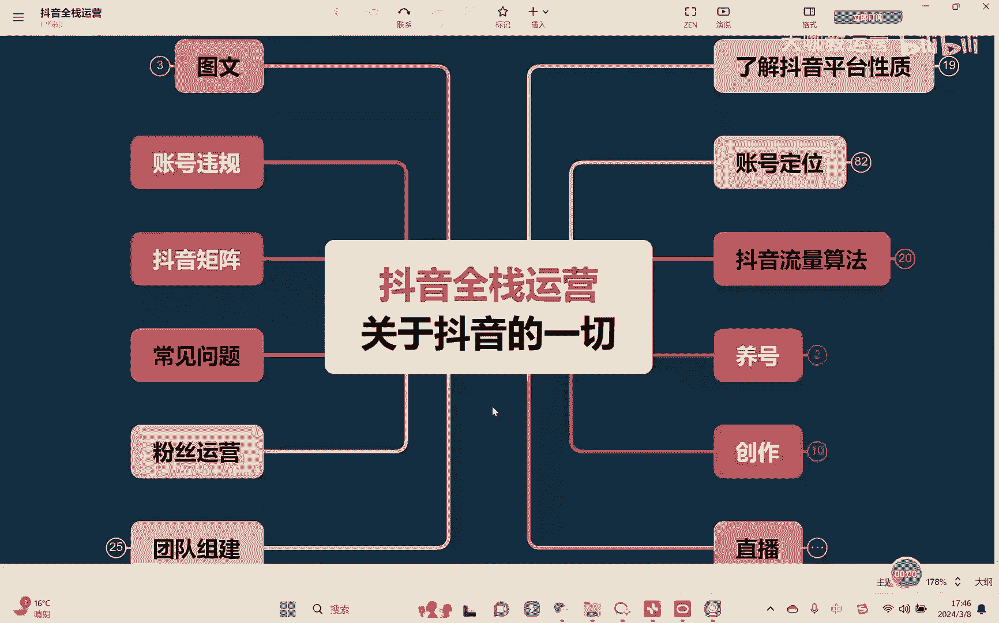
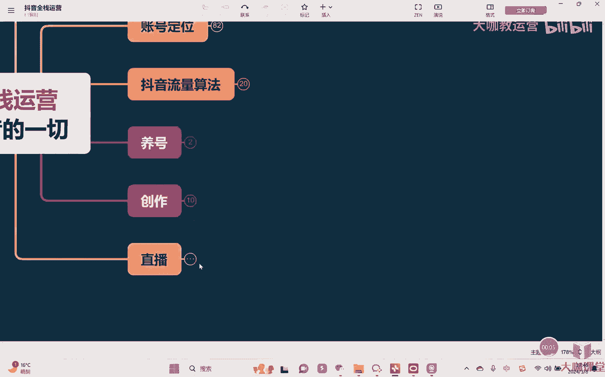
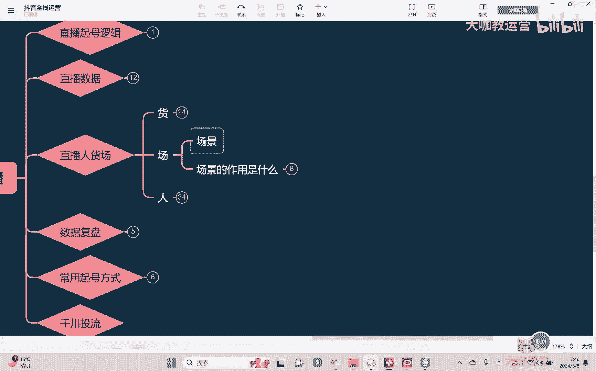
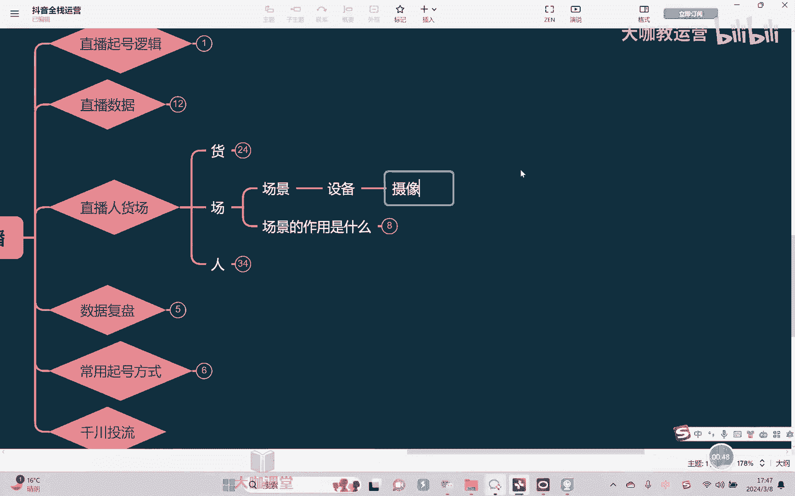
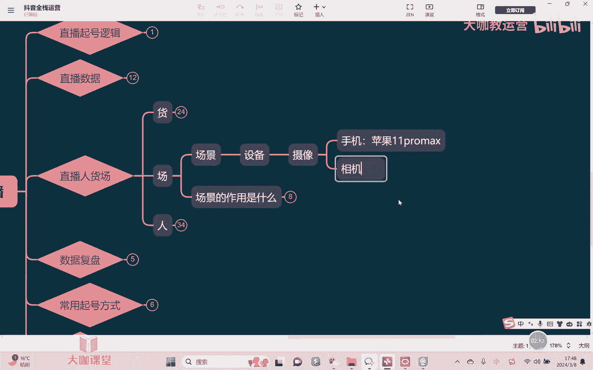
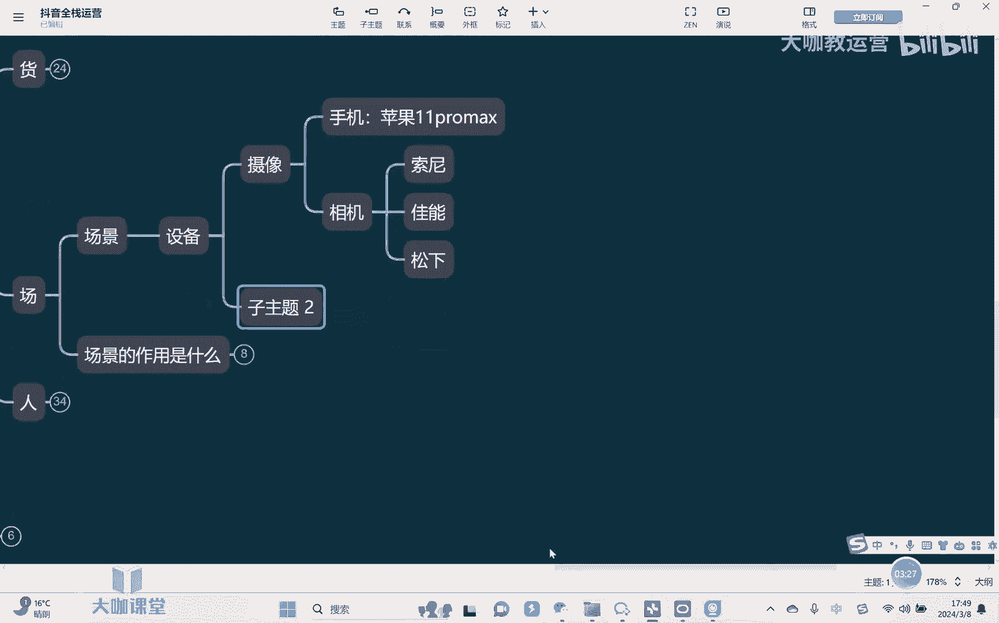
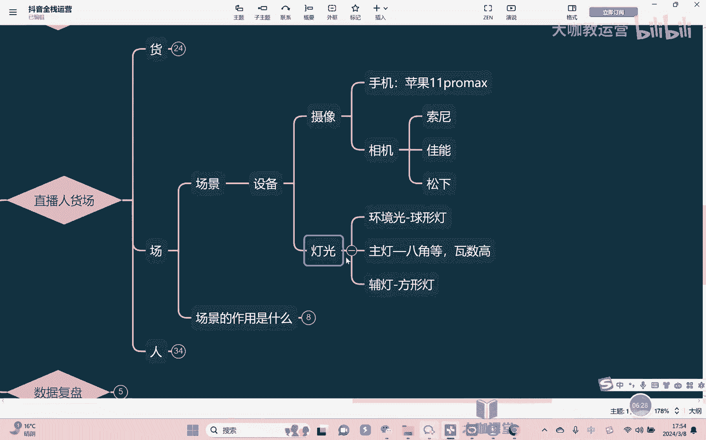
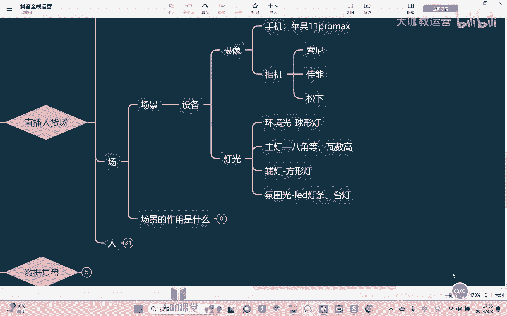

# 【2024B站最强小红书运营系统教程】吊打一切付费课!小红书蓝海市场 2024最值得做的新媒体平台 - P54：23、直播运营：直播间搭建 硬件篇 - 大咖教运营 - BV1sn4y1X75u

哈喽大家好，欢迎来到我们的抖音全站运营课堂，那么这节课的话呢，我们继续来去讲直播啊。

有关于燃我货场人当中的这个场的部分嗯。

因为我们有一句话叫做呃三秒看人啊，三秒留人是看场景啊，30秒留人呢看这个主播那3分钟的呃，或者说一分钟更长时间的留人，那就是靠我们的一个产品了，那产品在之前已经跟大家去聊过了，那这节课呢我们讲什么呢。

就讲的是我们的一个场景，那场景呢，它首先第一，就是我们讲整个场景的一个具体搭建，也就是直播间，我们首先第一个要解决的其实就是什么，就是设备问题啊，就是设备问题，对不对。

那么我们的设备首先第一个我们会包含哪个呢，摄像的设备，嗯对吧。

嗯那么摄像我们可以用手机，也可以用相机，首先第一个手机手机的话呢，我们一般情况下是这样啊，虽然说说实话，现在确实安卓手机呢也要对比于苹果手机啊，这个硬件设施，个别这种效果参数什么的都挺好的。

我们确实承认，但是我们在实测的过程当中确实仍然发现啊，建议大家用苹果手机，好不好意思，确实是这样啊，呃本人呢也支持国货，但是的的确确啊，目前我们实测下来苹果手机的效果会好些啊，因为我们一场直播。

基本上你至少要保证两个小时以上，然后在这个过程当中呢，因为是一边开着直播对吧，另外一边的话呢我们又需要去充电啊，所以的话呢呃安卓手机确实时间长了之后，它这个发热，然后过热之后有可能会出现死机的一个情况。

相对来讲不是说苹果手机一定不会出现，但是稳定性会更强好吧，然后呢如果用手机，苹果手机我们什么型号呢，至少是要保证11pro max以上啊，除此以外，包括什么十二十三十四十五等等都可以啊，根据你的预算来。

但是如果你只是单纯的什么十一十二，十三十四十五都不行啊，我们还是要用什么呢，用pro max版本的，就不管你是十几啊，10亿以上都可以，但是要是pro max版本的好吧。

这是第一OK我们讲设这个手机的部分，OK好，第二就是用什么呢，条件好，那么你就用什么就用相机嘛是吧，那相机的话呢。

目前我们主要建议的情况下，就是如果说你的直播间以展现产品本身为主，对吧，对于产品本身的各种效果展示，然后呢颜色也好，细节展示也好，那么这种情况下我们建议是用索尼啊，用索尼的嗯，如果说你条件差一点。

你买半画幅的这种相机嘛对吧，带个这个这个镜头，然后的话呢估计六七千，七八千块钱也能搞得下来，像什么ZV10对吧，Z v11，这都性价比很高对吧，你条件好啊，什么AA7M三A7M4对吧，这个都稍微贵一点。

对不对，但是呢你就看你的情况，然后如果说我的直播间有模特，我要把这个人拍的更好看，那么这种情况下我们建议是用什么呢，建议是用佳能啊，佳能的什么R啊，呃这个rs10对吧，rs11都是可以的啊。

也是根据自己条件去来，那如果说我们要做户外直播嗯，这种情况下，我们的建议就是松下啊，松下在对于这种自然场景的一个拍摄项目，来下来的话呢，效果会更好一些啊，这是我们一个建议，但实际上你肯定还是要根据你的。

这个自己的实际条件来嘛对吧。

比如我们说这个呃装备它只是装配而已啊，然后另外一方面嗯就是我们讲灯光呃，呃因为有的时候我们肯定会觉得，相机直播它的一个画面的一个效果，肯定会比手机好对吧，那确实这个事情况是什么呢，这个是前提条件。

是我们说在同样的这个什么情况之下啊，如果说你这个灯打的完全很差对吧，那其实来讲的话呃这个用手机用相机，它也是什么，它也是不行的对啊，你用再好的设备，你灯打的很差，那也没有用对吧，而且呢灯光如果打的差。

有的时候你还会影响你的画质好吧，那灯光一般情况下，首先第一就是我们讲的叫什么，就是环境光嗯，环境光环境光的话，一般情况下我们会用桶这种这种圆筒灯啊，用这种圆灯，或者我们说叫做，或者说是叫这个球形灯啊。

球形灯嗯，呃它灯罩就跟这个球形是一样的啊，这是我们讲环境光，环境光呢照亮是整个呃这个直播间的一个，整个一个环境，因为如果说环境光没有照亮，那么它会影响到你的呃，直播间他的一个画质明白吗啊，包括说很多的。

如果说你是尤其是绿幕抠图的那种，如果说呃出现了绿边很严重对吧，然后呢这个画质也不清晰，那么大概率啊从灯光的角度去考虑，大概率是你的这个环境光不行啊，环境本身的亮度不够，它就会出现这个问题。

OK第二就是我们讲主光呃，或者说叫主灯吧，嗯主灯是用来打人的，所以我们一般情况下会建议用什么呢，八角灯嗯，八角的灯笼啊，然后的话呢呃再加上瓦数要高，嗯啊因为你整个以因为我们直播间对吧，只要是有主播。

那你核心一定是以人本身啊，很是很重要的，对不对，所以正常情况下你都是要瓦数高，瓦数高，才能把整整个人的这一个部分的一个区域，能够去打亮，OK好那么呃通常情况下我们的主灯会照着主播，一般是上方。

斜上方45度的一个角度往下去打，然后再除此以外，比如说我们还有什么呢福灯是吧，因为主灯主要是打在这个整个主播的一个，脸上的对吧，把脸部打亮，然后呃福灯的话呢做一些补充，你们可以理解为辅灯。

它就是哪里缺光就往哪里打啊，所以它不会有一个非常具体的一个位置，明白吗啊一般情况下我们会用方形的啊，或者是这种细的方形灯啊，它都是明白啊，然后再除此以外。

我们还会有，比如说像这种呃氛围光或者是环境光，或者说叫氛围光吧，嗯啊氛围光的话，一般情况下你用什么这种led的灯条啊，嗯对吧，或者什么这种台灯啊，嗯对吧，或者呢呃各种各样的一些这种灯啊。

包括说这种小的这种氛围的灯，它都是可以有类似的一个效果啊，主要是呢能够让直播间的一个氛围啊，看上去呢有一个点睛的一个效果啊，然后另外呃就是我们讲灯光的话，尤其是主光呃，包括福灯。

我们建议都是用呃无极变色，就是三色可调的这种，因为打灯的这个东西呢，呃我们要根据当时的情况来对吧啊，这个东西很多时候我们的灯光那个效果，只有测了之后他才会知道，然后在打灯这块是这样。

一般情况下我们就是拍打人的话啊，建议就是什么呢，为什么主灯从上往下打呢，因为这样会把主卧的这个脸部拍的更瘦一些，就显得好看一点啊，然后如果说我主播长得白是吧，很白，那么这个时候呢。

建议我们的灯光可以增加一定的什么呢，这个黄光嗯啊就是让这个画面暖一些，这样子会让这个人看上去更有质感，那如果说你主播长得比较偏黑嗯，或者伤长得偏黄一点啊，黄皮肤一点，那么这种情况下建议是打白光多一点啊。

能够让人看上去呢更白更好看，更有气色好吧，然后这是我们讲灯光，OK那么这节课的话呢。

我们就先暂时讲到这里好吧。