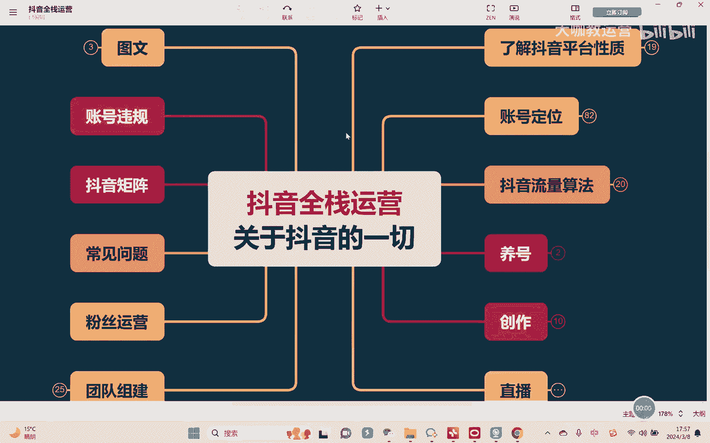

# 【2024B站最强小红书运营系统教程】吊打一切付费课!小红书蓝海市场 2024最值得做的新媒体平台 - P55：24、直播运营：直播间搭建 软件篇 - 大咖教运营 - BV1sn4y1X75u

哈喽大家好，欢迎来到我们的一个抖音全站运营课堂，那么这节课我们继续来去讲直播的具体内容。

呃，上节课呢我们有讲过了摄像设备和灯光设备啊，包括呢它大概的一些用法对吧，OK那么除此以外我们还会有什么呢，比如说收音设备，收音设备是这样嗯，嗯我们也是根据自己条件来，一般情况下最好的我们建议是无线麦。

嗯啊无线耳无线麦也，因为的话呢，首先第一它能够跟着人这这个驱动对吧，我可以带在身上很方便啊，第二的话呢它的一个收音效果呢，也基本上都是比较不错的，呃相对来讲，如果说呃我目前来讲觉得还不错的。

比如说像这个小蜜蜂啊，罗辑啊啊索尼的小蜜蜂啊，都还可以啊，当然了，具体也是根据自己条件来，当然呢呃有的情况下，可能有的人我们会用到这个有线麦，有线麦它的一个好处嗯是在于什么呢。

就在于它不需要说这个呃担心时长的问题，因为无线麦一般我们充完电，大概可以用3~4个小时啊，但是如果说你是特别长时间的这种直播对吧，呃有可能无线麦会顶不住对吧，那么有线麦它的一个好处。

就是它因为是全程插着的，所以他不用担心没电，但是呢因为有些麦呢它是放在那里固定的对吧，那如果说你的这个主播会动来动去啊，或者说呃我的这个直播间可能人好几个对吧，然后有几个主播对不对。

导致每个人可能声音大小不一样，或者等等啊，然后的话呢他的收音范围又会更大一些，那么会有一些影响，那呃当然具体的话呢还是那句话，就根据自身条件来，但是不管你有没有条件，我建议大家无论如何就最差最差。

你搞个耳机就一定要有这个收音设备啊，否则的话呢很多的一些这种杂音，或者说这种这种额这种外面的一些环境音，那么它对整个直播的一个影响还是会很大的啊，就是无论如何要有OK好，再其次就我们有摄像机了对吧。

有灯光设备了啊，然后有收音设备了，七个OK基本上就搞定了，那剩下的就是我们讲什么呢，软件好，软件的话是这样呃，如果说我们正常用手机直播啊，一般呢你也不需要用什么软件对吧，那如果说用到电脑直播。

那我们这话呢这里就会用到我这个什么呢，叫做OBS嗯，当然了，大部分同学我们基本上用不到OBBS啊，一般情况下其实用这个呃直播伴侣就搞定了啊，OBS的话呢呃是比较麻烦的，直播伴侣的话呢。

它是这个抖音自己开发的OBS软件，那直播伴侣大概的用法我可以给你们看一下啊，这个是我们打开一下直播伴侣，然后呢在这里就可以直接点击添加画面啊，点击添加画面，在这里首先去点击添加摄像头。

你如果连了这个呃相机，我可以在这里去找到你的相机对吧，然后呃再或者说我是没有相机，我用手机怎么办呢，那么OK在这里的话，首先第一嗯我去添加素材的时候，大家可以看到这里会有一个什么呢。

会有一个投屏IOS对吧，然后呢你把手机线插上去啊，呃在电脑上呃，插上你的USB数据线，然后呢再插上这个手机，OK那么就可以把你的手机去进行一个投屏，当然还有另外一种，就是我们说呃投屏。

就是把手机投屏效果会更好的方式呢，呃我觉得来讲的话可以用什么呢，可以用另外的一个软件哦，我们叫做这个iv co啊，这个i v com呃，i v c a m i v com这个软件。

你在电脑上下一个这玩这个软件啊，下完之后在这里选择添加摄像头对吧，呃添加完摄像头之后嗯，在这里找到这个every com。

然后呢点击它啊，选中之后OK在这里手机上再把你的iv com给打开，然后就可以了啊，然后就可以了，然后呢你的手机你可以看，比如说我在这里演示一下，然后你就可以看到我手机的整个的画面了对吧。

当然我手机现在是横屏，对不对啊，这就是我们讲他的一个方式好吧，当然我现在关掉好，然后嗯除此以外，就是我们讲相应的一些参数的调整，在这里跟大家去讲一下，呃，首先在这里我们可以选择这个分辨率，分辨率的话呢。

呃根据你的情况来，一般情况下我们就是1080P。

它是够用的对吧，呃因为是这样的，我们一般情况下，其实大部分的品类。

是不建议你把分辨率调的特别高，或者以及还有这个FPS对吧。

帧率调了个时60，一般不建议，因为你本身对于平台，它系统它现在就是会压缩你的画质。

他现在就是30帧了啊，这就是1080P的懂吗，但是呢，呃呃如果说你把它调的这个分辨率调的更高，调到什么4K对吧，它会不会画质体现出来效果更好呢，会的会有会有，但是不完全因为它会和你的灯光效果有关系。

这是我说的的好吧，然后再其次就是你的参数调的越高，那我告诉你，你看你直播的人，他对于他的网速，对于他的这个手机的配置要求也会高对吧，所以如果说大部分的品类，我们一般就是1080P是足以搞定的对吧。

但如果说你说呃嗯我是这种高客单价的对吧，我就是要把我的这个直播间的整个的画面，要有一个质感对吧，要有或或者我们说这种level要的逼格，OK那么你就可以调到更高的一个参数，比如说调到60帧。

调个4K可以的好吧，然后呢视频格式这个呢就是RGB就可以了，色彩空间往大了去选709，色彩范围选择局部啊，这样在展示产品上会更效果更好，然后其他的美颜美妆滤镜这些东西，根据自己情况去设置。

设置完之后在这里选择直播设置，或者在这里去点直播设置都可以啊，然后在这里我们一般就是蓝光对吧，然后就像我刚刚讲的，如果说你想把参数调高，你就选择自定义，然后去找更高的一个参数对吧啊，我因为是用笔记本。

然后呢我现在这个电脑我现在只有这个呃，用手机的话，我这个乘1080P好，然后码率呃，你的电脑配置如果说可以比较高，8000甚至可以拉到1万啊，根据你的电脑配置来对吧，可以拉满没问题。

帧率啊也是根据你的电脑配置来对吧，当然我们说了，一般情况下你30就够啊，你想拉高可以跟可以自己去拉，然后呃视频的编码这里你就是正常的硬编，然后下面有高级设置对吧，然后呢把GPU编码打开啊。

其他的像这个录像啊，自己去调一下这个相应的保存格式好吧，直播间在这里的这个自动截取封面，一般可以打开，允许观众录屏，这个东西一般我们会把它叉掉，不会打开，包括还有观众查看他人资料。

这个东西一般我们也是建议把它给关掉，不打开好吧，呃然后嗯其他的这些基本上就不用管了，那除此以外我们在这里的话呢也可以去选择，比如说像福袋是吧，那福袋的话呃现在来讲你可以发全民福袋。

但是一般其实我们会更建议发粉丝团福袋啊。

因为的话人家要去抢你负担，那他就需要有个粉丝粉丝团嘛，对不对，那可以给你去做数据啊，然后再其次完了之后呃，就是我们说这边会有我们的互动消息。

以及在这里会有我们的这些在线观看人对吧。

那么嗯我们如果说出现了这种啊，比如说很不好的言论的对吧，那你可以在这个关系在线观众榜，这里要去拉黑他啊，然后呢他就不能再说话了，再其次就是我们在开播之前，记得在这里去点选开播设置啊。

开播设置呢要把它打开啊，然后呢比如说在这里去选取你的封面对吧。

然后呢直播间的介绍啊，直播间的介绍。

然后呢直播内容去把它做一些这种啊，要去写一下。

这样子的话呢，呃对于进来看刷到你直播间的人呢，他会更能够知道你这个直播间是做什么的，或者有什么特色，或者说有可能就吸引到他好吧。

然后再其次建议就是大家每次在开播之前，把本地录制给打开，这样子能够方便我们在每一次直播结束之后，然后去根据自己的录屏去复盘啊，然后呢去做更多的优化好。

那么这节课的话呢我们就讲到这里啊。