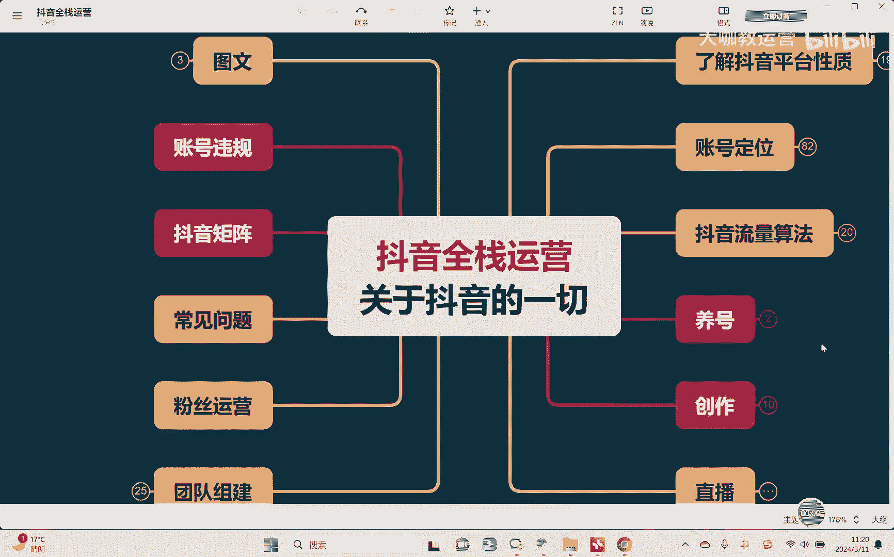
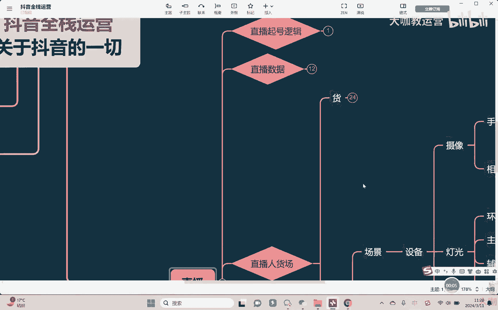
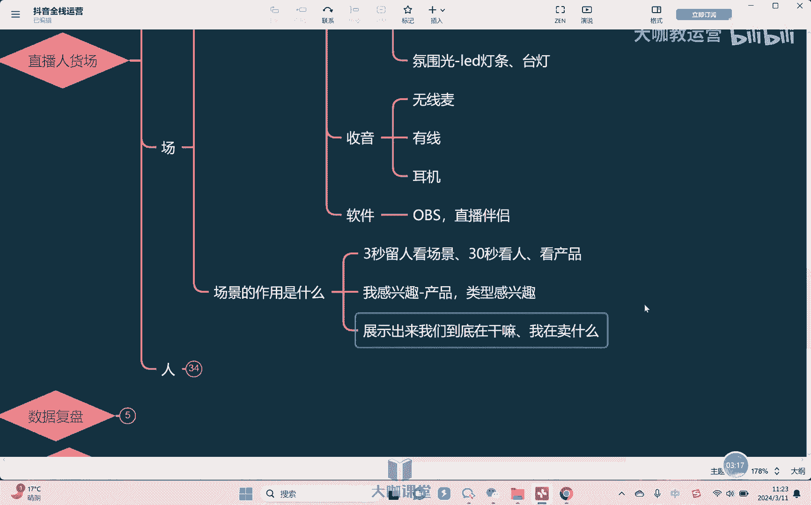
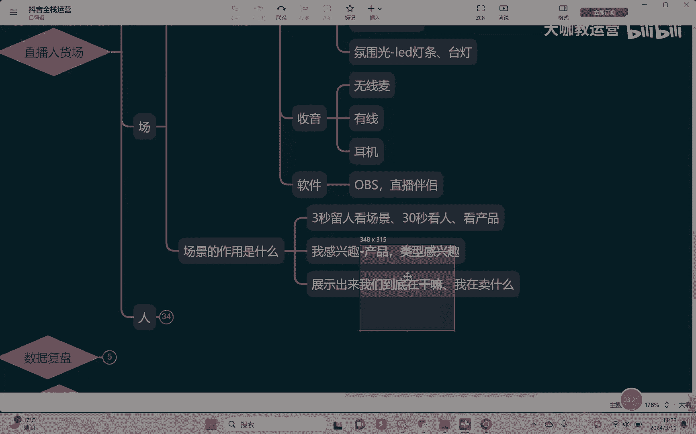
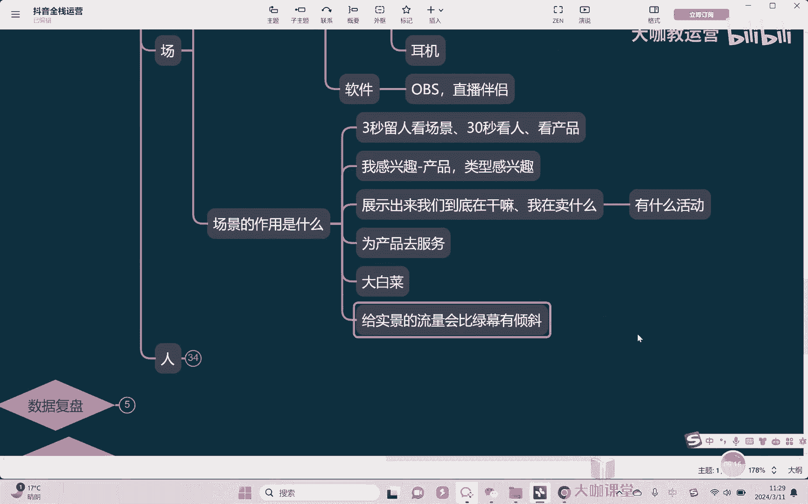

# 【2024B站最强小红书运营系统教程】吊打一切付费课!小红书蓝海市场 2024最值得做的新媒体平台 - P56：25、直播运营：直播间高转化场景搭建技巧 - 大咖教运营 - BV1sn4y1X75u

哈喽大家好，欢迎来到我们的抖音全占英云课堂，那继续这节课来讲我们的一个直播，关于场景相关的内容。

在之前的话我们已经讲了，关于场景整体大概是怎样去不准对吧，需要哪些设备啊，分别的话呢呃包括OP软OBS软件，它是怎么去用，那我们现在要去解决一个问题，就是场景，我们到底应该搭建什么样的一个场景啊。

因为我们尤其是很多的这个新团队，不成熟的一些这种团队，他会出现一个很直观的一个问题啊，就在我见过的绝大部分的这种呃，新手的这种直播间团队，他都会遇到这个问题，就是一旦最后直播间卖的不好，结果不好。

那么问题导向是谁，就是会怪到主播的身上对吧，那如果说主播是自己在外面招的，那这个时候就会非常严重的去影响主播，他的一个不稳定性对吧，最后导致整个的一个直播项目，可能就呃草草收尾啊，这是很多的一个问题。

但事实上我们说很多时候卖的不好，真的不一定是主播的问题，但他是各个方面的，所以我们才会去讲货场人等等，那场景在这上面，你说作用大嘛，其实也不小啊，不能说很大，但也不小，因为首先第一直播的场景作用是什么。

我们有句话叫什么呢，叫做三秒留人看场景嗯，然后呢30秒留人看什么，看主播话术也就看人在，至于说想一分钟2分钟这样去留人看什么，看产品本身啊，所以那这个就是我们说的嗯，第一层是什么，其实就是场景对吧。

因为我们也知道在整个的数据的漏斗里面，第一层是什么，就是我们说先有厂关，有了厂关才会有商品的点击，才会有下单，最后再购买对吧，最后再去所谓的什么产生复购等等，那所以你看在最开始的时候，我们人在哪里对吧。

在这个直播间的外面，也就是我们说会开始有这个推荐的页面，推荐给这个用户，对不对，那如何能够让用户从推荐的这个页面，然后点进直播间呢，其实这个时候就是看什么，就是看我们的一个场景对吧，那大家回想一下。

我们是电商直播间，什么情况下我们会去点进这个直播间，去看什么情况下回旋就是什么，就是我感兴趣嗯，我对什么感兴趣，我一定是什么，我是对什么产感兴趣，感，对产品感兴趣对吧，或者说是类型感兴趣，对不对。

就是我对于这个类型的，或者卖这一类货的这种直播间我感兴趣，所以我才会点你进直播间去看看，他到底在说什么，他到底在卖什么对吧，所以你看这就是出现了，我们说场景的第一个作用，我们要去做的是什么。

就是要去展示出来嗯，我们到底在干嘛对吧，以及或者我们在卖什么，嗯因为我们举举个呃，因为要跟他去理解一个事情，就是嗯直播间外面的很多人，不一定是我们需要的，我们需要的是什么，是对我们在卖的东西。

我们在搞的这个活动感兴趣的人，对不对，所以这个时候我们直播间首先你一定要什么。

你一定要去体现出我们在卖什么产品，对我们这个产品不感兴趣的人，我需要他进来吗，各位作为电商直播间，说实话不需要懂吗，因为他进来之后，他贡献不出好的数据，OK那他只会去拉低我们整个直播间。

他的一个数据反而对我们来讲影响不好啊，所以我们需要的是什么，是我们说的是精准的人群，进来之后，他能够给我去有数据反馈的对吧，对我的直播间的数据有正影响的，所以第一个事情。

我一定要让这些人是知道我在卖什么的，他对我这个东西有兴趣，他才会进来对吧，所以第一我在卖什么，我就要通过直播给他体现出来，对不对，我是卖衣服的，我的直播间的场景。

就比如说什么会有很多的衣服去放在那里对吧，主播一定是穿着好看的衣服，就是正在卖的衣服穿在上面的，对不对，我如果是卖什么这种土特产的，我的直播间打造的氛围，就需要是土特产的一个感觉对吧，OK好。

那第二就是什么，就是我们在干嘛，对不对，也就是所谓的我们有什么活动嗯。

因为这个时候是这样，很多时候我们可能对一个东西啊不一定感兴趣，或者说有兴趣，但是这个兴趣不强，他不是我急需的，因为这就是我们讲的抖音，它本身和货架电商，淘宝京东这些不一样对吧，他是兴趣电商。

所以很多时候我们会发现在抖音上面去下单，不一定是因为我需要这个东西，所以我去买，而是因为什么，而是因为他讲的确实挺好对吧，它引起了我的兴趣，对不对，或者他活动给我的感觉活动力度很大，所以我去买了。

所以我们除了说要体现出我们在卖什么，第二就是我们现在正在搞的这个活动，要把它体现出来对吧，所以我们经常会看到，比如我今天搞特价九块九买一件衣服，对不对，我就会把它大大的贴在我的直播间。

让所有人一看到我的这个直播间的时候，会看到九块九特价，今天来就能抢得到活动，对不对，所以这是我们直播间场景，首先要去做的两个事情啊，第二就是我们想如我们的场景是要为什么，我们的，因为我们是电商直播间。

我们核心为了卖货，所以我们的一切是为什么为嗯产品去服务的，嗯懂吗，为产品去服务，所以我们的场景不能说去抢我们的产品，而是为了干嘛，而是去烘托什么样的产品，我给大家去举一个很很简单的例子嗯，对不对。

比如说我今天如果说我是去卖一个大白菜，嗯对吧，我不说别的，我就是去卖大白菜，嗯好那同样两个直播间，第一第一第一个直播间，他是在，比如我们说很漂亮的这种呃这种直播间对吧，然后呢一个专家一样的人跟我去讲。

我们家的这个大白菜啊，是我们这个研发出来的这个新品，对不对，然后呢有各种各样的一些营养啊，这是哪里哪里非常好，OK第二种直播间是什么好，第二种直播间就是他很，它没有任何那种精致的东西，它就是直接在哪里。

直接在大白菜的那个地里面直播，懂吗，一边去挖啊，在那个土里面把大白菜挖出来，那个大白菜上面还沾了很多的土，看着也不干净，对不对，然后我们在里面呃，然后下面的人在里面去问我现在的大白菜，他说好。

那我现在立马就给你发货，对吧，好来我现在摘一坨，你看这个你要不要对吧，就把这图发给你好不好，来各位告诉我，这种情况下，我们大概率会去选哪个大白菜，我们觉得更好，我们不说一定的。

因为第一种一定是有人买对吧，但是我们会觉得什么呢，大概率我们去对比的时候，大部分人会选择第二种，为什么，因为它在服务于什么场景，服务于了它的一个产品，我会觉得那个大白菜一定是新鲜的对吧。

我甚至觉得他那个大白菜根本就没，绝对是没有打农药的，非常的健康，非常的绿色，对不对，我然后所以这就是我们讲的场景，你需要服务于你这个产品本身，它的契合度啊，一定要够明白吗，一定要够，当然了。

你说我是美妆的护肤的，那我的这个这个我就要体现出什么，我就体现出相对精致一点的感觉对吧，要看着好看一些，如果是高客单价的对吧，比如说我卖什么香云纱这种衣服，卖什么绿这种玉石珠宝类的对吧，那么这种情况下。

我就需要让我的这个直播间看上去更加的什么，高档有气质一点，所以他一定是有什么有一个契合啊，去服务于产品本身，所以讲这是我们说场景，它的一个搭配的一个作用，以及我们通常去做的一个事形式，那具体场景用哪个。

是用实景还是用绿幕，我首先可以告诉大家，对于这个抖音本身它的官方来讲，他给十几嗯，给实景的流量会比嗯虚谨，也就是我们讲绿幕嗯，有在自然流量上会有什么会有倾斜啊，虽然抖音官方没有去讲。

但是抖音官方其实也变相告诉你他在说什么，他说记希望他鼓励的是记录美好生活，所以他事，事实上他在流量的给自然流量上面去给的时候，它是会有一定倾斜的，嗯对吧，当然了，这个东西也需要看你去有什么对吧。

就是我们讲如果说我有这样的，比如说我有这个渠道，我有这个工厂，对不对，或者说呢我有我们说像我们说卖水果，我有果园，对吧啊，卖鸡我有七个妓院，对不对，我有等等，我有这样的一些优势，我当然可以拿来用。

如果没有怎么办，那还是要根据一个事实情况，对不对，所以呢这个场景我们就是什么，我们根据现实情况，尽量的去把这个优势去给它放大化，那这是我们讲在场景整个的一个设置上，去做的一些事情好吧。

所以呢场景本身首先它其实也是非常重要的。

也希望大家去能够去相对重视一点好，那这节课的话呢，我们就到这里，下节课。