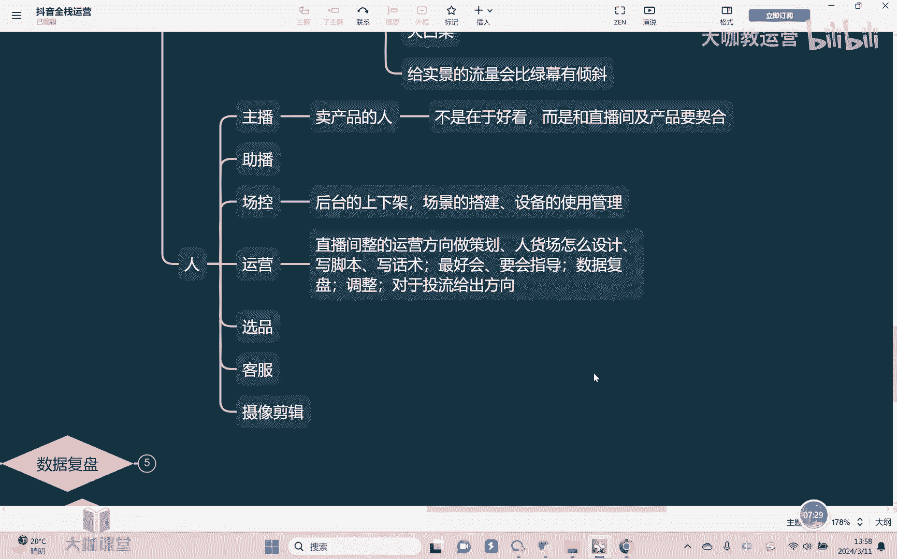

# 【2024B站最强小红书运营系统教程】吊打一切付费课!小红书蓝海市场 2024最值得做的新媒体平台 - P57：26、直播运营：直播搭建中的人员配置及工作细分 - 大咖教运营 - BV1sn4y1X75u

哈喽大家好，欢迎来到我们的抖音全站运营课堂，那继续来讲我们直播的人货场的板块啊。

上节课的话呢我们已经讲了场景对吧，呃场景整体的话呢，以基本基本上给大家去讲完了，那么最后说到一个人的板块啊，人的话呢首先第一我们来讲一下人员配置呃，首先第一个也就是大家比较熟悉的主播嘛对吧。

那么主播呢他主要负责，相当于是在产这个镜头面前卖产品的人啊，呃所以的话呢那么主播第一你要懂产品对吧，对于产品本身呢，你要非常能够呃，对于它的各方面，不管是从这个实用也好对吧，从他的这个材质也好。

产品总之对于产品你要非常的熟悉，对不对，第二就是呢你在直播间啊，你要这个什么，我们说比较哎有氛围，你能够把这个氛围把节奏带起来对吧，因为我们有经常说需要这个拉货动，而且的话呢在这个网上想让人下单。

那你就需要把这个呃氛围搞起来，让人家有这种呃紧张，或者说呢激动的这种一种感觉，你要营造的出来，对不对，所以主播你作为出镜的人，一定能有一定的表演能力啊，呃然后其次第二点就是我们来讨论一个问，题。

主播对于长相有没有要求对吧，对于外或者我们说对于外貌有没有要求，那大部分情况下我们要求不高，但是要有啊，或者我们讲我们对于主播的要求，从来不是在什么，不是在于好看嗯，而是什么呢。

而是和直播间即产品要什么要契合，对不对，你搞个身材非常好，非常哇塞的这种黑丝美女在直播间去直播啊，跳舞也好对吧，走秀也好，有没有人看，一定有人看，对不对，流量不会差，但是嗯问题在于你这样子情况下。

你吸引进来的客户，他会买你的产品吗，对不对，你让他去卖个什么土鸡土鸭的，你让他去卖个水果白菜的，你能卖吗，卖不了，对不对，所以更重要的是什么呢，在于和你的产品要契合，对不对，但是你换句话说。

我们说卖这种女装，有时候或者说呃精致的这种什么化妆品护肤品，如果说你自己主播都长得不怎么样对吧，皮肤也很差，你告诉我你卖这样的产品，你觉得有说服力吗，也没有，对不对，所以更重要看的是你的产品本身。

看的是你直播间本身，他是否和这个主播，他的一个长相一定要契合，这是我们讲好吧。

OK那主播完了还有什么呢，还有我们讲有的情况下我们可能需要住火，那至于助播，其实他需要具备的能力是什么能力，就是我们讲主播的所有能力，助播都是需要去具备的对吧，大部分情况下他和主播会一起出镜，对不对。

作为一个什么呢，帮忙去把控节奏对吧，有时候主播不知道这个节奏怎么弄啊，主播可以帮忙，对不对，然后呢其次帮忙去喊话啊对话，然后的话呢能够拉直播间的氛围对吧，但是如果一旦当主播不在的时候，主播生个病。

对不对，主播今天身体不舒服啊，主播说我这个呃直播直到一半对吧，我这个要上厕所等等都有可能对吧，那这个时候主播要随时能够去顶替主播，做所有的工作，对不对好，那除此以外。

主播和主播也不光只是单纯是一个直播啊，然后的话呢呃大部分情况下，我们也需要干什么呢，比如说短视频的这个账号，短视频的拍摄对吧，也需要去帮忙，对不对，然后其次呢，呃直播完之后的这个数据复盘也需要一起。

对不对，因为要有个提升了对吧，那好的优秀语言的主播呢，是会自己去写话术的啊，然后呢这是我们讲主播和注部的部分。

那还有一个就是什么呢，场控嗯，因为大部分情况下主播会干什么呢，主助博主要的一个工作还是去在直播间去啊，帮着主播去抬整个的一个节奏和一个氛围对吧，那这个工作呢在人员这个有限的情况下。

我们会让谁外会让场控来去做，那他的一个主要工作是什么呢，比如说后台的上下架啊，后台里的产品的链接对吧，SSKU对不对，库存价格他去进行一个调控对吧，然后直播间场景的搭建，设备的使用，管理对吧。

整个后台的操作全部是由场控来，对不对，那呃优秀一点的场控就是我们说往谁方向，往什么方向走，往运营的方向走啊。

往运营的方向走嗯，所以的话呢优秀的场控后期就会干嘛，他会去把控整个直播间的一个节奏了啊，整个直播间的一个运营方向，以及说直播间啊它的这个数据的一个分析，然后呢来去给在直播的过程当中。

给主播去做一些调整对吧，那运营首先你对于直播间的整体嗯，整体的运营，方向做策划嗯对吧，嗯人或厂怎么设计，全部是由你运营来去负责，他就相当于是个导演，对不对，包括写脚本对吧。

写话术这些是居委的一个基本能力，那你至于说什么场景，灯光设备这些东西，包括后台操作会不会需要呢，最好是会嗯对吧，但是你说不会，但是可不可以可以可以不会，但是同但是有一个前提就是我们说了运营。

你是作为什么，你是作为一个指导的角色，所以你要知道用什么效果，要会干嘛，要会进行一个指导工作，嗯对不对，你不能说我什么都不会对吧，但你起码你要知道往什么方向去进行个指导，对不对。

你可以不用自己去干活嘛，嗯啊所以呃我们说主播和场控，其实越往后面去走，他都是越往运营的方向去做的啊，那同时优秀的运营还要干嘛呢，还要去根据每一场直播的一个数据，不光要带着全体人去复盘。

而且在直播的过程当中要根据数据的变化波动，要去做出调整，嗯啊把直播间的几个节奏看如何去把控，另外对于头牛嗯，你也是需要有懂的对吧，因为大家知道越在现在越来越卷的情况下，直播的头流一定要和直播间的人货场。

他要是去匹配的，他要去对应的，所以对于头牛，即便你不会，你也要能够给出方向，嗯这是我们去讲的啊。

你要去给出方向，当然了，如果说会投肯定是最好的。

对不对，然后那除此以外，这是我们说基本的配置，那当然还有一些其他的情况啊，比如说如果说团队做大以后什么选品对吧，然后的话呢呃还有像这个呃客服对吧。

还有的话呢如果说后期哎再增加了。

还有什么这个摄像，专门的这种摄像剪辑对吧，等等这样的一些相应的配置，那这些配置的话呢，我们讲他都并不是一些必须的额，所有人员的配置，他只是说那它其实类似于是设备是一样的对吧。

我们有最基本的能不能播也能播。

对不对，一般情况下你像我们说小团队，你不需要太多人，两个人，一个主播，一个场控对吧，场控就相当于是一个运营，同时呢负责技术方面的场控去做对吧，然后呢主播的这种呃这种直播间的这种对话，抬节奏也可以用。

场播场控在后台操控的时候就帮忙去做了对吧，然后呢主播在镜头面前去播，对不对，所以你看两个人也能播，甚至于我们讲再差一点，一个人一台手机能不能直播也能直播，能不能卖得出货，也能卖得出货，对不对。

所以人员不要说一上来你就铺的很大啊。

没有这个必要，对不对，专关键是在于什么呢，关键你要在于专业的人干专业的事对吧，而且尤其像这个主播。

我们在刚开始的时候，总是会去招一些这种呃主播对吧，但事实上其实我给出一个建议，就是呃新团队对吧，老板自己有产品，然后呢想去做直播间，其实我更加建议什么，就是老板自己来去做，因为你老板自己去做，对不对。

你更好去把控你的老板去做很多的事情，你会发现很多东西你自己能说了算，你想干就干对吧，不想干就不干不对，不像你自己外面去招个运营，招个场控，我说我要买设备对吧，我说我要去头牛等等。

我还要跟你去老板去报对吧，最后你跟老板能不能达成一致，不一定对不对啊，所以我是很建议说老板自己亲自去做这件事情，而且对于你账号的人设打造也会非常有帮助，好吧，所以这是我们讲人员配置的一部分。

这节课我们就讲到这里，好吧啊，然后呢呃下节课我们再继续来去讲。

