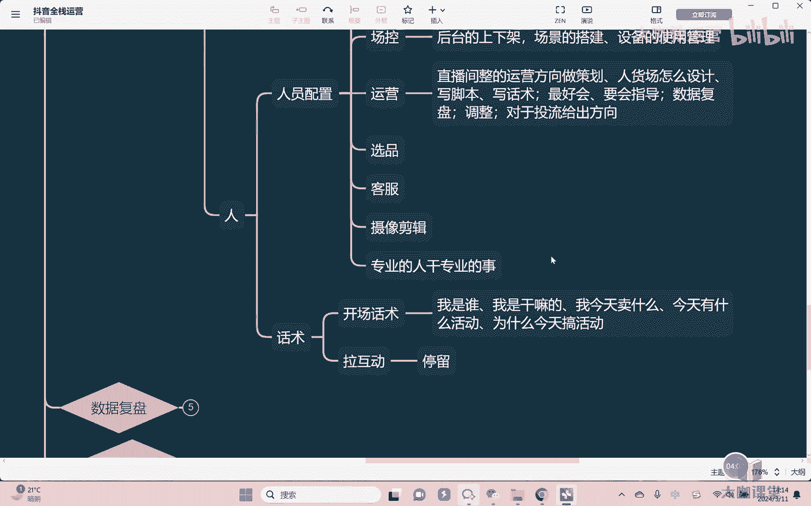

# 【2024B站最强小红书运营系统教程】吊打一切付费课!小红书蓝海市场 2024最值得做的新媒体平台 - P58：27、直播运营-话术篇：主播开场话术训练 - 大咖教运营 - BV1sn4y1X75u

Hello，大家好，欢迎来到抖音的全程运营课堂，然后我们继续来去讲关于直播当中人的部分啊。

上节课我们讲了人员配置对吧，那么在整个的直播间当中，我们关于人的这个部分呢。

其实主要是在于什么呢，主要核心还是在于主播啊，因为主播是在这个镜头面前卖货的这个人嘛，对不对，所以呢那么关于主播，我们更多主要是在于什么呢。

在于他的一个话术啊，呃也就是我们讲你到底要讲什么东西，对不对，至于说怎么讲，那是我们后面再去讲啊，主播你的一个演绎能能力也好，或者说你的这个呃语音语调对不对，抑扬顿挫镜头能力啊。

包括镜头面前的一些动作和行为啊，这个我们后面再去讲，首先第一个就是话术本身，对不对啊，那么话术OK我们怎么来去讲嘛，对不对，因为同样的这个产品在不同的人嘴里，它卖出来的这个效果就会完全不一样。

我们就拿一个正常的正价品的，整个讲解流程来给大家去讲，首先一开始，我们在刚开始去这个开直播间的时候，我们上来就卖产品吧，肯定不会，对不对，所以刚开始的时候，我们直播间呢会慢慢的陆陆续续的进人。

这个时候人不会多啊，因为我们通常直播间是5分钟，嗯啧啧，就是平台是5分钟一推流啊，所以呢5分钟是一个节点啊，那么首先刚开始的时候，我们直播间需要开了个，你可能开个大概三到5分钟。

直播间才会慢慢真的进来人对吧，当然如果说你上一节呃，上一次直播间你是卡黄线对吧，然后的话这届这次这个呃，呃这上次开卡完线下播之后呢，这次可能刚开播，大概可能两到3分钟，三到5分钟他会给你一波极速流。

对不对，但是呢在极速流来之前，你是没有太多流量的，那这个时候我们先去干嘛呢，这是开场的话术嗯，那这个时候我们要讲什么，刚开始进来的人可能很多，他不了解我们，对不对，没有没有这个呃来买过东西。

第一次进直播间，所以第一你要先讲清楚我是谁嗯，我是干嘛的嗯，我今天卖什么，对不对，然后今天有什么活动嗯对吧，这些东西首先让人家知道清楚，哎你是谁，对不对，你卖什么对吧，你有什么活动，其次还有一点很重要。

这是什么，就是为什么今天，搞活动，嗯啊就是我们很多人，很多同学这个这块其实都会对吧，就是呃知道刚开始直播的时候呢，先跟大家去哎讲一下，哎，大家好啊，我今天是干嘛干嘛的，对不对，所以我们今天。

那我们今天呢要搞一个非常大的活动，大家的话呢啊赶紧点点关注对吧，但是你要讲一下，你今天为什么要搞活动，对不对，因为我们说电商嘛天天都在过节，今天这个活动，明天那个活动你可以没有问题，你可以搞活动。

但是你对于自己来讲，你还是要讲清楚，我今天活动总有个理由，对不对，不然的话别人凭什么相信你会在搞活动呢，对不对。

OK好，开场完了之后，接着我们要干嘛，是不是就开始拉互动了，嗯对吧，为什么，因为我要拉数据啊，我要让有人进来我的直播间之后，我得首先干嘛呢，先停留嘛，对不对，其实很简单一点啊，大家先别急，对不对。

我今天搞了活动，所以呢大家先不要急，你就听我讲一分钟，对啊，我今天这个产品我今天100块钱不要了，就九块九送大家，但是你们先停，我一停个十秒钟时间，十秒钟时间我给你们去讲一下这个产品。

为什么我今天搞了个活动，他今天为什么就九块九就能卖，为什么我说它值100块钱，对不对，所以你要先拉活动啊，先拉停留，这是第一个事情，拉完停留之后开始去互动对吧，九块九的东西，OK我要把数据做起来。

我直播间要有更多的人对吧，所以你会看到我们开始什么哎，大家想不想要想要的扣一对吧，想要的扣一哎，然后呢。

比如说一件衣服今天九块九想要你就扣要对吧，磕完之后我可以干嘛，大家要学会一点叫做拉多次互动，尤其是你刚开始直播呢，大家前期这个直播间人数不多的时候，人数少的时候就更要学会去拉多次活动。

因为你本身人数就有限对吧，你的场宽就有限，OK所以你就要想办法，把你的精准用户多利用起来，但凡一个人愿意跟你互动，一次，能给你扣一个一，你就想你就放心，他一定能够可以，他就一定能给你扣三个一对吧。

他能给你扣三个一，OK他就能给你扣五个一，他还能给你点关注，他还能给你亮灯牌懂吗，所以嗯一定要学会拉多次互动，举个例子，我卖一件衣服对吧，今天我说这个衣服九块九，大家想不想要，你可以扣个样子，对不对。

好扣完腰子，第二好来没问题，大家都想要，那么我想问一下大家是什么样的一个尺码，我给大家看一下尺码好吧，来大家把尺码抠出来对吧，他扣了一，他会不会扣尺码，他百分之百会扣尺码，对不对，扣完尺码之后。

OK好来大家想要什么颜色，蓝色红色，白色黄色，大家想要哪个颜色，我算一下后台的库存，对不对，想要红色多，我们就上多上红色的，对不对，想要蓝色多，我们车多上蓝色的对吧，颜色又可以扣。

看完之后我再给大家去来，大家问一下，你们都是发货发到哪里，我看一下后台的这个发货能不能发，对吧啊，重庆的，黑龙江的，山东的，江西的，对不对，扣这不是第四次互动了对吧，最后还有一遍来最后一遍。

大家把关注点上对吧，然后现在马上最后一个在直播间扣一个上车，我立马就上车，对所以你看我这还没有讲的特别复杂，我简单一讲，你会发现一个人身上你就可以拉五次互动，对不对，所以拉互动这块你一定要讲出来。

你要会拉多次互动，但在拉互动这块大家一定要记住一点，就是什么呢，嗯要给出嗯利益，我们讲互动有哪些东西停留点赞评论，当然点赞，这里的话我们基本不算电商，直播间呢，基本上不考核点赞啊。

评论关注亮灯牌粉丝团对吧，主要是这些东西，那我们讲这些东西要花钱吗，不用花手手点一点就可以了，对不对，好当然了，粉丝粉丝团的话要一个抖币，当然了，你说一个抖币也就是一毛钱吧，可能就对不对。

也没有任何的这个东西，但是我想请问一下，你会发现即便如此，没有什么负担，没有什么多大代价的一个事情，你会发现为什么有人就是拉不出来互动，那为什么对，所以核心点在这里嘛，就是给出利益。

因为我见过很多很多的新手镯啊，然后呢你跟他去讲，哎你要学会拉互动啊，然后呢他又会跟你讲哦，好那我拉互动，然后呢唉大家呢点一点关注，点一点亮一亮灯牌啊。

所以你一定要把什么，你一定要把，就是你要知道用户虽然说只是轻轻的手点一下，但是他付出了嗯，对不对，他付出人是这样的人，只要付出你进需要什么一定要回报，所以你就必须要把他能够得到的好处。

和他的这些付出拉出什么呀，拉出强关联性嗯，嗯就是当然有的同学这个时候会讲啊，那现在的话呢平台有政策对吧，不能别单，对不对，毕业单有相应的空，同学我想问一下你有没有遇到过风控，如果你连风控你都没遇到过。

你担心什么违规，担心什么别单违规呢，不用担心对吧，你先要先去拉互动，你才有可能违规，如果你都没有拉过互动，你你担心什么违规呢，嗯没有对吧，所以我们讲了，你就是要有强烈关联性，当然了啊，顺带一提。

所谓的这个编单违规那块是指的是你讲的东西，最后没有上啊，最后呢没有按照你的这个行为来，对不对，所以呢那个才会，所以我们说憋蛋能不能编，一样能憋，只是你要注意一下东西而已啊。

好所以这种我们讲的你想要去拉互动，就必须要把互动和他们能够获得到的好处。

利益要做出强关联性懂吗，所以这种讲拉互动是吧，拉完互动之后干嘛就直接开款吗，还没有。

对不对，所以我们来剩下的内容。