# 【2024B站最强小红书运营系统教程】吊打一切付费课!小红书蓝海市场 2024最值得做的新媒体平台 - P59：28、直播运营-话术篇：优秀的讲品话术 - 大咖教运营 - BV1sn4y1X75u

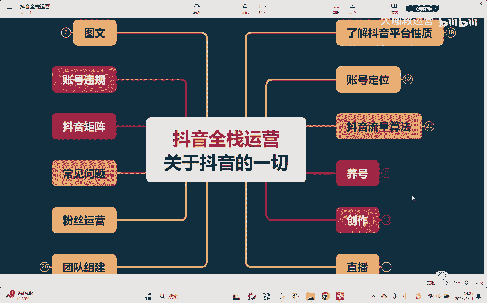

Hello，大家好，欢迎来到我们的抖音全站运营课堂，回来继续讲到我们上节课讲的这个话术馆板块。

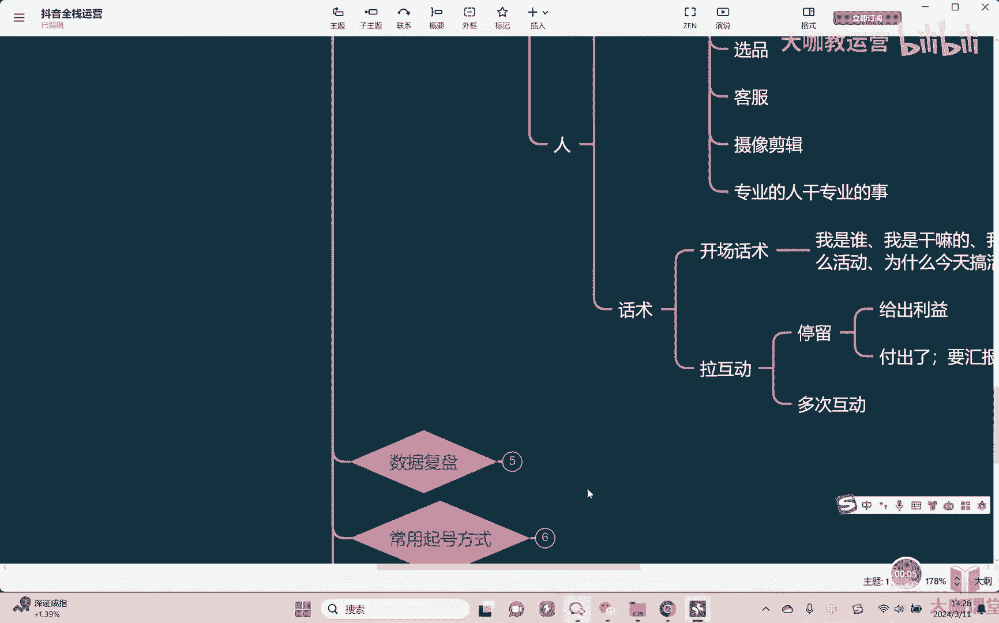

上节课呢我们已经讲完了对吧，正常的一个品开场讲完之后拉活动对吧好。

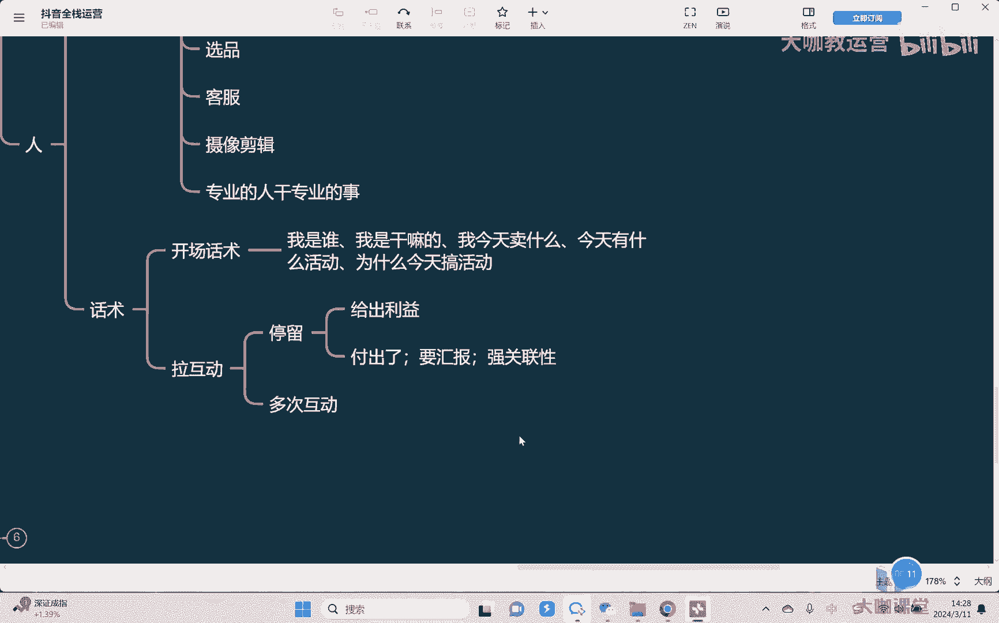

拉完互动之后，我们肯定是干嘛不能立马上车啊，对不对，不可能立马我就把产品挂上去卖，对不对，所以虽然我们可能说今天搞活动搞得很很，活动力度大对吧，价格呢确实很低，对不对，但是即便价格再低。

他有人也会不愿意买单，为什么，因为你这个东西好不好，需不我需不需要。

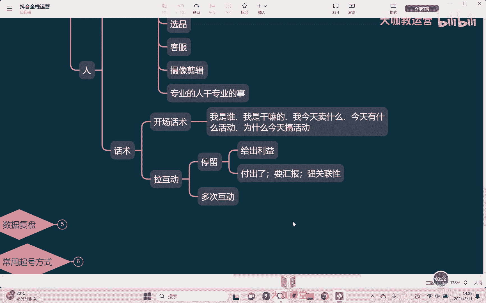

我不知道对不对，所以我们既然卖产品关键很重要的点在干嘛，就是在于奖品嘛，嗯对不对，你要讲解你的产品，那怎么讲呢，讲我的产品哪里好对吗，讲这里好那里好，哎对首先第一没问题。

这是我们说第一点一定要讲的就是产品的卖点，这是我们要求讲的对，所以为所谓这个卖点，也就是我们讲的自己的产品的优势对吧，我的东西哪里好啊，我们哪里可以讲就是卖点，可以讲哪些部分呢，比如说我的工艺对吧。

我的材质，我的这个成分配方对不对，我的这个什么原产地啊，发货等等啊，当然还有一些其他的，比如说我可以对比于其他的基金呃，同类型的这些产品，我的价格低对吧，我性价比高，我的物流对吧，我的冷链等等。

这些都可以是我的卖点，总而言之就是我的产品哪里好，那大家对于自己的产品肯定是最为熟悉的，所以关于卖点这块，其实我相信不需要我跟他去讲太多对吧，如何去讲解自己的产品哪里好，大家都会去讲，对不对。

无非是不同类型的啊，你要去注意一下，比如说服饰的嗯，你要去讲版型嗯对吧，然后呢呃这个大小尺码一定要讲清楚，对不对，然后什么呃食品类的，那么它的一个材质啊，最好能够拿出检验报告出来，对不对。

然后呢什么样的人能吃，什么样的人不能吃，对不对，什么保健品，你就得讲清楚它大概的一个功效对吧，所以不同的产品他要讲的东西不一样，OK但是有一点各位我想问一下，我们但凡是懂一点销售，懂一点营销的。

应该都很清楚，所有的产品想卖出去，不光是不能说只是我的产品好，就会有人买，不一定吧，对不对，你产品再好。

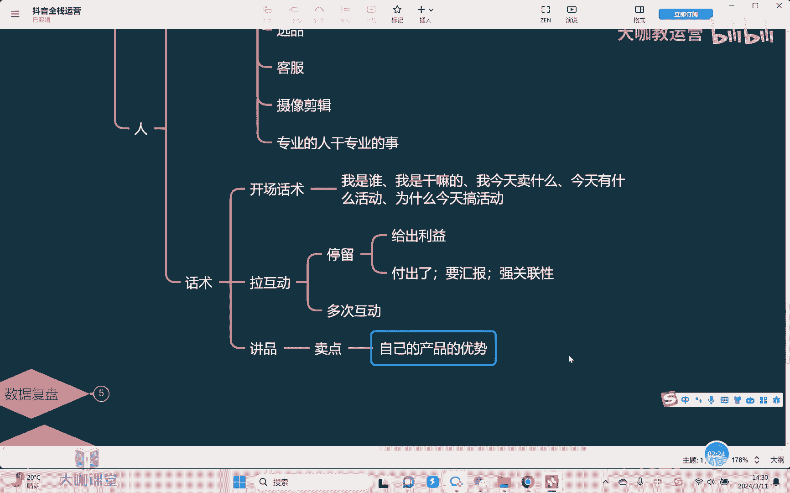

我就一定得买嘛，不一定还得看我需不需要对吧，所以在讲产品的时候，为什么有人讲产品讲得好，有人讲产品讲的不好，有一大非常大的点在于什么呢，在于痛点，话术，痛点话术对不对，那痛点话术所谓痛点是什么。

就是这个人来讲他需不需要，也就是我们讲需求要找需求嗯，对不对，任何东西都是一样，只有当我需要的时候对吧，我才是说我愿意花钱去买，对不对，一个包子值钱吗，不值钱，两块钱一个对吧。

但是当我饿得什么东西都没有吃的时候，诶这个包子在我眼里就是什么，就是我已经快饿的不行了，这个包子在我眼里，那他就是一个无价之宝，所以这是我们讲的需求不一样对所以痛点话术。

这是我们讲在拉开不同的这种话术的这种，我说级别或者说好这个呃，这块啊就非常重要了啊，那么如何去讲痛点话术呢，就还是一点，一定要把这个东西能解决的问题给找出来，再其次就是我们讲人群。

一定要知道你你的产品是卖给谁的，帮他解决的是什么问题对吧，举个很简单的例子嗯，我的这个你如果说我是一个呃油烟机对吧，我洗一个洗这个抽油烟机，抽油烟机，那么我的优势是在于我的这个什么吸力强，对不对好。

那吸力强是我的一个什么卖点嗯，对不对，但是你光吸力强东西好啊，而且静音功率大，对不对，这是我们讲你的卖点，但是我一定要买吗，不一定对不对，当然你可以跟我说，你价格很便宜，但是我还是不一定买。

因为我需不需要这个东西呢，不知道对吧，但是如果说你换一个场景举个例子，我如果说来各位你假如我想问一下，直播间有没有这个平每天在家里负责做饭的，这个属于是家庭妇女的这种妈妈是吧，有没有如果有的。

扣一个小一来，我想问一下，如果说大家平时在家里做饭，有没有遇到过这种问题，就是你做完饭之后身上一股油烟味对吧，下班之后老公回来了，孩子回来了，就说你身上一股油烟味对吧，你是不是没有洗澡等等对吧。

就是类似这个意思，那大家有没有有的话就扣个一来，我告诉大家，我们这款油烟机，虽然可能价格比同类型的这个产品，要稍微高一点对吧，但是为什么会高一点，各位因为它能够干嘛吸油烟。

我们的这个吸油烟机用了怎样的一个方法，它能够让这个呃有不光说能够吸烟都吸进去，而且的话它因为它的一个嚼口的一个设计，所以它可以让我们自己在做饭的时候，身上不会沾留任何的一个油烟味。

你做饭之后身上不会有任何的味道对吧，能够解决你这样的问题，来各位，我想问一下，如果你有这样的问题，你告诉我这个吸油烟机你会不会感兴趣，你会发现明显你的兴趣就大一些了，对不对，所以讲痛点话术。

第一你要知道你的产品它对应的卖点，他这些卖点体现出来，最终他能解决什么问题，你说你的版型好，它能解决什么问题，它能够帮你啊，去是吧，显瘦去遮屁股对吧，显能遮你的这什么遮腰，对不对。

你的裤子能够显你的腿长对吧，你卖的这个即食用品它能够解决什么问题，能够解决我们说家庭妇女妈妈对吧，或者说平时放假在家里不想做饭，早上不知道起来，不知道吃什么的，能解决他这些问题，然后这些人才会能够干嘛。

才能够去说，觉得你这个东西对我来讲有用有帮助，我才有必要买，即便你可能价格不一定那么贵，不一定那么便宜，嗯对吧，但是如果说这个时候你的价格还便宜，那对我来讲就非常非常好，那我就干嘛，我可能就会立马下单。

对吧好，这是我们讲卖点话术和痛点话术，那还需要讲些什么东西呢，因为我们刚刚讲的东西都什么都很硬，对不对，我们讲的东西都很硬。

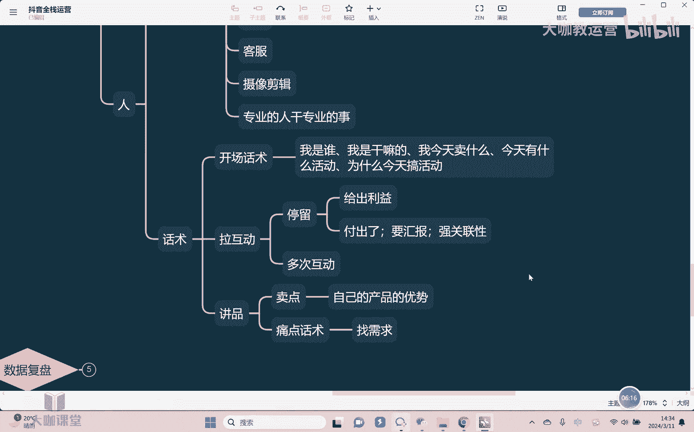

都是哎一就是一，二就是2K加点什么啊，想让人听得舒服。

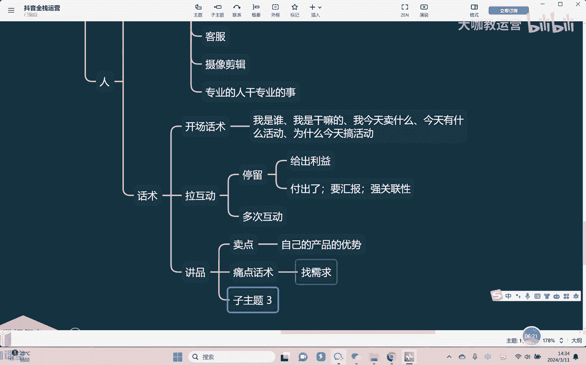

对不对，那你就需要想讲到人的心里，你就要加什么加点柔的东西，也就我们讲做叫做场景话术，你都已经跟大家去讲了，你的东西哪里好，能够解决什么样的问题，最后你是不是还得告诉人家你是怎么去嗯使用。

使用后嗯的什么效果是怎样的，对不对嗯，很简单，使用后的效果。

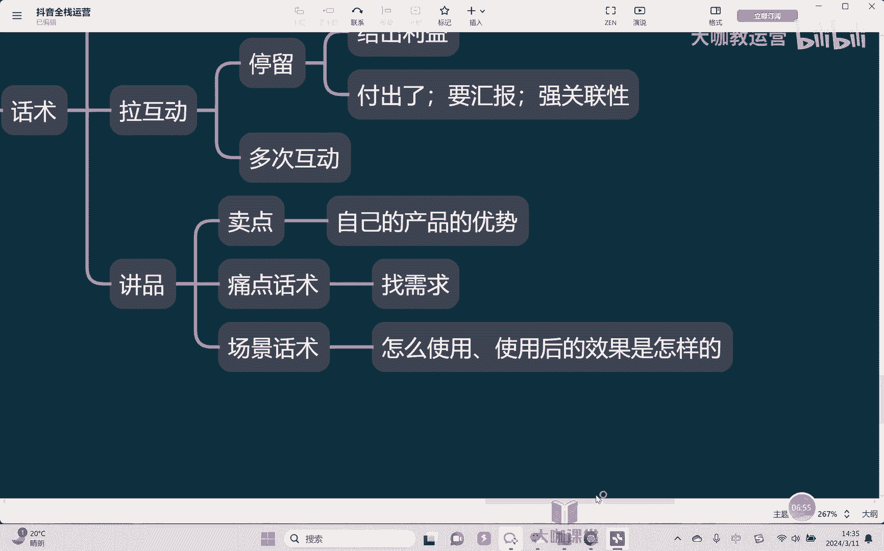

也就是我们讲如何去描述这样的一个使用效果，你就会感觉好像这个东西，它赋予的价值就是不一样的对吧，举个很简单例子，比如说我们去买一款牙膏对吧，一款牙膏我们说刷完牙之后，可以让你的口气非常的清新，对不对。

好，这是我们讲它的一个功效对吧，但是我们家的这个牙膏，你用它刷了之后，你会感觉你从你的嘴里，你就能够闻到那种柠檬啊，这什么柠檬的这种果园飘香的这种感觉，你会发现你看这个时候是不是就有画面感。

感觉就会不一样，对吧，所以场景化是怎么样描述，就是要把你所有的这些功效效果，要用我们说无感的方式给描述出来，它摸上去这个产品它使用完之后，它摸上去的触感是怎样的对吧，然后呢它吃进嘴里，他的这个味觉对吧。

味觉感受口感是怎样的，闻起来的味道是怎样的，听到的声音是怎样的，对不对，这些无感把它用形容，把它用作什么加以形容，加以描述，这样子才丰富起来，然后呢你在奖品的过程当中就会有硬的，有软的。

然后才能够真正我们说足够的去打动人。

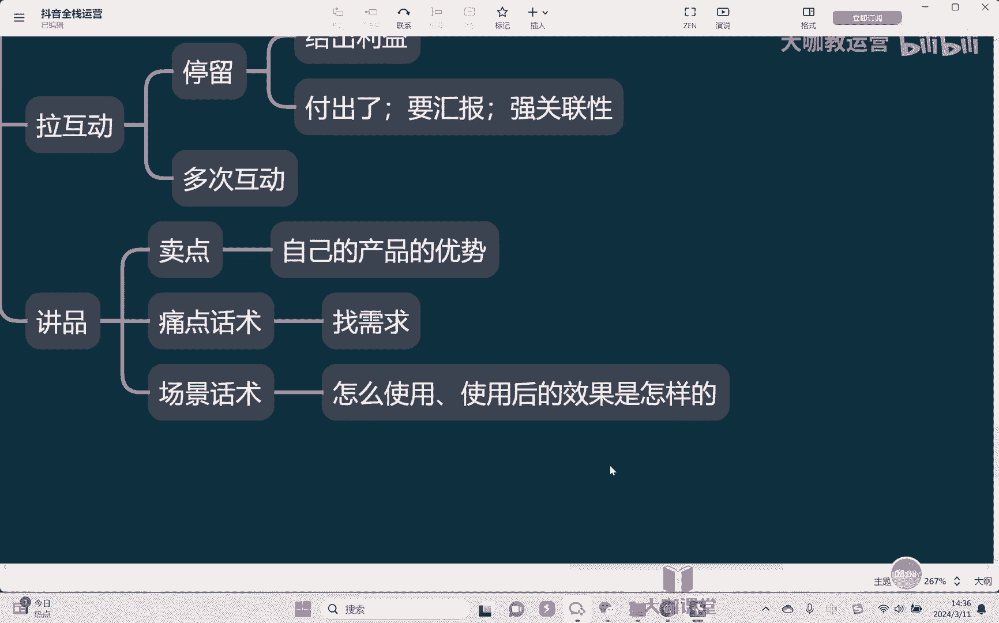

所以这也是拉开非常多话术的一个区别所在啊。

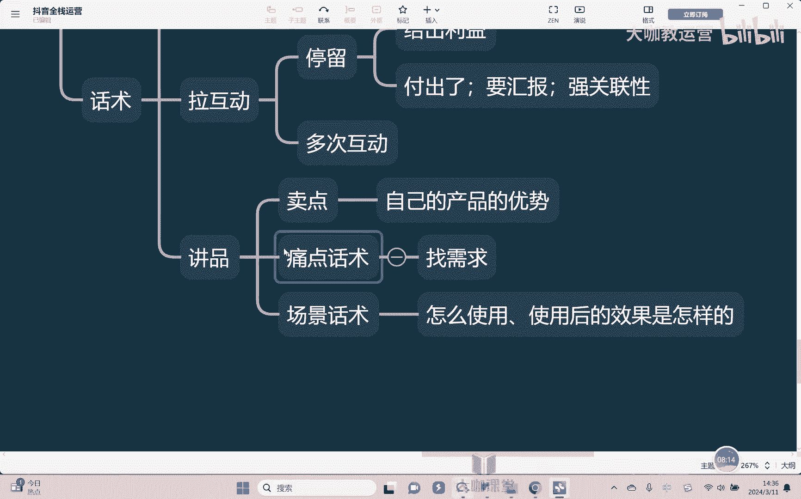

区别所在嗯，好吧好，那么关于奖品，我们就讲到这里结束好吧，讲完品之后再怎么办呢。

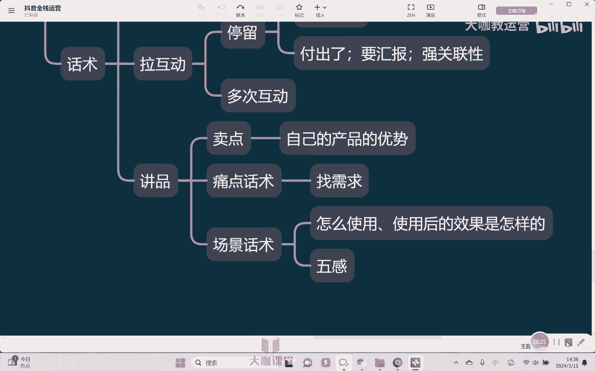