# 【2024B站最强小红书运营系统教程】吊打一切付费课!小红书蓝海市场 2024最值得做的新媒体平台 - P60：29、直播运营-话术篇：促单全流程话术 - 大咖教运营 - BV1sn4y1X75u

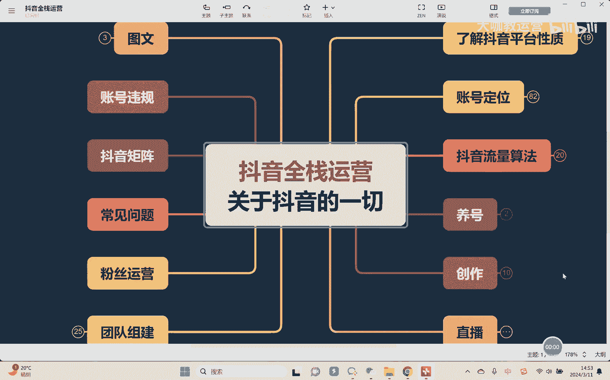

哈喽大家好，欢迎来到我们的抖音全站运营课堂，那么这节课我们继续来去讲这个话术这块啊。

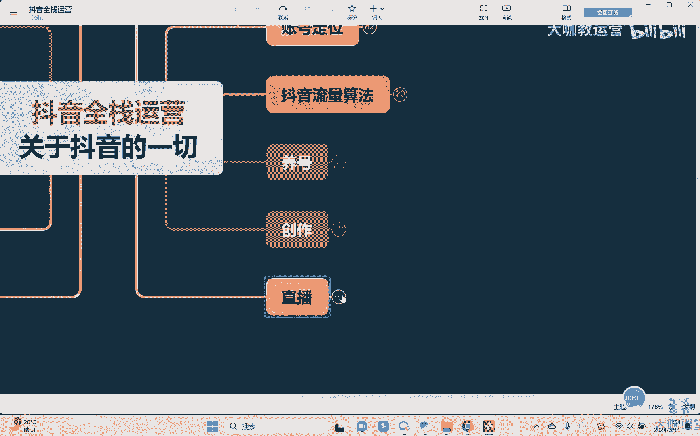

因为上节课我们已经讲了如何去讲产品对吧好，那么产品讲完了。

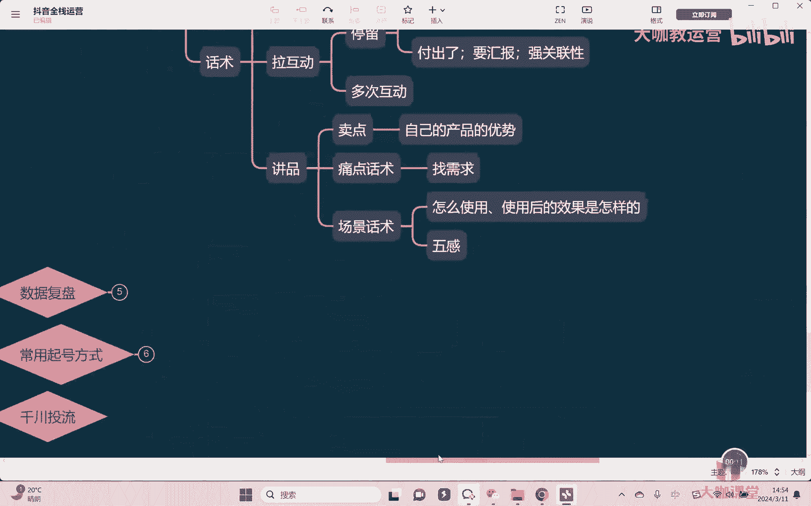

接着我们是不是就要上架开始抢购了，是这样吗，来各位问一下这个问题，呃可能有的同学会说哎立马就开始抢购了对吧，产品都讲完了，赶不还不赶紧去买对，但是有个问题，你产品现在讲完了，用户他就会立马下单吗。

不一定。

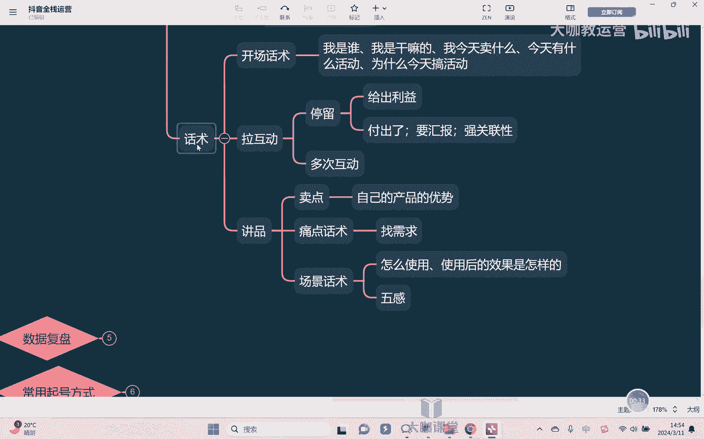

为什么，因为我们用户还会有什么，还会有可能很多的一些问题，对不对，就是比如说我们听完一个产品讲完之后，我们觉得这个产品很好对吧，我也确实觉得哎这玩意儿确实我挺需要的对吧，但是毕竟是要花钱的东西。

所以我会在乎什么，我会在乎说你这个产品我到时候买了之后，是不是真的跟你讲的是一模一样的对吧，所以来各位这个时候其实是什么，就是我们要有一个就是用户啊，他会有疑虑，会有担心，所以在上架正式上架之前。

我们首先要什么，要给用户去建立信任嗯，要去打消他的疑虑啊。

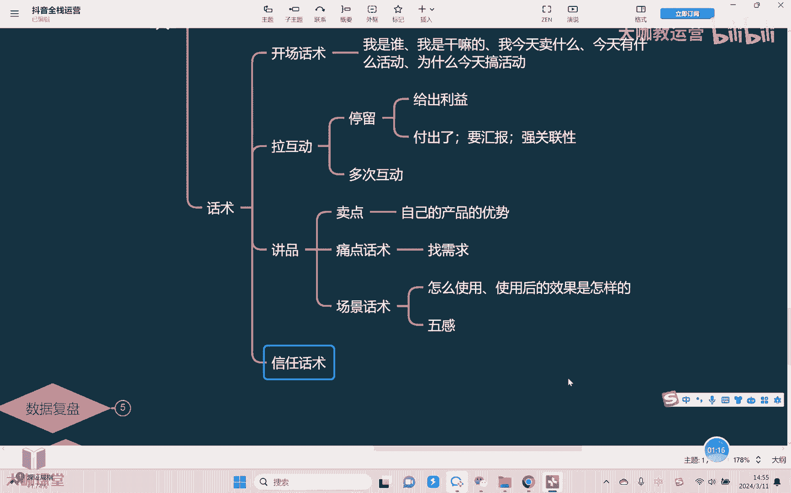

这样子他在待会上架之后，他才真的会去抢对吧，所以这个时候应该是什么，就是讲完产品之后要立马去拉的，叫做信任话术，那所谓信任话术就是告诉用户，你放心去买，你买了之后一定跟我在直播间讲的什么，是一模一样的。

如果说不一样，产生任何问题，所有的这个后果我商家来去承担，你不用有后顾之忧，对不对，这样的情况下，OK那么对你产品感兴趣的用户，他才干嘛，他才会立马去下单，因为你要知道。

不是每个用户他都一定会相信你讲的东西，而且对大部分用户说实话，他只要不是你的老用户，他都是吧，都会有担心，对不对，OK那信任话术讲什么东西呢，首先比如我们说常见的你有一些东西，什么七天无理由嗯对吧。

哎什么运费险对不对，或者说你的什么物流啊，因为有的这个东西涉及到什么冷链对吧，物流啊，发货时间对不对，还有什么，还有比如我们讲你的什么检测报告是吧，有的东西涉及到成分问题，对不对，涉及到材质问题。

用料问题等等，对不对，这种材质吧，OK好，那就是我们讲硬性东西还有什么呢，再比如说我的什么呢，我的销量嘛，对不对，销量也是一种背书对吧，我东西能卖到好事，说明什么，说明这个东西受到大家认可对吧。

什么排名对不对啊啊还有什么呢，还有一个就是比如说什么明星网红啊，这种大的达人带过的产品，或者用过的达人呃，或者用过的产品对吧。

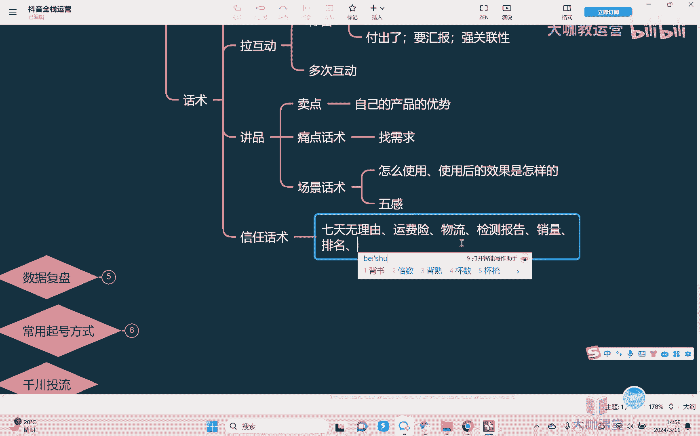

都是可以干嘛，都是作为一种这种背书，OK我们可以去讲，但是大家一定要去注意一点啊，就是比如我们说什么7。5流运费险这种东西，如果你有啊，包括我们说这个什么呃，一些这种具体的这种什么报告啊。

检测报告必书这种东西就是你确实有，你就拿出来讲啊，你要是没有，你拿出来讲，那这个肯定是不行的，对不对，因为你这个就直接违规了，立马这个平台就会检测到的啊，所以这个要注意，对不对，有你就拿出来讲。

OK好信任，话说讲完之后，大部分的用户你就可以干嘛。

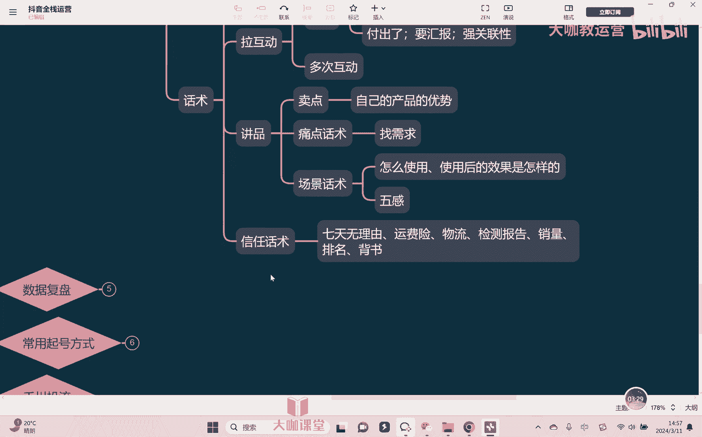

你可以告诉他，你不用担心了，好那这个时候我们就准备开始啊下单了，对不对，然后这个时候就开始开款了对吧，所以开款话术就是我们东西要上架了，所以我们经常会干看到呃，在上架的时候，大家很多的主播会干嘛。

321立马上车，而不是说好，现在上车了，大家快抢，对吧啊，而不会说简单的去讲一句，为什么，因为这个时候，大家的积极性已经被你这个主播调动起来了，也非常相信你，这个东西都迫不及待的去什么下单了。

但是呢一定会有人他可能积极性没那么强，所以这个时候我们气氛围已经拉起来了，你就不要让它掉下去啊，所以这个时候什么拉氛围嗯，把调动积极性，这是我们的一个核心目的啊，啊所以的话呢一般通常情况下开完款之后好。

那么大家现在我们马上倒数三个数，我们就开始上车对吧，321好，一号链接现在已经上车，大家的话呢抓紧时间赶紧去抢秒开秒付，不要这么不要占库存，对不对，一号链接我们上了大概多少单啊。

比如说一号链接总共只有50单对吧，直播间现在100个人，我们现在上了20单对吧，大家赶紧去抢手慢无对不对，所以这个时候啊一定要把这个积极性调动起来。

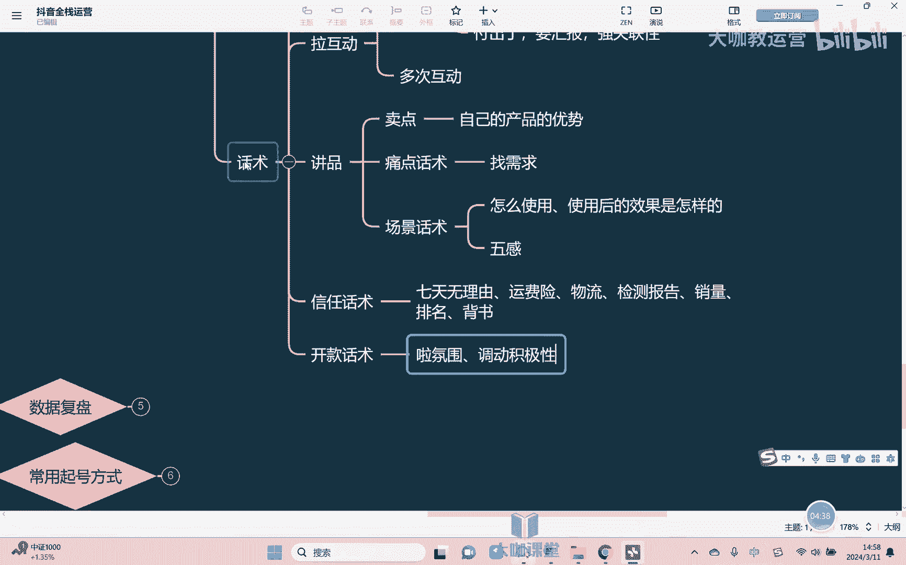

OK好开完款，大家开始抢了，抢的时候我们就不管了吗，这个时候我们的这个直播间就不讲话了吗，不行对吧，为什么，因为我们讲我们的用户啊，并不是所有的用户，而你一开完款之后，他都会去想对吧。

有的用户他压根对女东西没有兴趣，那这个东西我们也不用管，为什么，因为对你产品都没有兴趣，人要么他就划走了，要么你讲再多的东西，讲1万句话，他也不会去买单，所以这部分用户我们不用管，我们要管的。

这个时候OK我们是哪一部用户呢，就是那些对你的产品有兴趣对吧，嗯对你的东西呢也相信，但是半信半疑，他因为第一次来你这家里去买东西，或者以前没有买过同类型产品，或者你的价格比他的预期要高了一点。

但是他对你产品本身确实有兴趣，所以他没走，他在犹豫对吧，他在徘徊，OK那这个时候所以就需要我们什么，需要我们去促单，对不对，因为人都是这样嘛对吧，有很多时候我们做事情就是这样自己去做呢，不是不想做。

但是呢就是没办法自己去行动，就需要有人在后面去推一把，去踢他一脚，诶，他就能动了对吧，所以这个时候干嘛去促的，对不对，所以你要催促他去下单对吧，通常简单来讲什么简单的方法。

比如说有时候我们经常听到直播间好，一号链接，还有最后五单啊，马上没有了，大家赶紧去抢，对不对啊，一号链接这个码数没有了，对不对，大家赶紧去拍，对不对，过了今天就没有这个店了是吧。

今天这个活动完了之后就再也没有了是吧，这是我们讲最简单的什么库存，嗯啊活动期，对不对，过了就没了啊，这种东西可以去催促，但另有的有的是，但是有的用户他不是说光你催他就行对吧，他心里可能还有一些这种疑问。

有一些疑虑，比如说担忧的，他之前听你讲，比如说他没有听到对吧，他没听，他没听岔，他听岔了，没听准，或者说他听了，但是当时没有打动他，所以这个时候你要给他干嘛加点软的东西。

所以这个时候你可以干嘛把之前的我们说，比如说卖点痛点话术，场景话术，在这个这个节点上给它快速的过一遍嗯，快速的把素品的这些话术给他，简单快速把那个精准的一些地方，把重点地方挑出来，快速给他过一遍对吧。

再把我们所讲到信任的嗯，背书的东西嗯也是快速的过一遍，嗯过完了之后立马再接着什么，接着再去催他嗯，嗯这个就是我们讲啊，整个的一个促单话术去做的一个思路。

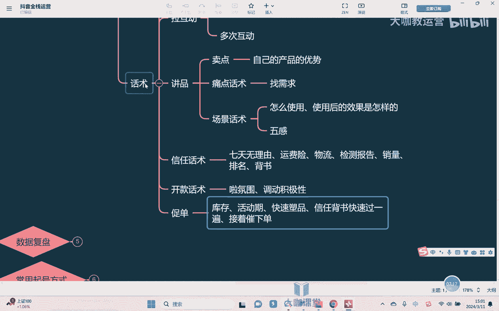

对不对，好那么醋单也出完了啊，这一波我们抢完了，抢完怎么办呢，肯定要换下一个品，对不对，所以叫转款啊，那么转款话术我们不可能说直接就好，这一款卖完了，我们换下一款嗯，对不对，那不行，为什么不行。

因为这个时候你会发现，当你转款很硬的时候就会掉人，为什么会掉人，因为你转了款，比如说它价格可能不一样对吧，风格可能不一样，功效可能不一样，甚至于你今你刚刚还在卖珠宝，现在就开始卖衣服了，待会又卖包包。

待会又卖鞋子都有可能，对不对，那这是我们说表象啊，这是表面体现出来的，那么很多直播间都会出现，类似于转款掉人的一个情况，为什么转款掉人，表面看起来是什么价格款式等等。

但实际上你要知道背后的核心因素是什么，核心不是人群不一样嗯，你要知道没任何一个产品，它的受众人群都是玩，都是百分之百是吧，都是会有不一样的，他一定会有重合的，但他一定会有不一样的地方对吧。

所以这是我们转款的一个吊人的原因，所以我们在转款的时候，就希望尽量的让他干嘛，让他的稍微的柔一点对吧，不要立马就掉嘛，对不对，起码来讲给你一点留人的机会，所以常用的转款的方式是什么呢。

比如我们说嗯呃嗯像我们讲的这个什么啊，比如说什么呃，最简单的水军嗯啊下面去评论嘛，对不对啊，下面的水军可以在上面自己找两个水军，自己在下面去评论2号链接，哎我想看一看主播能不能给我讲讲价格，3号链接诶。

那个能给能不能给我讲一下尺码对吧，再或者有时候我们可以在直播间会讲嗯，比如说嗯嗯好，大家的话呢现在点赞点到多少对吧，或者现在在直播间给我扣多少个，一来我们上一下福利品对吧，这是过福利品的一个方式。

就比较简单对吧，就可以用这样的东西去，那么再其次，我们讲比较简单一点的方式是什么呢，就是关联性产品，嗯啊关联性产品啊，比如说举个例子呃，我们现在在卖衣或嗯这是什么外套，好外套我们已经抢完了对吧。

抢完之后，OK那我们在凑单的时候也可以告诉大家对吧，我们可以教一下人家这个什么，比如说在场景话术当中，我们可以去使用的好，那其实你看穿这个大衣感觉很不错，对不对，而且我们出去玩的时候。

我们还可以干嘛背一个包包嘛，对来大家可以看一下，你看你可以背一个这样的一个风格的一个包包，对吧，是不是搭配起来就非常好看，对不对好，那这个包包我们好好，你看这个时候是不是包包就过渡过来了，对吧好。

那这个包包的话呢，我跟大家去讲一下这个包包，有有有这个有宝贝对我们的包包感兴趣，对不对，好，那这个包包我给大家去讲一下它的一个款式，它是个什么风格，而且这个包包今天也很便宜或怎么样怎么样。

你看这样的方式也可以去进行一个转款啊，但是转款的话术呢只是一方面，转款呢我们说了，核心是人群不一样啊，所以呢产品和产品之间本身它的一个决定的，核心就是人群不一样，就这个东西是没有办法改变的。

所以呢转款的话术他只是话术，我们想彻底的就是把转款这一块呢能够解决好。

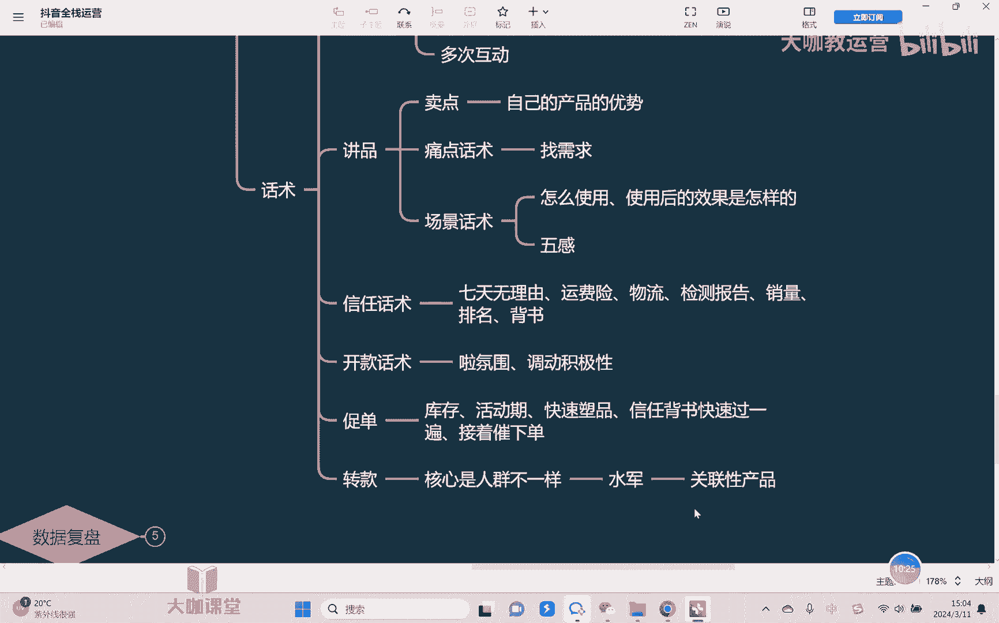

其实更多的说实话还是要什么，还是要研究品品本身，要把这个东西要去研究好啊，所以的话呢才能真正好的去解决一个，转款的问题，好吧行，那么关于整个的一个话术啊，从头到尾我跟大家去讲的是一个相对标准的一。

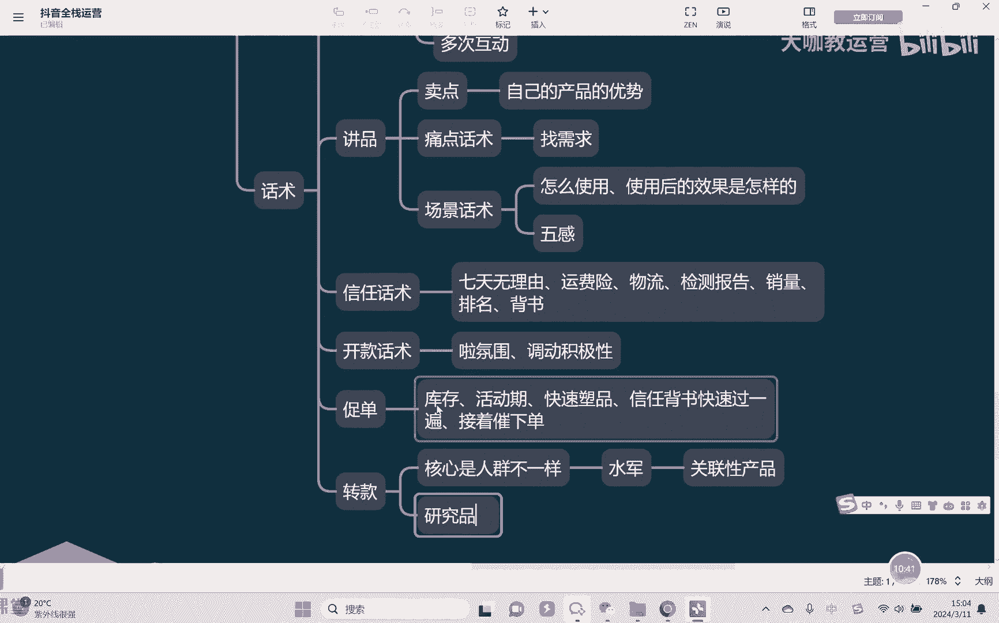

个话术的一个流程对吧，我们的俗称也叫做九大话术啊，但是话术呢呃呃八大话术，但是我们说所谓的这个话术，他只是话术，对不对，不同的人讲出来感觉是不是也会不一样，对不对，所以呃话术其次我讲的也是一个什么呢。

也是一个标准的一个流程对吧，但事实上比如说我们在去讲产品的时候，额我们讲卖点痛点场景，他是不是要按照我现在写的这个顺序来呢，不一定对不对，所以包括我之前在跟大家去讲，我说促单的时候。

你是不是也会去穿插奖品和信任的一些东西，对吧啊，所以很多包括拉互动的时候，拉互动这个事情，他不是说在非得在某一个环节做，他其实可以在每一个环节里面都去穿插去做，所以如何去使用我们去编写好自己的话术。

还需要大家啊，自己的话呢下去多去尝试结合好自己的品。

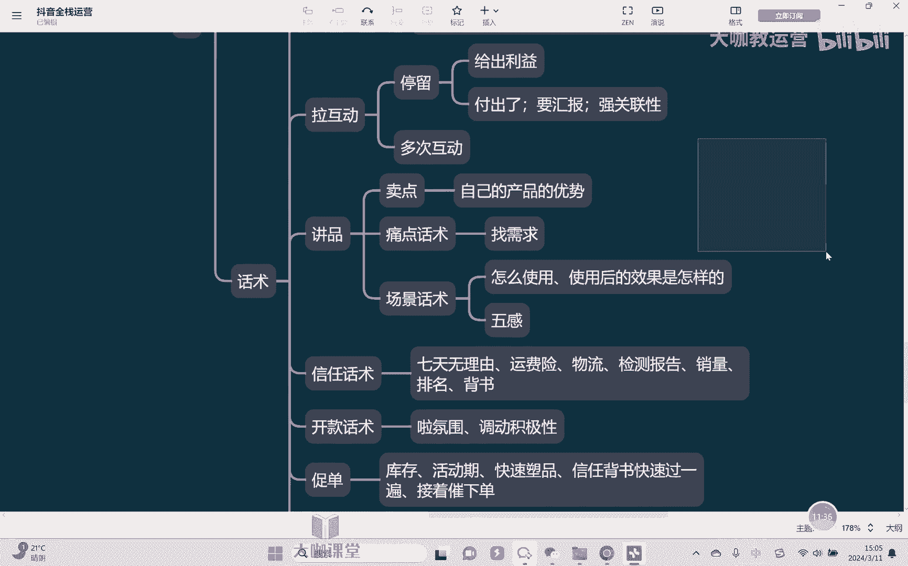

然后呢慢慢去构思去设计，好吧好，那么这节课的话呢。