# 【2024B站最强小红书运营系统教程】吊打一切付费课!小红书蓝海市场 2024最值得做的新媒体平台 - P61：30、直播运营：数据复盘专项课 - 大咖教运营 - BV1sn4y1X75u

Hello，大家好，欢迎来到我们的抖音全站运营课堂，OK继续来去讲我们的直播板块，在前面的话呢，我们已经把整个的人货场，基本上已经给大家去讲完了对吧，相当于呢整个直播从前到后的一个流程。

以及需要去准备的一些东西，包括每一个点大概该怎么做啊，基本上已经是给大家去讲完了，好那么这些讲完之后，我们讲一场直播结束了对吧，代表了什么，不是说呃这个事情就完了，而是什么呢。

而是说我们要继续去努力做好后面的事情，所以呢每次直播结束之后，我们都必不可少的一件事情就是数据的复盘好。

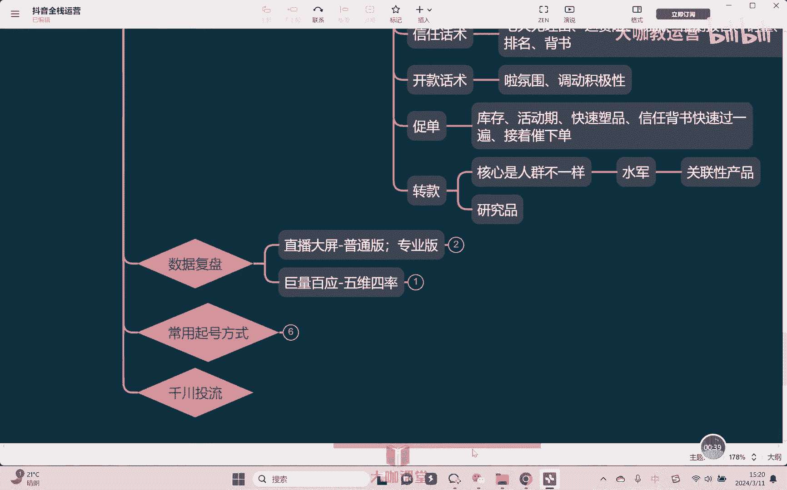

那么如何去做数据的复盘呢，我们一般分为两个地方啊，第一直播大屏啊。

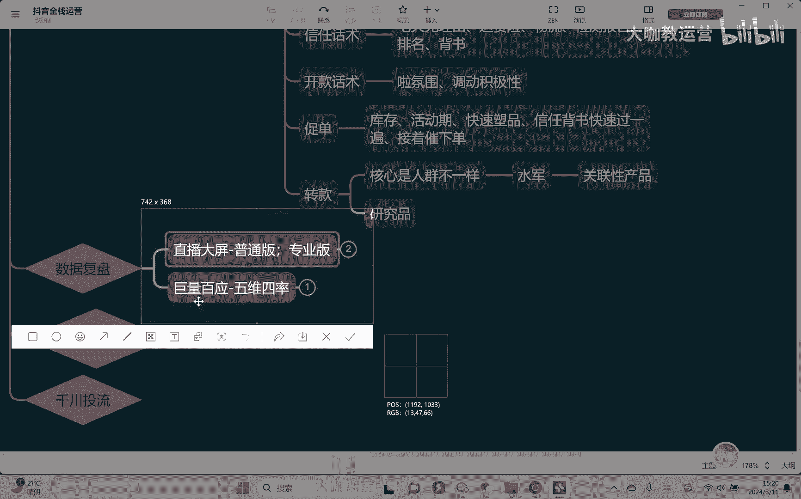

然后的话呢第二就是我们叫做五维思虑，主要是看这两个东西，直播大屏呢会分为普通版和专业版，然后我个人的话呢倾向于用专业版啊，我个人倾向于用专业版好吧，呃当然了，普通版呢也会有它的一些好处啊。

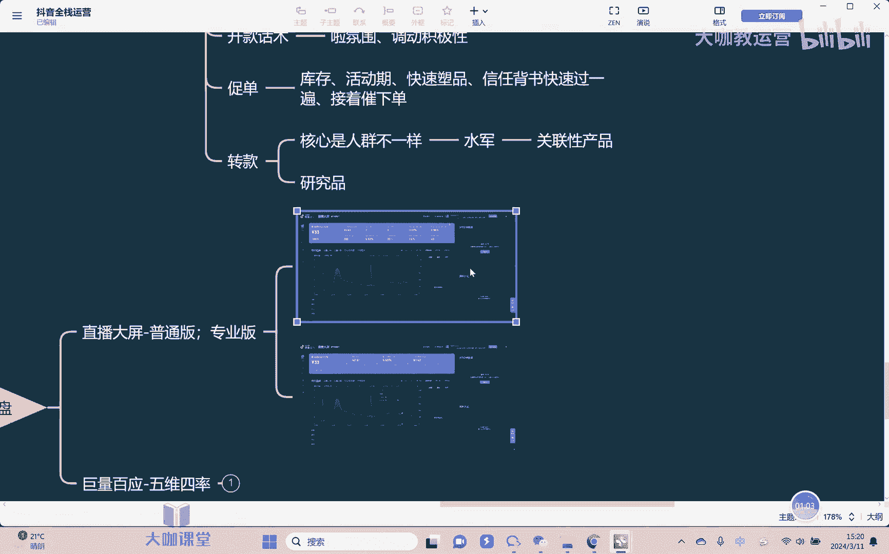

呃只是我个人来讲，我会倾向于专业版，所以我在这里主要是讲这个专业版这块啊，呃为了说呃因为这个账号啊，以这个避免这个账号的一个隐私性，所以的话我采用图片的形式啊。

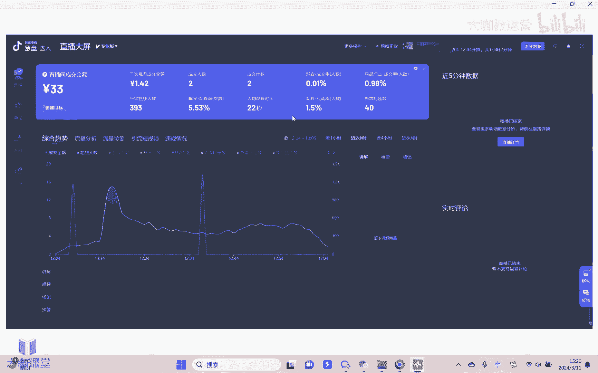

然后的话呢来去给大家去讲嗯，首先呢大家可以看一下，这是一个直播大屏对吧，那么在上面这里就是最直观的数据对吧，什么gm v，然后的话呢千丝成交人数啊件数，然后呢观看成交率对吧，商品点击成交率。

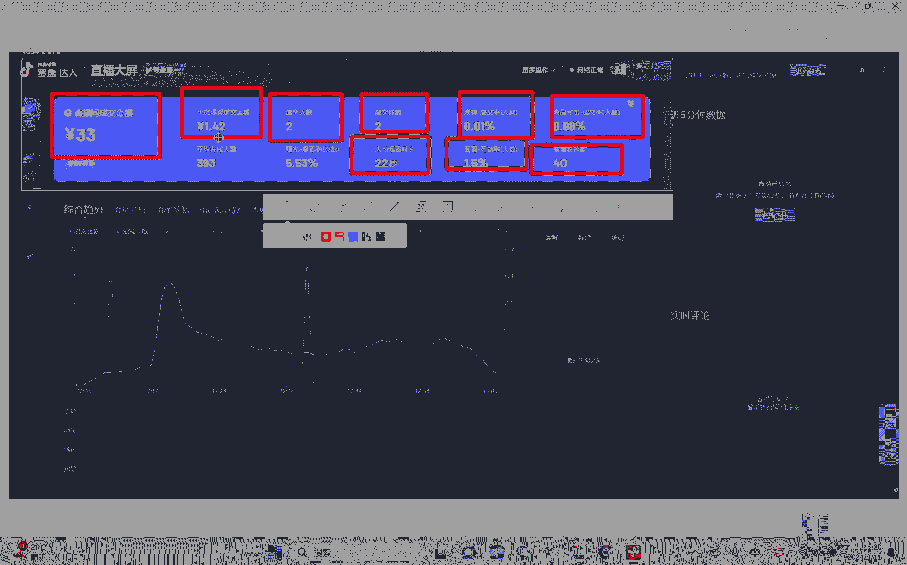

然后呢新增了一些什么粉丝互动率啊，人均观看时长等等对吧，曝光观看率以及呢平均在线时间处好。

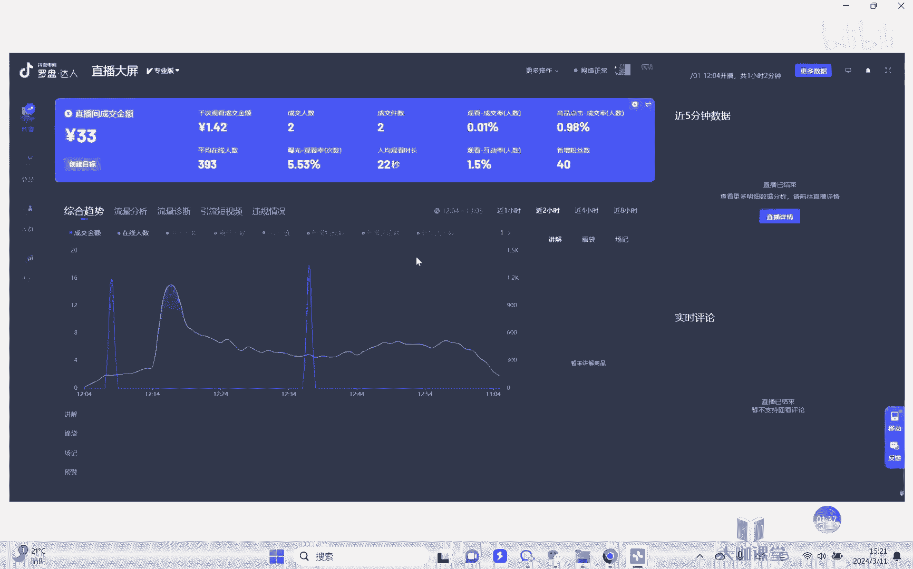

这个是我们在直播的过程当中啊，经常会去在这个过程当中我们去观察对吧，另外一个还有很重要一个东西，就是去观察整个的一个波动线对吧，主要的一个核心，我们平时波动线看了什么呢。

首先第一看在线人数和什么进入人数啊，呃就是呢你的进入人数要能够达到什么呢，达到在线人数的两倍啊，然后呢要少一点，也就是说你的在线人数要低于，要高于进入人数的50%，这种情况下，一般我们说你留人的能力。

是没有什么太大问题的对吧，否则的话，那就说明你这个人秒进秒出的有点太厉害了啊。

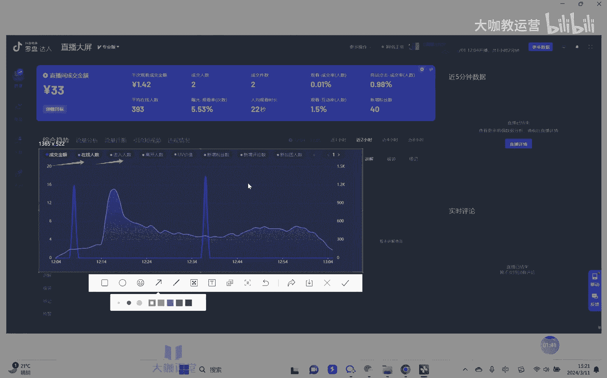

没有留住人，知道吧，另外呢就是我们说呃，要去看你在奖品的过程当中啊。

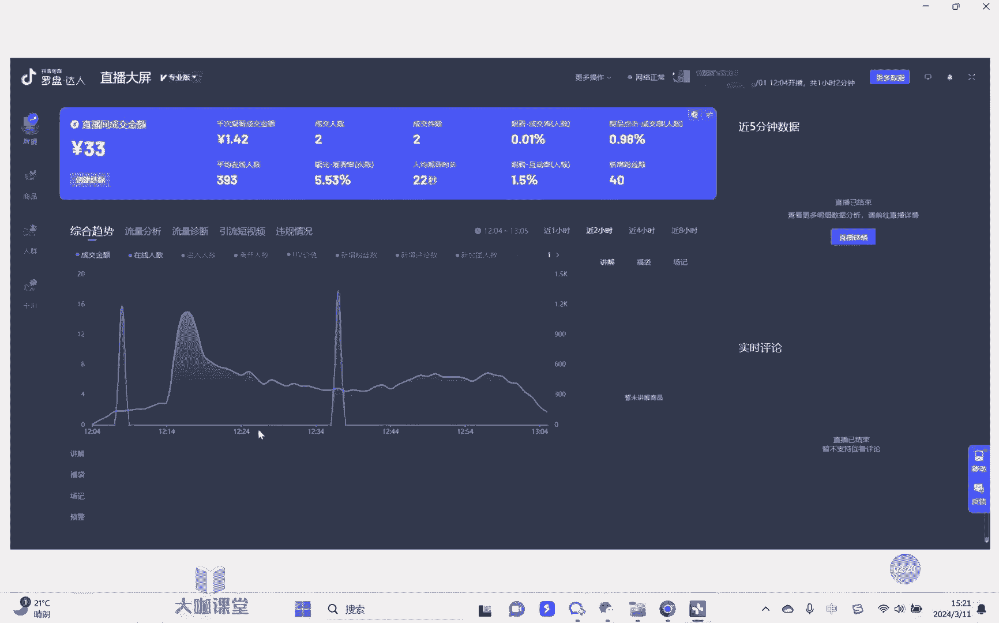

奖品的时候，我们呢在这个下面呢会有一个显示好吧，然后呢再去看分析你在奖品的过程当中，第一离开人数，第二呢就是你在开款之后，你的什么成交金额，UV价值对吧，然后呢呃整个新整个也就是我们说。

比如说你在互动的时候也要去看你的嘛，新增什么评论，新增粉丝对吧，以此来去观测你整个数据过程当中，你的互动能力对吧。

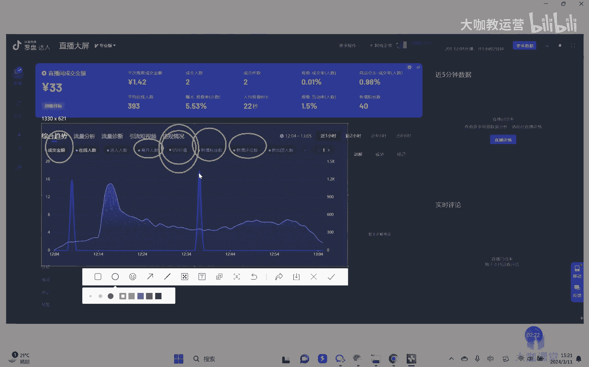

好奖品讲完了，上车之后要去看你的嘛成交的一个数据。

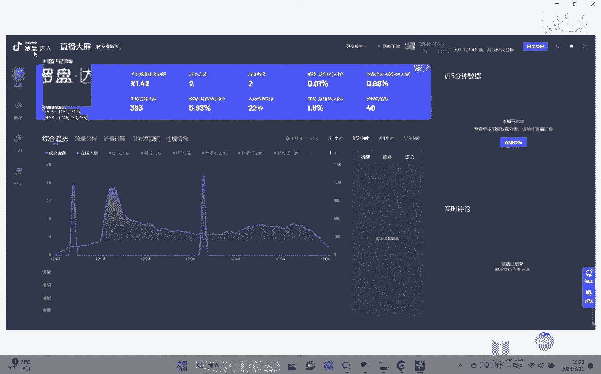

对不对，这是我们在直播的过程中去看的好，那其次就是我们说关于上面的这些数据。

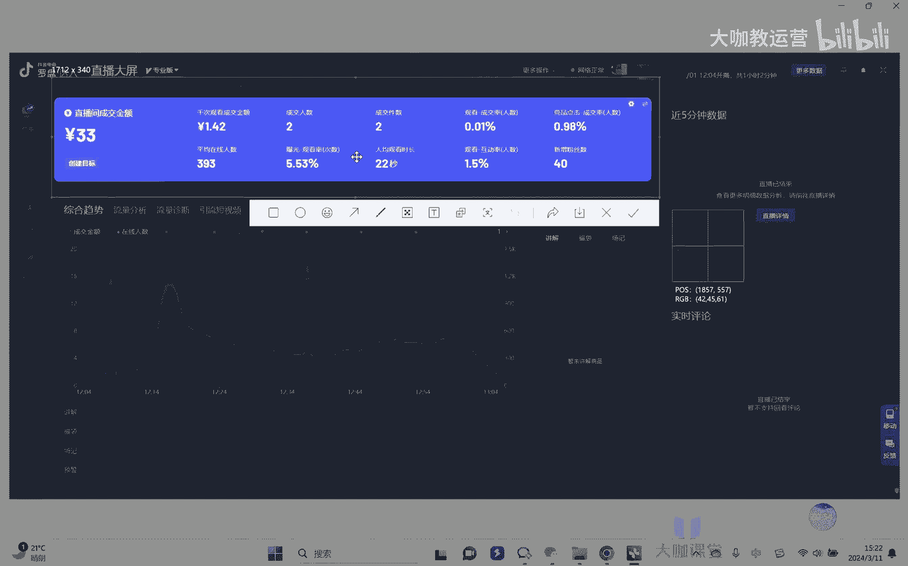

对不对，因为我们经常去看我的这个什么成交人数，成交件数什么转化率，我也不知道我这个标准到底是高还是低。

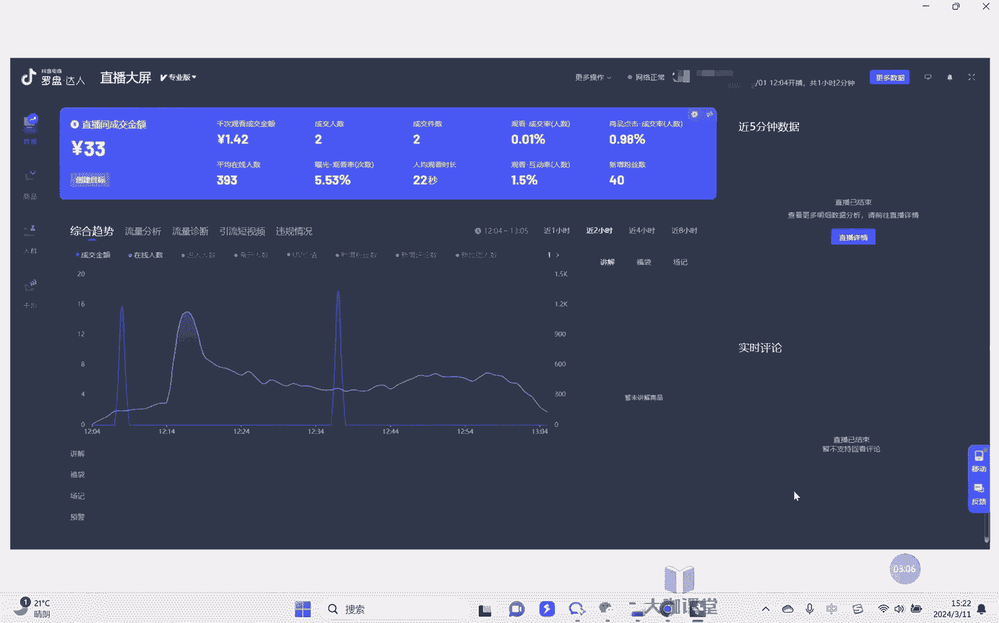

所以这是我建议大家用专业版的一个原因所在，知道吗，因为我们可以看一下呃，在专业版的这个上面对吧，在这个地方有一个这个小箭头，你点开之后呢，就会看到在背面，它会相当于是你可以理解为我。

我把它称之为叫背面啊，啊背面就会有这个就是你整个的一个曝光次数，曝光次数，你可以理解为就是在直播间外面的这个，曝光次数啊，所以这个东西其实意味着是什么，你的一个流量层级明白吗，意味着你的一个流量层级啊。

然后其次就是你的一个曝光进入观看率啊，也就从直播间啊曝光给人家了对吧，但最终他进来直播间的一个点击的一个比率，这个是很重要，然后呢是你的个签字是吧，签字我说了，他是一个非常核心的一个因素，一个数据对吧。

它不仅影响你的浅层数据，它也影响你的深层数据，他两方面都影响啊。

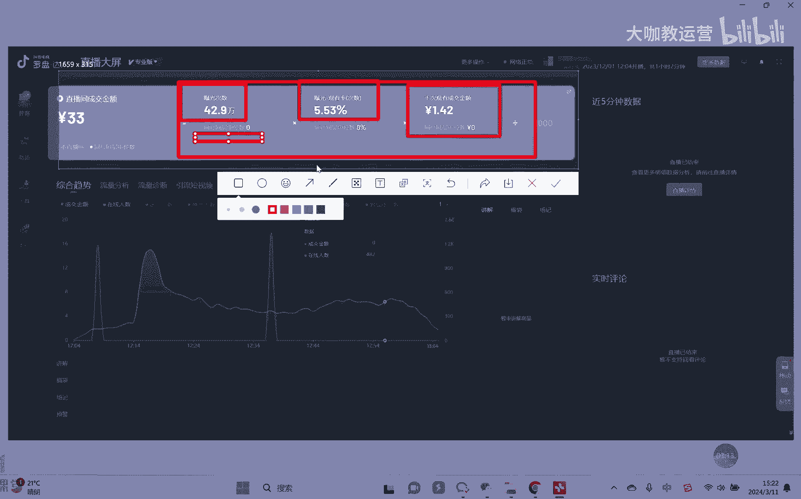

所以在这里的话他会有什么呢，它会有同行的中位层数，所以你通过看中位层数，因为它不是平均值，它是中位层数，所以就意味着你在你同级别，同层级的这个直播单间当中，你的一个排名，如果你能够排在50%以上对吧。

说明你至少是及格的，排名在百分一半以下，那不好意思，你可能就没有及格，明白吗，这个就是没有及格了对吧，所以然后再其次就是我们讲，当你的中位层数接近于八九十%的时候。

说明这个时候你就有什么破层级的一个机会，那么你就需要去调整你的直播间的一个节奏。

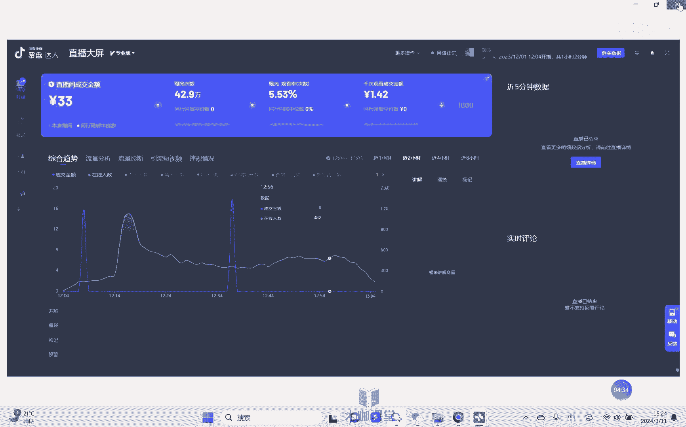

然后临时可能要调，有可能会去调整排品。

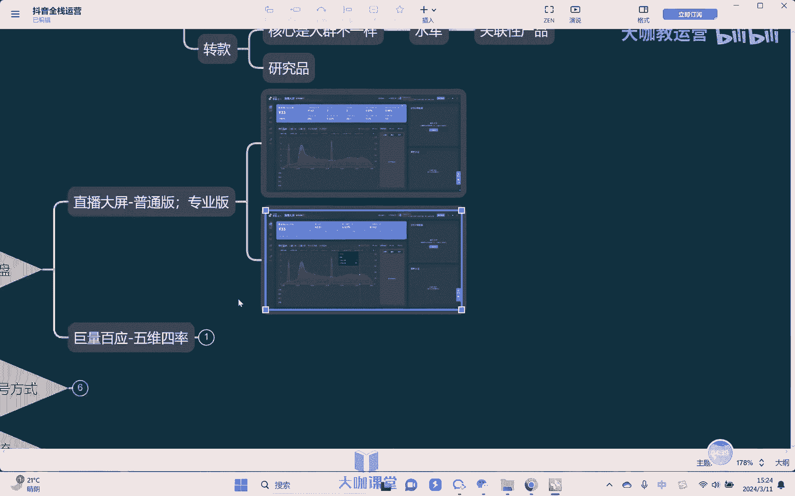

然后去帮助你自己去憋单，去铺层级，明白吗，所以这是我们要去注意的好，那么下播之后我们主要看什么呢。

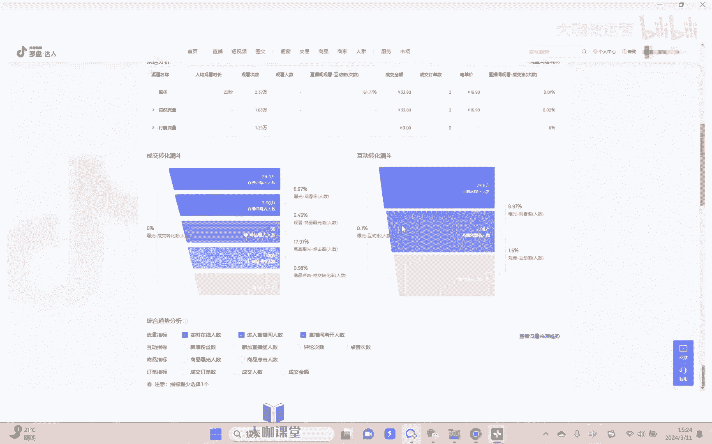

看巨量百应的五维四率啊，来在这里可以看到，那这个是我们讲的一个成交转化漏斗，因为我们说大家知道一点，每一个用户他的一个成交转化，它有个流程，什么流程，第一先在这个推荐页面，比如说看到我们的直播间对吧。

好如果说我们看到之后进入直播间，点击这个页面进入直播间之后，那么它就是我们说你看第一层，第一层对吧，所以首先第一直播间曝光曝光之后，他点入进入直播间，所以这是第一层，然后呢这一点我们就看的什么呢。

看的是我们的一个曝光进入率，明白吗，所以曝光进入率是我们说第一层你要去看东西，为什么，因为它直接影响我们后面的成交，因为没有曝光就没有进入，没有记录就没有后面的商品点击就没有下单，就没有成交对吧。

它是一层一层来的，每个人用户成交用户他是这样一层一层下来的，所以如果你的曝光进入率不行对吧，就外面的人都不够，进来的人就少对吧，你人少，你的机会就少，你的基数小了，你的一个最终成交。

肯定大概率就会受到很大一个影响，明白吧，所以OK首先第一我们看曝光进入率，如果说你是自然流的页面，那么你的曝光进入率，通常我们的要求是要达到20%，到30%左右，明白吗，但是嗯曝光进入率。

这个我们讲的是自然流的情况下，如果说你是付费直播间，付费直播间，如果纯费付费直播间，一般情况下也就是在3%，明白吗，因为付费他给的流量的基数大，你可以理解为曝光数量大，明白吗。

所以他的粉相对来讲就会什么泛一点，他靠基数堆，明白吗，那如果你是自然流，自然流单向的一个曝光均率，一般我们就讲20~30之间，但是如果当你的嗯曝光数再增加，曝光进入率，同时在减少的时候。

那么这个时候来有的同学说，哎我的曝光功率怎么可报，进入率怎么减少了对吧，很奇怪，是不是我的这个场景出问题，各位不用担心，这也说明你的流量开始主动去吸引更多的范本，在流量在破损级了，明白吗。

所以这个时候你要去考虑的就是，你要去接触流量去做转化啊，如果你接不住这个流量没有做做好转化，那么一样的你的成绩还是会掉回来。

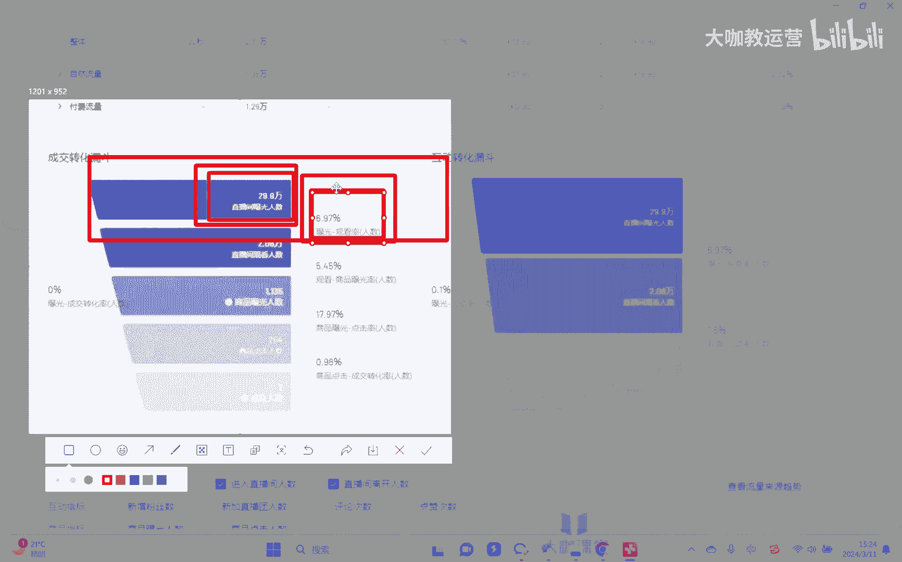

明白吗好所以这是我们第一个要去看的东西，那如果说OK我们的曝光进入不好，一方面我们有时候讲是和你的场景相关对吧，但是你们要知道场景它不是唯一的场景，只说我们大部分人讲的，确实我们第一眼是这个呃这个什么。

我们说我们大部分人我们都是这个视觉动物，但第一眼确实看场景，但是还有一个很重要的东西，就是我们讲主播本身的一个状态，这个很重要，尤其当你的基数大了之后，你的精准用户没有那么多的时候。

这个时候你想要有好的一个进入率对吧，想把外面的精准人群拉进来，其实真的就是考验你转化无数的，当你能量流量层级上去之后，你的范本就会多对吧，泛人群就会多，所以这个时候主播的状态就会更加重要，明白吗。

所以你首先要明白清楚你的成绩在哪里对吧，你人少，OK你就去找你场景的问题，你人已经上来了，有能力了，也在铺层级了，你就要去考虑说你主播的一个什么，整体的一个节，这个状态。

能不能去把外面的人拉进来的一个能力，好吧好，第二嗯，就是我们讲进来了之后。

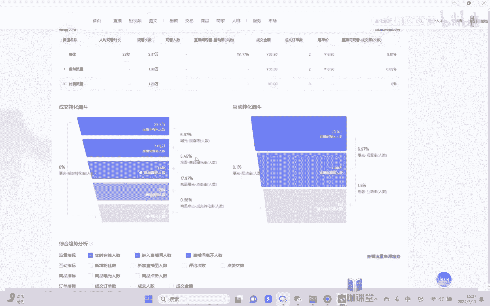

你报道吧，曝光进入了好，进入到直播间之后，就是你的商品曝光，那这个商品曝光率一般来讲我们不不太会去看，为什么呢，因为商标品曝光，就是你右下角会去弹那个弹窗嘛。

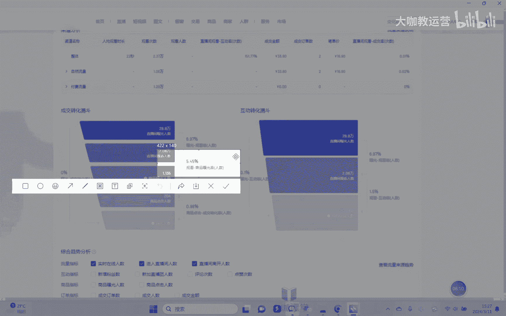

对不对，产产品只要弹装了，OK就一个用户就能够看得到。

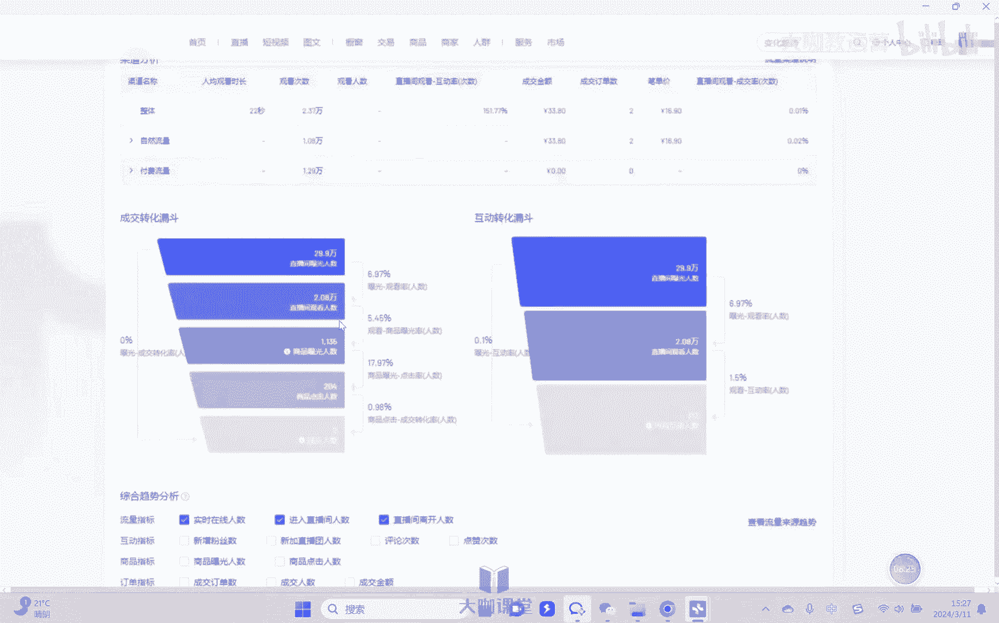

但是如果说你的这个商品曝光率很低对吧，那说明什么，因为我们的弹窗基本上全程都会弹，中间是不停歇的对吧，所以你可以理解为，但凡只要有人进来了，他就会看到弹窗，他就会看到我的产品。

但是我的曝光率率为什么就不是百分百呢，这说明什么，就说说明有人在秒退秒出，明白吗，所以当你的商品曝光率低的时候。

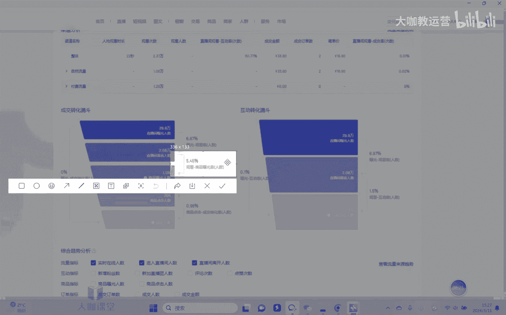

其实反而反馈的是你的停留做的有问题，明白吗。

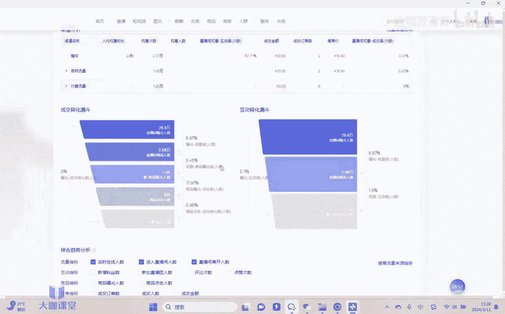

在这方面你要去做一些调整，OK好，再其次就是我们说商品曝光的一个点击率，也就商品曝光给他看了，但是呢他又没点产品对吧，呃如果没有点产品，说明什么，说明他本身对于产品就不感兴趣对吧。

我可能甚至都懒得听你的这个呃这个主播去讲，所以这个时候其实主播的话术在素品方面，说实话各位不是重点，重点是什么，重点是产品本身，因为如果说这个产品本身的类型，或者说它这个产品本身就没有吸引到我。

那么不用你的这个主播讲，我就不会有兴趣，就不会去点明白吗，所以当你的产品商品的曝光，点击率有问题的时候，优先去考虑你的产品本身，再其次是我们讲主播的速品能力，明白吗，所以当你的商品曝光低的时候。

其实我告诉你各位，大概率你的商品曝光率也不会高，这两个一般情况下是相辅相成的，明白吗，好最后就是我们讲最终的点击成交转化，那这个就不用说了，必然是涉及到什么，涉及到你的产品的奖品对吧。

涉及到你的信任和负担的一个能力啊，这块就是测这块就正儿八经，就是你主播的话术的，实际最终的一个转化能力了，那么如果这方面B，那就肯定是要去调整你主播的状态。

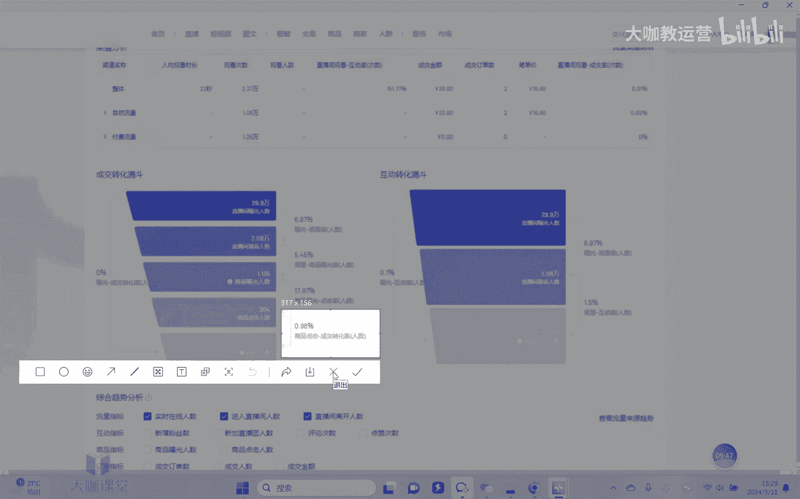

或者是他的话术好吧，OK那这是我们讲整个去对于数据。

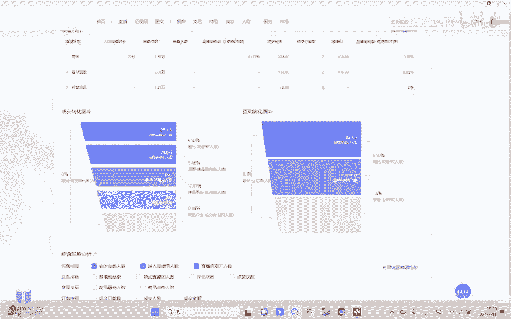

我们整体大概来说的一个看的一个方式好吧，然后呢以及对应数据做出了一些调整啊。

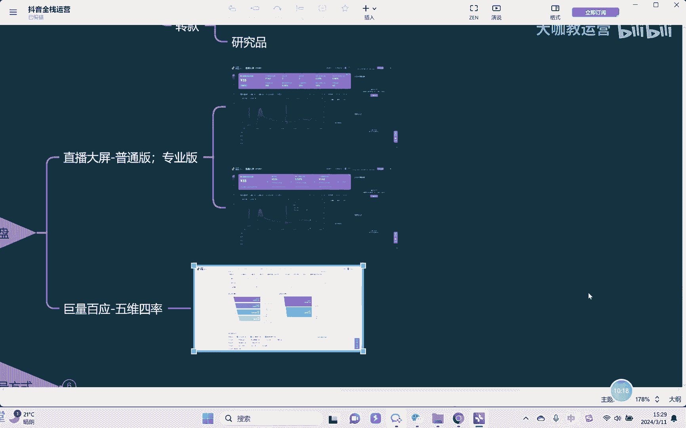

然后呢那么这节课我们就先到此结束。