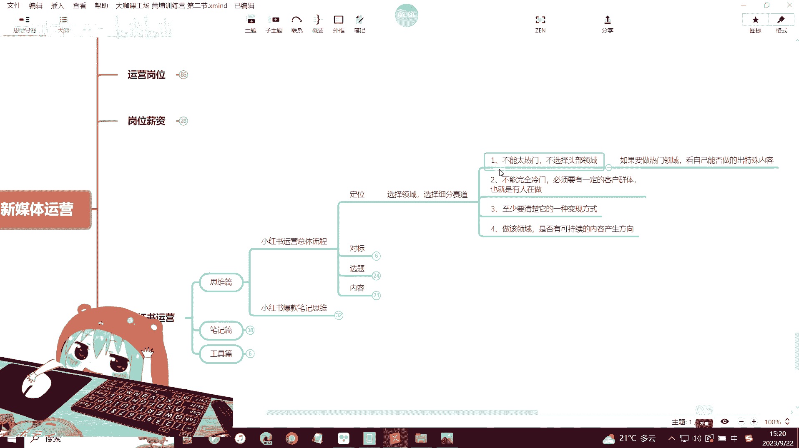
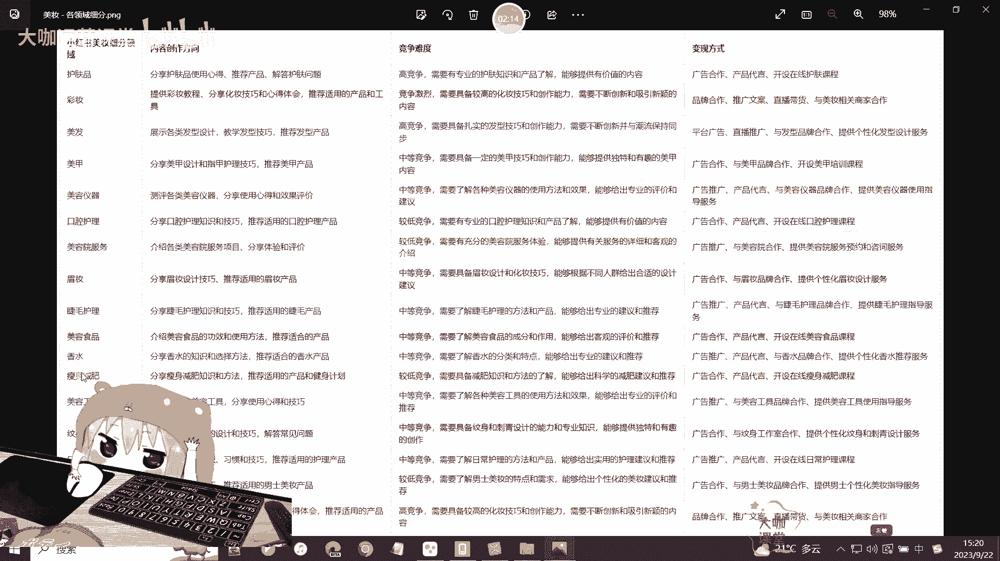
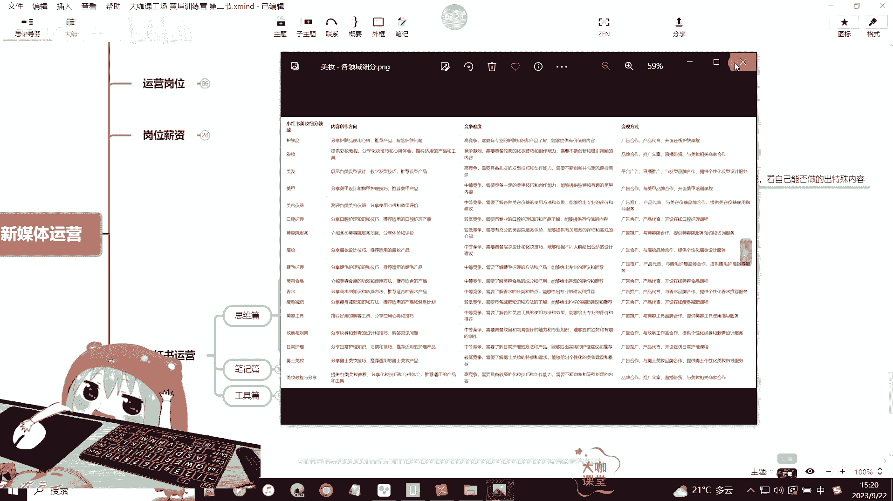
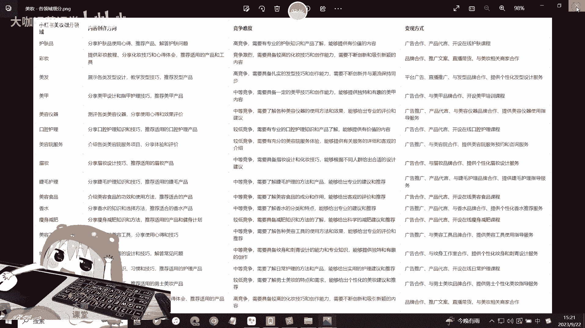
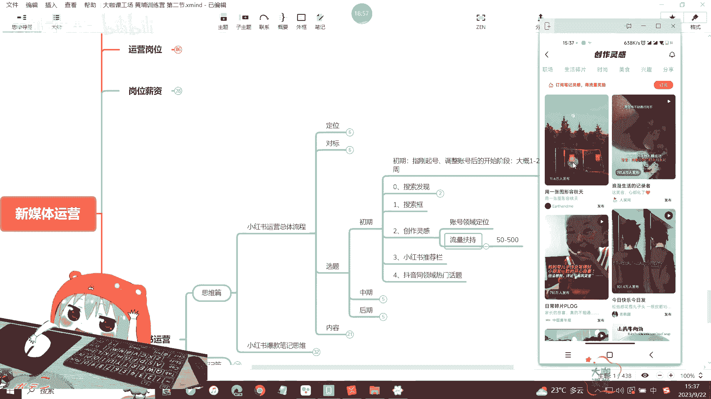
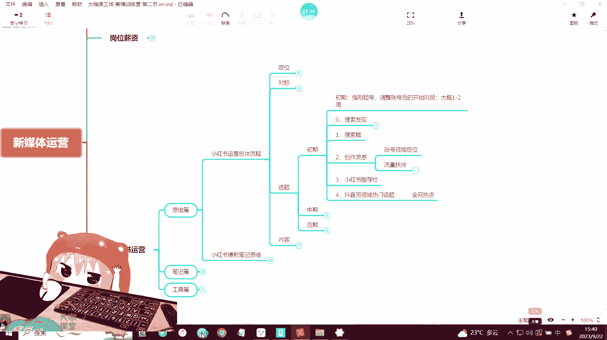
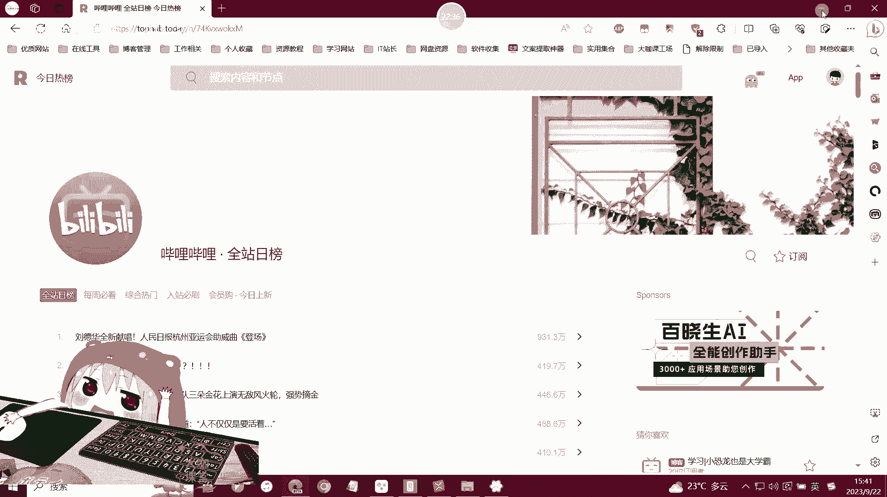

# 【2024B站最强新媒体运营教学】7天自学新媒体零基础快速入门教程 手把手教你小红书起号 短视频剪辑 AI创作｜一条龙式学习 没有你学不到的 只有你想不到的！ - P28：19：新媒体运营-小红书内容选题-账号初期 - 大咖运营课堂 - BV1ps42137yQ

OK好，欢迎大家来到我们这一堂课。那么这一堂课的话呢，我们主要讲一个就是关于小红书运营里边思维篇的这个总体的一个小红书运营流程。那么所谓的总体的一个运营流程。其实在我们之前的课程当中也有跟大家讲过。

对吧？我们小红书运营，它其实总共只分为四步，也就是说从你的一个账号刚起好，刚注册一直到你后面发出第一篇笔记，以至到你最后这个账号能够出爆款，能够有自己这样的一个数据产生的这个完整的一个流程。

那么首先第一步对吧？我们讲是定位，那么定位呢也就是说我们就要去选择自己的一个细分的赛道和领域，对吧？就是说这个账号我在小红书上去做的，那么我就得明确我这个账号里边要提供什么样的内容。我做哪个领域。

哪个方面是美妆母婴或是其他家居好物分享等等。这些赛道，你定好了之后，那么后面你去做选题的时候，你才能确保你的账号里边有一个一定的垂直度。然后平台呢。😊。

他也能成功的给你的账号打上一个领域专家这样的一个标签。好吧，那么定位我们讲究。选择细分赛道，对吧？我们讲究几个原则。首先第一呢你的这个赛道，我们刚起号的时候啊。

也就是前期我要选择这种太热门太过泛的这种领域啊，就是尽量我们不去选择这种竞争特别大的头部领域。那如果说你的产品一定是必须要做这种头部的。比如说小红书里边最大的这美妆赛道，对吧？你要去做美妆赛道。

那么这个时候你就得考虑你要去从美妆赛道里边去细分，对吧？我们去找更多其他领域可以做的内容，比如说我们举个例子。嗯。呃，比如说我们举个例子啊，领域细分。那么关于美妆这里之前有一个简短的一个图片。

我给大家看一下。

好，那么比如说你是做美妆的美妆领域呢，我们有很多的细分领域，对不对？像美容仪器、口腔护理，然后眉妆、睫毛护理、美容食品、香水啊瘦身减肥，对吧？这些都有。那么像男士美妆这些细分赛道。

你可以去给他做一下拆分，你具体做哪个领域。然后如果你是做眉妆的话，那么眉妆里边你刚开始起号的时候，还有没有可以再细化的这种领域。这个时候就我们要考虑不要去做太竞争太大的。好吧，我们要去做细分化的赛道。

能够让你这个账号能够缩短它的一个前期的新手期，快速出成绩，出效果，也能对我们账号的一个总体权重带来一个非常大的帮助，对吧？那么第二个呢就是不能做完全冷门，对不对？

那你一定要有就是说这个平台上一定要有你的一个客户群体。也就是说你要知道他是有人在做的，有人在做，而且有数据代表着这个平台有你的客户，对不对？那如果说你像。😊。

你是做一些什么大型设备的对吧？我们前期讲过，还有一些你是做什么新能源设备的这种呃机械化的东西，大型的这个单价比较高的这种几万几十万上百万的这种产品。那你适不适合在小红书做呢？啊。

这个时候呢你可能要考虑一下小红书上面有没有你的群体，对不对？那上面如果没有人在做，你去做了啊，可能你觉得这是一个冷门的行业，对不对？有可能你能报，但是有些东西啊，现在的互联网就是有些东西没有人做啊。

反而代表着可能有一定的问题，OK。😊，然后第三个呢，如果你是给自己做账号，那么你要明白，你得知道它的一个至少有一种的这个变现方式，对吧？然后做该领域的话，你后续你可以考虑一下。

就是你后期是否有可以持续去生产啊，产出的这个内容方向。那不管你是去从对标账号那里copy，还是说你自己有这一块的资料或者创意。那你必须确保这个领域，你有内容去做产出，对吧？我们不要求说你做这个领域。

你一定是这个领域的专家，但是你得要对他懂，那么这个好方便我们后期做内容的时候去做规划，好吧，做优化，那么这是关于定位，我们就不过多讲，因为已经讲了很多了，然后对标的话很简单。

我们的要求就是你做小红书起好的时候，你的同领域优质对标账号，至少要选择大于等于5个这样的一个标准，对吧？对标账号它的一个作用，我们也讲的很简单了。首先找到你这个爆款对标账号的一个表。

然后在里边登记你的这个爆款账号，也就是说呃你这个行业里边这个有爆款的这种优。😊，优质的账号对吧？作为你的一个对标账号。然后呢，就是我们选择这样的一个对标账号啊。😊，我们选择这样的一个对标账号。

其实就是在选择你的一个创作方向，创作风格以及创作内容。其实这三个点，你在你的这个爆款的，也就是说你对标的这个账号里边都能够分析出来。你通过分析他们爆款的这种内容。你可以知道他们什么样的内容。

就是你这个领域当中什么样的内容是你的客户喜欢的什么样的内容可能是平台喜欢的那这就是我们前面跟大家讲的，我们运营一定是围绕两个原则，一个是用户，一个是平台，对吧？那么找对标账号。

我们还要分析一下这个对标账号，他最开始的一个真实的一个数据情况。那么他有没有隐藏这个笔记，那如果你关注的不是很早的话，我们这个暂且不考虑，我们需要看一下这个账号，比如说他只做了三个月，他的第一篇笔记。

我看到的时候，它是第三啊，也就是说他三个月前出的第一篇笔记。然后现在一共更新了维持了3个月，对吧？那么这这段时间他的账号，呃，他起了多少粉丝，他的数据有多少，那么既然能够成为你的对标账号。😊。

我相信他的数据肯定不是差。那也就是说三个月之间，他做到了这种程度。那这个账号你一定要仔细的去研究。好吧，那如果说你找到一个账号，它的第一篇笔记的更新周期时间呃，在两年或者说一年半以上。

也就是说在22年的年初或者说呃，像在这个21年的时候，甚至19年的时候更新开始做的这种账号，那他们初期的这个数据，也就是说给你提供的参考意义可能不是并不是特别大。

你可以参考一下他们后期数据报出报起来这些笔记。那么他们上面这些笔记的内容，笔记的这个封面标题文案等等，这些可能作为你的参考。但是前期的数据没有参考价值。因为小红书在前期的时候呢，只要你坚持做。

那么可能是个傻子，你上去你都能把它做起来。O那么这是小红书我们去观察对标账号的一个前期的一个数据情况。然后对标账号的更新频率，还有它采用了哪些标签，对吧？这些标签呢，可能是你后期需要参考的一个点O。😊。

那么这是我们讲对标它的一个重要性。那么接下来我们就讲今天的这个关于内容选题了。OK内容选题非常非常的重要。那么所谓选题，我们其实是把它分为初期、中期后期。那么什么意思呢？就是说我们的账号在我们。😊。

写的发布的每一篇笔记，它都一定是要有一定的这个依据的对吧？一定的依据。那这些依据在哪里？为什么说我们要采用这篇这些依据，我们稍后来一一跟大家讲，就是说你去做小红书，你希望能把这个账号做起来。

你一定要按照这种思路去做。好吧，你写的每一篇笔记，每一个内容，它都一定是要有有它的这个呃基础的这个内容或者方向去做支持的O那么首先我们来看一下初期啊，初期我这里写了就是初期指的就是我们刚开始起号啊。

或者说你有一个小红书账号，你从现在开始去做调整。那么调整之后大概你按照这个方向去做1到2周是大概率可以出爆款笔记的O是大概率可以出爆款笔记。那么我们来看怎么去做。首先第一个选题方向是关于搜索发现。

那如果研究小红书比较多的，应该知道这个东西啊，这个东西其实是什么呢？它就相当于是抖音的一个热点。O我们来看一下搜索发现在哪里。😊，就是你点击你进入小红书的这个主页，然后你点击这个搜索图标。

点击完了之后呢，在这个区域啊这个区域。😊，这个区域它会有一个搜索发现。那这个搜索发现就是平台的热点平台的热点。那如果说你的笔记或者说你的领域在这个时候跟他的这个搜索发现里边的内容有所关有所关联或者挂钩。

那这个时候你就可以去做这一块的内容。OK那么这就是我们讲的平台的一个热点。其实你可以理解为像抖音的这个平台热点是一样的这是第一个这个我放在首位，那一旦这个地方有出现跟你的领域挂钩的这种热点。

你可以持续去发布3天啊，你可以持续去发布3天关于这个热点的笔记。那么如果说报了它能够给你带来非常高的这个增议啊，数据增益粉丝等等都有可能。OK那么这是第一个关于搜索发现，对吧？那其实搜索发现还有一个点。

我们很多人就是没有没有去理解这个东西啊。就我们讲你去利用搜索发现，去利用平台的这个热点去创作内容的时候，其实有一个东西就是我们并不是说一定指望着这篇笔记能够最终去出爆款。

那如果说真的没有出我们连续发了3天，它还有一个好处，你潜在的好处就是可以让平台去注意到你。因为你作为一个新号，我们现在讲的是初期，你作为一个新号，或者说你刚对这个账号做了一定的调整领域重新规划之后。

那么这个时候你就要让平台看到你平台注意到你，你发布的帖子，你要有一定的几率能够参与平台的收入，懂不懂？啊，这个时候就是我们一般啊我们做新号的时候，其实我们做小红书的新号。

你的笔记想要参与收入是不是一件很容易的事儿。那么如果你去蹭了热点，你能蹭上的话，O那么不管说你这篇笔记有没有爆。那么大概率你这篇笔有可能会被啊搜索收录到。那如果说你收入参与了这个收入之后。

那这个时候你的账号相当于是给了平台一个注意到你的一个机会。那么。😊，期你的相应的一些潜在的这种分值会得到一定的提高啊，可能提高的不多。但是这是一个优化的点。OK让平台去注意到你。好吧。

那么就是参与平台的一个热点。第二个搜索框啊，搜索框是什么意思呢？😊，就这个地方啊这个地方。那么我们进入到主页，然后还是一样，点击一下搜索搜索这里呢有一个搜索框，然后在搜索框里边我们输入相应的内容。

比如说我们现在搜一个穿搭好，我们搜索穿搭了之后，OK不要点击先不要点击搜索。我们来看一下这个地方。😊，嗯。我们来看一下这个地方啊嗯。😊，这里呢我框出来的一些数据，这些东西是你们一定要注意的啊。

一定要注意的。包括你们后期如果说你们做其他平台的运营，那么只要它有搜索功能的，那么你们一定要注意这个地方给你们提供的这种暗示，也就是平台给你们提供的一个数据啊，你们如果说自己有搜索过。

就是很多人现在拿小红书作为一个问答平台嘛，对吧？那么你们搜索过之后，你们有没有可能在这个地方平台给你推荐的这些词里边去选择一些内容去做点击呢？那么这个是有很大概率的很大概率的。那么我有时候搜索习惯。

包括现在百度啊，或者说我用抖音或者小红书我去搜索的时候，他下面给我提示的词还是非常精准的。就是说这些提示词跟你的主要搜索词之间关联是非常高的。那这个关联是怎么来的，就是小红书这个平台。

他去统计他这个平台，所有搜索关联穿搭这个词的一些用户他们搜索的穿搭之后，还会搜索哪一些词，那么搜索的越多。😊，有可能就会在这个地方去出现。比如说穿搭的长发啊，它有一个这样的一个排序。好吧。

那么我们默认的话排的更前的就代表着是这个关键词，它的拓展搜索更高，也就是权重更高的词。那如果说你前期你的账号去做内容，你要保证你的这个内容做的，也就是说你输出的笔记是用户喜欢的，而且是平台喜欢的。

那么你就要根据这个搜索提示来做好吧，搜索提示来做怎么做啊，导到这里边几个几个关键词靠前的跟你的业务或者说像一些有一些没用的词这种词啊，有一些没用的词啊，这个词其实也可以啊。那如果说有一些没用的词。

你就要考虑把它剔除一下啊，全白或者什么样的呢？像这个穿搭的视频脚本怎么写。那很显然这不是你的一个穿搭用户可能会喜欢的东西，那如果你是做穿搭分享的这个东西就就把它过滤掉。

那么其他筛选出来的关键词怎么做每个关键词，你可以去每天发一篇，比如说你今天是3。😊，篇笔记对吧？你发一篇关于穿搭博主现实或者穿搭怎么搭配，穿搭含秋秋韩系。你今天的三篇笔记。

你就发这你就发这三篇OK然后明天你在围绕着这样做一个顺序，你把你的关键词做一个排序。你在做这个高级感的早秋，还有这个其他的，也就是说你每天可以去找几找找准这个搜索下面的几个词来分几天去发。

每天发不一样的O每天发不一样的，然后以至少说3到4天为一个循环，3到4天为一个循环。那么这个地方的搜索框的里边的内容，我告诉你们，他们是很少去出现变动的啊。

也不是说很少就是说小红书他现在的一个就是笔记里边的一些搜索更新周期大概是一个礼拜左右吧，一个礼拜他会更新一下这些数据。但是就是据我们观察的一个情况。小红书平台，他更新这些搜索词并不是特别那个啊。

也就是说大部分用户他的搜索需求，并不会出现一个特别大的变化，除非说是一些特殊的行业或者。😊，说我们到了换季啊，像我们穿搭这个行业，对不对？你到了换季的时候，它可能这个地方的搜索词肯定会出现变化，对吧？

那如果说我们去搜索这样的一个安安排这样的一个搜索词，它没有没有特别大的变化。那么你三天到4天的一个周期里边更新的这个笔记内容，你就围绕着这个搜索词来做。

是对你有非常非常大的一个好处的O那么这个时候其实听过我之前的课的同学应该都知道啊，我们这样做的一个主要目的，就是让我们去创作的内容符合平台的一个喜好对吧？这个地方呢可能说呃我们搜索这一块。

它展现的这些内容并不一定真的是用户特别需要的。但是我要告诉你们一个是你的账号前期啊，也就是刚起号的时候，你不要想着你做的内容会被用户多么喜欢。这个时候你的账号还在起号阶段。

你一定要想办法让平台注意到你让平台察觉到你把你的这个内容，你尽量往平台喜欢的这个方向去靠。那这些搜索词就代表的是平台喜欢的。因为平台觉得这些内容是用户喜欢的O那么你就往这方面去靠，你就做这一类的内容。

😊，白吧。OK那就这是我们讲的一个关于搜索框的一个选题。好，那我们接下来再看创作灵感。那么创作灵感的话，有过实操经验呢，应该也知道啊，我跟大家简单展示一下啊，创作灵感这一块。首先它有两个重要的一个东西。

就是第一个啊账号领域的定位，它能够协助你去完善，就是快速完成你的一个账号在这个领域的一个垂直定位。那么我们之前讲过啊，你在一个领域里边的定位周期长短，其实并不好去判断。

因为你的账号的定位是通过平台系统的一个算法去实现的。也就是说平台根据你的账号的一些数据关键词，还有你的这个人群浏览的一些数据等等。根据这些来判断你的一个账号领域。

但是我们如果说在创作灵感里边去偏好我们创作的内容。O这个时候有助于我们快速提升我们的一个账号领域定位。也就是说让平台给我们打上这样的一个标签能够加快进度，能理解吧。那么这个我们看。😊，啊。

我们来看一下创作灵感。创作灵感就在我们的主页O我们的主页这里有一个创作灵感啊，进入到主页。如果说你没有关注的话，你需要关注一下这个创作灵感才会出现。我们点击一下进去之后。

那么这里呢就是我们的一个创作灵感的一个广场，在这个地方我们可以找到与我们行业相关的这种话题，我们去参与这个话题的发布，也就是说点击一下这个发布按钮。

那么我们就可以进入到这个日常碎片plog的p的这个一个发布的界面，那么选择我们相应的这个呃照片文案，它会自动就是与你这个话题挂钩，然后里边呢也会打上一个日常碎片log的一个标签。

那么现在有710人710万人发布那么如果你没有的话呢，你在这里边找一找找一找。那如果说你在这里找不到你自己的这个领域详细的就比如说你是做职场的，还有你是做一些知识分享的，还是做一些娱乐搞笑的。

那如果这个地方你找不到那你就要去那个呃我们就要先发几篇笔记。好吧，我们先发几篇笔记，笔记的话是垂直的符合搜索。😊，符合我们搜索发现里边这样的一个两个规则。那么你的创作灵感后面会给你推相应的东西。

OK那么创作灵感还有一个东西就是流量的一个扶持。😊，你刚开始呢其实呃你关注了这个创作灵感之后，它会给你一个简单的一个流量分享流量的一个奖励。OK那么比如说这个地方它有显示了订阅的笔记流感得灵感啊。

得这个流量奖励。那么你点击一下订阅，它会给你送个200左右的一个啊200200左右的一个流量扶持。那么这个流量的话，你可以用在你的笔记上笔记上啊。当然这个时候呢，它给你扶持的这种流量呃，正常来讲啊。

是没办法完全达到200的，除非说你账号后期做的还可以。那么这个时候呃它可能给你200的扶持，最终能够被啊完全体现出来数据可能只有50个啊，50个，但是它是有增幅的，好吧，有增益的。

那么这个我们可以持续去做O持续去做创作灵感。那么第三个呢就是我们的小红书的一个推荐栏。那么什么是小红书的推荐栏，我们来看一下。😊。

嗯，比如说我们现在进入一个搜索界面，okK我们还是一样。那么这里呢我们搜索一下这个秋天穿搭，好吧。嗯。好，我们搜索完了，然后点击了搜索按钮，进入到了一个搜索展示结果页面。这个时候我们来看一个地方。

我们来看这里综合后面所提供的这些内容，可以看到这里有秋天穿搭梨形身材、温微胖、大学生高级感胖妹妹等等啊。那么这个我们可以把它也就是我们把它称为叫做小红书的一个推荐栏，推荐栏，就是推荐浏览的地方。

那么这些就是假如说你现在作为一个真实用户，你做的是秋天穿搭的领域。那么除了下面给你展示的结果之外，系统还会告诉你啊，很多搜索秋天穿搭的用户，他还会去看一些梨型身材、微胖大学生等等这一些相关的内容。

那么这个时候就相当于是平台给了我们一个创作的提示。如果说你现在正在做穿搭，你就要考虑这上面的这些内容，你有没有去做你的这个笔记里边，也就是你的账号里边的笔记有没有覆盖这些内容。

比如说你有没有做梨形身材的这样的一个穿搭的笔记。微胖类的，你有没有做，但是微胖在这个穿搭里边可能是一个单独的领域。O大学生高级感等等。这些词，你有没有放到你的标题里，你的文案里边有没有包。包含这些词啊。

有没有达到平台想要的这种效果。那么这个也是我们刚才跟大家讲的一个跟搜索比较类似的这些地方就是相当于是系统给我们的一个暗示啊，平台给我们的一个暗示。

用户喜欢的这个是平台认为是用户喜欢的OK那么这个时候我们就要去迎合平台的喜好啊，平台可能说觉得我们通过一些简单的数据分析啊，他认为我们的内容确实做的还可以，那么就可能产生我们第一个这样的一个爆款笔记了。

好吧，这个就是我们讲的关于小红书推荐栏这一块，那么还有是像抖音的一个同领域的热门话题，对吧？这个不用我多说，其实不光抖音，还有全网都是啊全网的热点啊，全网热点。那么这个地方呢我给大家推荐一个工具啊。

就之前昨天的视频啊，应该是应该已经有讲过了一个热点的一个分析工具。😊。

那么就是这一个热榜的一个今日热榜的网站。在这个网站里边呢，你可以去分析各个平台的一个热点。比如说你现在是做的小红书，或者说你做的这个类型比较泛，你可以去看小红书，或者说抖音，还有哔哩哔哩。

像这个百度等等这些平台。你看一下他们当下有哪一些不同的这种热点啊。百度可能和抖音比较像，然后B站的话可能会有一点有一点点区别啊。B站内的它的一个平台的站内热榜呢是根据这个视频啊。

根据视频的一个播放量和这个它站内的一些数据的增幅来做的，而不是根据我们当下的一个社会的热点。像百度和抖音这种平台呢，就很多会跟我们这个社会啊，也就是说我们社会热点挂钩。

那么我们就需要看我们去做的是哪些内容，这个里边有没有符合我们可以做的一个内容的需求。好，那么我们今天讲的这个关于去选题的这一块，我不知道大家有没有吸收啊，但是我可以告诉你的是你在起号了之后。

你做了小红书账号，你按照这个方法去做。你把我们教的小红书的所有的关键词标题封面以及你创作方向和领域对领域定位这一块做的没有问题的话，你坚持下来大概1到2周，你的数据肯定会有一定的增幅的。

可能说这个报还不是报的特别明显，但是会有啊，会有。而且也跟你的领域所相关。那如果说你现在做小红书。😊。

不知道怎么去做，你就照着这个去做，好吧，你就照着我提提供的这个思路去做。OK那么这是我们今天讲的关于小红书定位选题的啊内容选题的第一个初期。😊。

