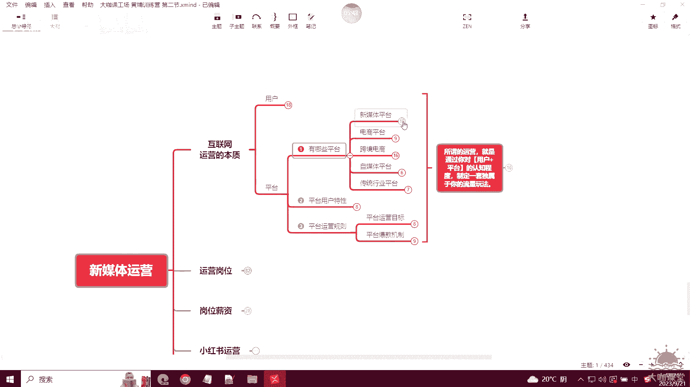
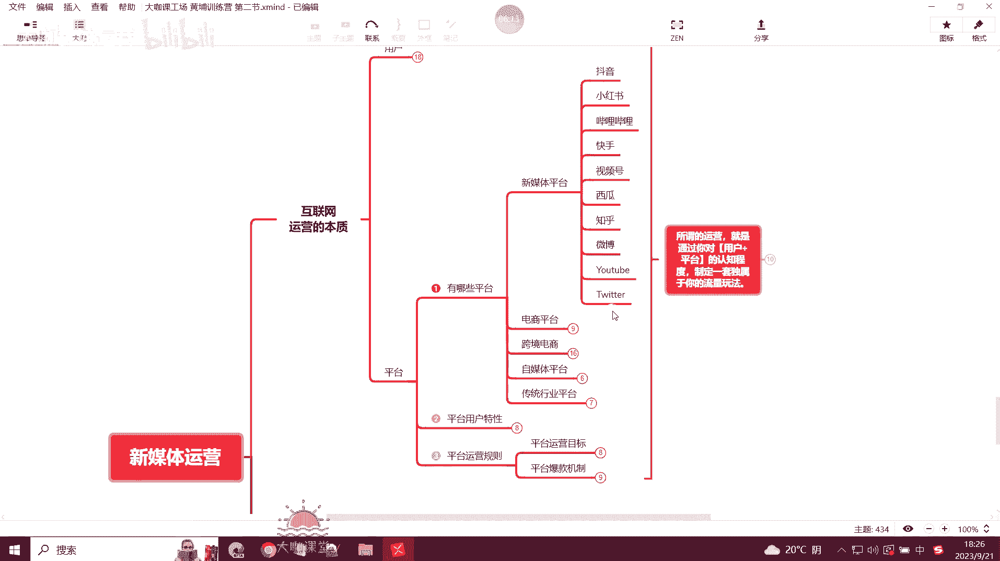

# 【2024B站最新版新媒体运营课】150集全干货 小红书运营起号／涨粉／变现／就业  新手小白入门专享教程 入门到精通 月入3W不是不是梦！ - P35：17：新媒体运营-全行业新媒体运营的背后真相及方法路线 - 大咖私域运营 - BV1zm421N79V

好欢迎大家来到我们本堂课，那么这一堂课呢我将通过这么一节课的时间，去让大家完整的了解，我们做新媒体运营岗位的这样的一个人，我们去平常去运营自己的账号，或者说给企业运营账号，我们去做运营，做短视频。

做直播等等等等，我们要去玩的两个啊，最根本的一个东西，首先我们来看一下互联网运营，也就是说我们新媒体运营它的一个本质啊，所谓的新媒体运营，运营运营运营的是什么东西呢，其实就是只有两个啊，一个是用户。

一个是平台，那么我们一个一个来讲，首先所谓平台的用户。

那么我们知道啊，我们在平台上去做新媒体，做我们的账号做内容，我们肯定是希望把我们的一个内容，推送给我们的用户，对不对，让我们的用户去看到。

那么这个时候我们就需要去做三件事，首先第一件事我们要了解你的产品。

它对应的这些用户群体对吧，比如说啊。

比如说你是做这个考证考公考研的，那么你的用户群体主要围绕的是什么呀，就是大学生群体好吧，那些刚毕业的或者说呃应届生，或者说大二大三大三大四的这种，那如果说你的公司或者说你的产品是做新能源。

或者是做城市基建的，你的客户是哪些，你的客户就是政企类的客户，也就是说啊政府啊或者一些企业呀类型的啊，做这种环保啊，做这个呃改造啊，或者说一些设施建建设等等等等，那这些才是你的客户对吧。

那如果你的产品是做育儿好物，还有家居好物的，那这个时候你的用户群体，可能就是一些居家的宝妈啊这种群体，那么还有如果你是做健康类的对吧，做一些养生类的这种产品，或者是做一些这个呃一些辅助健康类的东西。

那么你的客户群体可能是一些中老年人，他们比较在意自己身体的一个健康状态对吧，然后这个时候你的用户群体你知道的是哪些，那么接下来你还要了解你的一个用户的画像。

也就是我这里跟大家列的，你要知道你的用户群体，他们所在的一个年龄段，对不对，你还要知道你的用户群体当中，哪些性别占比比较高，是男性占比比较高，女性占比较高，比如说你是做美妆产品的。

那么你的客户群体肯定主要就是女性对吧，然后你的这些群体，他们有没有一些其他延展性的喜好，比如说啊女性啊，她们是美妆类的，你做的美妆类的产品，你的客户群体也是女性，她们可能喜欢什么呀。

她们可能喜欢看一些好看的衣服，好看的包包，对不对，然后这是他们的一个喜好，我们把他们的喜好啊给他罗列出来，那么后期如果说我们去做广告投放啊，我们去研究一些，发布一些用户喜欢的内容的时候。

我们就可以用这个方法去做延展啊，做内容的延展，然后最后一个就是用户的聚集地，用户的聚集地是什么意思呢，就是我们要知道我们的用户他们在哪些平台，对不对，我们要知道用户在哪里啊，比如说呃你像现在抖音对吧。

基本上什么类型的用户群体都有，那如果是小红书呢，对不对，小红书，假如说你现在你家公司是做这个设备的，做机械类的，比如说或者卖什么呃，一些豆浆机的这种或者一些传统的机械设备。

你想一想你的用户可不可能在小红书，那大概率不可能的，或者说很少啊，你像这种传统类型的你的产品，你的客户群体他一定啊，首先抖音是肯定有的对吧，然后其次是什么，其次可能会在一些更加传统的。

像呃b to b的一些平台，或者是百度上面去做这种呃搜索排名的这种，那么你的用户群体可能在这些地方对吧，这就是我们了解用户聚集地之后，我们要在它聚集的这个地方，把我们的产品发送出去。

让用户能够在他聚集的地方去看到我们的产品，那这个时候才能提高，我们更高效的一个产品推送，以及我们私域引流的一个效果，那么这是第二点，也就是用户画像，那么第三点我们就要了解我们的用户群体。

他们的一个购买能力啊，比如说他们的一个收入阶层，他们的购买力，还有消费习惯，对不对，我们了解这些数据之后，我们后期再做这个投放平台的一些啊，竞价广告啊，或者说信息量广告的时候。

我们就能锁定这一类的人群对吧，他们的收入怎么样啊，他们是否有消费能力，那么后期我们做用户筛选的时候，我们就能够精准的排除一些呃，呃收入能力很低啊，收入能力收收入比较少的，或者说购买力很低。

消费习惯平常也是怎么不愿意去在网上消费，或者说啊消费很谨慎的这一类人群，我们就可以把它排除掉，我们主要去找我们的高意向人群，那么这个就是我们讲的，我们在运营的时候去运营用户，我们需要去做的啊，这个统称。

我们就可以理解为，就是分析我们的一个用户画像啊。

分析我们的一个用户画像，那么这是关于平台用户这一块的运营。

那么假如说你现在入职了，你去企业里边上班了，你的企业它可能是做各种各样的类型，他可能是做知识类型，教育类型的，他可能是做自己的产品的，那么这个时候你就要想想，想得到你做你的用户群体，他们在哪里。

你的用户群体都是哪些人，这个时候你需要去策划一下，公司的一些内容的产出，视频的产出是什么样的，对不对，那这个时候就是我们要了解的一个用户啊。

也就是我们要运营的一个群体叫做用户，那么其次就是我们要了解的一个。

关于平台的运营，那么平台运营很关键啊，很关键的一点，那么首先第一个我们要了解有哪些平台。

对不对，那比如说举个例子，我们做新媒体，我们做短视频内容，假如说你的内容比较宽泛啊，或者说各类型的都可以适应，你就要考虑，你现在就要知道我的视频需要发布在哪些地方。

才能被我们的用户去看到对吧，比如说啊你像抖音小红书。

哔哩哔哩，快手视频号啊，西瓜知乎等等等等，还有国外的一些啊，YOUTUBE或者twitter这些地方可能有你的用户群体聚集，那么你的视频产出了之后，你就要去在这些平台上建立你的一个官方账号。

或者你自己的一个个人账号，你就要把内容发布到这些地方。

那么发了之后你的用户才有可能去看到，OK那么这是首先我们要了解这一个新媒体平台，那如果说你是啊做产品，你是卖货的，对不对，你是卖产品的。

那这个时候你就要考虑国内有哪些电商平台，你可以去做对吧，比如说传统的电商平台，像天猫啊，京东啊，淘宝啊等等啊，拼夕夕等等等等，这些地方都是可以，你可以去考虑入驻的商家，入驻的平台入住了之后。

那么每一个平台的运营具体运营的怎么样，这也是看我们后期，但是至少在这些地方是有你的用户存在的，那么如果你要做这一块的运营的。

这些东西你都要去考虑，那蘑菇街的话，是一个专门针对女性用户的一个电商平台啊。

你们可以去了解一下，可能很多我们的一些啊，如果说屏幕前的观众你是呃女性用户的话，那么你可能就知道这个东西好，那么这是电商。

像跨境电商，如果你是做跨境的，那可能接触的也要多一些啊，国际性的像网易考拉对吧，天猫国际，京东的全球购，还有TIKTOK的一个啊。

区域类型的一个直播带货，美国的EBAY啊，还有这个亚马逊等等等等，这些商城我们其实都都要都要去注意到。

也就是说啊，这些平台的意义。

就是让我们了解我们自己做的产品，最终可以在哪些平台去做对吧。

还有自媒体平台啊，还有一个传统的行业平台，传统行业平台这个是有一个垂直类型的，就是一般我们做一些呃实体产品的，像做设备，做机械设备类的，或者是做一些啊这种化工产品类的，在这些地方用的比较多啊。

像呃这个百度的这个爱采购对吧，他可能入住的一个年费呢大概四五千块钱，那么你入住进去之后，你可你会在里边拥有一个店铺，其实就跟淘宝还有阿里巴巴平台一样，但是它有一定的垂直性，就是很多。

比如说他想要去做采购的公司，有这个采购需求，有这个设备的采购需求的时候，他就会去这些地方去看啊，这个用户呢他确实聚集在这些地方，像中国制造网马可波罗环球资源，还有中国化工网等等等等。

那如果说你入驻的公司，你去上班的公司，他是做传统产品的，做机械设备的，那么你就要考虑一下，你得把这个b to b的平台先给他罗列出来，然后在这些可以免费入住的上面，或者说公司打算付费去入住的这些平台。

去罗列出来之后，考虑哪些地方是需要去做的。

OK那么这是第一步，我们要知道有哪些平台，然后第二步呢。

我们运营的时候，就要研究这个平台的一个用户的一个特性对吧，比如说抖音对吧。

抖音是全平台全属性的这个用户人群都有，也就是说你如果说是像现在你做电商啊，或者说你做这个呃产品做带货，那么首选的你要你考虑去做抖音的话，那这个东西你肯定是不能错过的，对不对。

除非说一些特别大型的那种呃设备，比如说像什么破碎机啊，或者说一些啊，你像盾构机这种上亿的这种产品项目，你不可能说上架的抖音对吧，还有卖车的，也没有说抖音上面直接给你挂个小黄车，让你在里面买车，对不对。

那么这个时候你的产品几乎是大部分人群，在这个行业里边都有，那么虽然说我刚才举例的这几个，你没办法在上面去做生意对吧，直接去啊销售，但是你是不是可以在抖音上去获取到，你的用户对吧。

所以说这个时候你就要知道你的产品，它的用户诶，我的用户在抖音上面，我就可以在抖音上面去研究这些用户。

他们喜欢什么东西，然后去发他们喜欢的内容，然后第二个是小红书，小红书呢也是一个特色啊，也是一个特色，她是一个就是女性高消费群体，占比最大的一个平台，这个我相信大家都知道啊，小红书最开始是以这个美妆啊。

化妆啊等等这些女性群体，她们一些呃就是购物分享这种啊，像这个包包啊等等等等这些类型的分享为主，种草嘛，对不对，然后的话呃如果你的公司是做美妆，或者说跟女性群体用户这种沾边。

就是他们的啊这个意向特别强的这种啊，就是特别垂直类的产品。

你首选考虑的肯定是小红书对吧，这个就是小红书他平台的用户特性。

然后我第三个举的例子就是知乎，知乎是什么呢，知乎呢就所谓人称是一个高尖端的，一个知识分子的聚集地，什么意思呢，就是呃了解知乎这个平台的都知道，它其实是一个问答平台，对不对，在这个平台呢。

你可以搜索或者找到非常非常多，关于行业内的一些呃秘闻对吧，或者是一些非常有料的这种技术资料，其实就是一些专业人士他们分享的东西，你在这个地方可以找到，当然呢这个平台也有很多人。

他是冲着什么在上面去看一些这个啊，严选收费的这种呃这种类似于小说啊，短篇小说这种类型的，他也有这样一个用户群体聚集，那如果说你的公司需要去做品牌对吧，你的公司需要去做一些科普。

那么你是不是可以在知乎上面去做啊，啊聚集你的人群。

我第四个举的例子是贴吧啊，贴吧这个东西呢，嗯其实现在也有人在用，但是很少，那么我就是说啊，除了一些部分特殊的行业外，90%以上的行业你不用考虑贴吧，为什么，因为贴吧这个东西它已经过时了，现在没有人用。

那如果说你的你的这个公司现在啊做的产品嗯，他的用户也不在贴吧上，但是你公司却要求你去做，那这个时候你就要考虑到在这个平台上，你的付出很可能是得不到回报的，你也运营不来用户。

OK那么这是跟大家讲的一个平台的一个特性。

就是说我们去运营的时候，我们要考虑这个平台它有哪些特点，这个平台上面的用户人群，有没有什么我们可以钻的空子，怎么去针对性地做，符合这些平台上面用户的一些内容。

OK那么这是一个平台的一个特性，那么第三点呢就是我们重点的一个对吧，平台的运营规则嗯，首先我们运营一个平台肯定是有一个目标的。

对不对，那么目标无非两种啊，账号做IP。

然后第二个账号变现对吧，做IP很简单啊，我们提升粉丝数。

是不是提升我们的各种数据，这是我们最终的一个目标，然后如果是你想去做变现的话，变现的方式有很多种啊对吧，接广告啊啊提升粉丝了之后，你可以去接广告对吧，你还可以去依靠，像抖音小红书这种平台的一个电商。

你可以去开开店啊，入驻自己一个店铺，在上面呢去做这个产品的销售对吧，你还可以去做什么呀，私域引流，那么私域引流的话，引流到你的这个微信啊，或者说其他的这种渠道上面，你去跟客户这呃推销你这个广告产品等等。

那么会更直接，那么消费意向也会更强，是不是这是你的一个目标，像矩阵账号也是我们变现的一个手段之一，矩阵账号其实就是相当于。

把上面的几个点击进行扩大对吧，这个我们这是我们运营的一个目标。

也就是说以后如果说呃你去做运营啊，你自己想去做运营，给自己运营账号或者给企业运营账号，你得知道我运营的最终的一个目标，是达成什么样的一个目的对吧，总不可能说呃我去发一些个人日常什么的对吧。

你如果说发个人日常做生活分享，那你也不会来看到我的视频，OK那么这是平台的运营目标，然后最重要的一点就是我们研究的一个平台。

的一个爆款的机制，对不对，我们要想办法去弄明白这个平台，我发什么样的内容，我的内容怎么去策划，怎么去设计，能够让我的内容去上首页，让这个用户，让平台能够推送给更多的用户，从哪些方向，从像账号领域的定位。

人设的一个规划，封面的设计，内容的设计，标题的设计，还有研究在平台上什么时间段去发布，然后我的一个账户日常的活跃，也就是更新频次，还有我去做多个账号的一个矩阵等等等等。

那么这些就是我们要去研究的一个平台的规则，对吧，我们在前面其实跟大家讲过，任何一个平台，他现在哪怕都大家都是采用的这种，千人千面的标签性的这种推送啊，定定向推送。

但是它背后系统都有它的一套这个逻辑和算法，对吧，那么这个算法我们没有办法去明确的，知道是什么，因为平台它也不会公布对吧，但是它是有一定规律和逻辑可循的，那么这个时候我们就要研究清楚这个这些平台。

它的这些点到底是怎么玩的，那么等你把这些东西玩透了啊，你全部学会了就代表着你出师了，那这个时候你不管是给自己做账号，还是你去找工作，那么你都是大拇指啊，行业里边的top这一层级对吧。

因为研究透了平台就代表着什么，代表着我可以把一个东西从零做到一个。

非常高的一个高度啊，这就是我们运营的一个表现，Ok，那么这是我们刚才讲的。

关于平台的这个一个运营规则啊，那么其实呢就是新媒体运营这个东西啊，就是讲你对用户以及对平台的一个，整体的认知程度啊，你对这个东西的了解，然后制定出来的一套独属于你的一个流量玩法，什么意思呢。

就比如说我们家是卖豆浆机的对吧，那么我研究透了，像抖音的电商里边直播带货到底怎么玩的，然后呢这个小红书上面适不适合开店，然后我适不适合在哔哩哔哩上面去做，我这样的一个运营。

那么这就是你涉及到针对你的产品，然后去研究透了你的用户，他们在哪，他们喜欢什么，然后这些平台上面适不适合我去做，最后你设计出来的一套运营思路，OK那么这就是我们新媒体运营的一个本质啊。

然后我们运营的刚才讲的啊，就是我们的一个目标对吧，我们运营能够实现的两个点，一个是去产品销售对吧。

我们可以去卖货对吧，如果是品牌很简单，你去卖自己的产品，如果是个人，那肯定是做自己的IP，IP做好了之后呢，我们可以去做新媒体创业，然后我们也可以去开通自己的一个个人店铺，去实现平台的一个电商销售。

那如果你只是想去做粉丝，你也不是去给公司做账号，你只是做自己的一个账号，你可以把粉丝做起来了之后，你可以去接广告对吧，抖音的新图，小红书的蒲公英，还有B站的火花，那么这些可以让你实现利润啊。

可以让你实现变现的平台，就是你最终的一个粉丝经济所带来的来的，一个收入对吧，那还有直播带货就不说了，你可以给自己带货，对不对，你也可以给别人带货，那么这个时候带货的时候，我们知道我们要去布置场地对吧。

我们要去讲这个直播话术，然后我们要去场控，有时候可能还要投流，那如果你自己懂这么一套流程的时候，你去给自己带货，是不是在这当中能够省下非常多的人力，物力等等各方面的这种成本和支出对吧。

那么这就是我们这一节课要跟大家讲的。

我希望大家能够明白啊，因为很多呃我们看我们视频的确实小白居多啊。

我希望大家能够明白，就是我们运营的一个最终的一个本质，我们要实现的目标，还有我们运营的这两个点，我们始终是围绕着这两个点去玩运营的好吧。

