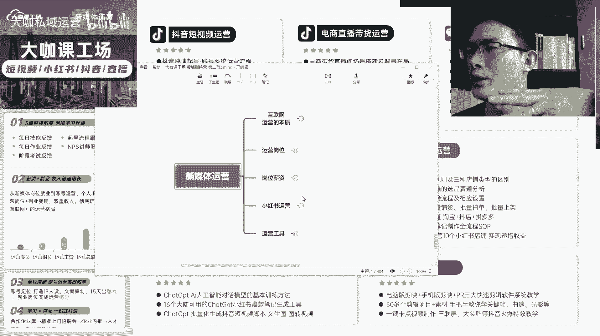
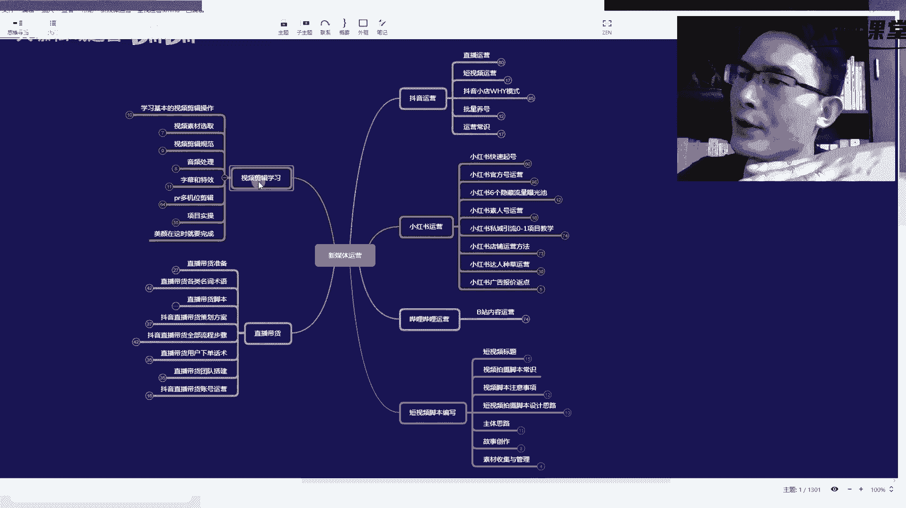
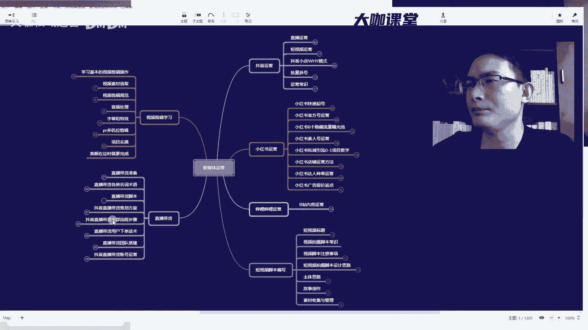

# 【2024B站最牛新媒体运营教程】零基础小白入门必刷课程小红书运营运营／起号／涨粉／变现／就业 全程干货无废话 保你7天上岸就业！ - P27：09：新媒体运营-3w月薪的高级新媒体运营学习路线图 - 大咖私域运营 - BV16D421u73H

的本堂课啊，那么我们这一套系列课的主要核心内容呢，就是来讲，我们的一个小红书的运营方法和运营规则，那么学了这套课程，我相信你应该能够掌握小红书啊，我们从一个对小红书不太了解的小白，或者是一个新手。

那么从零开始，我们怎么样才能让我们的笔记能够出爆款，让我们的账号能够持续不断的涨粉丝啊，我们的赞藏数据能够持续的增长，那么这是我们运营小红书的一个本质，也是我们这套课啊，这一堂课能够让你玩明白小红书。

它的一个这么一个价值所在，好吧，那么我们这套课啊，跟其他的这堂这些课程不一样，那么我们的课程呢，现在的录制时间是2023年的9月份啊，现在是9月10几号，那么我们现在啊在网上能看到的，所有的其他的课程。

你能学到的这些内容基本上都是已经过时了的，你学到的那些视频，你看的这种几10万的视频啊，十几万的这种视频，那么他们很有可能是17年，18年，19年二零年这样的一个视频。

那么我们这儿小红书从去年啊也就是22年，一直到今年23年，它的变动，它的发展是最为迅速的，这么两两段时间好吧，那么尤其是小红书现在布局电商领域之后呢，他的很多规则，包括他的笔记。

包括他的这个私信引流等等，各种方向都做了非常大的调整，那么如果说这个时候，你还在跟着以前那种老板啊，或者说以前过时的那种视频来学习，那对你自身来讲是一个非常大的这种呃。

可以说有可能对你对你带来一些不好的影响，好吧，那么我们学习学习运营，我们运营的这种技巧技术啊，其实就是研究一个平台的底层的运营逻辑对吧，那么我们从发笔记开始，我们从做账号啊开始，我们做了很多账号。

那么在这个过程当中，我们就能发现哎平台他是怎么样才能给我曝光，平台是怎样才能给我流量，对不对，那么我怎么样，我的一个笔记，我的一个账号从零粉做到万粉，做到10万粉，做到百万粉。

那么它中间的一个过程是怎么样的啊，每一层级的流量，我的笔记的曝光是怎么给我的，那么这些呢其实就是我们运营的一个本质啊，也是我们需要学习的东西好吧，那么首先啊，呃我们在了解了这一套价课程的价值之后。

我希望说各位同学能够把这个视频收藏啊收藏，那么收藏了之后呢，后续我们持续更新的内容远远不止小红书啊。

远远不止小红书，那么呃能看到老师桌面的啊，你就能看到我们其实所讲的所有的内容，包括小红书的流量运营，我们的平台的素人号赚钱的方式啊，爆款小红书账号的底层逻辑呃，流程化的运营包装选题对标。

还有我们小红书的电商对吧，还有我们的pr视频剪辑，以及现在非常火的china jpd，AI人工智能那个辅助创，那么这一块呢是有非常非常多，对我们小红书创作，能够提供高效运用的这种工具。

那么我们现在做小红书绝对不是说靠自己啊，天天一个礼拜去想啊，冥思苦想的写一篇笔记出来，然后这篇笔记还不一定报，我们现在讲究的都是AI，加我们的一个运营思路的结合。

能够把这样一个非常优质的笔记快速做出来啊，甚至说批量出来，那么这是一个工具化的，那么包括我们抖音，抖音的短视频，那么这是大家现在关注新媒体运营，它的流量的一个核心。

我们都知道抖音的流量不需要老师去多讲啊，想做抖音的，就是想做电商直播带货的，想做小红书，想做小红书电商运营的，你就要把这个视频收藏好好看好吧，这里所有的内容这个版块，所有的内容老师后面都要讲啊。

包括我们那么这一块视频遮住了啊，那包括我们在这个企业级全站的一个，社群运营当中，那么社群运营我们相信大家应该不陌生啊，其实不光是我们现在很多品牌，做这个思域的这个社群运营，其实我们呃像哔哩哔哩啊。

抖音啊，小红书，他们其实都有自己内部的一个官方的运营团队，对吧，他们这些运营团队呢其实就是来运营客户的，那这种运营客户的方式啊，组建群组，群组当中呢分享一些非常有意思，有干货的这种资料啊，学习啊。

直播啊等等，这就是一个社群运营，那么像这些大厂都在做，那我们如果说自己做产品对不对，你比如说你是卖某个小饰品的对吧，你是卖小吃的，或者说你是当地做什么线下的美食容易聊的，那么这种东西呢你要去做你的客户。

那么你也要去学会怎么去玩社群运营，也就是说客户到了你的手上，单对单，你可能不一定能把它搞定，但是到了社群当中，你通过社群里边的运营方法，每天跟客户分享固定的东西，固定的知识。

然后跟客户进行一个深度的交流，让客户对你产生一定的信任感，然后逐步增加你的这个了解，那么这个承担成交，这在后续的这么一个演变中，那这是非常火的啊，也是现在很多新媒体互联网当中，客户成交的一种主流方式。

那这个我也会教大家仔细啊，仔细去教大家这个东西怎么玩啊，那么我们呃我们这一堂课的主要的一个核心点，就在这里啊，除了这个地方给大家介绍的，还有我们呃就是所有的一个详细的内容啊，这里有一个非常详细的。

就是关于我们新媒体这一块要学的所有的内容，以及我们后续的一个课程的规划，也相当于是我们这一套系列课啊，我们放在这个视频里边，这套系列课后面要更新的一个整体的一个，视频逻辑和方向，那像抖音运营。

我们会去教大家怎么去做直播短视频怎么做啊，抖音小店怎么做，然后我们的养号，还有一些关于抖音，现在的一些运营玩法和运营常识的，我们小红书运营这一块会教大家起号，会教大家一些企业号的一个运营方法，流量池。

素人号以及私域引流的一些项目的分享好吧，非常非常多啊，内容非常非常多，除此之外我们还史无前例的啊，史无前例的全网啊，唯一的时候可以说跟大家分享，我们现在哔哩哔哩，也就是我们B站这个平台到到底应该怎么玩。

它的一些隐秘的玩法，这个呢是非常非常珍贵的，可以说全网独家没有好吧，其他地方你找不到，你找不到，而且尤其是2023年9月份最新的教学啊，这个呢都是后面会陆续更陆续出的，陆续出的。

还有我们短视频的脚本怎么去编写直播带货啊，我们的视频剪辑，那么这个这个文件非常非常大，这个文件有感兴趣的同学，你加到我们的老师，那么我们啊我们老师的联系方式呢。

就在我们的这个呃屏幕的左上角啊，老师这里看到的是左上角，这里有一个这个地方啊，你们去呃关注一下啊，这个领资料这个地方，那么这个资料就会发给你，但是这里我要给大家提醒一下。

这个资料，老师给到你以后呃，他是TM的一个思维导图的格式啊，千万千万，如果你的电脑配置不够啊，不要随随便便去打开，那么一打开，可能你的电脑就会炸，这个里边的资料内容呃，接近有4万多个字啊，有4万多个字。

就光这里边的内容非常非常的庞大呃，老师的电脑呢可能还是性能配置比较好的，这个啊打开还没有问题啊，如果说分享给了你这个资料，你电脑配置不行，你就跟老师说一下，哎呀我这个电脑可能比较差，这个思维导图打不开。

老师能不能给我分享一个图片格式的，或者说其他格式的啊，那到时候我们就根据这情况，我们相应的东西分享给你，那这个思维导图呢也是目前史无前例的一个啊，包教我们去做运营，做各种渠道的一个运营的完整资料好吧。

这个资料非常非常大，你看这里呢它会显示有具体的节点，那么这个数字就是它的节点数好吧，这是它的节点数非常非常多好吧非常非常多，那么我就不一点给大家点开看好吧，我们后面的视频就大家111来讲好吧。

我们逐步来讲，OK那么这是我们这一堂课啊，以及这个视频要教给大家的一个主要思想，以及主要的一个价值，我希望说大家都能够理解好吧。

