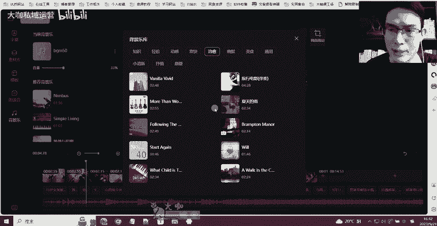
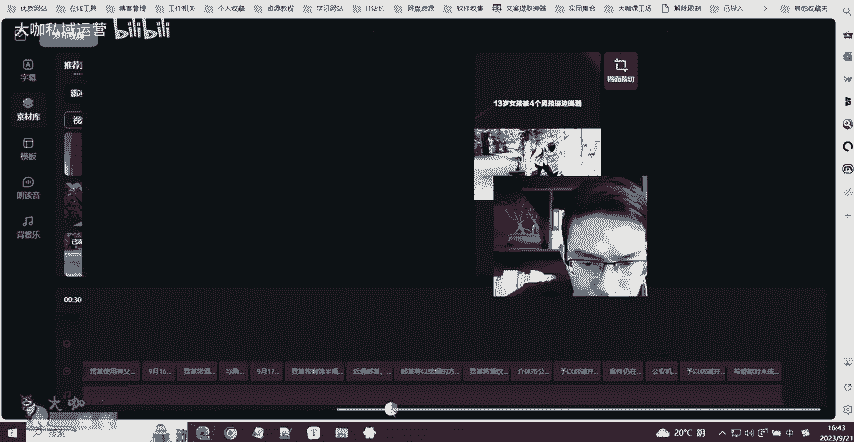
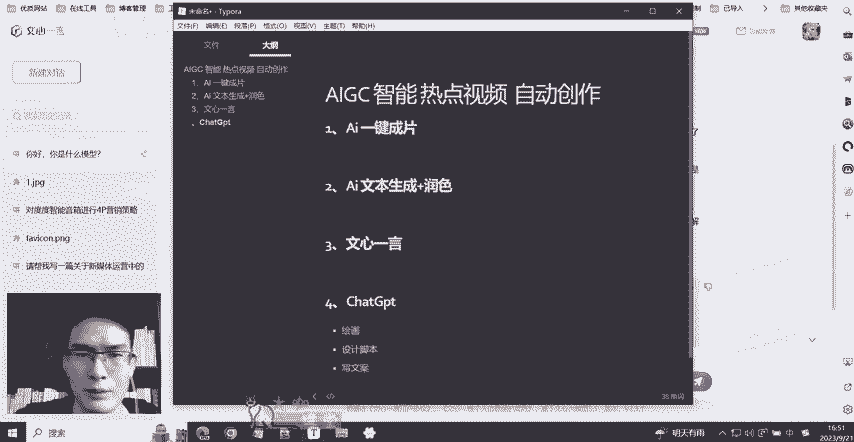

# 【2024B站最牛新媒体运营课程】小红书运营涨粉／抖音直播变现／短视频剪辑拍摄／AI文案创作 7天出爆款的绝版教程，白嫖拿走！ - P33：16：新媒体运营-百度AI一键自动生成热点视频工具 - 大咖私域运营 - BV1Ai421Y7Uq

OK好，欢迎大家来到我们这一堂课。那么这一堂课呢应该是啊干货非常满满啊。那么这一堂课呢我们将为大家推荐一个AIGC智能热点视频的一个全自动的创作啊，那么这个东西呢我相信呃有关注运营的同学。

你在这个抖音上啊，或者说其他的这些渠道应该有经常刷到啊，也有看到一些这个博主在用这个玩意儿去收费啊，去搞一些这种内容呃去教学。但是呢这个东西呢其实它的一个门槛并不高啊，只不过是很多人他并不知道这个东西。

那么这堂课呢，我们就是跟大家讲一下这个工具，它的一个使用和它到底是怎么去生成的这样的一个过程。好吧。😊，嗯。OK那么它这个功能，我们今天推荐的工具主要有2块啊，一块是AI一键成片。

一个是AI的一个文本生成，还有润色。那么首先来看一下呃，进到界面之后呢，我们先看一下首页这里有一个AI成片，还有一个AI笔记。那么导航的话呢，在左侧这里也有我们先点击一下这个AI成片。

AI成片呢主要有2块。第一块呢是在这个输入文案。这个地方，你可以去把你其他地方做好的这种内容或者视频脚本文案，你把它放到这个地方粘贴个粘贴下来，它就可以在这个地方一键成片，帮你去自动搜集素材。

以及自动为你匹配这个声音，也就是把你的这个视频给给它做出来。然后还有一个是啊这个选择文章成片的话，是你需要有一个百家号。那么这个百家号的话，你要注册之后呢，在这个呃成为这个百家的一个创作者。创作者之后。

你需要在里边去发一些文章，发一些原创的这种内容文案。过了之后呢你就可以选择这样的一个文文章的它的内容就会出现在这里，你可以选择它，然后去一键成片。那么这是它这一块的一个使用外部文案去。😊。

帮你生成视频。然后还有一个非常炸裂的功能，就是在它右侧啊呃右侧我们这来看一下，它有是有一些热点的。我们看一下啊，那么你看得见的话，应该像这个伴娘啊，被多人拿灭火器喷倒啊，这个呃喷倒倒地被拿灭火器喷啊。

倒地痛哭啊，这个文案我昨天也刷到过啊这个这个热点，然后下面还有这个13岁的女孩被别喝一瓶白酒这个热点。然后这个我相信你们大家或多或少这些热点你们都刷过啊。

那么这个时候它的一个炸裂的功能就是它可以根据你这个地方的热点，你去一键生成文案，它就能给你生成实时的这样的一个视频素材，他自己搜索那么这个价值就不用我多讲了啊。首先第一个AI成片，它全自动成片。

不需要你去剪辑，搜集素材，搜集文案。第二个就是它可以蹭热点啊，也就是说像娱乐的军事的社会的等等各种类型的这种也就是还有我们当下很火的这种亚运会的对吧？那么像这种内容的热点，它全部都可以给你去蹭啊。😊。

基本上是没有太大问题的，而且视频呢不会太长。基一般的话是在一分钟等啊一分钟左右啊，一分钟左右。那么像这种短视频的话，它的完播率，还有这个覆盖的人群都非常广。而且做这种热点视频，有一个点。

就是呃平台不会去对你的这样的一个垂直定位的这个东西，要求的特别苛刻。也就是说呃比如说你像这种新闻类型的，你的账号不是做新闻的，你发了这个内容，只要你的账号可以发，没有违规啊，能够成功发布。

那么这个账号这个内容就有可能被推荐给更多的热点人关注。因为什么呢？因为平台它也需要流量，对吧？他需要流量，就是更多的热点能够吸引更多的人到他的这个软件也就是到他平台上去看，也就是说热点这个东西。

不光平台喜欢用户喜欢啊，我们也喜欢好吧，那么比如说我们现在拿这样的一个呃热点，我们来生成一个文案。😊，嗯，就这个吧。🤧。我们稍等一下啊，整个过程只要不出意外的话，应该是几十秒钟就可以给你把文案写出来。

我们稍等一下。好，那么我们看一下啊，这个文案已经出来了啊，文案已经出来了。13岁女孩被4个男孩逼迫喝酒，喝至醉酒休克，地点在祠堂里。

13个女孩被4个男孩逼迫喝酒。嗯，这个AI的话，他也还是有点东西的啊，他把这个呃比较吸引人的这种内容呢放在了前面啊，放在了前面，这个还是有一定的这个水平啊，有一定的水平。

那么如果说AI给你生成的文案没有在这个开头有一个特别吸引人的点，那么我建议你把这个点放在这里加进去啊，能够大幅度提升你这个视频的一个点击率啊。

现在全网很多人这个粉丝比较多的这种做的比较好的博主都在用这种方法，他们会把这个视频里边的一个核心主题关键点，就是特别能引爆别人想观看这种欲望的点放在开头这么几秒钟啊啊，这个这也是一个技巧。

那么我们看一下啊，整体检查一下啊，这个你们要自己过滤一下。如果说你要发布的内容。AI的话，虽然说他在这一块的呃符合一定的规则啊，也法律啊这种规定，但是我们自己在生成这样的一个文案之后。

我们作为发布者一定要检查一下这个文案有没有违法违规或者不对的地方啊，这个一定要注意啊，很多人在这一块经常翻车啊，像。😊，我们最近知名的某某戏子的这个博主啊带货的这样的一个事情。

其实很多都是因为自己不经意的这样的一个错误啊，犯出犯了这样的一个错误，最后导致一些不可挽回的结果啊，那么我们作为运营，作为一个自媒体人，在这一块的细节一定要注意。

OK那么比如说我们大致检查了一下文案没有问题。那么好，我们再来看下面一个这个地方有一个关键素材推荐这个地方呢就是我们点开看一下啊。😊。

这个地方呢A是AI在网上抓取到的关于这个与与你当前这个热点新闻话题相关联的这种素材。那像这种通报类的素材，我们就没有嗯直接选择这个就可以了。这个就会AI就会把你选择的这些重点素材主要添加到内容当中啊。

主要添加到内容当中。那么这个也有助于我们把这个AI生成的这个视频往这个真实更加真实，更加类似于自己创作这种程度去贴去靠啊。那这是第一个点，我们选择一些对应的素材之后呢，我们点击这个AI一键成片。好。

那么我们等一下。好，那么他已经在开始自己去补充素材了啊。那么这个呢这个文案我这个这个短视频我看了一下它的这个文案，应该差不多有个2分钟左右吧，一分多钟啊一分多钟。嗯，这也是一个实时的一个新闻热点啊。

每个人拿到的这样的1个AI文案呢，它会或多或少有一些不一样啊，不是说大家所有人AIAI文案生成的都是一样的。

好，那么我们来看一下啊。🎼13岁女孩被4个男孩逼迫喝酒，至醉酒休克，地点在祠堂里。9月21日，山西省介休市公安局发布警情通报，通报称，9月18日10时42分，指挥中心接群众报警。

其女儿讲OK那么从配音上面来讲啊，整体没有太大问题啊，整体没有太大问题。呃，我们来看一下他有几个选项。首先第一个像这个素材库啊，素材库里边呢，我们要跟大家讲的呃，比如说这第一个我们来看一下啊。

我们来看一下第一个。

🎼13岁女孩，这里是片段啊，喝酒呃这个片段呢我可以给你们讲一下，这个片段是匹配的是不对啊，这是AI从他自己的素材库，以及从这个网上抓取来的素材库来做匹配的。那么有时候它会因为一些像这样的一个片段丢失。

对吧？有时候没有匹配上啊，有一些这个简短的片段丢失。但这个东西呢就需要我们自己在这个地方去找一些素材来做匹配。那么这个找的话也不需要你自己去找，我们直接在这个地方去搜，比如说这个素材我们觉得不合适。

因为这个呃我之前配置的这个这个文案，我测试的几个都还可以啊，都还可以。我看一下啊。😊，啊，比如说这个这是我之前生成的一个呃，也是做测试的，还可以的。🎼女子在高铁上座位备战，换回座位后遭三人殴打。

警方已介入调查。9月14日在G2610次高铁啊，有点卡。女子座位被换回座位后却遭三人殴打O那么大部分这种素材新闻素材基本上都是能够匹配得上的。那么像少量的这种刚刚出来的特别新的或者说呃新闻类型这一块。

他没有涉及到的领域，可能会有一些素材缺失。那么我们就考虑给他去做素材替换。那么首先这个地方呃我们切换第一个素材的一个方法是在这个地方去看啊，这个地方去看。那么如果没有合适的，那么我们就在这里搜啊。

这个地方有一个给你提供素材搜索的一个地方啊。我们来搜一下这个吧啊，看一下它有没有对应的素材提供。我们这样。换一个。啊，跟我们尽量跟我们这个视频内容更相符合的。OK假如说我现在把这个替换上去。

我们来看一下这个视频前面能不能看得通。🎼3岁女孩被4个男孩逼迫喝酒是最好有那么一点相像了，是不是有那么一点相像了。当然这个素材呢可能有时候我们自己要配一下这个呃什么呢？

我们就在视频里面写一下当前素材来自于网络啊，不代表啊这个正原视频，不是原视频啊，我们做一个这样的声明。类似于这种新闻类型的，一定要注意啊，一定要注意。然后呢，像这个素材有一些素材不合适的。

我们就要考虑替换。然后这个地方有一些需要去添加。那么这里是我跟大家讲的这个你去找素材的路径路径啊，一个是推荐素材，还有一个是本地素材，本地素材的话，就是你可以去找一些合适的素材。

在你本地上添加到这个地方传到这里就可以了。😊，OK那么这是我们去替换素材的地方。然后呢，模板这里呢其实也没有什么可以替换的啊，差不多都是这样啊。你如果说做横版视频呢，它有横版的模板给你用啊。

竖版的呢我们一般现在发的竖版的多啊或者什么样的，你用这这种类型的可以。然后还有一个是朗读音和背景音乐。朗读音呢这个地方呃它提供了有几种内置的这种声音啊，我们可以根据自己的这个具体的情况去选。

欢迎使用图文转视频。😊，好，比如说我们现在用的是这个，然后我们可以调整一下它的语速，欢迎使用。🎼啊，我们调整语速之后，我们再来看一下为什么要调整语速啊，就是有一些这个视频，像我们这种比较急促的这种视频。

我们就需要让它哎读起来更加的节奏快一些，让观众能够感受到一种紧张刺激的情绪。13岁女孩被4个男孩逼迫喝酒至醉酒休克地点。😊，啊，这个声音还比较机械化啊，我们可以选择一个欢迎使用图文转视频啊。

比如说我们换一个吧。换一个这个我来试一下。🎼13岁女孩被4个男孩逼迫喝酒，致醉酒休克地点在此O我跟你说一下这个声音其实也不太对啊，也不太对。我们可以换一些其他的这种更多的这个腔调啊。

更多的腔调去尝尝试尝尝试一下啊，把我的这个声音都给我搞变了。然后这个是呃朗读音背景音乐呢在这一块去更换啊背景音乐的话，首先它内部自己有自制一些呃音乐啊，但这个地方的音乐数量比较少啊。

我们可以点击这个三个点，然后点击更换音乐，那么这里边呢会比较多啊，它有推荐对应的类型的有分类的这种音乐，也就是背景音乐。当然这个类型也不是很多。而且呢我目前为止没有看到可以就是自己上传这种选项。

也就是说背景音乐这一块，目前只能选择它平台内置的。当然啊我们作为新媒体运营剪辑视频肯定是我们擅长的东西，对不对？你把这个视频呢给它弄下来之后啊，你的背景音乐是不是你去剪辑的时候想换啥就可以换啥啊。

那么除了这个对不对？还有一个点啊，你发完的视频呢可能有时候啊这个背后的这一这个这这个小东西你不是特别想。😊。

要啊这种这种这种这种这种水印，你也不是特别想要，你是不是可以唉剪辑的时候，你自己剪一下啊，这不就完了吗。好，那么这是关于这个一些AI成片的这个一个使用啊，那么剩下的一个就是关于我们把这个视频弄好了之后。

怎么给它下载下来，就是很多人在用啊使用这块也会出一个问题，就是我视频做好了，我不知道去哪下啊。那么我现在告诉大家大家呃，你做好了之后，你点击左上角这个地方啊啊，你们的应该是在右上角啊。

点击一下这个发布视频啊，还有7个位置没有添加素材。😊，嗯嗯。等一下啊，我把这个素材添加一下。这个缺失的素材还挺多的呀。呃，看一下这里还缺一个。

前面还有没有？这里还缺一个4秒的素材。OK应该好了啊。好，我们点击发布视频哎。😊，没有啊。哪里有素材缺失了？逗我玩了呗。啊，这里不好意思。这么小一个字谁看得见？好吧，简单加一下。OK给它加上去了。

然后我们点击这个发布视频。OK那么这个按钮完了之后呢，呃这个地方它不是发布啊，我们可以选择不发布，我们直接点击这个地方生成视频。OK我们等待一下，它一会儿呢就会跳转到一个生成视频等待的一个界面。😊。

OK那么在这个地方大概几分钟左右，他会把这个视频给你做好啊，做好了之后呢，这里会出现一个下载按钮。也就是像这样的啊，你点击这个下载按钮。那么这个视频呢就可以被你下载到本地。下载本地之后呢。

你可以对它进行一些调整，简单的优化啊，完事完事了之后呢，你想发哪里啊，你就发哪里那么当然啊我们建议大家在使用工具的时候，一定要遵守国家相应的这个法律法规，还有平台的一些规则。O不要去造谣。

也不要去利用这个工具做一些非法的事情。好，那么呢这是关于AI成片。那么第二个呢，我们介绍的是关于AI笔记啊。AI笔记AI笔记这一块呢，呃其实他可以理解成绩就是一个给大家提供这个文本创作的啊。

掐GPT这个东西相相应啊，应该呃观众屏幕前的这个观众老爷们应该多少知道啊。😊。

这个东西呢也是我们后面的视频会跟大家去讲的啊，会跟大家去讲的。这个工具啊，我们作为新媒体运营人，你不管是呃什么样的一个水平，或者说你后面打算怎么样，这个工东西你一定要知道，并且你要知道它怎么用。

你有哪些可以用的方法啊，他能为你做哪些事儿啊，比如说呃我们啊现在AI能为我们做的。比如说AI绘画，对吧？啊，但是绘画不是这个工具，就完成的啊，绘画可能我们用的比较少，设计师用的比较多啊。

或者是搞一些创意，做号用的用的多啊，这个像GPT可以去给你设计脚本啊，然后呢还可以给你去写文案。😊，写文章啊，然后呢还可以给你去干什么呀？其实很多啊关于文案创作类型的，它能做的东西很多很多。

但是我我一直强调就是AI智能工具这一块呢，呃就是目前有两个行业的人是必须要去了解和应用的。第一个呢是做开发的啊，也就是说你是去搞程序员java啊或者说啊或者些等等。你做这一类开发语言的人。

那么你用对你的帮助会特别特别大。因为他可以自己去写程序，并且还可以帮你分析你的程序和代码里边有哪些问题。然后第二个啊用的最广泛的就是我们做运营的。那么不管你是做直播的，他可以帮你设计直播话术啊，然后呢。

你是做这个呃企业运营的，他可以帮你去写文案，让你去做这个企业里边的一些产品啊，或者说品牌的一些宣传和推广，然后绘画等等啊，一些这些东西呢都可以很有用。那么这2块我希望大家一定要去了解一下啊。

那么我们今天推荐的这个呢是百度的一个AI官方的一个应用。那么AI助手这一块他可以给你去做润色润色的。😊。

相当于是你把你的文案贴进来，它可以帮你去优化一下啊，优化一下。我们这里就不演示这个了。我们来看一下，它要帮你写。比如说写这识观点，那么这是我之前生成的一篇关于量子力学的啊，我们再换一下啊，我们换一下呢。

😊，唉。好，我们比如说现在有这样一个话题，我们来让它生成一下地球还有多少年的寿命，怎么保护地球。然后呢，大概要不了多久，它也会把这个东西给你生成出来。

然后这里呢是我们刚才已经合成的我们自己创作的这个视频啊，它已经给我们做好了。那么你点击啊我知道了，过会儿呢，你去这个我的作品。然后呢。😊，网不行了。好，那么他应该是已经好了啊。嗯嗯。等会儿啊。

我是在这个地方。我们先让它写完啊，写完了我们再来看。😊，好，他已经给我们写好了这样的一个文案啊。然后这个文案呢写好了之后呢，我们就可以把它填入到这个地方，然后作为啊可以直接发布，也可以保存等等啊。

然后这里呢可以去配图。那么这是关于它的一个内容的一个输出，也就是AI笔记的一个应用。然后文笔润色。我刚才也跟大家讲了，它是可以去帮你做一些呃也就是说你写好的文案啊。

或者说一些呃这个演演讲稿等等之类的有一些问题啊，它发在这里，它可以帮你润色一下，给你简单的优化一下啊，这个是我们这个这个这个模型啊，也就是这个工具是我们国人产品开发的。

是我们的百度官方去开发的这样的一个大模型，它其实也叫呃百度的文心一言。其实现在呢啊虽然不能完全跟跟这玩意儿去比较。但是还是比较符合我们国人的一些使用习惯的啊，下面也有一些功能啊，很多人用的也比较多啊。

也比较多。然后呢这是关于它的一个AI笔记啊，另外呢在同时给大家推荐一款啊国内不用啊，不用去爬梯子也可以用的一款AI对话的一个工具啊。😊，它叫做百度的文心语言啊，文心语言。

那么这里呢我们来看一下它的一个界面。那么这个地方它可以对我们的呢像这个呃这是之前测试啊测试的，就是了解一下这玩意儿怎么用。那其实这个地方呢它都有的啊，都有的。我们可以在这个地方去提问，跟他对话。你好。

你是。什么。你是什么模型吧？嗯。请帮我写一个。呃，写一个关于。眉笔的。产品。广告。

好，我们发给他看一下他能不能写啊。😊，归功于我们的神奇眉笔。好，那么这个东西呢可能有点浮夸啊，有时候呢我们需要肯定需要去优化一下A的这个工具呢可以作为辅助，但是我们不能完全依靠它啊，依靠它。

那这个东西呢也也也挺厉害的，基本上是够用了，够用了。虽然说有一定的重复的概率。但是还好啊还好用起来还是挺挺香的，用起来还是挺香的。那么呢这是我们今天跟大家推荐的几个关键性的工具啊，这个还是没讲的。

这个是我们放到后边去讲的。然后呢，今天主要跟大家推荐的。😊，诶。百度的这个文馨一言。嗯，文献一言这样的一个工具啊。OK那么这是我们这一堂课里边的一个主题。如果说对这个里边的内容工具比较感兴趣的话。

可以在评论区私信啊，或者说联系我们加加我们评论区置顶的这个微信啊，都可以。O那么这节课就讲到这里。

