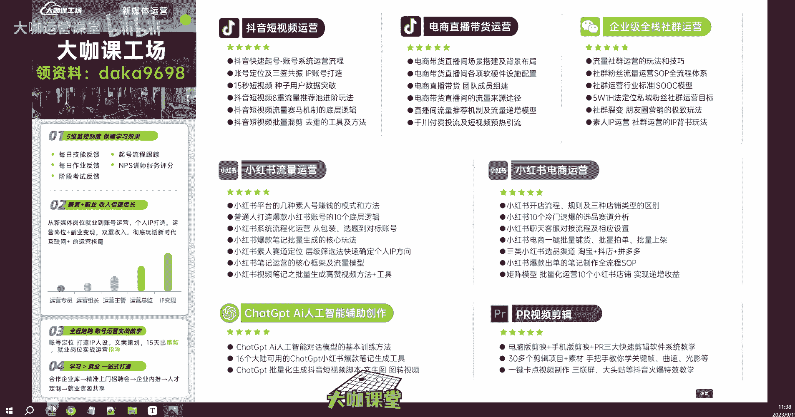
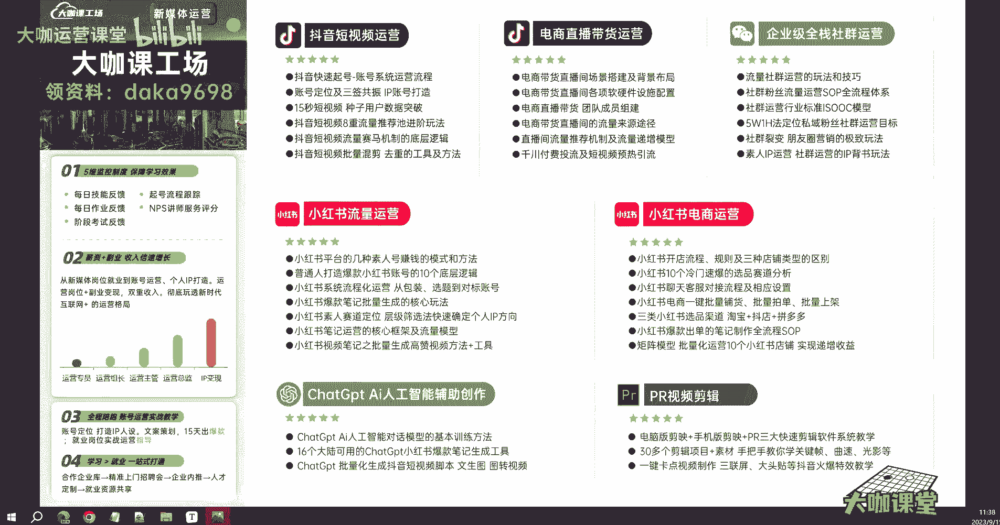
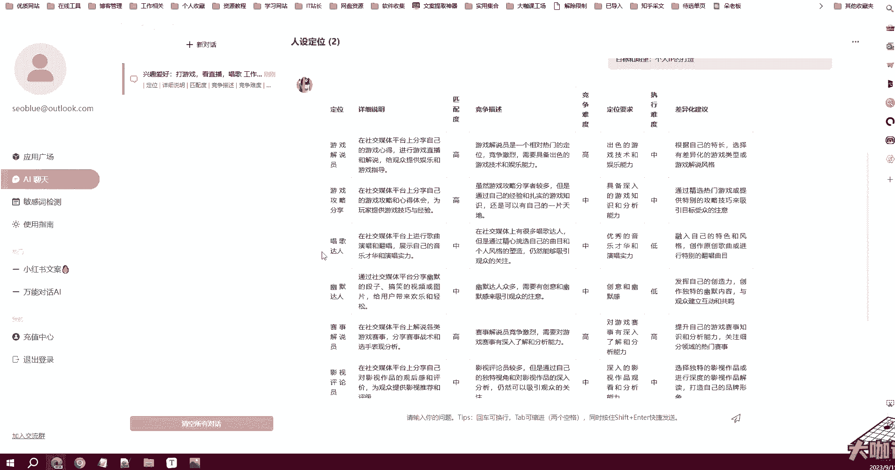
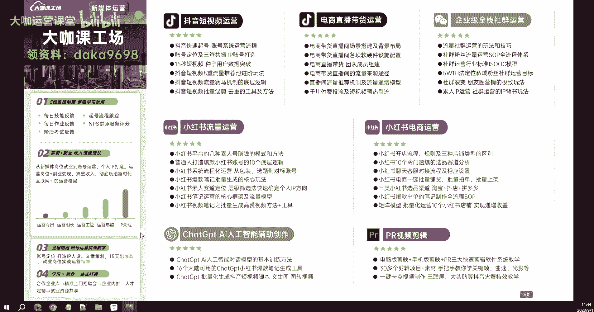
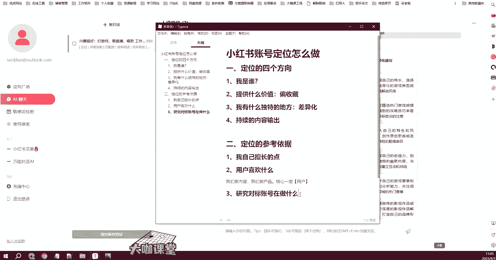

# 【2024B站最良心新媒体运营全套教程】比付费还强十倍的自学款课程 小红书运营 起号／创作／涨粉／变现／就业 7天出爆款 惊艳所有人！ - P11：01.9：新媒体运营-小红书Ai人工智能模型辅助定位工具分享 - 大咖运营课堂 - BV1cM4m1U7G5

OK好，那么上一节课呢我们跟大家聊了小红书的一个账号定位怎么做啊，去做定位的思考的一个四个方向，分别是我是谁，我能提供什么价值啊，我这个账号呢有什么跟别的账号不一样的地方。

然后我这个账号是否有持续的一个内容输出等等等等。通过这四个调整啊，通过这四个优化，去让用户能够对我们的账号产生一个关注的冲动，好吧，那这是我们做定位的四个方向，然后呢，我也跟大家讲了。

我们要去做领域定位的四个三个点，是吧？首先这个点呢我一定是自己擅长啊，哪怕不擅长，也是自己能够了解或者有渠道深入了解的这么一个点，对吧？这一个方向。那么其次啊也就是我跟大家讲的用户。

用户这个词其实非常关键。我们不管是做产品还是做内容啊，还是做服务，我们的核心一定是用户，那么做内容运营这一块呢。一定要明白一点，就是我们的这个内容可以给用户带来什么价值啊，一定是做的是用户喜欢的东西。

那么这个喜欢的东西怎么去判定。我们可以通过啊分析平台，对吧？分析大数据领域等等这些渠道来知道啊我们这个行业唉用户关注的是哪些点等等，对不对？那么这个呢会涉及到一些相应的工具和平台的一些数据的分析。

那么这个我们会在后期跟大家来讲具体我们怎么去查找和分析。好吧，那么呢还有第三点，我们可以通过分析对标账号在做什么内容来确定啊我们这个行业的领域里边的用户他们喜欢什么对标账号做的好的，他的数据好的。

一定代表就是用户喜欢的好吧，那么这个就是我们可以参考，你一定不要觉得哎这个账号报了他的内容呢，就是因为平台随机给他推送了，他运气好，好吧，那么这个时候呢你一定要脱离这个误区，账号现在能做的好的啊。

能起来有一定粉丝量的数据能做的好的，一定不是运气，好吧，一定。不是凭运气，他绝对是在他的定位啊，他的选题等等各种方向是去做了优化的。他做的内容也一定大部分都是用户喜欢的。

那么这个时候他就我无形当中给你提供的一个方向，做内容的方向，告诉你，哎，你应该做什么内容，我都已经给你打好了榜样，对不对？那么这就是我们跟大家讲的定位的一个参考依据。那么其实讲到这里啊。

我们把这些内容点都已经讲的非常清楚。但是有些同学可能根据自身的情况，他还是不太明白啊，还是不太明白自己应该做什么样的内容。那如果说你确实不知道，那么老师这里也给大家推荐一个非常好用的工具。

那么这个工具呢我自己或者说我们公司的员工呢本身也用的非常多啊，这个工具呢就是一个啊小红书的一个账号的一个辅助的工具，那这个工具它本身是一个呃利用P这么一个AI的智能模型的接口来开发的这样的一个工具。

它的工具呢其实本质上就是一个聊天模型。但是它非常智能。好吧。这个工具本身可以帮助我们去分析和复刻同行，这些已经做好的这个爆款笔记。它能够分析出这个笔记。文案当中爆款的一些内容因素啊，通过他的理解去分析。

然后呢还可以把这个笔记给我们复刻一下复刻，也就是爆款复刻相当于是我们以前理解的委原创这个东西就是说他的呃把它。

里边的这个爆款的因子拿过来，然后我们再重新根据这些因子围绕这些因子去做创作。那么这个创作的文案它也必定是具备这样的一个爆款的东西的啊。当然这个东西呢我觉得啊呃可以做参考。

但是你不能把它作为一个完全的依据，好吧。像呃爆款复刻对吧？还有我们经常用到的敏感词检测，你发内容的时候呢，是检测敏感词，就是我们现在新媒体人你去发文案，有时候可能会被限流，莫名其妙莫名其妙被限流。

就之前好好的一个阅读量，后面呢就调到十几几个涨也涨不动这种一个根本的因素，好吧，做敏感词检测，还有很多非常的工很很多啊非常多的一个工具，我在后面呢会推荐给大家，还有这个小红书的一个文案。

它会根据你提供的选题方向来帮你生成一个具备小红书风格的这样的一个文案啊，你只需要提供一些特别的啊这些点啊，告诉他他就能帮你生成文案。那么我们今天来用一个啊来用一个东西，就是人设定位。

那么人设定位怎么去做，我跟大家演示一下，好吧，那么首先我们先把它提供的这些提示点，我们来复制一下。那么我们需要填的内容。首先第一个就是兴趣爱好。啊，兴趣爱好，比如说你是喜欢做什么的。

然后你的工作和生活经历，然后你有哪些专业知识、技能，然后你可以投入的时间，你的目标和期望啊，我们照着来。首先第一个兴趣爱好对吧？兴趣爱好我们讲什么呢？那么我来啊打游戏好吧，我们接地气一点。打游戏啊。

看直播啊，兴趣爱好，然后呢唱歌对吧？好，我们写这么几个。呃，其次呢我们有什么工作和生活经历呢？比如说啊。呃，做过运营啊，然后呢。参加过游戏比赛。我们看一下这样的一个东西。

它能给我们生成一个什么样的一个定位。好吧，然后其次呢，我们呃还有工作工作，对吧？就只做个运营岗位。参加过什么呢？带过100人的运营。团队我可以参加过游戏比赛。线上的啊，然后我们有哪些专业知识和技能啊。

专业知识和技能。比如说比如说什么呢？呃。新媒体运营吧。然后。新媒体运营能力。嗯。小红说起号能力。写的非常早啊。😊，等如说暂时做一个参考啊，小王是体愿努力。然后呢，我们的啊数学也非常好。Yeah。

数学非常好，就写这么几个可以投入的时间，每天3个小时。好吧。然后呢，我们的目标期望是个人IP的打造。嗯，就那样。OK我们先发给他看一下嗯。okK来了啊来了来了。😊，写的这么杂，也能给我出吗？

首先啊游戏解说员他告诉我，依据我们唉我们经常打游戏，我们来参加过游戏比赛啊，我们经常看直播，然后呢可以去做这个游戏解说，匹配度呢非常高啊啊，竞争难度一样也非常高。

它的定位要求就是你要有啊有一定出色的游戏技术和娱乐能力啊，差异化建议对吧？有些东西也出来了。嗯，游戏攻略唱歌达人啊还是很符合的啊，还是很符合的啊，兴趣爱好所以这是技能幽默段子。好。

其实分享这个工具的作用呢，就是帮助大家。你如果说真的在你的定位这一块，你有非常大的缺陷，你觉得自己真的就是很难去做定位啊，或者说我思考了很久，我也没办法去做好这样的一个定位。

那你可以借助这样的一个工具啊，当然你不能像我一样啊，在在这个地方写的特别特别乱。你一定是要啊有一定潜意识的，你你明白，比如说呃我平常对包包啊，我接触过所有包包品类这样的一个行情，对吧？

我对这些东西比较了解。那如果说我可我我往这个方向去做，我就把我的兴趣爱好，对吧？我喜欢收藏各种包包对吧？然后我的工作经生活经历，我去过国外，然后去过一些名牌的包包的一些展览等等，对不对？

然后我的专业知识技能，我能够分辨出呃哪些包包比较好，然后这些包包呢呃它的一个价值，未来的一个市场的一个走向等等等等。那么这个你根据你这样一个独特的领域。

让他去给你出一份这样针对垂直性的包告然后你在这些当当中去挑那。当然你还有其他更擅长的领域，你同样多分析几次，那么你的结果就出来了。你就从这些当中挑出几个比较好的，挑出几个比较好的之后。

然后你再做深度的一个筛选，觉得哪一个难度更大，哪一个难度更啊更适合你自己，你觉得你更做得来的。那么这个时候呢就是我们借助这样的一个工具能够帮我们完成的一个内容。当然这个工具也会分享给大家啊，分享给大家。

呃，我们领取资料的这些这个途径，在前面已经跟大家说过了，就是在这个你的右上角啊，左上左上角啊，在这个左上角我们会去啊把这个东西分享给大家。好吧，那么关于定位的这一章节我们就先讲到这里具体的呢。

还是需要我们自己学了东西之后再去自己私下啊，做一些这个实操。那么走一遍过一过走一遍这样的流程之后，你就能知道这个东西怎么做，好吧，O。

