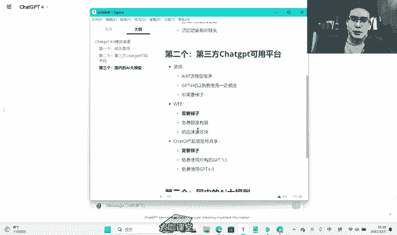

# 【2024B站最良心新媒体运营全套教程】比付费还强十倍的自学款课程 小红书运营 起号／创作／涨粉／变现／就业 7天出爆款 惊艳所有人！ - P12：01.10.0：Ai：ChatGpt4.0的几种使用渠道 - 大咖运营课堂 - BV1cM4m1U7G5

hello大家好。那么这一节课呢，我们还是来跟大家聊一聊关于chatGPT，也就是AI人工智能对话模型的这个应用。那么在之前的课程当中呢，我们跟大家讲过，就是在我们这个时代啊，就当下这个时代。

我们最需要接触和使用AI智能对话模型的有两个行业。那么一个呢就是我们做开发的程序员，还有一个呢就是我们做新媒体的运营。那么程序员呢可以让AI给我们写代码，对吧？然后给我们写程序，也给我们测bug。

那么我们作为运营。那么AI可以帮我们写短视频的脚本，可以给我们做PPT做表格写报告等等等等。那么就是说作为一个运营人员啊，你会用GPT或者说你会用AI那么它完全可以成为你自己私人的一个知识专家，对吧？

那么也就是说你把这个东西掌握了之后，你就不需要说你一定得具备某些特殊行业的一些专业知识，你才能去接触或者做这个领域。那么有了这个AI对话模型了之后，这些东西你都不用担心。好吧。

那么我们今天的一个主要内容呢，就是来给大家推荐一下，就目前chatGPT4。0最强版本啊，也就是最强版本的这个AI人工智能，我们有哪些渠道和方式可以去体验到它，或者说能够使用到它。

不管是付费也好还是免费也好，好吧，那么首先呢第一个我优先推荐的啊。一个。第一个我优先推荐的是什么呢？就是我们的一个呃微软的一个爱G浏览器。那么这个东西呢在网上现在也很火，大家应该也都知道，好吧。

也都知道这个东西就是什么呢？这是我们的A浏览器里边的一个。Coplate。啊，co呃，这个东西是什么呢？

它是微软基于chatGPT啊来打造的一个呃就是能够在使用这个windows系统的用户可以用的这么的一个功能，对吧？这个功能呢就是呃它是基于4。0模型来打造的。也就是说在功能使用上面。

它的一个智能的程度是可以有一定程度上呃，跟这个4。0相匹配的，好吧，那么也是我们普通打工人呃，可以使用的一种方式，那么但是使用这个呢有两个前提啊，有两个前提。首先第一个就是你要登录啊。

要登录这个微软账号啊。啊，你可以注册一个outlook的一个邮箱。outlook的一个邮箱。那么用这个邮箱呢就可以去登录这个微软账号。也就是说你要在这个浏览器里边登录这个账号。然后第二个呢就是需要梯子。

对吧？这个梯子是什么？你们自行去百度，也就是说必须要有这个东西，你才能访问到的，访问得了这个东西啊。然后呢它本身呢是集成在我们浏览器的这个右边，但是呢现在的话呢。

我们呃我这个呢是因为更新了这个win11的最新版本。我的corlate呢是在这个地方啊，在也就是说在我的这个系统里边自带的。那么它是什么样的，我们打开看一下。首先呢如果说你没有这个梯子的情况下。

我们打开看一下它是什么样子。嗯。我刷新一下。OK那么它会显示该服务在你所在的这个地区不可用，对吧？那么接下来我们把它关掉，好吧，我们把它关掉，然后呢我们来打开。然后呢，选择全局模式。我们再来看一下。

OK我们刷新一下。好，那么这样就出来了啊，它就是这样的一个界面啊这样的一个界面。

啊，就是这样的一个界面啊，这个界面呢呃首先它有一个更有创造力和平衡，还有精确这三种模式，对吧？这三种模式呢就是呃微软基于用户的一个使用习惯来调教的三种方式，更有创造力呢，也就是说这个AI。

它可以呃根据你的一个对话，更富有就什么更开放性的去帮你回答一些问题。然后呢平衡呢则是基于精确和更有创造力两者之间啊我们一般啊如果说你不是特别专业的内容，那么你基于更有创造力和平衡之间呢会啊比较好用一些。

但是有时候啊有时候如果说你觉得啊这个colate或者说这个AI它创造的内容呢比较局限了，或者没有达到频频没有达到你的要求，那么你我建议你试一下这个更精确的这种方式。好吧。

那比如说我们现在啊我们使用这个更有创造力的，我们让它来给我们写一个短视频脚本。呃，请帮我写一个。关于。装修。的短视频脚本。时长。控制在。3分钟左右OK我们发给他。啊。

这个响应的速度啊是基于你的你的这个啊你这个梯子的速度，好吧，你提子的速度正常来讲呢呃还好啊还好。这个速度呢还算可以。嗯。好，它在输出内容啊，装修一个短视频的一个脚本文案。首先开场画面显示一个简陋的房间。

墙壁脏污地板破损哎家具陈旧你是否厌倦了住在这样的一个房间里OK那么这就是我们呃这个自带的啊自带的这个就是微软自带的这个colate啊，浏览器版本的呢基本上就实现一个对话，对吧？

但是呢浏览器版本还有一个优势，就是它可以基于你当前打开的一些网页，也就是说呃它是在这个右侧的这个工具栏这里啊，呃，这里有个图标，那么我这里没办法给大家展现。那么你去下载了这个最新版的A浏览器之后。

你登录的账号之后呢，你这个右上角呢，它就会有一个呃clate的一个图标，那么这个图标点开之后，它就可以基于你打开的当前的这个网页来分析这个网页里边的内容还是比较可以的啊，还是比较可以的。

那么这个呢我们就不要让它响应了。啊，差不多了嗯。呃，那么这就是我们去体验的一个c的啊，这个呃win11版的这个c的其实它本身的一个功能还还要更加强大。它可以帮我们实现一些简单的一些办公啊。

电脑的一些设置应用。比如说给这个电脑设置暗黑模式啊，或者说打开笔记本啊、记事本啊呃打开某某网页，它都可以办到，这里我就不去做演示了，好吧。嗯。OK那么这是候我们跟大家介绍的这个内容。那么它有一个缺点啊。

就是H浏览器有几个缺点，我也跟大家说一下，有几个缺点，具体是什么缺点呢？首先啊这个colate它没有啊就是在我的一个多番体验下来，它没有官方的chanGPT那么精准，什么意思呢？嗯。没有官方对吧？

叉的GBT。那么精准啊意思就是说呢这个4。0的模型，虽然说这个corlate基于4。0，但是它是被调校过的啊，也就是说某些方面的微软还是会得给它做出一些啊更多的限制啊。

更多的这种内容上面的一些就底层逻辑上面的一些修改调整对吧？微调。那么微调之后呢，整体感觉起来就没有确实跟这个官方的chGPT的4。0呢，还是会有那么一点的差距，对吧？有那么一点的差距啊。

这是第一个第二个呢就是它这个连续对话的一个功能呢有所欠缺。什么意思呢？就是说呃我们一次对话就是说正常的我们在chGPT一个官网，我们去跟它进行对话，使用4。0来对话。

我们在当前的这个对话模型上面基本上限制是很小的。你可以基于这一段对话里边持续去跟他输出，但是呢在这个我们的late这个里边呢，我们的对话呢是有一定的限制的。

也就是说你没有办法在当前对话里边去跟它持续提问提问次数多了这对话。就没有办法进行下去，它会提示你重新开一个啊对话窗口。那么这个是一个点啊，也就是说连续对话能力受限。然后第三个就是它的记忆功能有所缺失啊。

什么意思呢？就是我们知道呃，我还是把这个打开一下吧嗯。😊，我看一下这个这个上面能不能看得到啊，就是chaGPT呢，我们现在跟他对话的所有内容，我们在它的右侧呢是能够看得到的对吧？右侧能够看得到的。

那么chatGPT它可以基于你对话的当前对话，或者说你之前对话的内容，他去分析你的这个领域和之前给你回答的这些内容来优化后面给你提供的一些回答，那么这是一个优势，对吧？

也是我们呃持续让这个chGPT这个机器人能够回答出更符合我们内容的这种一个操作方式，但是呢corpolate它就在这方面有一定的限制，对吧？有一定的限制。它的这个历史对话的记录哈。

就是呢呃它没有办法读取的那么好啊，而且呢就是有些时候呢它还没有这个。啊，它还没有这个什么插件功能啊，没有插件功能，就是说连续对话和记忆功能方面，它会呃有所阉割，对吧？

毕竟这个服务器的资源调用确实还是很庞大的。那么微软又有这么多的一个用户，呃，很多呢呃在使用上面呢就是量还是很庞大的，这个可以理解，好吧，可以理解。但是呢对于我们来讲这个东西呢够用，好吧。

这个东西呢完全够用，这是我们跟大家推荐的第一个啊，那么如果说你当下这个爱G浏览器上面没有这个图标，那么你可以去尝试下载一个什么呀？你可以去尝试下载一个最新版的啊，也就是说最新版的。A级的1个DEV版。

DEV版什么意思呢？就是它的一个测试版本。测试版本里面是肯定啊是会有这个东西的。这个东西去哪下呢？我把这个地址呢我也贴出来给大家。呃，你打开这个地址之后啊，我们在这里打开一下。嗯。😊，啊。

OK这个地址呢打开之后呢，你往下翻，那么这里有1个DEV频道啊，也就是测试频道。你直接呃下载你windows10win11的这种系统。那么现在应该很少有用win8或者是win7的系统了。

你就下这个或者说be版本的也可以，好吧，也可以啊，这两个版本呢都是有这个呃copo的一个使用权限。其实正常来讲，我们最新版本的这个A浏览器都有啊。如果说你不知道，那么你就在设置这里啊。

点关于然后来看一下你当前的这个A是不是最新版本，好吧，是不是最新版本。呃，这是我们跟大家推荐的第一个渠道啊第一个渠道也就是我们的一个呃。agage浏览器啊，也是我们windows系统自带的。

那么我们要推荐的第二个是什么呢？唉。啊，我们要推荐的第二个就是我们一些第三方的啊这种平台啊，第三方的这种平台什么意思呢？啊，第三方的chGPT的可用平台意思就是说呃，我们很多现在开发者。

他基于chaGPT的这个接口，或者说他的API去搭建了一个呃我们国内用户可以访问的这种呃网站啊，或者说在线的这种程序。那么我这里呢给大家收纳了几个啊，就还算可以的。就是我使用下来就是确实可以用啊。

可以用4。0的啊，注意啊，我们今天的这个内容是围绕着4。0来的。好吧，是围绕着4。0来的。啊，就这样是围绕着4。0来的。我们来看第一个啊，第一个就是我跟大家推荐的这个啊这个网站呢啊也是非常强大啊。

它有一定的这个免费使用额度。然后关键的是它什么呢？它这个网站集成了目前当下我们能用到的很多这种模型，比如说3。5版本4。04。0可以联网版本啊，4。0的trober版本啊。

也就是最新版的就是它这个呢呃API的这个接口费用呃，使用率最低的。那么这种呢对于网站也就是说呃它的费用低，首先低在这个开发者本身，然后其次呢开发者本身这个它的成本降低了。那么我们在使用的时候呢。

他也会给我们一个比较低的一个价格。好吧。然后这些还有讯飞星火文心语言通一千问啊，目前市面上有的就是这种AI智能模型呢，它在这上面都有好吧，都有。然后呢这是我刚才试过的啊，我刚才试过的。

让他给我写一个装修短视频的文案脚本。为什么说我在这里列好了啊，是因为这个东西这个网站它。😊，有一个很大的一个缺点，就是它速度特别慢啊，速度特别慢。就是写完了之后呢，你得等一下啊，等个几分钟啊。

它才能写出来啊才能写出来。但是有一点好处就是它的4。0确实是免费可用的啊，免费可以用的。也就是说这个网站呢还有一个就是你不需要啊，不需要梯子啊。😊，那第一个这个这个网站呢它叫它叫灵感啊。

这些我都会呃随后在这个路径上面贴给大家的啊，就是我们的这个评论区会告诉大家的呃，灵感啊灵感它呢有几个优势啊，就是呃。AI对话模型。很多是吧，然后呢，GPT4。可以免费。使用一定数量。什么意思呢？

我们来看一下这个账号呢，这里有一个免费使用。呃，我们点进去之后呢，这里有一定的这个量啊，有一定的量呃，可以使用的一个次数啊，这里显示你的次数。然后呢，免费的一个天数。

也就是说7天之内你是可以免费使用的啊，就这个可以无限量去使用的。什么意思呢？我们比如说你现在注册这个账号之后呢，7天内你可以免费无限使用。但是呢啊这个可可免费使用的次数呢，13次，我暂时也还没搞懂。

但是在我的测试下面，这东西确实可以用啊，确实可以用。然后呢，如果说它的收费，它的收费是什么呢？呃目前呢这里有一个19。9块包月的。如果说我们觉得用着还行啊，你可以去用，也甚至说你工作上面有很大的需要。

那么你可以尝试一下啊，可以尝试。但是我建议你先用一下它的免费版本看一下这个速度是否你能接受的啊。那么我们这里简单试一下。😊，呃，写一篇。呃，叫什么来着？云南丽江的旅游。攻略。🎼好，我用4。0的。

然后你回复OK他在这里呢，他就会呃花一点的时间去等待。所以说就会在这个窗口呢停留大概几分钟的时间。那么我也是因为这一点呢啊就提前把这些内容做好了啊。啊，这是第一个啊第一个呃也算是可以用啊也算是可以用。

然后呢，还有第二个给大家推荐的就是这个网站啊，这个网站那么这个呢也是目前它具有3。5模型，还有4。0，也是4。0最新的啊GGPT4。0最新的这个模型就是都可以用啊。

它也提供了一定量的这个免费的呃tookking啊，免费的tookking。呃，我这里为什么显示零了呢？用完了。不可能吧。我就写了这么几句话就没了。呃，它初始呢在这个地方是给了1万的tking啊。

一万的tookking。但是呢它的速度跟这个就不一样了。它的速度特别快啊，速度特别快。呃，这是我们的WEE啊WEE那么这个网站呢它呃呃。它是可以用3。5和4。0的啊，但是呢呃它的速度也挺快。呃。

但是他这里送的tken，1万的tken只能用来写3。5啊，只能用来3。5。也就是说呃你想去用它试一下这个4。0呢，它会提示试不了啊。嗯，这里呢它还有一定的语音功能啊，语音回答的一个功能。

这个呢也还是我觉得还用的还比较比比较不错的啊，比较不错的。然后费用的话呢，它这里是5美元，差不多这个是100万的文字tken和10万的这个绘画的额度，它是可以绘画的啊，它是可以绘画的。

但是呢嗯据我现在用下来，它这个tookken呢使用的呃计算方式我还没搞懂啊，还没搞懂。至少我写了这么点呢，我的token是已经没了的啊，我总共刚开始用就写了这么几个东西啊，这里呢是英文回复的，然后呢。

让他用中文回复呢，他也听不懂啊，连续对话呢，可能稍微差一点。但是呢单次的还是可以用的啊，还是可以用的。呃，但是它有一个缺点啊，这个东西有一个缺点啊一样啊，它需要需要梯子啊需要梯子，然后呢免费额度有限。

免费额度有限。呃，然后呢。什么呢？响应速度。显应速度很快，也就是说是正常的1个GPT可以用的这种水准，而不是说像这个一样啊，到现在还没写完，对吧？还没写出来。嗯。这是我们推荐的啊这个第二个啊第二个。

那么我接下来推荐的最呃第三个第三方的一个共享平台是什么呢？这是我们呃网络上提供的一个chaGPT账号的一个共享平台啊。超级账号共享啊超级账号共享这个地方啊它有什么样的一个效果呢？我们看一下啊。

就是我们打开这样的一个地址进来之后呢啊就是我们拿到这个地址之后，我们进来之后呢，我们点击这个go啊，这个这个什么chat啊，这个分享嘛，对不对？然后进来之后呢。

它会提示你这里边有很多其他人分享的chatGPG的账号啊，从绿色到橙色到红色绿色呢，也就是说目前是空闲的，没有人用。然后橙色呢就代表着啊有人啊有有用过啊，有人点击过刚刚或者刚刚使用过这个账号，红色的呢。

可能代表正在有人用，好吧，正在有人用或者用的挺多的。那么还有一个最厉害的地方，就是代表着它有一个金光plus啊，金光plus版本，什么意思呢？就是呃散发着金光的这种框框，它是。😊，付费的这种4。

0的是可以用的啊，也就是说你没有付费，你在这里你没有钱去买，或者你没有渠道去买这个chGB4。0。你在这个地方通过它的这个呃共享账号，你就可以去访问。我们先看一下它这个3。5的，好吧。

它会提示你需要设立一个密码，对吧？我们设置一个密码。

好，我们接来看一下啊，这个地方呢就已经进来了。这已经进来了。然后的话呢我们新的对话我们看一下啊。写一篇。装修相关的短视频脚本文案。这什么意思？嗯，这个账号应该是被封了，对吧？我们呃再来看一下别的。

我们再来看一下别的嗯。嗯，这个应该是正常的啊，你好。OK3。5好吧，3。5。那么呢呃这个是正常可以对话的啊，我们就不演示了。然后的话这是绿色的啊，绿色里边有很多是可以用的。3。

5呢呢基本上在这个地方呃还是够我们大部分人去使用的一个基本程度了。然后我们来看一下它的金光plus版本啊，也就是说散发着金光的是什么样的呢？我们来找一下。一直往下翻。那这种呢应该是散发着橙光了吧，对吧？

没有那么利了，没有没有没有那么绿色的了啊。然，这个是红色的啊，红色的就代表使用频率很高。okK这里呢有一个散发金光版本的，我们试一下，我们看一下。嗯，那看样子这个状态界面就应该是不能用的啊。OK嗯。

我们再往下翻一下，找一下。嗯，这个也不行，嗯，GPT4对吧？付费版的那肯定是会稀缺的，对不对？

大家都想来用这个免费的4。0吗。啊，这个也不行。

嗯嗯。嗯，这个也不行。现在我们新一轮的这个GPT的一个整改之后呢，估计可以用的应该确实是不多了啊。那么这个账号呢应该是可以用的。我们来试一下。你好。哦，那对话次数已经达到上限。呃。

官方的chaGPD的这个4。0，它的对话是每3个小时里边是差不多好像是30条消息的一个限制吧。也就是30条对话啊，那么这个很明显就是呃要到4点啊使用上线嘛，对吧？要在下午的4点36分啊。

也就是说还有大概七八分钟之后才可以开始啊，才可以用。那这个呢啊但是它确实可以用的。所以说呢你急需啊使用这个。聪明一点的4。0，但是呢你又没有渠道，那么你可以在这个地方去试一下。好吧，那么3。

5呢在这个地方应该是免费的，你随便可以用的，好吧，随便可以用的这是我们给大家推荐的这几个渠道啊，这几个渠道它呢是可以免费使用所有的。GBT3。5账号很多，然后呢呃呃还可以免费使用。GBT4。

0OK这个呢真的非常厉害啊，我觉得超级厉害。嗯。😊，这个里边不能加粗ok好。嗯。那么我们要推荐的第三个是什么呢？我们要给大家推荐的第三个就是如果说啊我们可以看一下啊，就是上面给大家推荐的首先A浏览器。

对吧？这里呢需要梯子，对不对？然后呢嗯对吧对对？这个这个灵感这个是不需要的啊，要标注一下。然后呢，这个V啊需要梯字是不是？然后呢，GPT共享账号啊，这个我跟大家说一下，也是一样需要梯子的啊，需要提子。

也就是说呃大家可以看一下，对吧？如果说你做运营的话呢，虽然说嗯在很多层面上这玩意有限制，但是能力咱们还是要有的，是不是嗯接触到各种资源和渠道，有些东西呢是必须的，是不是啊。

那么呢第三个呢啊我们就跟大家推荐的就是当下在国内可以去正常使用的呃，不需要去翻翻墙的啊，不需要梯字的，然后呢，但是啊这些对话模型，它不是掐着GPT啊，不是掐着GPT是我们国内出品的一些呃这种模型啊。

比如说阿里的一个通一千问，对吧？然后百度的文献语言等等的。这些大家呢还比较熟知啊，我给大家推荐几个你们知道或不知道的这种渠道啊。国内的。AI大模型好吧。呃，首先第一个是什么呢？第一个就是我们的百度的。

文献一言。啊，百度的文讯一言在这里啊，这是什么呢？它就是呃这是就是什么呢？呃，目前好像除了付费版的是吧？有plus版的，这个我用的不多啊，我用过它可以用。

但是呢你要真说它能比拟chaGPT或者说它有多智能呢？这个要要根据每个人大家的一个使用习惯去判断。好吧，我呢呃用的比较少，我用的呢基本上都是呃官方的。嗯，我们试一下好吧，我们试一下还是一样。呃。

请帮我写一个关于。装修的短视频脚本文案。镜头丰富。语言。诶。吸引任O我看一下。速度也挺快的。近静后啊拍摄场地等等啊，都还做的。就那个啊破旧的房间，白天。啊，你的光啊，景别静止的一个镜头啊，然后时长。

怎么怎么怎么那个啊都能给咱们提供出来。就是说呃在基本的使用上面还是可以足够的。如果说涉及到一些专业的知识上面，就是这些专业是我们普通人可能还接触不到。但是如果你只是需要做一些新媒的运营的一些辅助啊。

或者说呃让他给你一点灵感，这个还是完全可以办到的啊，完全可以办到的，这是文心大模型的1个3。5，然后据说呢4。0也可以用，那么如果说你想去尝试一下，那么开它一个月的这个呃4。0，你去看一下。

它到底怎么样，对吧？4。0啊，号称4。0对吧？应该肯定是有所提升的嘛，是不是？嗯嗯。这是文心一言，对吧？除了文心一言，还有一个是什么呢？就是给大家推荐一个我们字节跳动出品的。😊，嗯。

豆包AI啊字节跳动出品的一个豆包AI啊，在这里啊啊也是它的1个AI的智能对话啊。那我们现在呢你在这里呃写一下啊，我们换一个是吧？那我们还是写一样的对吧？公平起见，是不是？请帮我写一个。

关于装修的短视频脚本。要求镜头丰富，对吧？语言吸引人。我们看一下。静候紧别画面内容，台词时长备注。一个年轻女士走进新装修的房子啊，展示客厅现代简约的设计风格。在客厅设讲，我追求的是简约与舒适的结合。

分享装修经验啊，时长备注啊等等等等啊，中景全景中景啊，什么景别都已经给你列好了啊，这个地方呢也有是吧？破旧的房间，然后旁白是这是我们开始的地方，一个旧的毫无生气的空间，悲伤的音乐。🎼然后呢。

这个时候呢就展示装修过程嘛啊，这是文心一言的。然后呢呃这个呢豆包出品的呢，他可能就是给我们展示一下分享一下哎，装修之后的一些呃场景啊，或者说教大家避坑啊，应该选什么样的东西啊等等啊。

OK那么这是推荐的一个呃豆包。那么其实除了这个之外呢，还有这个呃阿里巴巴的通易千问是吧？通讯千问也可以用。然后呢，除此之外，还有一个叫天工大模型一样也可以用。

那么这几个呢就是目前国内出品的几个不同的AI的这个对话的大模型。如果说你在这一块你需要使用到一些。那么你可以挑一个你自己啊用的比较顺心的，能够让你的工作呃。

有一定的成效或者提升我们运营的这种呃效率的这种AI，你去把它给熟练一下，对吧？像我们之前教给大家的，怎么去写标题，对吧？怎么去写文案，怎么去养成你的这样的一个chaGPT啊，或者说你的AI这种模型。

好吧，那么呢如果说有途径或者有渠道的呢？我建议你还是去尝试一下chaGPT的1个4。0，好吧，那么接下来我们还是试一下chaGPT啊，它的一个官方的4。0，能给我们什么样的一个惊喜。呃。

请帮我写一份关于。装修的短视频脚本文案。要求呃镜头丰富，对吧？然后语言吸引人我们还是一样。装修嗯。变形记啊，从旧居到梦想家园时长1分钟，场景1到0到10秒，缓慢推进的镜头，展示一间陈旧，有些破旧的居室。

旁边，每一个旧居都藏着一个改造的梦想。缓慢的推进镜头是吧？这个场景的别致感就给你来了啊，就是一个场景的感觉，快速剪辑展示拆除旧墙壁啊，地板的过程，那么这个你们应该也能想到，对吧？就是通过剪辑。

哎呃就相当于是定格的那种手法，让我们的这个整个装修啊，从那个一开始破旧，然后到我们把它给全部都拆了除了之后的一个整个的一个展示。嗯。那还是挺那个的啊，这个东西不是我来夸它。

就是但凡使用过cha尔GPT4。0，或者说用的比较多的人都知道这个东西啊，它的一个呃跟国内的一些大模型的一个区别。那么很多人其实国内的这些大模型的厂家，他们自己也知道啊，这是这个呢背后呢，因为很多原因。

不是说我们国内的厂家，他的能力不够啊，而是基于一些很多的其他的原因，是不是？呃，但是呢我们呃做运营本着工具能够帮我们提升效率的这样的一个原则，什么东西好用，我们就去用什么，是不是？

OK那么这就是我们这一节要跟大家分析分析分享的一个主要的内容。好吧，那么下面的后面呢我们会持续跟大家提供更多，就是关于AI与新媒体运营这一块结合的更多的一些技巧和这个使用方法。好吧，那么这节课就到这里。

大家拜拜。

