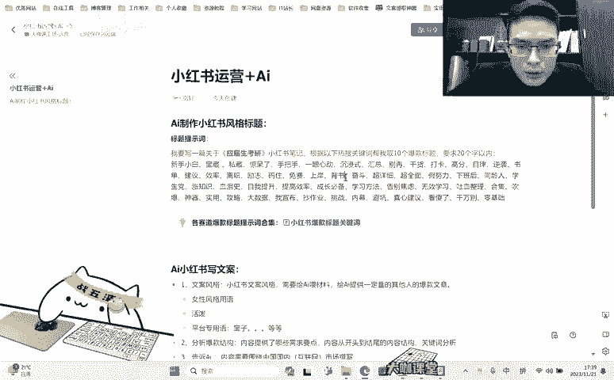
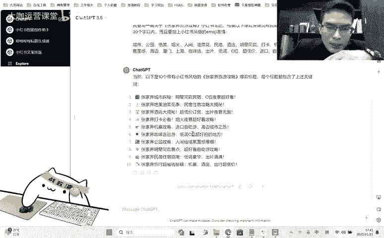

# 【2024B站最良心新媒体运营全套教程】比付费还强十倍的自学款课程 小红书运营 起号／创作／涨粉／变现／就业 7天出爆款 惊艳所有人！ - P13：01.10.1：Ai：让AI写出满意的爆款小红书风格标题 - 大咖运营课堂 - BV1cM4m1U7G5

，hello大家好啊，欢迎大家来到我们这一堂课。那么这一堂课呢，我们讲的一个主题呢就是关于小红书运营，加上这个chGPT或者说相应类型的这种AI的一个结合的应用。呃，就是在之前啊我一直跟大家讲。

就是我们现在啊自从今年也就是我们年初GT的一个对大众这种普通人的一个爆发的这样的一个态势，到现在就是AI人工智能在各领域的一个应用其实已经是非常的广泛的。

那么我跟大家讲的就是呃到目前为止最需要掌握AI这一块应用的，大概有两个行业啊，这两个行业呢，你必须得会用一个呢就是做程序员，也就是说搞开发的。他们平时呢去开发一些软件，或者说写一些代码。

那么这些的话都可以通过chPT去帮他们做完善啊，做这个架构啊，做这个底层的一些代码逻辑的这些设计。那么这一块呢T是非常好用的，它的能力也是毋庸置疑的。哪怕是的3。5也大概够用了。但是呢如果有4。

0呢一样肯定是用的更好的。那么另外一个呢就是我们做运营的。😊，那么我们做运营的，其实如果说从本质上来讲，我们运营的是什么东西呢？其实就是内容，对不对？不管你是视频也好，还是笔记，图文笔记也好。

那么归根究底，你的这些内容的产出都是基于一个什么呀，都是基于内容，对不对？那么这些内容呢，其实我们现在所有的这个AI它都可以帮助我们去实现。

那么以前呢可能比如说你想做一个呃这个健康领域这个科普的这样的一个博主。那么你必须得具备相应的知识体系的内容，你才能去做。但是现在有这些AI相来辅助你啊，这些AI工具来辅助你。

那么你可能你对这些东西不太了解，但是你也能够通过它让他去给你产生相应的文案啊，不光是健康啊，什么科学呀历史啊，或者说一些其他的这些领域，其实很多GPT或者其他的这个AI的工具都能帮我们去完成啊。

帮我们去设计脚本帮我们去写内容，写文案，帮我们植入关键词，甚至帮我们写一个吸引人的标题等等啊。其实之前呢我有跟大家推荐过很多的这个呃就是AI相关的一些工具啊，帮助大家去应用。但是。😊。

发现就很多学员你们在用的时候呢，就这个AI大家都还是用的不是特别好的样子啊，就是这些工具拿到手上之后呢，对于很多人来讲，他都只知道这个东西可以用，但是并没有办法把它用的特别好，这个其实也能理解。

因为AI这个东西呢，它作为一个工具。他作为一个就是我们可以把它理解成一个是模型对吧？他他的这个模型里边呢有很多我们不具备的知识体系。但是我们想让他按照我们的想法和意识来写出让我们满意的东西。

就是很多时候这个时候存在一个沟通的问题啊，就是我们要用好AI，我们就得解决这个沟通的问题，就是让他能够彻底的理解我们的意思啊，那么这也是很多就是现在市面上一些啊一些人去搞AI培训啊。

或者一些AI的课程啊，教他们去用一些指令啊。其实这些东西呢真的非常简单啊，我们并不需要说是去深入的去啊这个东西他真的有什么样的标准能够去把它用好。但是你了解他的一套逻辑告诉他你真正需要的东西就可以了。

好吧，那么我今天来给大家举几个就是我们现在小红书上面我们用的。😊。

最多的几个例子好吧，我们来看一下啊，就是比如说我们现在去运营小红书，对吧？在内容这一个层面啊，内容这个层面我们能做的几个点。首先啊第一个。选题对吧？选题选题的话呢，我们可以把一个行业领域。

比如说你做彩妆的，你可以让家育GPT告诉你。目前呃我们彩妆领域有哪些用户比较关心的问题，有哪些就是呃浏览量比较高，用户需求痛点比较高的这种呃类型或者关键词，让他给你提出一个啊让他给你列出来。

这是第一个关于选题。那么第二个啊第二个就是我们的一个标题，对吧？标题这个东西呢说白了啊，我我我反复的就是跟同学们强调过，就是我们所有的运营工作啊。不管是你是短视频也好，还是笔记也好。

你所有的数据或者说你档号的一些其他的这个提升，基于两个前提，也就是你的一个标题和你的这个封面，这两个东西呢决定了你的内容的一个点击率，只有有了足够的点击量了之后，那么你把你的内容做的足够优质了。

才会有你的对应的人群去给你点赞啊，去给你收藏，甚至说关注。那么也就是说我们需要把什么呀，我们需要把标题和封面放在我们的第一位封面这个东西呢。是靠一些其他的运营的直觉和运营的经验来解决的。

那么标题我们就可以通过chaGPT来帮我们实现。但是这个时候啊如果说你对这个啊对这个AI啊，或者说对这个chGPT的一些呃这些指令方面的一些运用不是特别熟的话，我们来看一下，在正常情况下。

就一个普通的chaGPT，它能给我们写出一个什么样的标题。OK那么我这里呢用的是GPT4啊，我改成3。5啊，我们来试一下。😊，我们以一个呃旅游旅游旅游攻略吧呃。我要写一条关于。张家界旅游攻略的。

小红书笔记。请帮我取。10个标题，我们看一下啊，他给我们写的什么样？

OK这是他提供的标题。我们来看一下啊，张家界之美仙境般的山水画卷啊，张家界旅必游景点一览啊，探索自然奇迹。张家界美食探索湖南美味的一个饕餮之旅好啊等等啊。那么这些标题呢，你们觉得它可不可以啊。

可不可以用啊，其实如果说正常来讲呢，用啊还是可以用的啊。但是呢这些东西呢在小红书上面可能还显得就有点普通了，对不对？就是我们正常的大家浏览罐的这个小红书，你们发现小红书上面的一些标题啊。

它会有它自己一些独特的风格什么风格呢？比如说我们现在我们打开这个小红书，我们来看一下。

嗯 응 응。我们来浏览一下。

诶。

我们来看一下啊张家界旅游攻略。

看啊张家界小梦自由旅行攻略，张家界旅游省心攻略呃，这什么玩意来着？这个标题呢也挺普通的啊，我们来找一些比较有特色的。张家界很好，下次再也不去了。张家界三天两夜全攻略。

，这个标题党对不对？

张家界避雷不要相信任何人说的话，对吧？张家界自由自由行攻略啊，纯玩不购物旅游攻略。

跟着纯玩小团5天带你一趟玩透张家界，5天带你一趟，玩透张家界，愿每一个去张家界的人都能刷到这一篇OK那么我们就拿这些简单的标题，我们来跟他做一下对比。这个给我们取的这个标题是不是还是相对来讲比较的生硬。

对吧？比较的生硬也没有什么特色。那如果说放到这个小红书上面这一重的这个标题里边看看是不是就显得特别普通，对吧？那么如果说你想要通过标题加封面的这样的一个形式去提高你笔记的一个攻略啊。

提高你笔记的这样的一个点击量，你就得把标题这个玩意儿给它玩到极致。好，那么我们怎么来做啊，首先的话呢我们需要把所有的这一块的它的一个呃就这些关键词啊，我们先给它拿到一块啊。

我这里本来做了一个这样的一个呃准备。那么我们还是以旅游相关的啊，我们来找一下，看一下这个里边有没有啊。

摄影赛道探店赛道啊。学习赛的美食赛的护肤呃，旅游的啊旅游的旅游的应该属于啥来着？旅游的属于呃分享也不属于啊美妆。

护肤。

学习种草。嗯。好吧，我来我来给他柔和一下，好吧，我看一下啊，这个是碳电，对吧？我拿碳电来做。

怎么做呢？先把这个关键词给它放到这里啊，然后呢我们再把我们需要做的这个需求点。

我们的要求给到他。我要写一篇关于什么呢？张家界。

旅游攻略的小红书笔记啊，请根据以下热搜关键词啊，爆款关键词，包括取10个爆款标题，要求20个字以内啊，而且要加上小红书。风格的EMIJO的。表情羽mo球表情是不是这这个意是不是这么拼的？

好像听错了啊。

o姐系。你摸这个表情OK那么呢这些我看一下够不够啊，如果说不够的话呢，因为呃这个里边好像没有关于旅游的一个专用赛道，这个玩意儿还要去做呃做补充学习呃。

家区分享。

美食学习种草。

呃，摄影OK我先我先用这个来生成一下啊，我看一下他提出来的。给出来的标题是什么样的？

O那么我这里给的东西选项还比较少啊，我们看一下首先第一个张家界城市探秘明星同款民宿CV夜景超好看啊，这玩意你们觉得可不可以啊，应该是可以的啊。但是呢它的字数我感觉一眼看过去字数是超了的。

所以说可能要做一些压缩啊。张家界绝美油菜花季民宿住宿攻略大揭秘打卡必备啊机票攻略咖啡店巡游低调C位超好拍的地方。那么这些东西啊，它是不是我们再来对比一下，结合上面的一个标题。

你们一眼应该能够看得出来它之间的一个区别。那么这就是关于我们一个指定的一个应用。也就是说你写标题，你光告告诉他哎，你给我写一个爆款标题出来，它并不能理解你要求的爆款是什么样的啊。

并不是说这个玩意儿它不行，而是说他不能理解你的想法，它不能理解小红书平台上面这些特有的他们的一些创作方法。虽然说现在有一定的联网的这个功能。

但是呢小红书它本身它上面的一些笔记呢是禁止这些类似于爬虫这样的一些程序去抓。😊。

所以说呃GPT他去理解小红书上面的这些内容呢，只能通过一些网上他能查到到的一些信息。那么真正的这些里边的链接呀，你打开这些链接，你让他去看他是看不了这个链接的。所以说我们需要主动的把这些东西喂给他。

让他去知道这玩意儿是什么样的，我们要求的爆款是什么样的OK那么这是呃GPT3。5，对吧？那我们这个这个地方提供的呃关键词哎并不多。那么我用呃我准备好的这个玩意儿，这个就是呃考研，也就是知识赛道的。

我们看一下用这些东西，我们能写出一个什么样的什么样的笔记。😊。

关于应届生考研的小红书笔记啊，请根据以下把这个热搜改为爆款啊，关键词包我取10个爆款标题，20字以内呃，包含。你没这表情。

我们发给他一下。

这些觉得怎么样？你们就是屏幕前的各位，你们觉得他写的这个标题。如果说作为你啊一篇笔记到了推送到了你的眼前，你看到了这样一个这样一篇笔记，看到了这个标题，你有没有想去点击的一个欲望啊，就是整体来讲。

大部分的啊还是可以的。我们排除少部分的这种呃标题不合理的，就是他去硬生生的结合的这种少部分的那么我们不考虑。但是其中大部分的甚至说可以给我们提供一个思路，对不对？考研新手小白保藏书单，一网打尽。

手把手教你自律学习告别假努力。那么这个这个标题不行啊，这个标题不行，考研高效学习攻略汇总超详细干货啊，这些东西呢其实融合了这些关键词之后，你的整个笔记的标题就会上一个档次啊，上一个档次。

但是呢呃这里边我要跟大家讲一下啊，就是机器嘛AI它毕竟是1个AI。😊。

就是有时候我们给了他一定的指令呢，这个AI指令。哎这个机器人呢他就会在你给的这些内容里边去限定它的一个思维。那么我们就是有时候呢其实我们还想让他怎么说呢？超出这些我们提供的这些内容，让他去结合自己的。

让他自己去扩散发散他的一个思维，让他给我们提供更多更合理的这种标题。那么有时候呢就这个时候就需要我们用到另外一种方法，就是去给AI未足够的资料的。那么这就是我们下一节课去跟大家讲的。

那么这一节课我们重点教大家就是在小红书上面你怎么能够去写出真正的符合小红书风格的这样一个标题。那么之前呢我们给大家介绍的一个推荐的一个网站对吧？通过这个网站来写这个小红书的爆款标题，对不对？

那这些标题呢其实是怎么来的呢？它其实也是他是基于GT3。5的这个API的接口，然后呢再去你把这个关键词，也就是你在这个输入框当中把内容输入完成之前，他会在这个这个内容的前面给你附上一些指令。

让这去变得更加的符合小红书这风格，也就相当于他在这个你的内容发送之前呢。😊。

他是默默的在后边加了一些这样的一些啊就是指令啊融合进去。有可能啊有可能就是跟我这个一样的对吧？然后把你要输入的内容呢放在这里。然后这个工具呢它就会是收费的，对不对？

但是呢我们众所周知5就是它是一个免费的东西，免费实我们正常来用的话，果你后面你做这个运营岗位不管是你自己去就业也好，还是你给自己去做账号，你每天要出大量的笔记的时候，那么这个或者AI这个工具。

你是不是一定得掌握。因为你掌握了它你才能提升你的效率，并且把你不擅长的东西用它来给你码出来那么这一点我相信大家能够明白吧。那么这这个就是我们本节要跟大家讲的一个特别小的一个知识点啊。

但是这个知识点很多人他就是不知道他也不会去用好那么这个东西呢后面我也会发给大家。就是你们把这些东西拿过去啊，自己呢去做一些填充啊，做一些这个扩展，把一些你没有的，或者说你觉得你有你能用得上的。

你去直接按照这个指令去用，那么肯定能写出让你满意的这种标题好那么这节。😊。

讲到这里。

