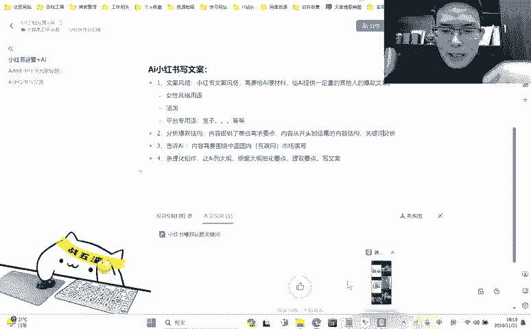
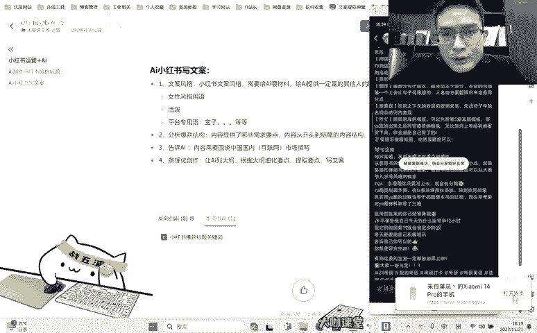
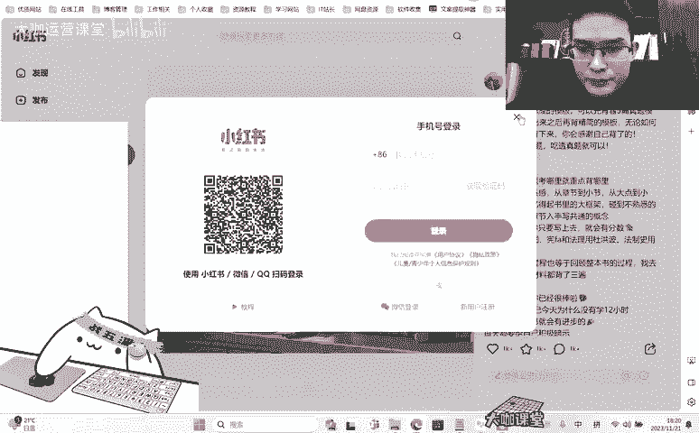
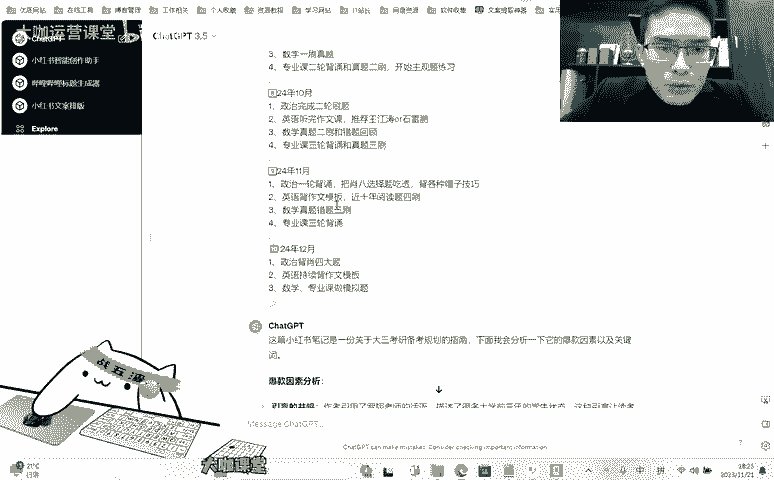
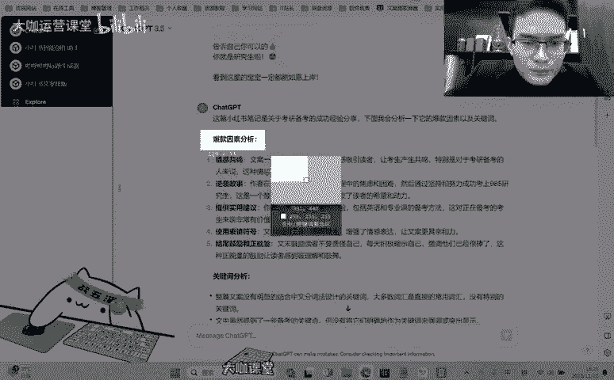
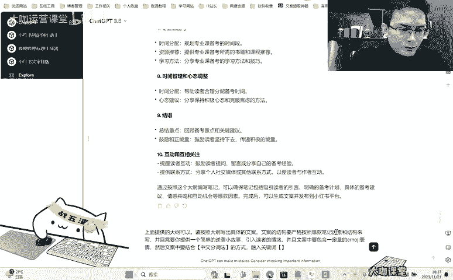
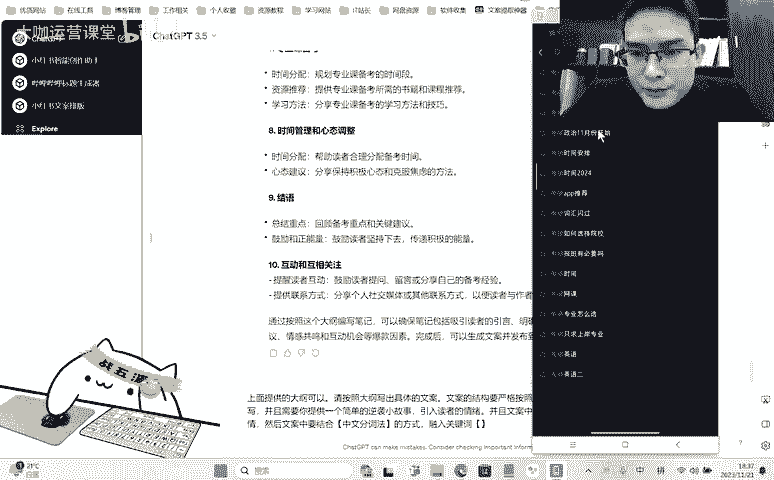
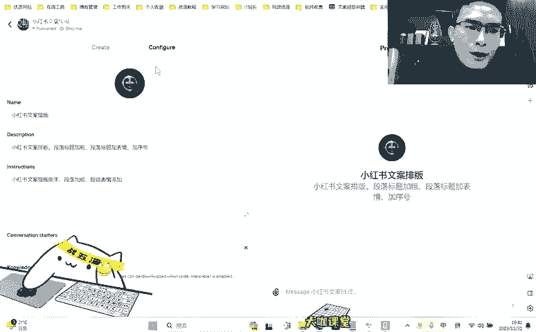
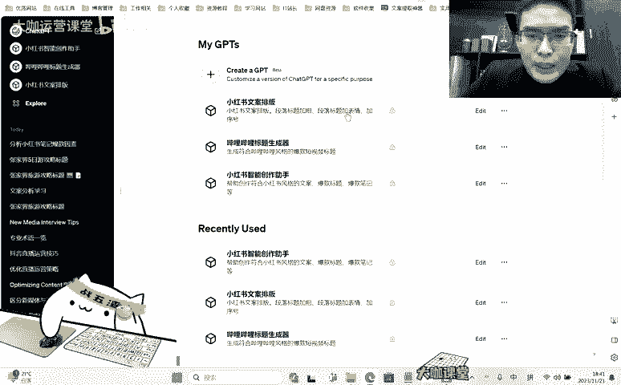

# 【2024B站最良心新媒体运营全套教程】比付费还强十倍的自学款课程 小红书运营 起号／创作／涨粉／变现／就业 7天出爆款 惊艳所有人！ - P15：01.10.03：Ai：训练Ai模拟爆款笔记 到产出爆款笔记的过程 - 大咖运营课堂 - BV1cM4m1U7G5

OK好，欢迎大家来到我们这一节。那么呢上一节呢我们通过一些啊就是未资料的这种方式告诉他，告诉大家用这个技巧呢去让这个chGPT去理解我们所要求的我们所希望达到的这种平台的一些啊用词。

用语或者他的一些内容的风格啊。虽然说上一节呢我们用旅游攻略这个东西呢啊最终展现出来这个内容呢不是很理想。但是这种方式是正确的。也就是说如果说你做的你思考一下当下你的这些赛道。

你去提供一些内容去给这个T然后让他去透彻的分析你提供的这些文章，并且把这些内容反馈给你。那么最终呢他能够学习到啊，他能够从自己的总结当中。

以及你提供的这些资料当中学习到这个呃这个平台的文案它是怎么写的啊，以及要写成什么样O那么这一节呢我们再来看一下剩下的就是我们怎么去通过让T来分析就是一些爆款的这种内容啊，爆款的内容，这里边有几个点啊。

有几个点。一个是我们提供这种爆款的这个啊内容，让他去分析这个内容为什么有哪些。😊，可能是导致他爆啊，也就是说他成为爆款的一些点。我们把这些点呢让他罗列出来之后，让他去学习。

然后呢让他分析一下这个内容的结构。这个结构具体指的什么意思呢？也就是说比如说有一篇文案，这篇文案，他的一开始啊，开篇提供的是什么样的一个语气词。

用什么开篇是用什么东西来吸引住用户继续往这个内容的下面去看啊，然后呢，它的内容中间呢又提供了哪些符合用户需求的这种痛点的东西来拉住锁住用户来提升用户的一个停留时长。

最后它的结尾又是留了一个什么样的钩子来让用户呢能够去呃找他要联系方式，或者说私信等等，形成这样一个互动的一个关系。O那么这是我们要让他去分析的。还有一个比较重要的点，就是我们要让他去分析一下。

就是别人在这个爆款笔记当中是否有做这个特异的关键词植入。然后这个关键词的话，如果有做的话，他的这个频率是怎么样的，就是在整体的文案当中，他能占到什么样的频率，他是用什么样的一个结构来铺设的。

这就是我们要研究的几个点啊，那么我们来看一下啊，我们来看一下。😊。

还是一样，我们呢还是要先找到相应的文案，对不对？那么呢这个呢我们就以简单一点的就是知识付费这种类比较典型的类型啊。比如说我们来看一下啊，我们以考研来做吧，好吧。😊，我们以考研来做。

这个是拿3000多点赞的，3000多点赞。照常来说，考研领域啊也还可以啊也还可以。嗯。ok。诶。看一下啊。这个提取挺麻烦的。

嗯。我直接复制。

okK我把内容复制了，然后呢我们来开一个新的，我们来开一个新的这个新的呢还是3。5啊。嗯。给你提供一些关于。小红书上面的。假如说平台上的。考研。相关的爆款笔记。文案。你需要。分析这些文案。的。呃。

爆款因素。比如文案的。整体结构。这个整体结构怎么来告诉他呢？就是说呃分析这个文案的一些爆款因素，对吧？这个整体的结构，也就是说呃开篇用什么吸引用户。中间用什么？内容戳中用户痛点。结尾。嗯，用什么方式？

让用户形成。互动。或者私信。关注。咁行为。开篇结构对吧？整体的结构，开篇用什么吸引用户中间用什么内容，戳中用户痛痛点，用什么方式让用户形成互动或者私信关注等行为。诶。还有呃也就是说还有一个。分析我。

我给你的每一篇。笔记的。关键词。诶。根据。影片。过系。本时该。笔记是否有？结合中文分词法。设计关键词没有的话。请告诉我没有关键词。有的话。告诉我是哪个关键词。这个关键词的出现频率。出现比率。ok。

那呢好，我们把这个文案递给他。情感共鸣文案一开始以焦虑或担忧的情感吸引读者让考生产生共鸣，特别是对考研被考的人来说，这种情感非常真实很真实吗？我看看。阅读一篇错三个，政治选题，两眼抹黑。哎呃。

是是有这么个说法啊。嗯，逆袭的故事。分享自己的备考建议，备考经验啊，英语和专业课的备考方法。使用表情符号啊，增加了情感表达，让文案更加具备亲和力啊。对对对啊，使用了一定的这个表情。🤧。结为鼓励和正能量。

文墨鼓励读者不要责怪自己啊啊，关键词的一个分析，整篇文案没有明显的结合中文分词法设及关键词，大多数词汇是直接的常用词汇，没有特别的关键词，为什么区别。被考的关键点。

但没有将他们明确的作为关键词来强调图中显示。OK好，我们再来找一篇。我再来找一篇。好，这一篇呢也还可以啊，我们。罗翔老师说，我看一下他他他认不认识罗翔这个人啊，如果说呃他知道这个人。

那他们那么他应该是能够分析出来前面通过罗翔这个东啊不呃，罗翔这个人物，然后呢这个知名的人物去做了前面的一些呃人员的这个用户的一些锁定啊，不好意思，一些词汇上面呢。嗯用的不是特别好啊，罗翔老师的话语。嗯。

还是没有关键词啊，他准确的呃识别出了罗翔老师嗯，然后呢描述了很多大学前三年的一个状态。这种语言让读者产生共鸣还是一样啊，情感共鸣，对吧？我们看一下他给的这个前面这一点。

爆款因素。对吧这个是情感共鸣。然后呢，这个呢嗯嗯。食嘛。情感共鸣、情感认知转折对吧？逆袭故事，哎，也就是说相当于是哎还是分享经历嘛，对吧？提供一个详细的规划，提供使用的建议，推荐一些资源和建议。啊。

然后呢时间节点明确啊，正能量鼓励等等等等啊，这是这个结构是不是很很眼熟啊，对吧？差不多啊，差不多差不多。好，那么呢我们再提供一条。😊，我们再来提供一条。找一找。我找这种数据高的啊。这是什么来着？吓。

这个也有一定的特色啊。诶。专业课。明确的备考计划，作者提供了明确的政治、英语和专业课的备考计划，包括学习方法、时间、节点和具体建议、资源和技巧建议。时间管理和效率提升。作者强调的时间的重要性。

提醒学生要掐表做题，控制时间在25分钟内提高效率。啊，也没有关键词OK。带来。我们给他提供足够的啊，这个是机构的，机构的我们不用。来找一些这种。个人博主的。没有了吗？嗯，这个是我们刚才用过的。嗯。

这个没有用是吧，这个排名还挺靠前的。第一个阶段。备考时间表啊呃政治、英语、数学专业课。他好像已经跑题了嘞，对吧？我们需要让他分析，对吧？来给他拉回来。那回来怎么拿呢？编辑。然后的话呢，把我们上面这个。

呃，最开始的要求给他重新提一下，他肯定是忘了啊。他肯定是忘了。呃，我们提供的内容在这里啊。确就是3。5跟4。0的一个区别了啊，说实话呢，他有时候他真的他自己都忘了啊，你的你给他的目标，你非得去强调。

明确的备考计划啊，针对性的建议、时间节点明确啊，具体资源和技巧建议正能量鼓励啊，关键词分析。好，那么呢我们给他喂资料就背到这里了，他分析的也还不错。那么我们提供资料的阶段结束。

那么剩下的我们需要做一个什么样的操作呢？就是让他把他之前分析的这些爆款因素来做一个整合去重和整合，把一些就是每一个呃关键的这些点爆款因素把它结合到一起，整合成一个列表。

让我知道就是正常的有爆款的这些内容就是他分析过后之后，这些点我们把它列成一个表。先把上面你分析过。你分析过的关于。嗯。考研。这几篇笔记的爆款因素总。只。总结一下对吧？总结一下。啊，就这样就告诉。😊。

在这吗？时间节点明确针对性建议。你前面分析了几天几篇笔记。嗯我们帮他回忆一下，好吧。两篇。怎么可能才两篇呢？我来数一下啊。一篇。两篇三篇。饰品OK。我前面一共让你分析了4篇。笔记。你在。重新回顾一下。

嗯，他想起来了啊他想起来了。虽然说呢这个内容好像他给的还是差不多的，是吧？😊，我们来看看他改上面的。明确的备考计划，针对性建议、时间节点，明确具体资源和技巧建议、情感共鸣和正能量鼓励啊。

总共给的都有这些对吧？总共给的差不多就是这些了。😊，有没有什么突出的点，我看一下他们他漏掉的明确的备考计划，时间管理和效率提升时间节点啊时间节点。然后这个呢是提供详细规划针对性建议，然后推荐资源啊。

具体资源这里有正能量的一个鼓励啊，这个也有。使用表情符号对吧？然后呢逆袭故事，情感共鸣。啊，少了，对不对？情感公民有那个逆袭故事，有没有逆袭故事，他没有啊，这就是他的一些啊智障的问题啊，智障的一些点。

呃，我们这样我们现在让他写一篇，好吧，按照我们的一个。😊，规划来对吧？接下来呢我需要告诉他，我要写一篇什么呀？我要写一篇这个关于考研的这么一篇笔记，让他融合一些爆款这样的一些呃点啊，就前面学习到这些点。

把它融合进去。然后呢，先给我列一个大纲出来啊，这个大纲呢呃列出完了之后呢，还要写出每一个大纲的一个细化的要点，我们再根据这些要点去筛选哪些是我们要的。再根据这些要点来写文案OK。😀嗯嗯嗯。规划一篇。嗯。

我要写一篇小红书。呃，写一篇关于。考研。的小红书笔记请结合对吧？请结合你分析的呃，你前面分析的这个爆款笔记因素。帮我梳理一个具备。爆款因素的笔记大纲。呃，每个大纲节点。要细。要细分。不同的小小节点。

待我确定没问题了。之后。再生成笔记。在上传文案。嗯嗯嗯。介绍呃吸引读者注意开篇，用引人入胜的这种话语或者问题吸引读者的兴趣介绍主题啊，介绍主题也就是呃简单的告诉别人我这个笔记是关于什么的啊。

就是考研备考，然后呢，专业选择分析专业，然后时间规划、政治备考、英语备考、数学备考、专业课备考。时间管理和心态调整互动和互相关注，提醒读者互动，鼓励读者提问。哎哎这个还可以的啊。

呃假设假设呢我们现在这个他给的大纲可以，那么接下来呢我们就让他来通过。通过这个大纲。提供了大纲。可以。嗯请按照大纲。嗯。是。写出。写出具体的文案文案的结构要严格按照。爆款笔记因素和结构来写。呃。

并且需要。你。提供一个。简单的逆袭小故事，引入观众的。引入读者的情绪。并且要包含。要包含这个。immoage表情。要包含一定的这个词啊，这个用词真的跟AI对话的时候，这个用词呢很讲究，对吧？

你如果说你包含丰富的immo表情，对吧？它可能给你这里加一条，那里加一条，每一个都给你加了很多。但是如果说你给他不要这个词你给他包含immo表情，他可能就给你加那么三五个两三个。所以说啊这个用词的话呢。

有时要让让他理解你的这个呃意图，可能这个用词上面我们还得琢磨琢磨啊。一定量样的吧。嗯。然后。文案中。要结合。中文分词法。对。方式融入。融入关键词关键词是什么呢？我们来看一下啊。うんどんうん。

考研。

全流程考验政治。就这样关键词的话就是。考研。我看一下他能给我们写成这样啊。嗯。我看一下啊，首先前面呢当你曾经迷茫，觉得时间不够用，可能他们送林呢我理解那种感觉，哎，这个地方就很有那种味道了，对吧？

我理解那种感觉，但是我也亲身经历了整个逆袭的过程，让我来告诉你，只要你下定决心制定一份合理的这考研，绝对不是遥不可及的梦想。OK这里呢给了一个呃呃简单的小故事啊，这这这可能算不上故事，但是这几句话呢。

能够让别人理解一种啊，就是切身的那种感受，就是我确实我曾经也这么经历过啊，我也是从这么走过来的，让别人产生一种一定的这种共鸣啊，能够继续往下看。呃然后这下面就具体的一个时间规划，对吧？明确你的备考时间。

😊，2023年的101月8日开始考研。那么现在就是他你时间宝贵，千万不要浪费啊，专业选择呃，你专业不再考研适合再，不要担相信明年。如果说你的专业适合考研大家的前进吧，不要啊这个这个文案就很傻了啊。

这个文案就很傻了。😊，嗯，政治备考。英语备考。嗯，这个时间线还可以的啊，结合我们上面提供的内容，然后数学备考扎实的知识体系给出了具体的日期，具体的内容。哎，那这个文案写的那还可以哦啊。

整体的在这个专业度上面还是不错的。时间管理和心态调整。最后，但同样重要的是时间管理和心态调整，合理分配备考时间，坚持每日学习，不要浪费宝贵的时间，保持积极的心态克服焦虑。😊，无论多困难，只要坚持不懈。

你也可以像我一样啊，你也可以像我一样逆即上岸，加油啊，联系我。如果你有任何问题，我需要我随时都在这里。😊，通过严格按照爆款比例因素和结构。🎼啊，他还没有写完呢是不了啊还没有写完啊，整体的文案相对来讲啊。

倒是呃勉勉强强足够。就是我们真正的或如果说优化的话，可能还需要去让他去调一下。这这篇文案就对于正常的我们做运营来讲呢，可能还足够了。但是如果说对于我来讲，我可能还有很多的一些想法，我会融入到每一篇笔记。

把这个笔记呢做的更加的丰富，更加的简洁啊，这不冲突啊，丰富和简洁，它是不冲突的。😊，然后呢，把这个内容做一个整体的一个质的提升。但是对于我们正常的呃做运营的人来讲呢。普通的这种运营运营人员来说。

你写这样一篇文案呢，它其实是可以的对吧？当然呢这是我们的G13。5。那如果说你用4。0，那肯定会得到一些你意想不到的一些效果，对吧？

更何况我们现在呢这个G他还能创作很多就是符合我们自己的这内容的一些版式。比如我写的这个小红书的一个文案排版对吧？我简单的去弄一下？可以在这个里边加上什么呢？我可以在这个里加上就是我需要给他提供的要求。

我可以给他提供一些文件。这些文件里边呢有一些专用表情，哎，有一些这个相关的这种小红书风格的这种内容呃，就是他的一些这个文案题材呃就是文案借鉴就这些资料我能够放在这里让他去学习。

就是打造真正属于我的这种私人的是我的这个助手嘛？那么正常的我们用这个能遇到一些比如说他忘了我前面讲什么呀？者说他忘了我强调的这些东西，导致我们后面用的过程当中就要重新去提供一指令。

GVTS的这个创建呢就是还是很还是很方便的。OK还是很方便的。

OK好，那么呢这就是我们这一节课要跟大家传达的一个点。好吧，那么呢呃我们后面还将继续分享关于AI这一块的一些创作的技巧和一些这个小红书方面，还有我们抖音这一块运用的一些方式。好吧。

那这节课呢就先给大家讲到这里，我们拜拜。😊。

