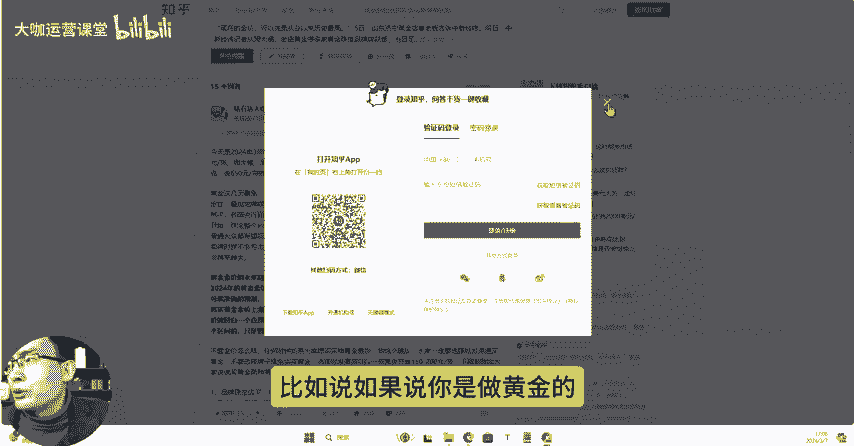
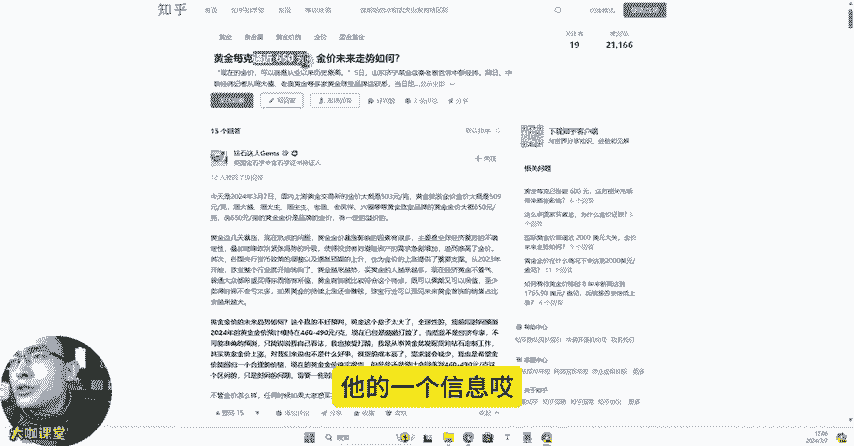

# 【2024B站最良心新媒体运营全套教程】比付费还强十倍的自学款课程 小红书运营 起号／创作／涨粉／变现／就业 7天出爆款 惊艳所有人！ - P18：02.5：工具篇-运营必备 3个经典的热榜聚合网分享 - 大咖运营课堂 - BV1cM4m1U7G5

大家好，那么这节课呢我给大家分享三个我们目前我自己用的比较多的这个热点发现的这样的一个工具。那么热点这个东西我相信大家也知道，我或者说听过我们课程的也了解，做新媒体呢。

现在你如果想把流量成阶梯式的往上增长。你的内容呢能突破一定的数量层级。那么蹭热点这个东西呢是必不可少的。那我们有时候比如说自己做账号，或者说我们在运营就业的过程中。

你们在这个岗位当中要想把这个热点给它抓好。可能我们大部分普通人啊就是去抖音上刷一刷，看看今天有什么热点视频，或者是呢我们去网页上浏览一下这个百度的热点这个信息。但其实除了这些渠道之外。

我们还有很多可以去自己主动发现和抓取热点的这样的一个平台。那么呢首先呢我们看一下第一个分享的工具，就是我们的今日热榜。那么这个呢上面呢分享的这个热榜信息呢比较齐全。像呃排的前面这个电商相关的天猫京东啊。

这些呢还有这个平台的一个综合的实时的榜中榜啊，也就是说当下的热门话题。然后呢，像微博。😊，知乎啊这个百度啊，然后某企鹅我们的这些其他的科技范的内容呢，这块都收录的有。而且呢我们登录之后呢。

可以自己去调整你的这个热点的一个顺序。像B站这块，我们能去啊不同平台的啊它的热点呢方向呢有一定的区别，并不是说所有的内容都是全网热点。这个大家要了解一下，比如说哔哩哔哩它上面的热点呢。

就跟我们很多其他平台的这个热点就不一样。它是平台上面的内容热点。而抖音呢这种属于现在全民啊全民都有的一个东西。那么它上面的热点呢可能更大众化更普及性一些。

然后小红书上面呢可能是一些小红书上面社交这个它的一个社群里边一些独特的内容的一些热点，这个也是一样，不同平台有不同平台的一个热点。我们呃要去做一下区分。好吧，这个热点。呃，像这个这个平台上面呢。

它有的热点呢，我们需要去知道内容的，直接点击啊就可以过去。比如说如果说你是做黄金的对吧？你就做黄金这一类账号的，你可以看一下黄金接下来的它的一个信息，哎，去看一下别人的一个点评。

看能不能写出一个你自己的一个还比较不错的文案，把这个算是热点的东西给它挂上去。那么你的流量就不会特别差。这个呢是知乎还有微博，还有抖音啊，我们自己去找热点，然后再把这些热点呢做成我们自己的内容。

这是一个方法和技巧。然后呢这一个平台呢也是一样啊，也是一个热榜的一个网站，它的呢有知乎啊，百度、头条微博，然后呢这些都有呃，我一般呢可能看一下在这个上面浏览一下这个即客啊。

即客上面看一下这个呃当天有哪些发生了哪些事情啊什么的，看有没有这个我可以去蹭的内容或者热点方向啊，你们自己做账号运营的时候，这也是这个呢这个工具上面分享的也还比较全，我们可以在里边呢找差异化。

看有哪些东西是不一样。有些是别的平台没有抓取到的这个平台有的对吧？然后呢还有这三个工具也是一样，是一个热榜。

这些在是我会经常综合下来分析这三个平台哪一些比较好用啊，我们啊比如说啊。我们啊雷军啊这个近照曝光。反馈说这个什么呢？啊比较沧桑，对吧？然后呢，还有一些其他的这个我们这两天比较火的啊地方的一些事情啊。

然后或者说我们其他的这些热点新闻呢，那这些内容呢，如果说你善于去发现。那么有很多东西是可以跟我们运营我们做的品类去相挂钩的，对吧？能挂上钩的，能蹭上热点，能带来话题的，它就有流量，对不对？

当然呢我们蹭热点，我鼓励大家就是我们一定要往积极往正面的方向去做。好吧，我们要遵循我们的一个呃运营的一些内容的基本的要求啊，把这一块呢东西呃把它把控好。好吧，这是我们跟大家分享的这三个工具啊。

工具的地址呢还是一样呃，分享在我们的这个评论区置顶评论和我们视频下方的简介信息里边都有啊，需要这三个工具的，可以去领取一下。

