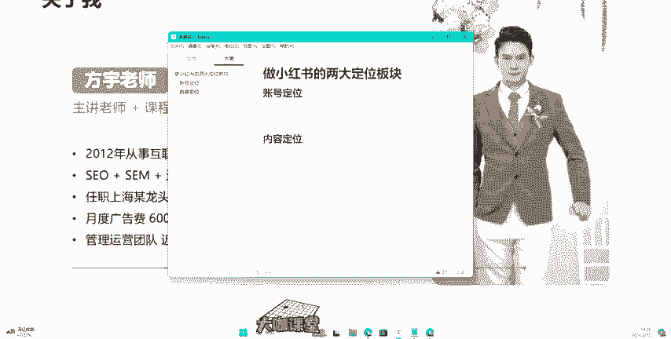
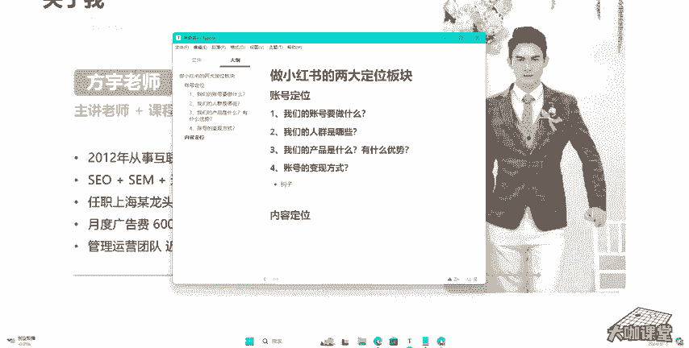
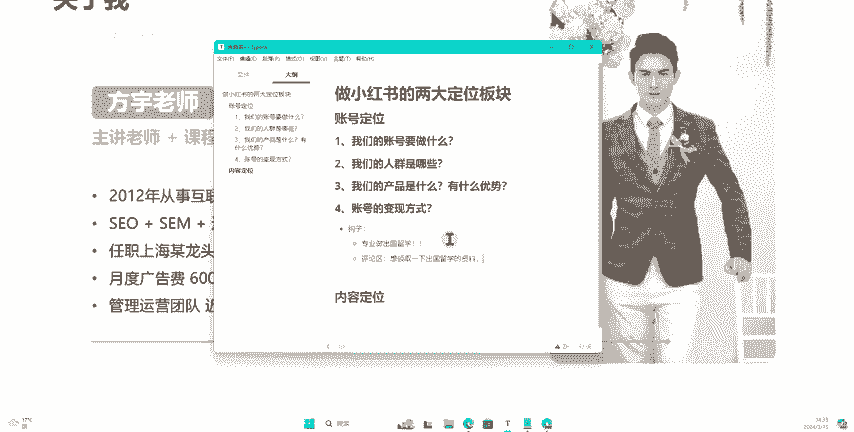
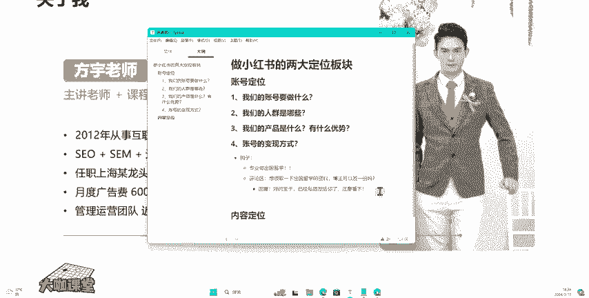

# 【2024B站最良心新媒体运营全套教程】比付费还强十倍的自学款课程 小红书运营 起号／创作／涨粉／变现／就业 7天出爆款 惊艳所有人！ - P19：03.小红书运营核心-两大定位板块：账号定位 - 大咖运营课堂 - BV1cM4m1U7G5

嗨大家好，那么之前呢我们跟大家讲过，我们做小红书啊，要有一个非常清晰的思路和流程。比如说我们的账号定位，我们的内容定位，还有呢我们要去了解平台的一个规则，然后呢分析我们的用户画像啊，我们的用户的属性。

以及呢我们持续去提升我们笔记的一个曝光，点击还有我们的互动数据，啊，提升我们整个账号的一个变现能力。那么今天这一节课呢我们主要围绕两个点，一个呢是我们的账号定位，还有一个呢是我们内容定位这一块。

跟大家仔细讲一讲。

我们的账号定位，还有呢。

我们的内容定位。那么很多人可能觉得啊账号定位这东西不是很简单吗？就是我具体我自己要做什么，这个我应该是清楚的，我就直接去做不就OK了吗。但是呢我们很多账号在这个前期啊就是刚开始自己想好的一个方向。

就开始去做呢？最后呢可能很多人做出来一定的粉丝量，或者说呢有一定的成果之后发现一个问题，就是这个账号没法变现啊，千万不要大家千万不要觉得这个事情啊，在你身上不不会出现。其实我们现在很多做新媒体的人呃。

小到这种几千粉丝万把粉丝的大到这个几十万粉丝的没办法去实现账号变现的一大把人啊，一大把人。那么首先关于账号定位这一块，我们需要去了解一个事情啊，我们从最底层我们去看我们这个账号我们到底要做什么？

我们这个账号我们做的这个账号对应的人群是哪些什么年龄段啊，他们的性别怎么样。然后呢，我们的产品是什么样的一个情况。最后一个就是我们的一个变现环节到底是什么啊。

第一个，我们的账号要做什么？

对吧然后呢。

第二个就是我们的人群。

我们的人群到底是哪些？那么第三个呢就是我们的产品。

我们产品是什么？有什么优势？

对吧那么第四点呢，也就是我们最关键的一个我们的账号变现方式，我们考虑是什么样的。

OK那么我们在做账号定位这一块呢，我们首先就要先把这个玩意儿给它打通，就是我们的账号到底是什么样的一个定位。首先啊比如说我的账号呢是分享这个二手车买卖视频的对吧？那么很明显，我现实生活中。

我肯定我就是卖二手车的。那么我现在来做这个小红书的账号，我的最终的目的呢肯定就是为了能够去卖车，对吧？那么我这个账号呢有粉丝，最好，如果说没有粉丝的情况下，我只要账号能够持续出现。

持续出现这个报报报文笔记，那么我的这个爆款笔记，他的这个我们的评论区或者我们的私信就会给我们带来源源不断的客户咨询我的人呢就非常多。所以说我就能够持续变现。那么呃有这个持续变现啊。

也是我们能够在这个新媒体上持续做下去的一个源泉。好吧，这个呢就是我们的账号定位。那如果说有一种什么样的一个情况呢？就是我们去做一个账号，我们去做分享类型的内容。我们分享这个内容完了之后呢，最终。

我们的客户他没有办法通过我们的笔记到达我们的思域，或者说到达我们在小红书上开通的这个电商商城里边，他不会去买我们的东西啊，他只是对我们的内容呢感兴趣。也就是说我们通常说的什么呀？可能说最关键的一个东西。

就是我们没有在我们的笔记或者说我们的账号留一个非常重要的一个东西叫做钩子，我们没有去留这个钩子，我没有告诉用户，我可以提供更多的这个产品服务。那么我举个例子，比如说你是做出国留学的。

那么你的这个笔记呢呃或者说你的账号里边，你提供的这个内容是关于账号留学的一些攻略，对吧？方式，但是这个时候我们来定位一下啊，我们来假设一下这个人设。如果说你作为一个素人号，哎。

你的名称是呃这某某某某呃宝妈或者说某某某某这样的一个呃非常个性的一个网名哈，你用这样的一个账号的身份，你去运营你的这个账号。那么在用户他的潜意识里就会觉得哎你只是作为一个怎么样？就是可能你自己有出过。

留学这样的一个经验，你来提供的这样的一个攻略。哎，你的笔记对我有帮助，那我可能给你点点赞，但是我不会给你去评论，我也不会去私信你啊。就是说假设我有这样的一个出国留学的需求，我也不会去找你。

因为在我的眼里，你就是一个分享者。那么如果说我们在我们的账号名称，在我们的账号简介，在我们的这个笔记里边，我们去留这么一段话告诉别人。哎，我是某某机构，某某某某老师，出国留学老师。

我的简介里呢也告诉大家，哎，我们专业做这个出国留学的。然后呢，哎如果说你通过我的笔记看到我这个账号提供的内容还不错，对吧？你可能进入到我的主页去观察我更多的内容，你通过我的这个名称，还有我们的简介。

你能知道我是做什么的。那么你有这一块的一个呃业务需求，你就会去私信咨询一下我啊，那么这就是我们精准客户的来源。那如果说你的笔记当中呢，你留了钩子，这个钩子怎么留呢？一个是我们在文案当中啊。

我们去告诉别人啊，我们。

专业做出国留学啊。

专业做出国留学的，对不对？那么呢呃我可以给你提供这个很多出国留学的方面的一些经验和参考等等。那么我把这个钩子留到这个呃文案的结尾。当然我这个钩子啊，这个我只现在做举例，我们正确的钩子不能留的这么直接。

那么这个钩子是我们的一个正文里边的内容。那么还有一个内容，还有一个钩子是什么呢？就是我们的一个评论区。

评论区怎么做，对不对？那么很多人应该也见过啊，评论区我告诉你，如果你做出国留学，你就应该这么写呃，用你的一个小号对吧？就是用你的一个假如说你现在是做企业运营的。

你呢去拿一个小红书的小号在评论区写一个评论，就是呃关于留学的资料。

想领取一下。

向啊。想领取一下这个。

出国留学的资料。

然后博主可以发一份吗？OK这是你的小号，对吧？那么接下来怎么做，你再用你的这个主号，对吧？也就是说你现在的这个up主，你现在这个博主的这个账号，你来给他回复回复什么内容呢？呃，好的，包子。

已经私信发给你了。注意查看。

OK那么这个东西呢，它是不是相当于一个钩子。很多人呢他在浏览了这个你的内容，就是他能够在你的这个内容上面有一定的留停留时长。那么这部分人呢他肯定就对出国留学，他有一定的这个需求或者说意向。

那这个时候他作为你的精准用户，他对这个出国留学里边很多板块是感兴趣的。像我们啊我这里简单做一个钩子，就是出国留学的资料，对吧？那么我们的内容当中有我们评论区也有这个评论区呢。

他看到评论区有人哎通过这个私信的方式领取的资料，他也会在评论区继续去给你评论呃，博主能给我发一份吗？然后你回复说好O然后呢，你再说呃我给你发了私信，你看一下有没有查收到，或者说如果没有查收到的话。

你在主动给我发一下私信可能受到了拦截。那么这个时候你的评论区的互动数据是不是就起来了。这个就是我们留钩子，我们最终去实现变现。我们的内容的一个整个整合的方式。

并不是说我们真的在小红书上去按照他平台的一个说法。哎，我们就是去做这个分享的。

对吧我们给大家无偿的分享很多很多内容，是不是？但是我们分享归分享，我们可以提供有价值的内容。但是我们到这个平台上来做账号，不管你做个人号还是企业号，你都是为了什么呀，你都是为了变现，对不对？

那么这个呢是我们通常讲的一个叫资域变现或者是产品变现。那我像我们的商城，对不对？还有我们自己做个人账号，我们接商单等等。这些东西也是属于变现模式。那么我们就要强调我们在做账号定位的时候。

我们自己的目标人群是哪些，他们对我们的产品感兴趣的程度怎么样？我能在我的笔记当中把我的这个产品的优势凸显成什么样的一个情况，这就是我们做账号定位，我们需要去做分析的。那么这一套的东西下来。

你应该是能够对你的整个账号的一个定位有比较清晰的一个规划。那么后期呢你也不会说出现哎，我账号做出来一定的成绩，但是没有办法去变现。O这就是我们这一节要跟大家讲的小红书账号定位这一块的内容。

