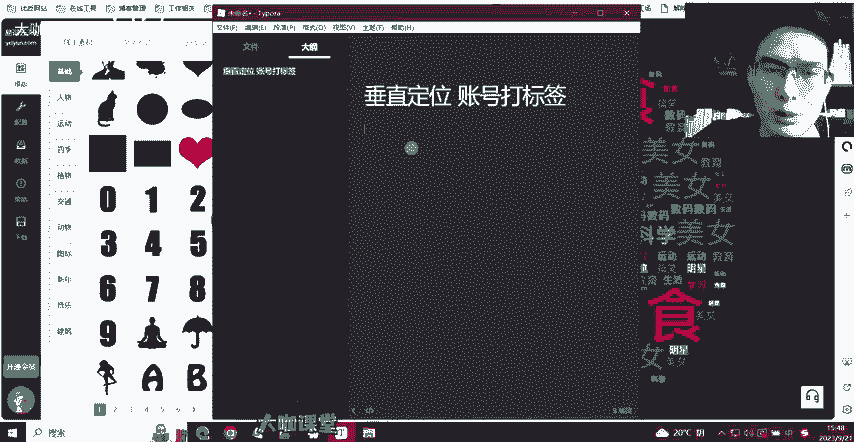
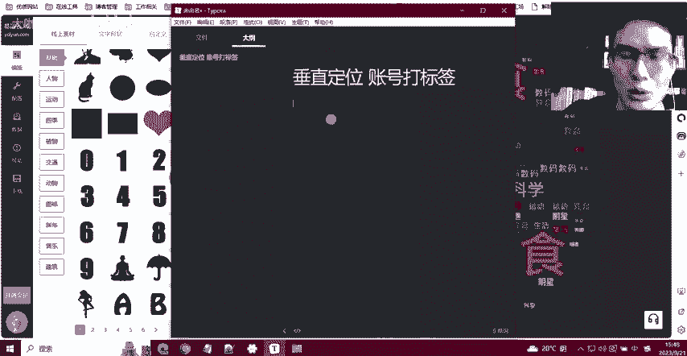
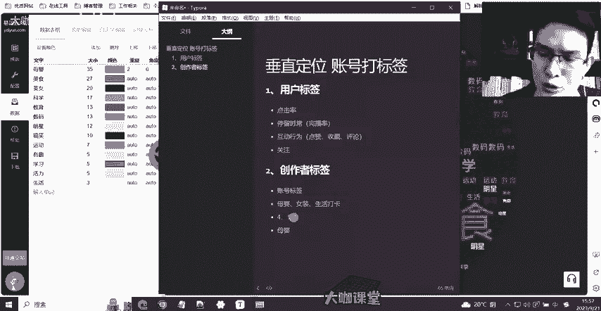

# 【2024B站最良心新媒体运营全套教程】比付费还强十倍的自学款课程 小红书运营 起号／创作／涨粉／变现／就业 7天出爆款 惊艳所有人！ - P30：14：新媒体运营-用户标签与创作者标签的完整诠释 - 大咖运营课堂 - BV1cM4m1U7G5

OK好，欢迎大家来到我们这一堂课。那么呢我们这一堂课的主讲的一个主要内容是跟大家讲清楚关于垂直定位以及账号打标签这一块的一个知识点。那么我们其实在之前的内容中也跟大家讲过。

或者说你们自己也或多或少的听过。就是很多人讲现在你在做新媒体抖音小红书也好，或者其他的平台也好，以主打的就是一个什么呢？就是垂直啊，也就是我们要做定向的领域，但是很多人就是没办法理解啊。

比如说抖音有打标签这么一回事，对不对？他们很多人觉得啊第一件事呢，我做这个账号能不能成功。第一件事就是我这个账号能不能打上标签，对吧？但是打标签这个东西他到底是什么，我们怎么来理解标签这样的一个概念。

很多人在这一块做有这样一个误区，确实很多人他啊作为小白也没有接触过过多的这种新媒运营的经验，确实不太理解。那么我们这一节课的一个主要内容，就是帮助大家用更好的这种方式来理解平台的标签。

以及我们做垂直定位它的一个根本的意义好吧。那么首先啊我们来看一下，这里我有一个。

5好吧，我们看一下这个图啊。呃，那么我这里呢是预先配置了一个数据，配置了一些数据。那么我们可以通过这样的一个数据，我们来模拟抖音或者说其他现在新媒体平台，他们的一个后台标签。

也就是给用户打标签这么一个过程。首先我们来看一下啊，假如假设我现在是一个用户，对吧？那么我在这个抖音上面，我平常会刷一些唉母婴美食美女科学教育等等，我会发的这些类这些类型的内容。

但是呢我在这些内容当中呢，我又对母婴特别感兴趣。那么这个感兴趣是怎么来的哈，我就跟大家讲一下啊，首先我们这讲的第一个点，就是我们以什么，我们以用户标签来跟大家讲啊，我们来我们以用户标签的形式来跟大家讲。

你在这个呃就是说在平台上面，平台是会给他的每一个用户做详细的这个标签啊，就是给每个用户他的每一个行为打上详细的标签。就是我们刚才所的说所说的这里的这些点，这些点呢就是平台去推四推荐啊。

就是说平台去呃就是监测我的用户所喜欢的一些内容。那么这个用户标签它是怎么打出来的。比如说呃我在母婴上面我刷到了母婴的视频，然后我刷到了这个美食类的视频，美女类的视频。

这些视频他们以一个品就是一个比较均衡的比例吧。比如说5比5比5啊，也就是说三个啊我我我每一个领域的内容平台给我推送的每一个列每一个内容都是5条，对吧？美食5条美女5条，然后科技5条。

在这当中美食类的5条我全部都点击进去了。然后呢，美女类的我只点了两个，然后科技类的我只点了一个好，那么在这个时候呢，平台就会发现他会给你一个基础的数据值，也就是你的美食你在美食这块所占据的一个比例，哎。

我给你打个分。

然后美女类的视频。

2分，然后科技类的视频唉，一分。那么这个时候平台是不是就发现这个用户他对美食类的内容非常非常的关注，对吧？那我为了留住这个用户在我的平台上，我就得想办法多给他推荐美食类的内容，哎。

像什么深夜半夜啊给你推送一些这个吃播啊，类似这样的一些视频对吧？那这个用户呢他就会在这个视频上平台上在我的平台上停留的更久，停留了更久之后，他就我就有办法去给他推送一些直播间带货商品。

他就能在我的平台上产生消费。那么这就是最终用户的一个价值的产出。那假如说对吧？我现在啊给他推送了一个母婴的视频。哎，母婴的视频，我给他我也给他推送了5个。那这个时候平台发现母婴类的内容，哎。

他的点击率是0，也就是推送了5个视频，他一个都没有点击。这个时候我们也可以看断这个用户他不喜欢母婴类的内容，这个时候他就会减少给他或者说直接不给他推送相应的内容。那么前段时间抖音就是很火的一个话题啊。

就是有一对夫妻，他们吵架，对吧？然后呃男的也发了。

抖音，然后女的也发了抖音。最后呢他们看了一下，就是两个人的账号底下，男的这方面呢很多评论的都是以男方这个呃就是为为核心为中心去参与评论的。然后女方那边呢又以很多女性为主题，站在女方的角度来评论参与评论。

就是这个东西呢产生的一个信息隔离啊就产生的一个信息隔离平台呢他把这一块就是抖音这块玩的特别6，玩的特特别精化。所以说用户标签，我们所理解的用户标签就是这么来的。

那么这个时候我给你讲的这个点基本上评论的屏幕前的各位啊，你们就应该能够理解用户标签是么是怎么产生的。那么我这个图这个云图啊，云图，其实你就可以理解为是一个正常用户在抖音后台他给你的一个数据画像啊。

就是我的这个我发现我分析的这个用户他在我这里喜欢的一些内容，每个内容他所占的比例数值又是什么样的O那么这是我们跟大家讲的啊，跟大家讲的关于用户标签。那么用户标签这块其实我们刚才聊到的一个什么呀？

点击率对吧？也就是用户点击的一些视频的一个概率。然后呢还有一个什么呀？还有停留时长，也就是。

说我们日常讲的一个叫什么呀？呃，在抖音上讲的，我们就叫完播率，对不对？也就是说这个用户他看完了这个视频，然后他看他点进来这个视频，他看了多久，是不是啊？这就是我们所讲的完播率。

然后还有一个是什么？还有一个就是用户的互动行为，对不对？总共就这三点，对吧？互动行为包括什么，包括关注。

点赞收藏啊，然后还有他的评论。其实呢这三点啊这三点呢是这三点数据每一个都不一样的啊。关注我是可以我是需要把它单独拉过来的，单独拉出来的。

这个关注呢跟我们正常的这种呃这几个用户互动的一个行为数据是有一些有一定区别的啊，他们之间的数据是有一定区别的。这个我在后面会去跟大家讲反，会去跟大家讲。

，先给我们的课件改下格式。OK那么这是我们上面聊到的，也就是关于用户标签这一块。那么如果是我们作为创作者来讲啊，我们创我们作为创作者来讲，最关心的就是一个创作者的标签啊，创作者的标签。

那么我们我们知道吧用户啊，也就是平台他去判断你的这个账号是做什么的，是做什么内容的。我们觉得是用什么东西什么方式来判断。是比如说我发了很多视频啊，这个视频呢有母婴里边的，比如说给宝宝做辅食的。

然后呢我带娃的日常分享啊，然后我跟娃之间的一些互动等等等等。那这些题材是不是就可以被抖音平台就是认定我就是一个母婴类的博主啊，博者其实不是啊呃我们正常的理解就是我们发相应的视频平台就可以理解。

但其实平台理解我们视频他是通过什么呀？他一样是通过标签啊，通过标签，这个标签怎么来，也就是我们所讲的账号标签啊，也就是我们所讲的账号标签。这个标签怎么打，就是像我们这里我们作为一个创作者。

也就是我们之前刚才强调。

一定要在这个领域垂植在一个核心目的对吧？核心的目的。首先做母婴。假如说我们是做一个母婴的博主。这个时候我们的内容既做了母婴啊，我举个例子，你既做了母婴，你还做了女装。

然后你还发一些日常生活类的这种打卡视频，对吧？啊，日常生活打卡视频，然后另外有一个博主，这个博主呢他发的所有的内容都是母婴相关的对吧？都是母婴相关的那这个时候就有一个问题啊，我们来探讨一下，你发了女装。

你这个账号发的女装之后，呃，平台比如说你发了女装平台会把你的视频推送给喜欢女装的这一类人群。但是同时他也会把你这个女装的视频推送给一批母婴用户啊，推送给一批母婴用户。因为什么呀？

因为你之前你的账号确实发过一些母婴的视频，然后这些母婴的视频相对来讲停留的这个时间啊，平留时场以经互动等等，还算可以啊，可能给你的数据流量值不多，比如说给你个几百的浏览量。但是确实里面有人参与互动啊。

有人停留的这个版。

还可以，这是一个整体的数据。但是你这个时候啊你发了一女装的视频啊，然后他会推送给什么呢？他会主要推送给母婴类的人群。也就是你之前根据你视频之前的一个行为数据来做判断。

但是他同时呢也会去匹配部分女装的用户。那这个时候就成就出现一个数据上面的一个拉扯，就是母婴用户发现你发的这个女装类的视频，那根本就不啊不carry啊，他不关心。

他不喜欢刷到了也就是之前对你这些视频还挺挺感兴趣的这一类啊挺感兴趣的这一类母婴群体，他现在突然对你这个账号发的视频不感兴趣，他直接划走了，也没有任何简单行为。O那么平台认为你发的这个视频不行。

哪怕说你这样的一个比例啊，比如说我我们下边打个比例，母婴的人群占到4啊，然后女装的人群占到一，对吧？那这个时候有这么四成的人群，他觉得你的视频不行。那只有一成的人群你的视频可以。

那平台自然而然他会认为你创作这个内容不佳，这也就我们以此类推，如果说你去创作更多其他类型的内容，那这个时候平台他自然他就会通过你这个数据表现，认为你这个账号确实做的很差劲。

这也是我们之前跟大家一直强着你做这个垂直以及你去定领域的一个关键点。因为平台的人群确实太大了，真的你像抖音，它的1个8亿的用户，对吧？8亿的活跃，抖音要想留住这些用户，他靠的是什么呀？

他吃这碗饭的一个最终的能力，就是根据兴趣标签来做推送啊，就是根据。

兴趣标签做推送，这是他的一个吃饭的一个本领。也就是说他务必要把用户感兴趣的东西啊，我我一定要做到多样化的内容。但是每一样的内容我要确保做这一个内容呢，他是这个行业里的专家，对不对？

那比如说你的账号里面发了母音，你也发了你标还发了生活打卡类的视频。那平台会认为唉你这个人花样比较多。但是呢你可能会的比较多，但是你就是没有一个专家的样。那我怎么能确保你的视频就是很精致呢啊。

抖音他是没有办法去读取你视频里边的完整的内容，他去分析你的视频好与不好，是否给你推荐流量，是根据流量值层级来做推荐和分发的好吧，那这个时候你就要一定要理解你要在这个地方把你表现成一个什么呀？你把自己。

包装成一个母婴的专家啊，母婴领域的专家。

母婴领域的专家，这是一个点，这是关于推送的一个点。然后就是刚才我有一个点就是关注我们有去讲述这一，也就是用户的行为这一块。为什么我要把关注单独拉出来列一个点。他因为关注这个东西呢。

他不能算作是一个互动行为啊，关注是什？关注是因为这个账号，他有一定的价值。比如说我们日常看一些这个电影分析啊，电影解说啊，或者是一些这个娱乐明星的这种账号啊，对不对？他一定是这个账号有一定价值给我。

然后我才愿意去关注他的，我期待他后期创作更好的视频，或者说我看了他当下的视频，我还觉得没有过瘾，我希望关注他，我持续看更多的内容，后面我想起来我再回来关注这个就是一个价值的问题。

为什么关注你因为你有价值，对不对？你作为一个母婴领域的专家，你可以给我提供很多母音方面的内容参考啊，还有一些很多比较不错的好货，对不对？那这才是我关于关关注你的一个点。那如果说你在定位垂直这块。

你做的十分杂的。那我关注你的时候，我只关注你的部分内容，是不是？但是你这部分内容我又没有办法去确定你这个账号后期到底是更新的母婴还是女装还是。

你就发一个自己的自拍，我并不开始执些啊，这个时候就他关注你的价值点就没有能不能理解啊，能不能理解就是大家一定要明白标签平台打标签它分为两个，一个是普通用户的标签，一个是我们作为创作者的标签。

我们一定要保证自己的标签，只有一个啊从始至终只有一个我们只做这一块的内容。好吧。然后呢下一节我们就跟大家讲，在我们去做标签的时候，我们作为创作者领域的时候，怎么样才能让系统精准的识别。

我们就是这个领域的专家啊，我们的关键词，我们的标题，我们的内容文案这一块，我们到底怎么去策划，才能让我一个新号，能够短短时间内成为在抖音后台里边。

我是这一块一个专家这么一个身份和一个标识O那么这是我们这节课讲的一个重点。那如果说大家关于定位账号打标签这块，还有其他的不了解的地点可以随时在评论区艾特老师。好吧。

或者说把你们的疑惑疑惑的点或者疑问私信评论的形式发给我们都可以O。

