# 【2024B站最良心新媒体运营全套教程】比付费还强十倍的自学款课程 小红书运营 起号／创作／涨粉／变现／就业 7天出爆款 惊艳所有人！ - P32：17：新媒体运营-全行业新媒体运营的背后真相及方法路线 - 大咖运营课堂 - BV1cM4m1U7G5

好，欢迎大家来到我们本堂课。那么这一堂课呢，我将通过这么一节课的时间去让大家完整的了解我们做新媒体运营岗位的这样的一个人。我们去平常去运营自己的账号，或者说给企业运营账号，我们去做运营，做短视频。

做直播等等等等。我们要去玩的两个啊最根本的一个东西。首先我们来看一下互联网运营，也就是我们新媒体运营它的一个本质啊，所谓的新媒体运营运营运营运营的是什么东西呢，其实就是只有两个啊，一个是用户。

一个是平台。那么我们一个一个来讲，首先所谓平台的用户。那么我们知道啊我们在平台上去做新媒体做我们的账号，做内容，我们肯定是希望把我们的一个内容推送给我们的用户，对不对？让我们的用户去看到。

那么这个时候我们就需要去做三件事儿。首先第一件事我们要了解你的产品它对应的这些用户群体，对吧？比如说啊比如说你是做这个考证考公考研的，那么你的用户群体主要。😊。

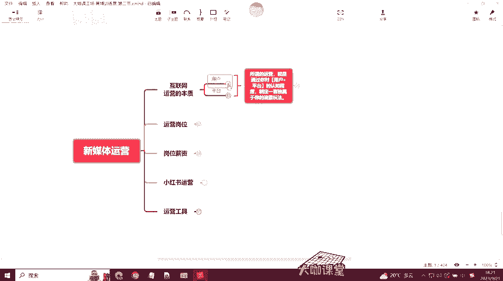

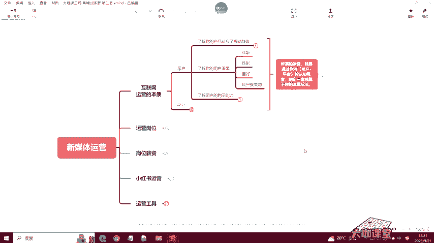

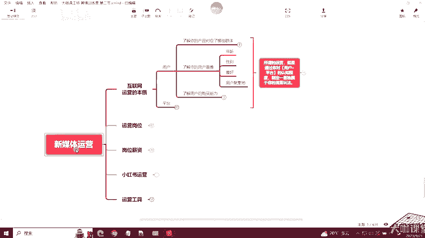

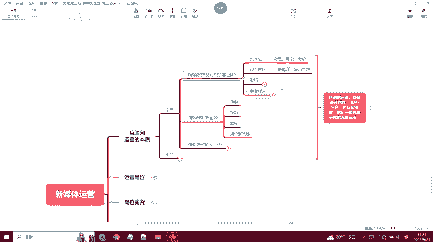

围绕的是什么呀？就是大学生群体。好吧，那些刚毕业的，或者说呃应届生或者说大二大三大三大四的这种。那如果说你的公司或者你的产品是做新能源，或者做城市基建的，你的客户是哪些你的客户就是政企类的客户。

也就是说啊政府啊或者一些企业呀类型的，做这种环保啊，做这个呃改造啊，或者说一些设施建设等等等等，那这些才是你的客户，对吧？那如果你的产品是做育儿好物，还有家居好物的。

那这个时候你的用户群体可能就是一些居家的宝妈啊，这种群体，那么还有如果你是做健康类的对吧？做一些养生类的这种产品，或者是做一些这个呃一些辅助健康类的东西，那么你的客户群体可能是一些中老年人。

他们比较在意自己身体的一个健康状态，对吧？然后这个时候你的用户群体，你知道的是哪些。那么接下来你还要了解你的一个用户的画像，也就是我这里跟大家列的，你要知道你的用户群体，他们所在的一个年龄段，对不对？

你还要知道你的用户群体当中哪一些。😊。

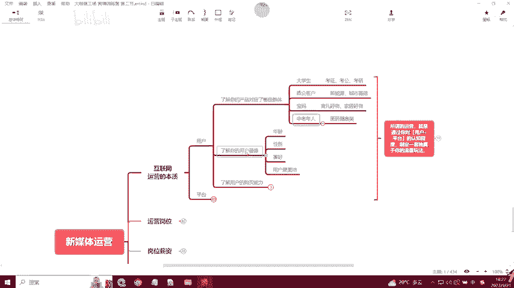

性别占比比较高，是男性占比较高，女性占比较高。比如说你是做美妆产品的那么你的客户群体肯定主要就是女性，对吧？然后你的这些群体，他们有没有一些其他延展性的喜好。比如说啊女性啊，他们是美妆类的。

你做的美妆类的产品，你的客户群体是女性，他们可能喜欢什么呀？他们可能喜欢看一些好看的衣服，好看的包包，对不对？然后这是他们的一个喜好，我们把他们的喜好啊，给他罗列出来。那么后期如果说我们去做广告投放啊。

我们去研究一些发布一些用户喜欢的内容的时候，我们就可以用这个方法去做延展啊，做内容的延展。然后最后一个就是用户的聚集地，用户的聚集地是什么意思呢？就是我们要知道我们的用户他们在哪些平台，对不对？

我们要知道用户在哪里啊，比如说呃你像现在抖音对吧？基本上什么类型的用户群体都有。那如果是小红书呢，对不对？小红书，假如说你现在你家公司是做这个设备的，做机械类的。

比如说或者卖什么呃一些豆浆机的这种或者一些传统的机械设备。😊，想一下你的用户可不可能再想我说那大概率不可能的，或者说很少啊，你像这种传统类型的你的产品，你的客户群体它一定啊首先抖音是肯定有的对吧？

然后其次是怎么？其次可能会在一些更加传统的像呃P to B的一些平台，或者是百度上面去做这种呃搜索排名的这种。那么你的用户群体可能在这些地方，对吧？这就是我们了解用户聚集地之后。

我们要在他聚集的这个地方，把我们的产品发送出去，让用户能够在他聚集的地方去看到我们的产品。那这个时候才能提高我们更高效的一个产品推送以及我们私域引流的一个效果，那么这是第二点也就是用户画像。那么第三点。

我们就要了解我们的用户群体，他们的一个购买能力啊，比如说他们的一个收入阶层，他们的购买力，还有消费习惯，对不对？我们了解这些数据之后，我们后期在做这个投放平台的一些啊竞价广告啊，或者说信息量广告的时候。

我们就能锁定这一类的人群，对吧？他们的收入怎么样啊，他们是否有消费能力，那么后期我们。😊。

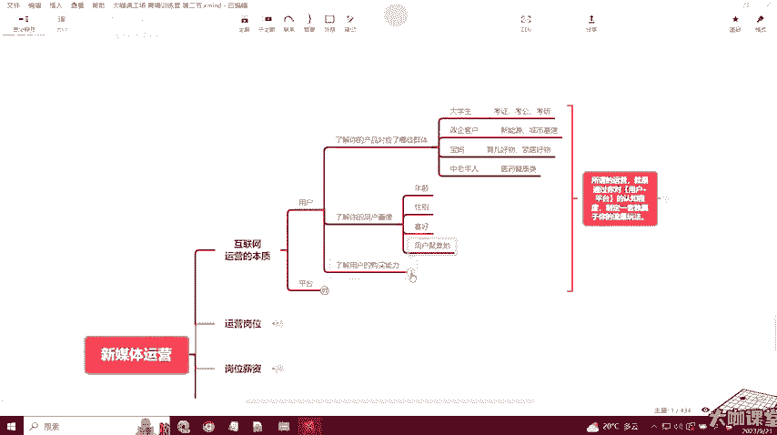

做用户筛选的时候，我们就能够精准的排除一些呃收入能力很低啊，收入能力收收入比较少的，或者说购买力很低。消费习惯平常也是怎么不愿意去在网上消费，或者说呃消费很谨慎的这一类人群，我们就可以把它排除掉。

我们主要去找我们的高意向人群。那么这个就是我们讲的，我们在运营的时候去运营。用户，我们需要去做的啊，这个统称我们就可以理解为就是分析我们的一个用户画像啊，分析我们的一个用户画像。

那么这是关于平台用户这一块的运营。那么假如说你现在入职了，你去企业里边上班了，你的企业他可能是做各种各样的类型，他可能是做知识类型教育类型，他可能是做自己的产品的。

那么这个时候你就要想想想得到你做你的用户群体他们在哪里，你的用户群体都是哪些人，这个时候你需要去策划一下公司的一些内容的产出，视频的产出是什么样的，对不对？那这个时候就是我们要了解的一个用户啊。

也就是我们要运营的一个群体叫做用户。那么其次就是我们要了解的一个关于平台的运营。😊。

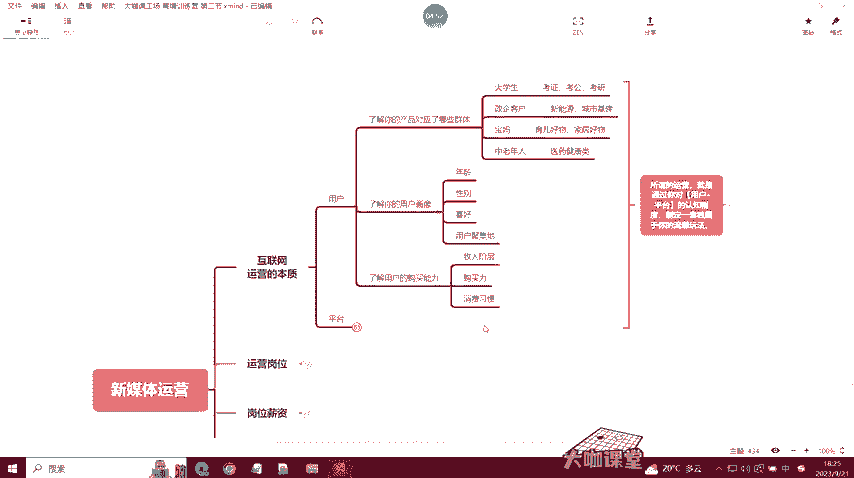

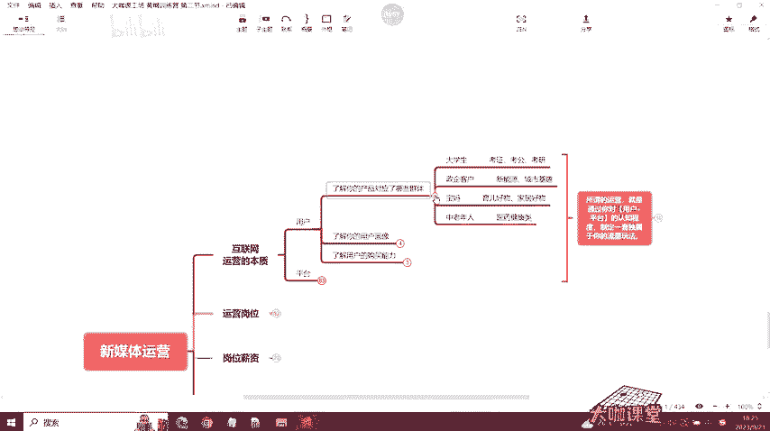

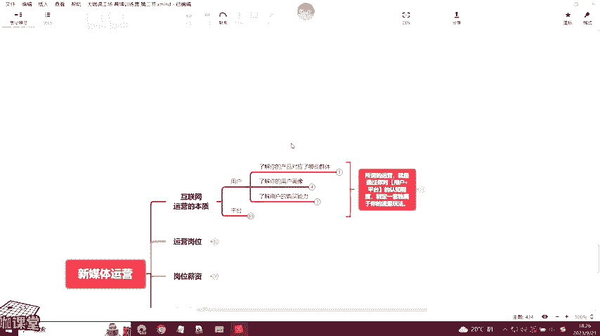

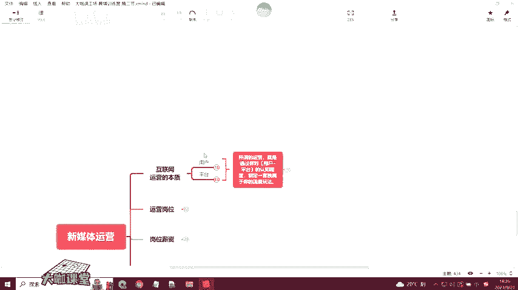

那么平台运营很关键啊很关键的一点。那么首先第一个我们要了解有哪些平台，对不对？那比如说举个例子，我们做新媒体，我们做短视频内容，假如说你的内容比较宽泛啊，或者说各类型的都可以适应。

你就要考虑你现在就要知道我的视频需要发布在哪些地方才能被我们的用户去看到对吧？比如说啊你像抖音小红书哔哩哔哩快手视频号啊，西瓜知乎等等等等。

还有国外的一些啊youtube或者twitter这些地方可能有你的用户群体聚集，那么你的视频产出了之后，你就要去在这些平台上建立你的一个官方账号或者你自己的一个个人账号，你就要把内容发布到这些地方。

那么发了之后你的用户才有可能去看到ok那么这是首先我们要了解自己个新媒体平台。那如果说你是啊做产品，你是卖货的，对不对？你是卖产品的那这个时候你就要考虑国内有哪些电商平台，你可以去做对吧？

比如说传统的电商平台，像天猫啊、京东啊、淘宝啊等等啊CC等等等等。这些地方都是可以你可以去考虑入驻的。😊。

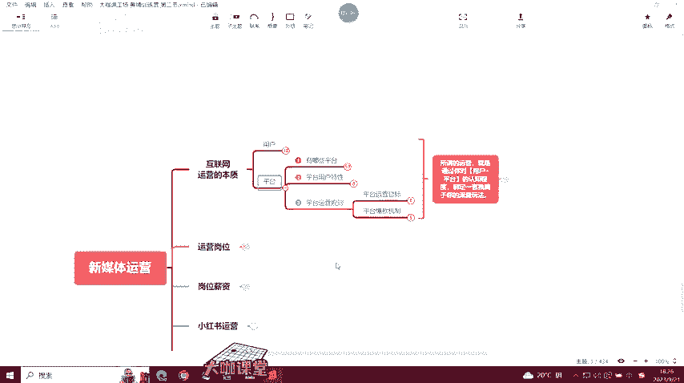

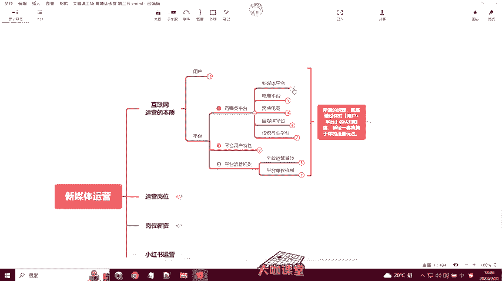

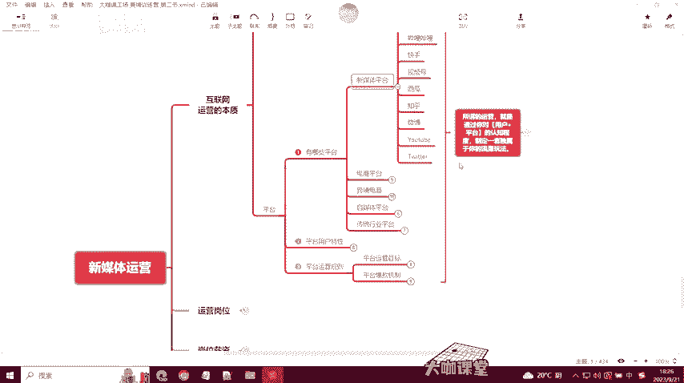

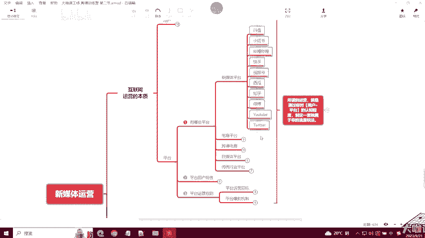

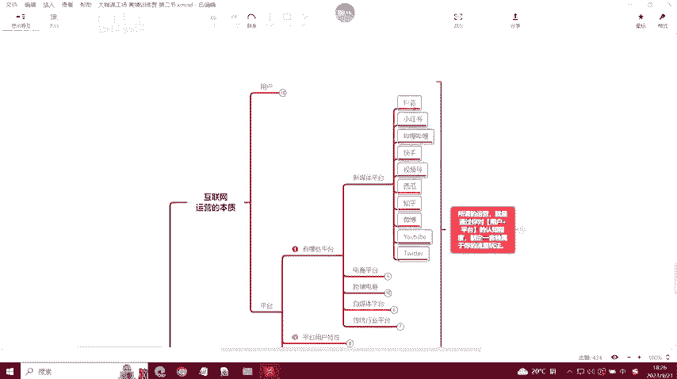

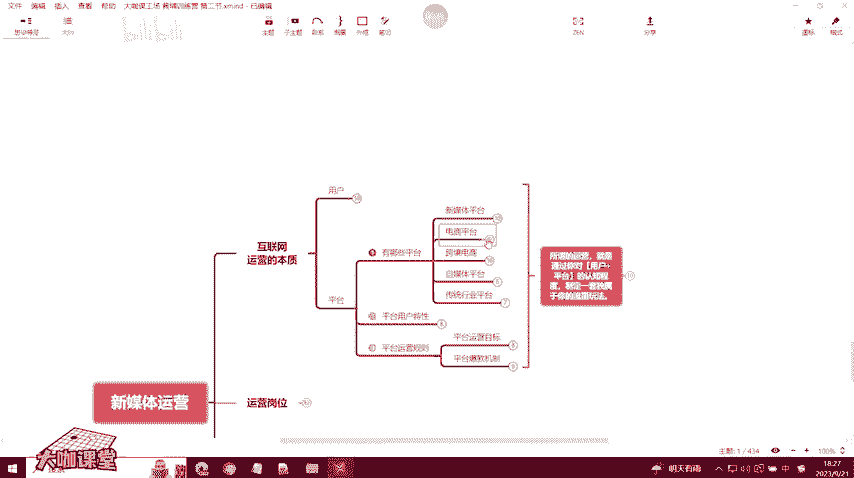

商入驻的平台入驻了之后，那么每一个平台的运营具体运营的怎么样，这个是看我们后期。但是至少在这些地方是有你的用户存在的。那么如果你要做这一块的运营的这些东西你都要去考虑。

那蘑菇街的话是一个专门针对女性用户的一个电商平台啊，你们可以去了解一下。可能很多我们的一些如果说屏幕前的观众，你是女性用户的话，那么你可能就知道这个东西。好，那么这是电商像跨境电商。

如果你是做跨境的那可能接触的也要多一些啊国际性的像网易考拉吧？天猫国际京东的全球购，还有tk的一个区域类型的一个直播带货，美国的一ba啊，还有这个亚马逊等等等等。这些商城。我们其实都都要都要去注意的。

也就是说啊这些平台的意义，就是让我们了解我们自己做的产品，最终可以在哪些平台去做，对吧？还有自媒体平台啊，还有一个传统的行业平台，传统行业平台。

这个是有一个垂直类型的就是一般我们做一些呃实体产品的像做设备做机械设备类的，或者是做一些啊这种化工产品类的在这些。😊。

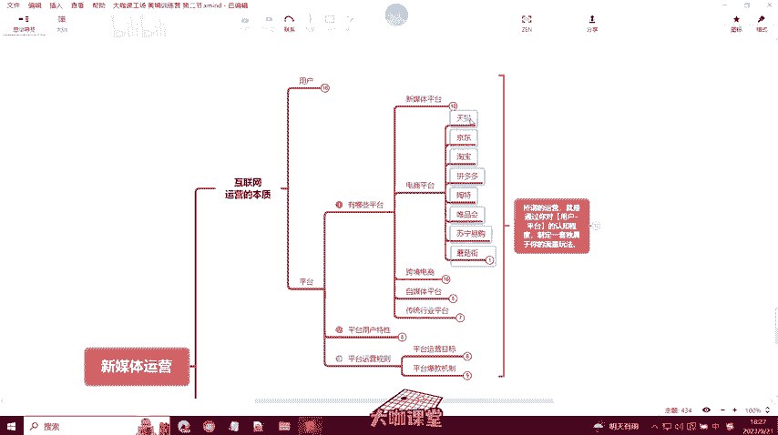

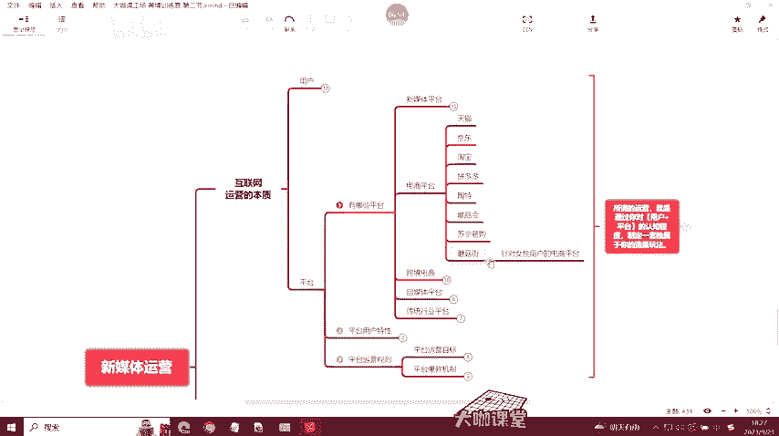

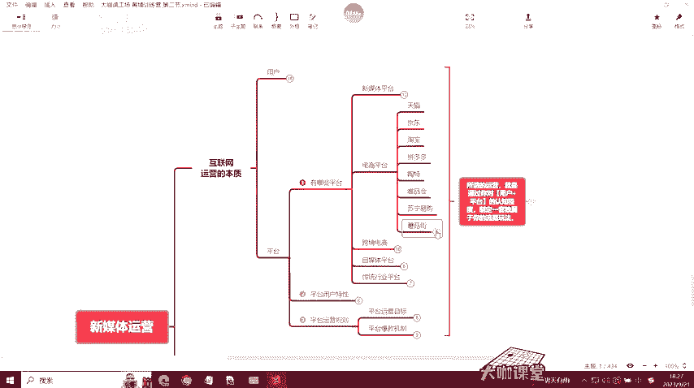

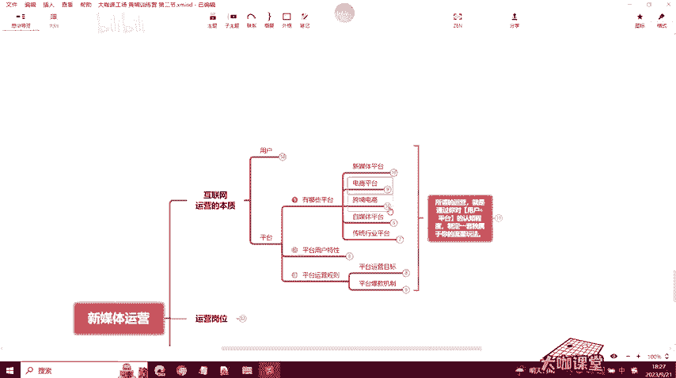

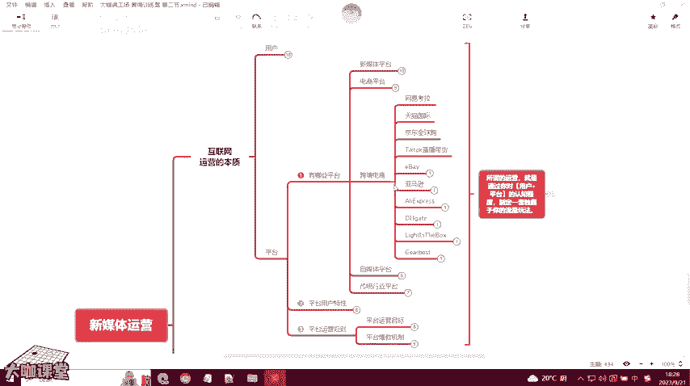

方用的比较多啊，像呃这个百度的这个爱采购，对吧？它可能入驻的一个年费呢大概四五千块钱。那么你入驻进去之后，你你会在里边拥有一个店铺，其实就跟淘宝还阿里巴巴平台一样。但是它有一定的垂直性。

就是很多比如说他想要去做采购的公司有这个采购需求，有这个设备的采购需求的时候，他就会去这些地方去看啊，这个用户呢他确实聚集在这些地方，像中国制造网马可波罗完球资源还有中国化工网等等等等。

那如果说你入驻的公司，你去上班的公司，他是做传统产品的，做机械设备的。那么你就要考虑一下，你得把这个B toB的平台先给它罗列出来。然后在这些可以免费入驻的上面。

或者说公司打算付费去入驻的这些平台去罗列出来之后，考虑哪些地方是需要去做的O那么这是第一步，我们要知道有哪些平台。然后第二步呢，我们运营的时候就要研究这个平台的一个用户的一个特性，对吧？比如说抖音对吧？

抖音是全平台权属性的这个用户人群都有。也就是说你如果说是像现在你做电商啊，或者说你做这个产品做带货。😊。

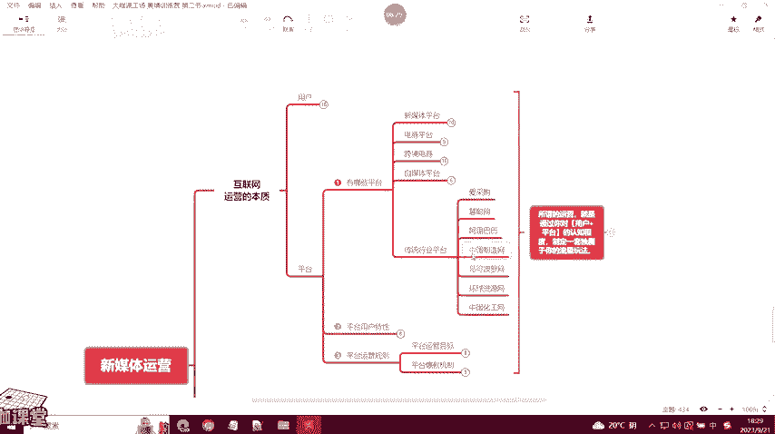

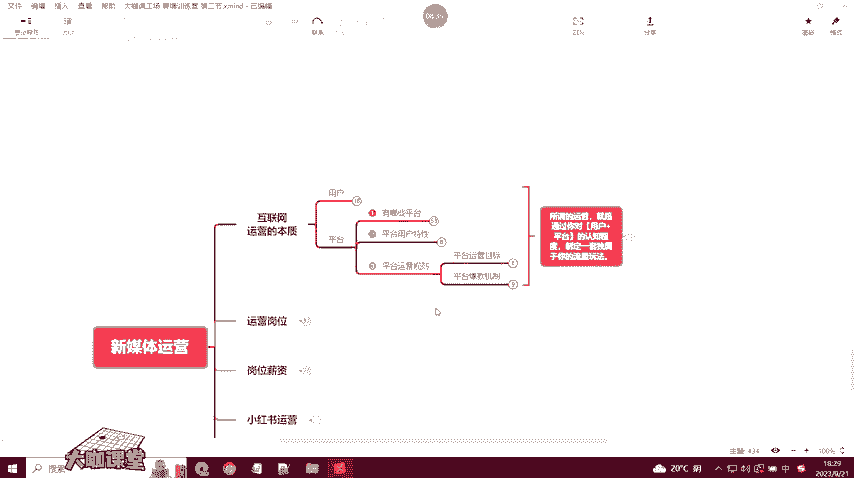

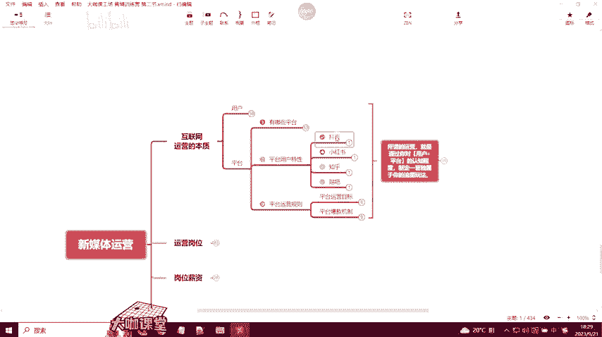

首选的你你考虑去做抖音的话，那这个东西你肯定是不能错过的，对不对？除非说一些特别大型的那种呃设备。比如说像什么破碎机啊，或者说一些啊你像盾构机这种上亿的这种产品项目，你不可能说上交到抖音对吧？

还有卖车的，也没有说抖音上面直接给你挂个小黄车，让你在里面买车，对不对？那么这个时候你的产品几乎是大部分人群在这个行业里边都有。那么虽然说我刚才举例的这几个你没办法在上面去做生意，对吧？直接去呃销售。

但是你是不是可以在抖音上去获取到你的用户，对吧？所以说这个时候你就要知道你的产品，他的用户，哎，我的用户在抖音上面我就可以在抖音上面去研究这些用户，他们喜欢什么东西，然后就发他们喜欢的内容。

然后第二个是小红书，小红书呢也是一个特色啊，也是一个特色，它是一个就是女性高消费群体占比最大的一个平台。这个我相信大家都知道啊，小红书最开始是以这个美妆啊化妆啊等等这些女性群体。

他们一些呃就是购物分享这种啊，像这个包包啊等等等等这些类型的分享为主种草嘛，对不对？然后的话。😊。

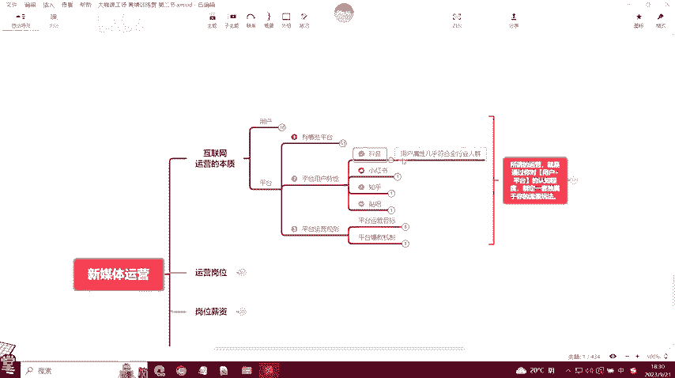

呃，如果你的公司是做美妆，或者说跟女性群体用户这种单边，就是他们的呃这个意向特别强的这种啊，就是说特别垂直类的产品。你首选考虑的肯定是小红书，对吧？这个就是小红书，他平台的用户特性。

然后我第三个举的例子就是知乎知乎是什么呢？知乎呢就所谓人称是一个高尖端的一个知识分子的聚集地，什么意思呢？就是呃了解知乎这个平台的都知道它其实是一个问答平台，对不对？在这个平台呢。

你可以搜索或者找到非常非常多关于行业内的一些呃密文，对吧？或者说一些非常有料的这种技术资料，其实就是一些专业人士，他们分享的东西，你在这个地方可以找到。

当然呢这个平台也有很多人他是冲着什么在上面去看一些这个啊严选收费的这种呃这种类似于小说啊，短篇小说这种类型的，他也有这样一个用户群体聚集。那如果说你的公司需要去做品牌，对吧？你的公司需要去做一些科普。

那么你是不是可以在知乎上面去做啊啊聚集你的人群。😊。

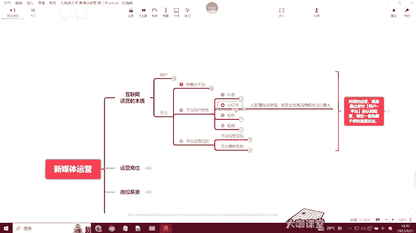

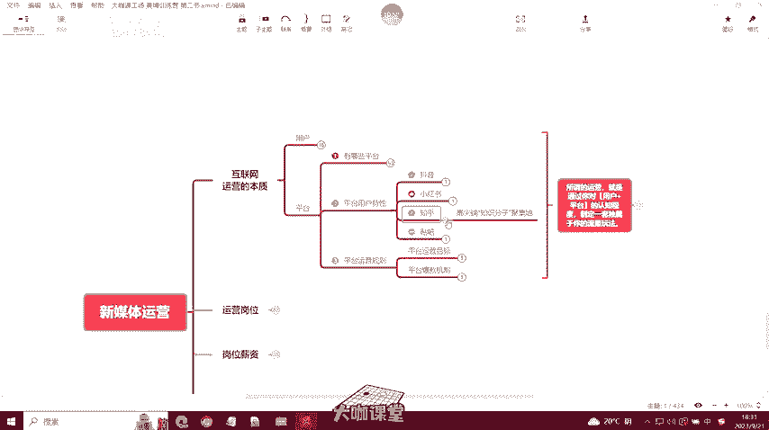

我第四个举的例子是贴吧啊，贴吧这个东西呢嗯其实现在也有人在用，但是很少。那么我就是说啊，除了一些部分特殊的行业外，90%以上的行业，你不用考虑贴吧。为什么？因为贴吧这个东西它已经过时了，现在没有人用。

那如果说你的你的这个公司现在啊做的产品他的用户也不在贴吧上，但是你公司却要求你去做。那这个时候你就要考虑到在这个平台上，你的付出很可能是得不到回报的。

你也运营不来用户O那么这是跟大家讲的一个平台的一个特性，就是说我们去运营的时候，我们要考虑这个平台，它有哪些特点。这个平台上面的用户人群有没有什么我们可以钻的空子。

怎么去针对性的做符合这些平台上面用户的一些内容？O那么这是一个平台的一个特性。那么第三点呢，就是我们重点的一个对吧？平台的运营规则。😊。

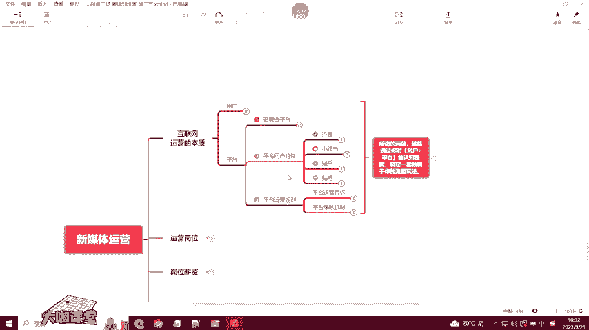

首先我们运营一个平台肯定是有一个目标的，对不对？那么目标无非两种啊，账号做IP然后第二个账号变现对吧？做IP很简单呀，我们提升粉丝数，是不是提升我们的各种数据，这是我们最终的一个目标。

然后如果是你想去做变现的话，变现的方式有很多种啊，吧？接广告啊啊，提升粉丝了之后，你可以去接广告对吧？你还可以去依靠像抖音小红书这种平台的一个电商，你可以去开开店啊。

入驻自己的一个店铺在上面呢去做这个产品的销售，对吧？你还可以去做什么呀？私域引流。那么私域引流的话，引流到你的这个微信啊，或者说其他的这种渠道上面你去跟客户推销你的个广告产品等等。

那么会更直接那么消费意向也会更强，是不是这是你的一个目标，像举阵账号也是我们变现的一个手段之一。矩证账号其实就是相当于把上面的几个点击进行扩大，对吧？这个我们这是我们运营的一个目标。

也就是说以后如果说你去做运营啊，你自己想去做运营给自己运营账号或者给企业运营账号，你得知道我运。😊。

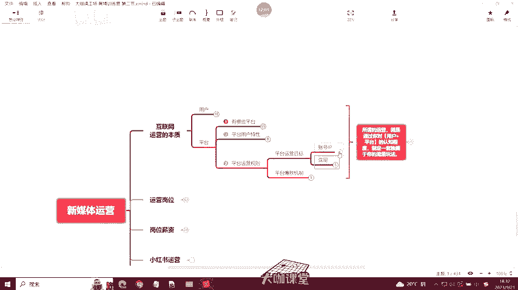

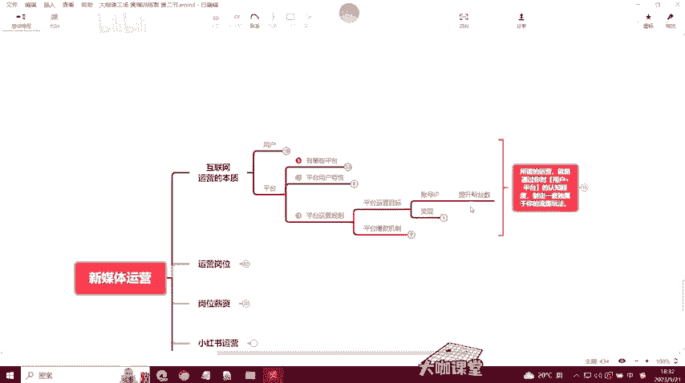

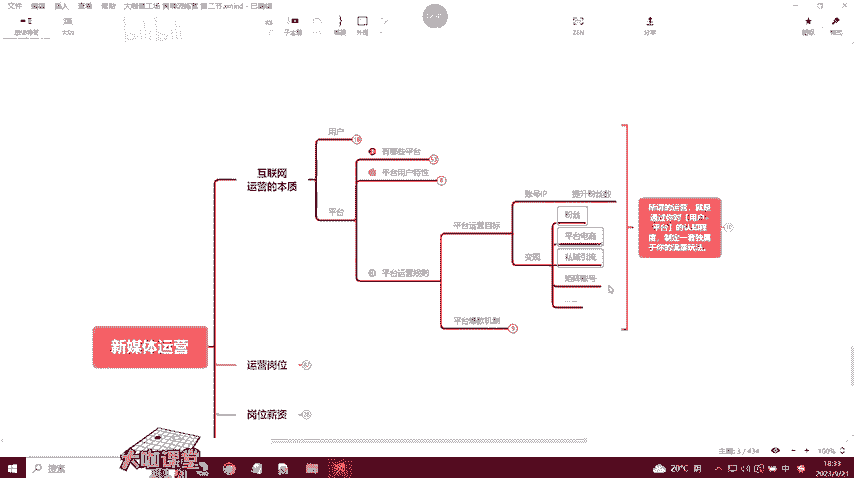

您的最终的一个目标是达成什么样的一个目的，对吧？总不可能说呃我去发一些个人日常什么的对吧？你如果说发个人日常做生活分享，那你也不会来看到我的视频。OK那么这是平台的运营目标。

然后最重要的一点就是我们研究的一个平台的一个爆款的机制，对不对？我们要想办法去弄明白这个平台，我发什么样的内容，我的内容怎么去策划，怎么去设计，能够让我的内容去上首页。

让这个用户让平台能够推送给更多的用户，从哪些方向从像账号领域的定位，人设的一个规划，封面的设计，内容的设计标题的设计，还有研究在平台上什么时间段去发布，然后我的一个账户日常的活跃，也就是更新频次。

还有我去做多个账号的一个矩阵等等等等。那么这些就是我们要去研究的一个平台的规则，对吧？我们前面其实跟大家讲过任何一个平台。他现在哪怕都大家都是采用的这种千人千面的标签性的这种推送啊，定定向推送。

但是它背后系统都有它的一套这个逻辑和。😊。

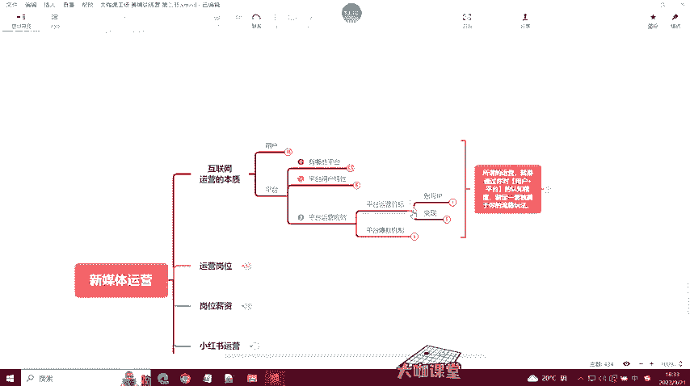

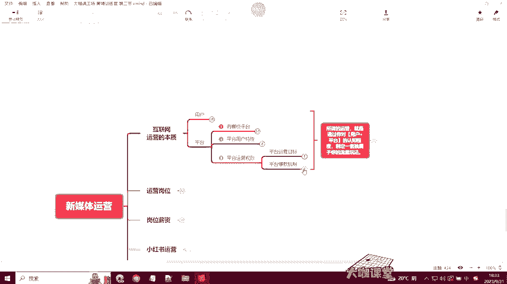

算法对吧？那么这个算法我们没有办法去明确的知道是什么，因为平台它也不会公布，对吧？但是它是有一定规律和逻辑可循的。那么这个时候我们就要研究清楚这个这些平台，它这些点到底是怎么玩的。

那么等你把这些东西玩透了啊，你全部学会了，就代表着你出师了。那这个时候你不管是给自己做账号，还是你去找工作，那么你都是大拇指啊，行业里边的top这一层级，对吧？因为研究透了平台就代表着什么？

代表着我可以把一个东西从零做到一个非常高的一个高度啊，这就是我们运营的一个表现。O那么这是我们刚才讲的关于平台的这个一个运营规则啊。那么其实呢就是新媒体运营这个东西啊。

就是讲你对用户以及对平台的一个整体的认知程度啊，你对这个东西的了解，然后制定出来的一套独属于你的一个流量玩法，什么意思呢？就比如说我们家是卖豆浆机的对吧？那么我研究透了，像抖音的电商里边。😊。

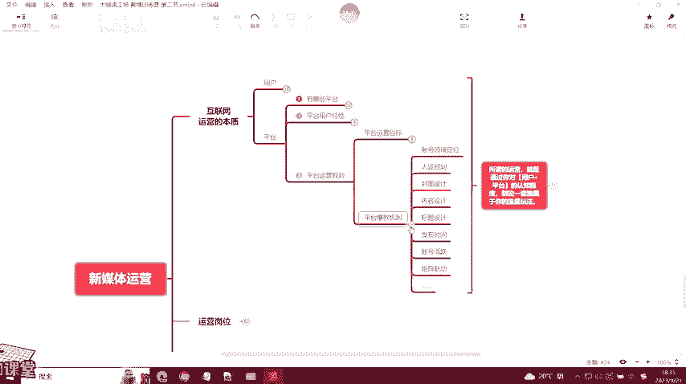

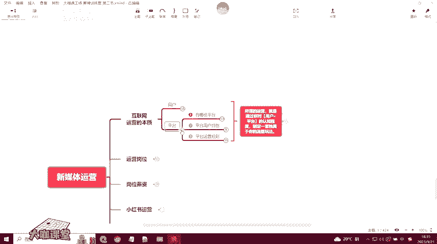

直播带货到底怎么玩的？然后呢，这个小红书上面适不适合开店？然后我适不适合在哔哩哔哩上面去做我这样的一个运营。那么这就是你设及到针对你的产品，然后去研究透了你的用户，他们在哪，他们喜欢什么。

然后这些平台适不适合我去做。最后你设计出来的一套运营思路。O那么这就是我们新媒体运营的一个本质啊，然后我们运营的刚才讲的啊就是我们的一个目标，对吧？我们运营能够实现的两个点，一个是去产品销售，对吧？

我们可以去卖货，对吧？如果是品牌，很简单，你去卖自己的产品，如果是个人那肯定是做自己的IPIP做好了之后呢，我们可以去做新媒体创业，然后我们也可以去开通自己的一个个人店铺去实现平台的一个电商销售。

那如果你只是想去做粉丝，你也不是去给公司做账号，你只是做自己的一个账号，你可以把粉丝做起来了之后，你可以去接广告，对吧？抖音的新图小红书的蒲公英，还有B站的火花。那么这些可以让你实现利润啊。

可以让你实现变现的平台，就是你最终的一个粉丝经济所带来的一个收入，对吧？那还有直播。😊，就不说了，你可以给自己带货，对不对？你也可以给别人带货。那么这个时候带货的时候，我们知道我们要去布置场地，对吧？

我们要去讲这个直播话术，然后我们要去场控，有时候可能还是头流。那如果你自己懂这么一套流程的时候，你去给自己带货，是不是在这当中能够省下非常多的人力物力等等各方面的这种成本和支出，对吧？

那么这就是我们这一节课要跟大家讲的，我希望大家能够明白啊，因为很多呃我们看我们视频的确实小白居多啊，我希望大家能够明白，就是我们运营的一个最终的一个本质，我们要实现的目标，还有我们运营的这两个点。

我们始终是围绕着这两个点去玩运营的，好吧，O。😊。

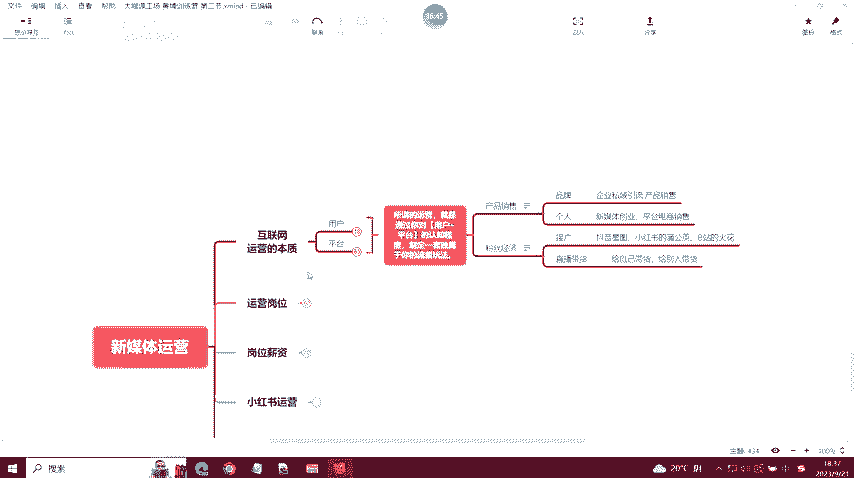

