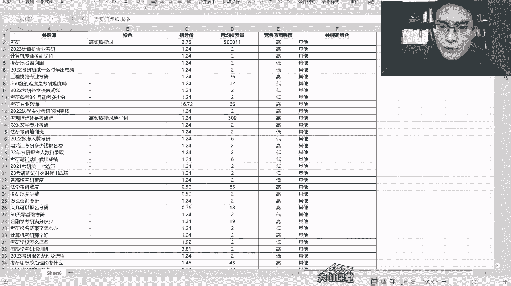

# 【2024B站最良心新媒体运营全套教程】比付费还强十倍的自学款课程 小红书运营 起号／创作／涨粉／变现／就业 7天出爆款 惊艳所有人！ - P4：01.2：运营核心 关键词库搭建+关键词自动分组 - 大咖运营课堂 - BV1cM4m1U7G5

hello，大家好，欢迎大家来到我们这一节课。那么在之前的课程当中呢，我们跟大家讲过，我们要去做一个我们自己的一个关键词库，要去做筛选，对吧？呃，为什么我们要做关键词呢？呃，这是因为一个很重要的因素啊。

就是我们的所搭建的这样的一个关键词库里边的所有的关键词，每一个关键词都对应了一个用户的真实需求，好吧，都对应了一个用户的真实需求，为什么这么理解啊，就是。😊，我们要知道一件事儿。

就是我们现在的这个互联网用户呢在互联网上获取信息的这个方式只有两种只有两种。第一种呢就是被动接收信息，被动接收信息，这个很好理解啊，就是类似于抖音小红书，还有我们现在各种新媒体平台的这种兴趣推送。哎。

就是说用户喜欢什么内容，平台主动把他喜欢的内容推送到他的面前，这个叫做被动接收。第二个呢就是主动接收啊，主动接收，主动接收是什么呢？主动接收的渠道就是来源于搜索。也就是说用户他需要去查找。哎。

我对某一个点感兴趣。我现在想知道某个东西，平台没有推送给我，我就必须得去搜索，不管你去哪搜。你在抖音上搜也好，你在小红书上搜也好，还是百度或者说哔哩哔哩上面搜索这些都不重要，重要的是搜索这个行为。

他必须对应了一个什么东西啊。搜索这个行为，它必须对应了一个东西叫做关键词。也就是说用户去查找这一块的内容呢，他就必须得通过关键词去搜索。那么关键词搜索出来的才是他想要的，对不对？

那么这具体至于具体是不是他想要这个我们不说呃，我们在这一点大概就能明白一个东西。关键词这一块呢，他代表着用户的一个实际的真实需求。而且还有一个非常重要的因素，我们所有在做企业运营的客户，呃。

我们的这个群体，或者说呃屏幕前的各位同学也好，你们自己做项目，或者说你们去给企业做运营，你们都要明白我们做互联网运营最终的一个目标就是要找到我们的。最终的一个目标是什么呀？互联网运营的目标啊。

就是要找到我们。最佳的。呃，对标需求用户。意思就是说呃，我们平时去投放广告也好，我们做内容也好，呃，我们的视频观看的这些群体呢，肯定是有一部分是精准用户。有一部分呢他又是泛用户这一部分人群呢。

不是我们想要的，我们想要的一定是最佳的对标需求用户，也就是我们的精准用户。那这个地方呢所谓的这个精准用户，其实就在搜索关键词这一块。也就是说所有人他去搜索这个时候，他肯定是有这一块的一个需求的。

那么有需求O我们就可以根据关键词的这个类型来对用户进行一个区分。我们只做我们最需要的这一块业务的一个呃用户就可以了。比如说我举个例子啊，假设你现在是一家做这个考研的培训机构，对吧？

那么可能你的用户他想搜索一下这个考研的资料，对吧？考研的时间，然后呢复习呃以及搜索培训机构。那么这几个词当中，你去考虑一下哪些用户，他是有可能去你到去到你那里学习的，或者说他有可能成为你的这。

这个呃最终下单成功的这样的一个客户，对吧？那么培训机构是不是呃找学习资料的这一类都有可能，是不是？那么这就是代表着我们去根据关键词来区分我们客户的一种类型。OK这是我们关键词类这一块的一个重要性。好吧。

我们把它打上啊。用户需求加精准用户群体。区分OK那么我们这一节课的一个重点就是要教大家怎么去搭建我们的关键词库。还有我们跟大家分享的一个关键词，自动分组的这样的一个工具。OK我们先来看一下，好吧。

我们先来看一下关键词库的一个搭建。首先呢我们关键词库这一块，我们需要利用到一些工具啊，工具并不是说我们自己去想。你有时候呢你哪怕你对一个业务产品了解的再透，靠你自己去想，你想不出来多少词，好吧。

我们用户的同一个产品的一个搜索行为和搜索方式，一定是多种多样的，并不是说我们觉得一个词就代表了用户的一个需求。那么可能我们能够考虑到的只有那么一部分十几个几十个词。但是平常呢我们去搭建一个关键词库。

可能有几百个上千个词都有可能。OK。

那么比如说呃我们以刚才我们讲的这个考研为例，好吧，我们现在又呢又做的是小红书的平台。那么我们就在这个地方，我们找到这个关键词挖掘这里，我们输入呃，我们输入输入考研啊，我们输入考研。

输入考研之后呢，那么这个时候呢，他就会把这个关键词在左侧给我们列出来。列出来了之后呢，我们就通过这个导出数据，把我们的关键词给导出一下。那么呢我这里是已经下载过了啊，我我这里是已经下载过了。呃。

我给大家看一下，下载完成之后是什么样子啊。

呃，下载完成就是这样的一个表格。然后呢，我们打开这个表格之后呢，它显示就这样的。呃，这些数据呢能够提供一个一定的参考意义。我们先根据我们搭建词库，我们先根据左侧的这个词来看，这里呢有这些搜索词，对吧？

这些搜索词呢现在暂时看起来还比较凌乱啊，还比较凌乱。我们搭建自己的一个关键词库的一个结构的步骤，就是要先把这些词拿到手，再根据这些词库来做这个筛选和排序。OK我们先把这些词拿到啊，拿复制一下。

OK我们把这些关键词复制一下ctrl加C复制。然后呢，我们再打开另外一个工具。就是我们的一个关键词的分组分组工具啊，我们打开这个工具。呃，这个工具呢它需要启用红啊，我们把这个表格。

也就是说不管你是was还是这个呃office，你需要把这个表格的这个excel的这个红给打开。当然呢如果说很多人用的这个WPS呢，呃你开启不了红，或者说需要付费的话，那么你可以自己想办法。

或者说你去网上搜一下，找一下这个解决方案，或者说你来问一下老师都可以。呃，如果说你用的是office的话，那么这个红就是可以直接启用的好吧，那么这个时候呢我们打开这个表格之后，我们先注意一下，呃。

这个地方呢是我们要粘贴的关键词，我们先把关键词粘贴到这个地方。

OK那么这里有一个清空首列，清空手列的话呢，就是把这个地方的内容清空。然后清空内容呢是清除我们待会儿筛选之后，所有的这个呃内容清除。然后呢呃这有一个快速分组。我们待会要用到这后面呢这个未分组词呃。

代表的是我们待会儿把这个分组做完了之后，所有没有经过我们筛选的词，它会展示在这个地方。那么接下来我们就要把这个词拿到了，我们就要来分析一下这些词的一个性质，把同样类型的词，我们把它归类到一起。OK。

我们先来看一下这个词啊，在职考研考研NPCC考研时间、辅导班真题啊，我们来浏览一下啊。我们先找多的啊时间。倒计时考研时间时间OK那么这个地方呢有很多时间相关的啊，我们先放上一个时间。

在这个地方蓝色区块啊，记住了，放在这里，然后我们再来找时间OK然后的话呢我们再看一下。几月几号考研的话是几月几号？好，这个我们待会儿再说。呃，什么时候考研呃，课程机构，好吧，我们先把课程放在这里。呃。

机构这里交给大家啊，就是课程跟机构这两个东西呢，它可以理解为一个，也就是说是我们的业务词，对吧？也就是我们刚才说的精准用户它的一个搜索词。那么这个地方我们就要把它呃有关于课程的。

有关于机构的词放在这么一个分组下面，我们就要用到一个技巧，就是一个符号。我们呃输入按住shift的键议以及你键盘上的数字，7号键，打一个这样的符号，我们再来把机构打进来。

OK那么待会儿我们来看一下是什么样的。呃，我们先点一下吧，我们看一下啊。呃，我们点快速分组。好，那么快速分组之后呢，他就会把这个时间、考试时间、报名时间、考研时间、考研时间安排等等这一类的词归类到这里。

也就是说只要包含时间的词放在这里。然后呢有涉及到课程考研呃机构等等，这些，它会分类在这里。那么这个地方呢，就是我们刚才跟大家讲的没有分组的词。好，那么我们在这个未分组的词里边，我们再来找啊。

我们再来找再来做分呃，这里有一个考研日期啊，考研日期。然后我们刚才是不是看到有一个几几月几号来着是吧？啊，几月几号那么这种词呢呃因为我这个词现在基数少啊，我那个呃那个账号是没有会员的。

只能下载100个词，我们现在呢我们就基于这几个词，我们给大家做一下演练。呃，有一个日期是吧？呃，日期那么我们把期放在这里。呃，日期。嗯，我们把日期放在这里，还有一个叫什么来着？还有一个是号，对吧？O。

假设你的词很多的话，那么这样的话能够节省我们很很提高我们很大的一个词库的一个筛选的效率。然后呢，这里有条件是吧？呃，条件。挑战科目。还有辅导，哎，辅导的话可以放在这里。科目。还有什么？总分复习资料。

总分复习资料。嗯，资料。题型还有题对吧？还有题。嗯，题的话呢可以根据什么呢？可以跟资料放在一块儿。嗯，单独放一块吧。嗯。几天科目成绩啊，还有一个成绩，考研成绩，这里有一个成绩。辅导班。倒计时。

什么时候出成绩？成绩？O那么还有一个成绩，这个东西我们要把这个成绩放在这里。成绩也要提上来。啊，因为成绩查询的话呢，或者这一块也有呃，它是具备流量的啊，它是具备流量的。我们把成绩放在这里。

然后呢我们来筛选一下。OK成绩什么时候出成绩，什么时候出？嗯，几月几号时间表啊，考研时间表、考研日期O。嗯，这个是没有问题的啊，考研的资料真题。那么我们在这里就对这个东西呢做出了一个基础的筛选啊。

就是我们的词库。我们看一下还有没有呃条件条件这个东西呢，其实也是啊也是条件这个东西也一样，是我们可以做的内容。考研需要什么条件，有人可能会去搜，对吧？我想参与考研，我需要具备什么条件。

这个呢就代表着用户的一个呃搜索需求。他需要看这块的内容，我们就得去做这一块的内容，还有报名呃，什么集训营这种啊，就是属于明显的业务词了啊。这里还有一个什么时候考研，对吧？什么时候考研？嗯。

那这个东西呢我们这样我们把时间这里我们把间去掉啊，然后呢我们来分个组考研时间啊，什么时候考研？什么时候出成绩？什么时候考OK其他的都还好。然后这里有一个考研成绩，什么时候出，什么时候出成绩。

这两个东西呢其实应该放在成绩这一块的。那么这里我再跟大家讲一下，呃，它的这个搜索排序以及关键词的排序的规则，分组的一个规则，就是哪个东西放在最前面，哪个词放在最前面，它就优先分哪一些词。

那么后面的假设说我们刚才想要提取成绩。这个东西词应该分类在这里的，但是它出现在这里。那么我们就要考虑把这个成绩呢给它放在靠前的位置。OK要把成绩放在前面，然后呢，我们把这个时间呃相关的内容放在这里。

那么它就可以正确的去分类了。好吧，那么这里呢我们的词库呢展示的还比较少啊，因为什么呢？呃因为刚才呢这个这个这个我说啊，这个我还我这个账号没有会员。但是呢通过这样的一个形式，我们能够看到一个什么呀？

就是你的一个关键词库搭建好了之后，你能够根据每一个类型的关键词去考虑这一个比如说跟时间相关的，很多人想去了解了解考研的时间。那么这一块有可能一些关键词是你没有涉及到的，你的标题里面没有包含到的。

你没有发到相关的内容的，你就得考虑比如说考研时间，哎，我要去做一篇考研时间的这样一个呃笔记。然后呢我还得考虑考研考试时间，这个词，有人搜索的时候，他能不能搜索到我的笔记。

我需不需要做一篇这样的一个笔记去发一下我的内容。然后考研倒计时我要不要发所有跟时间相关的。你不要以为哎我发布了一个考研时间的这样一个笔记。它所有搜索需求都能够跟这个匹配。这不是的啊。

你一定要考虑呃搜索关键词的一个完整的。覆盖率也就是说用户需求的这一块的覆盖的角度。那么当你的词库量足够了的时候，你就能够根据这样的一个词库去呃规划你整个运营的方向和内容的一个体系。好吧。

那么这个工具呢它可能说呃提取的关键词库还比较少是吧？那么我们现在就把这个词库，我们去扩大一下。呃，我这里呢还有一个工具，呃，这个工具呢是一个百度的推广营销后台。呃。

现在呢如果说你没有企业在做这个推广的话，你是开不了这个这个后台的。呃，那么假设我现在呢我进入到这个后台了之后呢，我进入到这个搜索推广。然后呢，在搜索推广里边有一个工具中心。

工具中心这里有一个关键词规划师，这里呢是可以下载我们的关键词的。我们还是让，我们在这个地方搜索考研。好，然后呢呃这里的很精准的关键词就来了，很精准的关键词就来了。okK那么呢接下来我们怎么弄呢？

我们就呃点击下载，我们把这些关键词给它下载下来。稍等一下啊。嗯。呃，我存一下啊。是放哪儿了来着？哦。放在这里了，然后的话我们的关键词库我给它存到这里。

啊，这是我们提取的一个关键词库，我们看一下它有多少词啊。

这个词库的量考研这么大的一个体系，这个词库量应该是非常大的。呃嗯。他只给了3000个词啊，应该还是还有更多的词。那么呢我们先把这些词呢，我们给他。嗯。嗯，我这个笔记本没有拖不键。

我们先把这个词给它放到这个地方。好，那么呢这里呢词是非常多的啊，应该是覆盖了我们很大一部分这个呃精准的用户的这一块的一个需求。好，然后呢我们点击快速分组。OK那么这个时候你就能看到你所搭建的这个词库。

它里边缺了哪些内容，这里边还有哪些内容是你可以做的。比如说费用对吧？我们刚才看到了我们提取词的时候有费用，对不对？然后呢，还有这个呃还剩多少天考研这个呃计算机考研等等培训等等。这些都是属于你的业务词。

你要在这个地方去分组的话，你就能够通过这些能够得到非常非常多去搜索你这些精准的啊，就是代表着精准搜索需求的你的用户啊，锁定他们我们再去通过举证的方式去复刻，那么你做这一块的内容呢。

你就大概就有一个很清晰的方向了啊，这里呢大概还有几千个词，这里应该是还有2千七八百个词还没有弄吧，就是你要根据这些信息去筛筛出你的一个关键词库，根据这些关键词库呢去确定你要做哪些内容。

O这是我们这一节课要跟大家讲的一个重点。好吧，讲的一个重点。因为怎么说呢？就像我刚开始跟大家讲的，现在呢。

互联网上我们所有的用户接收信息的方式就两种嘛，一个是主动，一个是被动。我们通过主动接收信息的这一群用户群体，他们通过搜索，他们本身就是我们的一个精准的用户群体。我们要想办法抓住这一部分用户群体。

我们就能够提高我们的成交和我们所有的业务这一块的一个呃营销能力啊，营销能力。那么包括我们其实如果说我们在做投放的对吧？我们现在呢包括千穿对吧？还有小红书的这个信息流还有其他的这个推广，都是通过什么呀？

他的后台都是通过人群的画像啊，其实也有关键词包这样的一个东西。但是呢他们目前呃还没有这么就是可能说已经进化了吧啊，他们这个人群划分的形式会更加的多样化啊，更加的多样化。但其实无非就是什么呀？

无非就是根据用户的一个标签啊，用户的一个需求来区分我们要找的用户他们在哪里。这就是关键词他的一个魅力和我们之前啊做运营，包括现在做运营，我们要玩的一个东西，好吧。

OK那么这节课呢就给大家讲到这里，我们下节课再见。