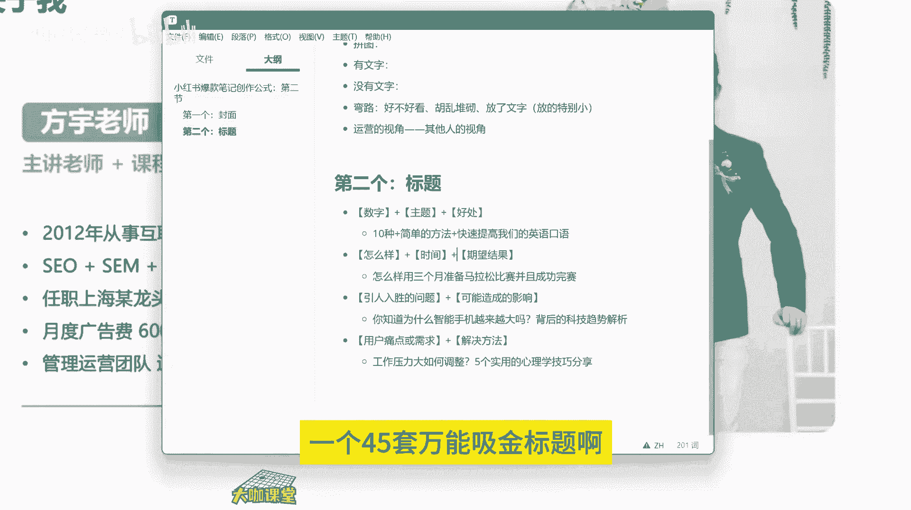
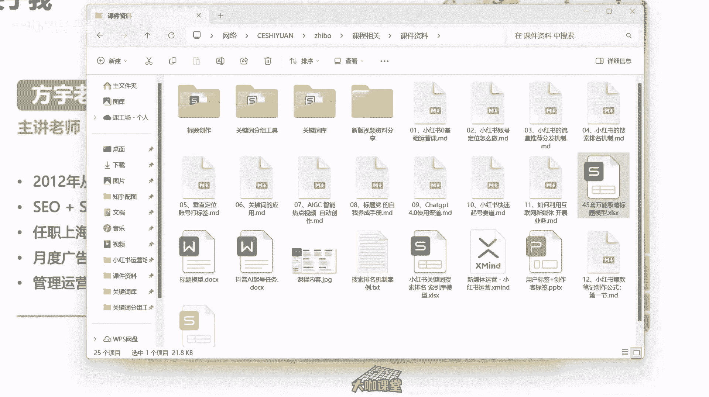
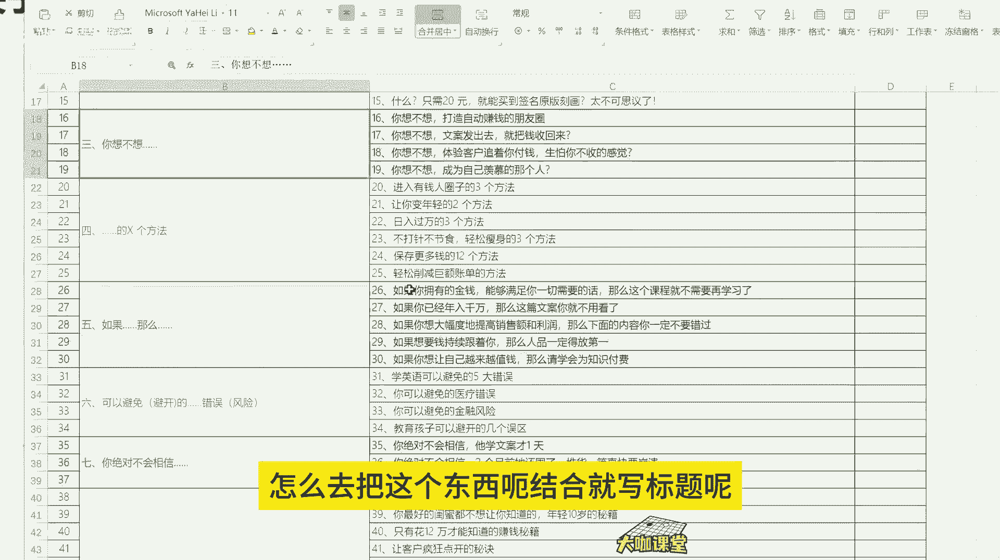
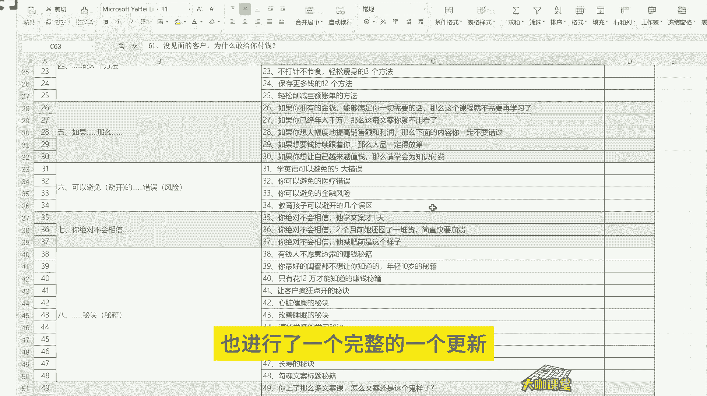
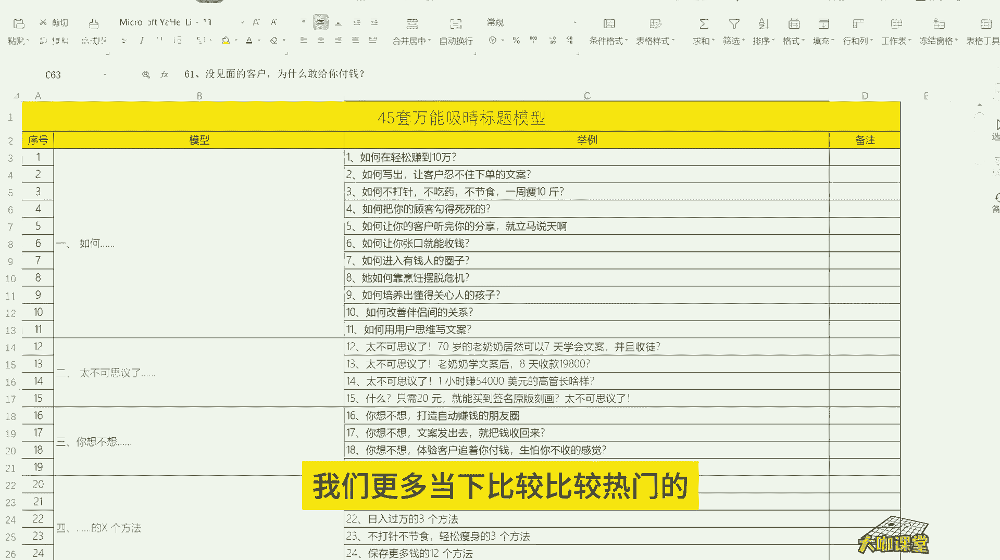
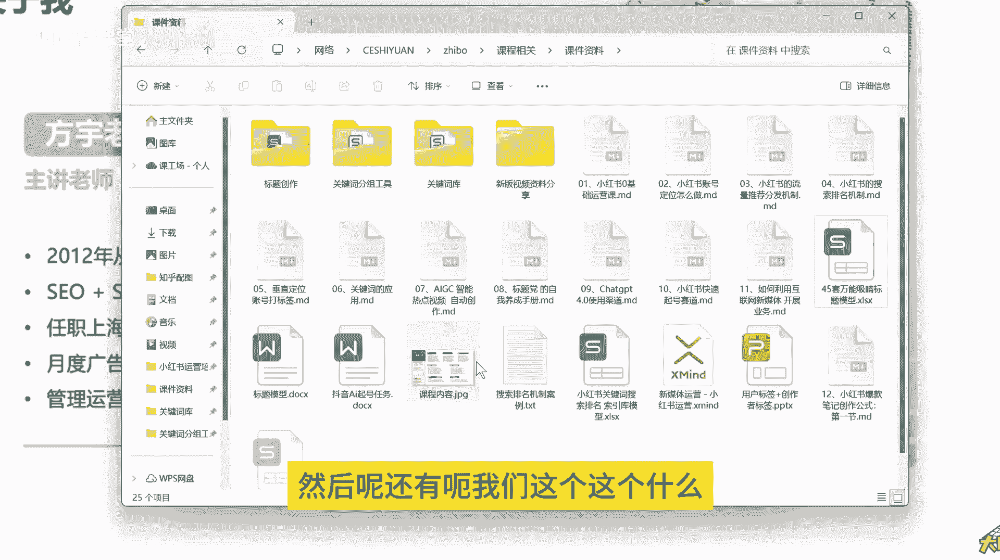
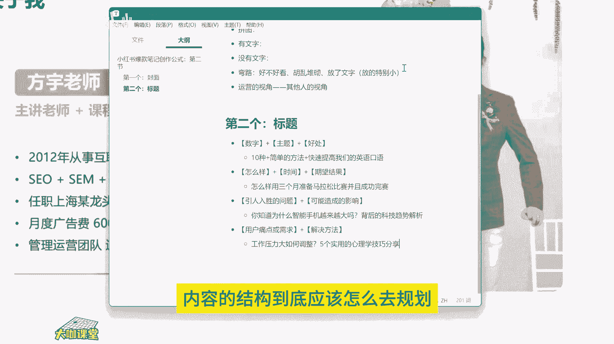

# 【2024B站最良心新媒体运营全套教程】比付费还强十倍的自学款课程 小红书运营 起号／创作／涨粉／变现／就业 7天出爆款 惊艳所有人！ - P8：01.6：小红书爆款笔记创作公式：第三节 - 大咖运营课堂 - BV1cM4m1U7G5

hello大家好。那么我们这一节课呢就跟大家讲一下标题这一块啊，非常非常的重要。那么呃我们一直都说从我们运营的角度来讲啊，如果说你不做标题等，那么你就不是一个好运营。我们所有人呢取标题，对吧？

我们标题吸引用户吸引用户的一个对你内容产生的一个产生兴趣的这样一个点击行为，都是从什么呀？从标题这一块去引起的对吧？一个好的标题能让用户对你的这个内容产生点击，然后呢，你再把内容做好。

用户才能对你的笔记形成一个互动的行为，点赞收藏停留时间，以及进入你主页的这样的一个页面的数量，对吧？这些都是我们要去经营的第二个步骤，也就是我们的标题。那么标题呢有很多的创作方法。

其实呢呃我们很多人在写标题的时候，他可能会疑惑到底这个标题该怎么写啊，我们有没有什么样的方法。那么这里呢我就给大家分享几个我们能够去套用的这样的一个公式，就能够写出来比较吸睛的这种标题。O。

首先第一个就是我们用的比较多的啊，就是数字加上我们的一个产品，或者说加上我们要跟这个用户讲的一个核心的一个点啊，也就是我们的主题，然后呢再加上一个什么，再加上呃用户呃。

就是我们这个内容提供给用户的一个好处啊，我们来看一下啊。呃，就是呃数字对吧？然后呢加上我们的一个。加上我们的一个主题。再加上就是。好处OK可以这样理解。那么怎么怎么去怎么去怎么去讲这个东西呢？

就比如说啊。1种啊10种简单的方法，快速提高我们的英语口语。1种简单的方法快速提高我们的口英语口语。OK我们来看一下啊。10种简单的方法，快速。提高我们的英语口语啊，这是这个结构我们来拆分一下啊。

首先数字十啊10种啊，这个是我们的数字配合啊，我们来拆解一下，然后呢加我们的主题就是简单的方法提高我们的啊简单的方法啊，简单的方法，10种简单的方法，我们的主题就是方法，然后呢。

好处就是能够快速啊快速提高啊，快速提高英语口语，这就是我们的这个结构。如果说你创作这样一个标题。用户关注的焦点在哪里。用户关注的焦点在哪里？我们来拆分一下，一定是首先10种简单的方法，对吧？

他要看的是哎有10种方法可以提高英语口语，那么他才会去对你这个笔记产生兴趣，然后进去看一下到底有哪1种方法，O这是我们要讲的第一种啊，是我们的数字加主题的一个形式。

然后我们的第二种呢就是呃加上一个疑问句啊，疑问句。比如说呃怎样啊，然后呢再加上我们呃期望的一个这样的一个就是能够给用户提供的一个结。我先把这个写出来啊。😊，比如说怎么样对吧？

然后加上呃我们的一个呃期望结果。啊，期望结果。然后我们举个例子啊，就是怎么样用3个月准备马拉松，并且成功完善啊。怎么样用3个月。准备。准备马拉松比赛。并且。

成功完赛OK其实呢这个里边也还有一个还有一个东西叫什么呀？它里边还有时间，对不对？嗯。这里边还有时间怎么样对吧？是我们的疑问句，怎么样是不是可以拓展出非常多的这样的一个标题的模式，对吧？

用时间3个月OK然后呢，我们的结果就是准备马拉松比赛并且完成。完成完完成比赛，这是我们要提供的一个标题。我们吸引用户的点在哪里？我们吸引用户的点在哪里？首先马拉松比赛完赛啊完赛这个是我们用户关注的节点。

假如设说你现在想要参加马拉松比赛，你肯定要考虑我要准备，对吧？我还要完赛。那么我要提供给你的，就是怎样让你在3个月的时间之内能够准备好一场马拉松的比赛，并且成功完赛。

这就是我们这个标题带给用户的一个价值，好吧？那么呃我们再来讲第三个，就是我们首先呢提供一个呃引人入胜的这样一个就是能够吸引用户的一个兴趣的问题点，对吧？加上什么呀？引人入胜的一个问题点。

加上这个问题可能造成的一个影响。嗯。我们来举个例子。你知道为什么智能手机越来越大吗？背后的一个科技趋势分析。OK我们来看一下啊，你知道为什么。智能手机。越来越大呢。背后的科技趋势解析。我们来看一下啊。

首先问题点是什么？你知道为什么智能手机越来越大吗？啊，这是一个问题，对吧？你知道为什么手机越来越大吗？你知道为什么现在的火车速度越来越快嘛？对吧？你知道现在房价为什么越来为什么现在房价越来越高吗？

背后的产业链啊以及等等等等，这就是一个标题的结构。我相信你们平时应该没有少看啊，没有少看，就是这个地方呢，其实是呃给出结果给出结论啊，让用户呢能够对你的标题产生一个兴趣。

到底为什么这个事件它是因为什么导致的。这是我们提供的一个标题的结构方式。第三种好吧，我们再来看第四种第四种的话就是呃先放放上用户的一个痛点。😊，先放上用户的一个痛点，或者说什么呢？呃或者说是。需求对吧？

或者说是需求。然后呢，我们再加上我们自己的一个什么东西啊？我们提供给他的一个解决方案，对吧？我们把用户的痛点在这个地方列出来，标题的前面列出来，然后我们再告诉他这个东西这个东西这个问题怎么解决？比如说。

工作压力大，如何调整？5个实用。的心理学技巧。分享。5个实用的心理学技巧分享OK。我们来看一下。首先第一个是用户的痛点，工作压力大，对吧？工作压力大。那我们呃假设把这个地方换一下，对吧？

用户的痛点就是说呃经常头痛怎么办是吧？呃，或者说呢呃。呃，和男朋友吵架，经常和男朋友吵架，三观不合怎么办？然后后面再加上我们的一个解决方案，这是我们最常见的一些标题的写法啊。

最常见的标题写法就是后面加上我们的一个解决方法。其实我们很多人在做运营的时候，我们写的标题呢，基本上都去于后者就是先列出用户的痛点或需求，然后呢再提供解决方法，用户的痛点需求，这个东西。

你们再去分析一下，是不是跟我前面跟大家讲的这个关键词，长尾词这个东西比较对应啊，对不对？那么这个关键词呢，第一个是可以得到一个搜索展现的一个结果的可能性。第二个呢就是让用户能够对我们这个内容呢。

他能够通过标题知道我们讲的是什么。然后呢再通过我们后面写的这个解决方法去让它产生点击的行为。这就是我们去写标题的一个呃公式。很多人呢写标题写的特别普通，一点吸引力都没有。那么你的标题没有吸引力。

你怎么才能让别人去用户去产生点击行为呢？那我们之前说对吧？你的内容推送给你的这个精准的用户面。你要想让他去产生点击行为，不是说推送给他的啊，你的内容跟他相关，他就能产生点点击行为。

那一定是我们前面要有一定的引导，对不对？不管是封面也好，还是我们这节课讲的标题也好，你都要把这些细节做好。那很多人说我的内容做的很好，就是产生不了点击行为。那你要看一看你的选题你的封面，你的标题这些点。

他有没有出问题呢，是不是所以说我们运营呢其实讲到一个点，就是我们运营呢做的基本上都是细的，不能再细的一个工作了。有时候呢就我之前去让一些设计呢做一些图片做一些这个呃就是海报等等等等啊。

就可能他做的很多版都不能如我的意，可能我把这个文案需求点啊，我把用户关注的点给他标明了，我让他这样去做，但是从设计的角度来讲，他就考虑美观问题啊，你说的这些东西，他不懂他不懂什么是用户需求。

他也不懂这些东西为什么要放在这里，明明放在那个地方更好，为什么要放在这里呢，其实从我们的角度考虑，我可能是只想让用户对这个东西快速产生。😊，然后让他对这个东西产生点击行为。

然后才能进行我下一步对他的这个呃营销的一个目标。OK那么其实写标题呢还有很多很多啊呃，像我们呃加上这个时效性，然后加上主题，然后呢通过这个否定形式，再加上我们常见的这种观点和误区。

比如说为什么你不应该每天运动啊，运动的一个科学的分析科学运动的一个解析，对吧？就是这种使用否定形式来打破我们认知的一个常规手段啊，也就是反卫生的一个句式啊，来告诉让别人对我们这个内容产生兴趣。

再比如说我们还可以通过对比，对吧？两个极端的一个选择，早起还是晚睡生产力专家的一个最佳的建议，对吧？就是通过对比的这种手段早起还是晚睡啊，早起还是晚睡这个东西呢观观念，让用户呢产生自己我的一个分歧行为。

然后对你这个内容产生一个兴趣，哎，结合他自身的一个需求。比如说可能很多人喜欢晚睡，对吧？晚睡的话呢。😊，就意味着什么？就意味着可能晚起，对吧？早睡呢就意味着早起到底这一块呃晚睡有多大的伤害。

我晚睡对我有没有很大的影响？我早起我有什么样不一样的这个呃收获等等等等。这样是激起用户对这个东西的一个好奇心是吧？所以说我们写标题一定要运用合理的运用一些方法，而不是说我们自己去呃类似于口语化的东西。

把这个内容写出来啊，这个东西这样写肯定是不行的。好吧，那么标题这一块呢，我们之前跟大家分享过一个45套万能吸金标题啊，45套的一个万能吸菌标题，就这个呃你结合着这个工具的话。

你就可以在里边去把我们很多呃内容放进来。

把我们的很多行业里边的东西套进来啊，怎么去把这个东西呃结合就写标题呢，也能有一个比较快速的样一个写标题的一个方法。那么这是一种现在这个内容呢也进行了一个完整的一个更新。

就是结合了我们更多当下比较比较热门的比较热门的点和一些平台的一些调性，我们做了一个简单的更新。然后呢还有呃我们这个这个这个什么呀？我们之前跟大家讲的这个AI创作对吧？AI创作标题这一块。

就是很多人用AI写标题呢说实话他还是缺少了一定的判断力。因为我们我见过不少啊，写标题的，用AI写的标题，就一眼能看得出来，没有任何营养，没有任何价值，可能从他的角度来讲，他觉得这个AI写的标题还可以。

但其实从我们运营的角度来看，这个标题有很大的问题，词用的不对啊，情景用的不对，还有这个方式用的不对等等等等。让人一眼看起来就可能很尬，甚至很搞笑的一个程度啊，所以说我们写标题这一块。

你要有一个运营的基础判断方法。那我们用这些东西，为什么我们要用数字，为什么我们要用这样的一个格式。为什么我们要用疑问句。😊。

这些东西都是有原因的。好吧，我们要去研究背后的原因，然后再结合我们这样的一个呃运营的一个技巧，再把它落实到我们真正的操作当中。好吧，那么这就是我们这节课跟大家分享的一个标题这一块的一个内容。好吧。

那么下一节课我们就正式开始讲内容到底应该怎么做，内容的结构到底应该怎么去规划。

