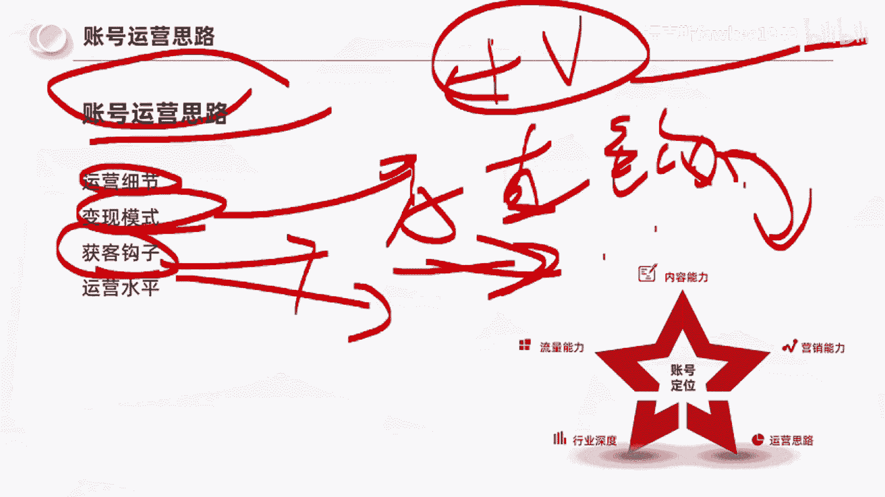
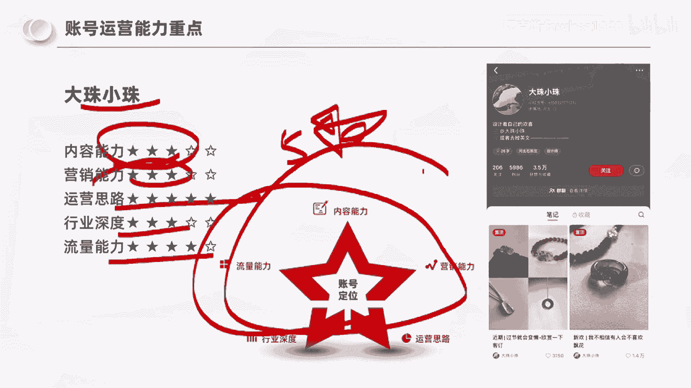

# 【2024实战干货】万粉账号变现千万《小红书快速起号秘籍》，天花板级别教程，当下起号可用！ - P1 - 福克斯fawkes1949 - BV1it421T77b

这条视频是小红书实战系列的第三章节。

也是目前B站上面小红书内容的天花板，希望提升自己变现效率的，希望当下快速起号的一定要认真看完这条视频，今天我们主要的四个学习目标分别是什么，第一个呢是我们了解账号拆解的五个维度。

就是我们看到一个好的账号之后，诶我们要怎么去拆解呢，我经常会发现，就是说其实我跟你们的区别在哪里，就是我的眼睛比你们看的更细，我能看到比你们更深的一些东西，所以这是第一个学习目标，第二个学习目标呢。

就是你们通过今天的学习之后，对账号有自己的一个判断思路，第三个呢就是能够感受出不同账号，不同维度的一个水平差异，以及最后你们能够明确自己，现有的一个运营优势，在接下来的创作过程中去发光发亮。

那么首先我们直接进入第一个章节，就是如何拆解一个账号，我们要知道一点，就是拆解账号是为了汲取经验，也就是说什么，他其实是拿到结果的一个关键动作啊，大部分的情况下，我们讲找对标拆爆款。

你能不能把账号猜明白啊，决定了你拿到结果的一个速度和效率，如果说你看不懂别人优秀的账号是怎么做的，那基本上的话你很难及时拿到一个结果啊，包括很多人他去发笔记对吧，几十个小眼睛，一直几十个小眼睛。

其实就他压根就没看懂，没账号怎么做起来的，所以说整个拆解的过程中呢，我们就是可以从竞品账号中呢去博采重产。

汲取他们的有效经验，那么拆解账号之前呢，我想先跟大家梳理一下，我们去做小红书的账号，它有哪些变现的策略，首先啊内容创作常见的变现形式有哪些呢，大家能够想到的对吧，比如说我们有电商带货。

我们可以通过挂链接去卖产品，第二个我们可以接广告，第三个呢我们可以引流到私域去做成交，第四个呢，我们还可以通过一些平台的奖励政策去变现，那么不同的变现形式它有什么区别。

究竟在赚谁的钱，我们来看几个案例，第一个案例我们来看一下叫哇塞小毛，他呢就是发的这个在马路斑马线上拍的，这个饰品的一个笔记啊，发了很多，然后我们来看一下这个能不能点击啊，大家声音应该也能听到啊。

他就是很简单的一个产品的展示，去把这个账号做起来，这是第一个账号，第二账号我们来看一下。

那么他发的是一个银质的一个饰品，九五银卖价290，然后点赞收藏啊，评论包括有一些数据，那我们可以看到在这个购物车呢售价290啊，已售的数量呢正好也是290，这是第二个账号，那么第三个账号我们看一下。

他是一个很精致的一个手，然后展示了一个链子，然后就讲到了，他怎么样去用低成本的方式去，在冬天保护自己的一个手，然后这边是妮维雅的一个链接，这第四个账号，那么他呢是一个假想旅行的一个账号啊。

但是我们可以发现，就是说他呢有一些这个活动啊。

就是说他其实发的内容是根据平台的活动来的，所以这四个账号我们再拉到一起对比的话，我想跟大家说个什么事情呢，就是其实我们每一个人，包括来直播间的每一个小伙伴们，你们挣钱的方式是不同的。

你们跟赚取钱人的身份和关系是不同的，那么第一个账号他卖的是19块八的饰品，他其实在赚谁的钱，他赚的是陌生人的钱对吧，我们买一个19块八的一个东西，不需要说我有多喜欢你，我有多信任你吧。

是不是只要我喜欢就会买，而第二个账号他把银饰卖到290块钱，有没有人知道这个290的银饰，他的毛利润有多少，你们猜一下这款290的银饰，你们猜一下毛利有多少，三十四十五十六十，七十八十的，猜一下。

告诉大家，这个吟诗的毛利应该有50~70，50~70的毛利，一般是有60~70，那这种账号你能赚到陌生人钱吗，不太容易啊，因为这个款他只要一爆就有很多人去抄去反，所以如果你要找便宜的，一定能找得到。

但是还是会有290个人去愿意买，花290去买一个这个产品，那么他其实赚的谁的钱，赚的是粉丝的钱，那么第三个是吧，我们很明显的知道啊，这是一个品牌国际品牌，所以呢他赚的是品牌方的钱，那么第四个账号哈。

他是100多万的粉丝流量很大，所以他其实可以做一些平台的活动，去赚平台发的钱，所以说拆账号前，其实我们先要思考，他的账号是用什么样的一个变现策略，为什么，因为每个账号他赚钱的收益来源是不同的。

也就决定了他账号的运营侧重点是不同的。

那我们能够怎么去分类呢，所以说如何去拆解一个账号，这里啊我直接是从五个维度进行了一个拆解，因为大家都是有基础的，所以我呢就会讲的快一点，如果说你们觉得有点跟不上，你们就在评论区告诉我说呃。

呃咱们放慢一点好不好，这个就是我去拆解一个账号，我自己总结梳理出来的五个方向，但是我们会发现这五个方向，不管是内容能力，流量能力，行业深度运营思路还是营销能力，它都围绕着中心中心是什么。

是他这个账号的账号定位，让我们来分别拆解一下这五个维度，对应的一些能力，那么在尖尖上面，它对应的能力是什么，是内容创作能力，那在我们小时候语文考试的时候，命题作文其实就已经能够。

初步体现我们的内容创作能力，对不对，因为命题作文，我们语文考试最后大家所看到的题目是一样的，比如说我们今天讲五一啊，我的五一是怎么过的，那我们往往都能够在90分的考试时间内，把作文写出来。

而且大于等于800字，是不是，所以我们在那个时候就已经能够感知出，是否自己有快速理清故事结构，写出高分卷的能力，如果说你有的话，那你其实是有一个创作天赋的，那这个时候可能有的小伙伴就想了，那付老师。

我语文成绩不好，那怎么办，告诉大家没关系，为什么，因为我们在内容平台进行创作，跟我们闭卷考试不同，它是开卷的，所以我们如果掌握了借鉴的技巧，这个创作难度就会降低很多很多，所以在内容能力这一块。

那我们再去拆解一下，我把内容创作能力这里啊我还细分了啊，五个能力对应的，比如说目标客群的匹配度，那比如说我们今天要做一个账号，是吸引想做小红书的人，那比如说像我对吧，我不教小白，不教宝妈不教副业对吧。

我是愿意帮助，真正能够在小红书有机会赚到钱的人，去提升能力，然后把大家吸引到这里来，大家一起去交流去成长，那么如果说我的目的是不吸引小白，对不对，是吸引真正专业的人，有能力的人，优秀的人。

那我吸引的人都是一些小白来说，大哥带带我，那这个目标客群是不是就不匹配对吧，那同样的，比如说我们卖的这个饰品是高端，饰品是1万的客单，但是你的客户都是吸引的，预算都只有几百的购物。

所以他就目标客群不匹配，这个是内容创作能力，那第二个呢就是你的内容获客效果，这句话怎么理解啊，我给大家举个很实在的例子，就是有一个有一个客户，我有个客户，他是做那个在澳大利亚做工程机械的。

那么像这种产品啊，它其实是会分前中后，举个例子，什么叫前中后呢，就是按照用户的购买时间，比如说你去思考一下啊，就是比如说某某某挖掘机如何，就是说如何这个如何涂机油。

那你觉得这样的内容是用户在购买前会去看的，还是说他已经是购买后才会去看这些东西，那对应的对吧，比如说像装修对吧，比如说我们去研究这个，比如说我们汽车行业吧，比如说汽车行业可能跟大家接近一点。

就比如说保时捷的车内，保时捷的这些按钮对应是什么样的一个功能，那这样的一篇笔记是准备买保时捷的人会去看，还是说已经买了保时捷的人，他才去看，因为仪表盘那么多按键，对不对，每个按键对应什么功能啊。

以及这个保时捷的一些使用小技巧，这些东西是不是他是购买后才会去看的，所以那这个东西跟内容获客效果有什么区别呢，就是如果说你的目标是在小红书上获取，准备购车的用户，那么你去发，你就一定要意识到。

你这个内容吸引的是准备购车的，还是已经购车的，那准备购车的用户，什么样的内容能吸引他，比如说比如说假设他是一个长沙的用户对吧，我在长沙啊，那湖南新能源汽车购贴补贴，那最新的一个5月购车补贴力度很大。

那你如果想购车，你时就对这个东西感兴趣了，所以有些内容是能够获取到意向客户的，有一些其实是已经消费完的客户，所以这里要考虑到内容的获客效果，不是说你吸引到啊，对汽车感兴趣的这个就叫获客了啊，同样的。

我们再去判定一个账号的内容创作能力的时候，还要去看他的一个内容制作形式对吧，他是图片还是视频还是VLOG啊，还是life的一个动图，还要我们去评估它的一个内容制作成本，有的制作成本很低。

可能合下来十块钱一条视频，一张图文啊，有的一看这条视频制作周期至少是跨了一个月，可能时间成本各方面加起来大几千，甚至有的视频可以做到几万块钱，同样的还涉及到你的一个内容选题方向。

那么这是内容创作能力上面，那么第二个就是流量获取能力，什么叫流量获取能力呢，第一个我们讲获取的叫泛流量，对不对，那么第二个我们讲的就是一个精准流量啊，精准流量，那么刚刚啊其实也就讲到了。

就是你能不能获取到准备对吧，沿着你的消费节点，准备购车的一个用户和准备搞装修的一个用户，这个才叫精准流量，同样的啊，什么是泛流量，这个大家比较容易理解，那流量获取能力对应的啊。

其实还有什么还有会跟标题相关啊，他的标题，它的封面，他的选题的运营其实都会相关，那么第三个能力是什么，是营销心智能力，特别是做高客单的，一定要对这个能力有很充分的理解，那营销心智能力。

这里我觉得啊他有两个建立，第一个叫认可度的建立，第二个叫信任度的建立，什么叫认可度，就是你是否专业，比如说你们今天在听我的分享对吧，你们会对我福克斯有一个标签啊，比如说0~100分。

那我的专业程度你们认为有多少分对吧，六十七十八十九十啊，这是一个行业的认可度，但是当你们认可我之后，他等于信任嘛，他不等于信任，为什么啊，因为有一些人他可能也有能力，但是他的变现形式或者说变现方法。

其实是啊比较割韭菜的，所以说那我们还涉及到一个什么，就是信任度的建立，那0~100分对吧，你们对我的信任度有几分，所以我们去做高客单的消费的时候，比如说我要去买一辆车，一辆二手车。

那我通过这个视频去看这个账号，我觉得他非常了解这个行业啊，非常知道怎么去看一辆车，但是我觉得这个商家他偷奸耍滑，就他的言语之中，或者说他的表情就是让我觉得他是个奸商，那这种情况下。

我们会愿意找他去加微信，去他那里买车吗，是不是不会，所以营销心智有两个，第一个是要建立用户对你的认可度，第二个是要建立用户对你的信任度，那么除此之外还涉及到一个很重要的事情。

就是产品卖点的可视化和产品卖点的可信度，那么这里呢我在建材行业有一个案例啊，有一个商家案例，他做的事情是什么呢，就是同样是装地暖，那它的能耗使用下来是会比别人低的，比如说在长沙地区。

可能如果你普通装一套地暖，一个季度，三个月使用下来的费用可能是5000~6000块钱，但是他可以做到3000块钱以内啊，就正常100多平的房子，那么问题来了，你是这么说的，但是现在消费者对于商家而言。

他天生有信任度吗，他其实天生是带着质疑去沟通的，那这个时候我们已经有了这个产品的卖点对吧，就是这个卖点就是同样是装地暖，他的能耗比别人低，但是这一句话是打不动用户的，我们如何让用户信呢。

就涉及到你要把这个卖点的可视化和可信度，那么这里大家思考一下，如果今天你们面临的是这样一个商家，你们会怎么去解决这两个问题，那我再给大家讲一下什么样的一个商家背景啊，就是在湖南长沙有一个商家啊。

他是做暖气地暖的，然后呢，大部分同行一个冬天使用下来的暖气，费用呢是5000~6000，就是一个月大概2000块钱，而他可以把费用做到1000块钱以内，一个冬天就3000块钱，它的使用费用比同行低。

那么基于这个卖点，我们怎么样去把它可视化和建立可信度呢，你们思考一下，我喝口水好，我给大家讲解一下啊，给大给你们看一下呃，我是怎么去做的，因为我们讲的是一个月的费用，能够控制在差不多1000块钱以内。

对不对，我既要解决可视化，又要解决可信度，那么接下来我给你们看的这一个素材啊，就是基本上这一条素材帮这个商家的成交率，就客户成交率至少是提升了20%，那么这条素材是什么，就是我选取了一户房间。

然后呢充了1000块钱燃气啊，大家其实可以看到就是我箭头的这个位置，左上角这张图，它的燃气值是三三，初始值是三，那么这个燃气表充了多少钱呢，充了1000块钱的费用，所以我就让这个燃气表一直跑对吧。

就我把地暖开起来，然后我们看1000块钱花完之后，过了多少天，你只充了1000块钱，是不是意味着他画完这个表就停了，好，那为了我们去增加它的可信度，对不对，因为用户可能会质疑啊。

那你这个燃气我怎么知道你开了没开呀对吧，我怎么知道你这个是不是有的房间开了，有的房间没开，所以呢我就把各个房间客餐厅，书房，主卧，儿童房和衣帽间都架了摄像头，而且我是就是24小时，每一秒都记录了。

连续记录了35天，而且为了防止他们去质疑说啊，你你是开了部分房间你都没开，所以你会发现每一个这个画面中，我都有一个这个燃气啊，都有一个这个温度仪来向你证明啊，这个燃气其实它是在一直开着一直使用的。

所以包括你们可以看到在视频变化的过程中，他是不是有黑天和白夜的一个交错，那么这个时候你们作为一个用户对吧，我让你看到了这样的一个视频和数据，并且我告诉你说这一个视频你如果有质疑的话。

每一天我都可以调24小时的录像给你看啊，你要看任何一天任何一秒我调给你，我想问一下大家能不能解决用户的质疑，回答用户的质疑啊，事实上没有用户他要去看这个要这个录像。

那我是不是解决了卖点的可视化，和卖点的可信度，我充分站在用户不信任的情况下，找出了更多证明的方法好，那接着又涉及到一个什么营销流程，我告诉大家这样一条视频，这样一个素材对吧。

我们花了一个月的时间做做拍摄，又花了将近啊一个星期的时间做压缩对吧，压缩到5分钟，我想问一下大家，我应不应该发在小红书上面，你们思考一下，如果你是商家，你拥有了一个这么牛逼的素材，你发不发小红书。

你们可能会发啊，但是我告诉大家，这条素材至今是没有发到小红书上面的，为什么啊，因为我们涉及到一个营销流程，因为这条视频对于用户的震撼是很强的，所以我需要的是在账号过程中啊，像这种实体商家成交。

在账号过程中，我只需要让他做到对商家有意愿有好感，愿意加到微信上面来，然后通过微信到店，他坐到店铺里再去看到这样一条视频的时候，是不是这种震撼感和冲击感就来了，那这个时候我们再去谈谈和签单。

是不是属于他对一个好感度，急速对商家好感度急速拉升的时候去签单，反之，如果说我把这条视频直接发布到小红书上面，他看到的时候，他也会觉得很牛逼，但是他加到微信之后，到店之后，他没有这种震撼感了。

他没有这种强烈的认可度加分了，那么当场签单的这种意愿，是不是就不如前面的那种做法，这有点像什么，有点像我们去旅游的时候，比如我跟你说啊，极光很好看，那么是我告诉你极光很好看，但是你没有看过实物。

然后你到了北极，你看到了极光，那个时候你是很震撼的，但是如果我提前啊，我作为一个导游，我把极光的视频发给你看，我说兄弟，你看这个极光多好看啊，我们明天晚上去看极光。

然后你第二天晚上你看到的极光和这视频一样，你是不是就没有那种很惊喜的感觉了啊，他是一个的道理，所以我说营销心智的能力，还涉及到营销流程的设计，还涉及到什么选题方向。

因为不同的选题对用户的一个感受是不同的，那么接着我们讲第三个第四个维度啊，就是行业钻研的深度，有些东西它其实是一个表层的理解，比如说我们讲小红书啊，有人说我们要超爆款，我们要拆解账号，是不是。

这就是行业的一个表层，那么深层的理解，像我刚刚跟你们讲，我怎么样去办一个实体商家拉升，吸引金融客户，去拉升用户签单的一个认可度，那么你们是不是能够感受到这种深层的理解，对营销深层的一个理解。

对用户深层的理解，所以这就是行业专业的深度不同，它就会有不同的体现，以及什么，你不同对行业的深度理解不同，你的产品的优化也会不同啊，如果你越了解产品，你就越能够越了解这个行业，越了解用户。

你就能够优化产品，我举个很实在的例子，以前我们的厨房啊告诉大家是60cm深啊，又是一份深冰箱是多少呢，冰箱是65cm，所以一般大部分老房子家里的冰箱，是比厨房的柜子要凸出来的。

但是在23年美迪推出了一款叫这个超薄冰箱，它就是解决这个问题，就是冰箱和橱柜能够在同一平面上，那么这个其实就是要对用户和行业有理解啊，你就会优化反向来优化你的产品，同样的基于行业深度的不同。

你还能够去优化你的成交流程啊，行业深度的理解不同，也会直接对你这个对你这个行业的客户，心理的理解也是不同的啊。

这里就不跟大家去具体展开，那再回到最后一个板块，我们去拆解账号还涉及到什么，就是账号的一个运营思路啊，运营思路第一你能看到它的多少运营细节，第二它的变现模式啊，你能不能推演出来他用的是什么样的变现模式。

第三他获克的钩子是什么啊，比如说最常见的钩子，我们讲叫直钩，什么叫直钩啊，就是我有什么什么资料啊，然后你加我可以领资料，这个叫直勾，那对应的还有什么办法，就是我通过内容去让你认可我啊，我不翻任何的资料。

我就是让你觉得我牛逼啊，我专业，我值得信任，你自然而然想加我，那对应的他的这个能力是不同的啊。

或者肯定是更强的，包括啊账号并用水平的一个判断，所以你们会发现啊。

整个账号我们如果要去做系统拆解的话，是可以拆到这五个方向的。

那么接着我们进入实操啊。

我们来看一下珠宝账号的一个案例的详细剖析，首先我想问大家一个问题啊，在做账号拆解前的一个思考，一年内的新账号与3年内的老账号有什么区别，这个问题其实之前也跟大家提到过这个知识点，就我们去拆解。

一年内的新账号和3年的老账号有什么区别，就是老账号他其实早几年运营的过程中，它是有平台红利存在的，过早的一些获取流量的方式，获取客户的方式，其实他可能当下已经失效了，比如说他们去搞这些红黑板啊。

做美妆的时候弄一些红黑板啊，把一些自己要卖的品牌和知名的品牌翻到红版，然后再翻一套黑板啊，这个东西可能在两三年前是有效的，但是到今天没效了，两个原因，第一平台打压这种笔记，拉踩的笔记。

第二用户他看多麻木了，他知道你在你再这么去套路他啊，所以说老账号它有一些这个方法是失效的，而新账号意味着什么，新账号能够快速做起来，意味着它获取流量和客户的方法是单向有效的，所以这是大家在拆解账号时候。

尤其要注意的很多，我感觉我跟你们说，30%的人会犯这个错误，就是给我看对标账号，一看我就看这种已经5万粉，10万粉做了好几年的账号了，那凡是你把它作为你唯一的研究账号的时候，那你真的是会有点惨啊。

这种老账号可以研究，可以学习，但不能只研究他这种老账号，他有些办法是失效的，那我问一下大家啊，我不说珠宝人，就是基于你们现在在做的赛道，或者说你未来想做的赛道，我刚刚讲的五种能力。

你觉得你应该着重关注这个账号的什么能力，在评论区告诉我好不好，你们现在在做的赛道，或者说你即将想做的账号，再到这五个能力，你觉得你最应该关注哪个能力，觉得是内容创作的能力，打内容觉得是流量获取能力。

打流量觉得是营销新政能力，打营销觉得是行业钻研深度就打行业，绝对是账号运营速度的大运营，还有人问没有对标账号怎么做啊，没有对标账号就做不起来，开个我开个空调有点热，没有对标账号就没法做。

你就会走很多的弯路啊，大部分人认为是运营的能力啊。

OK那我们接着往后去看，来，先看第一个账号啊，先看第一个账号运营思路是吧好，那今天到最后给大家补一下运营思路的东西，第一个我们来看一下这个账号叫可燃冰啊，他是一个手啊，这个手是不是很漂亮。

那我问一下大家，这个账号的优势在哪里，你们在脑子里想一下吧，就是这个账号是怎么做起来的，我来看一下他的笔记啊，尝试一下新中式，今天的手打几分啊，下面是平安扣，他的评论区是哇，下面好好看，求什么牌子好问。

可以换你的手吗，啊好喜欢姐姐的手。

姐姐可以多拍点手的姿势，让我画画做参考嘛，啊太绝了，我好喜欢这个账号的优势是什么能力，优势是什么，优势是流量获取的能力，对不对，他通过手能够获取到流量，但是他的流量是什么，是泛流量，是不是。

所以这个账号的优势是流量获取的能力，通过手，那么这个账号呢我们来看一下，这个账号是23年9月开始运营的，然后在他23篇笔记的时候，他就做到了6000粉丝啊，然后这个数据我们来看一下啊。

一开始其实也就是几十个赞啊，但是后面他基本上稳定到了小几百，来看一下它的一个笔记详情，这是他设计的一款小戒指啊，一个平安扣加开口戒圈，然后这个笔记的评论区呢，他置顶了这么一条评论，就是感谢大家喜欢啊。

一直以为水瓶座喜欢的东西很天马行空，但没想到这个设计居然这么多姐妹都喜欢啊，我已经在找料子了，如果遇到合适的，我会再做这个款式，但是我没办法预知时间和品质，如果啊大家能够有耐心的话。

喜欢的话你可以在评论区啊，可以等一等我，然后这个评论区就是蹲蹲啊，蹲蹲蹲蹲蹲，我想问一下大家，这个账号看到这个的时候，有没有似曾相识的运营手法，我当时是不是有一篇就是洗烘套装的笔记，告诉大家。

我觉得未来双双11之后，会出一款性价比很高的这个血红套装啊，然后就有很多人在那边蹲，他是不是一样的，所以这个账号他其实是在运营手法上面啊，分明手法上面是有自己的一个理解的，那么再看第三个账号。

这个账号啊，他是干什么的呢，他是做这个一个很有个性的设计啊，我们来看一下，你会发现这个手镯它是不是玉加黄金啊，我们看这张图更清晰，就黄金加玉啊，黄金加玉它其实是一个什么逻辑啊。

他不是说他把产品设计成这样的，他是有一些用户，他可能在佩戴手镯的过程中，不小心把手镯摔碎了，那么这个时候是不是就不能戴了，而且很可惜，但是有一些手镯其实他是很有纪念意义的，可能是妈妈送的。

可能是外婆送的，很珍贵啊，那她就思考到这个用户痛点，然后呢，她通过3D工艺，把这种摔碎的手镯跟金金饰做结合，然后帮你做一个手镯的恢复，听到这里的时候，你们有没有觉得他这个设计和想法非常的棒。

如果说咱们有一个真正很心疼的镯子摔碎了，用这样的收复方式，大家愿不愿意接受，是不愿意，所以这个账号他其实从22年12月才开始，勤更新的啊，然后24篇笔记也涨了1600多的粉丝，但是我们会发现什么。

我们会发现他是懂什么的，他是懂用户的，他是懂用户的，他发现了一个很小的一个细分需求，那我们来看一下这篇笔记，是2年12月份的一个笔记，讲的就是玉镯修复啊，那么这篇笔记有一个什么特点呢。

就是我们会发现他的评论区，从23年1月1号的客户到23年9月啊，这个可是22年发的一个笔记，那我们会发现什么，就是其实哪怕你是一个超细分的赛道需求平台，都能够给你匹配竞争的客户来。

我们来看这个账号叫miss静静，那这个账号呢他是23年5月开始运营的，111篇笔记，做到了4000多的粉丝，我们来看一下他是一个偏什么的，他是一个偏搭配形式，是不是他的签名是MS啊。

然后主理人好物分享家珠宝鉴定师，我们来看一下他的一个笔记，他这里呢放了放了几款啊配饰，然后呢他在问啊，就是如果是你来配长裙，你会选择哪一组搭配，然后评论区就是当然是图三绝美啊，然后怎么卖啊。

然后图二图二啊，图三询价，那我想问一下大家啊，你们刚刚那么多人说希望提升运营的这个方法，那么他用他用这个账号，他这篇笔记用了什么样的运营手法去引导互动，是不是求助，对不对，姐妹们帮我选择一下1234啊。

就这个账号来，我们再来看一下下一个账号啊，我们把它叫做玩吧啊，那这个账号呢也是23年9月才开始运营的，70篇笔记，做了3100粉丝，那这个账号其实他最开始的数据啊，跟大家是很相似的啊。

像他这个账号一开始就是两个点赞，九个点赞，两个点赞，六个点赞啊，非常的相似，大部分人去发笔记，一开始就是这样，那么他是什么时候这个数据开始起来的呢，他是发了这一条这条啊，有点蕾丝的一个手链的时候。

那么再往后你会发现啊，这篇数据这篇数据，这一篇数据，包括他置顶的这个1。7万的点赞的数据，现在的手链做的这么好看，不要命了，他是怎么样把账号做起来的，他其实是抓到了一个用户喜欢的风格，对不对，蕾丝风格。

所以所以说我们再去拆解一个账号的时候啊，我们要去get到他的点，他到底是怎么做起来的，所以像这个账号，他其实是没那么懂运营的，但是他知道我要不断的尝试，它的优势在于什么，在于它有一条数据相对突出的时候。

64个点赞的时候，他捕捉到了用户可能对这种方向感兴趣，然后他不断的尝试啊，然后把这个账号拉起来了，那我再看这个账号，这个账号是FIORI啊，有没有做珠宝的，我告诉大家，这个账号的客单是大几万啊。

甚至十几万的客单，应该是我们今天看的账号的比客单最高的，那么他是22年11月开始运营的账号，99篇笔记，3200粉丝，我们可以看到啊，这个账号它就是简单的把手和产品的展示出来。

然后呢我们再看一下他这个一篇笔记啊，比如说这篇笔记拍卖级的品质，9克拉的红宝石啊，有烧的缅甸的，但是你会发现啊，这篇笔记是23年4月发布的，然后23年10月份，他告诉大家说这款已经卖掉了。

然后呢这篇也是一样的啊，一下子又又已售了啊，已售了，所以基本上他的这个账号可以在，就是说3~6个月的周期把产品卖掉，那他是怎么样去建立专业度与信任度的呢，大家还记得吧，就在最开始我跟大家讲过。

如果你要做高客单的情况下，是一定要去考虑如何建立专业度和信任度的，但是在这个账号的笔记中啊，我们是不是没有发现什么太多的异常，他就是展示他的珠宝，而且台卖掉是不是很神奇，那我们再回到他的主页。

我们看一下啊，他这里是顶层审美极致工艺主理人艾特米米亚，那我们看一下米米亚这个账号，他发了些什么内容，咪咪眼的见到他发的是啊，顶层审美极致工艺，美国宝石学院GIA各平台同名啊，咨询还是这个这个账号。

他发了什么东西，就是从2017年开始，她就在分享马尔代夫的一个奢华的生活啊，告诉你我是一个精致的女性，然后呢他在220年开始去进修珠宝行业，他把自己去考取美国宝石学院，香港分校的一个学位啊。

甚至到后面去从苏富比艺术学院啊去进修，整个的一个成长的过程记录了下来，那么这个时候是不是这个人设就很真实了对吧，我从17年开始，我就是一个能够在马尔代夫随便玩的一个人，对吧，去越南去日本玩。

我本身就很有钱，很有品质，然后你又可以看到我19年对吧，因为对珠宝的喜好啊，我去进修了这个行业，而且是去的专业的学校，然后再到不同的，再到苏富比的艺术学院去二次进修，所以本他这个账号就让你觉得诶。

这个人他像骗子吗，不像吧，他是不是第一他是可信的吧，他不是骗子啊，他是真实的人，而且他是有这个成长路线的人，那他专不专业呢，他的专业度是怎么证明的是吧，他是通过不同的学习和进修和拿到这种学位。

来向你们证明的，所以这个账号他就是通过主理人的一个账号，去建立的专业组和信任组，那我们再来看这个账号，这个账号是今天应该是最牛逼的一个账号，这个账号是叫水晶国度啊，水晶国度他是23年11月开始运营的。

22篇笔记8000粉，为什么我说他牛逼呢，先看数据，2万赞的情况下增加了8000粉，转粉率是多少，40%，非常恐怖，你们再看一下之前这些账号的转粉率才多少，这个3000 211。7万三千二。

这个转粉率不到二十十%几，这个账号的10%，但是他做到了40%的转粉率，那么这个时候我们就要思考为什么啊，一旦你们看到这种转粉率特别高的，你们就要去思考，为什么。

它为什么能够比其他的账号更吸引用户关注呢，我们来看一下它的定位是什么，它的定位是宝藏水晶全品类供应链，那他的目标是什么，他的目标购什么，是卖给想要买水晶的个体吗，还是说想做水晶生意的商家。

他是做B端做批发的，对不对，做商家的，给商家供货的，那我们来看一下他发了哪些内容，他置顶的这篇笔记是全球的水晶工厂，好多海外水泥都来自这里，还记得我跟你说的吧，怎么去建，怎么去建立你的这个可信度。

怎么去建立你的专业度，它通过这么多货柜的这个货柜的一个展示，来向你展示，我有真实的工厂，我有这么多的产品啊，同样的他还写了什么内容，你们去思考一下，如果说你是一个要做水晶的人，要在海外做水晶的人。

怎么样去把这个产品卖到七倍以上的价格，你感不感兴趣，我不讲，你做水晶吧，哪怕你做服装，我们如何把30块钱的服装卖到200，感不感兴趣，你做教育的对吧，我如何把300块钱的课程卖到3000，你感不感兴趣。

所以他教了人家运营知识，以及什么水晶饰品，日出500单的英文话术，我要教你话术，如果你要做to c的生意，我要把话术也告诉你，还告诉你，你用话术是不是这些商家想看的啊。

以及年入年过千万GMV的水晶独立站，他用了哪些手法，所以你会发现它的内容是围绕着他的目标，用户群体，就是想在海外卖水晶的商家，做全方位的内容输出，我先是证明我有货源啊，然后我告诉你怎么去做独立站。

怎么样去做话术，怎么样去跟客户讲这些能量，把水晶卖出更高的溢价，是不是都是这个客户群感兴趣的话题，所以我说，为什么他能够有到40%的转粉率，是因为他非常的了解用户和内容，那我再看这个账号也有点意思啊。

这个账号叫lady，那我们把它叫lady，他呢是23年1月开始运营的账号，掌握了手部的流量密码，其实最开始呢他的这个手是很正常的啊，就正常的一个手，OK给你们看一下啊，他最开始就是正常的一个人的手。

但是呢数流量不咋好，然后呢当他把手弄成这样的时候，弄成这样的时候，有点像什么，有点像僵尸，是不是它的流量就开始起来了，所以他后面就把手都弄得跟个僵尸一样，但是你会发现他的流量特别大啊。

但是这种流量是半流量还是精准流量，是不是相对泛一点的流量，所以啊然后他还干了一个什么事情呢，就是香港一级源头珠宝批发商，然后他有一个明码标价号啊，艾特这个小号，让我们来看一下他的明码标价号。

明码标价号啊，他一个手戴三个戒指，一个手戴三个戒指，但是你们会发现啊，在他的封面图里面，他并没有去标明这个戒指的价格，我问一下大家，为什么那些希望提升自己运营能力的小伙伴，告诉我。

为什么他一个明码标价的账号，他不去直接在主页去标明这个价格的要点进去，对不对，如果说你一个明码标价号，在封面就已经标了价格了，他觉得他买不起了，超过他预算了，他是不是根本就不会点了。

所以这个东西就是为了什么，在他的视角就是为了提升点击率，你只有点进去翻后面的页，你才能够看到价格啊，好那我们再看这个账号NA的账号啊，他是1000粉丝，1万6的点赞，1万6的4000啊。

百分之多少不到30%，但是也20%几大于25%，也很高了，是不是，那这个账号呢是23年4月份开始运营的，56篇笔记，4300粉丝，我们来看一下他的数据，最开始就是很正常的，跟大家的思想都一样对吧。

我把手拿出来，我把戒指放十秒去拍，然后一看咦惨不忍睹，八个点赞，22个点赞啊，这些点赞有很多肯定是在他粉丝已经起来之后，再拉动的数据，所以他当时去发这些的时候，其实应该也就几个赞，但是后来唉。

当他把这个像这样的时候调成这样的时候，他的数据开始起来了，五十九六百两百八百对吧，从八十七十，你会发现这过渡从最开始一个非常正常的手，但是流量不吸引人，到他用了一点点小小的调色。

或者说色调处理这82个点赞，然后75个点赞，然后他把这个处理加的更强了，然后达到了几百的点赞，所以这个账号这个账号数据优化起来了，是不是可以理解为，他找到了一种变的一种调色模板啊。

通过这个调色的模板去把这个账号给相对，把数据拉起来啊，其实他有一个小号，他有个小号叫裸石键，闪relax这个号，那么在这个号里面呢，我们会发现啊，他的数据都很正常，要很普通，平平无奇不赞，四个赞。

七个赞，那我问一下大家，他为什么要单独开一个裸石鉴赏号呢，喜欢思考怎么运营的小伙伴问一下大家，他为什么要单独开个裸石鉴呢，号是不是因为因为这种珠宝，它其实是客单相对比较高的，像有些大的宝石可能35万啊。

甚至超过10万啊，几10万的都有，那么它姓的用户并不是都能够消费得起，这些病的用户，所以接的客单可能是平均几万块钱，而这些裸实的客单就会降低一些啊，小几千啊，或者说1万左右，所以他单独开一个裸实的账号。

不是为了卖高客单，而是为了向下兼容，向下兼容，提升他这个粉丝的一个成交率，GMV这个账号叫石兰珠宝，这张好有点特点，他最开始呢也是啊数据很一般，七个赞十个赞啊，然后他有一天发了个猫猫喵喵啊喵喵。

然后把宝石放在前面，上班的模特又饿又困，然后这个比例是多少，数据呢是108的点赞，然后呢他就把猫猫当模特诶，90多的点赞，60多，点赞一百两百啊，一千四一千，我想问一下他，他是怎么样把流量做起来的。

他是不是给这个，产品给一个普通平平无奇的一个产品，找了一个模特，是不是找了个模特，但是啊我跟你说这个账号我后面感觉不对，为什么不对啊，我不知道你们如果手机看了，你们可能有点吃力，电脑看的话可能清晰一点。

就是太好看了，多少钱好好看好喜欢啊，这个多少钱多少钱，然后这个这个第二个笔记评论也是好喜欢，这个戒指，好美的，戒指太好看了，想拥有啊，第三篇笔记也是太好看了，多少钱，这个怎么买好好看啊。

第四个笔记下面也是猫猫，好好看，戒指好喜欢，问价啊，这个戒指怎么出，我非常需要我想问一下大家，当你们看到这些评论的时候，这个账号到底是不是能够精准获客的账号，能还是不能思考一下。

我告诉大家这个账号有问题啊，当然你们手机屏幕小的情况下，或者说你没横屏的话，不一定能看到啊，就是我发现这些说好好看多少钱的账号，他的头像名字都是一样的，这一个这个这个是同一个账号。

这个这个这个这个是同一个账号，这个这个这个是同一个账号，就是实际上这些看似都是客户的评论，全部都是来自于福建和广东的IP做出来的，所以这个账号两种情况，第一老板被运营忽悠了。

第二种老板被代运营公司忽悠了，所以这个账号他其实是不能够获取到。

精准客户的账号，但是如果你们在研究的过程中，你就仅凭他的评论出现了啊，多少钱，好想买这样的批量评论，你认为这个方法是有效的。

然后你去按照他的方式去用猫做模特去拍，那恭喜你就被他带到了沟里去了，所以咱们做账号一定要系统性的拆解，把眼睛看细一点啊，很多时候你们就说你们的一个成功的速度，真的就是取决于你们对账号拆解和研究的速度。

你少走少踩坑，你就走直径，那么第三个我们来讲一下，就是怎么样去建立有效的一个数据库。

因为我们开始讲到有这么多的内容，对不对，有嗯我们要去可以去研究它的内容创作能力，流量获取能力，营销心智能力，行业专用深度以及账号运营速度等等等等啊，这些内容我跟你说，你们今天肯定消化不完啊。

包括我啊也是不断的去梳理，才能够把这些东西给列出来的，所以说你们可以回头反复去看啊，当然了，这个东西也不一定是完全啊，最全的啊，他可能还能往下加，可能还能往下加，那这个东西大家都可以有自己的一个想法啊。

但是我觉得大致划分这五个方向是没问题的。

那么在我们接着拆解账号的这个过程中呢。

我们还是回归到，我们要去建自己的一个数据库啊，因为什么，因为优秀的账号，就可以作为自己的一个对标账号，那我们怎么去做收集和运用呢，啊，在最开始我跟你们去分享我的内容创作方法论，12字真言的时候。

我就讲到过对吧，找对标拆爆款，多尝试，要坚持。

那么拆爆款这里拆完了，我们就要建数据库，那数据库怎么去建呢，啊这里再跟大家啰嗦一遍，就是几种方法，第一个方法就是关注10~20个，值得学习的对标账号，定期我们去翻看他的账号主页，是否有一些报文出现。

如果有的话，趁热打铁，可以跟他做相似或者说做结合的内容，第二个呢就是说小红书去建立至少三个文件夹，分别是对应的标题，灵感，封面样式和选题方向。

然后呢我们将日常刷到的笔记，有收获的进行分类和收藏，那么第三个啊就是可能适合团队，比如说你们有一个团队在做这个事情啊，公司的话，那么你们是可以在小红书的右上角啊，去创建一个群聊啊，然后呢。

比如说你建立的这个群就是啊优秀封面分享群，那么大家都可以在这个群里去，分享优秀的封面啊，然后这样的话有个好处，就是未来你的公司招了新的运营，他进到这个群里，他也是可以看到历史消息的啊，这是一个好处好。

第四个就是大家在做这个账号的过程中啊，要明确自己账号赛道的一个运营重点。

那么我们刚刚所讲到的去拆解账号的五个维度，它围绕着一个中心是什么，这个中心是不是就是账号的定位，那什么是账号定位，其实我觉得也就是五个方向了，就是用什么样的一个表达形式，从什么角度去创作内容。

吸引什么样的客户，卖什么样的产品，跟什么对手竞争，尤其是卖什么样的产品，这一个点，其实我不管你做什么行业，我觉得大概也就是三个方向，要么我们卖的就是高品质的对吧，比如说快递的话，我们对应的就是顺丰。

我贵对不对啊，要么我们就是性价比啊，那可能中通申通啊，性价比，那什么是价格优对吧，就是价格最便宜的，比如说极兔，你卖珠宝他是这么分，你卖汽车他也能这么分啊，你卖食品他也是这么分。

他基本上很多赛道都可以这么分对吧，包括你去做这种服装的对吧，我做品质的，我的裤版型好，面料好啊，或者说我是做性价比的啊，或者我的就是便宜啊，他就是三个维度，你擅长哪个，还有是什么，你跟什么对手竞争。

竞争难度的一个分析啊，我们去做一个行业，做一个赛道，还是要对对手有一个客观的评估，但你在做调研的时候，你发现每个人都好厉害，那么恐怕这个赛道咱就不太好做啊，因为从筛选项目的逻辑里啊，有一个常识对吧。

就是很多人告诉你，我们要选选高客单，高毛利高复购，是不是啊，听上去好有道理，客单要高对吧，比如说一单1万啊，高毛利1万能赚7000啊，完了还能高复购，半年买一次，有没有这样的项目啊，有但是轮得到你吗。

你能做的最好嘛，所以就是越优秀的项目里面的人才就越多，所以说你们再去做账号，做大大做选择的时候，还是要把你的这个竞争难度做分析，你是全国市场竞争还是全球市场竞争。

还是本地市场竞争，这个要去思考的好，那我们再回到我们开始看到的一些账号啊，比如说这个大猪小猪，我们在对应他的账号定位，它是用什么样的表达形式，图片对不对，那么他是从什么角度去创作的内容。

产品的实拍展示和产品的合集展示，他吸引什么客户，就是小百元的翡翠，所以他看似他做的是翡翠，但他其实是把翡翠饰品化，小百啊，不是几千就小几百就能买到的东西，他卖什么样的产品，就是价格优的饰品，对不对。

把翡翠卖到几百块，他跟什么都是竞争，全国竞争，那他的竞争对手是翡翠吗，仅仅只是翡翠吗，他其实竞争对手是饰品，对不对，那饰品那么多的情况下。

他作为一个翡翠的饰品，是不是就有它的独特性和差异化了，对啊，像这个账号我觉得就是说他的内容能力，我觉得三颗星，营销能力，三颗星，行业深度三颗星，流量能力四颗星，所以我们再去做账号研究的时候。

其实你可以去就我们所谓讲的取长补短，就是每个账号其实都有值得学习的地方，但是你首先得知道它的优势到底在哪里，比如说你们觉得说自己的短板，是运营的思路上面，那我们就去找个一些运营比较好的账号。

然后去看他用了哪些手法，不管你是做什么行业，你引导收藏的，引导点赞的，引导评论的，他都是有固定的套路可循的。

所以我们可以去做一个收集，那么像这个账号啊，像这个NARM这个账号，还有什么样的一个形式，图片加视频啊，它是有图片有视频的，从什么角度创造内容，它就是很简单的产品实拍的一个展示，他吸引什么样的客户。

一个账号吸引中上品质的财宝，一个账号吸引的是评价模式的客户，卖什么样的产品，卖一些国外的奢华款加螺丝，跟什么对手竞争。

跟全国竞争啊，他卖裸石的话呢，就是跟其他宝石商人，那么像这个账号，他的内容能力，我给三颗星，营销能力两颗星，为什么流量能力四颗星啊，为什么营销能力两颗星，因为我是不是跟大家反复强调过。

我们如果做高客单的产品销售，我们需要建立什么，需要建立我们的用户对我们的认可度，用户对我们的信任度，但是他的账号两个账号都没有，他没有任何一篇去建立，就是说用户认可度和信任度的笔记。

所以我说他的营销能力是偏弱的，那他最强的这个账号体现在哪里，在流量获取能力啊，他通过这种模板化的这种色调的调整方式啊。

获取了一个相对稳定的一个流量是吧，还是这个优势，那么接着这个账号啊，就是我们看过的最高客单的，能够把几万甚至上10万的宝石，六个月在小红书上卖掉的，那么他是用什么样的表达形式，图片加视频，从什么角度上。

这种产品实拍吸引什么客户，中高端卖什么产品，它其实是中高端，财报里的性价比跟什么都有竞争，它其实是全球竞争，因为它本身小红书就有全球的用户，然后他自己的IP又是全国在到处飘的，所以他是全球竞争。

那么这个账号牛逼，我觉得在哪营销能力对不对，他通过这个主理人的账号，把他的这种人设认可度，这种专业度给你拉满了，然后呢他的内容能力啊四颗星啊，行业深度流量能力，其实流量能力也没有拉满，对不对。

运营思路也没有说呃，很多的运营细节，比如说引导评论啊，引导互动啊，这些你都没看到啊，但是他怎么样去立人设。

建立人认可度和信任度，他是很强的，所以说啊再回到这五个点上，就是一个账号，我们是可以去看到他的五种能力的，每种能力又对应的有很多的子能力，那么你们在创作的过程中，你们缺失什么啊。

所以说就是要咱们就要基于自身的产品定位，需要重点提升什么能力，如果说你的产品就是卖19块九的饰品，低客单的，你赚的是陌生人的钱，那么这种这种营销能力啊，他是没那么重要的，你不需要人家对你的认可度。

反之啊，如果说你做高客单的，这个营销能力就比较重要的啊，同样的啊，那么你们要重点提升什么能力啊，像刚刚我在问的过程中，更多的大家讲到的是这个运营的能力。

那么你们就去思考对吧，运营有哪些细节啊，他怎么样去提升。

那么今天的分享整体就到这里，那么大家有什么问题可以在评论区我们来沟通。

然后呢我跟大家讲一个产品的一个预热，因为我的志向很明确，我知道做家咨询公司，但是说在接下来我会去做一个产品，叫做封面标题，封面标题的一个提升的一个训练营，为什么我要去做这个事情啊。

就是为什么我不认可那种4980的东西啊，我要去做这种封面标题的训练营呢，是因为4980的这种陪跑，他看似很信任对吧，他告诉你怎么做内容，他告诉你怎么做私域，他告诉你怎么找供应链，他到底怎么做产品。

但是你觉得4980，通过一个月或者两个月的时间，你真的能把这些技能学会吗，真的能够都掌握到自己身上，并且赚到钱吗，其实95%的人是做不到的，5%的人能做到，他也不是因为通过这门课，他做到了。

是他本身基本能力就很强，这是我个人比较排斥这种4980陪跑的原因，它其实落地性比较差，那为什么我要去做这个封面标题的训练营呢，是因为我在实际操作的过程中，我知道在小红书的这个平台，相同的一篇笔记。

我们通过封面的不同的选择，或者说通过标题的优化提升它的吸金率，这个流量实际上是有可能翻十倍的，这个是真实的案例啊，就是一篇笔记，他就是可能十个点赞，十个收藏，他用的是比如说B做封面。

但是用了A做封面之后，他这个流量确确实实大了十倍啊，这个是有实力的，那么在我自己做福克斯专修笔记，这个账号过程中，我也有这样的优化动作，就是我发了一篇笔记之后，我觉得诶这个数据没有达到我想要的。

那我换一个封面起来了啊，包括这个事情我干了很多次，很多商家我都给了这样的一个建议，他都看到了效果，所以我觉得封面标题这种专项的训练，是能够真真正正帮助大家获得流量提升的，所以我想去做这个事情。

那么我去做这个事情，我还会做一个什么动作呢，就是我会去简化你们把封面做好的一个难度，就是目前市面上有两种做封面的方式，第一种是什么，就是很多博主他不是学设计出身的，所以他就会用这种美图秀秀也好。

或者说搞定设计也好等等啊，他就教你们用一些简单的图片，加一些文字去做封面，这是一类博主啊，这种就是啊手机软件类的博主，还有一类其实像我这一类的，我是什么，我是因为我是学设计出身的，所以我是会用电脑软件。

会用PS的，所以对于我而言意味着什么，市面上的任何一篇笔记，任何一张封面图，只要我觉得我喜欢，我一定能百分百把它复刻出来，所以我能做很多你们做不了的封面，相信在你们的过程中，在你们自己创作过程中。

你们也遇到这样的问题，就是我可能知道有一些封面他数据很好，我也能找到它是爆款，但是我做不出来呀，我只能用这些手机软件去做，所以这里就卡住了，是不是，所以我想通过这个封面标题训练营。

去把一些爆款的封面做成模板，那么我会做一些PS的模板，就是电脑版的，我已经我会把这些爆款封面它模板化，同样的啊也会有一些封面，他通过手机如果能做的，把他手机模板化。

所以说我的这个封面标题训练营我会干什么，大概我目前的设定是这样子的，就是啊21天的一个直播，加79天的这个陪伴啊，等于100天的服务，那么这个100天我干些什么事情呢，首先会有六场的直播课。

去跟你们讲封面的一个原理啊，封面标题的拆解，标题的原理和标题的拆解提升，这些讲完之后，第五节课，我会教你们怎么样去套这个电脑的模板，做模板训练，第六节课我来讲手机的模板怎么去套，怎么去使用。

所以基本上就是把封面和标题的原理，给你们讲透，方法给你们讲透，再把一些比较好的封面给你们模板化啊，让你们可以创造出，超越自己现有能力的一些东西，那么在这个过程中呢，我还会去做一些什么事情呢。

就是会针对你们的行业啊，比如说你们有意向对吧，你觉得这个事情好像听的很不错，确实是你们当下要用的，那么你们可以加我报名，这个我会限额啊，我大概会限20人，因为我去做这个事情，其实也不是完全奔着赚钱去的。

因为这个东西的定价我大概会定到呃，999，就是专门的封面标题训练营，定到999，当然如果要定一个原价的话，我觉得可能是1688，那么我想帮这20人干什么事情，就是做我刚刚所说的。

就是提升封面和标题的理解，因为确实小红书他这个封面标题太准了，以及去给你们生产电脑的模板和手机的模板，让你们能够创造出超越现有水平的封面，也就意味着说，我觉得是能够至少是七八十%的人。

都能够看到自己的流量是有提升的啊，这个流量提升好的情况下，比如说我们从500~5000差的情况下，我觉得也可以到500~700，800或者1000这样的一个提升，另外还有一些方法也会给到你们。

但是我想告诉大家啊，我希望是什么样的人，就是我是筛选制的啊，我不是说你有钱你就能来报，我是筛选制的，我要什么样的人或我不要什么样的人，我要的人是你觉得说哎这个东西，它是你需要的对吧。

你现在急需提升这个封面和标题的能力，你觉得我的运营，我的内容其实都OK的，只是说有些封面我确实做不出来啊，第一个你认可这个学习方向，第二个呢，就是你还是需要自己有这种拆解账号的能力，和分析的能力啊。

你要自己去有一个优化的意识，那么第三个就是我希望你们明白啊，我们去做的这个是封面标题专项训练，那么在接下来的79天陪伴当中，我们围绕的就是封面和标题，到时候我们会有一个小群，但是在这个群里。

我们就不聊其他的相关的东西啊，我们就围绕着封面标题去聊聊，其他的就聊散了，聊乱了啊，这是三个点，那什么样的人呢，我觉得呃就是说是啊不适合这个训练营的，就是你希望说就是呃，随便就是前面的六节直播课。

你都不想听，我不想学任何的封面原理，我也不想学任何的起标题技巧，我就想着说老师你给我一个模板，我套了之后流量就直接就能爆啊，就能翻，别翻翻多少倍啊，这种就是躺着等喂饭的，那这个不适合你啊。

因为再好的一个封面模板，它其实也要对应到你会去用，你知道用什么样的标题啊去调整你的先行词，所以说这个模板加上我跟你们的逻辑，它是一整套体系的，好吧啊，对会对我还是会，我会给你们去布置作业。

还会去给你们去做这个，你们的作业的一个拆解和优化，当然这个就是部分的作业的优化啊，他不是说每一个都给你们去做，所以我是很严谨的去做一个训练营，那么这个训练营我希望做到什么程度呢。

我希望做到的是全行业的天花板，而且我有信心做到这个天花板，为什么，因为我告诉大家，在这么多讲小红书的老师里面，真正学设计毕业的没几个人，我是正儿八经学设计毕业的，所以我能够做出任何我看重的封面。

而且我能把它模板化，这是我的先天优势，是我从高中开始学美术，到4年大学所掌握的知识积累，这是别人不可能能提你的，所以大部分95%的老师都只能教你，去套一些简单的模板，而我能够把这件事做好。

所以我希望要做就做到天花板，第二个就是对会教P，但是我教的不是说整个PS你怎么去设计，而是教你如何用PS去套这个模板，就是比如说我给了一个模板给你，那我会去教会你说怎么去用这个模板，让你能够做出封面。

相当于说什么，就是比如说你设计这个模板。

我举个例子啊，我举个实际的例子，我举个实际的例子，我们去看小红书的账号，像这种模板不需要我教。

对不对，这个就是属于你们自己都能做的，就是直接加汉字，但是像这个是不是你们就有一点难度了，那这个如果我帮你们模板化的话。

可能5分钟就出来了，那我再给你们找一个难一点的啊，比如说像这种，对不对，像这种如果说你要用PS去设计这个模板的话，要多长时间呢，我觉得一个小时是要的，但是我帮你模板化之后，你知道PS的基本原理之后。

你有了这些文字之后，你套再导出需要多少呢。

10分钟，所以就是我是会去帮你们找一些有流量的封面，甚至会针对咱们要做的一个行业，包括像这些封面，是不是它就开始有点难度了。

那么我都会基本上就是说你们学会怎么去套它，基本上就是十到20分钟，你们就可以产出这样的封面了啊，像这种封面对吧。

可能手机它就没那么好做了，我再给你们看啊，还有什么样的封面，就你们能做的，我肯定不存在去教你们怎么做，我要做的就是把一些你们做不出来的简单化。

让你们有希望把它做出来，当然了，还有一些配色的原理啊，像这种封面。

可能你拿手机它就很难去操作了，但是我们通过简单的PS的使用，是可以做出来的啊，像这种封面是不是它其实很吸引用户的，但是你用手机能做出来吗，做不出来。

那我们是可以把它模板化的，如果大家就是说确定要来参加这个训练营的，你可以告诉你做什么行业，我至少会针对你的这个行业，你可以给我提供三套模板，就如果说你已经在你这个行业找到了三个模板。

封面就是模板是很就是数据很OK的，但是你做不出来的，我帮你把这个三个模板标准化，在未来的79天这个过程中，我还会去持续收集一些新增一些封面模板，给大家去套用，整个的这个模板数量。

我觉得是会大于等于60套的，就是拥有60套别人做不出来的模板，而且这些模板是有流量数据证明的模板。

像这种封面就是属于你用手机去做，它很难做的，但是其实我如果把你们模板化的话，也是啊20分钟这个封面可以出来。

他就看着很清爽，包括还会跟你们讲一些什么东西啊，包括像这种封面也是一样的，也是属于说你们就是手机很难做出来的封面，但是如果你有对应的素材和文字的话。

20分钟这个模板就出来了，所以说我觉得我做这个事情是很有意义的。

就是我不会帮助到那些，想躺着就能把流量爆发的人。

我会真正帮助到那些想提升的人，而且只要你们真正去稍微把这些基础消化掉。

然后我把这些模板给到你们。