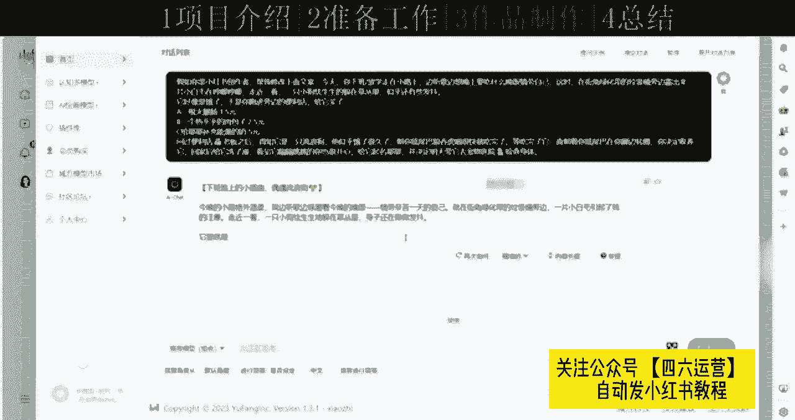

# 【2024实战干货】万粉账号变现千万《小红书快速起号秘籍》，小红书天花板级别教程，当下小红书起号涨粉可用！ - P1 - 憨憨的冰墩墩啊 - BV1Ea37eNEHa

今天呢给大家带来一个小红书的蓝海计划，暴力起号疯狂吸粉的一个项目，这个项目呢可以做到无脑搬运，简单变现，大家都知道啊，小红书运营呢是一门很重要的一个学问，而且呢在小红书呢最快的一个变现方式。

就是我们达到1000粉丝之后呢，开通那个蒲公英来接商单，那很多人呢无论是运营小红书也好，或者说做小红书相关项目也好，都会被这个1000粉丝的这个门槛为难住，那这节课呢就是给大家分享一个暴力起号。

疯狂涨粉的一个小红书的一个蓝海项目，这个项目是叫假装存钱法，具体什么叫假装承接法呢，我们来看一下项目介绍，首先啊咱们先来看一下项目的原理，大家看一下哈，这个蓝海的一个品就叫假装存钱，什么叫假装存钱呢。

现代社会生活节奏都很快，大家也都知道花钱容易，挣钱难，最重要的是呢很难把这个钱存下来，那假装存钱呢，它是一种非常新颖的生活方式，通过假装生活日常来实现一种满足感，假装咱们看了电视，假装咱自己喝了瓶啤酒。

但实际上呢并没有发生这些事，也并没有做这些事，所以呢把这个假装的钱来存起来，这就叫假装存钱，然后呢我们通过设定假装存钱的场景，来进行笔记的创作，引起大众的共鸣，吸引越来越多的小红书的人呢在里面打卡。

来达到疯狂吸粉，疯狂转化的一个过程，所以说这个是一个非常好的一个涨粉，一个运营方法哈，咱们利用这么一个模式呢，粉丝量呢是蹭蹭的往上涨，没有任何问题，然后呢咱们再来看一下项目的一个优势。

咱运营小红书咱是有四个优势给大家总结了，首先咱们看一下哈，那第一个咱发布假装存钱这一专题呢，作品制作非常简单，几分钟就有一个作品，你也不需要杂七杂八的乱七八糟的剪辑拍摄啊，这个都没有。

然后第二个优势呢就是现阶段知道的人很少，做的人更少，竞争呢非常小，这个赛道就不用挤，是一个蓝海玩法，这是第二点优势，第三点优势呢就是能够引发的用户的一些共鸣，所以呢才能做到一个疯狂吸粉。

后面会给大家再具体讲一下啊，非常有趣的一个玩法，呃，最后一点优势就是变现方式多样化，之前前面给大家讲了，咱们运营小红书呢达到1000粉丝是最直观的，收入就是一个蒲，开通蒲公英。

那后面呢还有很多的一些变现方式，之后呢，在后面那几节课了，再给大家具体介绍哈，是通过什么样的方式来变现的，这是一共总结了四点优势，然后呢咱们再来看一下这个收益这一块，这个收益这一块的话。

我是截的是那个蒲公英，开通蒲公英这个橱窗来实现的一个收益，这是最直观的一个收益对吧，也是大家最常见的，所以呢是截了这三张图，这三张图的话是运营了，我下面的人是运营了三个小号。

首先咱们来看一下哈，首先看第一个号，第一个号的话已完成16个接这个商单，然后咱们看了下数据啊，当月现金收入2568，总现金收入是3208，这个做的时间不是很长啊。

基本上的话一个月2000到3000左右的一个收入，是没有任何问题的，这是第一章，咱们再来看一下第二张啊，这个的话是完成的商单多一点，这个运营的时间长一点，这个是完成了43单，然后当月现金收入2500。

总现金收入1万2706，这张的话就是新开的一个号，这个更好更小，嗯这个时间更短，还有一个在进行，这个到截止到目前的当月收入，还1576，是刚开始做起了一个号，所以呢就是这三个号哈，是我下面同一个人做的。

然后我就随便找了一个，就给截了个图，就是想带给大家看一下这三个号，其实你起号的话并不难，达到1000粉丝，并不难，接这个商单呢也并不难，咱运营多个号也不难，难的是什么呢，主要就是一个你执行力的一个问题。

精细化的一个问题，这个啊因为咱运营小红书这个号可以，咱们可以做一个非常好的一个副业，举个例子啊，比方说你就运营了这三个号，你看这个第一张2500，第二张2500，这就5000块钱了。

第三张这个刚起来1576，这就是小6500块钱了，基本上咱就相当于咱上班打工，上班一个月的一个正常工资了吧，基本的话平均工资也就在三四千五六千，这个样子吧，正常的话咱们就按副业来讲的话。

相当于你就多了一份收入，而且大家看一下啊，这三个号的话都是运营的时间不是说很长，尤其是后面这个号这刚起来，所以说后面累积的粉丝量越多，你这个收益会持续持续上涨的，他不是说就局限于这么一两千块钱的。

所以说咱做这个项目的话，稳定性是非常强的，非常好的，只要小红书这个平台对吧，还有你这个你你这个粉丝量多了之后，你这个接商单就会有，这是整体的一个项目介绍这一块，大家好啊。

今天给大家分享的这个小红书蓝海计划，暴力起号，疯狂吸粉的一个项目，然后呢给大家讲一下准备工作，咱们做这个小红书运营的话，咱们就需要准备账号，小红书账号账号的话，咱们先来看一下啊，分这几个方面。

首先第一个就是小红书账号，咱们必须得用正规手机号来注册啊，原则上呢是新号，老号都可以参与都能做，但是呢新号啊是有一定流量扶持的，老号的话就是需要把咱们之前发布的作品哈，给隐藏掉，就是达到一个垂直度。

然后咱们再来看一下养号这一块，无论是新号和老号啊，咱们都必须要养号，养号的话就分为这几部分，首先第一个呢可以适当在小红书商城啊，买一些东西，哪怕说一分一毛都可以，可以增加这个账号的一个权重，第二点。

第二点的话就是每天至少刷30分钟以上，同类型作品关注点赞评论，这句话是什么意思呢，大家注意一下啊，每天至少刷30分钟以上，这个不是说让你一次性直接刷完，你今天就没事了，就不刷了，这个不是的。

咱们可以分多次来刷，比方说你今天上午你刷了10分钟是吧，中午或者说下午刷了10分钟，晚上再刷了10分钟以上，这样多次的来进行刷，可以增加你账号的一个垂直度，这样有什么好处呢，咱们再来咱们再来看一下哈。

首先第一点就是能够提高账号的一个权重，然后第二个就是积累经验素材，你看看别人的同行是吧，是怎么做的，咱们刷同类型作品的话，就是找同行，他是目前是怎么做的，有什么更好的一些方案，咱们可以借鉴一下。

然后最重要的一点呢，就是能够使咱们的流量呢达到一个更加精准化，这是非常重要的一点，这是关于养号，关于小红书养号这一块呢，大家如果说想要知道更细节化的一个东西，可以联系我。

我这边是有一个七天养号法可以给大家参考，然后咱们再来看一下资料的一个设置哈，咱们资料设置的话就是最常见的就是昵称，头像和简介，这个咱们可以参考咱们的同行对标账号，就可以大家看一下哈。

下面的话就是我做的这个对标账号，找了几个同行的一些对标账号，大家首先看一下咳，假装存钱这个领域的话哈是多种多样的，就是如果你在小红书直接搜的话，哈领域有很多嗯，我给大家先看一下吧，哈大家看一下啊。

这是网页版的一个小红书，然后呢我们直接搜假装存钱，然后搜出来之后呢，你大家看一下哈，他这些领域都很多，假装是樱桃小丸子存钱，假装是养这种宠物的哈，假装是跟着甄嬛传来进行存钱，这个都很多很多。

所以呢就是有很多赛道的话是比较拥挤的，所以呢我就给大家找了，这个比较在这个领域比较蓝海，比较热门的一种方法，就是假装养宠物的这种存钱法，这种养宠物的在小红书有什么好处呢。

首先啊咱们要知道小红书这个平台的话，大多都是女性用户为主对吧，女性用户为主，那像女性的话，那就基本上很多人都喜欢养宠物，尤其是小狗这一块，所以呢我们可以就是假装利用假装养这个小狗，宠物来进行存钱。

来吸引这些比较感兴趣的这些用户，来达到一个粉丝的一个年度，想首先咱这个领域假装沉减法对吧，吸引的其实也是一些比较感兴趣的，一些像小女生啊对吧，女性用户假装存钱这种东西，这种东西呢其实很好很有趣。

你会发现嗯，然后呢就很多人就随着这个博主呢，在下面一块打卡，大家看一下啊，都是在里面打卡的，嗯在这个打卡的同时呢，他这个假装存钱是吧，还能存钱，还能吸粉，咱们再选择一个他比较热爱的这个宠物这一块。

小狗这一块，所以说这个效果的话是非常好的啊，还有一个问题啊，就是大家如果说啊，因为我给大家选的这个领域，就是假装养宠物这个领域，这个赛道的话嗯相当于咱这个领域的话，就是在这个假装存钱。

蓝海领域更蓝海的一种玩法，可能后期的话我发出这么一个作品之后呢，可能后面也会很多人都会跟着做，这个假装养小狗的一个分钱，这样赛道可能就会拥挤嗯，那如果说后面大家想做其他领域的话，可以联系我。

可以帮你找一个合适的一个领域，然后咱们再看一下这个给大家找的，这个对标账号啊。

假装想耶耶存钱，咱们姓名的话就可以模仿他的，假装养什么来进行分钱，然后呢这个就可以找到这个小狗的这个头像，然后看一下个人简介，这里是一个致力于存钱的女大学生打卡搞钱，攒钱养小狗啊。

就相当于假装的一个系列，然后第二个就是他就比较直白了，就假装养小狗赚，假装养小狗存钱，这个的话粉丝量一人而万，欢迎进入假装养小狗存钱的一个世界，所以就是利用这种东西呢来进行存钱。

来进行吸粉，非常有趣，到时候大家可以看一下哈，这是这个对标账号还是非常简单的，然后呢需要在需要准备的就是一个记账工具，记账工具是什么呢，你比方说再打开小红书哈，因为咱们是假装存钱嘛。

假装存钱的话虽然是假装，但是你必须得需要真实一点，记账工具，大家看一下啊，就花钱，你买的这些你就直接记账，直接转进去，要么是记账，要么是直接转进去，就是有一个记录对吧，相当于你花了这个钱。

就是你存的这个钱，你起码你心里得有点数，记账工具的话，这个是一个支付宝的一个小荷包，这个的话就可以，我们就是可以备注一下，比方说假装存钱给小狗买点什么吃的喝的是吧，你用的你直接在里面。

在支付宝里面搜索就行啊，搜索支付宝小荷包，然后呢进去之后你就比方说假装吧，花了钱，比方说花了十块钱吧，你又存到这个转了个小荷包里，相当于就存钱了嘛，第二种呢就是利用这个鲨鱼记账，鲨鱼记账呢是一个app。

你到那个应用商店里直接搜索就行，这个的话就是相当于把你每天的一个支出，给记上，比方说你花了多少钱，你直接直接在那个鲨鱼机上来记上多少钱，就是有一个记录，如果你真想利用这个假装存钱这个方方法呢。

真的想存钱的话啊，你就可以额外用一个银行卡准备一个空卡啊，你直接把这个每天假装做的这些钱，花的钱直接转到这个银行卡里，用这个鲨鱼记账来记就行，这是两种方式，大家都可以选择，然后就是美图秀秀跟AI了。

美图秀秀呢就是我们做图片来用的，那AI呢就是咱们在美图秀秀上写文案来做的，写文案的话就是直接用那个AI来直接换就行，大家看一下啊，就差这些文案，因为他也是，因为这也是他们自己做的这个文案嘛。

我们直接复制到那个AI进行生成，这样可以相当于就是咱自己的一个原创了对吧，这是准备工作这一块，大家好啊，今天给大家带来的是小红书蓝海计划，暴力起号疯狂吸粉的一个玩法。

然后这节课呢给大家分享一下那个作品制作啊，实操部分，这个作品制作的话，大家首先来看一下，分为这三个部分，首先第一点你必须需要这个图片，第二点的话就是作品的一个文案，第三点作品笔记的一个发布。

这三点首先咱们先来看一下哈，作品制作，关于这个图片素材这一块，这个图片的话呢，就是这个图片的关于图片的素材哈，这个已经给大家准备好了，在那个项目资料里嗯，咱们直接在那里找就行，这是关于图片素材嗯。

关于这个作品图片啊，在这里跟大家说一下，如果说你有自己的一个渠道，或者说有自己的真有自己一个宠物的话哈，你可以利用这个宠物，或者说利用自己的一个渠道来拍摄，那如果说没有的话。

是我这边是给大家打包了一些那个关于宠物，狗的一些那个图片，在那个项目资料里已经整理好了，咱们直接就去拿就行了，咱们先来看一下啊，咱们可以先找这个小红书里的对标账号，大家看一下，就是里面他们发了几张图片。

关于图片的素材是怎么样的，然后可以模仿同行的，咱们来看一下，我们打开那个手机版的一个小红书上，直接搜索那个假装养，直接搜索，假装养狗存钱，然后就大家看一下啊，直接搜索假装养小狗存钱。

然后就会搜到很多这一系列的，先看这个啊，他这个的话第一天就发了一张图片，大家看一下这个文案啊，下班或放学的路上就找到这么一个小狗嘛，然后你给他买东西，后面就开始养了，那咱们再来看这个哈，养狗日记。

这个他是有那个啥的，他是用的这种漫画版的，他是用了三张图片吗，啊就是那个转入的这个钱记账的钱对吧，评论的有很多都，我以为的养狗，咱直接做图片的就行了，图片呢就是比较好做，这个发的比较多哦。

这种的话这种发的这个图片啊，大家看一下去嗯，打开购物app敲了半天，最终买什么东西，他就把那个鸡胸肉啊，牛肉粒牛肝都带上了，这是整体的一个他们做的一些东西啊，大家可以看一下这里面的一个一些元素啊。

首先咱们可以用放一张宠物狗的一个图片，然后呢第二个就是那个记账的一个图片，第三个呢就是咱们就把那个他这个选择的，ABCD这些图片都加上，我们就可以相当于就把它给细化一下了对吧。

然后呢我们知道大体的一个东西之后，我们就开始做，首先呢咱们找到这个小狗的图片啊。

我们打开美图秀秀，然后把打开美图，打开美图区域之后呢，我们把这个图片给导入进去，这个是个小狗的图片呢，就我是就是在那个给大家分享的，这个网盘里找的，然后你就有需要的话就可以直接去拿就行。

然后呢我们可以加一些东西哈，可以把它更变得好看一些，因为像女性用户的话。

都是比较喜欢好看的一些东西，可以加点贴纸。

就这种贴纸啊，包括边框啊，咱们随便加就行。

嗯这样吧，或者说你再加一些滤镜都可以，嗯做完这个图片之后，我们就保存咱们图片做好之后呢，我们就可以做这个文案了，文案我们再打开这个网页版啊，再来看一下他们这个文案是怎么做的，因为咱是第一天做嘛。

得看第一天的，这个吧这个点赞量挺高的，大家看一下啊，可以把这个文案给复制下来，咱们复制好文案之后呢，我们就打开那个AI来，相当于给咱做一下这个调整，AI的话，我是用的这个哈。

如果说大家有这个大家有这个AI渠道的话，可以直接用，如果没有的话，可以联系我一下，首先我们需要给AI输入一段指令哈，就是假如你是小红书创作者，帮我修改下面文案，然后我们就粘贴直接发送。

这是AI生成的一个文案哈，然后呢就是我们可以把这个ABC，他不是这个选择吗，我们可以这个再修改一下，再自己再创一下，可以使这个原创度呢就更高，啊他把那个啊他把那个这个话题都已经弄好了。

大家看一下，如果说有想换这种再换这种角度的话，可以再给他再换一下。

引人入胜的待询问。

就是我们就根据这些文案来进行修改就行，我们就用这个文案吧，复制复制好之后呢，我们发布作品的时候啊，就把这个文案再稍微修改一下，我们就按那个在手机上来发吧啊复制，然后发到手机上，把这个文案来。

咱们来看一下啊，然后把那个文案复制到备忘录，我们再稍微做一下，修改标题，他都给咱弄好了，就在这一段啊，于是我跑到，于是我跑去旁边的便利店给他买了一根火腿肠，这个可以修改一下，给他买了。

然后选ABCDABC就跟他一样，A，一根火腿肠，咱就再修改一下，那就按两块，一个大包子，这个是B换行，一个大包子咱就按三块。

一个大肉包子，然后咱们再来看一下那个小红书哈，他那个咱们模仿的这个对标账号。

嗯这网有点卡，他C是那个补充能量的奶，来，咱们这样看啊，这样看就方便，C是那个补充能量的奶奶，咱说牛奶吧，三元这样，然后把下面这段话删了啊，然后大家再看一下哈，就是文案的话，你做好之后，你必须得看一下。

咱们是二创的，这个对标同行的，你看一片小白毛，这个咱们看看可以看一下啊，一只小狗可以改成，因为咱们做的它不一定是小白毛的这种小狗，一只啊可以改成一只毛茸茸的东西，然后咱们再来看一下，给它取了个名字对吧。

因为他这个咱们对标的这个账号是叫耶耶，假装养爷爷存钱，咱们可以比方说咱名字叫假装养贝贝，存钱不也行吗，给他取了个名字叫贝贝对吧，这样修改就可以了，这样的话我们这个文案就做好了，做好之后啊。

咱那个图片他准备好了，这文案准备好了，接下来就是发布作品了，嗯但是有一点啊，先给大家再说一下，他是不是有那个ABC这个选项吗，一根火腿肠，一个大肉包子，还有那个牛奶，如果说你想再增加再增加几张图片的话。

可以根据这几个来开始增加，然后还有那个花掉的这个钱哈，这个花掉这个钱就给大家截图演示一下啊，比方说咱花掉了这个牛额，花的比方说咱们花掉了这个大肉包子三块哈，我们打开这个鲨鱼记账来进行寄钱，打开之后呢。

我们直接点这个中间接上，这边是有一个宠物对吧，备注，买了给贝贝买了一个大书包子，这大肉包子是三块钱，咱们直接三块，这样截图截图之后呢，我们就这个把它稍微截一下啊，稍微修修改一下，回到照片。

然后有了这个宠物狗的一个图片，有了这个记账图片，我们就可以发布作品了，然后我们把这个文案给复全选，复制打开小红书，打开小红书之后呢，我们就点这个加号发布作品，然后呢。

我们就把这个咱们之前准备好的图片给放上去，就后面的选项图片啊，我就不给大家示范了，为了节省时间，这个大家直接在网上百度啊，淘宝啊，直接搜截图就行了，嗯然后我们给它粘贴粘贴的话，这个是标题哈。

这样的话这个文案就做好了，做好之后大家看一下啊，这个话题咱们可以再加一下，假装，存钱对吧，可以添加几个这样这样的话题，然后呢我们可以再细节一下啊，就是这边不是有一个投票吗，投票组件添加，你跑进，便利店。

买什么，也就选择A火腿肠，B打肉包子，C牛奶，这样呢可以跟那个用户来进行互动哈，可以让他们投票，然后呢跟咱那个笔记你一块进行打卡，增加粉丝的一个粘性，然后都设置好之后，我们直接发布笔记就可以了。

这是整体的一个实操部分，非常简单，大家好啊，最后一节课呢给大家讲一下，这个项目的一个总结，总结的话哈，我是给大家找了两个部分，第一是那个变现方式，第二是那个注意事项，咱们首先大概看一下这个变现方式。

变现方式的话哈，大家看一下他那个咱们账号运营起来之后呢，这四种变现方式都可以，首先第一个蒲公英商单，这个是最常见的，就是达到这个1000粉丝之后呢，前期咱们可以慢慢积累粉丝，达到要求之后。

平台会直接给咱发送这个邀请通知，咱们直接加入，根据那个步骤操作就行，非常简单嗯，这一点还需要注意一下啊，一开始的话他这个商单价格不不是特别高啊，就是100~150左右，随着粉丝量增加呢，价格会越来越高。

就慢慢积累呗对吧，然后第二点的话就是接广告的一个变现，账号起来之后呢，也会有其他商家直接从后台或者说私信啊，联系你接广告变现，比方说什么狗粮的是吧，这种相关的，因为咱说的这个账号就是这种相关类型的。

这种商家的话，可能后期会联系咳咳，第三种变现方式的话，就是开通小红书的一个店铺，店铺的话就是你可以发布一些关于这个，咱们做的这些笔记，相关笔记的一些相关商品，比方说什么咱养小狗吧。

狗粮的日常用的这些狗狗日常用的这些都可以，然后最后一点的话就是收图的一个变现，这也是最直接的一个方式，咱们把这个项目整体哈融会贯通之后，熟悉之后呢，咱们可以卖这个课程来进行变现，你教给他们方法。

他们给你这个收益知识，付费搜图卖项目，基本上就是做项目不如卖项目嘛对吧，这个有需要相关了解的可以联系我，然后咱们再来看一下注意事项，咳咳注意事项的话，大家看一下哈，给大家总结了两点作品。

每天坚持发布一到两条作品，每天坚持发哈，这这种作品的话制作非常简单，你有AI有这个图片给你准备好了对吧，你直接做就行，几分钟一个非常简单，也不浪费时间，然后第二点的话就是在咱们笔记发布的时候。

模仿对标账号这种相关的这些标题，还有话题来打这个标签，看看他们同行是怎么来做的，大家养号的时候可以多看一下，然后还有一点的话啊，刚想起来给大家说明一点，就是因为咱做的是这个宠物狗这种领域的嘛。

就是狗宠物狗的图片，跟笔记跟所有笔记，保持一致，这个是什么意思呢，就是咱这个狗的这个图片啊，你比方说你自己找素材也好，或者说是用我的素材也好，你找到一个狗之后，你别再换了，你比方说你今天你就咱做了。

虽然假装分钱嘛是吧，咱必须跟客户产生这种共鸣吗，你今天比方说你用个泰迪的，明天用个金毛的对吧，那就不大好了，就是这么个意思，大家大家自己那个体会就行了，好这就是整体的一个课程。

到这里就结束了。